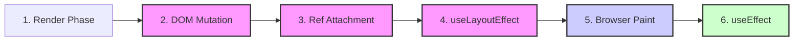
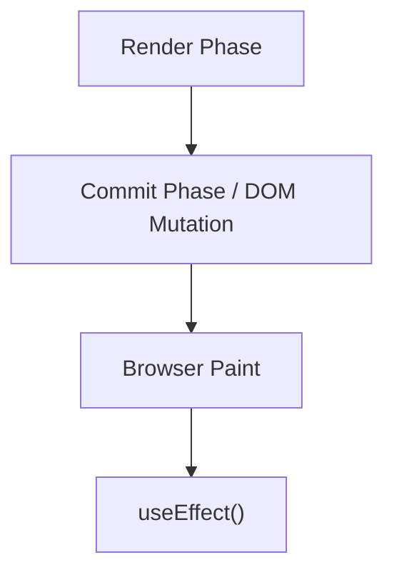
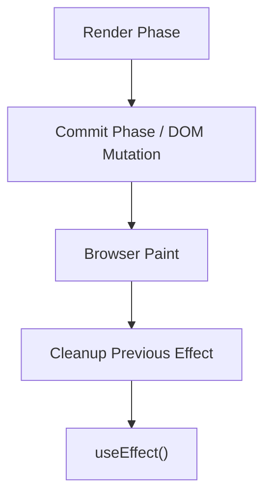
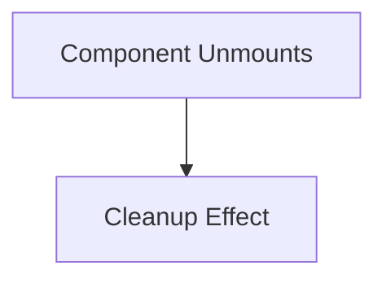

# React Internals: The Layout Phase & `useLayoutEffect`

Understanding the window between DOM updates and the browser paint is crucial for advanced React development. This is where `useLayoutEffect` and Ref attachments reside.

---

## 🚀 The Execution Flow

React's lifecycle from render to paint follows a strict sequence:



### 1. Render Phase

React calculates what should change (Virtual DOM diffing). This is pure and should not have side effects.

### 2. DOM Mutation

React performs the actual updates to the DOM.

### 3. Ref Attachment (Synchronous & Blocking)

- **What happens:** Refs are attached to their corresponding DOM nodes here.
- **Why it matters:** After this step, `ref.current` reliably points to the correct updated DOM element.
- **Key takeaway:** Reading a ref during the **Render Phase** is unreliable because the DOM may not exist yet. The Layout Phase is when `ref.current` becomes accurate.

### 4. `useLayoutEffect` Callbacks (Synchronous & Blocking)

- **Timing:** Runs after DOM updates but **before** the browser paints.
- **Execution Order:**
  - Cleanup functions from the previous render run first.
  - New `useLayoutEffect` callbacks fire next.
  - They run in **child-first, parent-last** order (children complete layout work before parents).
- **Blocking:** The browser cannot paint until these callbacks finish. Heavy work here will delay what the user sees.

### 5. Browser Paint

The browser paints the updated screen based on the mutations and layout adjustments.

### 6. `useEffect` (Asynchronous & Non-blocking)

Runs asynchronously after the browser has painted. Ideal for side effects that don't affect the immediate layout (e.g., API calls, logging).

---

## 🛠️ `useLayoutEffect` vs `useEffect`

| Feature         | `useLayoutEffect`                       | `useEffect`                        |
| :-------------- | :-------------------------------------- | :--------------------------------- |
| **Timing**      | After DOM updates, **before** paint     | After DOM updates, **after** paint |
| **Execution**   | Synchronous                             | Asynchronous                       |
| **Impact**      | **Blocking**: Delays visual updates     | **Non-blocking**: Fluid UX         |
| **Primary Use** | Measurements, positioning, sync updates | API calls, subscriptions, logging  |

---

## 🔄 Detailed `useEffect` Lifecycle Flow

It is a common misconception that `useEffect` is a direct equivalent to class lifecycle methods. Instead, think of it as a synchronization mechanism that runs in specific sequences.

### 1. Initial Mount



### 2. Update (Re-render)

If dependencies change, the previous effect is cleaned up **before** the new effect runs.



### 3. Unmount



### Summary of the Flow:

- **Mount:** Render → Commit → Paint → **Effect**
- **Update:** Render → Commit → Paint → **Cleanup** → **Effect**
- **Unmount:** **Cleanup**

---

## 🧠 Reference Equality & Immutability

If JavaScript compared objects by value, React would have been designed very differently. React relies on **Reference Equality** to determine when to re-render.

### 1. The JavaScript "Quirk"

In JavaScript, objects and arrays are compared by their memory address (Reference), not their contents.

```javascript
{} === {} // false
[] === [] // false
```

### 2. The Mutation Trap (Wrong Way) ❌

When you mutate an object directly, its reference remains the same.

```javascript
// user points to Object A (ID: #101)
user.name = 'Cena';
setUser(user);
```

**Result:** React sees `Object A` (Before) and `Object A` (After). Since the references are identical, React assumes nothing changed and **may skip the re-render**.

### 3. The Immutable Approach (Right Way) ✅

React encourages creating a new reference to signal a change.

```javascript
setUser((prevUser) => ({
  ...prevUser, // Spread creates Object B (ID: #202)
  name: 'Cena',
}));
```

**Result:** `Object A !== Object B`. React detects the new reference and triggers a re-render.

### 💡 Why This Matters (Optimizations)

This simple behavior enables extremely fast performance checks in:

- **`React.memo`**: Skips re-rendering a component if props (references) haven't changed.
- **`useMemo` / `useCallback`**: Cache values or functions until a dependency reference changes.
- **`shouldComponentUpdate`**: Traditional way to optimize class components.

**Key Takeaway:** React doesn't care that "John" became "Cena"; it cares that `Object A` became `Object B`.

---

## 🕵️ The Triple API Call Mystery

You have a `useEffect` with an empty dependency array `[]`. In development, you expect 1 call, but you see **3 API calls** in the network tab. Why?

### The Breakdown: 1 → 2 → 3

#### Call 1 & 2: React 18 StrictMode

React 18's `StrictMode` intentionally double-invokes effects in development to ensure your cleanup logic is correct.

- **Call 1:** Initial mount.
- **Call 2:** React unmounts and remounts the component instantly.

#### Call 3: The "Leak" in Data Flow

If you see a **third** call, it's not React 18 being "extra." It's a signal that your component is being unmounted and remounted a **third time** due to an external trigger.

### Common Culprits for the 3rd Call:

1.  **State Uplifting Loops:** `useEffect` calls `setData()`, which updates a parent component's state, causing the parent to re-render and potentially recreate your component (e.g., if a `key` prop changes).
2.  **Key Prop Resets:** A parent component is resetting the `key` prop of your component, forcing a full destroy/rebuild.
3.  **Non-Memoized Props:** You are receiving a function or object prop that is recreated on every render in the parent, and that prop is used in a way that triggers a remount.
4.  **Context Providers:** An external provider or custom hook is firing a separate update that forces your component to re-initialize.

**The Fix:** Check your parent re-renders and ensure you aren't accidentally triggering a "reset" of your component's lifecycle.

---

## 💡 Best Practices

### When to use `useLayoutEffect`:

- **DOM Measurements:** Reading layout (e.g., `getBoundingClientRect()`).
- **Layout Calculations:** Adjusting styles based on measurements.
- **Imperative Updates:** Updates that must be invisible to the user (to prevent flickering).
- **Specific fixes:** Tooltip positioning, scroll adjustments.

### Why this matters:

1.  **Avoid Jank:** Now you know why `useLayoutEffect` can cause visible delays if misused.
2.  **Ref Safety:** You understand why `ref.current` is only reliable after the Layout Phase starts.
3.  **UI Correctness:** You can use the right tool for tooltip positioning and scroll adjustments to ensure a polished user experience.

---

### 𝗧𝗵𝗲 𝘀𝗶𝗺𝗽𝗹𝗲 𝘄𝗮𝘆 𝘁𝗼 𝗿𝗲𝗺𝗲𝗺𝗯𝗲𝗿 𝗶𝘁:

- **`useLayoutEffect`:** DOM updated, **before** paint, synchronous, blocking.
- **`useEffect`:** DOM updated, **after** paint, asynchronous, non-blocking.
