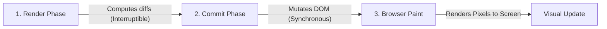
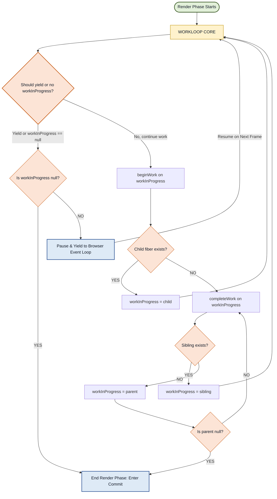

# React Deep Dive: Core Engine & Architecture

Most React developers can build components, manage state, and wire up effects, but few understand what React is actually doing beneath the surface.

- **Why does a deeply nested component tree sometimes make your UI feel sluggish?**
- **Why does `useEffect` fire after the browser paints, but `useLayoutEffect` fires before?**
- **Why does `React.memo` skip a re-render in one situation but not another?**

The answers to all of these questions live in React's internals—specifically, in the **Fiber architecture** that was introduced in React 16 and has been the foundation of every major React feature since, including Concurrent Mode, Suspense, `startTransition`, and the React Compiler introduced in React 19.

This guide takes you on a complete journey through React's rendering engine. We start with why the original Stack Reconciler had to be replaced, move through every stage of the Fiber architecture, and end with a deep understanding of the Commit Phase and how effects are run. By the end, you'll have a mental model that makes React's behaviour feel predictable and not magical.

> [!NOTE]
> This document is part of our **React Deep Dive Series**. Navigate the deep dives here:
>
> - **[React Layout & General Internals](./index.md)**
> - **[Part 1: Core Engine & Architecture (This Document)](./React_Deep_Dive_Internals.md)**
> - **[Part 2: Advanced Concurrency & Hooks](./React_Deep_Dive_Advanced.md)**
> - **[Part 3: Interview Grill Questions & Timing Cheat Sheet](./React_Deep_Dive_Cheat_Sheet.md)**

---

## Table of Contents

- [React Deep Dive: Core Engine \& Architecture](#react-deep-dive-core-engine--architecture)
  - [Table of Contents](#table-of-contents)
  - [Executive Summary: React's Rendering Engine at a Glance](#executive-summary-reacts-rendering-engine-at-a-glance)
  - [1. What is `useRef` and its deeper role in React?](#1-what-is-useref-and-its-deeper-role-in-react)
    - [Depth-Level Explanation](#depth-level-explanation)
      - [Mental Model](#mental-model)
    - [When to Use `useRef`](#when-to-use-useref)
      - [1. DOM Access (Imperative Bridge)](#1-dom-access-imperative-bridge)
      - [2. Persisting Mutable Values (Across Renders)](#2-persisting-mutable-values-across-renders)
      - [3. Avoiding Stale Closures (Latest Value Pattern)](#3-avoiding-stale-closures-latest-value-pattern)
        - [Code Example:](#code-example)
    - [Staff-Level Distinction](#staff-level-distinction)
    - [Common Staff-Level Use Cases](#common-staff-level-use-cases)
    - [Anti-Patterns](#anti-patterns)
    - [Strong Interview/Staff Answer](#strong-interviewstaff-answer)
  - [2. React Virtual DOM \& Reconciliation](#2-react-virtual-dom--reconciliation)
    - [Staff-Level Deep Dive: VDOM Diffing vs. Myers' and Zhang-Shasha Algorithms](#staff-level-deep-dive-vdom-diffing-vs-myers-and-zhang-shasha-algorithms)
      - [Q1: VDOM Diffing vs. Git Diff (The Algorithms)](#q1-vdom-diffing-vs-git-diff-the-algorithms)
      - [Comparison Matrix: VDOM Diffing vs. Classical Algorithms](#comparison-matrix-vdom-diffing-vs-classical-algorithms)
        - [1. Eugene Myers' Sequence Diffing Algorithm (1986)](#1-eugene-myers-sequence-diffing-algorithm-1986)
        - [2. The Zhang-Shasha Tree Edit Distance Algorithm (1989)](#2-the-zhang-shasha-tree-edit-distance-algorithm-1989)
      - [3. React's $O(N)$ Heuristic Diffing](#3-reacts-on-heuristic-diffing)
      - [Q2: How Git Diff Scales](#q2-how-git-diff-scales)
      - [Q3: How Virtual DOM Diff Scales](#q3-how-virtual-dom-diff-scales)
        - [React's Two-Pass List Reconciliation (No Sequence Diffing)](#reacts-two-pass-list-reconciliation-no-sequence-diffing)
      - [Q4: Reconciler vs. Compiler (Svelte's Compile-Time Reactivity)](#q4-reconciler-vs-compiler-sveltes-compile-time-reactivity)
      - [Q5: Pull-Based Reconciler (React) vs. Fine-Grained Push-Based Reactivity (SolidJS)](#q5-pull-based-reconciler-react-vs-fine-grained-push-based-reactivity-solidjs)
      - [Q6: Why is DOM Manipulation Slow? (Reflow vs. Repaint)](#q6-why-is-dom-manipulation-slow-reflow-vs-repaint)
      - [Q7: The Relationship between VDOM Diffing and React Reconciliation](#q7-the-relationship-between-vdom-diffing-and-react-reconciliation)
        - [How React Uses Both in Tandem (The Pipeline)](#how-react-uses-both-in-tandem-the-pipeline)
      - [Q8: Execution Timing of Reconciliation Steps \& Handling Large Content Updates](#q8-execution-timing-of-reconciliation-steps--handling-large-content-updates)
        - [1. Scheduling Phase (Lanes Assignment)](#1-scheduling-phase-lanes-assignment)
        - [2. Render Phase (Component Invocation \& VDOM Diffing)](#2-render-phase-component-invocation--vdom-diffing)
        - [3. Commit Phase (DOM Mutation Writes)](#3-commit-phase-dom-mutation-writes)
        - [4. Post-Commit Browser Reflow \& Repaint](#4-post-commit-browser-reflow--repaint)
    - [Constructive vs. Heuristic Algorithms in System Design](#constructive-vs-heuristic-algorithms-in-system-design)
      - [1. Constructive Algorithms](#1-constructive-algorithms)
      - [2. Heuristic Algorithms](#2-heuristic-algorithms)
      - [Core Difference](#core-difference)
      - [Simple Analogy](#simple-analogy)
      - [Important Note](#important-note)
  - [3. React Fiber Architecture \& The Rendering Pipeline](#3-react-fiber-architecture--the-rendering-pipeline)
    - [1. The Stack Reconciler Era (Pre-v16)](#1-the-stack-reconciler-era-pre-v16)
      - [The Main Thread Hostage Crisis](#the-main-thread-hostage-crisis)
      - [The 16.67ms Frame Budget](#the-1667ms-frame-budget)
      - [Why Tree Recursion is Uninterruptible](#why-tree-recursion-is-uninterruptible)
    - [2. The Fiber Reconciler Revolution (v16+)](#2-the-fiber-reconciler-revolution-v16)
      - [The Key Insight](#the-key-insight)
      - [What is a "Fiber"?](#what-is-a-fiber)
        - [Real-world Anatomy: How a Fiber Node looks in Console](#real-world-anatomy-how-a-fiber-node-looks-in-console)
      - [The Linked List Tree Structure \& Depth-First Traversal](#the-linked-list-tree-structure--depth-first-traversal)
        - [How the Depth-First Traversal Works:](#how-the-depth-first-traversal-works)
      - [Core Reconciliation Rules during Traversal](#core-reconciliation-rules-during-traversal)
      - [What Fiber Added: Interruptibility \& Incremental Execution](#what-fiber-added-interruptibility--incremental-execution)
        - [Why This Matters to Architects:](#why-this-matters-to-architects)
      - [Double Buffering (Current vs. WorkInProgress Trees)](#double-buffering-current-vs-workinprogress-trees)
    - [3. The Three-Stage Rendering Pipeline](#3-the-three-stage-rendering-pipeline)
      - [Deep Dive: The Render Phase](#deep-dive-the-render-phase)
        - [Anatomy of React's Render Phase (Flowchart)](#anatomy-of-reacts-render-phase-flowchart)
        - [1. `beginWork`](#1-beginwork)
        - [2. `completeWork`](#2-completework)
        - [Why This Matters:](#why-this-matters)
      - [Phase 2: Commit (Synchronous \& Uninterruptible)](#phase-2-commit-synchronous--uninterruptible)
        - [1. How the Effects List is Compiled (Bottom-Up)](#1-how-the-effects-list-is-compiled-bottom-up)
        - [2. The Commit Phase Execution Loops](#2-the-commit-phase-execution-loops)
          - [2.1 Before Mutation Phase — Capturing the DOM Snapshot](#21-before-mutation-phase--capturing-the-dom-snapshot)
          - [2.2 Mutation Phase — Deletions, Placements, and Updates in Order](#22-mutation-phase--deletions-placements-and-updates-in-order)
          - [2.3 Layout Phase — Why `useLayoutEffect` Runs Before Paint](#23-layout-phase--why-uselayouteffect-runs-before-paint)
          - [2.4 Passive Effects — Why `useEffect` Runs After Paint](#24-passive-effects--why-useeffect-runs-after-paint)
        - [3. Why the Effects List is Important](#3-why-the-effects-list-is-important)
      - [Phase 3: Browser Paint](#phase-3-browser-paint)
        - [Why This 3-Phase Split Matters to Architects:](#why-this-3-phase-split-matters-to-architects)
    - [4. The Scheduler \& Time Slicing Mechanics](#4-the-scheduler--time-slicing-mechanics)
      - [The Shift to Cooperative Rendering](#the-shift-to-cooperative-rendering)
      - [What Time Slicing Enables](#what-time-slicing-enables)
      - [Why Not requestIdleCallback?](#why-not-requestidlecallback)
      - [The MessageChannel Work Loop](#the-messagechannel-work-loop)
        - [Why This Matters to Architects:](#why-this-matters-to-architects-1)
  - [4. Controlled vs Uncontrolled Components](#4-controlled-vs-uncontrolled-components)
  - [5. React Strict Mode](#5-react-strict-mode)
  - [6. React State Management Quirks: The Merge Trap, Batching, \& Derived State](#6-react-state-management-quirks-the-merge-trap-batching--derived-state)
    - [Q1: The Merge Trap](#q1-the-merge-trap)
    - [Q2: Batching State Updates](#q2-batching-state-updates)
    - [Q3: Derived State vs. Synchronized State](#q3-derived-state-vs-synchronized-state)
  - [7. `useSyncExternalStore`: Deep Dive](#7-usesyncexternalstore-deep-dive)
    - [The Hook Signature](#the-hook-signature)
    - [Key Parameters \& Strict Architectural Rules](#key-parameters--strict-architectural-rules)
    - [What is "Tearing"?](#what-is-tearing)
    - [Real-world Implementations](#real-world-implementations)
      - [1. Subscribing to a Browser API (Network Status)](#1-subscribing-to-a-browser-api-network-status)
      - [2. Subscribing to a Custom External Store (Store Pattern)](#2-subscribing-to-a-custom-external-store-store-pattern)
  - [8. Tricky React Hook \& State Scenarios (Senior/Staff Level)](#8-tricky-react-hook--state-scenarios-seniorstaff-level)
    - [Q1: Lazy State Initialization (Function vs. Direct Execution)](#q1-lazy-state-initialization-function-vs-direct-execution)
    - [Q2: `useEffect` vs. `useLayoutEffect` vs. `useInsertionEffect`](#q2-useeffect-vs-uselayouteffect-vs-useinsertioneffect)
    - [Q3: Resetting State via the `key` Prop](#q3-resetting-state-via-the-key-prop)
    - [Q4: Stale Closures \& The Dependency Array Trap](#q4-stale-closures--the-dependency-array-trap)
    - [Q5: Why React 18 Removed the "Unmounted Component State Update" Warning](#q5-why-react-18-removed-the-unmounted-component-state-update-warning)
  - [9. The Effect Quiz](#9-the-effect-quiz)
    - [Q1: The Timing](#q1-the-timing)
    - [Q2: The Infinite Loop](#q2-the-infinite-loop)
    - [Q3: Reference Equality in Dependencies](#q3-reference-equality-in-dependencies)
    - [Q4: Tricky Addition — The Effect Cleanup Closure Trap](#q4-tricky-addition--the-effect-cleanup-closure-trap)
  - [10. JSX Under the Hood \& Rendering Quirks](#10-jsx-under-the-hood--rendering-quirks)
    - [Q1: JSX Under the Hood](#q1-jsx-under-the-hood)
    - [Q2: Capital Letters in Component Naming](#q2-capital-letters-in-component-naming)
    - [Q3: The Stray "0" Bug](#q3-the-stray-0-bug)
    - [Q4: Tricky Addition — The Fragment Key Trap](#q4-tricky-addition--the-fragment-key-trap)
  - [11. Senior/Staff Level Deep Dive: Context Performance, Suspense Internals, RSC vs. SSR, \& Dynamic Chunk Loading](#11-seniorstaff-level-deep-dive-context-performance-suspense-internals-rsc-vs-ssr--dynamic-chunk-loading)
    - [Q1: The Context API Re-render Problem \& Staff-Level Optimization](#q1-the-context-api-re-render-problem--staff-level-optimization)
    - [Q2: Suspense Under the Hood (The Thrown Promise Pattern)](#q2-suspense-under-the-hood-the-thrown-promise-pattern)
    - [Q3: Code Splitting Chunk Failures \& Resilience](#q3-code-splitting-chunk-failures--resilience)
    - [Q4: React Server Components (RSC) vs. Server-Side Rendering (SSR)](#q4-react-server-components-rsc-vs-server-side-rendering-ssr)
  - [12. Component Logic Reuse: Custom Hooks vs. HOCs vs. Render Props \& Callback Refs](#12-component-logic-reuse-custom-hooks-vs-hocs-vs-render-props--callback-refs)
    - [Q1: The Evolution of Logic Reuse (Why Hooks Replaced HOCs \& Render Props)](#q1-the-evolution-of-logic-reuse-why-hooks-replaced-hocs--render-props)
    - [Q2: Callback Refs vs. `useRef`](#q2-callback-refs-vs-useref)
    - [Q3: The Cost of Over-Memoization (`useCallback` / `useMemo` Anti-Patterns)](#q3-the-cost-of-over-memoization-usecallback--usememo-anti-patterns)
    - [Navigation:](#navigation)

---

## Executive Summary: React's Rendering Engine at a Glance

Every time a re-render is triggered, React coordinates updates across three distinct stages:

1. **Render Phase:** React evaluates components, runs reconciliation, and computes changes. (Interruptible & asynchronous).
2. **Commit Phase:** React applies computed changes to the DOM. (Synchronous & uninterruptible).
3. **Painting Phase:** The browser calculates styles, runs layout rules, and paints/rasterizes pixels onto the screen.

Here is a quick architectural recap of the key systems that make this rendering engine work under the hood:

- **React Fiber & Fiber Nodes:** React's internal architecture that breaks rendering work into small, incremental chunks. Every component, DOM tag, and UI element is represented by a heap-allocated **Fiber Node** tracking its state, props, parent/child links, and side-effects.
- **Depth-First Traversal (DFS):** During reconciliation, React walks the Fiber tree using a predictable, top-down Depth-First Search (DFS) on the singly-linked list structure. This guarantees that each component and its children are processed before React moves to siblings.
- **The WorkLoop, beginWork & completeWork:** The work loop is the core of reconciliation, processing one node at a time. For each node, `beginWork` determines what changes are needed (creating child fibers or skipping/reusing unchanged components), and `completeWork` finalizes the node (building DOM nodes in memory and compiling side-effect flags into the **Effects List**).
- **Time Slicing:** A cooperative multitasking design that checks the remaining time budget (5ms slices) per fiber. If the budget is exhausted, React yields control back to the browser event loop to handle user inputs, then resumes rendering on the next frame without losing progress.
- **Lanes & ChildLanes:** A bitmask priority representation. **Lanes** assign priority levels to individual updates, enabling React to batch similar updates or prioritize urgent typing tasks while deferring lower-priority transition updates. **ChildLanes** bubble up priority flags, enabling React to check subtree updates and skip traversing entire un-updated subtrees in $O(1)$ time.

---

## 1. What is `useRef` and its deeper role in React?

**Question:** Beyond simple autofocus, what is the core purpose of `useRef`, when should we use it, and how does it relate to the component lifecycle?

**Answer:**
`useRef` is a persistent, mutable container that survives re-renders without causing re-renders when updated.

`useRef` returns a mutable ref object whose `.current` property is initialized to the passed argument. The returned object will persist for the full lifetime of the component.

---

### Depth-Level Explanation

`useRef` provides stable instance-level storage across renders. It acts as an escape hatch from React’s declarative, unidirectional render flow.

It is primarily used for:

1. **Retaining mutable values** without triggering reconciliation (re-renders).
2. **Accessing imperative DOM APIs** directly.
3. **Avoiding stale closures** in asynchronous callbacks, event handlers, and subscription scenarios.
4. **Storing non-visual runtime state** that does not affect what is rendered on screen.

#### Mental Model

```javascript
// Under the hood, you can think of it as a simple object:
const ref = {
  current: value,
};
```

React guarantees that the object reference (`ref`) remains **exactly the same** (referential identity) between render cycles. The core difference between writing a local object `const x = { current: 0 }` inside a component vs. `const x = useRef(0)` is that the local object is recreated on every single render, whereas `useRef` returns the exact same object reference on every render.

**Key Property:**

```javascript
ref.current = newValue; // Mutating this does NOT trigger a render
```

---

### When to Use `useRef`

#### 1. DOM Access (Imperative Bridge)

```typescript
const inputRef = useRef<HTMLInputElement>(null);

// Trigger focus imperatively
inputRef.current?.focus();
```

_Provides an imperative bridge to access native browser DOM methods that cannot be handled declaratively._

#### 2. Persisting Mutable Values (Across Renders)

```javascript
const renderCount = useRef(0);
renderCount.current++;
```

Useful for:

- **Timers/Intervals:** Storing `setInterval` or `setTimeout` IDs to clear them later.
- **Previous Values:** Tracking the previous state or props value.
- **WebSockets:** Keeping a persistent socket instance alive.
- **Observers:** Holding references to `IntersectionObserver`, `ResizeObserver`, or `MutationObserver` instances.
- **Caches:** Maintaining lightweight, volatile in-memory caches.
- **Abort Controllers:** Preserving a reference to `AbortController` to cancel ongoing fetches.

#### 3. Avoiding Stale Closures (Latest Value Pattern)

When callback functions (such as event handlers, timers, or subscription callbacks) are registered inside hooks with empty dependency arrays (`[]`), they capture the variables from the render cycle in which they were declared. If the component re-renders with new state or props, these asynchronous callbacks continue to read the outdated (stale) values from the initial render closure.

By storing the changing state or prop value in a mutable reference (`ref.current = state`) on every render, the asynchronous closure can reference the mutable `ref.current` pointer. Since the object reference remains stable and its `.current` property is mutated on every render, the closure always reads the absolute latest value without needing to re-register or run again.

##### Code Example:

```javascript
const [count, setCount] = useState(0);
const latestCountRef = useRef(count);

// Keep the ref in sync on every render
latestCountRef.current = count;

useEffect(() => {
  const handleTick = () => {
    // If we logged 'count' directly, it would always print 0 (stale closure)
    console.log('Latest count value:', latestCountRef.current);
  };

  const intervalId = setInterval(handleTick, 1000);
  return () => clearInterval(intervalId);
}, []); // Empty dependencies: this effect runs exactly once on mount
```

---

### Staff-Level Distinction

| Hook / Variable    | Causes Render | Persistent | Mutable                             |
| :----------------- | :-----------: | :--------: | :---------------------------------- |
| **`useState`**     |      ✅       |     ✅     | via setter (Immutable update)       |
| **`useRef`**       |      ❌       |     ✅     | ✅ (Direct mutation via `.current`) |
| **Local Variable** |      ❌       |     ❌     | ✅ (Recreated on every render)      |

> [!IMPORTANT]
> **Key Architectural Rule:**
>
> - If the **UI depends on the value** $\rightarrow$ Use **`useState`**
> - If the **UI / render output does NOT depend on the value** $\rightarrow$ Use **`useRef`**
>
> This distinction is what separates good React architecture from accidental anti-patterns (such as triggering infinite render loops or displaying desynced UI).

---

### Common Staff-Level Use Cases

- **Debounced/Throttled Callbacks:** Persisting timer IDs to control search input dispatch.
- **Measuring Performance:** Capturing high-resolution start/end timestamps to benchmark execution.
- **Caching Expensive Objects:** Retaining references to heavy third-party objects (e.g., Map engines, Charting libs).
- **Preventing Duplicate Requests:** Storing a flag (e.g., `isFetching.current = true`) to reject double-clicks.
- **Stable Singleton Instances:** Initializing singletons on initial render without recreating them.
- **Interop with Third-Party Libraries:** Storing non-React class instances or DOM-manipulating helper classes.
- **Escape Hatch for Imperative Flows:** Coordinating animations or manual page scrolls directly.

---

### Anti-Patterns

- **Using `useRef` as Hidden State:**
  ```javascript
  // ❌ ANTI-PATTERN
  ref.current = data;
  // ... while the UI render output depends on it!
  ```
  **Why it fails:** Since mutating `ref.current` does not trigger reconciliation, the UI will not update to reflect the change. This leads to:
  - **Desynced UI:** The screen shows old data while internal memory has updated.
  - **Impossible Debugging:** Code flows behave unpredictably because React's declarative state-to-UI relationship is broken.
  - **Broken React Mental Model:** Violates the core paradigm of "UI as a function of State."

---

### Strong Interview/Staff Answer

> `"useRef is React's mechanism for stable, mutable instance storage that does not participate in rendering or trigger reconciliation. I use it for imperative DOM handles, asynchronous flow coordination, stale closure avoidance (the latest-ref pattern), and preserving non-visual runtime state that shouldn't trigger expensive component tree re-evaluations."`

**Key Use Cases (Architectural Depth):**

1. **Persisting values across re-renders without triggering a re-render:** Unlike `useState`, updating a ref doesn't trigger a component update. This is ideal for storing IDs (like timers), previous props/state, or any value that is needed for logic but not for rendering.
2. **Accessing the DOM directly:** For managing focus, text selection, or integrating with third-party DOM libraries (e.g., D3.js, Google Maps).
3. **Storing "Instance Variables" in Functional Components:** In class components, we used `this.myVar` for instance fields. In functional components, `useRef` acts as the direct conceptual equivalent.

**Explain Me (The "Deep Dive"):**
The fundamental difference between `const x = { current: 0 }` inside a component and `const x = useRef(0)` is **referential identity**. If you declare a plain object inside the component, it is recreated on every render. `useRef` guarantees that you get the _same_ object instance on every render. This makes it a synchronization mechanism for state that is external to the React render-loop (reconciliation).

---

---

## 2. React Virtual DOM & Reconciliation

**Question:** How does React manage the Virtual DOM, and what is the Reconciliation process?

**Answer:**
The **Virtual DOM (VDOM)** is a lightweight, in-memory representation of the real DOM elements.

**Reconciliation** is the algorithm React uses to "diff" one tree with another to determine which parts need to be changed.

**The Process:**

1.  **Render:** When state or props change, React creates a new VDOM tree.
2.  **Diffing:** React compares the new tree with the previous one.
3.  **Commit:** React applies only the necessary changes to the real DOM (patching).

**Diffing Heuristics (O(n)):**

- **Different Types:** If the element type changes (e.g., `<div>` to `<span>`), React tears down the old tree and builds the new one from scratch.
- **Same Type:** React updates only the changed attributes/props.
- **Keys:** React uses `key` props to match children in the original tree with children in the subsequent tree. This is crucial for performance in lists.

---

### Staff-Level Deep Dive: VDOM Diffing vs. Myers' and Zhang-Shasha Algorithms

#### Q1: VDOM Diffing vs. Git Diff (The Algorithms)

**Question:** Do Git Diff and DOM/VDOM Diff use the same algorithm under the hood? What are the key structural and mathematical differences?

_or_

**Question:** How does React's virtual DOM reconciliation differ from general tree diffing (e.g., the Zhang-Shasha algorithm) and sequence diffing (e.g., Myers' algorithm)? Why can't we use exact algorithms in real-time UI frameworks?

_or_

**Question:** Does React's DOM diffing algorithm utilize Myers' Diff Algorithm (like Git Diff) to find the absolute minimum changes?

**Answer:**
**No.** React does not use Myers' Diff Algorithm, nor does it attempt to calculate the absolute mathematical minimum edit distance between VDOM trees.

Exact tree or sequence matching is mathematically too expensive for the tight rendering budget of modern web applications (which requires rendering frames in under 16ms for 60fps). React rejects globally optimal diffing in favor of a fast **$O(N)$ heuristic approach** by making strict architectural assumptions.

Here is a detailed comparison matrix:

#### Comparison Matrix: VDOM Diffing vs. Classical Algorithms

| Dimension            | React Heuristic Diffing               | Zhang-Shasha Algorithm                         | Eugene Myers' Algorithm                   |
| :------------------- | :------------------------------------ | :--------------------------------------------- | :---------------------------------------- |
| **Data Structure**   | Hierarchical Virtual DOM              | General Labeled Trees                          | 1D Sequences (Arrays/Strings)             |
| **Time Complexity**  | **$O(N)$** (Linear)                   | **$O(N^3)$** typical / **$O(N^4)$** worst-case | **$O(ND)$** typical / $O(N^2)$ worst-case |
| **Space Complexity** | $O(N)$ (fiber tree memory)            | $O(\|T_1\| \cdot \|T_2\|)$                     | $O(ND)$ (can be optimized to $O(N)$)      |
| **Optimality**       | Suboptimal (Heuristic/Approximate)    | Globally Optimal (Minimal Tree Edits)          | Globally Optimal (SES / LCS)              |
| **Element Moves**    | Explicitly tracked via keys in $O(1)$ | Handled as deletion + insertion                | Handled as deletion + insertion           |
| **Use Case**         | Real-time UI reconciliation           | Document structural comparison                 | Version control diffing (Git)             |

---

##### 1. Eugene Myers' Sequence Diffing Algorithm (1986)

- **Concept:** Designed for **one-dimensional sequences** (like lines of text in source code files, e.g., `git diff`). It models sequence alignment as finding the Shortest Edit Script (SES) or the Longest Common Subsequence (LCS) by traversing an edit graph.
- **Complexity:** $O(ND)$ time and space, where $N$ is the sum of sequence lengths ($|A| + |B|$) and $D$ is the size of the minimum edit script (number of insertions/deletions).
- **Why it fails for VDOM:**
  - VDOM is hierarchical (a tree), not a flat sequence. Modeling a tree as a flat sequence losing parent-child context destroys semantic UI reconciliation.
  - Myers' treats element shifts as a sequence of deletions and insertions. In a UI, if an element moves (e.g., reordering a list), we want to reuse the DOM node and update its position (a "Move" operation). Myers' does not natively support cheap node moves.

##### 2. The Zhang-Shasha Tree Edit Distance Algorithm (1989)

- **Concept:** A general dynamic programming algorithm to find the absolute minimum edit distance (insertions, deletions, and substitutions of nodes) between two labeled **hierarchical trees** (like XML/DOM).
- **Mechanism:** It computes postorder traversals of both trees and uses dynamic programming to calculate forest-to-forest edit distances. It recursively breaks the tree down based on key roots (nodes with left siblings).
- **Complexity:**
  $$\text{Time Complexity: } O(|T_1| \cdot |T_2| \cdot \min(\text{depth}(T_1), \text{leaves}(T_1)) \cdot \min(\text{depth}(T_2), \text{leaves}(T_2)))$$
  - For typical balanced trees, this runs in **$O(N^3)$** time. For skewed, linear trees, it degenerates to **$O(N^4)$**.
- **Why it fails for VDOM:**
  - If a tree has 1,000 nodes, an $O(N^3)$ algorithm requires approximately $1,000,000,000$ operations. Running this on every keypress or animation frame is impossible in a single-threaded JavaScript environment.

---

#### 3. React's $O(N)$ Heuristic Diffing

React avoids the $O(N^3)$ bottleneck by executing a **heuristic, greedy constructive search** across the VDOM. It limits the search space using two core assumptions:

1. **Type-Driven Pruning:** If two elements have different types (e.g., changing `<div>` to `<span>`, or `Header` to `Footer`), React assumes they will produce completely different trees. Instead of checking their descendants, it tears down the entire subtree and mounts the new one from scratch.
2. **Key-Driven Matching:** Sibling elements are matched across renders using developer-supplied stable `key` props. This turns a complex structural search into simple map lookups.

---

#### Q2: How Git Diff Scales

**Question:** How does Git Diff handle large-scale comparisons (e.g., comparing source files with millions of lines) without degrading in performance?

**Answer:**
Git Diff is designed for high-precision, offline code comparisons where real-time rendering is not required:

- **The Scale Challenge:** In the worst-case scenario (e.g., highly repetitive files), Myers' algorithm can degrade to $O(N^2)$ time.
- **How Git Scales:**
  - **Not Real-time:** Git runs in a terminal/CLI environment. Taking 100ms to calculate a diff does not hurt user experience, unlike a browser which must render in under 16.6ms.
  - **Patience & Histogram Heuristics:** Git frequently switches from pure Myers' to **Patience** or **Histogram Diffing** algorithms. These algorithms prioritize aligning unique lines (like function signatures) first, preventing Git from getting lost in highly repetitive elements (like closing braces `}`) which would blow up comparison times and produce unreadable diffs.

---

#### Q3: How Virtual DOM Diff Scales

**Question:** How does React's Virtual DOM diffing scale to large, nested component trees without freezing the browser's single-threaded event loop?

**Answer:**
VDOM diffing must run synchronously in the browser and complete in under 16.6ms (60fps) or 8.3ms (120fps) to avoid visual lag.

- **The Scale Challenge:** If React used an exact tree-diffing algorithm (like Zhang-Shasha), comparing two trees of just 1,000 elements would take $O(N^3) \approx 1,000,000,000$ operations, locking up the browser tab.
- **How React Scales:**
  - **Heuristic Shortcuts:** It assumes that if a parent node changes type (e.g., `<div>` becomes `<span>`), the children will be completely different. It tears down the old tree and mounts the new one without doing nested checks.
  - **Key-based $O(1)$ Lookups:** When elements move in a list, React avoids sequence checking by putting old siblings in a hash-map keyed by the `key` prop. Matching nodes during the second pass is a simple $O(1)$ map lookup.

##### React's Two-Pass List Reconciliation (No Sequence Diffing)

For children arrays (lists), instead of using sequence diffing like Myers', React uses a highly optimized **two-pass scan**:

- **Pass 1 (Linear Scan):** React iterates through the old and new children arrays in parallel, comparing elements at index `i`. If keys and types match, React reuses the Fiber node. If React hits a key mismatch, it **terminates the linear scan immediately**.
- **Pass 2 (Map Lookup):** React puts all remaining old children into a temporary Map keyed by their `key` prop. It then loops through the remaining new children and performs $O(1)$ lookups in the Map.
  - If a matching key is found, React pulls the old Fiber node out, updates it, and marks it as "Moved" if its index changed.
  - If no matching key is found, React instantiates a new Fiber node.
  - After the loop, React unmounts any remaining elements left in the Map.

This two-pass map lookup achieves linear $O(N)$ execution speed, which is vastly faster than Myers' or general sequence/tree diffs for dynamic web UIs.

- **Concurrent Scheduling (Fiber):** In massive applications, even $O(N)$ work can block the main thread if the tree is huge. React Fiber breaks this $O(N)$ rendering work into tiny chunks and yields control back to the browser's event loop to capture clicks/typing between chunks, preventing UI freezing.

---

#### Q4: Reconciler vs. Compiler (Svelte's Compile-Time Reactivity)

**Question:** Why does Svelte discard the Virtual DOM entirely? How does Svelte update the DOM at scale without using any runtime diffing algorithm?

**Answer:**
Svelte's creator, Rich Harris, famously declared that _"Virtual DOM is overhead."_ Svelte achieves reactivity by shifting the reconciliation work from the **browser runtime** to the **build-time compiler**.

- **Why VDOM is Overhead:** In a VDOM framework like React, a state change forces the component (and its children, unless memoized) to execute and return a new VDOM tree. The framework must diff this new tree with the old tree, even if only a single variable changed. This diffing process consumes CPU and memory.
- **The Compiler Approach:** Svelte compiles HTML templates into vanilla JavaScript code that directly targets specific DOM nodes. Instead of shipping a runtime diffing engine, Svelte tracks variables inside component templates during compilation.
- **Direct Updates ($O(1)$ Complexity):**
  When a variable changes, Svelte runs compiled reactive update statements that target the exact DOM node directly:
  ```javascript
  // Compiled output snippet (conceptual)
  if (changed.name) {
    text_node.textContent = ctx.name; // Directly mutates the DOM node
  }
  ```
  This shifts the complexity of locating DOM changes from $O(N)$ runtime tree diffing to $O(1)$ direct variable-bound DOM writes.

---

#### Q5: Pull-Based Reconciler (React) vs. Fine-Grained Push-Based Reactivity (SolidJS)

**Question:** How does SolidJS achieve top-tier performance without a Virtual DOM? Explain the difference between React's pull-based reconciler and SolidJS's push-based reactive graph.

**Answer:**
React and SolidJS represent two opposing architectural paradigms of state propagation:

- **React's Pull-Based Reconciliation:**
  - **Paradigm:** Pull-based.
  - **Execution:** When state changes, React marks a component as dirty. It then "pulls" the component's render function (and its descendants) to generate a new VDOM subtree. The reconciler diffs the subtrees to figure out what changed, then patches the real DOM.
  - **Granularity:** Component-level. React does not know _which_ part of the state changed; it only knows _some_ state changed, requiring it to run the entire component function again.

- **SolidJS's Push-Based Reactivity:**
  - **Paradigm:** Fine-grained, push-based.
  - **Execution:** SolidJS runs component functions **exactly once** during initialization to build the DOM. During this single run, it creates a dependency graph of Signals (observables) and Effects (observers).
  - **Granularity:** Element/node-level. When a Signal value changes, it directly "pushes" the update to only the specific DOM node bound to that Signal. The component function never runs again.
  - **No VDOM:** SolidJS JSX compiles down to native DOM creation operations (`document.createElement`) and direct node assignments, completely bypassing VDOM memory overhead and reconciliation cycles.

---

#### Q6: Why is DOM Manipulation Slow? (Reflow vs. Repaint)

**Question:** Why is writing directly to the browser DOM considered slow? Explain the browser's rendering pipeline and how Virtual DOM batching prevents "Layout Thrashing."

**Answer:**
DOM operations (modifying JavaScript properties on DOM elements) are fast. The bottleneck is the **rendering pipeline** triggered within the browser engine (like WebKit or Blink) when layout geometry changes.

- **The Browser Render Pipeline:**
  1. **JavaScript:** DOM structure or styles are updated.
  2. **Style (CSSOM):** CSS rules are parsed and applied to nodes.
  3. **Layout (Reflow):** The browser calculates the exact geometric coordinates and size of every visible node on the screen.
  4. **Paint:** The browser fills in pixels (rasterization) for text, colors, images, and borders.
  5. **Composite:** Layers are drawn to the screen by the GPU.

- **The Danger: Layout Thrashing (Synchronous Reflow):**
  If a script writes to the DOM and immediately reads a layout property (like `offsetWidth` or `clientHeight`) in a loop, the browser is forced to run the expensive **Layout** phase synchronously on every iteration. This is called **Layout Thrashing** and freezes the browser main thread.

  ```javascript
  // ❌ Layout Thrashing Loop
  for (let i = 0; i < elements.length; i++) {
    elements[i].style.width = box.offsetWidth + 10 + 'px'; // Read (blocks/reflows) -> Write
  }
  ```

- **How VDOM Solves This via Batching:**
  Rather than writing to the DOM immediately for every state change, React buffers mutations in the virtual tree. Once the render phase completes, React performs the minimal set of real DOM writes in a single, batched **Commit Phase**.
  This allows the browser to perform style recalculation and layout/paint exactly once for the entire frame, avoiding visual flicker and eliminating layout thrashing.

---

#### Q7: The Relationship between VDOM Diffing and React Reconciliation

**Question:** What is the difference and relationship between "Virtual DOM Diffing" and "React Reconciliation"? How does React use both in tandem?

**Answer:**
They are not the same thing; rather, **VDOM Diffing is a sub-phase of the larger React Reconciliation process.**

- **VDOM Diffing (The "What"):** This is the **mathematical algorithm** that compares the old Virtual DOM tree with the new Virtual DOM tree to identify structural changes (e.g., _"this node changed type from `div` to `span`"_, or _"this list item moved from index 0 to 2"_).
- **Reconciliation (The "How and When"):** This is the **entire execution engine** (the Reconciler). It schedules updates, creates the doubly-linked Fiber tree, runs the VDOM diffing phase, pauses/resumes rendering tasks (Time Slicing), and coordinates commits to the real browser DOM.

---

##### How React Uses Both in Tandem (The Pipeline)

When a state update is triggered (e.g. `setState`), React orchestrates them in a 4-step pipeline:

```text
[1. State Change Scheduled]
          │
          ▼ (Reconciliation Engine assigns Lane priority)
[2. Render Phase Begins]
          │
          ▼ (VDOM Diffing Algorithm compares trees)
[3. Fiber Tree Mutation Lists Generated]
          │
          ▼ (Reconciliation Engine manages pause/resume)
[4. Commit Phase Writes to DOM]
```

1. **Scheduling (Reconciliation):** The state update triggers the Reconciler. It assigns the update a priority level (**Lanes**) and schedules it on the main thread.
2. **Recreating the Tree (Reconciliation):** The Reconciler evaluates the component. It executes the component function, which returns JSX, creating a new VDOM node tree.
3. **Calculating Differences (VDOM Diffing):** This is where React runs the **VDOM Diffing algorithm** ($O(N)$ heuristic type pruning, stable key checks, two-pass list reconciliation) to compare the new JSX tree against the active tree.
4. **Task Control (Reconciliation / Fiber):** If a higher-priority task (like user typing) enters the event loop, the Reconciler **pauses** this diffing process. Because the tree is stored as a doubly-linked list of Fibers rather than a stack, it can resume or discard the work later.
5. **Committing Changes (Reconciliation):** Once diffing is fully complete, the Reconciler enters the **Commit Phase** and synchronously writes the changes to the real browser DOM in a single atomic batch.

---

#### Q8: Execution Timing of Reconciliation Steps & Handling Large Content Updates

**Question:** How much time does each step in the React rendering/reconciliation pipeline take? What happens to these timing thresholds when there are large content changes in the application?

**Answer:**
Each phase of the rendering pipeline behaves differently under load. When a large content update occurs, the bottleneck shifts heavily toward the **synchronous DOM write and browser layout calculations**.

Here is a breakdown of the execution times and behavioral adjustments for each step:

##### 1. Scheduling Phase (Lanes Assignment)

- **Typical Time:** Near-zero ($<0.1\text{ms}$).
- **Under Large Content Updates:** Stays unchanged ($<0.1\text{ms}$). React is merely placing a lightweight update description object onto the task queue.
- **Scale Strategy:** Updates are categorized via bitmasks (Lanes) to determine whether they run immediately or are deferred.

##### 2. Render Phase (Component Invocation & VDOM Diffing)

- **Typical Time:** $1\text{ms} - 5\text{ms}$ for medium components.
- **Under Large Content Updates:** Can scale to $20\text{ms} - 100\text{ms}+$ depending on the size of the unmemoized subtree.
- **Scale Strategy (Time Slicing):**
  - To prevent locking up the browser, React's Scheduler divides this phase into **$5\text{ms}$ chunks**.
  - After every $5\text{ms}$ of diffing, the reconciler yields control to the browser. If a high-priority user interaction (like typing) is pending in the browser's event queue, React pauses rendering to let the browser paint the input, then resumes rendering from the last evaluated Fiber node.
  - While this prevents input lag, the _overall_ time to complete the render phase increases.

##### 3. Commit Phase (DOM Mutation Writes)

- **Typical Time:** $<1\text{ms}$ (simple text swaps).
- **Under Large Content Updates:** Can balloon to **$10\text{ms} - 50\text{ms}+$**.
- **Scale Challenge:** Unlike the Render Phase, **the Commit Phase is synchronous and cannot be paused or split**. If it is interrupted, the user would see a partially updated, broken UI.
- **Under Load:** If thousands of elements are inserted, unmounted, or structurally shifted, React must execute a large batch of synchronous imperative DOM writes (`appendChild`, `removeChild`, `setAttribute`), blocking the main thread entirely for the duration of this step.

##### 4. Post-Commit Browser Reflow & Repaint

- **Typical Time:** $2\text{ms} - 8\text{ms}$.
- **Under Large Content Updates:** Can shoot up to **$20\text{ms} - 150\text{ms}+$**.
- **Scale Challenge:** Once React releases the main thread, the browser engine must synchronously recalculate the positions and sizes of all elements (**Reflow/Layout**) and repaint the screen (**Paint/Rasterization**).
- **Under Load:** Large structural updates (especially near the root of the DOM tree or on elements affecting layout grids/flexbox) force the browser to compute geometries for the entire page. This phase is outside of React's code, but is directly caused by the size of React's commit payload.

---

### Constructive vs. Heuristic Algorithms in System Design

**Question:** What is the difference between a Constructive Algorithm and a Heuristic Algorithm? How do these paradigms apply to frontend build optimization and rendering reconcilers?

**Answer:**
Architecting scalable systems requires choosing the correct algorithmic paradigm to resolve constraints.

#### 1. Constructive Algorithms

Builds a solution step-by-step, following deterministic rules until a valid solution is completed.

**Goal:**

- Produce a valid solution directly.
- Usually problem-specific.
- Often used in competitive programming and combinatorial problems.

**Characteristics:**

- Deterministic.
- Fast.
- May or may not give optimal result.
- Focuses on how to construct the answer.

**Example:**

- Build a permutation greedily.
- Construct a graph satisfying constraints.
- Place queens row by row.

**Pseudo:**

```text
start empty solution
for each step:
   choose next valid component
return solution
```

**Example:**

```javascript
// Construct array with even numbers first, then odd
const arr = [];

for (let i = 2; i <= n; i += 2) arr.push(i);
for (let i = 1; i <= n; i += 2) arr.push(i);
```

**Typical Use Cases:**

- Codeforces / CP problems.
- Scheduling with explicit constraints.
- Graph construction.
- Greedy building approaches.

---

#### 2. Heuristic Algorithms

Uses practical strategies to find a "good enough" solution when exact optimization is too expensive.

> A heuristic algorithm is a problem-solving approach that trades precision for speed

**Goal:**

- Find near-optimal solution quickly.
- Not guaranteed optimal.
- Often used for NP-hard problems.

**Characteristics:**

- Approximate.
- Experience/rule-based.
- Trades correctness optimality for speed.
- Often probabilistic or iterative.

**Examples:**

- Genetic Algorithm
- Simulated Annealing
- Hill Climbing
- Nearest Neighbor for TSP

**Pseudo:**

```text
start with initial solution
repeat:
   improve solution locally
until stopping condition
```

**Example:**

```javascript
// Nearest-neighbor heuristic for routing
while (unvisited.length) {
  current = nearestCity(current);
  visit(current);
}
```

**Typical Use Cases:**

- Traveling Salesman Problem.
- AI search.
- Route optimization.
- Large-scale scheduling.
- Game AI.

---

#### Core Difference

| Aspect                 | Constructive                  | Heuristic               |
| :--------------------- | :---------------------------- | :---------------------- |
| **Approach**           | Build valid solution directly | Search/improve solution |
| **Guarantee valid?**   | Usually yes                   | Usually yes             |
| **Guarantee optimal?** | Not always                    | Rarely                  |
| **Deterministic**      | Mostly yes                    | Often no                |
| **Speed**              | Usually fast                  | Depends                 |
| **Used for**           | Constraint construction       | Optimization problems   |

#### Simple Analogy

- **Constructive:** _“Follow instructions to build a house.”_
- **Heuristic:** _“Try different layouts until the house feels best.”_

#### Important Note

A constructive algorithm can also be heuristic.

- **Example:** Greedy algorithms often construct solutions step-by-step using heuristic choices.
- **VDOM Reconciler Application:** React's reconciler is a Heuristic Constructive Algorithm: it constructs the update patch list step-by-step from scratch (constructive) using local structural assumptions and sibling key comparisons as shortcuts (heuristics) rather than performing an exhaustive global tree edit search.

---

## 3. React Fiber Architecture & The Rendering Pipeline

**Question:** What is the significance of React Fiber, and how does it differ from the old stack reconciler?

**Answer:**
**Fiber** is the reimplementation of React's core algorithm (introduced in React 16). Its main goal is to increase its suitability for areas like animation, layout, and gestures.

**Key Features:**

- **Incremental Rendering:** The ability to split rendering work into chunks and spread it out over multiple frames.
- **Concurrency:** It can pause, abort, or reuse work as new updates come in.
- **Prioritization:** It can assign priority to different types of updates (e.g., user input is high priority, data fetching is low priority).

**Explain Me:**
Before Fiber, React used a "Stack Reconciler" which was synchronous and recursive. Once it started rendering, it couldn't stop until it finished, which could lead to "jank" (dropped frames) if the component tree was large. Fiber turns the tree into a linked list of "fibers" (units of work), allowing React to use `requestIdleCallback` (or its own scheduler) to perform work only when the main thread is free.

---

### 1. The Stack Reconciler Era (Pre-v16)

Before React 16, UI rendering and updates were coordinated by the **Stack Reconciler**.

#### The Main Thread Hostage Crisis

Under the Stack Reconciler, React operated on a simple, recursive design:

- Every state update triggered a recursive traversal of the virtual DOM tree.
- Once the recursion started, it could not be paused, prioritized, or aborted. It ran from start to finish, holding the browser's single main thread hostage.

During this time, any user input, animation frame request, or layout paint was blocked until React completed the entire tree evaluation.

```
[State Update] ──> [Synchronous Tree Recursion (Stack Reconciler)] ──> [DOM Commits]
                         │ (Main thread blocked, no user interaction allowed)
                         ▼
                  *Frame Dropped* / UI Freeze
```

#### The 16.67ms Frame Budget

Modern browsers target a refresh rate of **60 frames per second (fps)**, which leaves exactly **16.67ms** per frame. Within this tiny window, the browser must execute all pending JavaScript, perform style calculations, compute layouts (reflow), and paint the pixels (rasterization) to the screen.

```
┌─────────────────────────────────────────────────────────────┐
│                      16.67ms Frame Window                   │
├───────────────┬─────────────────┬───────────┬───────────────┤
│  JS Execution │ Style Recalc    │ Layout    │ Paint         │
│ (React Render)│ (CSSOM)         │ (Reflow)  │ (Repaint)     │
└───────────────┴─────────────────┴───────────┴───────────────┘
```

If React's synchronous rendering work took **30ms** on a complex UI tree, the browser was forced to skip the frame, causing visible UI freezes and stuttering.

#### Why Tree Recursion is Uninterruptible

The fundamental limitation of the Stack Reconciler was its reliance on the **JavaScript Engine Call Stack**.

```javascript
// Conceptual representation of the Stack Reconciler's recursive traversal
function reconcileComponent(instance) {
  const nextElement = instance.render();
  const prevElement = instance.prevRenderedElement;

  if (shouldUpdateComponent(prevElement, nextElement)) {
    reconcileChildren(instance, nextElement.props.children);
  }
}
```

Because recursive functions push frames onto the native execution stack, there is no way to stop execution midway, return to the browser event loop, and then return back to the exact same position on the stack. The only way to stop is to complete the recursion or throw an error.

---

### 2. The Fiber Reconciler Revolution (v16+)

React Fiber isn't just a performance update. It's a complete rewrite of React's rendering engine.

At its core, **React Fiber is a scheduler**. It is an engine that breaks rendering into small, discrete units called **fiber nodes**, and manages how those units are processed over time.

#### The Key Insight

- **Rendering is no longer a single, uninterruptible operation.**
- React can process a unit of work (one fiber node), check available time, and either continue or yield back to the browser's main thread.

This unlocked capabilities that were previously impossible in the Stack Reconciler era:

- **Incremental Rendering:** Splitting rendering work into chunks so the UI stays responsive even during large updates.
- **Pausing and Resuming:** React stops mid-render and picks up exactly where it left off.
- **Priority-Based Scheduling:** User interactions (like keystrokes or clicks) can interrupt low-priority background rendering work.
- **Concurrency Primitives:** Serves as the foundation for modern capabilities like `Suspense`, `startTransition`, and Concurrent Mode.

---

#### What is a "Fiber"?

Every element in your React application—every component, DOM element, fragment, or portal—gets its own Fiber node. Think of it as a virtual stack frame and a dedicated "worker" assigned to manage that specific piece of the UI.

Here is the TypeScript declaration of a Fiber node and what its key fields represent:

```typescript
interface Fiber {
  // Instance Identity
  tag: WorkTag; // Internal type (e.g., 5 = HostComponent like <div>, 0 = FunctionComponent)
  type: any; // The actual component function, class, or string DOM tag to render
  stateNode: any; // The actual DOM node for host components, class instance for class components, null for functional components

  // Pointers that form the Singly-Linked List Tree Structure
  return: Fiber | null; // Pointer to the parent fiber
  child: Fiber | null; // Pointer to the first child fiber
  sibling: Fiber | null; // Pointer to the next sibling fiber

  // Work State & Memoization
  pendingProps: any; // Props React is preparing to use in the current render pass
  memoizedProps: any; // Props from the last committed render (React diffs these two to check for changes)
  memoizedState: any; // Linked list representing hooks state (useState, useReducer, etc.)
  updateQueue: mixed; // Queue of pending state transitions to apply

  // Concurrency & Double Buffering
  lanes: Lanes; // Bitmask representing priority levels
  alternate: Fiber | null; // Pointer to the clone representing the double-buffer counterpart
}
```

##### Real-world Anatomy: How a Fiber Node looks in Console

When debugging React internals, logging a Fiber node reveals its direct JavaScript properties. Here is the mapped representation of a live Fiber node for an `<h1>` element based on a browser console inspector:

```javascript
// console.log(reactFiberNode)
{
  tag: 5,                                 // 5 = HostComponent (e.g. <h1>)
  key: null,
  elementType: "h1",
  type: "h1",                             // Element Type Info
  stateNode: h1#h1-id,                    // Reference to The Real DOM Node

  child: null,                            // Pointer to First Nested Child node (currently leaf, so null)
  sibling: Object { tag: 5, ... },        // Next Element at Same Level (sibling)
  return: Object { tag: 5, ... },         // Parent Fiber Node (ascends back to it)

  memoizedProps: {                        // Props from last completed render
    id: "h1-id",
    children: "Hello World!!"
  },
  pendingProps: {                         // Props React is preparing to use in current render
    id: "h1-id",
    children: "Hello World!!"
  },

  memoizedState: null,                    // Hooks state linked list
  lanes: 0,                               // Priority lane bitmask
  alternate: null,                        // Double-buffering draft counterpart node
  // ... debug metadata
}
```

#### The Linked List Tree Structure & Depth-First Traversal

React doesn't randomly walk your component tree. It follows a strict, predictable pattern using **Depth-First Traversal (DFS)** on the singly-linked list structure. Understanding this traversal pattern changes how you think about re-renders.

Instead of representing relationships via parent-child arrays, Fiber structures the entire tree using `child`, `sibling`, and `return` pointers.

```
       [Parent Fiber] (return)
             │
             ▼ (child)
       [Child Fiber 1] ──(sibling)──> [Child Fiber 2] ──(sibling)──> [Child Fiber 3]
             │                              │                              │
             ▼ (return)                     ▼ (return)                     ▼ (return)
       [Parent Fiber]                 [Parent Fiber]                 [Parent Fiber]
```

##### How the Depth-First Traversal Works:

1. **Start at the root fiber.**
2. **Go deep:** Traverse down through the first `child`, then its `child`, until hitting the deepest leaf node.
3. **Return back up:** When hitting a node with no child, complete work for that node, return to its parent (`return`), then check for `sibling` nodes.
4. **Move to siblings:** Move to the sibling and dive down its branch.
5. **Repeat** until the entire tree is traversed.

This gives React an **$O(N)$ traversal** where every node is visited exactly once.

---

#### Core Reconciliation Rules during Traversal

As React walks the tree, it enforces two critical rules:

- **Type-Driven Pruning:** If a node's type changes (e.g., `<div>` is replaced by `<span>`, or `CustomHeader` becomes `PromoHeader`), React discards the entire old subtree. It does not attempt to reconcile it or diff its children; it destroys the subtree and mounts the new one from scratch.
- **Key-Driven List Reordering:** For siblings (such as lists), React uses the developer-supplied `key` prop to map and reuse existing elements rather than destroying and recreating them. Missing or unstable keys cause React to fall back to index matching, which degrades performance and wipes local DOM/component states.

---

#### What Fiber Added: Interruptibility & Incremental Execution

Before Fiber, this DFS traversal was synchronous and recursive (all-or-nothing). A large component tree would block the browser for tens of milliseconds.

Fiber changed this traversal to be iterative and interruptible:

- **Interruptible:** React can pause mid-traversal to handle high-priority tasks (e.g., user typing), then resume.
- **Incremental:** When React resumes, it picks up exactly where it stopped, rather than restarting from the root.

This is possible because the Fiber tree is a **persistent data structure** maintained in heap memory. React always preserves its current position pointer (`workInProgress`) and knows the next unit of work to process.

```javascript
let workInProgress = rootFiber;

function workLoop() {
  // Traverse iteratively rather than recursively
  while (workInProgress !== null && !shouldYield()) {
    workInProgress = performUnitOfWork(workInProgress);
  }
}
```

If `shouldYield()` returns `true`, the loop exits. The current state is preserved in the pointer variable `workInProgress`. When the browser yields control back to React, it resumes the loop from the exact point it paused.

##### Why This Matters to Architects:

- **Re-render Propagation:** Moving a component higher in the tree causes its rendering to trigger earlier in the DFS pass, potentially cascading re-renders down its entire child/sibling branch.
- **Key Placement:** Key selection on lists is a critical performance and state-preservation decision, not just a React warning.
- **Incremental Updates:** React does not "restart" rendering on every frame update; it resumes from its current heap-allocated unit of work.

#### Double Buffering (Current vs. WorkInProgress Trees)

To prevent users from seeing partially rendered or inconsistent UI states, React Fiber uses a graphics rendering technique called **Double Buffering**.

React maintains two trees simultaneously:

1. **Current Tree:** Represents the state currently visible on the screen.
2. **WorkInProgress (WIP) Tree:** A draft tree constructed in memory during the Render phase.

```
    [Current Tree] (Rendered on Screen)
          │▲
          ││ (alternate pointers)
          ▼│
  [WorkInProgress Tree] (Constructed in Memory)
```

When updates occur, React iterates over the current tree, cloning nodes to create the `WorkInProgress` tree. All diffs, hooks execution, and lifecycle evaluations are performed on the WIP tree.

Once the WIP tree is completely constructed and ready, React performs a pointer swap: the WIP tree instantly becomes the `Current` tree, and the changes are committed to the DOM in a single flush. The old current tree is then recycled for the next update cycle.

---

### 3. The Three-Stage Rendering Pipeline

Every re-render in React passes through three distinct, sequential stages before any changes actually appear on the screen. Most developers are unaware of all these steps:



1. **Render Phase:** React evaluates components, computes state changes, runs diffing algorithms, and constructs the in-memory tree. **No DOM updates occur here.**
2. **Commit Phase:** React reads the mutation list and applies the changes directly to the live browser DOM.
3. **Browser Paint:** The browser engine recalculates layout geometries (reflow) and rasterizes/paints the changes onto the display.

---

#### Deep Dive: The Render Phase

At the core of the Render phase is the **Work Loop**. Rather than traversing the entire component tree synchronously in one go, the work loop processes **one fiber node at a time**, checking if time is available in its frame budget after evaluating each node.

```
Pick one fiber node ──► Process it ──► Time still available?
                             ▲                 │
                             │ (YES)           ▼ (NO)
                             └──────────────── Yield to browser
```

##### Anatomy of React's Render Phase (Flowchart)

This flowchart illustrates the step-by-step logic React's iterative DFS traversal executes during the Render Phase:



##### 1. `beginWork`

For every fiber node the work loop processes, it calls `beginWork(current, workInProgress, renderLanes)`. This function is responsible for determining what updates are needed for the fiber:

- **Initial/Mount Render:** All child fibers are created from scratch based on the returned JSX element.
- **Updates/Re-renders:** React compares the new props and state against the previous values (`memoizedProps` vs `pendingProps`).
  - **No changes detected:** React short-circuits, reuses existing child fibers as-is, and **skips the entire child subtree**.
  - **Changes detected:** React evaluates the element, computes updates, and constructs/updates the child fibers.

> [!NOTE]
> **Memoization Mechanics:**
>
> - This is exactly where `React.memo` operates. When a component is wrapped in `React.memo`, `beginWork` runs a shallow comparison of props. If they match, React skips rendering that component and reuses its entire child branch.
> - In **React 19 with the React Compiler**, this caching logic is injected directly into component ASTs during compilation. As a result, components perform self-memoization checks at runtime, making manual `React.memo` wrapping obsolete.

##### 2. `completeWork`

Once React has finished diving down a branch and hits a leaf node (no more child fibers), it calls `completeWork(current, workInProgress, renderLanes)` as it ascends back up the tree. It performs two critical jobs:

- **DOM Node Creation in Memory:** For host components (e.g. `<div>`, `<span>`), React checks if a DOM node exists. On mount, it instantiates the actual browser DOM element in memory and assigns it to `fiber.stateNode`. Note that this node is **not yet attached** to the live, visible document DOM.
- **Flagging Side Effects (The Effects List):** React inspects the properties that changed and flags the fiber with side-effect bits (e.g. `Placement` for new nodes, `Update` for attribute modifications, `Deletion` for removal, `Passive` or `Layout` for effects). These flags are stored in **`fiber.flags`** (previously `fiber.effectTag`).
  Along with assigning these flags, React compiles all fibers with pending changes into a linked list called the **Effects List** (linked by `nextEffect` in older releases, and bubbled up via `subtreeFlags` in React 18+). This list acts as a queue, allowing the Commit phase to bypass traversing the clean, unchanged parts of the tree and jump directly to the nodes requiring updates.

```
beginWork    ──► Decides what changes are needed (creates/reuses child fibers, bails out on unchanged components)
completeWork ──► Finalizes the fiber, instantiates DOM nodes in memory, and queues side-effects in the form of a linked list (Effects List)
```

##### Why This Matters:

- **`React.memo` Short-Circuiting:** When a component bails out, `beginWork` skips evaluating the component _and_ reuses its entire child subtree as-is, short-circuiting the entire branch rather than just a single node.
- **In-Memory DOM Creation:** By creating host DOM elements in memory during `completeWork` and storing them in `fiber.stateNode`, React ensures they are ready to be attached instantly and atomically during the Commit Phase.
- **Interruptible Rendering:** Because the Render Phase only operates on the in-memory virtual DOM and Fiber tree (no real DOM touches occur here), React can safely pause, yield, discard, or restart rendering without leaving the UI in an inconsistent state.

---

#### Phase 2: Commit (Synchronous & Uninterruptible)

Once the Render phase finishes and the WorkInProgress tree is ready, React enters the **Commit phase**.

The main challenge for the Commit phase is speed: it cannot yield, and it must update the DOM atomically. React solves this by consuming the **Effects List** (compiled during the `completeWork` step).

##### 1. How the Effects List is Compiled (Bottom-Up)

Instead of re-analyzing or re-traversing the entire tree in the Commit phase, React uses the linear Effects List built during the `completeWork` ascent.

During the Render Phase, the work loop executes DFS traversal via `performUnitOfWork`:

- **`beginWork` (Pre-Order):** Evaluated top-down as React descends the tree.
- **`completeWork` (Post-Order):** Evaluated bottom-up as React ascends back up, starting at the deepest leaf nodes.

Due to this post-order processing:

- **Bottom-Up Construction:** The Effects List begins compilation at leaf nodes.
- **Parent Collection:** Each parent Fiber node collects the Effects List of its children, merges them, and appends its own effect flag (if dirty) to the end of the list.
- **Root Finalization:** By the time the work loop returns to the root fiber, a single, flat linked list of all fibers requiring side effects (and only those fibers) is complete. Clean fibers are entirely bypassed.

```mermaid
graph TD
    subgraph FiberTree["1. Fiber Tree Reconciliation & Effect Collection (DFS Ascent)"]
        Root[Root Fiber]
        ChildA[Child Fiber A]
        LeafA1[Leaf Fiber A1]
        ChildB[Child Fiber B]
        LeafB1[Leaf Fiber B1]

        Root -- "beginWork (Down)" --> ChildA
        ChildA -- "beginWork (Down)" --> LeafA1

        LeafA1 -. "completeWork & bubble effect (Up)" .-> ChildA
        ChildA -. "completeWork & bubble effect (Up)" .-> Root

        Root -- "beginWork (Down)" --> ChildB
        ChildB -- "beginWork (Down)" --> LeafB1

        LeafB1 -. "completeWork & bubble effect (Up)" .-> ChildB
        ChildB -. "completeWork & bubble effect (Up)" .-> Root

        classDef dirty fill:#fff2cc,stroke:#d6b656,stroke-width:2px,color:#111827;
        class LeafA1,ChildA,LeafB1,ChildB,Root dirty;
    end

    subgraph EffectsList["2. Resulting Compiled Effects List (Execution Plan)"]
        ListStart[Leaf Fiber A1] --> ListNext1[Child Fiber A]
        ListNext1 --> ListNext2[Leaf Fiber B1]
        ListNext2 --> ListNext3[Child Fiber B]
        ListNext3 --> ListEnd[Root Fiber]

        classDef listNode fill:#f2f2f2,stroke:#595959,stroke-width:1px,color:#111827;
        class ListStart,ListNext1,ListNext2,ListNext3,ListEnd listNode;
    end
```



---

##### 2. The Commit Phase Execution Loops

The Commit phase walks the completed **Effects List** (or traverses the subtree using `subtreeFlags` in React 18+) and executes updates across three sequential loops. To understand why certain hooks execute when they do, we must examine each sub-phase:

###### 2.1 Before Mutation Phase — Capturing the DOM Snapshot

Before React changes a single pixel in the actual browser DOM, it runs the **Before Mutation Phase**:

- **Work Performed:** Walks the effects list to execute class component lifecycle methods like `getSnapshotBeforeUpdate()`. This is the last chance for React to read the current layout dimensions (e.g. scroll position) from the real browser DOM before it is altered.
- **Hook Executions:** None for standard hooks (this phase is primarily for class-based snapshoting or early ref bindings).

###### 2.2 Mutation Phase — Deletions, Placements, and Updates in Order

Next, React enters the **Mutation Phase** where it performs the actual imperative DOM mutations. Unlike the Render Phase, React applies mutations in a strict, segregated order:

1. **Deletions Happen First:** React detaches deleted DOM elements and recursively runs component unmount cleanup functions (`useEffect` cleanups and class `componentWillUnmount` hooks). Detaching nodes first frees up parent layout resources before new components mount.
2. **Placements Happen Second:** React takes the DOM nodes created in-memory during the `completeWork` phase and inserts them into their correct physical locations in the DOM tree.
3. **Updates Happen Third:** React updates DOM attributes, values, classes, text node contents, and style properties on existing nodes to match the new state.

###### 2.3 Layout Phase — Why `useLayoutEffect` Runs Before Paint

Once the DOM is updated, React runs the **Layout Phase**:

- **Synchronous Execution:** React synchronously walks the effects list to run the callbacks and cleanup hooks of **`useLayoutEffect`**.
- **Ref Binding:** React attaches actual DOM node references to your `.current` properties of `useRef`.
- **Blocking Nature:** Because these callbacks run synchronously _before_ the browser gets to paint the screen, any state updates triggered inside `useLayoutEffect` are flushed in the same tick. The browser will not paint the intermediate state, preventing visual flickering when positioning tooltips, measuring dimensions, or correcting layout shifts.

###### 2.4 Passive Effects — Why `useEffect` Runs After Paint

Finally, React schedules the execution of **Passive Effects (`useEffect`)**:

- **Why After Paint:** If `useEffect` ran synchronously like `useLayoutEffect`, heavy side-effects (like tracking analytics, syncing data, or initiating fetches) would block the main thread and delay the browser paint. This would violate the 16.67ms frame budget and cause visible UI stuttering.
- **Asynchronous Scheduling:** Instead, React registers the passive effects during the layout phase and hands them over to its custom Scheduler. The Scheduler uses a `MessageChannel` macro-task to queue them to execute asynchronously on the _very next tick_ after the browser has completed its style recalculation, layout reflow, and paint cycles.

---

##### 3. Why the Effects List is Important

- **Efficiency:** Bypasses full tree re-traversals. The Commit phase walks a clean, flat list of dirty nodes rather than traversing thousands of clean nodes.
- **Order Preservation:** Effects are compiled bottom-up, guaranteeing they execute in correct logical order (child effects run before parent effects).
- **Selective Work:** Only fibers with pending side effects are touched.
- **Phase Separation:** Decouples decisions ("what changes are needed" in the Render phase) from execution ("performing the DOM write" in the Commit phase).

---

#### Phase 3: Browser Paint

After React releases the main thread from the Commit phase, the browser takes over:

1. **Style Recalculation (CSSOM):** Parses the DOM updates and applies CSS rules.
2. **Layout Calculation (Reflow):** Computes geometric dimensions and coordinate boundaries of all elements.
3. **Repaint (Rasterization):** Colors in pixels and draws the frame onto the display.
4. **Passive Effects execution:** Once painting is complete, React's Scheduler is notified, and it fires the accumulated `Passive` (`useEffect`) callback queue asynchronously.

##### Why This 3-Phase Split Matters to Architects:

- **Memoization Scope:** `React.memo` (and the React Compiler) doesn't just save a single component call—it short-circuits the entire `beginWork` traversal of its descendant subtree, preventing hundreds of fiber checks.
- **Off-screen DOM Construction:** The creation of DOM structures in memory during `completeWork` reduces reflow recalculations because everything is constructed off-screen and inserted into the active tree in one unified batch during the Commit phase.
- **Safe Pauses:** The Render phase is completely decoupled from browser paints. This design is what makes Concurrent mode safe: React can pause, discard, or run speculative calculations on WIP trees without fear of flashing incomplete mutations to the user's screen.

---

### 4. The Scheduler & Time Slicing Mechanics

Your React application runs on a **single thread**. In a single-threaded environment, executing heavy rendering tasks can easily freeze the user interface. React solves this limitation through a cooperative multitasking mechanism called **Time Slicing**.

#### The Shift to Cooperative Rendering

- **Before Fiber: Blocking Rendering:** The Stack Reconciler was a greedy, blocking renderer. It ran the entire render traversal in one synchronous execution frame. If a large component tree took 80ms to render, the main thread was completely locked for 80ms. Any user keystrokes, mouse clicks, or animations were frozen, leading to visible stuttering and frame drops.
- **With Fiber: Cooperative Time Slicing:** Fiber breaks rendering into small, self-contained units of work (individual fiber nodes). After processing each node, React checks the remaining frame budget by calling `shouldYield()`, a function internal to React's **Scheduler** package.

```
                  Stack Reconciler: Greedy / Blocking
[Start Render] ──────────────────────────────────────────► [DOM Commit (80ms)]
                (Main Thread Locked - UI Frozen)

                Fiber + Time Slicing: Cooperative
[Start] ──► [Fiber 1] ──► [shouldYield? NO] ──► [Fiber 2] ──► [shouldYield? YES] ──► [Yield to Browser] ──► [Resume next frame]
```

- **`shouldYield() === false`:** Rendering time remains in the current slice. React immediately proceeds to process the next sibling/child fiber node.
- **`shouldYield() === true`:** The time budget (normally **5ms**) is exhausted. React pauses, saves the current `workInProgress` pointer, yields control back to the browser's event loop, and schedules a callback to resume on the next macro-task.

This cooperative yielding design ensures React shares the main thread with the browser rather than monopolizing it.

---

#### What Time Slicing Enables

1. **Continuous UI Responsiveness:** Because React yields control back to the browser before dropping a frame, scrolling and animations remain fluid even during massive background DOM reconciliation updates.
2. **Interruptible Rendering:** High-priority updates (like keyboard typing or button clicks) can pre-empt and abort active, low-priority background updates (like rendering a filtered search result list).
3. **No Dropped Animation Frames:** React checks its budget per individual fiber node, rather than evaluating the entire tree at once, ensuring frames are updated smoothly.

> [!IMPORTANT]
> **Internal API:**
> `shouldYield()` is an internal method within the `Scheduler` package. It is not exposed as a public API for developers to call directly; React manages this lifecycle entirely under the hood.

| Feature / Model           | Stack Reconciler         | Fiber + Time Slicing                      |
| :------------------------ | :----------------------- | :---------------------------------------- |
| **Multitasking Paradigm** | Preemptive / Blocking    | Cooperative / Time-Sliced                 |
| **Execution Flow**        | All-or-nothing recursion | Iterative, step-by-step loop              |
| **Thread Control**        | Monopolizes main thread  | Yields to browser event queue             |
| **Interruptibility**      | No                       | Yes (pre-empted by high-priority updates) |

---

#### Why Not requestIdleCallback?

Historically, browsers introduced `requestIdleCallback` (rIC) to run low-priority background tasks during idle periods. However, React could not rely on it because:

1. **Low Support:** Safari did not support `requestIdleCallback`.
2. **Coarse Timing:** rIC fires infrequently (often capped at 20fps in active tabs) and behaves unpredictably during active scrolling or animations, causing dropped frames.
3. **Control Lack:** React needed fine-grained control over scheduling priorities and deadline thresholds.

To bypass these limitations, the React team built their own Scheduler utilizing a polyfill based on `MessageChannel` and `requestAnimationFrame` (rAF).

---

#### The MessageChannel Work Loop

The Scheduler runs a loop that breaks large tasks into **Time Slices** (normally **5ms** long). It works like this:

1. React requests a callback block from the Scheduler.
2. The Scheduler schedules a macro-task using `MessageChannel.port1.postMessage()`.
3. The browser processes its layout, styling, and paint pipelines.
4. The macro-task is picked up from the browser's event queue. The Scheduler runs React's work loop.
5. In the loop, React checks `shouldYield()`.
6. `shouldYield()` measures if **5ms** has elapsed since the work segment began.
7. If 5ms is reached, React pauses execution, stores the `workInProgress` pointer, and posts another message via `MessageChannel` to queue the next segment.
8. The browser event loop picks up the new message, allowing user interactions (clicks, keyboard input) to be processed in between the two messages.

```
[Start 5ms Frame]
      │
      ├─► Run workInProgress unit
      ├─► Run workInProgress unit
      │
[5ms Elapsed] ──► shouldYield() === true
                      │
                      ├─► Pause workInProgress pointer
                      ├─► postMessage() (Queue next micro-frame)
                      └─► Yield to browser for click/scroll events
```

##### Why This Matters to Architects:

- **Large UI Scaling:** Explains why complex rendering subtrees do not block rendering and cause the page to freeze.
- **Transition Internals:** Explains why `startTransition` behaves smoothly. It tags the states in a lower priority lane, allowing `shouldYield()` to interrupt rendering whenever higher priority tasks enter the queue.
- **Concurrent Foundations:** Time Slicing is the technical foundation of Concurrent React; Concurrent Mode would be structurally impossible without cooperative yielding.

---

## 4. Controlled vs Uncontrolled Components

**Question:** Explain the difference between controlled and uncontrolled components. When would you use each?

**Answer:**

- **Controlled Components:** React is the "single source of truth" for the form data. The component's state handles the value, and an `onChange` handler updates it.
  - _Pros:_ Instant validation, conditional disabling, dynamic inputs.
- **Uncontrolled Components:** The DOM handles the form data. You use a `ref` to pull the value from the DOM when needed.
  - _Pros:_ Easier integration with non-React code, potentially slightly better performance for very large forms (avoiding re-renders on every keystroke).

**Explain Me:**
Controlled components follow the "Declarative" pattern of React. Uncontrolled components are more "Imperative." For 90% of use cases, Controlled is preferred as it aligns with React's data-driven philosophy.

---

## 5. React Strict Mode

**Question:** What is the purpose of `<React.StrictMode>` and how does it affect development?

**Answer:**
`StrictMode` is a tool for highlighting potential problems in an application. It does not render any visible UI.

**Impact:**

1.  **Double Invocation:** In development, React intentionally double-invokes certain functions (constructor, render, functional component body, `useState` updaters, etc.) to help find side effects that shouldn't be there (i.e., making sure functions are pure).
2.  **Warning about Legacy APIs:** Warns about `string refs`, `findDOMNode`, and legacy context.
3.  **Detecting Unexpected Side Effects:** Helps identify code that might cause issues in future Concurrent Mode features.

---

## 6. React State Management Quirks: The Merge Trap, Batching, & Derived State

### Q1: The Merge Trap

**Question:** If you have `const [car, setCar] = useState({ make: 'Ford', speed: 0 })` and you call `setCar({ speed: 50 })`, what exactly happens to the `make` property? How do you fix this?

**Answer:**
Unlike the class component method `this.setState` which automatically shallow-merges update objects, the updater function from `useState` **replaces** the state value entirely. Calling `setCar({ speed: 50 })` replaces the whole object, meaning the `make` property is completely lost (becomes `undefined`).

**The Fix:**
You must manually spread the existing state properties before applying changes. It is best practice to use the functional updater pattern if the new state depends on the previous state:

```javascript
setCar((prevCar) => ({
  ...prevCar,
  speed: 50,
}));
```

---

### Q2: Batching State Updates

**Question:** Explain why `setCount(count + 1)` written twice in a row only increments by 1, and write the syntax that fixes it.

**Answer:**

1. **Closure Capture (Stale State):** Each render of a functional component has its own variables, including state. Within a single render cycle, `count` behaves as a constant. When you invoke `setCount(count + 1)` twice, both calls capture the exact same value of `count` from the current render's scope. If `count` is `0`, both calls evaluate to `setCount(0 + 1)`.
2. **Automatic Batching:** React batches multiple state updates inside the same event handler/macro/micro-task for performance, executing them in a single render run.

**The Fix:**
Pass an updater function instead of a direct value. The updater function receives the most up-to-date, pending state value:

```javascript
setCount((prevCount) => prevCount + 1);
setCount((prevCount) => prevCount + 1);
```

---

### Q3: Derived State vs. Synchronized State

**Question:** If you have an array of objects in state called `todos`, and you want to display the total number of items, should you create a `const [total, setTotal] = useState(todos.length)`? Why or why not?

**Answer:**
No, you should **not** create a separate state variable for `total`.

**Why:**

1. **Single Source of Truth / Mismatched State:** It introduces redundant state. You have to manually sync `total` whenever `todos` changes. If you forget to update it in any place where `todos` is updated, the state becomes inconsistent (a bug).
2. **Unnecessary Rendering:** If you attempt to sync it with `useEffect` (e.g., calling `setTotal(todos.length)` inside a `useEffect` watching `todos`), it triggers an extra, redundant re-render cycle after the parent render completes.
3. **Calculation is Direct:** Any value that can be computed directly from existing state or props is **derived state** and should be calculated on the fly during rendering:
   ```javascript
   const total = todos.length;
   ```
   If the computation is very expensive, you can optimize it using `useMemo` (though a simple `.length` property lookup is extremely cheap and does not need it).

---

## 7. `useSyncExternalStore`: Deep Dive

**Question:** What is the purpose of `useSyncExternalStore`, how does it prevent "tearing" under concurrent rendering, and what are the strict rules regarding its return values?

**Answer:**
`useSyncExternalStore` is a specialized hook introduced in React 18 for subscribing to external (non-React) data sources in a way that is compatible with Concurrent Rendering.

---

### The Hook Signature

```typescript
const state = useSyncExternalStore<ValueType>(
  subscribe: (callback: () => void) => () => void,
  getSnapshot: () => ValueType,
  getServerSnapshot?: () => ValueType
);
```

### Key Parameters & Strict Architectural Rules

1. **`subscribe`:** A function that receives a single `callback` function from React. It registers this callback with the external store to be triggered whenever the store's state changes. It **must** return a cleanup function to unsubscribe the callback.
2. **`getSnapshot`:** A function that reads and returns the current snapshot of the external state.
   > [!CAUTION]
   > **The Referential Stability Rule:**
   > The value returned by `getSnapshot` must be **immutable or referentially stable**. If `getSnapshot` returns a newly created object or array on every execution (e.g., `return { data: store.getState() }`), React will assume the state has changed, causing an **infinite render loop**! If you must construct objects, they must be cached/memoized inside the external store.
3. **`getServerSnapshot`:** A function returning the initial value used during server rendering (SSR) and client hydration. It is optional but **required** for SSR; omitting it when rendering on a server will trigger a hydration error.

---

### What is "Tearing"?

During **Concurrent Rendering**, React can yield execution back to the browser's main thread midway through rendering the component tree (Time Slicing).

- If an external event (e.g., a WebSocket message, user scrolling, or a timer) updates an external store _during_ this rendering pause, components rendered _before_ the pause will see the old value, while components rendered _after_ the pause will see the new value.
- This results in a visual inconsistency where different components show mismatching states at the same time—this is called **Tearing**.

```
Standard Rendering (Atomic):
[Render Starts] ──────► [Component A: Val 1] ──────► [Component B: Val 1] (Consistent)

Concurrent Rendering (With Tearing):
[Render Starts] ─► [Comp A: Val 1] ─► [Pause/Yield] ──(External Update: Val 1 -> Val 2)──► [Resume] ─► [Comp B: Val 2] (Tearing!)
```

`useSyncExternalStore` solves this by tracking the snapshot value. If the snapshot changes while rendering is in progress, React discards the current concurrent render attempt and restarts a synchronous render pass from scratch to ensure the UI is in sync.

---

### Real-world Implementations

#### 1. Subscribing to a Browser API (Network Status)

```javascript
const getSnapshot = () => navigator.onLine;
const subscribe = (callback) => {
  window.addEventListener('online', callback);
  window.addEventListener('offline', callback);
  return () => {
    window.removeEventListener('online', callback);
    window.removeEventListener('offline', callback);
  };
};

function ConnectionStatus() {
  const isOnline = useSyncExternalStore(subscribe, getSnapshot, () => true);
  return <div>Status: {isOnline ? '🟢 Connected' : '🔴 Offline'}</div>;
}
```

#### 2. Subscribing to a Custom External Store (Store Pattern)

```javascript
// A simple external vanilla JS store
class VanillaStore {
  constructor(initialState) {
    this.state = initialState;
    this.listeners = new Set();
  }

  setState(nextState) {
    this.state = typeof nextState === 'function' ? nextState(this.state) : nextState;
    this.listeners.forEach((listener) => listener());
  }

  getState() {
    return this.state;
  }

  subscribe(listener) {
    this.listeners.add(listener);
    return () => this.listeners.delete(listener);
  }
}

const store = new VanillaStore({ count: 0 });

// React Integration Hook
function useStore(selector) {
  const getSnapshot = useCallback(() => selector(store.getState()), [selector]);
  return useSyncExternalStore(
    (cb) => store.subscribe(cb),
    getSnapshot,
    () => selector({ count: 0 }),
  );
}
```

---

## 8. Tricky React Hook & State Scenarios (Senior/Staff Level)

### Q1: Lazy State Initialization (Function vs. Direct Execution)

**Question:** What is the difference between `const [state, setState] = useState(getInitialData())` and `const [state, setState] = useState(() => getInitialData())`?

**Answer:**

- **Direct Execution (`useState(getInitialData())`):** `getInitialData()` runs on **every single render** of the component. Although React discards the return value on all renders after the initial mount, the function execution overhead still happens, which can degrade performance if it contains expensive logic (like reading from `localStorage`, parsing JSON, or deep filtering arrays).
- **Lazy Initialization (`useState(() => getInitialData())`):** Passing a function (the initializer function) guarantees that React executes it **exactly once** during the component's initial mount. On subsequent renders, the function is completely ignored and never runs.

---

### Q2: `useEffect` vs. `useLayoutEffect` vs. `useInsertionEffect`

**Question:** Explain the execution timing differences between these three hooks, and when to use each to avoid "visual flickering."

**Answer:**
React executes these hooks at different phases of the render-and-commit cycle:

1. **`useInsertionEffect` (First):** Runs **synchronously before any DOM mutations**. It is designed strictly for CSS-in-JS libraries to inject `<style>` tags into the DOM before layout is calculated. Do not use it for normal user code.
2. **`useLayoutEffect` (Second):** Runs **synchronously after DOM mutations but before the browser paints the screen**.
   - _Use case:_ Read layout measurements (e.g., getting element height/width) and perform DOM adjustments synchronously. Because it blocks browser paint, updates scheduled inside this hook are flushed immediately, preventing visual "flickering."
3. **`useEffect` (Third):** Runs **asynchronously after the browser has painted the screen**.
   - _Use case:_ Side effects that don't affect the visual layout immediately (e.g., data fetching, analytics, subscribing to event listeners). It is non-blocking, making the UI feel more responsive.

---

### Q3: Resetting State via the `key` Prop

**Question:** How can you completely wipe and reset a component's internal state from its parent without using `ref`s or passing dynamic `reset` state triggers?

**Answer:**
You change the component's **`key` prop**.
When React diffs the old and new trees and notices a component has a different `key`, it does not update the component. Instead, it destroys (unmounts) the old component instance, wiping its entire internal state (and DOM nodes), and mounts a fresh instance with initial state.

**Example Use Case:** Resetting a complex multi-step form when a user switches to a different customer account:

```jsx
<CustomerForm key={selectedCustomerId} />
```

---

### Q4: Stale Closures & The Dependency Array Trap

**Question:** Why do stale values occur inside `useEffect` or callbacks, and how does the `useRef` pattern (or experimental `useEffectEvent`) allow you to access the latest state without re-triggering the effect?

**Answer:**

1. **Why stale values occur:** JavaScript closures capture variables from the scope in which they were created. If a `useEffect` has an empty dependency array `[]`, it only runs once. Any state or prop variable used inside it will forever refer to the value it had during the first render.
2. **Solving with `useRef` (The "Latest Ref" Pattern):** If you need to access a changing state value inside an effect or event listener, but you do _not_ want to re-run the effect when it changes, you can store the value in a ref on every render:

   ```javascript
   const [state, setState] = useState(initial);
   const stateRef = useRef(state);
   stateRef.current = state; // Keep ref updated

   useEffect(() => {
     const timer = setInterval(() => {
       console.log(stateRef.current); // Always reads the latest value
     }, 1000);
     return () => clearInterval(timer);
   }, []); // Safe from re-runs
   ```

3. **Solving with `useEffectEvent`:** React's upcoming/RFC `useEffectEvent` is a built-in hook designed for this exact problem: extracting non-reactive logic from effects.

---

### Q5: Why React 18 Removed the "Unmounted Component State Update" Warning

**Question:** In older versions of React, you would frequently see: _"Can't perform a React state update on an unmounted component..."_ why did React 18 remove this warning?

**Answer:**
React developers removed the warning because:

1. **Ineffective at finding memory leaks:** Modern JS garbage collectors easily clean up unreferenced components and their state. The warning itself was a distraction, as it didn't solve actual memory leaks (the true leak is the unresolved Promise or interval, not the state update itself).
2. **Caused anti-patterns:** Developers commonly wrote boilerplate helper variables like `let isMounted = true` to suppress the warning, which hid code smell rather than solving the underlying asynchronous task cancellation.
3. **The correct fix:** Instead of checking if a component is mounted, you should cancel the async network request (using `AbortController`) or clear the listener/timer inside the `useEffect` cleanup function.

---

## 9. The Effect Quiz

### Q1: The Timing

**Question:** Why does React wait until after the DOM is painted to the screen to execute the code inside a `useEffect`?

**Answer:**
To avoid blocking the browser's paint process. If React executed `useEffect` synchronously before paint, any blocking code (such as network requests, analytical logging, or complex computations) would delay the paint, freezing the UI and causing visual lag. Delaying `useEffect` execution until after the paint ensures a fluid and responsive user experience.

---

### Q2: The Infinite Loop

**Question:** If you have `const [count, setCount] = useState(0)` and you write `useEffect(() => { setCount(count + 1); }, [count])`, what happens and why?

**Answer:**
An **infinite loop** of renders occurs, eventually freezing the browser tab or hitting React's maximum update depth limit.

**Why:**

1. On initial mount, `count` is `0`, and the effect runs because `count` transitioned from uninitialized to `0`.
2. Inside the effect, `setCount(0 + 1)` is called, scheduling a re-render with `count = 1`.
3. On the next render, `count` is `1`. React compares the dependencies: the current `count` (`1`) does not match the previous `count` (`0`).
4. Because the dependency changed, the effect runs again, triggering `setCount(1 + 1)`.
5. This cycle repeats infinitely.

---

### Q3: Reference Equality in Dependencies

**Question:** Why is putting an array like `[1, 2, 3]` directly into a dependency array dangerous, and how does it relate to JavaScript memory references?

**Answer:**
It causes the effect to run on **every single render** (potentially causing infinite loops if state is updated within the effect).

**Why:**
React compares dependency elements using `Object.is()` (shallow reference equality). In JavaScript, arrays are reference types (objects). Writing `[1, 2, 3]` inside the dependency array creates a _brand new array instance in a different memory location_ on every render cycle. Because the memory references differ (`oldArray !== newArray`), React determines that the dependency has changed and triggers the effect again.

**The Fix:**

1. If the array is static, move it outside of the component scope so it retains the same memory reference.
2. If it depends on props/state, wrap it in a `useMemo` hook.
3. Pass individual primitive elements (e.g., `[el1, el2, el3]`) instead of the array object itself.

---

### Q4: Tricky Addition — The Effect Cleanup Closure Trap

**Question:** When exactly does a `useEffect` cleanup function run during updates, and what state values does it have access to?

**Answer:**
During updates, React runs the cleanup function **before** running the effect's main body again, and it executes it with the values captured in the **previous render's closure**.

**Why this matters:**
This prevents race conditions. For example, if an effect fetches data based on `userId`, when `userId` changes:

1. React first runs the cleanup function of the previous render (where it has access to the _old_ `userId` to abort the old request).
2. React then runs the new effect (with access to the _new_ `userId` to initiate the new request).
3. Upon unmounting, the final cleanup runs with the latest rendered state.

---

## 10. JSX Under the Hood & Rendering Quirks

### Q1: JSX Under the Hood

**Question:** Why can't the browser directly read JSX, and what does Vite (or Babel) convert your `<h1 className="title">` tag into?

**Answer:**
Browsers are built to execute standard ECMAScript (JavaScript). JSX is a syntax extension that is not valid JS syntax; therefore, browser engines throw a syntax error if they encounter it directly.

Before your code runs in a browser, a compiler/transpiler (like Vite's ESBuild/SWC, or Babel) transforms JSX tags into nested, pure JavaScript function calls that return a plain JavaScript object representing the Virtual DOM node.

- **React 17+ (New JSX Transform):**
  It compiles `<h1 className="title">Hello</h1>` into:
  ```javascript
  import { jsx as _jsx } from 'react/jsx-runtime';
  _jsx('h1', { className: 'title', children: 'Hello' });
  ```
- **React 16 & older:**
  It compiled it into:
  ```javascript
  React.createElement('h1', { className: 'title' }, 'Hello');
  ```

---

### Q2: Capital Letters in Component Naming

**Question:** What happens if you define a custom component as `function myButton() { ... }` and try to render it as `<myButton />`? Why?

**Answer:**
The browser (via React) will try to render a literal, native HTML tag named `<mybutton></mybutton>` instead of calling your `myButton()` function. In the browser DOM, it will result in an empty unrecognized tag, and your custom component logic will never execute.

**Why:**
React uses capitalization to differentiate between custom React components and native HTML tags during compilation:

- **Lowercase Start (`<myButton />`):** The transpiler treats it as a built-in DOM element string:
  ```javascript
  _jsx('myButton', { ... })
  ```
- **Uppercase Start (`<MyButton />`):** The transpiler treats it as an identifier (variable reference) to your function:
  ```javascript
  _jsx(MyButton, { ... })
  ```

---

### Q3: The Stray "0" Bug

**Question:** Explain why `{comments.length && <span>Comments</span>}` might render a stray `0` on the screen if there are no comments, and provide the correct way to write this condition.

**Answer:**
In JavaScript, the logical `&&` operator evaluates operands from left to right and returns the value of the first **falsy** operand it encounters. If `comments.length` is `0` (which is falsy), JavaScript evaluates the expression and returns `0` directly.

While React ignores and does not render booleans (`false`), `null`, or `undefined`, it **does** render numbers. Thus, React outputs the number `0` to the screen.

**The Fixes:**

1. **Force boolean evaluation:** `{comments.length > 0 && <span>Comments</span>}`
2. **Double negation to force boolean:** `{!!comments.length && <span>Comments</span>}`
3. **Use a ternary:** `{comments.length ? <span>Comments</span> : null}`

---

### Q4: Tricky Addition — The Fragment Key Trap

**Question:** When must you use the full `<React.Fragment>` syntax instead of the shorthand `<>` syntax?

**Answer:**
When mapping over a list of items and you need to return multiple sibling elements for each item.

In React, every item returned in a loop must have a unique `key` prop so the reconciler can efficiently track DOM nodes during updates. The shorthand `<>` syntax does not support any attributes or props, so writing `< key={item.id}>` is a syntax error. In these cases, you must use the full tag:

```jsx
{
  items.map((item) => (
    <React.Fragment key={item.id}>
      <dt>{item.term}</dt>
      <dd>{item.definition}</dd>
    </React.Fragment>
  ));
}
```

---

## 11. Senior/Staff Level Deep Dive: Context Performance, Suspense Internals, RSC vs. SSR, & Dynamic Chunk Loading

### Q1: The Context API Re-render Problem & Staff-Level Optimization

**Question:** Context API is frequently used for global state management, but it has a major performance caveat regarding re-renders. Explain what the "Context Re-render Problem" is, and how senior engineers optimize it without migrating to external state management libraries (like Redux or Zustand).

**Answer:**

- **The Problem:** When a Context Provider's value changes, **all** consumer components that call `useContext(MyContext)` are forced to re-render. React's Context API does not support selector-based subscriptions out-of-the-box. Even if a component only consumes a property from the context value that did not change, it is still forced to re-render.
- **The Solutions:**
  1. **Context Splitting:** Split a large, monolithic context into smaller, focused contexts (e.g., separating `StateContext` and `DispatchContext`). This ensures that state updates (which trigger dispatch actions) do not re-render consumers that only read static dispatch handles.
  2. **Wrap Children in `React.memo`:** By wrapping children components of context consumers in `React.memo` and passing only the required pieces of context down as props, you block the re-render from traversing down the component tree.
  3. **Custom Pub/Sub Store with `useSyncExternalStore`:** Create a custom store outside of the React render cycle (using a mutable `useRef` to store state and a pub/sub listener array) and subscribe using `useSyncExternalStore` with custom selector logic.

---

### Q2: Suspense Under the Hood (The Thrown Promise Pattern)

**Question:** How does React Suspense actually work under the hood? What happens in the JavaScript execution loop when a component is "suspending"?

**Answer:**
React Suspense relies on a unique JS pattern: **throwing a Promise**.

1. **The Suspend Trigger:** When a component is rendering and needs asynchronous data (e.g., from a suspense-compatible cache like React Query or custom cache), and that data is not yet resolved, the cache **throws** a JavaScript `Promise` instead of returning JSX.
2. **The Catch Boundary:** React catches this thrown `Promise` at the nearest parent `<Suspense>` boundary using a try/catch-like mechanism.
3. **The Fallback Render:** React halts rendering the suspended child subtree, discards any partial UI updates, and renders the `fallback` UI defined on the `<Suspense>` boundary instead.
4. **The Resolve & Retry:** React attaches a `.then()` handler to the thrown `Promise`. Once the Promise resolves, React initiates a re-render of the suspended component subtree. On this retry, the cache has the resolved data, the component runs without throwing, and the actual UI is mounted.

---

### Q3: Code Splitting Chunk Failures & Resilience

**Question:** When using `React.lazy` for code splitting, what happens if the user's network drops or if a new deployment changes the hashes of the bundle chunks, and how do you build a resilient fallback?

**Answer:**

- **What happens:** When `React.lazy` triggers a dynamic import (`import()`), the browser fetches the chunk file. If the network is down, or if a fresh deployment has replaced the server chunks (resulting in a 404 for the old hash), the dynamic import Promise rejects. This throws a loading error (e.g., `Failed to fetch dynamically imported module`), crashing the entire React application.
- **The Solutions:**
  1. **Error Boundary Wrappers:** Always wrap `<Suspense>` loaders inside an `<ErrorBoundary>` to catch failed imports, allowing you to show a clean "Offline/Update Available" screen with a retry button instead of a white screen of death.
  2. **Auto-Retry Lazy Loader:** Wrap `React.lazy` in a utility function that catches failures and retries the dynamic import automatically (or forces a hard page reload to fetch the new index HTML and current deployment chunk hashes):
     ```javascript
     const lazyWithRetry = (componentImport) =>
       React.lazy(async () => {
         try {
           return await componentImport();
         } catch (error) {
           // Auto-reload the browser once on dynamic import failure to fetch the latest index and hashes
           const hasRefreshed = sessionStorage.getItem('retry-lazy-refreshed');
           if (!hasRefreshed) {
             sessionStorage.setItem('retry-lazy-refreshed', 'true');
             window.location.reload();
           }
           throw error;
         }
       });
     ```

### Q4: React Server Components (RSC) vs. Server-Side Rendering (SSR)

**Question:** Many developers confuse React Server Components (RSC) with Server-Side Rendering (SSR). Explain the difference between the two, and how they complement each other in a modern React application.

**Answer:**
RSC and SSR are separate, complementary technologies:

- **SSR (Server-Side Rendering) is a Rendering Phase Method:**
  - **What it does:** SSR compiles your component tree into static HTML _on the server_ so the browser can display the UI immediately (fast initial paint).
  - **The Client Cost:** Once the browser loads the HTML, it must download and run the JavaScript for the **entire** component tree to "hydrate" it (attaching event listeners and enabling interactivity). This means you still ship JS bundles for static parts of the page.
- **RSC (React Server Components) is a Component Type Architecture:**
  - **What it does:** Server Components execute **only on the server** (either at build time or on request). They are rendered into a serialized JSON-like description stream. React uses this stream to build the client-side Virtual DOM.
  - **The Client Cost:** The JavaScript code and libraries used inside Server Components (e.g., Markdown parsers, date formatting libraries) **never** get sent to the client bundle. This results in zero client-side bundle size for those components.
  - **Backend Access:** Because they run strictly on the server, RSCs can query databases, read from file systems, or call microservices directly from the component body without creating APIs.

**How they complement each other:**
In modern frameworks like Next.js, RSCs and Client Components can be mixed. SSR is then used to render the initial HTML page containing _both_ the Server Components and Client Components, providing the speed of SSR with the reduced JS bundle size of RSCs.

---

## 12. Component Logic Reuse: Custom Hooks vs. HOCs vs. Render Props & Callback Refs

### Q1: The Evolution of Logic Reuse (Why Hooks Replaced HOCs & Render Props)

**Question:** In older codebases, you will see Render Props and Higher-Order Components (HOCs) used heavily for code reusability. Why did the React team introduce Custom Hooks, and what structural problems do they solve?

**Answer:**
Before React 16.8 (Hooks), class components could not share stateful logic easily. Developers invented HOCs and Render Props to solve this, but they introduced major drawbacks:

1. **Wrapper Hell & Dom Pollution:** Both patterns require wrapping components inside wrapper components. In large applications, this results in "wrapper hell" where a single business-logic component is wrapped inside dozens of layers (e.g., `withRouter(withAuth(withTheme(MyComponent)))`). This pollutes the React DevTools tree, degrades rendering performance, and complicates debugging.
2. **Implicit Props & Prop Clashing (HOC specific):** HOCs inject props into the wrapped component implicitly. If two HOCs inject a prop with the same name (e.g., both inject a `loading` prop), they silently overwrite each other (shadowing). Additionally, looking at a component, it is difficult to determine _which_ HOC provided which prop.
3. **Complex TypeScript Typing:** Typing HOCs (which manipulate props of wrapped components) requires complex generic type compositions and is notoriously difficult to write and maintain.

**How Custom Hooks Solve This:**
Custom Hooks allow you to share stateful logic using plain JavaScript functions without altering the component hierarchy (zero wrapper nodes). You explicitly destructure values from the hook, preventing prop clashing (since you can rename variables on destructuring) and making TypeScript typing straightforward.

---

### Q2: Callback Refs vs. `useRef`

**Question:** What is a **Callback Ref**, and in what scenarios is a standard `useRef(null)` insufficient, forcing you to use a Callback Ref instead?

**Answer:**

- **The Limitation of `useRef`:** React's `useRef` returns a plain JavaScript object. Modifying the `.current` property does **not** trigger a re-render. More importantly, React does not notify you when the ref is attached or detached from a DOM node.
- **What a Callback Ref is:** Instead of passing a ref object returned by `useRef`, you pass a callback function to the element's `ref` prop: `<div ref={el => console.log(el)} />`. React calls this function with the DOM element when it mounts, and with `null` when it unmounts.
- **When to use it:** When you need to execute logic _immediately_ when a DOM element is mounted or unmounted, such as:
  1. Setting up a `ResizeObserver` or `IntersectionObserver` on the element.
  2. Measuring the size or location of a DOM node (e.g., `getBoundingClientRect()`) to position a custom tooltip or popover.
  3. Setting focus on an input node as soon as it mounts in a conditional render.

**Example Implementation:**

```javascript
const [height, setHeight] = useState(0);

const measuredRef = useCallback((node) => {
  if (node !== null) {
    setHeight(node.getBoundingClientRect().height);
  }
}, []);

return <div ref={measuredRef}>Height is {height}px</div>;
```

---

### Q3: The Cost of Over-Memoization (`useCallback` / `useMemo` / `React.memo` Anti-Patterns)

**Question:** Many developers wrap every single callback function in `useCallback`, every array/object in `useMemo`, and every component in `React.memo` "just in case." Explain the hidden performance costs of doing this, and when it actually behaves as a de-optimization.

**Answer:**
Wrapping everything in memoization hooks is a common anti-pattern because **memoization is not free**. It consumes memory for caching, runs comparison checks on every render, and adds hook overhead.

#### 1. The Cost of `useCallback`
Writing `const onClick = useCallback(() => { ... }, [])` does NOT prevent the callback from being created. A new function is still allocated in memory on every render inside the component body, then immediately discarded by the hook if dependencies haven't changed.
* **`useCallback` is ONLY worth keeping if:**
  1. **Passed to a `React.memo` child:** The function is passed as a prop to a child component wrapped in `React.memo` (otherwise, the child re-renders anyway, making the reference check useless).
  2. **Used as a dependency:** The function is a dependency of another hook (e.g., inside a `useEffect`, `useMemo`, or another `useCallback`'s dependency array) to prevent infinite loops or redundant executions.
  3. **Passed to custom hooks** that internally track its reference as a dependency.

#### 2. The Cost of `useMemo`
`useMemo` requires storing the dependency array and the previous value in memory, and running a shallow equality comparison on every render.
* **`useMemo` is ONLY worth keeping if:**
  1. **Expensive Computations:** The calculation is genuinely heavy (e.g., filtering, sorting, or mapping thousands of objects, or executing complex algorithms). Basic operations (like simple arithmetic, mapping a small array, or object creation) are much faster to re-compute than the overhead of hook lookup and dependency checking.
  2. **Maintaining Referential Identity:** You are passing an object or array as a dependency to another hook (like `useEffect` or `useMemo`), or as a prop to a `React.memo` child component.
  3. **Custom Hook Exports:** Ensuring the custom hook returns referentially stable non-primitive data.

#### 3. The Cost of `React.memo`
`React.memo` performs a shallow equality check on all props before deciding to skip rendering.
* **`React.memo` is ONLY worth keeping if:**
  1. **Frequent Re-renders with Stable Props:** The component re-renders frequently with the *exact same* props (e.g., a list item in a list where only one item updates at a time).
  2. **Heavy Render Subtree:** The component has a heavy render tree (lots of children or complex DOM structure). Memoizing a trivial component (e.g., a simple button or text label) is a de-optimization because the overhead of running `shallowEqual` on props is more expensive than the render itself.
  3. **Combined with Reference Stability:** All non-primitive props passed to the component (functions, objects, arrays) must be referentially stable (via `useCallback`/`useMemo` or declared outside the component). Otherwise, the shallow check will always fail, and `React.memo` will run its checks in vain on every render.

---

---

### Navigation:

- **[Back: React Layout & General Internals](./index.md)**
- **[Next: Advanced Concurrency, Hooks & Telemetry (Part 2)](./React_Deep_Dive_Advanced.md)**
- **[Next: Interview Grill Questions & Timing Cheat Sheet (Part 3)](./React_Deep_Dive_Cheat_Sheet.md)**
