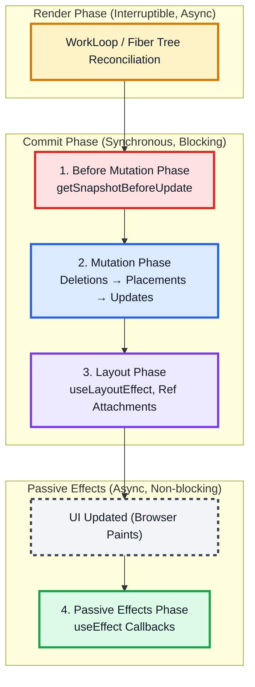
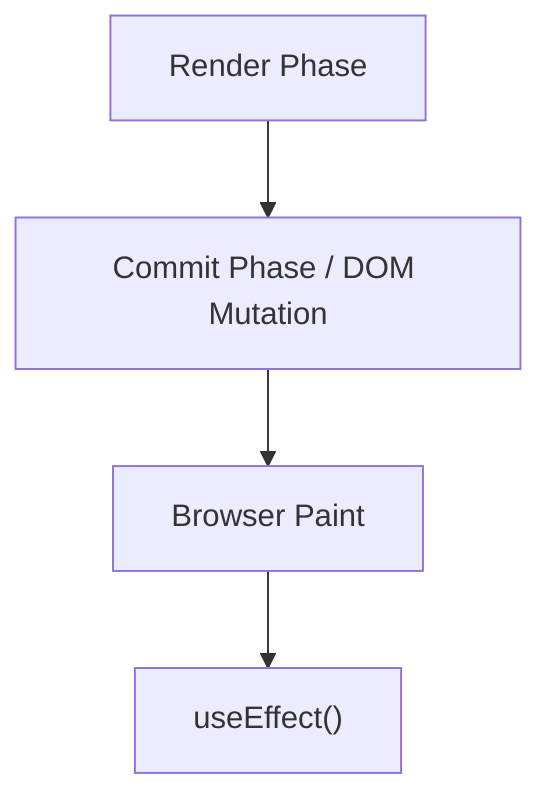
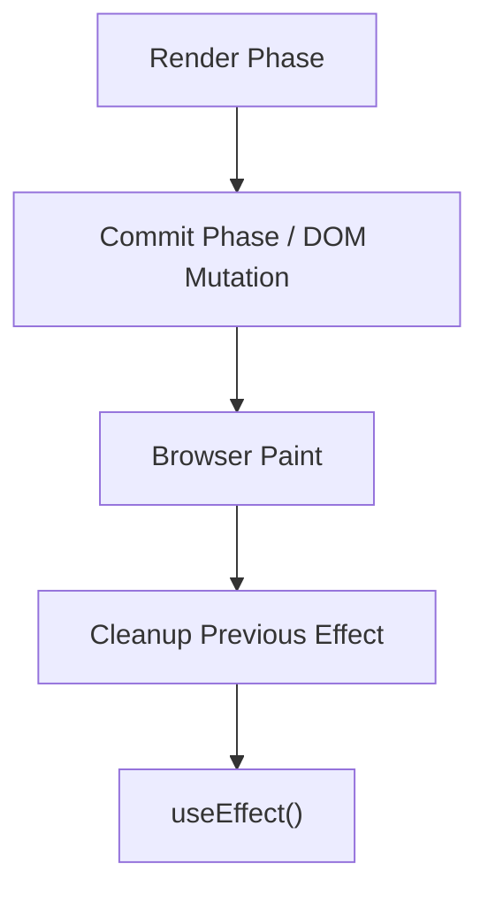
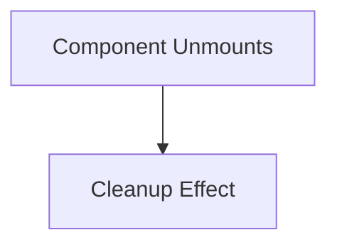
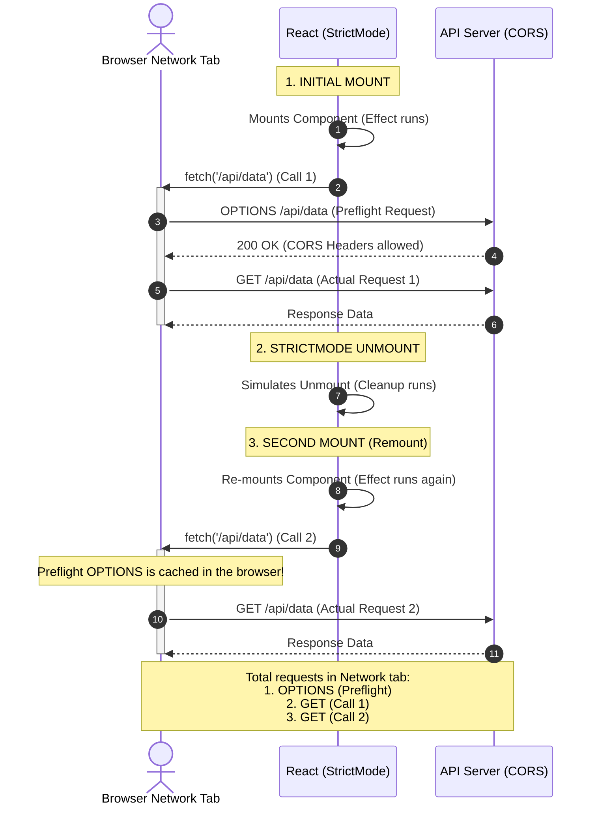

# React Internals: The Commit Phase & Rendering Pipeline

The **Render Phase** decides _what_ changes need to be made by calculating virtual DOM diffs and updating the Fiber tree. However, it is asynchronous and interruptible.
The **Commit Phase** is where React shifts from planning to doing—it is where React actually applies those prepared changes to the physical browser DOM.

Unlike the Render Phase, the Commit Phase is **synchronous and blocking**. Once it begins, it cannot be paused or interrupted. This is intentional: displaying partial DOM updates to the user would lead to visual stuttering and an inconsistent UI state.

> [!NOTE]
> This document is part of our **React Deep Dive Series**. Navigate the deep dives here:
>
> - **[React Layout & General Internals (This Document)](./index.md)**
> - **[Part 1: Core Engine & Architecture](./React_Deep_Dive_Internals.md)**
> - **[Part 2: Advanced Concurrency & Hooks](./React_Deep_Dive_Advanced.md)**
> - **[Part 3: Interview Grill Questions & Timing Cheat Sheet](./React_Deep_Dive_Cheat_Sheet.md)**

---

## 🗺️ The Complete React Rendering Pipeline (End-to-End)

From calling `setState` to updating pixels on the screen, here is the complete 13-step journey of React's cooperative rendering engine:

```mermaid
graph TD
    %% 1. TRIGGER & SCHEDULING
    subgraph TriggerSched["1. Trigger & Scheduling (Lanes)"]
        A["setState() / Trigger Update"] --> B["Assign Update to a Lane<br/>(SyncLane / DefaultLane / TransitionLane)"]
        B --> C["Bubble childLanes Bitmask Up to Root Fiber"]
    end

    %% 2. RENDER PHASE
    subgraph RenderPhase["2. Render Phase (Async, Interruptible)"]
        C --> D["Start workLoop & DFS Traversal"]
        D --> E["beginWork()<br/>(Evaluate changes, reconcile children)"]
        E --> F{"React.memo / lanes check:<br/>Props stable? (fiber.lanes & renderLanes) === 0?"}

        F -- "Yes (Bailout)" --> G["Skip entire child subtree<br/>(O(1) optimization)"]
        F -- "No (Render)" --> H["Evaluate component &<br/>create/update child fibers"]

        G --> I{"shouldYield()?<br/>(Check 5ms time slice)"}
        H --> I

        I -- "Yes (Yield)" --> J["Pause workInProgress pointer<br/>& Yield thread to Browser"]
        J -- "Next Frame" --> D

        I -- "No" --> K["completeWork()<br/>(DFS Ascent)"]
        K --> L["Create DOM elements in-memory<br/>& bubble subtreeFlags up"]
    end

    %% 3. COMMIT PHASE
    subgraph CommitPhase["3. Commit Phase (Sync, Blocking, Uninterruptible)"]
        L --> M["Before Mutation Phase<br/>(Read DOM / getSnapshotBeforeUpdate)"]
        M --> N["Mutation Phase (Write DOM)<br/>Children first: 1. Deletions ➔ 2. Placements ➔ 3. Updates"]
        N --> O["Layout Phase (Sync)<br/>(Attach refs, run useLayoutEffect)"]
    end

    %% 4. BROWSER PAINT & PASSIVE EFFECTS
    subgraph PaintEffects["4. Browser Paint & Passive Effects"]
        O --> P["Browser Paint<br/>(Style Recalculation ➔ Reflow ➔ Rasterize)"]
        P --> Q["Pixel is visible on screen"]
        Q --> R["Passive Effects Phase (Async)<br/>(1. Cleanup previous useEffect ➔ 2. Run new callback)"]
    end

    %% Styling
    style A fill:#DBEAFE,stroke:#2563EB,stroke-width:2px,color:#1e3a8a
    style B fill:#DBEAFE,stroke:#2563EB,stroke-width:1px,color:#1e3a8a
    style C fill:#DBEAFE,stroke:#2563EB,stroke-width:1px,color:#1e3a8a

    style D fill:#FEF3C7,stroke:#D97706,stroke-width:2px,color:#78350f
    style E fill:#FEF3C7,stroke:#D97706,stroke-width:1px,color:#78350f
    style F fill:#FEE2E2,stroke:#DC2626,stroke-width:1px,color:#7f1d1d
    style G fill:#D1FAE5,stroke:#10B981,stroke-width:1px,color:#064e3b
    style H fill:#FEF3C7,stroke:#D97706,stroke-width:1px,color:#78350f
    style I fill:#FEE2E2,stroke:#DC2626,stroke-width:1px,color:#7f1d1d
    style J fill:#EDE9FE,stroke:#7C3AED,stroke-width:1px,color:#4c1d95
    style K fill:#FEF3C7,stroke:#D97706,stroke-width:1px,color:#78350f
    style L fill:#FEF3C7,stroke:#D97706,stroke-width:1px,color:#78350f

    style M fill:#FEE2E2,stroke:#DC2626,stroke-width:2px,color:#7f1d1d
    style N fill:#FEE2E2,stroke:#DC2626,stroke-width:2px,color:#7f1d1d
    style O fill:#FEE2E2,stroke:#DC2626,stroke-width:2px,color:#7f1d1d

    style P fill:#EDE9FE,stroke:#7C3AED,stroke-width:2px,color:#4c1d95
    style Q fill:#D1FAE5,stroke:#10B981,stroke-width:2px,color:#064e3b
    style R fill:#D1FAE5,stroke:#10B981,stroke-width:2px,color:#064e3b
```



---

## 🚀 The Commit Phase Pipeline

The Commit Phase is executed across four sequential sub-phases in a strict order:



---

## 🚀 Chronological Execution Flow

From the start of a render to the final visual paint, React follows a strict, step-by-step chronological pipeline:

### 1. Render Phase (Async & Interruptible)

- React calculates what should change (Virtual DOM reconciliation). This is pure and has no visible side effects.

### 2. Before Mutation Phase (Sync & Blocking)

- React's last chance to read the DOM before it changes. Runs `getSnapshotBeforeUpdate` on class components.

### 3. DOM Mutation (Sync & Blocking)

- React applies mutations (deletions, placements, and updates) directly to the browser DOM.

### 4. Ref Attachment (Sync & Blocking)

- DOM element references are attached to the `.current` property of `useRef` objects.

### 5. `useLayoutEffect` Callbacks (Sync & Blocking)

- **Timing:** Runs synchronously after DOM mutations but **before** the browser paints.
- **Execution Order:** Cleanup functions from the previous render run first, then the new `useLayoutEffect` callbacks fire. They run in **child-first, parent-last** order.
- **Blocking:** The browser cannot paint until these callbacks complete. Heavy work here will delay what the user sees.

### 6. Browser Paint

- The browser calculates layout geometries (reflow) and paints the updated pixels onto the screen.

### 7. `useEffect` (Passive Effects - Async & Non-blocking)

- Runs asynchronously after the browser has painted. Ideal for side effects that don't affect layout (e.g., API calls, subscriptions, logging).

---

## 𝟭. Before Mutation Phase (DOM Pre-read)

Before React modifies anything in the DOM, it has one last opportunity to read the layout state. If it misses this window, certain values (like scroll positions, element dimensions, or text selection) will be permanently lost after the browser reflows the updated DOM.

### `getSnapshotBeforeUpdate`

The primary function running here is `getSnapshotBeforeUpdate(prevProps, prevState)`. It is a class component lifecycle method that executes immediately before DOM mutations. Any value returned by this lifecycle method is passed as the third parameter (`snapshot`) to `componentDidUpdate`.

#### Real-World Example: Scroll Position Restoration in Chat UI

When new messages arrive at the bottom of a chat thread, the container's height changes. If the user is scrolled up reading older history, we don't want the page scroll to jump. Capturing the scroll dimensions before mutation lets us restore the exact visual scroll position:

```javascript
class ScrollingList extends React.Component {
  constructor(props) {
    super(props);
    this.listRef = React.createRef();
  }

  getSnapshotBeforeUpdate(prevProps, prevState) {
    // Are we adding new items to the list?
    if (prevProps.list.length < this.props.list.length) {
      const list = this.listRef.current;
      // Capture the distance between bottom scroll and top of element
      return list.scrollHeight - list.scrollTop;
    }
    return null;
  }

  componentDidUpdate(prevProps, prevState, snapshot) {
    // If we have a snapshot value, new items were just added.
    // Adjust scroll height so the reading position doesn't shift.
    if (snapshot !== null) {
      const list = this.listRef.current;
      list.scrollTop = list.scrollHeight - snapshot;
    }
  }
}
```

- **Why this matters:**
  - You should never try to read pre-update DOM values inside `useEffect` or `useLayoutEffect` because the DOM has already mutated by then.
  - This phase runs bottom-up (children before parents) so child snapshot measurements are ready when parents run.

---

## 𝟮. Mutation Phase (Touching the Real DOM)

This is where React applies the actual DOM mutations prepared during the Render Phase.

### Why the Order Matters: Deletions ➔ Placements ➔ Updates

React applies mutations in a strict, 3-step order. This is not arbitrary; it prevents key conflicts and inconsistent DOM layouts:

1. **Deletions First:** React removes deleted DOM nodes before anything else.
   - Clears key/ID namespaces to prevent duplicate identifier conflicts if items are moving or replaced.
   - Runs unmount cleanup logic (detaching event listeners, clearing refs, running `componentWillUnmount` and `useEffect` cleanups) to prevent memory leaks.
2. **Placements Next:** React inserts newly created DOM nodes.
   - Since deleted nodes are already gone, new elements can be inserted cleanly into correct sibling/parent positions without interference.
3. **Updates Last:** React modifies existing nodes (updating text content, attributes, styles, and event handlers).
   - Runs last so React always operates against a stable, fully-formed DOM structure.

### Traversal Order

During the Mutation Phase, React walks the fiber tree in **depth-first post-order** (children are mutated before their parents). This guarantees DOM consistency and correct execution order for the effects that follow.

---

## 𝟯. Layout Phase (Sync Effects & Refs)

Runs synchronously after DOM mutations but **before the browser paints the screen**. This is where `useLayoutEffect` and Ref attachments reside.

### Two things happen in this phase, in this order:

#### 1. Ref Attachments

- Refs are attached to their corresponding DOM nodes here.
- After this step, `ref.current` reliably points to the correct updated DOM element.
- **Why this matters:** Reading a ref during the **Render Phase** is unreliable because the DOM node may not exist yet. The Layout Phase is when `ref.current` becomes accurate.

#### 2. `useLayoutEffect` Callbacks

- Cleanup functions from the previous render run first, then the new `useLayoutEffect` callbacks fire synchronously.
- They run in **child-first, parent-last** order (children complete layout work before parents).
- **Blocking Nature:** The browser cannot paint until these callbacks finish. Heavy work here will delay what the user sees. This synchronous execution prevents visual flickering (e.g., when measuring tooltip dimensions or adjusting layouts).

---

## 𝟰. Passive Effects Phase (useEffect)

After the browser has completed its style recalculation, layout reflow, and paint cycles, React runs **Passive Effects (`useEffect`)**:

- **Asynchronous & Non-blocking:** React registers passive effects during the layout phase and hands them over to its custom Scheduler. The Scheduler queues them to execute asynchronously in a separate macro-task on the next tick.
- **Why it matters:** Unlike `useLayoutEffect`, `useEffect` does not block visual updates. Ideal for side effects that don't affect the immediate layout (e.g., data fetching, subscriptions, logging).

---

## 🛠️ `useLayoutEffect` vs `useEffect`

| Feature         | `useLayoutEffect`                       | `useEffect`                        |
| :-------------- | :-------------------------------------- | :--------------------------------- |
| **Timing**      | After DOM updates, **before** paint     | After DOM updates, **after** paint |
| **Execution**   | Synchronous                             | Asynchronous                       |
| **Impact**      | **Blocking**: Delays visual updates     | **Non-blocking**: Fluid UX         |
| **Primary Use** | Measurements, positioning, sync updates | API calls, subscriptions, logging  |

---

## 🔄 Detailed `useEffect` Lifecycle Flow

It is a common misconception that `useEffect` is a direct equivalent to class lifecycle methods. Instead, think of it as a synchronization mechanism that runs in specific sequences.

### 1. Initial Mount



### 2. Update (Re-render)

If dependencies change, the previous effect is cleaned up **before** the new effect runs.



### 3. Unmount



### Summary of the Flow:

- **Mount:** Render ➔ Commit ➔ Paint ➔ **Effect**
- **Update:** Render ➔ Commit ➔ Paint ➔ **Cleanup** ➔ **Effect**
- **Unmount:** **Cleanup**

---

## Reference Equality & Immutability

If JavaScript compared objects by value, React would have been designed very differently. React relies on **Reference Equality** to determine when to re-render.

### 1. The JavaScript "Quirk"

In JavaScript, objects and arrays are compared by their memory address (Reference), not their contents.

```javascript
{} === {} // false
[] === [] // false
```

### 2. The Mutation Trap (Wrong Way) ❌

When you mutate an object directly, its reference remains the same.

```javascript
// user points to Object A (ID: #101)
user.name = 'Cena';
setUser(user);
```

**Result:** React sees `Object A` (Before) and `Object A` (After). Since the references are identical, React assumes nothing changed and **may skip the re-render**.

### 3. The Immutable Approach (Right Way) ✅

React encourages creating a new reference to signal a change.

```javascript
setUser((prevUser) => ({
  ...prevUser, // Spread creates Object B (ID: #202)
  name: 'Cena',
}));
```

**Result:** `Object A !== Object B`. React detects the new reference and triggers a re-render.

### 💡 Why This Matters (Optimizations)

This simple behavior enables extremely fast performance checks in:

- **`React.memo`**: Skips re-rendering a component if props (references) haven't changed.
- **`useMemo` / `useCallback`**: Cache values or functions until a dependency reference changes.
- **`shouldComponentUpdate`**: Traditional way to optimize class components.

**Key Takeaway:** React doesn't care that "John" became "Cena"; it cares that `Object A` became `Object B`.

---

## 🕵️ The Triple API Call Mystery

You have a `useEffect` and in development, you expect 1 call, but you see **3 network requests** or **3 API calls** in your browser's network tab or logs. Why?

### The Logically Flawed Explanation (Why simple "remounting" doesn't explain 3 calls)

It is a common misconception that a third call is simply caused by the component unmounting and remounting a third time (e.g., due to parent state updates, non-memoized props, or key resets). Under React 18+ `StrictMode` in development:

- Every mount triggers a double-invocation of the effect (Mount ➔ Unmount ➔ Mount).
- If your component actually unmounted and remounted a second time, it would double-mount again, resulting in **4 API calls** (2 from the first mount + 2 from the second mount), not 3!

So, how do we get exactly **3** calls? There are two main actual reasons:

### Actual Cause 1: CORS Preflight (OPTIONS) + StrictMode (Most Common)

If your API call is cross-origin (CORS), the browser must send a preflight `OPTIONS` request before sending the actual `GET`/`POST` request to verify server permissions.

Under `StrictMode` in development, React mounts, unmounts, and remounts your component, running your `useEffect` twice. This sequence of events results in exactly **3 network requests** appearing in the browser's Network tab:



In your browser's Network tab, this displays exactly **3 network requests** for a single component mount!

### Actual Cause 2: Non-Empty Dependency Array with a Post-Mount Update

If your `useEffect` is **not** using an empty dependency array `[]`, but instead has dependencies (e.g., `[id]`), then:

1. **Call 1 & 2:** React's `StrictMode` double-mounts the component on load, firing the effect twice with the initial value of `id`.
2. **Call 3:** Shortly after mounting, the parent component updates or the state changes, causing `id` to change (e.g., from `undefined` or `null` to a valid value). This triggers the effect to run a third time.

### Actual Cause 3: Multiple Instances of the Component

If you have multiple instances of the component on the page:

- If StrictMode is disabled, rendering 3 instances of the component will trigger 3 API calls (1 for each mount).
- If StrictMode is enabled, rendering 2 instances would trigger 4 API calls. However, if one instance is mounted initially, and a second one is mounted conditionally later _without_ StrictMode, or under some complex lazy-loading behavior, you might see odd numbers of calls.

### 🛠️ How to Handle It

1. **Write Idempotent Cleanup Logic:** Always use `AbortController` in your cleanup function to cancel pending fetch requests. This ensures that even if React mounts the component twice, the browser aborts the first request:

   ```javascript
   useEffect(() => {
     const controller = new AbortController();

     fetch('/api/data', { signal: controller.signal })
       .then((res) => res.json())
       .then((data) => setData(data))
       .catch((err) => {
         if (err.name !== 'AbortError') console.error(err);
       });

     return () => controller.abort(); // Cancels the request if unmounted
   }, [id]);
   ```

2. **Use Data Fetching Libraries:** Libraries like **TanStack Query (React Query)** or **SWR** handle request deduplication and caching out of the box, preventing duplicate calls during rapid remounts.

---

## 💡 Best Practices

### When to use `useLayoutEffect`:

- **DOM Measurements:** Reading layout (e.g., `getBoundingClientRect()`).
- **Layout Calculations:** Adjusting styles based on measurements.
- **Imperative Updates:** Updates that must be invisible to the user (to prevent flickering).
- **Specific fixes:** Tooltip positioning, scroll adjustments.

### Why this matters:

1. **Avoid Jank:** Now you know why `useLayoutEffect` can cause visible delays if misused.
2. **Ref Safety:** You understand why `ref.current` is only reliable after the Layout Phase starts.
3. **UI Correctness:** You can use the right tool for tooltip positioning and scroll adjustments to ensure a polished user experience.

---

### 𝗧𝗵𝗲 𝘀𝗶𝗺𝗽𝗹𝗲 𝘄𝗮𝘆 𝘁𝗼 𝗿𝗲𝗺𝗲𝗺𝗯𝗲𝗿 𝗶𝘁:

- **`useLayoutEffect`:** DOM updated, **before** paint, synchronous, blocking.
- **`useEffect`:** DOM updated, **after** paint, asynchronous, non-blocking.

---

## 🔗 Related Resources

- **[Part 1: Core Engine & Architecture](./React_Deep_Dive_Internals.md)**
- **[Part 2: Advanced Concurrency & Hooks](./React_Deep_Dive_Advanced.md)**
- **[Part 3: Interview Grill Questions & Timing Cheat Sheet](./React_Deep_Dive_Cheat_Sheet.md)**

---

[Return to LLD Roadmap](../../../LLD/LLD.md)
