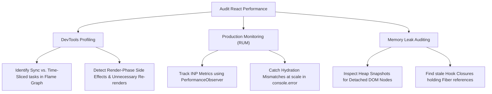

# React Deep Dive: Advanced Concurrency, Hooks & Telemetry

---

## Table of Contents

- [React Deep Dive: Advanced Concurrency, Hooks \& Telemetry](#react-deep-dive-advanced-concurrency-hooks--telemetry)
  - [Table of Contents](#table-of-contents)
  - [13. Staff/Architect-Level Deep Dive: Core Hook Mechanics \& Fiber Internals](#13-staffarchitect-level-deep-dive-core-hook-mechanics--fiber-internals)
    - [Q1: The Fiber Hooks List: How Hooks are Stored and Executed](#q1-the-fiber-hooks-list-how-hooks-are-stored-and-executed)
      - [Hook Object Node Structure](#hook-object-node-structure)
      - [Linked List Execution Flow](#linked-list-execution-flow)
    - [Q2: `useState` Deep Dive: Hook Queues, Dispatcher Switching, \& Eager Bailout](#q2-usestate-deep-dive-hook-queues-dispatcher-switching--eager-bailout)
      - [1. Hook Dispatchers (The Switcher Pattern)](#1-hook-dispatchers-the-switcher-pattern)
      - [2. The Circular Linked Update Queue](#2-the-circular-linked-update-queue)
      - [3. Eager Bailout Optimization](#3-eager-bailout-optimization)
    - [Q3: `useEffect` Deep Dive: Scheduler Internals, Update Queues, \& Commit Phase Pipeline](#q3-useeffect-deep-dive-scheduler-internals-update-queues--commit-phase-pipeline)
      - [1. Representation on Fiber](#1-representation-on-fiber)
      - [2. Commit Phase Pipeline \& The Double Pass](#2-commit-phase-pipeline--the-double-pass)
      - [3. The Scheduler and Macro-task Scheduling](#3-the-scheduler-and-macro-task-scheduling)
    - [Q4: `useMemo` \& `useCallback` Deep Dive: Mount vs. Update Phase \& The React Compiler](#q4-usememo--usecallback-deep-dive-mount-vs-update-phase--the-react-compiler)
      - [1. Under-the-Hood Mount and Update Implementations](#1-under-the-hood-mount-and-update-implementations)
      - [2. The Future: React Compiler (React Forget)](#2-the-future-react-compiler-react-forget)
    - [Q5: `React.memo` Deep Dive: Props Comparison \& Reconciliation Bypass](#q5-reactmemo-deep-dive-props-comparison--reconciliation-bypass)
      - [1. Element Type Modification](#1-element-type-modification)
      - [2. Reconciliation Bypass Logic](#2-reconciliation-bypass-logic)
    - [Q6: React Hooks vs. Redux: Batching, Lifecycle, and State Persistence](#q6-react-hooks-vs-redux-batching-lifecycle-and-state-persistence)
      - [1. React Hooks: Scheduled Rendering (Asynchronous)](#1-react-hooks-scheduled-rendering-asynchronous)
      - [2. Redux: Pub/Sub Architecture (Synchronous)](#2-redux-pubsub-architecture-synchronous)
      - [3. State Persistence (Lifecycle Bound vs. Global Singleton)](#3-state-persistence-lifecycle-bound-vs-global-singleton)
    - [Q7: Fiber WorkTags: How React Processes Component Types (Regular Functions, Arrow Functions, and IIFEs)](#q7-fiber-worktags-how-react-processes-component-types-regular-functions-arrow-functions-and-iifes)
      - [1. Understanding Fiber `WorkTags`](#1-understanding-fiber-worktags)
      - [2. The Indeterminate Component Phase](#2-the-indeterminate-component-phase)
      - [3. How React Reconciles Different Invocation Syntaxes](#3-how-react-reconciles-different-invocation-syntaxes)
  - [14. Concurrent Transitions \& The Fiber Lanes Model](#14-concurrent-transitions--the-fiber-lanes-model)
    - [Priority Lanes Model](#priority-lanes-model)
      - [1. What are Lanes?](#1-what-are-lanes)
      - [2. What are `childLanes`?](#2-what-are-childlanes)
      - [3. Automatic Update Batching \& Scheduling via Lanes](#3-automatic-update-batching--scheduling-via-lanes)
      - [4. How Lanes \& childLanes Optimize Traversals](#4-how-lanes--childlanes-optimize-traversals)
      - [Why This Matters to Architects:](#why-this-matters-to-architects)
    - [Suspense \& startTransition](#suspense--starttransition)
    - [Q1: What is the "Lanes" Model, and how did it replace "Expiration Times"?](#q1-what-is-the-lanes-model-and-how-did-it-replace-expiration-times)
      - [1. The Legacy Expiration Times Model (React 16/17)](#1-the-legacy-expiration-times-model-react-1617)
      - [2. The Lanes Model (React 18+)](#2-the-lanes-model-react-18)
    - [Q2: How `useTransition` Works Under the Hood](#q2-how-usetransition-works-under-the-hood)
      - [1. Transition Dispatcher Context Switching](#1-transition-dispatcher-context-switching)
      - [2. Render Phase Interruption (Time Slicing)](#2-render-phase-interruption-time-slicing)
      - [3. How `isPending` is Rendered](#3-how-ispending-is-rendered)
    - [Q3: `useTransition` vs. `useDeferredValue`](#q3-usetransition-vs-usedeferredvalue)
  - [15. React 19: Compiler, Actions \& The `useOptimistic` Rollback Engine](#15-react-19-compiler-actions--the-useoptimistic-rollback-engine)
    - [Q1: React 19 Actions and Async Transitions](#q1-react-19-actions-and-async-transitions)
      - [1. Promise Lifecycle Integration](#1-promise-lifecycle-integration)
      - [2. Native Action Hooks](#2-native-action-hooks)
    - [Q2: The `useOptimistic` Rollback Engine](#q2-the-useoptimistic-rollback-engine)
      - [1. The Dual Reference Architecture](#1-the-dual-reference-architecture)
      - [2. Under-the-Hood Execution Steps](#2-under-the-hood-execution-steps)
  - [16. The React 19 `use` Hook (Rules of Hooks Bypass)](#16-the-react-19-use-hook-rules-of-hooks-bypass)
    - [Q1: What makes the `use` hook unique, and how does it bypass the standard "Rules of Hooks"?](#q1-what-makes-the-use-hook-unique-and-how-does-it-bypass-the-standard-rules-of-hooks)
      - [1. Why Standard Hooks Cannot Be Called Conditionally](#1-why-standard-hooks-cannot-be-called-conditionally)
      - [2. The Internal Magic of the `use` Hook](#2-the-internal-magic-of-the-use-hook)
        - [1. When Consuming Context: `use(Context)`](#1-when-consuming-context-usecontext)
        - [2. When Consuming Promises: `use(Promise)`](#2-when-consuming-promises-usepromise)
  - [17. Selective Hydration Internals](#17-selective-hydration-internals)
    - [Q1: What is "Selective Hydration", and how does it optimize page interactivity compared to legacy SSR?](#q1-what-is-selective-hydration-and-how-does-it-optimize-page-interactivity-compared-to-legacy-ssr)
      - [1. The Legacy SSR Problem: "All-or-Nothing" Hydration](#1-the-legacy-ssr-problem-all-or-nothing-hydration)
      - [2. How Selective Hydration Solves the Bottleneck (React 18+)](#2-how-selective-hydration-solves-the-bottleneck-react-18)
        - [1. Streaming HTML](#1-streaming-html)
        - [2. Incremental Hydration](#2-incremental-hydration)
        - [3. Interaction-Driven Prioritization (Event Replaying)](#3-interaction-driven-prioritization-event-replaying)
  - [18. System Telemetry, Auditing, \& Monitoring](#18-system-telemetry-auditing--monitoring)
    - [The Architect's Audit Checklist](#the-architects-audit-checklist)
      - [1. Verifying Work Loop Yielding (Chrome DevTools Performance Panel)](#1-verifying-work-loop-yielding-chrome-devtools-performance-panel)
      - [2. Profiling Concurrent Interruptions (React DevTools Profiler)](#2-profiling-concurrent-interruptions-react-devtools-profiler)
      - [3. Real-User Monitoring (RUM) for React Interaction to Next Paint (INP)](#3-real-user-monitoring-rum-for-react-interaction-to-next-paint-inp)
      - [4. Memory Leak Auditing (Heap Snapshots \& Closure Traps)](#4-memory-leak-auditing-heap-snapshots--closure-traps)
    - [Navigation:](#navigation)

---

## 13. Staff/Architect-Level Deep Dive: Core Hook Mechanics & Fiber Internals

### Q1: The Fiber Hooks List: How Hooks are Stored and Executed

**Question:** How does React track hooks internally without a unique key parameter, and why are we strictly forbidden from placing hooks inside conditionals or loops?

**Answer:**
Under the hood, React does not rely on magic, names, or keys. It uses a **singly-linked list** of Hook objects stored directly on the active Fiber node.

#### Hook Object Node Structure

In React's reconciler codebase, each hook is represented by a plain JavaScript object:

```typescript
interface Hook {
  memoizedState: any; // The local state/memoized value (e.g., state, effect, ref value)
  baseState: any; // Base state used for batching & priorities
  baseQueue: Update<any, any> | null; // Pending updates with higher priority
  queue: UpdateQueue<any, any> | null; // State updates queue (circular linked list)
  next: Hook | null; // Link to the next hook in the component's hook chain
}
```

#### Linked List Execution Flow

1. **Mount Phase:** As React runs a functional component for the first time, every hook execution creates a new `Hook` node and appends it to the tail of a linked list. The head of this list is stored in the Fiber's `memoizedState` property (`fiber.memoizedState`).
2. **Update Phase:** On subsequent renders, React resets a pointer to the head of the hooks list (`currentHook = fiber.memoizedState`). Every hook call moves the pointer to the next hook node (`currentHook = currentHook.next`).
3. **Conditionals Violate Order:**
   ```
   Render 1 (Mount): [Hook 1: useState] -> [Hook 2: useEffect] -> [Hook 3: useMemo]
   Render 2 (Update - Hook 2 skipped due to if condition):
   React expects:  [Hook 1] -> [Hook 2] -> [Hook 3]
   React executes: Hook 1 (retrieved Hook 1), Hook 3 (retrieved Hook 2!)
   ```
   If a hook is skipped, the pointer index goes out of sync. React will assign the stored state of `useEffect` (Hook 2) to the `useMemo` hook (Hook 3), causing severe runtime crashes, state corruption, and mismatching hook signatures.

---

### Q2: `useState` Deep Dive: Hook Queues, Dispatcher Switching, & Eager Bailout

**Question:** How does React coordinate multiple state updates asynchronously, and what are Hook Dispatchers?

**Answer:**

#### 1. Hook Dispatchers (The Switcher Pattern)

React switches the hook function implementations dynamically depending on where the component is in its lifecycle. It exposes hooks via a **Dispatcher**:

```javascript
// React's internal dispatcher context switcher
const ReactCurrentDispatcher = { current: null };
```

During mounting, React sets the dispatcher to `HooksDispatcherOnMount`. During updates, it switches to `HooksDispatcherOnUpdate`. There are also separate dispatchers for Context retrieval or Concurrent transition contexts.

- **Why:** This avoids executing unnecessary check logic (like checking if a hook is running for the first time) at runtime, improving invocation speed.

#### 2. The Circular Linked Update Queue

When you call `setState(newValue)`, React does not modify the state immediately. It creates an `Update` object and appends it to the hook's circular queue:

```
           queue.pending (last update)
                   │
                   ▼
           ┌──►[Update 3] (last)
           │        │
           │        ▼
      [Update 2]◄───[Update 1] (first)
```

- **Why Circular:** The `queue.pending` pointer points to the _last_ update submitted. `queue.pending.next` points to the _first_ update. This allows React to append to the tail in $O(1)$ and traverse from head-to-tail in $O(1)$ without storing two separate references.

#### 3. Eager Bailout Optimization

If an update is dispatched when there are no pending updates in the queue, React calculates the new state **synchronously on the spot** (eagerly).

- It compares the eager state with the current state using `Object.is(eagerState, currentState)`.
- If they are identical, React **bails out** immediately and does not schedule a render lane with the Scheduler, saving the application from executing reconciliation.

---

### Q3: `useEffect` Deep Dive: Scheduler Internals, Update Queues, & Commit Phase Pipeline

**Question:** What is the underlying execution architecture of `useEffect`, and how does the Scheduler manage rendering vs. painting?

**Answer:**

#### 1. Representation on Fiber

Effects are stored as custom structures in a flat, circular linked list on the Fiber's `updateQueue.lastEffect`. An effect structure contains:

```typescript
interface Effect {
  tag: HookFlags; // e.g., HasSideEffect | Passive (useEffect) or Layout (useLayoutEffect)
  create: () => void; // The callback code
  destroy: (() => void) | undefined; // The cleanup code
  deps: any[] | null; // The dependency array
  next: Effect; // Circular link
}
```

#### 2. Commit Phase Pipeline & The Double Pass

React splits rendering into the **Render Phase** (pure, async, interruptible tree traversal) and the **Commit Phase** (synchronous, DOM-mutating, uninterruptible). The Commit Phase has three sub-passes:

1. **Mutation Phase:** React writes properties directly to the DOM nodes. For `useLayoutEffect`, this is where the _cleanup_ (destroy) functions run.
2. **Layout Phase:** React calls the _create_ functions of `useLayoutEffect` synchronously. At this same moment, `useEffect` callbacks are scheduled.
3. **Paint Phase:** The browser finishes layout calculation and paints the visual frame.

```
[Render Phase] -> [Commit: Mutation] -> [Commit: Layout] -> [Browser Paint] -> [Scheduled useEffect Runs]
                  (Layout cleanup)      (Layout create)
                                        (Schedule useEffect)
```

#### 3. The Scheduler and Macro-task Scheduling

React must run `useEffect` after paint. To do this, it leverages the **Scheduler** library using a **MessageChannel** utility:

- Rather than using `setTimeout(fn, 0)` (which can be throttled by browsers to 4ms or delayed behind rendering frames), the Scheduler uses `port.postMessage()` on a `MessageChannel`.
- This schedules a **macro-task** that yields control back to the browser's paint loop, allowing the paint to finish immediately, and then executes the effect callbacks on the very next event tick.

---

### Q4: `useMemo` & `useCallback` Deep Dive: Mount vs. Update Phase & The React Compiler

**Question:** What is the technical difference between how `useMemo` and `useCallback` evaluate in memory, and how does the new React Compiler change this?

**Answer:**

#### 1. Under-the-Hood Mount and Update Implementations

React implements `useMemo` and `useCallback` using separate internal functions for the mount and update lifecycles.

```javascript
// Internal mount implementations
function mountMemo(nextCreate, deps) {
  const value = nextCreate();
  const hook = mountWorkInProgressHook();
  hook.memoizedState = [value, deps]; // Cache the value and dependencies
  return value;
}

function mountCallback(callback, deps) {
  const hook = mountWorkInProgressHook();
  hook.memoizedState = [callback, deps]; // Cache the raw function reference
  return callback;
}
```

```javascript
// Internal update implementations
function updateMemo(nextCreate, deps) {
  const hook = updateWorkInProgressHook();
  const nextDeps = deps === undefined ? null : deps;
  const prevState = hook.memoizedState;

  if (prevState !== null && nextDeps !== null) {
    const prevDeps = prevState[1];
    if (areHookInputsEqual(nextDeps, prevDeps)) {
      return prevState[0]; // Return the cached value directly
    }
  }
  const value = nextCreate();
  hook.memoizedState = [value, nextDeps];
  return value;
}

function updateCallback(callback, deps) {
  const hook = updateWorkInProgressHook();
  const nextDeps = deps === undefined ? null : deps;
  const prevState = hook.memoizedState;

  if (prevState !== null && nextDeps !== null) {
    const prevDeps = prevState[1];
    if (areHookInputsEqual(nextDeps, prevDeps)) {
      return prevState[0]; // Return the cached callback reference
    }
  }
  hook.memoizedState = [callback, nextDeps];
  return callback;
}
```

- **Memory Insight:** `useCallback(fn, deps)` is mathematically equivalent to `useMemo(() => fn, deps)`. The only difference is that `useCallback` avoids creating an additional outer wrapper function instance just to return another function.

#### 2. The Future: React Compiler (React Forget)

Writing explicit dependency arrays is error-prone and adds cognitive overhead. The React Compiler automatically compiles standard React code to add fine-grained memoization:

- It analyzes JavaScript variable scopes and dependency graphs at build time.
- It injects cache checkpoints (`useMemoCache`) around JSX subtrees, objects, and function expressions, bypassing the runtime cost of executing `areHookInputsEqual` comparison lists manually.

---

### Q5: `React.memo` Deep Dive: Props Comparison & Reconciliation Bypass

**Question:** What does `React.memo` return, how does React evaluate it during diffing, and how does it bypass child tree reconciliation?

**Answer:**

#### 1. Element Type Modification

When you wrap a component in `React.memo`, React changes its Fiber node's `tag` type:

- From a standard functional component tag, it becomes a **`MemoComponent`** or **`SimpleMemoComponent`** type.

#### 2. Reconciliation Bypass Logic

During the Render phase, when React encounters a component node, it enters the `beginWork()` phase:

1. **Shallow Compare Pass:** React compares the old props and the new props. By default, it does a shallow comparison:
   ```javascript
   function shallowEqual(objA, objB) {
     if (Object.is(objA, objB)) return true;
     // Compares keys and values at depth 1
   }
   ```
2. **Checking the Bailout Flag:** If the props are determined to be equal (or a custom `compare` function returns `true`) AND the component has no pending state or context updates, React triggers a **bailout**:
   - It skips executing the component function entirely.
   - It clones the existing Fiber subtree (`child` fiber list) and returns it immediately.
3. **Reference Breakers:** If any prop is an object, array, or function, and its reference is recreated in the parent component (not stabilized with `useMemo`/`useCallback`), `shallowEqual` returns `false`. React must proceed with execution, rendering the component anyway, making `React.memo` wasted computation.

> [!IMPORTANT]
> **Staff Coordination Rule:**
> Memoization is a system, not a single hook. You must maintain both sides of the contract:
>
> 1. Use `React.memo` on the child component to establish the bailout capability.
> 2. Use `useCallback`/`useMemo` in the parent component to keep the prop references stable.
>
> Bypassing either side renders the other completely useless.

---

### Q6: React Hooks vs. Redux: Batching, Lifecycle, and State Persistence

**Question:** Why are React hook state updates asynchronous/scheduled while Redux store updates are synchronous, and why does Redux state persist when components unmount while React hook state is lost?

**Answer:**

#### 1. React Hooks: Scheduled Rendering (Asynchronous)

React's `useState` and `useReducer` updates are inherently scheduled. When you trigger `setState`:

- React does not mutate the state on the spot. Instead, it creates an `Update` object, schedules a **render lane** with the Scheduler, and batches the update to prevent multiple layouts paints.
- **No Local Closure Storage:** The hook itself does not hold data between renders. State is stored on the Fiber tree node. During the next render cycle, React executes the component function, and the hook reads the updated value from the Fiber's `memoizedState` queue.
- Reading the state variable immediately after calling `setState` reads the old value because the active JavaScript execution context is still bound to the closure of the **current** render frame.

#### 2. Redux: Pub/Sub Architecture (Synchronous)

Redux is a standard publisher/subscriber store implemented in plain JavaScript, operating entirely outside the React reconciler pipeline:

- When you call `store.dispatch(action)`, Redux runs the reducer **synchronously and immediately**.
- The store's internal state variable is updated on the spot. If you call `store.getState()` immediately after dispatching, you get the updated state synchronously.
- Redux then notifies all subscribed components synchronously. Those components schedule their own React re-renders, but the store itself remains immediately updated.

#### 3. State Persistence (Lifecycle Bound vs. Global Singleton)

- **React State Lifecycle:** React hook states are allocated on the component's corresponding `FiberNode`. If a component is conditionally removed from the JSX tree, its `FiberNode` is deleted from the tree structure and garbage-collected, destroying its hook list and state.
- **Redux State Lifecycle:** The Redux store is a global JavaScript singleton closure created at the application root level (outside the Fiber tree). React components merely establish a subscription to it. When a component unmounts, it unsubscribes from the store, but the store's state remains intact in memory. When the component remounts, it subscribes again and pulls the latest state.

---

### Q7: Fiber WorkTags: How React Processes Component Types (Regular Functions, Arrow Functions, and IIFEs)

**Question:** What are Fiber `WorkTags`, how does React resolve component types on initial mount, and how does the reconciler process regular component functions, arrow functions, and inline IIFEs?

**Answer:**

#### 1. Understanding Fiber `WorkTags`

Every element in the Fiber tree is a `FiberNode` containing a `tag` property, which is a numeric value representing its component type. Some key tags in the React reconciler source code include:

```javascript
export const FunctionComponent = 0;
export const ClassComponent = 1;
export const IndeterminateComponent = 2; // Function or class before resolution
export const HostRoot = 3; // Fiber root node
export const HostComponent = 5; // DOM/native element (div, span, etc.)
export const HostText = 6; // Plain text node
export const MemoComponent = 14; // React.memo with custom compare OR wrapped component
export const SimpleMemoComponent = 15; // React.memo with default shallow compare
```

#### 2. The Indeterminate Component Phase

On the initial mount of a custom component (e.g., `<MyComponent />`), React does not inspect the function signature to determine if it is a class or functional component:

1. It creates a Fiber node and assigns it a temporary tag of `2` (`IndeterminateComponent`).
2. During the `beginWork()` phase, React executes the component.
3. If the function's prototype contains the `isReactComponent` flag, it resolves to `1` (`ClassComponent`).
4. If it returns React elements (JSX objects) directly or behaves as a standard function, React updates the Fiber node's tag to `0` (`FunctionComponent`) for all future reconciliations.

#### 3. How React Reconciles Different Invocation Syntaxes

- **Component Elements (`<MyComp />`):**
  - **Transpilation:** Vite/Babel compiles this to `_jsx(MyComp, {})`.
  - **Reconciler Action:** React creates a new Fiber node with `WorkTag = 2` (then resolving to `FunctionComponent = 0`).
  - **Execution:** Execution is deferred to the Render phase, and React creates a separate hooks list for this component. Both regular functions and arrow functions are treated identically here.

- **Direct Component Invocation (`{MyComp()}`):**
  - **Transpilation:** Executes inline as a standard JavaScript function call.
  - **Reconciler Action:** React **does not** create a new Fiber node for `MyComp`. Instead, it executes `MyComp()` immediately within the execution loop of the parent component.
  - **The Trap:** Since there is no dedicated Fiber node, any hooks declared inside `MyComp` are attached directly to the **parent component's hook list**. If the function call is conditional, it will violate the rules of hooks, throwing hook-count mismatch errors and corrupting parent state.

- **Inline IIFEs (`{(() => { return <div>Hello</div> })()}`):**
  - **Transpilation:** Evaluates immediately as an expression during the parent component's render execution.
  - **Reconciler Action:** Since it is just a JavaScript expression that returns raw JSX objects, React never creates a Fiber node for the IIFE, nor does it receive a `WorkTag`. The returned elements (e.g., `HostComponent` `div` with Tag `5`) are directly linked as children of the parent component.
  - **Usage:** IIFEs are strictly local render-time helpers and cannot contain React hooks.

- **Arrow vs. Regular Functions as Component definitions:**
  - Once resolved to `FunctionComponent` (Tag `0`), they behave identically in the reconciler. The only difference is at the JS engine level, where arrow functions do not bind a `this` context or define an `arguments` object, making them slightly faster to instantiate.

---

---

---

## 14. Concurrent Transitions & The Fiber Lanes Model

With Fiber acting as the foundation, React 18 introduced **Concurrent Rendering**, enabling the framework to render multiple versions of the UI simultaneously in memory.

### Priority Lanes Model

React doesn't treat all updates equally. A button click and a background data fetch represent completely different priority profiles. React determines what to prioritize and schedule using a system of **Lanes**.

Every Fiber node contains a `lanes` field and a `childLanes` field representing pending updates:

#### 1. What are Lanes?

Lanes are implemented as **32-bit bitmasks** (integers where each bit corresponds to a distinct priority level). The smaller the binary bit value (or index), the more urgent the update is considered.

React's built-in priority lanes (ordered from most to least urgent):

- **`SyncLane` (0b0001):** Updates that must execute immediately (e.g., text typing, click handlers).
- **`InputContinuousLane` (0b0010):** Continuous user interactions (e.g., touch dragging, scroll listeners).
- **`DefaultLane` (0b1100):** Standard state updates, promise resolutions, and data fetches.
- **`TransitionLane` (0b110000):** Lower-priority rendering scheduled using `startTransition`.
- **`IdleLane`:** Work that can be safely deferred until the browser thread is completely idle.

By implementing priorities as bitmasks, React can check, group, merge, or exclude multiple lanes using high-speed, $O(1)$ bitwise operations:

```typescript
const isWorkScheduled = (workInProgressLanes & renderLanes) !== NoLanes;
```

#### 2. What are `childLanes`?

While `lanes` represents the priority of pending updates directly on the _current_ fiber, **`childLanes`** represents the aggregated union of all pending updates across the fiber's entire descendant subtree (children, grandchildren, etc.).

- **The Bubbling Mechanism:** When a component deep in the tree schedules a state update, that update's Lane is immediately merged into the `childLanes` of its parent, grandparent, and every ancestor node all the way up to the root fiber.
- **Why this matters:** During traversal, React can check a fiber node's `childLanes` in $O(1)$ time to determine if any descendant has pending work. If `childLanes` is empty, React can safely skip traversing the entire subtree without visiting a single descendant node.

```
       [Ancestor Fiber] (childLanes = TransitionLane)
              │
              ▼ (DFS walk checks childLanes)
       [Memoized Component] (lanes = NoLanes, childLanes = TransitionLane)
              │ (beginWork sees childLanes contains work: descends further)
              ▼
       [Deep Descendant Component] (lanes = TransitionLane) <-- scheduled update here
```

> [!NOTE]
> **Context and `React.memo` Bypass (The `useContext` Scenario):**
>
> - **The Problem:** If a parent component is memoized using `React.memo`, React skips its execution when props remain unchanged. If a child component deep within its subtree consumes a Context via `useContext`, and the Context value updates, how does React guarantee the child re-renders without the memoized parent blocking the rendering pass?
> - **The Solution:** The `childLanes` architecture. When the Context value changes, React schedules work on the child consumer, flagging its fiber node's `lanes`. This pending lane bit is immediately bubbled up and merged into the `childLanes` bitmask of the memoized parent.
> - **The Result:** During DFS traversal, when `beginWork` processes the memoized parent component, it sees that its props have not changed but its `childLanes` is not empty. React skips re-rendering the parent component itself, but **does not skip traversing the subtree**. It continues descending down the DFS walk, reaches the child consuming the context, and successfully re-renders it. This allows React to skip parent work in $O(1)$ time without missing deep child updates.

#### 3. Automatic Update Batching & Scheduling via Lanes

Lanes act as the coordinator for update batching and priority-based task scheduling:

- **State Update Batching:** When multiple `setState` calls are executed within the same browser event handler, React assigns them the **same Lane priority**. Because they share a lane, React batches them together and triggers only a **single render pass** once the event handler finishes.
- **Urgent vs. Deferred Scheduling:** If updates are assigned to different lanes (e.g., typing schedules an update on `SyncLane` while a transition schedules an update on `TransitionLane`), React executes the `SyncLane` render first and defers the `TransitionLane` update, scheduling its render pass for a later frame.

#### 4. How Lanes & childLanes Optimize Traversals

Together, this dual-bitmask architecture makes tree traversal highly efficient:

1. **Skips subtrees with no pending work:** A parent Fiber node can check its `childLanes` in $O(1)$ time. If no bits match the active render lane, React skips the entire subtree, avoiding wasted rendering passes down the tree.
2. **Batches multiple updates:** Groups states sharing a lane into a single commit cycle.
3. **Prioritizes urgent interactions:** Allows high-priority events (e.g., keyboard input) to preempt and defer less urgent work.

#### Why This Matters to Architects:

- **Instant Interactions:** A button click or typing event (SyncLane) will preempt and suspend a background rendering task (TransitionLane) that is currently mid-render.
- **Low-Priority Deferral:** `startTransition` behaves smoothly because it schedules updates on a `TransitionLane`, which forces the work loop to yield to any higher-priority tasks.
- **Reliable Memoization:** Component memoization never breaks state updates or Context propagation in children because updates are bubbled up via `childLanes`.

### Suspense & startTransition

Lanes and Fiber enable two major features:

1. **`startTransition`:** Tells React that a state update is non-urgent.

   ```javascript
   import { useTransition } from 'react';

   const [isPending, startTransition] = useTransition();

   // Typing updates instantly (SyncLane)
   setInputValue(text);

   // Filtering renders in background (TransitionLane)
   startTransition(() => {
     setSearchQuery(text);
   });
   ```

   If the user updates the input again before the transition finish rendering, React aborts the stale background transition rendering and starts a new one with the latest value.

2. **Suspense:** Allows React to pause the rendering of a component tree while it waits for an asynchronous resource (like data fetching or code splitting).
   - When a component suspends, it throws a Promise.
   - React catches this Promise, pauses rendering for that subtree, and mounts the nearest `<Suspense>` fallback.
   - Behind the scenes, React continues rendering the suspended components in a separate `WorkInProgress` fiber branch. When the Promise resolves, it swaps the finished branch into the active tree.

---

### Q1: What is the "Lanes" Model, and how did it replace "Expiration Times"?

**Question:** Explain how React coordinates multiple rendering tasks with different priorities, what the "Lanes" model is, and how it replaced the legacy "Expiration Times" model.

**Answer:**

#### 1. The Legacy Expiration Times Model (React 16/17)

In older versions of React, priorities were represented by a single linear number representing the timestamp when a task "expired" (i.e., had to run).

- **The Limitation:** Because Expiration Times were represented as a linear scale, it was impossible to perform complex concurrent operations. For example, React could not easily "suspend" a mid-priority update while letting a low-priority and high-priority update merge, nor could it easily express priority categories that were independent of chronological time.

#### 2. The Lanes Model (React 18+)

To solve this, the React team introduced **Lanes**, representing task priorities using a **32-bit bitmask** integer.

- Each bit in the 32-bit integer represents a specific priority channel (a "Lane").
- Some key Lane bitmasks in the React codebase:
  - `SyncLane` (bit 0): Highly urgent updates (e.g. keyboard inputs, text entry, controlled inputs).
  - `InputContinuousLane` (bit 4): Smooth, continuous user inputs (e.g., resizing, scrolling, dragging).
  - `DefaultLane` (bit 5): Normal state updates triggered by network calls or timers.
  - `TransitionHydrationLane` / `TransitionLanes` (bits 6-21): Transition updates.
  - `OffscreenLane` (bit 26): Offscreen, hidden subtrees.
- **Why Bitmasks Work:** Bitwise operations allow React to evaluate priorities dynamically. React can check if a node needs rendering using `(lanes & renderLanes) !== 0`. It can pause or defer specific lanes (e.g., transition lanes) while allowing high-priority lanes (`SyncLane`) to cut in line, and later merge the deferred lanes back in.

---

### Q2: How `useTransition` Works Under the Hood

**Question:** What happens in the React reconciler and scheduler when you execute state updates inside `startTransition`, and how is `isPending` managed?

**Answer:**

#### 1. Transition Dispatcher Context Switching

When you execute code inside `startTransition(callback)`:

1. React switches the active global dispatcher reference to the **Transition Dispatcher**.
2. Any state updates triggered _during_ the execution of the callback are marked with one of the `TransitionLanes` (bits 6-21) rather than the default `SyncLane` or `DefaultLane`.
3. React schedules a low-priority render task with the Scheduler for the active transition lane.

#### 2. Render Phase Interruption (Time Slicing)

Because transition updates run in a low-priority lane:

1. React enters the **Render Phase** asynchronously using Time Slicing.
2. If the user performs a high-priority action (e.g. typing in an input) while the transition is rendering:
   - React dispatches a `SyncLane` or `InputContinuousLane` update.
   - The reconciler checks the scheduled queues, notices a higher-priority update is waiting, and **immediately aborts** the current transition render mid-flight, discarding the in-memory work-in-progress Fiber tree.
   - React executes the high-priority render pass, commits it to the DOM, and paints the screen.
   - Once the main thread is free, React schedules a brand new render task to restart the transition rendering from scratch.

#### 3. How `isPending` is Rendered

The `useTransition` hook returns `[isPending, startTransition]`. React manages `isPending` by wrapping it in an internal state state engine:

- When `startTransition` begins, React schedules a synchronous state update to set `isPending = true` (which renders immediately).
- It then runs your transition callback (scheduling the low-priority transition).
- Once the low-priority transition render pass completes and commits to the DOM, React schedules an internal update setting `isPending = false`, updating the UI to show the transition has completed.

---

### Q3: `useTransition` vs. `useDeferredValue`

**Question:** What is the technical difference between `useTransition` and `useDeferredValue`, and how do you choose between them?

**Answer:**
Both hooks utilize the same underlying Lanes model to defer rendering, but they differ in scope:

- **`useTransition` is Action-focused:**
  - **Scope:** It wraps the state-updating _code_ (the callback).
  - **Use Case:** Choose it when you have direct access to the state setter function and want to run it at a lower priority.
  - **Example:** `startTransition(() => setSearchQuery(newQuery))`

- **`useDeferredValue` is Value-focused:**
  - **Scope:** It wraps a raw _value_ that changes (e.g., a prop or state variable).
  - **Use Case:** Choose it when you do _not_ have access to the state setter function (e.g., the value is passed down as a prop from a parent or a third-party hook).
  - **Reconciler Action:** Under the hood, `useDeferredValue` compares the current value with the previous value. If they differ:
    1. During the high-priority render, it immediately returns the _old_ (cached) value, preventing the expensive child tree from re-rendering and keeping the UI responsive.
    2. It schedules a low-priority concurrent render pass using a `TransitionLane` to resolve the _new_ value.
    3. Once the transition render pass resolves, it updates the returned value and commits the child subtree to the DOM.

---

---

---

## 15. React 19: Compiler, Actions & The `useOptimistic` Rollback Engine

Prior to React 19, devs had to manually manage memoization using `React.memo`, `useMemo`, and `useCallback` to avoid unnecessary rendering overhead.

The **React Compiler** (introduced in React 19) shifts this optimization work to compile-time.

```
[Raw JSX/Code] ──► [React Compiler (Build Time)] ──► [Self-Memoizing JavaScript]
                                                          │
                                                          ▼
                                            (Bypasses unnecessary reconciler passes)
```

The compiler parses the Abstract Syntax Tree (AST) of components and automatically inserts dependency validation arrays and memoization caches into the compiled code.

```javascript
// Compiled output (conceptual representation)
let memoizedValue = useMemoCache(2);
if (memoizedValue[0] !== stateVal) {
  // If dependency changed, evaluate and update cache
  memoizedValue[0] = stateVal;
  memoizedValue[1] = computeExpensiveValue(stateVal);
}
const result = memoizedValue[1];
```

By ensuring components are self-memoizing, the compiler drastically reduces the number of nodes React's Fiber reconciler must visit during the Render phase, maximizing the efficiency of time-sliced reconciliation loops.

---

### Q1: React 19 Actions and Async Transitions

**Question:** How does React 19 natively coordinate asynchronous functions in form submissions, and what are Actions?

**Answer:**

#### 1. Promise Lifecycle Integration

In React 19, if a transition callback returns a `Promise`, React treats it as an **Action**. React natively subscribes to the lifecycle of this Promise:

- It automatically manages the pending state (setting `isPending` to `true` while the promise is unresolved).
- It handles error boundaries, catching any rejected promises and throwing them to the nearest parent `<ErrorBoundary>`.
- It handles automatic form resets for uncontrolled inputs once the Promise resolves.

#### 2. Native Action Hooks

- **`useActionState`:** Wraps your async action function and returns `[state, formAction, isPending]`. It handles tracking the async state changes, pending indicators, and return payloads.
- **`useFormStatus`:** Behaves like a context reader. It allows children components inside a `<form>` tag to read parent status flags (`pending`, `data`, `method`, `action`) without passing props manually.

---

### Q2: The `useOptimistic` Rollback Engine

**Question:** How does `useOptimistic` work under the hood, how does it manage the dual state references, and how does it execute automatic rollbacks?

**Answer:**

#### 1. The Dual Reference Architecture

`useOptimistic` manages two distinct data streams internally on the active Fiber:

1. **The Stable State:** The source-of-truth state passed in as the first parameter (usually props or parent component state synced with a server).
2. **The Optimistic Queue:** A list of optimistic update actions applied to the stable state.

```
                  ┌──────────────────────┐
                  │   Stable State (S)   │
                  └──────────┬───────────┘
                             │
                             ▼
              [Optimistic Update Action 1]
                             │
                             ▼
              [Optimistic Update Action 2]
                             │
                             ▼
                 Resulting Optimistic UI
```

#### 2. Under-the-Hood Execution Steps

1. **Dispatching Optimistic State:** When you trigger the optimistic action (e.g., `addOptimisticTodo(newTodo)`):
   - React immediately appends the update payload to the Fiber's optimistic queue.
   - It schedules a high-priority synchronous render pass.
   - During rendering, React runs the `updateFn` over the stable state, applying each optimistic update in the queue sequentially to produce the optimistic UI immediately.
2. **Success Case (State Synchronization):**
   - The async database call resolves successfully.
   - The parent component updates its stable state with the server payload.
   - When React renders the component with the new stable state, it **clears the processed updates** from the optimistic queue. The stable state matches the optimistic state, preventing any visual jump.
3. **Failure Case (Automatic Rollback):**
   - The async database call rejects (fails).
   - The parent component never updates its stable state (it retains the old stable state).
   - React catches the error, **wipes the optimistic queue** entirely, and triggers a render.
   - React renders the component using the stable state, instantly rolling back the UI to the old value. Minimum visual latency, zero boilerplate manual resets.

---

---

---

## 16. The React 19 `use` Hook (Rules of Hooks Bypass)

### Q1: What makes the `use` hook unique, and how does it bypass the standard "Rules of Hooks"?

**Question:** Unlike standard React hooks (`useState`, `useEffect`, etc.), the React 19 `use` hook can be called conditionally (inside `if` statements) and inside loops. How does React achieve this internally without breaking the Fiber hooks linked-list pointer sync?

**Answer:**

#### 1. Why Standard Hooks Cannot Be Called Conditionally

As discussed in **Section 13**, standard hooks are stored in a rigid, index-based singly-linked list on the Fiber node's `memoizedState` property. During re-renders, React traverses this list sequentially (`currentHook = currentHook.next`). Skipping a hook by placing it in a conditional or loop breaks this traversal index, leading to corrupted state values.

#### 2. The Internal Magic of the `use` Hook

The React 19 `use` hook avoids this limitation because it **does not store state in the standard hooks linked list**. Instead, it serves as a dynamic consumer for two specific types of external resources: **React Context** and **JavaScript Promises**.

##### 1. When Consuming Context: `use(Context)`

- When called, `use(Context)` acts as a direct query to React's internal provider map.
- React reads the context value dynamically at runtime from the nearest matching context provider.
- It registers the calling Fiber component as a dependent of that provider (so the component re-renders if the provider value changes), but it does not store any state variables locally inside a Hook node. Because no local hook state node is created, it does not occupy a slot in the hooks list and can be safely called anywhere.

##### 2. When Consuming Promises: `use(Promise)`

- **The Pending Phase (Thrown Promise):** If the Promise passed to `use(Promise)` is pending, the hook immediately **throws the Promise object**.
- **Suspense Catching:** React catches this thrown Promise at the nearest parent `<Suspense>` boundary. React halts rendering the current subtree, discards the work-in-progress, and renders the Suspense fallback.
- **Promise Cache Decoration:** React attaches a `.then()` listener to the Promise. Additionally, the reconciler attaches custom status properties to the Promise object itself (such as `status = "fulfilled"` and `value = resolvedValue`).
- **The Resolved Retry Pass:** Once the Promise resolves, React triggers a retry render. On this pass, when `use(Promise)` is called:
  1. It checks the Promise object's attached properties.
  2. Because the Promise is already marked as `"fulfilled"`, it immediately returns the `value` directly from the Promise instance.
  3. No state is stored inside the Fiber's hooks linked list—the data is stored on the Promise object itself, making the hook order irrelevant and permitting conditional calls.

---

---

---

## 17. Selective Hydration Internals

### Q1: What is "Selective Hydration", and how does it optimize page interactivity compared to legacy SSR?

**Question:** How does React 18+ use Suspense to perform "Selective Hydration", and how does it prioritize interactive elements in the event of user interaction?

**Answer:**

#### 1. The Legacy SSR Problem: "All-or-Nothing" Hydration

In legacy Server-Side Rendering (SSR):

1. **Server Render:** The server compiles the entire page into static HTML and sends it to the browser.
2. **First Paint:** The browser renders the HTML instantly, showing the static UI (Fast Paint).
3. **The Hydration Bottleneck:** The browser must download the entire JavaScript bundle. Once loaded, React must execute the hydration pass over the **entire element tree in a single, synchronous, uninterruptible execution block** before _any_ part of the page becomes interactive.

- **The Penalty:** If the page has a heavy, slow-rendering component (like a complex comment section or a sidebar), it blocks the main thread, making the entire page feel frozen and non-interactive to clicks or scrolling.

#### 2. How Selective Hydration Solves the Bottleneck (React 18+)

By wrapping heavy or asynchronous parts of the page in `<Suspense>` boundaries, React divides the page's HTML and hydration tasks into independent, self-contained sub-units.

##### 1. Streaming HTML

- The server sends the lightweight layout HTML immediately, while streaming placeholder tags for suspended components.
- Once the suspended components resolve on the server, React streams their HTML chunks and dynamically inserts them into the DOM.

##### 2. Incremental Hydration

- React does not wait for the entire bundle to load. It hydrates each suspended component independently as soon as its corresponding JavaScript chunk becomes available.
- Components wrapped in `<Suspense>` boundaries that have already hydrated become fully interactive, even while other parts of the page are still loading or hydrating.

##### 3. Interaction-Driven Prioritization (Event Replaying)

If the browser is busy hydrating a low-priority sidebar component, and a user clicks a button in an unhydrated main comments component, React shifts priorities dynamically:

1. **Event Capture:** React captures the click event at the root document container using a global event listener, preventing it from being lost (a system called **Event Replaying**).
2. **Hydration Pause:** React immediately **pauses** the active low-priority hydration pass on the sidebar.
3. **Priority Shift:** React schedules a high-priority synchronous hydration pass specifically for the comment component the user clicked.
4. **Immediate Hydration:** The comment component is hydrated instantly, rendering it fully interactive.
5. **Event Replay:** Once hydrated, React **replays the user's captured click event** against the now-interactive button, causing the action to run without the user noticing any delay.
6. **Background Resume:** Finally, React resumes hydrating the low-priority sidebar in the background when the main thread is idle.

```
React is Hydrating: [Sidebar] (Low Priority)
                        │
                        ▼ (User Clicks Button in [Comments])
[Event Replaying] Captures Click & Pauses Sidebar Hydration
                        │
                        ▼
React Synchronously Hydrates: [Comments] (High Priority)
                        │
                        ▼
React Replays Captured Click (Action Executes Instantly)
                        │
                        ▼
React Resumes Hydrating: [Sidebar] (Low Priority)
```

- **Architectural Benefit:** Eliminates the main thread blocking overhead of legacy SSR, providing instant visual updates and immediate interactive responses to user input.

---

---

## 18. System Telemetry, Auditing, & Monitoring

For a systems architect, theoretical understanding is insufficient. You must verify and profile these rendering internals to ensure application stability, prevent performance regressions, and identify rendering bottlenecks under heavy loads.

### The Architect's Audit Checklist



#### 1. Verifying Work Loop Yielding (Chrome DevTools Performance Panel)

- **What to check:** Verify that heavy renders are broken into 5ms intervals (time slicing) instead of presenting as a single, unbroken "Long Task" ($> 50\text{ms}$).
- **How to check:**
  1. Record a performance trace in Chrome DevTools while performing an interaction (e.g. typing that triggers a filtered list render).
  2. Locate the **Main Thread Flame Chart**.
  3. Look for multiple contiguous tasks labeled **Task** under the `MessageLoop`. In Concurrent mode, instead of a solid red bar indicating a long block, you will see a dotted pattern of ~5ms execution blocks, each separated by a short yielding gap where the browser can run layout/paint or process inputs.

#### 2. Profiling Concurrent Interruptions (React DevTools Profiler)

- **What to check:** Verify that high-priority input events interrupt active lower-priority transition rendering.
- **How to check:**
  1. Open the **React Profiler** tab in DevTools.
  2. Enable "Record why each component rendered" in the profiler settings.
  3. Record an interaction where a user typing interrupts a slow search results render.
  4. Look for the **discarded commits**. You should see that the first render attempt for the slow list has been discarded/interrupted, and a new render pass has begun with the latest state value from the keyboard input.

#### 3. Real-User Monitoring (RUM) for React Interaction to Next Paint (INP)

- **What to check:** Measure the exact delay between user action (click/key press) and the next frame paint.
- **How to check:** Implement the standard `PerformanceObserver` API to capture INP and filter by interaction type:

  ```javascript
  const observer = new PerformanceObserver((list) => {
    for (const entry of list.getEntries()) {
      const delay = entry.duration; // Total time from user interaction to paint
      if (delay > 200) {
        console.warn(`[INP Warning] Long interaction detected: ${delay}ms`, {
          type: entry.name,
          target: entry.target,
          processingStart: entry.processingStart,
          processingEnd: entry.processingEnd,
        });
      }
    }
  });

  observer.observe({ type: 'first-input', buffered: true });
  observer.observe({ type: 'event', durationThreshold: 16, buffered: true });
  ```

#### 4. Memory Leak Auditing (Heap Snapshots & Closure Traps)

- **What to check:** Verify that unmounted components and their corresponding DOM nodes are garbage-collected and do not persist in heap memory.
- **How to check:**
  1. Open the **Memory** panel in Chrome DevTools.
  2. Select **Heap Snapshot** and record a baseline snapshot.
  3. Perform a mount/unmount cycle (e.g. open and close a complex modal or navigate to a new route and back).
  4. Record a second heap snapshot.
  5. Use the class filter search to locate **`Detached HTMLDivElement`** (or other elements). If you find detached DOM nodes, it means elements have been deleted from the visible tree but JavaScript variables are still retaining references to them.
  6. Inspect the **Retainers Tree** at the bottom of the pane. Trace the retention path upward. Often, you will find references pointing back to a `FiberNode` via its `memoizedState` (hooks) or from a stale callback closure in a global event listener/subscription (`window.addEventListener`) that was never cleaned up.

---

---

---

---

### Navigation:

- **[Back: Core Engine & Architecture (Part 1)](./React_Deep_Dive_Internals.md)**
- **[Next: Interview Grill Questions & Timing Cheat Sheet (Part 3)](./React_Deep_Dive_Cheat_Sheet.md)**
