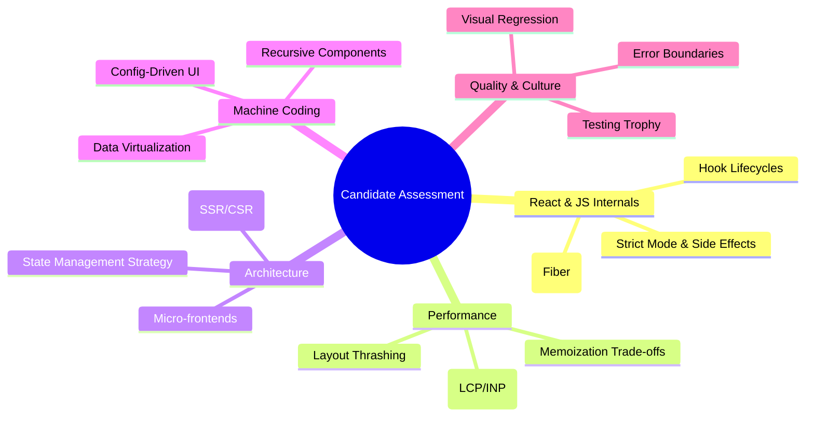

# Interviewer Question Reference

Use this guide as a structured bank of questions to assess candidates across different seniority levels.

---

## 🗺️ The Interview Pillars

---

## ⚛️ 1. React Core & Internals (Depth Assessment)

1.  **Reconciliation:** "How does React decide what to update in the real DOM? Can you explain the heuristics it uses to keep the process O(n)?"
    - _Look for:_ Keys, element types, and the concept of the Virtual DOM.
2.  **Fiber Architecture:** "What problem was the React Fiber rewrite trying to solve? How does it differ from the old Stack Reconciler?"
    - _Look for:_ Incremental rendering, concurrency, and prioritizing updates (e.g., user input over data fetching).
3.  **The `useRef` Hook:** "Beyond accessing DOM elements, what is the primary architectural purpose of `useRef`? How does its referential identity behave across renders?"
    - _Look for:_ Persisting mutable values without triggering re-renders; stable references.
4.  **Strict Mode:** "What actually happens when you wrap an app in `<StrictMode>`? Why does it intentionally double-invoke certain functions?"
    - _Look for:_ Finding side effects, identifying legacy APIs, and preparing for concurrent features.
5.  **`useSyncExternalStore` (Senior):** "If you are building a library that subscribes to a browser API (like `navigator.onLine`), why would you use `useSyncExternalStore` instead of `useEffect`?"
    - _Look for:_ Preventing 'tearing' in concurrent rendering.

---

## ⚡ 2. Performance & Web Vitals

1.  **The Memoization Trade-off:** "We often hear 'memoize everything' is bad advice. Under what specific conditions does using `useMemo` or `React.memo` actually _hurt_ performance?"
    - _Look for:_ Comparison cost vs. render cost, memory overhead, and frequent prop changes.
2.  **Layout Thrashing:** "Explain a scenario where writing and then reading from the DOM in a loop causes a performance bottleneck. How would you refactor it?"
    - _Look for:_ Forced synchronous layouts, batching reads/writes, and `requestAnimationFrame`.
3.  **React 18 Concurrent Hooks:** "When would you choose `useTransition` over `useDeferredValue`? Give a concrete UI example for each."
    - _Look for:_ `useTransition` for state-driven updates; `useDeferredValue` for prop-driven updates.
4.  **Web Vitals (LCP/INP/CLS):** "Your LCP is high, but your initial bundle size is small. What other factors could be the culprit?"
    - _Look for:_ Slow server response (TTFB), render-blocking CSS/JS, or large unoptimized images.
5.  **Main Thread Optimization:** "How do you handle a task that takes 500ms to calculate without freezing the UI thread?"
    - _Look for:_ Web Workers, `requestIdleCallback`, or breaking tasks into chunks.

---

## 🏛️ 6. Staff-Level Assessment: Red Flags vs. Green Flags

When interviewing for Senior/Staff roles, look for the following behavioral and technical indicators:

| Category            | 🚩 Red Flag (Senior-Minus)                           | ✅ Green Flag (Staff-Plus)                                                                    |
| :------------------ | :--------------------------------------------------- | :-------------------------------------------------------------------------------------------- |
| **Problem Solving** | Jumps straight into code/syntax.                     | Asks about **Constraints** and **Business Value** first.                                      |
| **Performance**     | Says "I use useMemo for everything."                 | Discusses **Trade-offs** (CPU vs Network) and **Metric-Driven** optimization.                 |
| **Security**        | Thinks `HttpOnly` solves all XSS.                    | Mentions **Trusted Types**, **Nonce-based CSP**, and **Defense-in-Depth**.                    |
| **Scalability**     | Suggests "Adding more servers" for every bottleneck. | Identifies **Data Contention**, **Hot Shards**, and **Distributed Consistency** issues.       |
| **Testing**         | Focuses on 100% Code Coverage.                       | Focuses on **Contract Testing**, **Flaky Test Management**, and **Production Observability**. |
| **Compliance**      | Sees it as a "Check-the-box" annoying task.          | Sees it as a **System Constraint** and builds **Automated Guardrails** to help the team.      |

---

## 🧠 Final Interviewer Tip

A Staff Engineer is not just a "Faster Coder." They are a **Force Multiplier**. They build the patterns, libraries, and documentation that allow the other 10 developers on the team to be 10% more effective every day.

---

## 🏗️ 3. Architecture & System Design

1.  **Scaling Frontend:** "In backend, we scale with more servers. How do you scale a complex Frontend application for 50+ developers across 5 teams?"
    - _Look for:_ Micro-frontends (Module Federation), shared design systems, monorepo tooling (Nx/Turbo), and RFC processes.
2.  **Hybrid Rendering:** "In a Next.js App Router environment, a component is marked `"use client"`. Does it still render on the server? Explain the lifecycle from request to hydration."
    - _Look for:_ SSR for initial HTML, JS bundle download, and hydration for interactivity.
3.  **State Management Strategy:** "If you were starting a large-scale project today, how would you decide between Context API, a library like Zustand/Redux, and a server-state library like TanStack Query?"
    - _Look for:_ Separating Server State vs. UI State vs. Global UI State.
4.  **Micro-frontends:** "What are the primary risks of using Module Federation? How do you handle version mismatches of shared dependencies like React?"
    - _Look for:_ Dependency "singletons," runtime errors, and visual inconsistency.

---

## 🛠️ 4. Machine Coding Scenarios (Prompting)

1.  **Config-Driven UI:** "Design a system where the entire Checkout Form is rendered from a JSON schema sent by the backend. How do you handle conditional field visibility and validation?"
2.  **Recursive UI:** "How would you build a File Explorer component that supports nested folders of infinite depth? How do you handle state updates for a file buried 10 levels deep?"
3.  **Data Virtualization:** "I have a list of 100,000 users. I need to show them in a scrollable list with a search bar. How do you implement this while keeping the DOM node count under 50?"
4.  **Search with Debounce:** "Implement a search input that calls an API. If the user types 'A', then 'B' quickly, but the 'A' request takes longer to return than 'B', how do you prevent the wrong data from showing?"
    - _Look for:_ `AbortController` or boolean flags in `useEffect` cleanup.

---

## 🧪 5. Testing & Quality

1.  **The Testing Trophy:** "Why is it often recommended to prioritize Integration tests over Unit tests in React?"
    - _Look for:_ Testing user behavior vs. implementation details; higher confidence.
2.  **Visual Regression:** "How do you catch a bug where a CSS change in one component accidentally breaks the layout of another page?"
    - _Look for:_ Snapshot testing vs. Visual Regression tools (Chromatic/Percy).
3.  **Error Boundaries:** "Where would you strategically place Error Boundaries in a dashboard app to ensure a single widget crash doesn't kill the entire session?"
