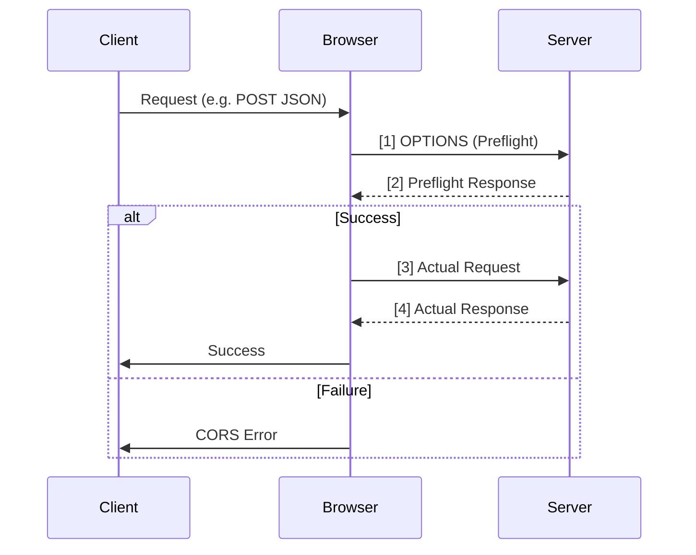

# CORS (Cross-Origin Resource Sharing)

CORS is a security feature implemented by browsers that restricts web pages from making requests to a different domain than the one that served the web page.

## The Problem: Same-Origin Policy (SOP)

By default, browsers follow the **Same-Origin Policy (SOP)**, which prevents a script on `https://domain-a.com` from accessing data on `https://domain-b.com`. This is crucial to prevent malicious sites from stealing your session cookies or sensitive data from other sites you are logged into.

## What is a Cross-Origin Request?

A request is considered **Cross-Origin** if any of the following parts of the URL are different between the origin (where the request starts) and the target (the API/resource):

1.  **Protocol** (e.g., `http` vs `https`)
2.  **Port** (e.g., `localhost:4000` vs `localhost:4001`)
3.  **Subdomain** (e.g., `a.com` vs `api.a.com`)

### Cross-Origin Examples:

| Origin (Source)         | Target (Resource)        | Cross-Origin? | Reason              |
| :---------------------- | :----------------------- | :------------ | :------------------ |
| `http://localhost:4000` | `http://localhost:4001`  | ✅ **Yes**    | Different Port      |
| `http://example.com`    | `https://example.com`    | ✅ **Yes**    | Different Protocol  |
| `http://example.com`    | `http://api.example.com` | ✅ **Yes**    | Different Subdomain |
| `https://my-app.com`    | `https://my-app.com/api` | ❌ **No**     | Same Origin         |

---

## How CORS Works

CORS allows servers to "opt-in" to sharing resources with specific origins.

### 1. Simple Requests

For certain "simple" requests (e.g., GET/POST with standard headers), the browser sends the request and checks the response for the `Access-Control-Allow-Origin` header.

### 2. Preflight Requests (OPTIONS)

A **Preflight Request** is an additional safety check sent by the browser _before_ the actual request to verify that the server understands and permits the cross-origin call. It uses the **OPTIONS** HTTP method.

#### When does it happen?

The browser automatically triggers a preflight request if the call is **not a "Simple Request"**. A request is preflighted if:

- It uses methods other than `GET`, `HEAD`, or `POST`.
- It uses `POST` with a `Content-Type` other than `application/x-www-form-urlencoded`, `multipart/form-data`, or `text/plain` (e.g., `application/json` triggers a preflight).
- It contains **custom headers** (e.g., `Authorization`, `X-Custom-Header`).

#### Preflight Flow (The Diagram)



## CORS Response Headers

The following headers are sent by the server to control how the browser handles the cross-origin request.

| Header                                 | Description                                                                                       | When to Use                                                                                        |
| :------------------------------------- | :------------------------------------------------------------------------------------------------ | :------------------------------------------------------------------------------------------------- |
| **`Access-Control-Allow-Origin`**      | Specifies which origin(s) are permitted to access the resource.                                   | **Every CORS request.** Use `*` for public APIs or specific domains for private ones.              |
| **`Access-Control-Allow-Methods`**     | Lists the HTTP methods (GET, POST, etc.) allowed for the resource.                                | **Preflight (OPTIONS).** Tells the browser which actions are valid.                                |
| **`Access-Control-Allow-Headers`**     | Lists the custom headers the client is allowed to send.                                           | **Preflight (OPTIONS).** Necessary if you use headers like `Authorization` or `X-API-Key`.         |
| **`Access-Control-Allow-Credentials`** | Indicates whether the response can be shared when the `credentials` flag is true (e.g., cookies). | **Auth scenarios.** Required if the client needs to send/receive cookies or HTTP Auth.             |
| **`Access-Control-Expose-Headers`**    | Whitelists headers that browsers are allowed to access from the response.                         | **Custom Response Headers.** Use this if your JS needs to read a custom header sent by the server. |
| **`Access-Control-Max-Age`**           | Specifies how long the results of a preflight request can be cached.                              | **Optimization.** Reduces the number of OPTIONS requests.                                          |

---

## Interview Grill: CORS & Preflight

**Q: Does every cross-origin request trigger a preflight?**
**A:** No. Only "non-simple" requests trigger a preflight. Simple GET/POST requests with standard content types bypass this to save a network round-trip.

**Q: Why do we even need Preflight? Why not just send the request and check headers?**
**A:** Preflight protects **legacy servers** that weren't designed with CORS in mind. A legacy server might perform a destructive action (like `DELETE`) before it even looks at the response headers. Preflight ensures the server "opts-in" to the cross-origin call before any real data is sent.

**Q: How can we optimize or "skip" the preflight for performance?**
**A:**

1.  **Cache the Preflight:** Use the `Access-Control-Max-Age` header in the preflight response. The browser will remember the permission for X seconds and skip the OPTIONS call for subsequent requests.
2.  **Use Simple Requests:** If possible, stick to `GET` or `POST` with `text/plain` and avoid custom headers (not always practical for modern APIs).

**Q: Can I use `Access-Control-Allow-Origin: *` when `Access-Control-Allow-Credentials` is set to `true`?**
**A:** No. Browsers will block the request if both are present. When using credentials (cookies/auth), the server **must** specify a single, specific origin in the `Access-Control-Allow-Origin` header.

**Q: What happens if the Preflight (OPTIONS) returns a 404?**
**A:** The browser will treat it as a CORS failure and will **not** proceed to make the actual request. The developer will see a "CORS error" in the console.

---

## Express.js Example

Using the popular `cors` middleware:

```javascript
const express = require('express');
const cors = require('cors');
const app = express();

// 1. Allow ALL origins (Not recommended for production)
// app.use(cors());

// 2. Allow specific origins (Best Practice)
const allowedOrigins = ['https://trusted-app.com', 'https://another-partner.com'];

const corsOptions = {
  origin: function (origin, callback) {
    // allow requests with no origin (like mobile apps or curl requests)
    if (!origin) return callback(null, true);

    if (allowedOrigins.indexOf(origin) !== -1) {
      callback(null, true); // Origin matches whitelist
    } else {
      callback(new Error('Not allowed by CORS')); // Block the request
    }
  },
  methods: ['GET', 'POST', 'PUT'],
  allowedHeaders: ['Content-Type', 'Authorization'],
  credentials: true,
  optionsSuccessStatus: 200,
};

app.use(cors(corsOptions));

app.get('/api/data', (req, res) => {
  res.json({ message: 'This data is cross-origin accessible!' });
});

app.listen(3000);
```

---

## Common Pitfalls

- **Wildcard `*` with Credentials:** You cannot use `Access-Control-Allow-Origin: *` if `Access-Control-Allow-Credentials` is `true`. You must specify a specific origin.
- **Missing OPTIONS handling:** If you implement CORS manually without a library, ensure your server handles `OPTIONS` requests and returns a `200 OK` with the correct headers.
- **Case Sensitivity:** Header names are case-insensitive, but values (like origin) are often case-sensitive.
