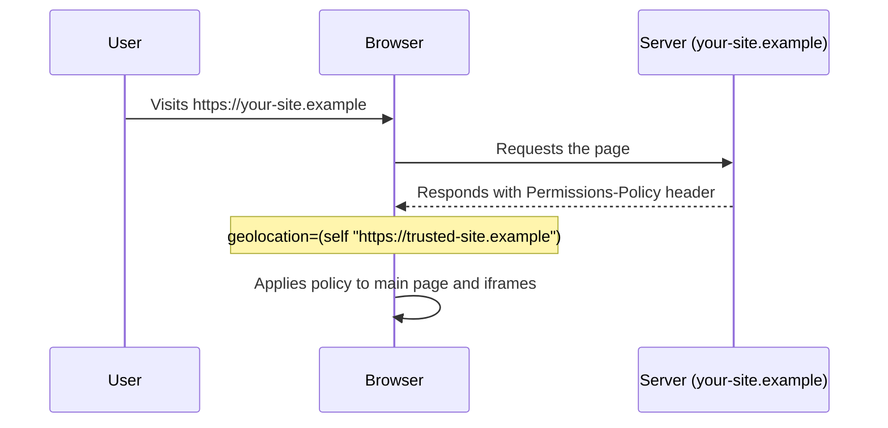

# Permissions Policy

Permissions Policy (formerly known as **Feature Policy**) is a web security mechanism that allows web developers to selectively enable, disable, and modify the behavior of certain browser features and APIs.

By using Permissions Policy, you can control which origins can access features like the camera, microphone, geolocation, and more, both for your own page and for any embedded iframes.

## Key Benefits

- **Security:** Limits the attack surface by disabling unused features.
- **Privacy:** Prevents unauthorized access to sensitive user data (e.g., location, media devices).
- **Performance:** Can disable heavy features like synchronous XHR or unoptimized images.

---

## How to Implement

### 1. HTTP Response Header

The most common way to implement a Permissions Policy is through the `Permissions-Policy` HTTP header.

**Syntax:**

```http
Permissions-Policy: feature=(sources), feature2=(sources)
```

**Common Sources:**

- `*`: The feature is allowed in all contexts.
- `self`: The feature is allowed only on the same origin.
- `()`: The feature is disabled everywhere (empty list).
- `(https://example.com)`: The feature is allowed for a specific origin.

### 2. The `allow` Attribute on Iframes

You can also specify policies for specific iframes using the `allow` attribute.

```html
<iframe src="https://example.com" allow="camera; microphone; geolocation 'self' https://trusted.com"></iframe>
```

---

## Evaluation Flow

The following diagram illustrates how the browser requests the page and applies the `Permissions-Policy` header.



---

## Iframe Evaluation Logic

When a feature is requested within an iframe, the browser checks both the **Response Header** of the top-level page and the **`allow` attribute** on the iframe tag.

**Example Policy Header:**
`Permissions-Policy: geolocation=(self "https://trusted-site.example")`

| Case    | Context / Iframe Tag                                                     | Result         | Why?                                                    |
| :------ | :----------------------------------------------------------------------- | :------------- | :------------------------------------------------------ |
| **[1]** | Main page code (`https://your-site.example`)                             | ✅ **Allowed** | Covered by `self` in the header.                        |
| **[2]** | `<iframe src="https://your-site.example/embed">`                         | ✅ **Allowed** | Same-origin as the parent.                              |
| **[3]** | `<iframe src="https://subdomain.your-site.example" allow="geolocation">` | ❌ **Blocked** | Subdomains are different origins and not in the header. |
| **[4]** | `<iframe src="https://trusted-site.example" allow="geolocation">`        | ✅ **Allowed** | In header allowlist AND has `allow` attribute.          |
| **[5]** | `<iframe src="https://trusted-site.example">`                            | ❌ **Blocked** | In header allowlist BUT missing `allow` attribute.      |
| **[6]** | `<iframe src="https://ad.example" allow="geolocation">`                  | ❌ **Blocked** | Not in the header allowlist.                            |

---

## Code Examples

### Express.js Example

This example shows how to set the `Permissions-Policy` header in a Node.js Express application to disable geolocation and camera access.

```javascript
const express = require('express');
const app = express();

// Middleware to set Permissions-Policy header
app.use((req, res, next) => {
  res.setHeader('Permissions-Policy', 'geolocation=(), camera=(), microphone=(self)');
  next();
});

app.get('/', (req, res) => {
  res.send(`
    <!DOCTYPE html>
    <html lang="en">
    <head>
        <meta charset="UTF-8">
        <title>Permissions Policy Demo</title>
    </head>
    <body>
        <h1>Permissions Policy is Active</h1>
        <p>Geolocation and Camera are disabled for this page.</p>
        <script>
            navigator.geolocation.getCurrentPosition(
                (pos) => console.log("Success"),
                (err) => console.error("Permission Denied: " + err.message)
            );
        </script>
    </body>
    </html>
  `);
});

app.listen(3000, () => {
  console.log('Server running on http://localhost:3000');
});
```

---

## Common Directives

| Directive     | Description                                                  |
| :------------ | :----------------------------------------------------------- |
| `geolocation` | Controls access to the Geolocation API.                      |
| `camera`      | Controls access to video input devices.                      |
| `microphone`  | Controls access to audio input devices.                      |
| `fullscreen`  | Controls whether the document can use `requestFullscreen()`. |
| `payment`     | Controls access to the Payment Request API.                  |
| `usb`         | Controls access to the WebUSB API.                           |
| `sync-xhr`    | Controls whether synchronous XMLHttpRequests are allowed.    |
| `autoplay`    | Controls whether media can autoplay.                         |

## Testing and Debugging

You can verify the policy is working by:

1. Checking the **Network** tab in Browser DevTools for the `Permissions-Policy` header.
2. Checking the **Application** or **Security** tab (depending on the browser) for active policies.
3. Observing console warnings/errors when a blocked feature is accessed.
