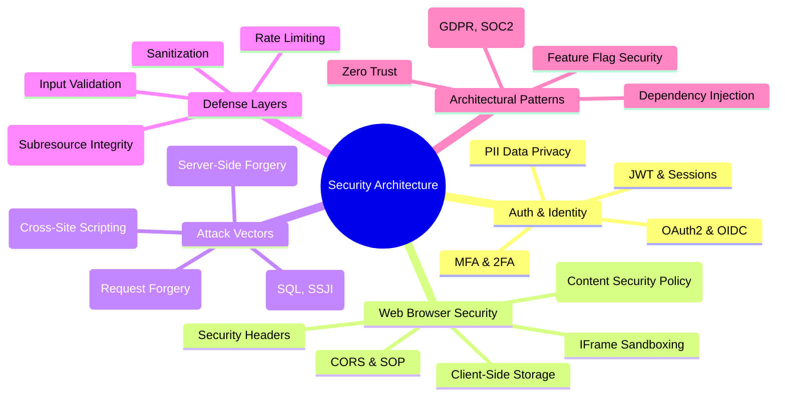

# 🛡️ Security Architecture & Engineering Hub

Welcome to the central security knowledge base. This directory covers end-to-end web security, from browser-level primitives to server-side architectural patterns.

---

## PII: Personal Identity information

### The person whom trust the most is the most dangerous person, that exactly happens in security.

---

## Security Landscape

---

## Knowledge Modules

### 🔐 Authentication & Identity

Fundamental concepts and implementation details for securing user sessions and identity.

- **[Authentication & Authorization](./Auth/README.md):** Deep dive into MFA, OAuth2, OIDC, and session management.
- **[PII (Personally Identifiable Information)](./PII/README.md):** Standards for handling, encrypting, and redacting sensitive user data.

### 🌐 Web Browser Security

How browsers protect (and expose) your application.

- **[CORS (Cross-Origin Resource Sharing)](./CORS/README.md):** Understanding the Same-Origin Policy and secure cross-domain communication.
- **[Security Headers](./SecurityHeaders/README.md):** HSTS, X-Frame-Options, X-Content-Type-Options, and more.
- **[IFrame Security](./IFrame/README.md):** Sandboxing and cross-window communication (`postMessage`).
- **[Permission Policies](./PermissionPolicies/PermissionPolicies.md):** Restricting browser features like Camera, Mic, and Geolocation.
- **[Subresource Integrity (SRI)](./SubresourceIntegrity/README.md):** Protecting against CDN-based supply chain attacks.
- **[Client-Side Storage](./ClientSideStorage/README.md):** Security trade-offs between Cookies, LocalStorage, and IndexedDB.

### ⚔️ Common Attack Vectors & Mitigations

Understanding how attackers think and how to build resilient systems.

- **[XSS (Cross-Site Scripting)](./XSS/README.md):** Injection attacks and modern CSP-based mitigations.
- **[CSRF (Cross-Site Request Forgery)](./CSRF.md):** Exploiting session trust and token-based defenses.
- **[SSRF & Injection](./SSRF&JI.md):** Server-Side Request Forgery, SSJI, and XXE vulnerabilities.
- **[Input Validation & Sanitization](./Validation/InputValidation&Sanitization.md):** The first line of defense against all injection attacks.

### 🏗️ Advanced Architectural Patterns

Enterprise-level security strategies.

- **[Dependency Injection Security](./DependencyInjection/README.md):** Patterns for secure service orchestration.
- **[Feature Flags](./FeatureFlags/README.md):** Security implications of dynamic runtime configuration.
- **[Compliance & Regulations](./Compliance&Regulations.md):** Navigating GDPR, HIPAA, SOC 2, and more.

---

## 🏛️ Architect's Decision Matrix: Security Trade-offs

Security is the art of "Informed Friction." You are choosing where to place the burden: on the attacker, the developer, or the user.

| Trade-off           | Option A: Client-Side (Easy)                              | Option B: Server-Side (Secure)                                | The "Staff" Decision                                                                                      |
| :------------------ | :-------------------------------------------------------- | :------------------------------------------------------------ | :-------------------------------------------------------------------------------------------------------- |
| **Session Storage** | **LocalStorage:** Accessible by JS, persists after close. | **HTTP-only Cookies:** Shielded from XSS, automatic delivery. | Use **HTTP-only, Secure, SameSite=Lax** cookies for critical sessions.                                    |
| **Auth Token**      | **JWT (Stateless):** Scalable, no DB lookup.              | **Opaque Tokens (Stateful):** Revocable, simple.              | Use **JWTs** for performance, but implement **Short-lived Access Tokens** + **Rotatable Refresh Tokens**. |
| **XSS Defense**     | **Sanitization Libraries:** (DOMPurify).                  | **CSP (Policy-based):** Global browser enforcement.           | Use **Both**. Sanitization is the "Filter," CSP is the "Containment Field."                               |

---

## The Unified Security "Grill"

### Q1: If you have a 100% secure CSP, do you still need to sanitize user input?

> **Answer:** Yes. CSP is a **Defense-in-Depth** mechanism (Containment). It stops the _execution_ of malicious scripts, but it doesn't stop the _content_ from being defaced, or data from being exfiltrated via "Non-script" vectors like CSS `background-image` or `meta` redirects.

### Q2: JWTs are "Stateless"—so how do you handle a "Force Logout All Devices" requirement?

> **Answer:** This is the "Stateless Paradox." To revoke a JWT before it expires, you **MUST** introduce state.
>
> - **The Hybrid Solution:** Maintain a "Blacklist" or "Version Number" in Redis. When a user logs out, store the `jti` (JWT ID) in Redis. Every request checks this cache.
> - **Optimization:** To keep it fast, check the blacklist at the **API Gateway** level, not in every microservice.

### Q3: Why is `SameSite=Strict` often a bad idea for UX, and why is `Lax` the new standard?

> **Answer:**
>
> - **Strict:** Cookies are NOT sent on any cross-site request. If a user clicks a link from their Email to your app, they will arrive "Logged Out."
> - **Lax:** Cookies are sent on "Safe" top-level navigations (GET requests). This preserves the "Login state" when arriving from an external site while still blocking CSRF on sensitive POST/PUT actions.

### Q4: Explain the "Confused Deputy" problem in the context of SSRF.

> **Answer:** In an SSRF attack, the attacker "tricks" the server (the Deputy) into using its internal privileges to access resources it shouldn't (like `localhost:8080/admin` or AWS metadata endpoints). The server is "confused" because it thinks it's performing a legitimate internal task (like fetching an image) but is actually acting on behalf of an attacker.

---

## 🚀 Interview & Assessment

Ready to test your knowledge or preparing for a Staff/Architect role?

- **[Security Q&A Guide (33 Core Questions)](./Security_QA.md):** Detailed explanations covering XSS, CSRF, Clickjacking, Headers, Auth, HTTPS, Dependencies, and Compliance.
- **[Security Architect Interview Grill](../Questions/Detailed/Security_Architect.md):** High-level architectural challenges and "grill" style questions.

---

> "Security is not a product, but a process." — Bruce Schneier
