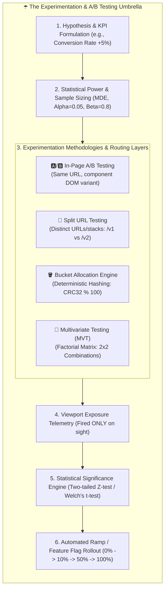
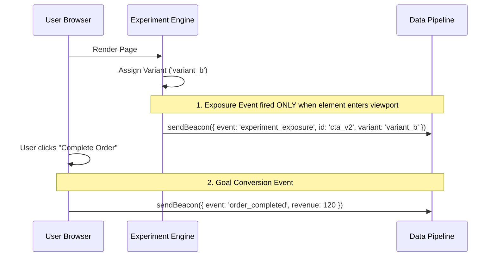

# A/B Testing, Split Testing & Bucket Testing Architecture

> **Scope:** Designing, executing, and statistically validating client-side, edge, and server-side randomized controlled experiments, split-URL routing, bucket allocation algorithms, and feature flags.

---

## Table of Contents

- [A/B Testing, Split Testing \& Bucket Testing Architecture](#ab-testing-split-testing--bucket-testing-architecture)
  - [Table of Contents](#table-of-contents)
  - [1. The Experimentation Umbrella: Why Everything Falls Under "A/B Testing"](#1-the-experimentation-umbrella-why-everything-falls-under-ab-testing)
  - [2. Terminology \& Taxonomy Breakdown](#2-terminology--taxonomy-breakdown)
  - [3. Core Architecture Models: Client vs. Edge vs. Server](#3-core-architecture-models-client-vs-edge-vs-server)
  - [4. Deterministic Consistent Hashing Algorithm](#4-deterministic-consistent-hashing-algorithm)
  - [5. Eliminating Flash of Original Content (FOOC)](#5-eliminating-flash-of-original-content-fooc)
  - [6. Statistical Rigor \& The Peeking Problem](#6-statistical-rigor--the-peeking-problem)
  - [7. Telemetry: Exposure Tracking vs. Goal Conversions](#7-telemetry-exposure-tracking-vs-goal-conversions)
  - [8. Complete Production A/B Testing Engine \& Unit Test Suite](#8-complete-production-ab-testing-engine--unit-test-suite)
  - [9. When to Use vs. When NOT to Use](#9-when-to-use-vs-when-not-to-use)

---

## 1. The Experimentation Umbrella: Why Everything Falls Under "A/B Testing"

In software engineering, product management, and growth architecture, **"A/B Testing" is widely used as the overarching umbrella term** for all **Randomized Controlled Experiments (RCE)**. 

Under this unified umbrella, **Split Testing**, **Bucket Testing**, **In-Page A/B Testing**, and **Multivariate Testing (MVT)** are simply different **execution layers, routing strategies, or partitioning algorithms** of the exact same end-to-end experiment lifecycle.



---

## 2. Terminology & Taxonomy Breakdown

While all methods operate under the same experimentation lifecycle, their technical scopes differ:

```text
+----------------------------+------------------------------------------------------+---------------------------------------------------+
| Testing Sub-Type           | Core Definition & Technical Scope                    | Architectural Implementation Layer                |
+----------------------------+------------------------------------------------------+---------------------------------------------------+
| **In-Page A/B Testing**    | Comparing version A (Control) against version B      | Single page/component DOM mutation or React       |
|                            | (Variant) with one isolated visual/logic change.     | feature toggle flag inside the UI bundle.         |
+----------------------------+------------------------------------------------------+---------------------------------------------------+
| **Split URL Testing**      | Routing traffic between two entirely different URL   | Edge router / Reverse proxy rewrite               |
| **(Split Testing)**        | endpoints (e.g. `/landing` vs `/landing-v2`).        | (Cloudflare Worker, Next.js Middleware, Nginx).   |
+----------------------------+------------------------------------------------------+---------------------------------------------------+
| **Bucket Testing**         | The mathematical partitioning mechanism dividing     | Consistent hashing algorithm (`CRC32(ID:salt)%100`|
| **(Cohort Bucketing)**     | users into discrete cohorts (50/50, 80/20, 33/33/33).| assigns user into a deterministic hash bucket).   |
+----------------------------+------------------------------------------------------+---------------------------------------------------+
| **Multivariate (MVT)**     | Testing multiple variables simultaneously in all     | Factorial combination matrix                      |
|                            | permutations (e.g. 2 Headlines × 2 Buttons = 4 var). | ($2 \times 2 = 4$ distinct variant cohorts).      |
+----------------------------+------------------------------------------------------+---------------------------------------------------+
```

---

## 3. Core Architecture Models: Client vs. Edge vs. Server

```mermaid
flowchart TD
    subgraph Client_Side [1. Client-Side SPA Bucketing]
        A1[Browser Requests HTML] --> B1[Downloads JS Bundle]
        B1 --> C1[JS Evaluates Experiment & Rewrites DOM]
        C1 -.->|Problem: Layout Flash / FOOC| D1[User Sees Visual Jitter]
    end

    subgraph Edge_Middleware [2. Edge / Next.js Middleware Bucketing - Recommended]
        A2[Browser Request] --> B2[Edge Worker: Cloudflare / Vercel]
        B2 --> C2[Read Sticky Cookie or Compute Hash]
        C2 --> D2[Rewrite HTML Stream / Route]
        D2 --> E2[Browser Receives Pre-Bucketed HTML - Zero FOOC]
    end
```



| Dimension           | Client-Side SPA                           | Edge Middleware                           | Server-Side                                |
| :------------------ | :---------------------------------------- | :---------------------------------------- | :----------------------------------------- |
| **Flicker / FOOC**  | ⚠️ High risk (requires anti-flicker CSS). | 🌟 Zero flicker (HTML rewritten at edge). | 🌟 Zero flicker (HTML rendered on server). |
| **Latency**         | ⚡ Zero initial network hop.              | $\approx 5-15\text{ms}$ edge execution.   | Standard server TTFB.                      |
| **Dynamic Routing** | DOM mutation inside React component.      | Edge URL rewrite / cookie injection.      | Server-rendered component props.           |

---

## 4. Deterministic Consistent Hashing Algorithm

To assign users to variants stickily without database lookups on every request, hash the `(userId + experimentSalt)` into an integer $0-99$:

$$\text{Bucket} = \text{Hash}(\text{userId} + \text{":"} + \text{salt}) \pmod{100}$$

---

## 5. Eliminating Flash of Original Content (FOOC)

If client-side experimentation is mandatory:

1. **Anti-Flicker CSS Snippet:** Inject a blocking opacity style:
   ```html
   <style id="ab-anti-flicker">
     .experiment-hero {
       opacity: 0 !important;
     }
   </style>
   ```
2. **Timeout Fallback:** If the client script does not resolve within 50ms, remove the style to avoid blocking content for slow connections.

---

## 6. Statistical Rigor & The Peeking Problem

- **Statistical Significance ($p < 0.05$):** $95\%$ probability that the observed conversion lift is not due to random variance.
- **The Peeking Problem:** Constantly monitoring live metrics and terminating the test as soon as $p < 0.05$ inflates false positive error rates from $5\%$ to $> 30\%$.
- **Mitigation:** Pre-compute **Minimum Sample Size** based on Baseline Conversion Rate and **Minimum Detectable Effect (MDE)**, and run until sample size is achieved.

---

## 7. Telemetry: Exposure Tracking vs. Goal Conversions



> [!IMPORTANT]
> **Exposure Rule:** Never fire an exposure event when the variant is assigned in memory. Fire it **only when the user actually views or interacts with the variant in the viewport**.

---

## 8. Complete Production A/B Testing Engine & Unit Test Suite

```typescript
// ab/experimentEngine.ts
export interface VariantConfig {
  name: string;
  weight: number; // 0 - 100
}

export interface ExperimentConfig {
  id: string;
  salt: string;
  variants: VariantConfig[];
}

export class ExperimentEngine {
  private queryParams: URLSearchParams;

  constructor(searchQuery = window?.location?.search ?? '') {
    this.queryParams = new URLSearchParams(searchQuery);
  }

  // DJB2 Deterministic Hashing
  private hashString(str: string): number {
    let hash = 5381;
    for (let i = 0; i < str.length; i++) {
      hash = (hash * 33) ^ str.charCodeAt(i);
    }
    return Math.abs(hash >>> 0);
  }

  getVariant(userId: string, experiment: ExperimentConfig): string {
    if (!userId || !experiment?.variants?.length) {
      return experiment?.variants?.[0]?.name ?? 'control';
    }

    // 1. QA / Developer Override Parameter: ?ab_checkout_exp=variant_b
    const overrideParam = `ab_${experiment.id}`;
    if (this.queryParams.has(overrideParam)) {
      const forced = this.queryParams.get(overrideParam)!;
      if (experiment.variants.some((v) => v.name === forced)) {
        return forced;
      }
    }

    // 2. Deterministic Hash Bucketing
    const hash = this.hashString(`${userId}:${experiment.salt}`);
    const bucket = hash % 100;

    let cumulative = 0;
    for (const v of experiment.variants) {
      cumulative += v.weight;
      if (bucket < cumulative) return v.name;
    }

    return experiment.variants[0].name;
  }
}
```

```typescript
// ab/experimentEngine.test.ts
import { describe, it, expect } from 'vitest';
import { ExperimentEngine, ExperimentConfig } from './experimentEngine';

describe('ExperimentEngine', () => {
  const exp: ExperimentConfig = {
    id: 'hero_cta',
    salt: 'salt_v1',
    variants: [
      { name: 'control', weight: 50 },
      { name: 'variant_b', weight: 50 },
    ],
  };

  it('assigns the exact same variant consistently to the same user (sticky)', () => {
    const engine = new ExperimentEngine();
    const v1 = engine.getVariant('user_abc', exp);
    const v2 = engine.getVariant('user_abc', exp);
    expect(v1).toBe(v2);
  });

  it('distributes 1,000 users evenly according to 50/50 weights', () => {
    const engine = new ExperimentEngine();
    const counts = { control: 0, variant_b: 0 };

    for (let i = 0; i < 1000; i++) {
      const variant = engine.getVariant(`user_${i}`, exp);
      counts[variant as keyof typeof counts]++;
    }

    expect(counts.control).toBeGreaterThan(450);
    expect(counts.control).toBeLessThan(550);
  });

  it('respects URL query parameter override for QA testing', () => {
    const engine = new ExperimentEngine('?ab_hero_cta=variant_b');
    expect(engine.getVariant('user_abc', exp)).toBe('variant_b');
  });
});
```

---

## 9. When to Use vs. When NOT to Use

| When to Use A/B Testing                                       | When NOT to Use A/B Testing                               |
| :------------------------------------------------------------ | :-------------------------------------------------------- |
| ✅ User conversion optimization (Checkout, Sign Up, Pricing). | ❌ Security patches or emergency hotfixes.                |
| ✅ Feature usability testing (New navigation bar vs old).     | ❌ Low-traffic sites unable to achieve statistical power. |
| ✅ Validating business hypotheses with measurable KPIs.       | ❌ Mandatory regulatory/compliance requirements.          |
