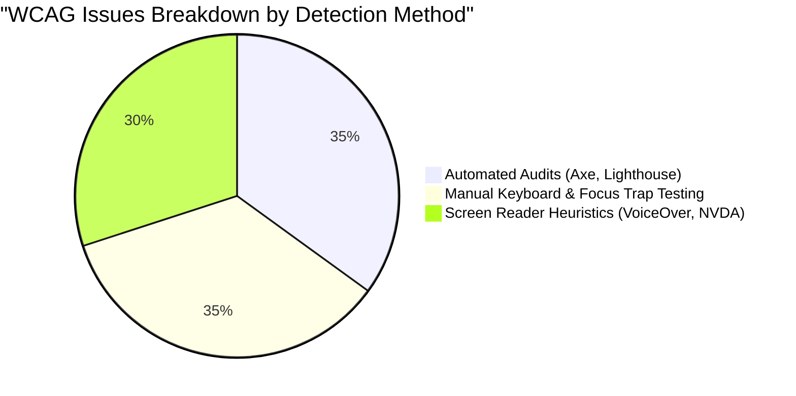

# Accessibility (a11y) Testing Architecture

> **Scope:** Ensuring digital experiences comply with WCAG 2.1/2.2 AA standards, keyboard navigation models, assistive technology semantics, and screen reader heuristics.

---

## Table of Contents

- [Accessibility (a11y) Testing Architecture](#accessibility-a11y-testing-architecture)
  - [Table of Contents](#table-of-contents)
  - [1. The Accessibility Testing Reality: Automated vs. Manual](#1-the-accessibility-testing-reality-automated-vs-manual)
  - [2. Automated Testing with `jest-axe`](#2-automated-testing-with-jest-axe)
  - [3. End-to-End a11y with `@axe-core/playwright`](#3-end-to-end-a11y-with-axe-coreplaywright)
  - [4. The 4 Essential Manual Testing Protocols](#4-the-4-essential-manual-testing-protocols)
  - [5. When to Use vs. When NOT to Use](#5-when-to-use-vs-when-not-to-use)

---

## 1. The Accessibility Testing Reality: Automated vs. Manual



> [!WARNING]
> Automated tools only catch $\approx 35\%$ of all WCAG violations (e.g. invalid color contrast, missing alt attributes, duplicate IDs).
> They **cannot** verify:
>
> 1. Logical keyboard tab order.
> 2. Screen reader announcement clarity and context.
> 3. Meaningful alt text (e.g. `` passes automated tools!).
> 4. Focus trapping in modals and custom widgets.

---

## 2. Automated Testing with `jest-axe`

```typescript
// components/Dialog.test.tsx
import { render } from '@testing-library/react';
import { axe, toHaveNoViolations } from 'jest-axe';
import { Dialog } from './Dialog';

expect.extend(toHaveNoViolations);

it('Dialog component has zero accessibility violations', async () => {
  const { container } = render(
    <Dialog isOpen={true} title="Account Settings">
      <p>Manage your account settings below.</p>
    </Dialog>
  );

  const results = await axe(container);
  expect(results).toHaveNoViolations();
});
```

---

## 3. End-to-End a11y with `@axe-core/playwright`

```typescript
// e2e/a11y.spec.ts
import { test, expect } from '@playwright/test';
import AxeBuilder from '@axe-core/playwright';

test('landing page meets WCAG 2.1 AA standards', async ({ page }) => {
  await page.goto('/');

  const accessibilityScanResults = await new AxeBuilder({ page })
    .withTags(['wcag2a', 'wcag2aa', 'wcag21a', 'wcag21aa'])
    .analyze();

  expect(accessibilityScanResults.violations).toEqual([]);
});
```

---

## 4. The 4 Essential Manual Testing Protocols

1. **Tab-Only Navigation:** Disconnect the mouse. Verify you can reach and activate every interactive control using `Tab`, `Shift+Tab`, `Enter`, and `Space`.
2. **Focus Trap Verification:** When a modal opens, keyboard focus must be trapped inside. Pressing `Escape` must close the dialog and restore focus to the trigger button.
3. **Zoom to 400% (Reflow Test):** Zoom browser to 400% on a 1280px viewport. Ensure horizontal scrollbars do not appear and content reflows vertically without clipping.
4. **Screen Reader Verification:** Turn on VoiceOver (macOS: `Cmd + F5`) or NVDA (Windows). Navigate using rotor / landmark headings and verify aria-live notifications.

---

## 5. When to Use vs. When NOT to Use

| When to Use a11y Testing                                   | When NOT to Use a11y Testing                             |
| :--------------------------------------------------------- | :------------------------------------------------------- |
| ✅ All public and enterprise customer-facing applications. | ❌ Pure headless CLI tools or server background daemons. |
| ✅ Design systems and core interactive UI widgets.         | ❌ Internal developer scripts.                           |
| ✅ Form inputs, modals, alerts, and navigation menus.      | ❌ Low-level network socket protocols.                   |
