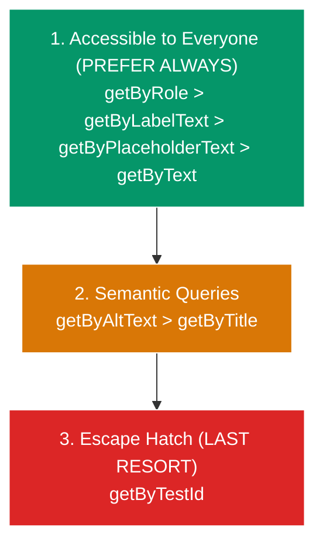
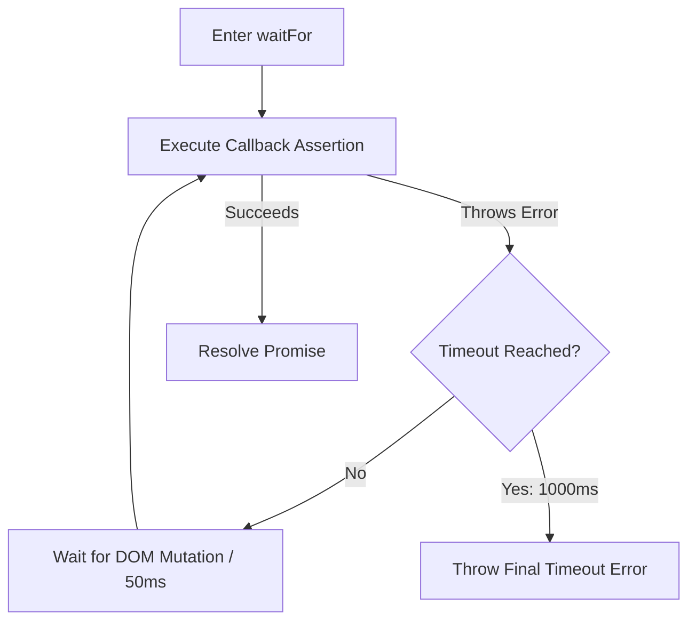

# Component & DOM Testing Architecture

> **Scope:** Verifying individual UI components, accessibility tree bindings, user event streams, local state transitions, error boundaries, and asynchronous rendering.

---

## Table of Contents

- [Component \& DOM Testing Architecture](#component--dom-testing-architecture)
  - [Table of Contents](#table-of-contents)
  - [1. Core Philosophy: React Testing Library (RTL)](#1-core-philosophy-react-testing-library-rtl)
  - [2. The Strict Query Priority Hierarchy](#2-the-strict-query-priority-hierarchy)
    - [Why `data-testid` is the Absolute Last Resort](#why-data-testid-is-the-absolute-last-resort)
    - [Query Selection Matrix](#query-selection-matrix)
  - [3. User Event Streams: `userEvent` vs. `fireEvent`](#3-user-event-streams-userevent-vs-fireevent)
  - [4. Asynchronous State: `act()`, `waitFor()` \& `findBy*`](#4-asynchronous-state-act-waitfor--findby)
    - [How `act()` Works Under the Hood](#how-act-works-under-the-hood)
    - [When DO You Need `act()`?](#when-do-you-need-act)
    - [`waitFor()` Mechanics \& Top 4 Deadly Anti-Patterns](#waitfor-mechanics--top-4-deadly-anti-patterns)
      - [🚫 The 4 Deadly Anti-Patterns:](#-the-4-deadly-anti-patterns)
  - [5. Testing Error Boundaries \& Portals](#5-testing-error-boundaries--portals)
  - [6. When to Use vs. When NOT to Use](#6-when-to-use-vs-when-not-to-use)

---

## 1. Core Philosophy: React Testing Library (RTL)

> "The more your tests resemble the way your software is used, the more confidence they can give you." — Kent C. Dodds

Component tests simulate how **real sighted users and screen readers** interact with your UI in a simulated DOM (JSDOM/HappyDOM).

- ❌ Do NOT test internal component state (`instance.state`).
- ❌ Do NOT test sub-component methods or private handlers.
- ✅ Assert on what is **visible, accessible, and rendered in the DOM**.

---

## 2. The Strict Query Priority Hierarchy



### Why `data-testid` is the Absolute Last Resort

1. **Zero Accessibility Validation:** A test targeting `getByTestId('submit-btn')` passes even if the button has `aria-hidden="true"`, missing label text, broken color contrast, or `tabindex="-1"`. When your test uses `getByRole('button', { name: /submit/i })`, it guarantees that assistive technology can discover and operate it.
2. **False Confidence:** A `<div>` with `onClick` and `data-testid="link"` passes tests, but keyboard-only users cannot focus it with `Tab` or trigger it with `Enter`/`Space`.
3. **Refactoring Fragility:** When styling or markup is refactored, `data-testid` attributes are often changed or dropped. Native roles (`<button>`, `<dialog>`, `<input>`) remain stable.

### Query Selection Matrix

| Query Method               | Target Element                                               | Accessibility Benefit                                         | Example Code                                     |
| :------------------------- | :----------------------------------------------------------- | :------------------------------------------------------------ | :----------------------------------------------- |
| **`getByRole`**            | Buttons, dialogs, checkboxes, headings, links, tabs.         | 🌟 Validates AccTree role and accessible name.                | `screen.getByRole('button', { name: /save/i })`  |
| **`getByLabelText`**       | Form inputs (text, number, date, select).                    | 🌟 Ensures `<input>` is programmatically linked to `<label>`. | `screen.getByLabelText(/password/i)`             |
| **`getByPlaceholderText`** | Input fields where `<label>` is not possible.                | ⚠️ Low (Placeholders vanish upon typing).                     | `screen.getByPlaceholderText(/search docs.../i)` |
| **`getByText`**            | Non-interactive text, paragraphs, headings, toast copy.      | ✅ Validates visible text rendered to users.                  | `screen.getByText(/account created/i)`           |
| **`getByDisplayValue`**    | Asserting current filled value of input or textarea.         | ✅ Validates form control value state.                        | `screen.getByDisplayValue('atul@example.com')`   |
| **`getByAltText`**         | Images, SVG charts with `role="img"`.                        | 🌟 Verifies image alternative text.                           | `screen.getByAltText(/profile avatar/i)`         |
| **`getByTestId`**          | Dynamic canvas, WebGL surfaces, invisible tracking wrappers. | ❌ Zero accessibility value.                                  | `screen.getByTestId('canvas-chart')`             |

---

## 3. User Event Streams: `userEvent` vs. `fireEvent`

| Feature               | `fireEvent.click(el)`                                     | `userEvent.click(el)`                                                                                                                          |
| :-------------------- | :-------------------------------------------------------- | :--------------------------------------------------------------------------------------------------------------------------------------------- |
| **Mechanism**         | Dispatches a single synthetic event directly on DOM node. | Simulates full browser lifecycle: `hover` $\to$ `pointerdown` $\to$ `mousedown` $\to$ `focus` $\to$ `pointerup` $\to$ `mouseup` $\to$ `click`. |
| **Disabled Elements** | ❌ Fires anyway even if button has `disabled`!            | ✅ Respects `disabled` & `pointer-events: none` (proper browser behavior).                                                                     |
| **Typing**            | Teleports entire string into input value at once.         | Dispatches `keydown`, `keypress`, input mutation, `keyup` per character.                                                                       |
| **Recommendation**    | ❌ Avoid for user interactions.                           | ✅ Always use `userEvent.setup()`.                                                                                                             |

---

## 4. Asynchronous State: `act()`, `waitFor()` & `findBy*`

### How `act()` Works Under the Hood

In React, `act()` provides an execution boundary:

1. Flushes the JavaScript **Microtask Queue** (Promises, `queueMicrotask`).
2. Synchronously executes pending `useEffect` and `useLayoutEffect` hooks.
3. Ensures the React Fiber reconciler has finished rendering and committed all DOM updates before test assertions run.

### When DO You Need `act()`?

- Custom hook state methods inside `renderHook(() => useHook())`.
- Advancing fake timers: `act(() => vi.advanceTimersByTime(500))`.
- External window/WebSocket listeners: `act(() => window.dispatchEvent(new Event('resize')))`.

> [!NOTE]
> When using `@testing-library/user-event` or `findBy*`, actions are **already wrapped in `act()` internally**.

---

### `waitFor()` Mechanics & Top 4 Deadly Anti-Patterns



#### 🚫 The 4 Deadly Anti-Patterns:

1. **NEVER Put Side-Effects Inside `waitFor`:**

   ```typescript
   // ❌ CATASTROPHIC BUG: Clicks multiple times during retry loop!
   await waitFor(() => {
     userEvent.click(screen.getByRole('button', { name: /save/i }));
     expect(screen.getByText(/saved/i)).toBeInTheDocument();
   });

   // ✅ CORRECT: Act once outside, await assertion inside
   await user.click(screen.getByRole('button', { name: /save/i }));
   expect(await screen.findByText(/saved/i)).toBeInTheDocument();
   ```

2. **NEVER Use Empty `waitFor` as a Sleep Hack:**

   ```typescript
   // ❌ BRITTLE
   await waitFor(() => {});

   // ✅ CORRECT
   await screen.findByRole('status');
   ```

3. **Prefer `findBy*` Over `waitFor(() => getBy*)`:**

   ```typescript
   // ⚠️ Verbose:
   await waitFor(() => expect(screen.getByRole('alert')).toBeInTheDocument());

   // ✅ Clean:
   expect(await screen.findByRole('alert')).toBeInTheDocument();
   ```

4. **Testing Absence: Use `waitForElementToBeRemoved`:**

   ```typescript
   // ❌ BAD: getBy throws before waitFor evaluates absence
   await waitFor(() => expect(screen.getByText(/loading/i)).not.toBeInTheDocument());

   // ✅ CORRECT:
   await waitForElementToBeRemoved(() => screen.queryByText(/loading/i));
   ```

---

## 5. Testing Error Boundaries & Portals

```typescript
// components/ErrorBoundary.test.tsx
import { render, screen } from '@testing-library/react';
import { describe, it, expect, vi } from 'vitest';
import { ErrorBoundary } from './ErrorBoundary';

const CrashingComponent = () => {
  throw new Error('Uncaught rendering exception');
};

describe('ErrorBoundary', () => {
  it('renders fallback UI when child tree throws', () => {
    // Suppress console.error logging in test output
    const spy = vi.spyOn(console, 'error').mockImplementation(() => {});

    render(
      <ErrorBoundary fallback={<div>Application Error Fallback</div>}>
        <CrashingComponent />
      </ErrorBoundary>
    );

    expect(screen.getByText('Application Error Fallback')).toBeInTheDocument();
    spy.mockRestore();
  });
});
```

---

## 6. When to Use vs. When NOT to Use

| When to Use Component Testing                               | When NOT to Use Component Testing                       |
| :---------------------------------------------------------- | :------------------------------------------------------ |
| ✅ Interactive UI widgets (Modals, Dropdowns, Forms, Tabs). | ❌ Pure math calculations (use Unit Tests).             |
| ✅ Prop permutations and accessibility tree compliance.     | ❌ Full multi-page browser journeys (use E2E Tests).    |
| ✅ Local state transitions and conditional rendering.       | ❌ Complex multi-service backend database integrations. |
