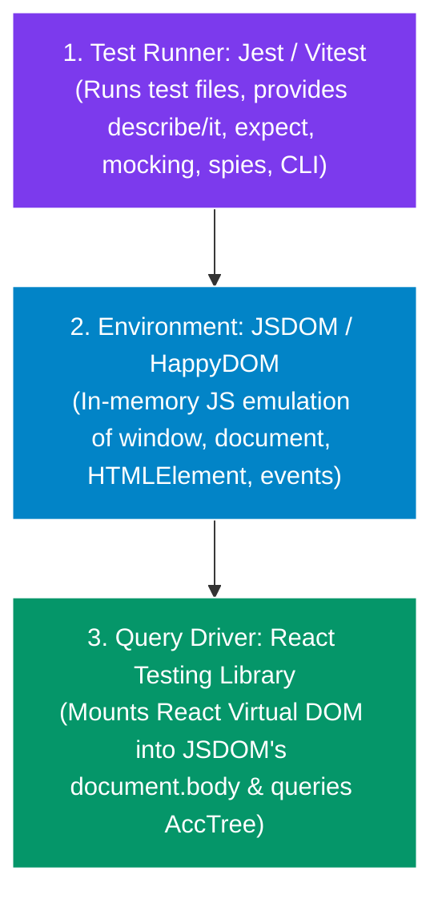
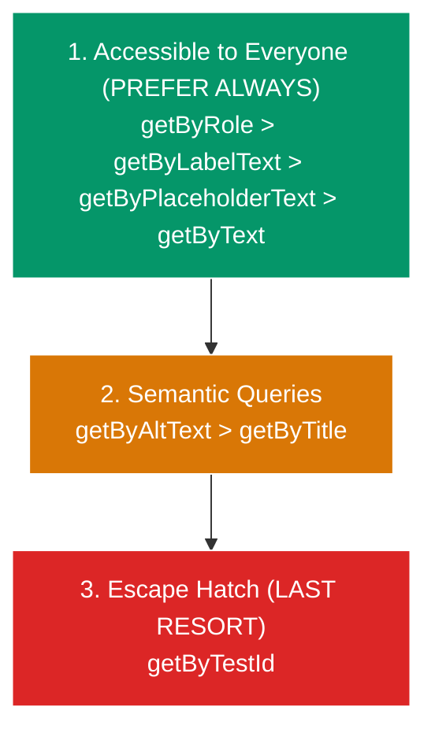
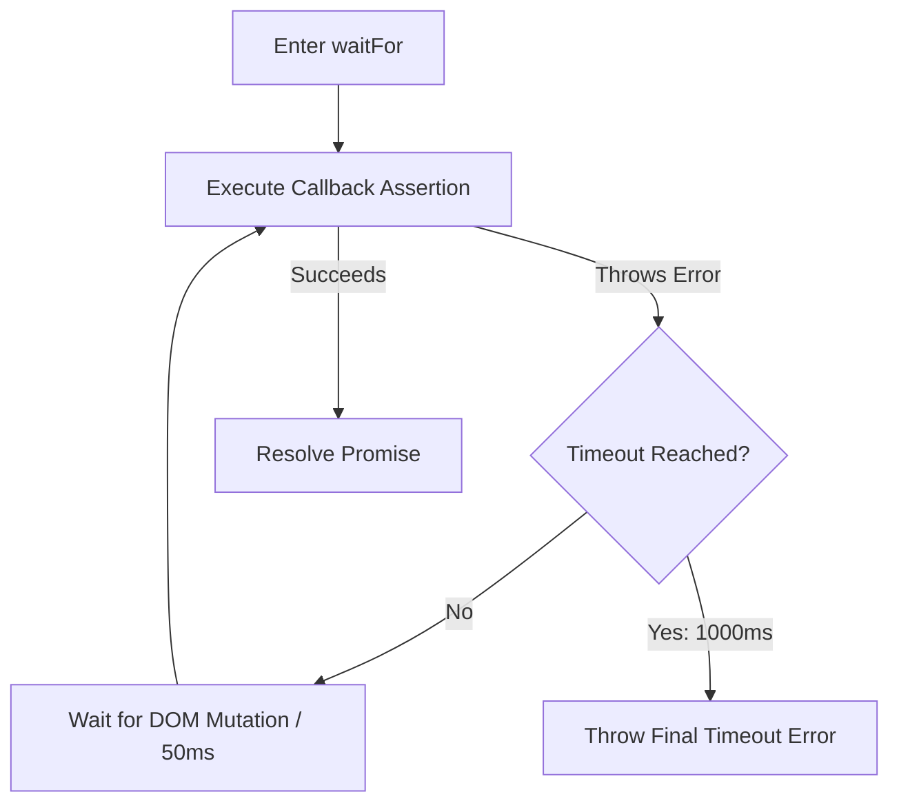

# Component & DOM Testing Architecture

> **Scope:** Verifying individual UI components, accessibility tree bindings, user event streams, local state transitions, error boundaries, and asynchronous rendering.

---

## Table of Contents

- [Component \& DOM Testing Architecture](#component--dom-testing-architecture)
  - [Table of Contents](#table-of-contents)
  - [1. Core Architecture: Jest vs. JSDOM vs. React Testing Library](#1-core-architecture-jest-vs-jsdom-vs-react-testing-library)
    - [Comparison \& Responsibilities Matrix](#comparison--responsibilities-matrix)
    - [What JSDOM Simulates vs. Real Browser Limitations](#what-jsdom-simulates-vs-real-browser-limitations)
  - [2. The React Testing Library (RTL) Philosophy](#2-the-react-testing-library-rtl-philosophy)
  - [3. The Strict Query Priority Hierarchy](#3-the-strict-query-priority-hierarchy)
    - [Why `data-testid` is the Absolute Last Resort](#why-data-testid-is-the-absolute-last-resort)
    - [Query Selection Matrix](#query-selection-matrix)
  - [4. User Event Streams: `userEvent` vs. `fireEvent`](#4-user-event-streams-userevent-vs-fireevent)
  - [5. Asynchronous State: `act()`, `waitFor()` \& `findBy*`](#5-asynchronous-state-act-waitfor--findby)
    - [How `act()` Works Under the Hood](#how-act-works-under-the-hood)
    - [When DO You Need `act()`?](#when-do-you-need-act)
    - [`waitFor()` Mechanics \& Top 4 Deadly Anti-Patterns](#waitfor-mechanics--top-4-deadly-anti-patterns)
      - [🚫 The 4 Deadly Anti-Patterns:](#-the-4-deadly-anti-patterns)
  - [6. Testing Error Boundaries \& Portals](#6-testing-error-boundaries--portals)
  - [7. When to Use vs. When NOT to Use](#7-when-to-use-vs-when-not-to-use)

---

## 1. Core Architecture: Jest vs. JSDOM vs. React Testing Library

Understanding the distinction between the **Test Runner (Jest/Vitest)**, the **DOM Emulator (JSDOM)**, and the **DOM Query Driver (React Testing Library)** is critical for writing fast, reliable tests:



### Comparison & Responsibilities Matrix

| Layer                     | Primary Role                               | What It Can Test                                                                                                      | What It CANNOT Do                                                                                                              |
| :------------------------ | :----------------------------------------- | :-------------------------------------------------------------------------------------------------------------------- | :----------------------------------------------------------------------------------------------------------------------------- |
| **Jest / Vitest**         | **Test Runner & Assertion Engine**         | Pure functions, business logic, math algorithms, Node.js backend APIs, execution timing (`fakeTimers`), spies/mocks.  | Does not provide a DOM or browser objects (`window`, `document`) on its own.                                                   |
| **JSDOM**                 | **In-Memory Browser Environment Emulator** | Simulates `window`, `document`, `HTMLElement`, `localStorage`, `addEventListener`, and DOM mutations in pure Node.js. | Has **no visual rendering engine**, no CSS layout calculations (elements have $0\text{px}$ width/height), and no real network. |
| **React Testing Library** | **DOM Query & Interaction Layer**          | Renders React trees into JSDOM, dispatches user events (`userEvent`), and queries the accessibility tree.             | Does not run tests on its own; depends on Jest/Vitest for execution and assertions.                                            |

---

### What JSDOM Simulates vs. Real Browser Limitations

- ✅ **What JSDOM Does Well (Fast in CLI):**
  - Renders HTML elements (`<button>`, `<input>`, `<dialog>`).
  - Simulates DOM event propagation (bubbling, capturing).
  - Provides in-memory storage (`localStorage`, `sessionStorage`, `cookies`).
  - Implements WHATWG URL and history APIs.
- ⚠️ **Limitations of JSDOM (Why you still need Playwright for E2E):**
  - **Zero CSS Layout Calculation:** `element.getBoundingClientRect()` returns all zeros ($0\times 0\text{px}$). It cannot verify if an element is visually overlapping another element.
  - **No Real Browser Navigation:** Cannot test actual page redirects or cross-origin iframe embedding.
  - **No Real GPU/Canvas Rendering:** `<canvas>` and WebGL contexts are empty stubs.

---

## 2. The React Testing Library (RTL) Philosophy

> "The more your tests resemble the way your software is used, the more confidence they can give you." — Kent C. Dodds

Component tests simulate how **real sighted users and screen readers** interact with your UI in a simulated DOM (JSDOM/HappyDOM).

- ❌ Do NOT test internal component state (`instance.state`).
- ❌ Do NOT test sub-component methods or private handlers.
- ✅ Assert on what is **visible, accessible, and rendered in the DOM**.

---

## 3. The Strict Query Priority Hierarchy



### Why `data-testid` is the Absolute Last Resort

1. **Zero Accessibility Validation:** A test targeting `getByTestId('submit-btn')` passes even if the button has `aria-hidden="true"`, missing label text, broken color contrast, or `tabindex="-1"`. When your test uses `getByRole('button', { name: /submit/i })`, it guarantees that assistive technology can discover and operate it.
2. **False Confidence:** A `<div>` with `onClick` and `data-testid="link"` passes tests, but keyboard-only users cannot focus it with `Tab` or trigger it with `Enter`/`Space`.
3. **Refactoring Fragility:** When styling or markup is refactored, `data-testid` attributes are often changed or dropped. Native roles (`<button>`, `<dialog>`, `<input>`) remain stable.

### Query Selection Matrix

| Query Method               | Target Element                                               | Accessibility Benefit                                         | Example Code                                     |
| :------------------------- | :----------------------------------------------------------- | :------------------------------------------------------------ | :----------------------------------------------- |
| **`getByRole`**            | Buttons, dialogs, checkboxes, headings, links, tabs.         | 🌟 Validates AccTree role and accessible name.                | `screen.getByRole('button', { name: /save/i })`  |
| **`getByLabelText`**       | Form inputs (text, number, date, select).                    | 🌟 Ensures `<input>` is programmatically linked to `<label>`. | `screen.getByLabelText(/password/i)`             |
| **`getByPlaceholderText`** | Input fields where `<label>` is not possible.                | ⚠️ Low (Placeholders vanish upon typing).                     | `screen.getByPlaceholderText(/search docs.../i)` |
| **`getByText`**            | Non-interactive text, paragraphs, headings, toast copy.      | ✅ Validates visible text rendered to users.                  | `screen.getByText(/account created/i)`           |
| **`getByDisplayValue`**    | Asserting current filled value of input or textarea.         | ✅ Validates form control value state.                        | `screen.getByDisplayValue('atul@example.com')`   |
| **`getByAltText`**         | Images, SVG charts with `role="img"`.                        | 🌟 Verifies image alternative text.                           | `screen.getByAltText(/profile avatar/i)`         |
| **`getByTestId`**          | Dynamic canvas, WebGL surfaces, invisible tracking wrappers. | ❌ Zero accessibility value.                                  | `screen.getByTestId('canvas-chart')`             |

---

## 4. User Event Streams: `userEvent` vs. `fireEvent`

| Feature               | `fireEvent.click(el)`                                     | `userEvent.click(el)`                                                                                                                          |
| :-------------------- | :-------------------------------------------------------- | :--------------------------------------------------------------------------------------------------------------------------------------------- |
| **Mechanism**         | Dispatches a single synthetic event directly on DOM node. | Simulates full browser lifecycle: `hover` $\to$ `pointerdown` $\to$ `mousedown` $\to$ `focus` $\to$ `pointerup` $\to$ `mouseup` $\to$ `click`. |
| **Disabled Elements** | ❌ Fires anyway even if button has `disabled`!            | ✅ Respects `disabled` & `pointer-events: none` (proper browser behavior).                                                                     |
| **Typing**            | Teleports entire string into input value at once.         | Dispatches `keydown`, `keypress`, input mutation, `keyup` per character.                                                                       |
| **Recommendation**    | ❌ Avoid for user interactions.                           | ✅ Always use `userEvent.setup()`.                                                                                                             |

---

## 5. Asynchronous State: `act()`, `waitFor()` & `findBy*`

### How `act()` Works Under the Hood

In React, `act()` provides an execution boundary:

1. Flushes the JavaScript **Microtask Queue** (Promises, `queueMicrotask`).
2. Synchronously executes pending `useEffect` and `useLayoutEffect` hooks.
3. Ensures the React Fiber reconciler has finished rendering and committed all DOM updates before test assertions run.

### When DO You Need `act()`?

- Custom hook state methods inside `renderHook(() => useHook())`.
- Advancing fake timers: `act(() => vi.advanceTimersByTime(500))`.
- External window/WebSocket listeners: `act(() => window.dispatchEvent(new Event('resize')))`.

> [!NOTE]
> When using `@testing-library/user-event` or `findBy*`, actions are **already wrapped in `act()` internally**.

---

### `waitFor()` Mechanics & Top 4 Deadly Anti-Patterns



#### 🚫 The 4 Deadly Anti-Patterns:

1. **NEVER Put Side-Effects Inside `waitFor`:**

   ```typescript
   // ❌ CATASTROPHIC BUG: Clicks multiple times during retry loop!
   await waitFor(() => {
     userEvent.click(screen.getByRole('button', { name: /save/i }));
     expect(screen.getByText(/saved/i)).toBeInTheDocument();
   });

   // ✅ CORRECT: Act once outside, await assertion inside
   await user.click(screen.getByRole('button', { name: /save/i }));
   expect(await screen.findByText(/saved/i)).toBeInTheDocument();
   ```

2. **NEVER Use Empty `waitFor` as a Sleep Hack:**

   ```typescript
   // ❌ BRITTLE
   await waitFor(() => {});

   // ✅ CORRECT
   await screen.findByRole('status');
   ```

3. **NEVER Make Multiple Assertions in One `waitFor`:**

   ```typescript
   // ❌ If the second assertion fails, the first is repeated on every retry interval.
   await waitFor(() => {
     expect(a).toBe(1);
     expect(b).toBe(2);
   });
   ```

4. **Prefer `findBy*` Over `waitFor(() => getBy*)`:**

   ```typescript
   // ❌ Verbose
   await waitFor(() => expect(screen.getByText(/loaded/i)).toBeInTheDocument());

   // ✅ Idiomatic, Cleaner Error Messages
   expect(await screen.findByText(/loaded/i)).toBeInTheDocument();
   ```

---

## 6. Testing Error Boundaries & Portals

```typescript
// ErrorBoundary.test.tsx
import { render, screen } from '@testing-library/react';
import { vi } from 'vitest';
import { ErrorBoundary } from './ErrorBoundary';

function Bomb({ shouldThrow }: { shouldThrow: boolean }) {
  if (shouldThrow) throw new Error('💥 Explosion');
  return <div>Safe Component</div>;
}

it('catches render errors and displays fallback UI', () => {
  // Suppress expected console.error output in test logs
  const spy = vi.spyOn(console, 'error').mockImplementation(() => {});

  render(
    <ErrorBoundary fallback={<div>Something went wrong</div>}>
      <Bomb shouldThrow={true} />
    </ErrorBoundary>
  );

  expect(screen.getByText(/something went wrong/i)).toBeInTheDocument();
  expect(screen.queryByText(/safe component/i)).not.toBeInTheDocument();

  spy.mockRestore();
});
```

---

## 7. When to Use vs. When NOT to Use

| When to Use Component Testing                                      | When NOT to Use Component Testing                               |
| :----------------------------------------------------------------- | :-------------------------------------------------------------- |
| ✅ User interaction workflows on single or compound UI components. | ❌ Pure computational math or array sorting algorithms (Unit).  |
| ✅ Form validation, error message visibility, disabled state.      | ❌ Multi-page user auth & checkout payment gateway (E2E).       |
| ✅ Accessibility validation (`getByRole`, label linking).          | ❌ Backend microservice contract compatibility (Contract/Pact). |
