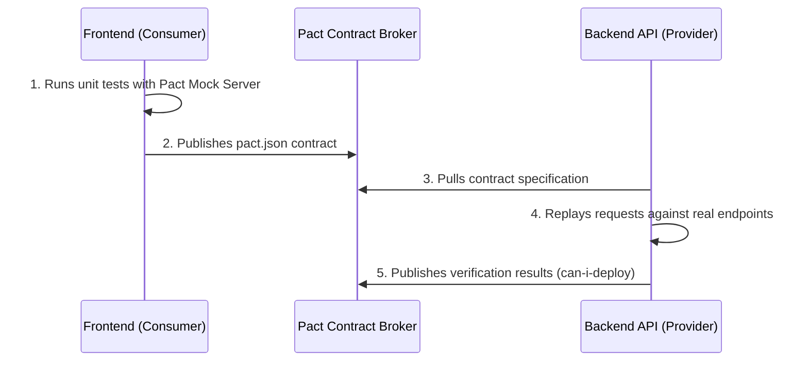
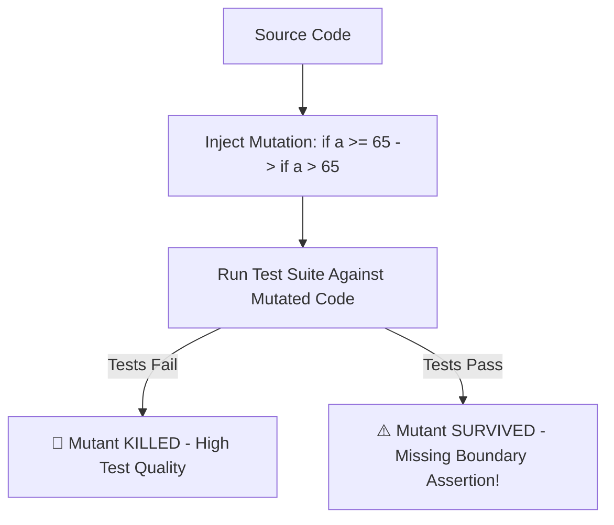

# Contract & Mutation Testing Architecture

> **Scope:** Decoupled Consumer-Driven API Contract Testing (Pact) across micro-frontends/microservices, and Mutation Testing (Stryker Mutator) to evaluate test suite quality.

---

## Table of Contents

- [Contract \& Mutation Testing Architecture](#contract--mutation-testing-architecture)
  - [Table of Contents](#table-of-contents)
  - [1. Consumer-Driven Contract Testing (Pact)](#1-consumer-driven-contract-testing-pact)
    - [The Problem with End-to-End API Mocks](#the-problem-with-end-to-end-api-mocks)
    - [The Pact Consumer $\\leftrightarrow$ Provider Flow](#the-pact-consumer-leftrightarrow-provider-flow)
  - [2. Mutation Testing with Stryker Mutator](#2-mutation-testing-with-stryker-mutator)
    - [Why 100% Line Coverage is a Dangerous Fallacy](#why-100-line-coverage-is-a-dangerous-fallacy)
    - [How Mutation Testing Works: "Killing Mutants"](#how-mutation-testing-works-killing-mutants)
  - [3. When to Use vs. When NOT to Use](#3-when-to-use-vs-when-not-to-use)

---

## 1. Consumer-Driven Contract Testing (Pact)

### The Problem with End-to-End API Mocks

When frontend teams use static JSON mocks, they risk **Mock Drift**: the backend API schema evolves, but frontend tests stay green while production crashes.

---

### The Pact Consumer $\leftrightarrow$ Provider Flow



```typescript
// consumer.test.ts (Frontend Pact Test)
import { PactV3, MatchersV3 } from '@pact-foundation/pact';

const provider = new PactV3({ consumer: 'WebClient', provider: 'UserService' });

test('GET /users/10 returns user contract', () => {
  provider
    .given('user 10 exists')
    .uponReceiving('a request for user 10')
    .withRequest({ method: 'GET', path: '/users/10' })
    .willRespondWith({
      status: 200,
      headers: { 'Content-Type': 'application/json' },
      body: {
        id: MatchersV3.string('10'),
        email: MatchersV3.email('user@example.com'),
      },
    });

  return provider.executeTest(async (mockServer) => {
    const res = await fetch(`${mockServer.url}/users/10`);
    const data = await res.json();
    expect(data.id).toBe('10');
  });
});
```

---

## 2. Mutation Testing with Stryker Mutator

### Why 100% Line Coverage is a Dangerous Fallacy

A test suite can easily achieve $100\%$ line coverage without testing anything:

```typescript
// Tested function
function calculateDiscount(age: number): boolean {
  return age >= 65;
}

// Useless test with 100% line coverage
it('runs function', () => {
  calculateDiscount(70);
  expect(true).toBe(true); // 100% coverage, 0% confidence!
});
```

---

### How Mutation Testing Works: "Killing Mutants"

Stryker Mutator automatically injects synthetic bugs into your source code:

- Mutant 1: Changes `>=` to `>`
- Mutant 2: Changes return value to `false`



- **Mutation Score Formula:**
  $$\text{Mutation Score} = \left( \frac{\text{Killed Mutants}}{\text{Total Mutants Injected}} \right) \times 100\%$$
- Target a Mutation Score of $\ge 80\%$ on core business logic.

---

## 3. When to Use vs. When NOT to Use

| Testing Type                   | When to Use                                                       | When NOT to Use                                             |
| :----------------------------- | :---------------------------------------------------------------- | :---------------------------------------------------------- |
| **Contract Testing (Pact)**    | Micro-frontends, multi-team decoupled backend services.           | Small monolithic apps sharing a single TypeScript codebase. |
| **Mutation Testing (Stryker)** | Mission-critical business math, financial engines, security auth. | Rapid MVP prototypes where code changes hourly.             |
