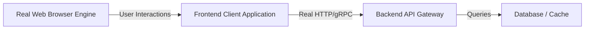

# End-to-End (E2E) & Functional Automation

> **Scope:** Testing entire real-world user journeys across real browser engines (Chromium, WebKit, Firefox), real or staging backend environments, network routing, and authentication sessions.

---

## Table of Contents

- [End-to-End (E2E) \& Functional Automation](#end-to-end-e2e--functional-automation)
  - [Table of Contents](#table-of-contents)
  - [1. Core Philosophy: The Top of the Testing Pyramid](#1-core-philosophy-the-top-of-the-testing-pyramid)
  - [2. Framework Comparison: Playwright vs. Cypress vs. Selenium](#2-framework-comparison-playwright-vs-cypress-vs-selenium)
  - [3. Cypress Testing Library Integration (`@testing-library/cypress`)](#3-cypress-testing-library-integration-testing-librarycypress)
    - [Configuration \& Setup](#configuration--setup)
    - [Using `cy.findByRole` vs. `cy.get`](#using-cyfindbyrole-vs-cyget)
    - [Scoped Queries with `.within()`](#scoped-queries-with-within)
  - [4. Page Object Model (POM) Architecture](#4-page-object-model-pom-architecture)
  - [4. Global Authentication State Reuse (`storageState.json`)](#4-global-authentication-state-reuse-storagestatejson)
  - [5. Resilient Locators \& Auto-Waiting Engine](#5-resilient-locators--auto-waiting-engine)
  - [6. Complete Production E2E Suite (Playwright)](#6-complete-production-e2e-suite-playwright)
  - [7. Debugging: Trace Viewer, Video \& Network HAR](#7-debugging-trace-viewer-video--network-har)
  - [8. When to Use vs. When NOT to Use](#8-when-to-use-vs-when-not-to-use)

---

## 1. Core Philosophy: The Top of the Testing Pyramid

E2E tests provide the **highest deployment confidence** by testing the exact software artifacts deployed to production in real browser engines. Because E2E tests are slower ($\approx 3-30\text{s}$) and more resource-intensive, they should focus strictly on **mission-critical business flows** (Auth, Payment, Core Workflows) rather than testing every minor edge case.



---

## 2. Framework Comparison: Playwright vs. Cypress vs. Selenium

| Dimension               | Playwright (Modern Gold Standard)                 | Cypress                                  | Selenium WebDriver                |
| :---------------------- | :------------------------------------------------ | :--------------------------------------- | :-------------------------------- |
| **Protocol**            | Chrome DevTools Protocol (CDP) via WebSocket.     | In-browser iframe JS execution loop.     | HTTP JSON Wire Protocol.          |
| **Speed**               | ⚡ Ultra-fast parallel execution.                 | ⏱ Moderate (single-threaded).            | 🐢 Slow (high roundtrip latency). |
| **Multi-Tab / Windows** | ✅ Native first-class multi-tab support.          | ❌ Unsupported (single tab only).        | ✅ Supported.                     |
| **Browser Engines**     | Chromium (Chrome/Edge), WebKit (Safari), Firefox. | Chromium, Firefox (WebKit experimental). | All browsers via drivers.         |
| **Network Mocking**     | Native `page.route()` interception.               | `cy.intercept()` (fetch/XHR only).       | Requires external proxy.          |
| **Parallel Workers**    | Built-in free multi-worker parallelism.           | Paid Cypress Cloud required.             | Requires Selenium Grid cloud.     |

---

## 3. Cypress Testing Library Integration (`@testing-library/cypress`)

By default, Cypress tests often rely on fragile CSS selectors like `cy.get('.btn-primary-2')`. The `@testing-library/cypress` extension brings DOM Testing Library's accessible query hierarchy directly into Cypress commands (`cy.findByRole`, `cy.findByLabelText`, `cy.findByText`).

### Configuration & Setup

1. **Install package:**
   ```bash
   npm install --save-dev @testing-library/cypress
   ```
2. **Import commands in Cypress support file:**
   ```typescript
   // cypress/support/commands.ts
   import '@testing-library/cypress/add-commands';
   ```
3. **Add TypeScript definitions:**
   ```json
   // cypress/tsconfig.json
   {
     "compilerOptions": {
       "types": ["cypress", "@testing-library/cypress"]
     }
   }
   ```

---

### Using `cy.findByRole` vs. `cy.get`

```typescript
// ❌ BAD: Brittle CSS selectors
cy.get('.login-form > div:nth-child(2) > input').type('secret');
cy.get('#submit-button').click();

// ✅ GOOD: Resilient, accessible queries
cy.findByLabelText(/password/i).type('secret');
cy.findByRole('button', { name: /sign in/i }).click();

// Asserting notifications
cy.findByRole('alert').should('contain.text', 'Invalid credentials');
```

---

### Scoped Queries with `.within()`

To query within a specific modal, card, or navigation bar:

```typescript
cy.findByRole('dialog', { name: /edit profile/i }).within(() => {
  cy.findByLabelText(/first name/i)
    .clear()
    .type('Atul');
  cy.findByRole('button', { name: /save/i }).click();
});
```

---

## 4. Page Object Model (POM) Architecture

POM encapsulates page selectors and domain interactions into dedicated classes, isolating tests from UI markup changes:

```typescript
// e2e/pages/LoginPage.ts
import { type Page, type Locator, expect } from '@playwright/test';

export class LoginPage {
  readonly page: Page;
  readonly emailInput: Locator;
  readonly passwordInput: Locator;
  readonly submitButton: Locator;
  readonly errorMessage: Locator;

  constructor(page: Page) {
    this.page = page;
    this.emailInput = page.getByRole('textbox', { name: /email/i });
    this.passwordInput = page.getByLabel(/password/i);
    this.submitButton = page.getByRole('button', { name: /sign in/i });
    this.errorMessage = page.getByRole('alert');
  }

  async goto() {
    await this.page.goto('/login');
  }

  async login(email: string, pass: string) {
    await this.emailInput.fill(email);
    await this.passwordInput.fill(pass);
    await this.submitButton.click();
  }

  async assertError(expectedMessage: string) {
    await expect(this.errorMessage).toHaveText(expectedMessage);
  }
}
```

---

## 4. Global Authentication State Reuse (`storageState.json`)

Instead of logging in through the UI before each of your 100 tests (which wastes minutes of CI time), log in **once** in a setup project and save browser cookies and localStorage:

```typescript
// e2e/auth.setup.ts
import { test as setup, expect } from '@playwright/test';

const authFile = 'playwright/.auth/user.json';

setup('authenticate user session', async ({ page }) => {
  await page.goto('/login');
  await page.getByRole('textbox', { name: /email/i }).fill('staff_qa@example.com');
  await page.getByLabel(/password/i).fill('SecurePass123!');
  await page.getByRole('button', { name: /sign in/i }).click();

  await page.waitForURL('/dashboard');
  await expect(page.getByRole('heading', { name: /dashboard/i })).toBeVisible();

  // Save session storage to disk
  await page.context().storageState({ path: authFile });
});
```

```typescript
// playwright.config.ts
import { defineConfig } from '@playwright/test';

export default defineConfig({
  projects: [
    { name: 'setup', testMatch: /.*\.setup\.ts/ },
    {
      name: 'e2e tests',
      dependencies: ['setup'],
      use: {
        storageState: 'playwright/.auth/user.json', // Automatically authenticated!
      },
    },
  ],
});
```

---

## 5. Resilient Locators & Auto-Waiting Engine

Playwright automatically performs actionability checks (**visible, stable, enabled, receiving events**) before executing clicks or typing, eliminating 99% of hardcoded sleep flakiness:

```typescript
// ✅ Built-in Auto-Waiting Assertions
await expect(page.getByRole('button', { name: /submit/i })).toBeEnabled();
await expect(page.getByTestId('order-status')).toHaveText('Shipped', { timeout: 10_000 });
```

---

## 6. Complete Production E2E Suite (Playwright)

```typescript
// e2e/checkout.spec.ts
import { test, expect } from '@playwright/test';

test.describe('E-Commerce Checkout Flow', () => {
  test('authenticated user purchases product with discount code', async ({ page }) => {
    // 1. Navigate to product page
    await page.goto('/products/ergonomic-chair');

    // 2. Add to cart
    await page.getByRole('button', { name: /add to cart/i }).click();
    await expect(page.getByTestId('cart-count')).toHaveText('1');

    // 3. Open checkout
    await page.goto('/checkout');
    await page.getByRole('textbox', { name: /promo code/i }).fill('PROMO20');
    await page.getByRole('button', { name: /apply/i }).click();

    // 4. Verify discounted total
    await expect(page.getByTestId('order-total')).toHaveText('$240.00');

    // 5. Complete order
    await page.getByRole('button', { name: /place order/i }).click();

    // 6. Assert success confirmation
    await expect(page).toHaveURL(/\/orders\/confirmation/);
    await expect(page.getByRole('heading', { name: /order confirmed/i })).toBeVisible();
  });
});
```

---

## 7. Debugging: Trace Viewer, Video & Network HAR

Enable Playwright **Trace Viewer** on CI failures to inspect the full DOM tree, console logs, and network timeline at any millisecond of test execution:

```typescript
// playwright.config.ts
export default defineConfig({
  use: {
    trace: 'on-first-retry', // Captures trace only when test fails
    video: 'retain-on-failure',
    screenshot: 'only-on-failure',
  },
});
```

Open trace viewer locally:

```bash
npx playwright show-trace trace.zip
```

---

## 8. When to Use vs. When NOT to Use

| When to Use E2E Testing                                            | When NOT to Use E2E Testing                                                  |
| :----------------------------------------------------------------- | :--------------------------------------------------------------------------- |
| ✅ Critical user revenue paths: Signup, Login, Payment, Checkout.  | ❌ Minor edge cases (e.g. testing 50 invalid phone number regex variations). |
| ✅ Cross-browser engine rendering validation (WebKit vs Chromium). | ❌ Pure math calculations or data transformers (use Unit Tests).             |
| ✅ Multi-tab, popup authentication, and OAuth redirects.           | ❌ Heavy backend load stress testing (use k6).                               |
