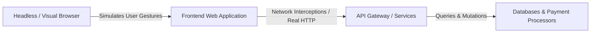
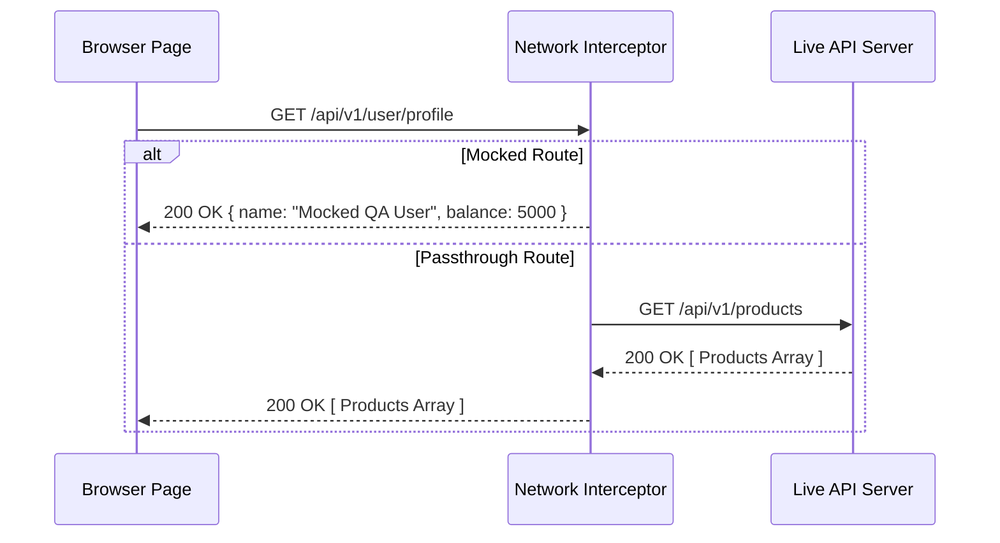

# End-to-End (E2E) & Browser Automation Architecture

> **Scope:** Automating real-world user journeys across browser engines (Puppeteer, Cypress, Playwright), execution modes (Headless vs. Visual, `slowMo`, Viewports, Video), API interception, multi-tab handling, and building automated scheduled CRON suites with step-by-step timer logging and Amazon SES email alerting.

---

## Table of Contents

- [End-to-End (E2E) \& Browser Automation Architecture](#end-to-end-e2e--browser-automation-architecture)
  - [Table of Contents](#table-of-contents)
  - [1. Core Philosophy: The E2E Testing Pyramid](#1-core-philosophy-the-e2e-testing-pyramid)
  - [2. Framework Comparison: Puppeteer vs. Cypress vs. Playwright](#2-framework-comparison-puppeteer-vs-cypress-vs-playwright)
  - [3. Browser Configuration \& Launch Parameters Deep Dive](#3-browser-configuration--launch-parameters-deep-dive)
    - [Configuration Comparison Matrix](#configuration-comparison-matrix)
    - [Code Examples: Launching in Puppeteer, Cypress \& Playwright](#code-examples-launching-in-puppeteer-cypress--playwright)
      - [1. Puppeteer Launch Configuration](#1-puppeteer-launch-configuration)
      - [2. Cypress Configuration \& slowMo Implementation](#2-cypress-configuration--slowmo-implementation)
        - [Why use `env: { SLOW_MO: 1000 }` instead of hardcoding?](#why-use-env--slow_mo-1000--instead-of-hardcoding)
        - [How to slow down Cypress actions (3 Approaches):](#how-to-slow-down-cypress-actions-3-approaches)
      - [3. Playwright Configuration](#3-playwright-configuration)
  - [4. Core Browser Automation Capabilities](#4-core-browser-automation-capabilities)
    - [A. API Request Interception \& Mocking](#a-api-request-interception--mocking)
      - [Puppeteer API Interception](#puppeteer-api-interception)
      - [Cypress API Interception](#cypress-api-interception)
      - [Playwright API Interception](#playwright-api-interception)
    - [B. Multi-Page / New Tab Handling](#b-multi-page--new-tab-handling)
      - [Puppeteer Multi-Tab](#puppeteer-multi-tab)
      - [Playwright Multi-Tab](#playwright-multi-tab)
      - [Cypress Multi-Tab Workaround](#cypress-multi-tab-workaround)
    - [C. Scrolling \& Viewport Handling](#c-scrolling--viewport-handling)
    - [D. Screenshots \& Video Recording](#d-screenshots--video-recording)
  - [5. Cypress Testing Library Integration (`@testing-library/cypress`)](#5-cypress-testing-library-integration-testing-librarycypress)
  - [6. Page Object Model (POM) Architecture](#6-page-object-model-pom-architecture)
  - [7. Global Authentication State Reuse (`storageState.json`)](#7-global-authentication-state-reuse-storagestatejson)
  - [8. Resilient Locators \& Auto-Waiting Engine](#8-resilient-locators--auto-waiting-engine)
  - [9. Complete Production E2E Suite (Playwright \& Cypress)](#9-complete-production-e2e-suite-playwright--cypress)
  - [10. Debugging: Trace Viewer, Video \& Network HAR](#10-debugging-trace-viewer-video--network-har)
  - [11. Scheduled 24/7 Automation \& Amazon SES Email Reporting](#11-scheduled-247-automation--amazon-ses-email-reporting)
  - [12. When to Use vs. When NOT to Use](#12-when-to-use-vs-when-not-to-use)

---

## 1. Core Philosophy: The E2E Testing Pyramid

End-to-End (E2E) automation tests the **entire integrated application**—from the real frontend DOM to live/staging API gateways, databases, and third-party services.



- **Objective:** Ensure critical user business journeys (Sign-up, Search, Add to Cart, Checkout, Billing) never break in production.
- **Trade-offs:** Higher execution time ($\approx 3-30\text{s}$ per flow) and resource consumption compared to Unit/Component tests.

---

## 2. Framework Comparison: Puppeteer vs. Cypress vs. Playwright

```text
+-----------------------+----------------------------------+----------------------------------+----------------------------------+
| Feature               | Puppeteer (Google)               | Cypress                          | Playwright (Microsoft)           |
+-----------------------+----------------------------------+----------------------------------+----------------------------------+
| **Core Architecture** | Node.js library controlling      | Runs inside the browser's        | WebSocket connection over Chrome |
|                       | Chromium via DevTools Protocol   | execution loop (inside iframe)   | DevTools Protocol (CDP) + WebKit |
+-----------------------+----------------------------------+----------------------------------+----------------------------------+
| **Browser Support**   | Chromium, Chrome, Firefox (exp)  | Chromium, Firefox, WebKit (exp)  | Chromium, WebKit (Safari), Gecko |
+-----------------------+----------------------------------+----------------------------------+----------------------------------+
| **Multi-Tab Support** | ✅ Native (`browser.newPage()`)  | ❌ Single Tab Only (workarounds) | ✅ Native multi-tab & contexts   |
+-----------------------+----------------------------------+----------------------------------+----------------------------------+
| **Auto-Waiting**      | ❌ Manual `waitForSelector()`    | ✅ Built-in retry assertions     | ✅ First-class actionability wait|
+-----------------------+----------------------------------+----------------------------------+----------------------------------+
| **Primary Use Case**  | Web Scraping, PDF/Screenshots,   | Frontend Component & E2E Testing | Cross-browser enterprise E2E,    |
|                       | Crawling, Headless Automation    | with Time-Travel UI              | high-concurrency parallel suites |
+-----------------------+----------------------------------+----------------------------------+----------------------------------+
```

---

## 3. Browser Configuration & Launch Parameters Deep Dive

When running automated tests in local development vs. continuous CI pipelines, controlling launch parameters determines whether tests run visibly (for debugging) or headlessly (for speed in CI):

### Configuration Comparison Matrix

| Parameter      | Puppeteer                                           | Cypress (`cypress.config.ts`)                       | Playwright (`playwright.config.ts`)                | Purpose / Value                                                                                                          |
| :------------- | :-------------------------------------------------- | :-------------------------------------------------- | :------------------------------------------------- | :----------------------------------------------------------------------------------------------------------------------- |
| **`headless`** | `headless: false` / `true` / `'new'`                | `cypress run` (headless) vs `cypress open` (headed) | `headless: false` / `true`                         | Runs browser with visible GUI vs silent headless background process.                                                     |
| **`slowMo`**   | `slowMo: 1000` (1s delay)                           | `cy.wait()` or config delay plugins                 | `launchOptions: { slowMo: 1000 }`                  | Delays every browser action by $N\text{ms}$ (e.g. `1000` = 1 full second gap) so human eyes can clearly trace execution. |
| **`viewport`** | `page.setViewport({ width, height })`               | `viewportWidth: 1920`, `viewportHeight: 1080`       | `use: { viewport: { width: 1920, height: 1080 } }` | Defines screen resolution and mobile device emulation.                                                                   |
| **`video`**    | `puppeteer-screen-recorder` plugin                  | `video: true`, `videoCompression: 32`               | `video: 'on'` / `'retain-on-failure'`              | Records video of test execution for CI failure debugging.                                                                |
| **`args`**     | `args: ['--window-size=1920,1080', '--no-sandbox']` | `browser:before:launch` event                       | `args: ['--window-size=1920,1080']`                | Low-level Chromium flags (`--no-sandbox`, `--disable-gpu`, `--disable-dev-shm-usage`).                                   |

---

### Code Examples: Launching in Puppeteer, Cypress & Playwright

#### 1. Puppeteer Launch Configuration

```typescript
// puppeteer.config.ts
import puppeteer from 'puppeteer';

export async function createPuppeteerBrowser(isVisualMode = false) {
  const browser = await puppeteer.launch({
    headless: isVisualMode ? false : 'new', // Visible UI if debugging, silent for CI
    slowMo: isVisualMode ? 1000 : 0, // 1000ms (1 second) delay between every action in visual mode
    devtools: isVisualMode, // Auto-open Chrome DevTools in visual mode
    args: [
      '--no-sandbox',
      '--disable-setuid-sandbox',
      '--disable-dev-shm-usage', // Prevents crashes in Docker containers with small /dev/shm
      '--window-size=1920,1080',
    ],
    defaultViewport: null, // Inherits full window size
  });

  const page = await browser.newPage();
  await page.setViewport({ width: 1920, height: 1080 });
  return { browser, page };
}
```

#### 2. Cypress Configuration & slowMo Implementation

Unlike Puppeteer and Playwright (which have a native top-level `slowMo` launch flag), Cypress does not have a single built-in `slowMo` key.

You can either **hardcode a delay directly** or pass it dynamically through **`env`** (recommended for production):

```typescript
// cypress.config.ts
import { defineConfig } from 'cypress';

export default defineConfig({
  e2e: {
    baseUrl: 'https://example.com',
    viewportWidth: 1920,
    viewportHeight: 1080,
    video: true, // Automatically record MP4 videos
    videoCompression: 32,
    screenshotOnRunFailure: true, // Auto-capture PNG on failure
    defaultCommandTimeout: 10000, // 10s auto-waiting retry timeout
    env: {
      SLOW_MO: 1000, // Default slowMo duration in ms (1s)
    },
    setupNodeEvents(on, config) {
      on('before:browser:launch', (browser, launchOptions) => {
        if (browser.family === 'chromium' && browser.name !== 'electron') {
          launchOptions.args.push('--window-size=1920,1080');
          launchOptions.args.push('--disable-dev-shm-usage');
        }
        return launchOptions;
      });
    },
  },
});
```

##### Why use `env: { SLOW_MO: 1000 }` instead of hardcoding?

1. **Zero-Code CLI Overrides**: You can dynamically toggle test speed right from your terminal without touching source files:

   ```bash
   # ⚡ Full speed for CI builds (Default):
   npx cypress run

   # 🐢 1-second gap for local visual debugging:
   npx cypress run --env SLOW_MO=1000

   # 🐌 2-second gap for live team presentations/demos:
   npx cypress run --env SLOW_MO=2000
   ```

2. **Saves Paid CI Minutes**: In CI/CD pipelines (GitHub Actions), tests run at maximum speed (`0ms`). On local laptops, developers can turn on `1000ms`.
3. **Prevents Accidental Commits**: No risk of committing a hardcoded delay that slows down everyone's pull requests.

##### How to slow down Cypress actions (3 Approaches):

```typescript
// cypress/support/e2e.ts

// Approach A: Global Command Overwrite (Zero External Dependencies)
// Reads dynamically from env, or defaults to 0 (disabled)
const slowMoDelay = Cypress.env('SLOW_MO') || 0; // e.g. 1000ms

if (slowMoDelay > 0) {
  const commandsToSlow = ['visit', 'click', 'type', 'clear', 'check', 'uncheck', 'select'];
  commandsToSlow.forEach((command) => {
    Cypress.Commands.overwrite(command as any, (originalFn, ...args) => {
      const result = originalFn(...args);
      // Wait for specified ms after every command without polluting test logs
      return cy.wait(slowMoDelay, { log: false }).then(() => result);
    });
  });
}

// Simple Hardcoded Alternative (Quick Testing):
// const HARDCODED_DELAY = 1000;
// Cypress.Commands.overwrite('click', (orig, ...args) => {
//   return cy.wait(HARDCODED_DELAY, { log: false }).then(() => orig(...args));
// });

// Approach B: Using 'cypress-slow-down' plugin (npm i -D cypress-slow-down)
// import { slowCypressDown } from 'cypress-slow-down';
// slowCypressDown(1000); // 1000ms (1s) gap between all Cypress commands

// Approach C: Typing Speed Slow-Down (Keystroke Delay)
Cypress.Keyboard.defaults({
  keystrokeDelay: 100, // 100ms delay between each typed character
});
```

#### 3. Playwright Configuration

```typescript
// playwright.config.ts
import { defineConfig, devices } from '@playwright/test';

export default defineConfig({
  use: {
    headless: process.env.CI ? true : false,
    launchOptions: {
      slowMo: process.env.SLOW_MO ? 150 : 0,
    },
    viewport: { width: 1920, height: 1080 },
    video: 'retain-on-failure', // Records video only when test fails
    screenshot: 'only-on-failure', // Captures PNG on failure
    trace: 'retain-on-failure', // Generates trace archive for inspection
  },
  projects: [
    { name: 'Chromium', use: { ...devices['Desktop Chrome'] } },
    { name: 'Firefox', use: { ...devices['Desktop Firefox'] } },
    { name: 'WebKit', use: { ...devices['Desktop Safari'] } },
  ],
});
```

---

## 4. Core Browser Automation Capabilities

### A. API Request Interception & Mocking

Intercepting network requests lets you mock unstable backend endpoints, simulate 500 error responses, or inspect payload telemetry without polluting live databases:



#### Puppeteer API Interception

```typescript
// Enable request interception
await page.setRequestInterception(true);

page.on('request', (request) => {
  const url = request.url();

  // 1. Block heavy images/fonts to speed up scraping & testing
  if (['image', 'stylesheet', 'font'].includes(request.resourceType())) {
    request.abort();
    return;
  }

  // 2. Mock API endpoint
  if (url.includes('/api/v1/cart')) {
    request.respond({
      status: 200,
      contentType: 'application/json',
      body: JSON.stringify({ itemsCount: 3, total: 149.99 }),
    });
    return;
  }

  // 3. Continue normal request
  request.continue();
});
```

#### Cypress API Interception

```typescript
// Intercept and alias API call
cy.intercept('GET', '/api/v1/cart', {
  statusCode: 200,
  body: { itemsCount: 3, total: 149.99 },
}).as('getCart');

cy.visit('/checkout');
cy.wait('@getCart').its('response.statusCode').should('eq', 200);
```

#### Playwright API Interception

```typescript
// Native Playwright routing
await page.route('**/api/v1/cart', (route) => {
  route.fulfill({
    status: 200,
    contentType: 'application/json',
    body: JSON.stringify({ itemsCount: 3, total: 149.99 }),
  });
});
```

---

### B. Multi-Page / New Tab Handling

When clicking links with `target="_blank"` or OAuth popups, tests must switch context to the newly created tab:

#### Puppeteer Multi-Tab

```typescript
// Listen for targetcreated event
const newPagePromise = new Promise<puppeteer.Page>((resolve) =>
  browser.once('targetcreated', async (target) => {
    const newPage = await target.page();
    if (newPage) resolve(newPage);
  }),
);

// Click link that opens new tab
await page.click('a[target="_blank"]');
const newTab = await newPagePromise;
await newTab.bringToFront();

await newTab.waitForSelector('h1');
const pageTitle = await newTab.title();
console.log('New tab opened:', pageTitle);
```

#### Playwright Multi-Tab

```typescript
// Playwright context event listener
const [newTab] = await Promise.all([
  context.waitForEvent('page'),
  page.getByRole('link', { name: /view receipt/i }).click(),
]);

await newTab.waitForLoadState('networkidle');
await expect(newTab.getByRole('heading', { name: /invoice/i })).toBeVisible();
```

#### Cypress Multi-Tab Workaround

_Note: Cypress cannot natively control multiple tabs because it runs inside a single browser window. The industry standard workaround is stripping the `target="_blank"` attribute before clicking:_

```typescript
// Remove target="_blank" so Cypress opens the link in the same window
cy.get('a[data-testid="external-terms"]').invoke('removeAttr', 'target').click();

cy.url().should('include', '/terms-and-conditions');
```

---

### C. Scrolling & Viewport Handling

```typescript
// Puppeteer: Scroll to bottom of page (trigger infinite scroll)
await page.evaluate(async () => {
  await new Promise<void>((resolve) => {
    let totalHeight = 0;
    const distance = 300;
    const timer = setInterval(() => {
      const scrollHeight = document.body.scrollHeight;
      window.scrollBy(0, distance);
      totalHeight += distance;

      if (totalHeight >= scrollHeight) {
        clearInterval(timer);
        resolve();
      }
    }, 100);
  });
});

// Playwright: Native auto-scroll into viewport
await page.getByRole('button', { name: /footer subscribe/i }).scrollIntoViewIfNeeded();

// Cypress: Native scroll
cy.scrollTo('bottom');
cy.get('#subscribe-button').scrollIntoView().should('be.visible');
```

---

### D. Screenshots & Video Recording

```typescript
// Puppeteer Full-Page Screenshot
await page.screenshot({
  path: 'reports/homepage_full.png',
  fullPage: true,
});

// Playwright Element Screenshot
await page.getByTestId('order-summary-card').screenshot({
  path: 'reports/order_summary.png',
});
```

---

## 5. Cypress Testing Library Integration (`@testing-library/cypress`)

Using accessible selectors (`cy.findByRole`, `cy.findByLabelText`) instead of fragile CSS selectors:

```typescript
// cypress/e2e/login.cy.ts
describe('Authentication Flow', () => {
  it('logs user in with accessible queries', () => {
    cy.visit('/login');

    // ✅ Testing Library Commands
    cy.findByLabelText(/email address/i).type('user@example.com');
    cy.findByLabelText(/password/i).type('SecurePassword123!');
    cy.findByRole('button', { name: /sign in/i }).click();

    // Verify dashboard banner
    cy.findByRole('heading', { level: 1, name: /dashboard/i }).should('be.visible');
    cy.findByRole('alert').should('not.exist');
  });
});
```

---

## 6. Page Object Model (POM) Architecture

POM encapsulates element locators and page interactions into reusable classes:

```typescript
// pages/FlipkartSearchPage.ts
import { Page } from 'puppeteer';

export class FlipkartSearchPage {
  constructor(private page: Page) {}

  async navigate() {
    await this.page.goto('https://www.flipkart.com/', { waitUntil: 'networkidle2' });
  }

  async searchProduct(keyword: string) {
    const searchInput = 'input[name="q"], input[title*="Search"]';
    await this.page.waitForSelector(searchInput, { visible: true, timeout: 8000 });
    await this.page.type(searchInput, keyword, { delay: 50 });
    await this.page.keyboard.press('Enter');
    await this.page.waitForNavigation({ waitUntil: 'domcontentloaded' });
  }

  async selectFirstProduct(): Promise<string> {
    const firstProduct = 'div[data-id] a[href*="/p/"], a._1fQZEK, a.CG2cNx';
    await this.page.waitForSelector(firstProduct, { visible: true, timeout: 10000 });
    const productTitle = await this.page.$eval(firstProduct, (el) => el.textContent || 'Selected Product');
    await this.page.click(firstProduct);
    return productTitle;
  }
}
```

---

## 7. Global Authentication State Reuse (`storageState.json`)

Instead of logging in through the UI before each of your 100 tests (which wastes minutes of CI time), log in **once** in a setup project and save browser cookies and localStorage:

```typescript
// e2e/auth.setup.ts
import { test as setup, expect } from '@playwright/test';

const authFile = 'playwright/.auth/user.json';

setup('authenticate user session', async ({ page }) => {
  await page.goto('/login');
  await page.getByRole('textbox', { name: /email/i }).fill('staff_qa@example.com');
  await page.getByLabel(/password/i).fill('SecurePass123!');
  await page.getByRole('button', { name: /sign in/i }).click();

  await page.waitForURL('/dashboard');
  await expect(page.getByRole('heading', { name: /dashboard/i })).toBeVisible();

  // Save session storage to disk
  await page.context().storageState({ path: authFile });
});
```

```typescript
// playwright.config.ts
import { defineConfig } from '@playwright/test';

export default defineConfig({
  projects: [
    { name: 'setup', testMatch: /.*\.setup\.ts/ },
    {
      name: 'e2e tests',
      dependencies: ['setup'],
      use: {
        storageState: 'playwright/.auth/user.json', // Automatically authenticated!
      },
    },
  ],
});
```

---

## 8. Resilient Locators & Auto-Waiting Engine

Playwright and modern E2E runners automatically perform actionability checks (**visible, stable, enabled, receiving events**) before executing clicks or typing, eliminating 99% of hardcoded sleep flakiness:

```typescript
// ✅ Built-in Auto-Waiting Assertions
await expect(page.getByRole('button', { name: /submit/i })).toBeEnabled();
await expect(page.getByTestId('order-status')).toHaveText('Shipped', { timeout: 10_000 });
```

---

## 9. Complete Production E2E Suite (Playwright & Cypress)

```typescript
// e2e/checkout.spec.ts (Playwright)
import { test, expect } from '@playwright/test';

test.describe('E-Commerce Checkout Flow', () => {
  test('authenticated user purchases product with discount code', async ({ page }) => {
    // 1. Navigate to product page
    await page.goto('/products/ergonomic-chair');

    // 2. Add to cart
    await page.getByRole('button', { name: /add to cart/i }).click();
    await expect(page.getByTestId('cart-count')).toHaveText('1');

    // 3. Open checkout
    await page.goto('/checkout');
    await page.getByRole('textbox', { name: /promo code/i }).fill('PROMO20');
    await page.getByRole('button', { name: /apply/i }).click();

    // 4. Verify discounted total
    await expect(page.getByTestId('order-total')).toHaveText('$240.00');

    // 5. Complete order
    await page.getByRole('button', { name: /place order/i }).click();

    // 6. Assert success confirmation
    await expect(page).toHaveURL(/\/orders\/confirmation/);
    await expect(page.getByRole('heading', { name: /order confirmed/i })).toBeVisible();
  });
});
```

---

## 10. Debugging: Trace Viewer, Video & Network HAR

Enable Playwright **Trace Viewer** on CI failures to inspect the full DOM tree, console logs, and network timeline at any millisecond of test execution:

```typescript
// playwright.config.ts
export default defineConfig({
  use: {
    trace: 'on-first-retry', // Captures trace only when test fails
    video: 'retain-on-failure',
    screenshot: 'only-on-failure',
  },
});
```

Open trace viewer locally:

```bash
npx playwright show-trace trace.zip
```

---

## 11. Scheduled 24/7 Automation & Amazon SES Email Reporting

For setting up automated daily **08:00 AM** health check suites, step-by-step millisecond execution timing logs (`performance.now()`), automatic failure screenshot capture, and HTML email alerting via **Amazon SES (`@aws-sdk/client-ses`)**, refer to the dedicated guide:

👉 **[Scheduled Browser Automation & Amazon SES Reporting Guide](./Scheduled_Automation_SES.md)**

---

## 12. When to Use vs. When NOT to Use

| When to Use E2E & Automation                                        | When NOT to Use E2E & Automation                                               |
| :------------------------------------------------------------------ | :----------------------------------------------------------------------------- |
| ✅ Critical user revenue paths: Signup, Login, Payment, Checkout.   | ❌ Minor unit edge cases (e.g. testing 50 invalid phone number regex regexes). |
| ✅ Daily automated smoke checks monitoring live production health.  | ❌ Pure math calculations or data transformers (use Unit Tests).               |
| ✅ Cross-browser engine rendering validation (WebKit vs Chromium).  | ❌ High-throughput backend load stress testing (use k6 or Artillery).          |
| ✅ Generating PDF invoices, automated crawling, or screenshot logs. | ❌ Rapid local UI component state iteration (use Component Tests).             |
