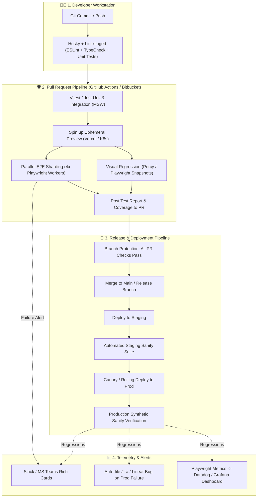
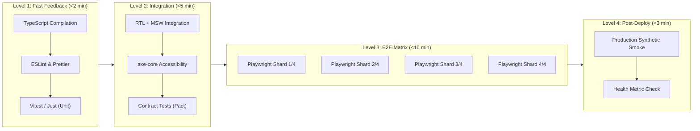
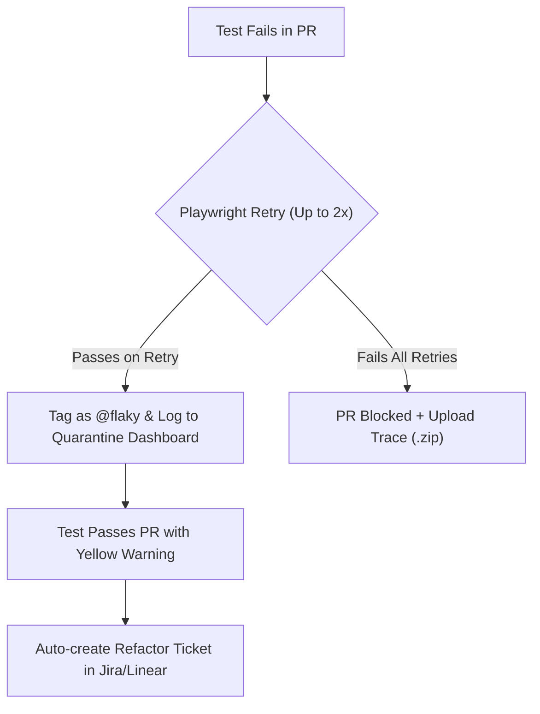

# Enterprise QA Automation & Integrated CI/CD Architecture

> **Scenario:** You are a QA / SDET Engineer with **full access to your organization's Git repositories (GitHub, GitLab, Bitbucket)**, internal CI/CD pipelines, staging/preview environments, and developer codebases.

---

## Table of Contents

- [Enterprise QA Automation \& Integrated CI/CD Architecture](#enterprise-qa-automation--integrated-cicd-architecture)
  - [Table of Contents](#table-of-contents)
  - [1. Executive Architectural Overview](#1-executive-architectural-overview)
  - [2. Monorepo vs Dedicated QA Repo Architectures](#2-monorepo-vs-dedicated-qa-repo-architectures)
  - [3. Complete Enterprise CI/CD Testing Pipeline](#3-complete-enterprise-cicd-testing-pipeline)
  - [4. GitHub Actions Enterprise Pipelines](#4-github-actions-enterprise-pipelines)
    - [Workflow 1: PR Quality Gate with Matrix Parallel Sharding (`pr-quality-gate.yml`)](#workflow-1-pr-quality-gate-with-matrix-parallel-sharding-pr-quality-gateyml)
    - [Workflow 2: Ephemeral PR Preview Deployment Smoke Test (`pr-preview-smoke.yml`)](#workflow-2-ephemeral-pr-preview-deployment-smoke-test-pr-preview-smokeyml)
    - [Workflow 3: Post-Merge Production Canary \& Sanity (`post-deploy-canary.yml`)](#workflow-3-post-merge-production-canary--sanity-post-deploy-canaryyml)
  - [5. Bitbucket Pipelines Enterprise Blueprint](#5-bitbucket-pipelines-enterprise-blueprint)
  - [6. Test Sharding, Parallelism \& Performance Optimization](#6-test-sharding-parallelism--performance-optimization)
    - [Playwright Config for Enterprise CI (`playwright.config.ts`)](#playwright-config-for-enterprise-ci-playwrightconfigts)
  - [7. Flakiness Quarantine Engine \& Trace Debugging](#7-flakiness-quarantine-engine--trace-debugging)
    - [1. The Quarantine Tag Pattern (`@quarantine`)](#1-the-quarantine-tag-pattern-quarantine)
    - [2. CI Grep Configuration](#2-ci-grep-configuration)
  - [8. Enterprise Quality Gates \& Branch Protection](#8-enterprise-quality-gates--branch-protection)
  - [9. Incident Alerting: Slack, Microsoft Teams \& Jira Integration](#9-incident-alerting-slack-microsoft-teams--jira-integration)
    - [Automated Slack Webhook Payload](#automated-slack-webhook-payload)
  - [Summary Comparison: Zero-Access vs. Enterprise Integrated QA](#summary-comparison-zero-access-vs-enterprise-integrated-qa)

---

## 1. Executive Architectural Overview

In an integrated enterprise setting, QA automation is not an external afterthought; it is an active **quality gate** embedded directly into the developer feedback loop. Tests run against local builds, pull requests, ephemeral preview environments, and production deployments.



---

## 2. Monorepo vs Dedicated QA Repo Architectures

Organizations typically organize test code in one of two ways:

```
=============================================================================
OPTION A: Monorepo (Co-located Tests)     OPTION B: Dedicated QA Automation Repo
=============================================================================
my-company-org/                           my-company-org/
├── apps/                                 ├── frontend-web/ (Dev repo)
│   ├── web-client/                       ├── backend-api/ (Dev repo)
│   └── mobile-app/                       └── qa-automation-e2e/ (QA repo)
├── packages/                                 ├── tests/
│   └── shared-ui/                            │   ├── e2e/
└── tests/                                    │   └── smoke/
    ├── e2e/ (Playwright)                     ├── .github/workflows/
    │   ├── specs/                            └── playwright.config.ts
    │   └── pages/
    └── .github/workflows/
```

| Dimension              | Option A: Monorepo / Co-Located                    | Option B: Dedicated QA Automation Repo                 |
| :--------------------- | :------------------------------------------------- | :----------------------------------------------------- |
| **Best For**           | Feature teams with embedded SDETs / Full-Stack QA  | Centralized QA Center of Excellence (CoE)              |
| **Atomic Commits**     | **Yes** — Feature code & test changes in single PR | **No** — Multi-repo PR coordination needed             |
| **PR Branch Previews** | Native — triggers test against matching branch     | Requires webhook triggers (`repository_dispatch`)      |
| **Maintenance**        | Single package manager & lockfile                  | Independent dependency versions & cadence              |
| **Recommendation**     | **Industry Best Practice** for modern web apps     | Useful when testing across 10+ decoupled microservices |

---

## 3. Complete Enterprise CI/CD Testing Pipeline

A standard enterprise test pipeline enforces strict SLAs across 4 levels of execution:



---

## 4. GitHub Actions Enterprise Pipelines

### Workflow 1: PR Quality Gate with Matrix Parallel Sharding (`pr-quality-gate.yml`)

Save this file in `.github/workflows/pr-quality-gate.yml` inside your repository:

```yaml
name: PR Quality Gate & E2E Sharding

on:
  pull_request:
    branches: [main, develop]
  workflow_dispatch:

concurrency:
  group: pr-gate-${{ github.head_ref || github.run_id }}
  cancel-in-progress: true

jobs:
  # ==========================================================
  # STAGE 1: Fast Static Analysis & Unit Tests
  # ==========================================================
  static-and-unit:
    name: ⚡ Fast Unit & Type Check
    runs-on: ubuntu-latest
    timeout-minutes: 5
    steps:
      - name: Checkout Code
        uses: actions/checkout@v4

      - name: Setup Node.js
        uses: actions/setup-node@v4
        with:
          node-version: 20
          cache: 'npm'

      - name: Install Dependencies
        run: npm ci

      - name: Typecheck
        run: npx tsc --noEmit

      - name: Run ESLint
        run: npm run lint

      - name: Run Unit & Component Tests (Vitest)
        run: npm run test:unit -- --coverage

  # ==========================================================
  # STAGE 2: Parallel Playwright E2E Sharding (4 Nodes)
  # ==========================================================
  playwright-e2e:
    name: 🎭 Playwright Shard ${{ matrix.shardIndex }}/${{ strategy.job-total }}
    needs: [static-and-unit]
    runs-on: ubuntu-latest
    timeout-minutes: 15
    strategy:
      fail-fast: false
      matrix:
        shardIndex: [1, 2, 3, 4]
    steps:
      - name: Checkout Code
        uses: actions/checkout@v4

      - name: Setup Node.js
        uses: actions/setup-node@v4
        with:
          node-version: 20
          cache: 'npm'

      - name: Install Dependencies
        run: npm ci

      - name: Cache Playwright Browsers
        id: playwright-cache
        uses: actions/cache@v4
        with:
          path: ~/.cache/ms-playwright
          key: playwright-browsers-${{ runner.os }}-${{ hashFiles('package-lock.json') }}

      - name: Install Playwright Browsers & OS Dependencies
        if: steps.playwright-cache.outputs.cache-hit != 'true'
        run: npx playwright install --with-deps chromium

      - name: Install OS Dependencies Only (Cache Hit)
        if: steps.playwright-cache.outputs.cache-hit == 'true'
        run: npx playwright install-deps chromium

      - name: Build Local Application (Or Use Preview URL)
        run: npm run build

      - name: Run E2E Tests on Shard ${{ matrix.shardIndex }}
        env:
          CI: true
          BASE_URL: http://localhost:3000
        run: npx playwright test --shard=${{ matrix.shardIndex }}/${{ strategy.job-total }}

      - name: Upload Shard Blob Report
        if: always()
        uses: actions/upload-artifact@v4
        with:
          name: blob-report-${{ matrix.shardIndex }}
          path: blob-report
          retention-days: 7

  # ==========================================================
  # STAGE 3: Merge Blob Reports & Publish Unified Test Report
  # ==========================================================
  merge-reports:
    name: 📊 Merge Test Reports & PR Comment
    if: always()
    needs: [playwright-e2e]
    runs-on: ubuntu-latest
    steps:
      - name: Checkout Code
        uses: actions/checkout@v4

      - name: Setup Node.js
        uses: actions/setup-node@v4
        with:
          node-version: 20

      - name: Download All Shard Reports
        uses: actions/download-artifact@v4
        with:
          path: all-blob-reports
          pattern: blob-report-*
          merge-multiple: true

      - name: Merge HTML Report
        run: |
          npm install -D @playwright/test
          npx playwright merge-reports --reporter=html ./all-blob-reports

      - name: Upload Unified HTML Report
        uses: actions/upload-artifact@v4
        with:
          name: playwright-final-report
          path: playwright-report
          retention-days: 14
```

---

### Workflow 2: Ephemeral PR Preview Deployment Smoke Test (`pr-preview-smoke.yml`)

When your team uses Vercel, Netlify, or Kubernetes PR environments, this workflow triggers as soon as the preview environment finishes deploying:

```yaml
name: PR Preview Smoke Verification

on:
  deployment_status:
    types: [created]

jobs:
  smoke-preview:
    name: 🌐 Verify PR Preview Environment
    # Only run when deployment is successful on a preview environment
    if: github.event.deployment_status.state == 'success' && github.event.deployment.environment != 'production'
    runs-on: ubuntu-latest
    timeout-minutes: 8
    steps:
      - name: Checkout Code
        uses: actions/checkout@v4

      - name: Setup Node.js
        uses: actions/setup-node@v4
        with:
          node-version: 20

      - name: Install Dependencies & Playwright
        run: |
          npm ci
          npx playwright install --with-deps chromium

      - name: Run Smoke Suite Against Preview URL
        env:
          BASE_URL: ${{ github.event.deployment_status.target_url }}
          CI: true
        run: |
          echo "Testing Preview Environment at: $BASE_URL"
          npx playwright test tests/e2e/smoke/ --grep "@smoke"

      - name: Notify Slack on Smoke Failure
        if: failure()
        uses: slackapi/slack-github-action@v1.26.0
        with:
          payload: |
            {
              "text": "🚨 *PR Preview Smoke Test Failed!*",
              "blocks": [
                {
                  "type": "section",
                  "text": {
                    "type": "mrkdwn",
                    "text": "❌ *Preview Smoke Failed* for PR by *${{ github.actor }}*\n• *Target URL:* ${{ github.event.deployment_status.target_url }}\n• *Commit:* `${{ github.sha }}`"
                  }
                }
              ]
            }
        env:
          SLACK_WEBHOOK_URL: ${{ secrets.SLACK_QA_WEBHOOK_URL }}
```

---

### Workflow 3: Post-Merge Production Canary & Sanity (`post-deploy-canary.yml`)

Triggered automatically after a release is deployed to production:

```yaml
name: Production Post-Deploy Canary

on:
  release:
    types: [published]
  workflow_dispatch:
    inputs:
      target_env:
        description: 'Environment to Verify'
        required: true
        default: 'Production'
        type: choice
        options:
          - Production
          - Staging

jobs:
  prod-sanity:
    name: 🛡️ Post-Deploy Production Sanity
    runs-on: ubuntu-latest
    timeout-minutes: 10
    steps:
      - name: Checkout Code
        uses: actions/checkout@v4

      - name: Setup Node.js
        uses: actions/setup-node@v4
        with:
          node-version: 20

      - name: Install Playwright
        run: |
          npm ci
          npx playwright install --with-deps chromium

      - name: Execute Live Production Health Checks
        env:
          BASE_URL: https://app.mycompany.com
          SANITY_USER_EMAIL: ${{ secrets.PROD_CANARY_USER_EMAIL }}
          SANITY_USER_PASSWORD: ${{ secrets.PROD_CANARY_USER_PASSWORD }}
        run: |
          npx playwright test tests/e2e/prod-sanity/ --grep "@canary"

      - name: Dispatch Incident on Production Failure
        if: failure()
        run: |
          curl -X POST "${{ secrets.SLACK_ALERT_WEBHOOK }}" \
            -H "Content-type: application/json" \
            --data '{"text":"🔥 CRITICAL: Production Canary Failed after release! Check GitHub Run: ${{ github.server_url }}/${{ github.repository }}/actions/runs/${{ github.run_id }}"}'
```

---

## 5. Bitbucket Pipelines Enterprise Blueprint

For organizations hosting repositories in **Bitbucket Cloud / Bitbucket Server**, use this `bitbucket-pipelines.yml` configuration featuring parallel steps and artifact caching:

```yaml
image: mcr.microsoft.com/playwright:v1.45.0-jammy

definitions:
  caches:
    npm-custom: ~/.npm
    playwright-browsers: ~/.cache/ms-playwright
  steps:
    - step: &lint-and-unit
        name: Lint, Typecheck & Unit Tests
        caches:
          - npm-custom
        script:
          - npm ci
          - npm run lint
          - npx tsc --noEmit
          - npm run test:unit
    - step: &e2e-shard
        name: Playwright E2E Shard
        caches:
          - npm-custom
          - playwright-browsers
        script:
          - npm ci
          - npx playwright test --shard=$SHARD_INDEX/$TOTAL_SHARDS
        artifacts:
          - playwright-report/**
          - test-results/**

pipelines:
  pull-requests:
    '**':
      - step: *lint-and-unit
      - parallel:
          - step:
              <<: *e2e-shard
              name: E2E Shard 1/3
              deployment: test
              variables:
                SHARD_INDEX: 1
                TOTAL_SHARDS: 3
          - step:
              <<: *e2e-shard
              name: E2E Shard 2/3
              variables:
                SHARD_INDEX: 2
                TOTAL_SHARDS: 3
          - step:
              <<: *e2e-shard
              name: E2E Shard 3/3
              variables:
                SHARD_INDEX: 3
                TOTAL_SHARDS: 3

  branches:
    master:
      - step:
          name: Post-Deploy Staging Smoke
          script:
            - npm ci
            - BASE_URL=https://staging.myorg.com npx playwright test tests/e2e/smoke/
```

---

## 6. Test Sharding, Parallelism & Performance Optimization

### Playwright Config for Enterprise CI (`playwright.config.ts`)

```typescript
import { defineConfig, devices } from '@playwright/test';

export default defineConfig({
  testDir: './tests/e2e',
  timeout: 30 * 1000,
  expect: {
    timeout: 5000,
  },
  // In CI, avoid parallel tests within single worker to prevent CPU starvation
  fullyParallel: true,
  forbidOnly: !!process.env.CI,
  // Automatic retries: 2 retries in CI, 0 locally for fast debugging
  retries: process.env.CI ? 2 : 0,
  // Limit workers on CI to prevent RAM swapping (2 workers on 2-core standard GitHub runner)
  workers: process.env.CI ? 2 : undefined,
  reporter: process.env.CI
    ? [
        ['blob'],
        ['junit', { outputFile: 'results/junit.xml' }],
        ['github'], // Formats annotations directly on PR diff lines!
      ]
    : [['html', { open: 'on-failure' }], ['list']],
  use: {
    baseURL: process.env.BASE_URL || 'http://localhost:3000',
    trace: 'on-first-retry', // Collect full DOM trace only on retried failures to save disk
    screenshot: 'only-on-failure',
    video: 'retain-on-failure',
    actionTimeout: 10000,
    navigationTimeout: 15000,
  },
  projects: [
    {
      name: 'chromium',
      use: { ...devices['Desktop Chrome'] },
    },
    {
      name: 'firefox',
      use: { ...devices['Desktop Firefox'] },
    },
    {
      name: 'webkit',
      use: { ...devices['Desktop Safari'] },
    },
  ],
  // Local web server auto-boot if testing local build
  webServer: process.env.CI_PREVIEW_URL
    ? undefined
    : {
        command: 'npm run start',
        url: 'http://localhost:3000',
        reuseExistingServer: !process.env.CI,
        timeout: 60 * 1000,
      },
});
```

---

## 7. Flakiness Quarantine Engine & Trace Debugging

Flaky tests destroy team confidence in CI. To manage flaky tests without halting developer releases:



### 1. The Quarantine Tag Pattern (`@quarantine`)

Annotate unstable tests so they run in an experimental non-blocking suite:

```typescript
// tests/e2e/checkout/third-party-payment.spec.ts
import { test, expect } from '@playwright/test';

test('completes 3D-Secure payment flow @quarantine', async ({ page }) => {
  // Test that depends on flaky external sandbox payment gateway
});
```

### 2. CI Grep Configuration

Run all critical tests while skipping quarantined tests in the blocking PR gate:

```bash
# Blocking PR Gate: Run everything EXCEPT quarantined tests
npx playwright test --grep-invert "@quarantine"

# Quarantine Pipeline (Nightly / Non-blocking): Run ONLY quarantined tests to verify fixes
npx playwright test --grep "@quarantine"
```

---

## 8. Enterprise Quality Gates & Branch Protection

Configure **GitHub Repository Settings $\to$ Branches $\to$ Branch Protection Rules** for `main`:

```text
[x] Require a pull request before merging
    [x] Require approvals (1 or 2)
[x] Require status checks to pass before merging
    [x] Require branches to be up to date before merging
    Status Checks Required:
    ├── ⚡ Fast Unit & Type Check
    ├── 🎭 Playwright Shard 1/4
    ├── 🎭 Playwright Shard 2/4
    ├── 🎭 Playwright Shard 3/4
    ├── 🎭 Playwright Shard 4/4
    └── 📊 Merge Test Reports & PR Comment
[x] Do not allow bypassing the above settings
```

---

## 9. Incident Alerting: Slack, Microsoft Teams & Jira Integration

### Automated Slack Webhook Payload

```json
{
  "text": "🚨 *CI Pipeline Failure on Branch `main`*",
  "blocks": [
    {
      "type": "header",
      "text": {
        "type": "plain_text",
        "text": "💥 Quality Gate Regression Detected"
      }
    },
    {
      "type": "section",
      "fields": [
        {
          "type": "mrkdwn",
          "text": "*Commit:*\n<https://github.com/org/repo/commit/${{ github.sha }}|${{ github.sha }}>"
        },
        { "type": "mrkdwn", "text": "*Author:*\n${{ github.actor }}" },
        { "type": "mrkdwn", "text": "*Failed Job:*\n${{ github.job }}" },
        {
          "type": "mrkdwn",
          "text": "*Action Run:*\n<${{ github.server_url }}/${{ github.repository }}/actions/runs/${{ github.run_id }}|View Logs & Traces>"
        }
      ]
    }
  ]
}
```

---

## Summary Comparison: Zero-Access vs. Enterprise Integrated QA

| Feature                | Zero Org Repo Access ([Guide](./Autonomous_QA_Zero_Access_Guide.md)) | Enterprise Integrated Access ([This Guide](./Enterprise_QA_Integrated_CI_CD.md)) |
| :--------------------- | :------------------------------------------------------------------- | :------------------------------------------------------------------------------- |
| **Where Code Lives**   | Personal GitHub Private Repo                                         | Organization GitHub / Bitbucket Monorepo or Multi-repo                           |
| **Trigger Mechanism**  | Scheduled Cron (08:00 AM) or Manual Dispatch                         | Pull Request triggers, Commit pushes, Webhooks                                   |
| **Target URLs**        | Staging / Prod Public URLs                                           | Local `localhost:3000`, Ephemeral PR Previews, Staging, Prod                     |
| **Quality Gate Power** | External Alerting (Email/Slack/Linear)                               | **Blocks PR merge** via Branch Protection status checks                          |
| **Debugging Data**     | Screenshots & High-Resolution Timer logs                             | Full Playwright DOM Traces (`trace.zip`), Videos, PR Diffs                       |
| **Cost**               | 100% Free (2,000 GitHub Action mins/mo)                              | Org GitHub Enterprise / Bitbucket runner pools                                   |
