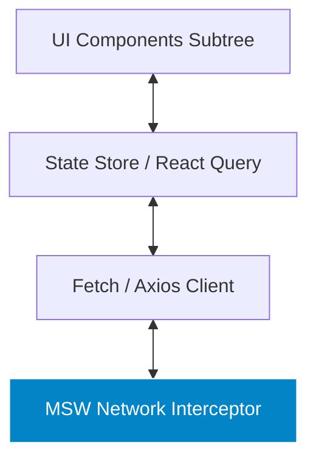

# Integration Testing Architecture & MSW Mocking

> **Scope:** Verifying the interaction between multiple components, state management stores, custom providers, and API data fetching boundaries without spinning up a real backend.

---

## Table of Contents

- [Integration Testing Architecture \& MSW Mocking](#integration-testing-architecture--msw-mocking)
  - [Table of Contents](#table-of-contents)
  - [1. Core Philosophy: The Sweet Spot of Testing](#1-core-philosophy-the-sweet-spot-of-testing)
  - [2. Testing Feature Slices with State Management](#2-testing-feature-slices-with-state-management)
  - [3. Network Layer Mocking with Mock Service Worker (MSW 2.0)](#3-network-layer-mocking-with-mock-service-worker-msw-20)
    - [Why `global.fetch` Mocking Fails](#why-globalfetch-mocking-fails)
    - [MSW Architecture Overview](#msw-architecture-overview)
    - [REST \& GraphQL Request Handlers](#rest--graphql-request-handlers)
    - [Network Fault Injection (500 Errors, Latency, Aborts)](#network-fault-injection-500-errors-latency-aborts)
  - [4. Complete Integration Test Example (Shopping Cart + MSW)](#4-complete-integration-test-example-shopping-cart--msw)
  - [5. When to Use vs. When NOT to Use](#5-when-to-use-vs-when-not-to-use)

---

## 1. Core Philosophy: The Sweet Spot of Testing

Integration tests represent the **sweet spot of the Testing Trophy**. They render full component subtrees connected to real state stores (Redux, Zustand, React Query) and intercept network traffic at the native HTTP protocol level via **Mock Service Worker (MSW)**.



---

## 2. Testing Feature Slices with State Management

Wrap your components in a custom test harness (`renderWithProviders`) that instantiates a fresh, isolated state store for each test:

```typescript
// test-utils/renderWithProviders.tsx
import React, { PropsWithChildren } from 'react';
import { render, RenderOptions } from '@testing-library/react';
import { QueryClient, QueryClientProvider } from '@tanstack/react-query';

export function renderWithProviders(
  ui: React.ReactElement,
  options?: Omit<RenderOptions, 'wrapper'>
) {
  const queryClient = new QueryClient({
    defaultOptions: {
      queries: { retry: false, gcTime: 0 },
    },
  });

  function Wrapper({ children }: PropsWithChildren): JSX.Element {
    return (
      <QueryClientProvider client={queryClient}>
        {children}
      </QueryClientProvider>
    );
  }

  return { queryClient, ...render(ui, { wrapper: Wrapper, ...options }) };
}
```

---

## 3. Network Layer Mocking with Mock Service Worker (MSW 2.0)

### Why `global.fetch` Mocking Fails

- `global.fetch = vi.fn()` monkey-patches globals, bypassing real request headers, cookies, and body serialization.
- Requires manual cleanup in every test file; failure to clean up causes cross-test leakage.
- Does not catch serialization bugs (e.g. sending invalid JSON payloads).

### MSW Architecture Overview

MSW uses Node's native `undici` interceptors (in Vitest/Jest) or a Service Worker (in browsers) to catch HTTP traffic at the network transport layer.

---

### REST & GraphQL Request Handlers

```typescript
// mocks/handlers.ts
import { http, HttpResponse, delay } from 'msw';

export const handlers = [
  // GET Products
  http.get('https://api.store.com/v1/products', () => {
    return HttpResponse.json([
      { id: 'p1', title: 'Mechanical Keyboard', price: 120 },
      { id: 'p2', title: 'Wireless Mouse', price: 60 },
    ]);
  }),

  // POST Checkout with Fault Injection
  http.post('https://api.store.com/v1/checkout', async ({ request }) => {
    const body = (await request.json()) as { items: string[] };
    if (!body.items?.length) {
      return new HttpResponse(null, { status: 400, statusText: 'Empty Cart' });
    }
    return HttpResponse.json({ orderId: 'ord_9876', status: 'CONFIRMED' });
  }),
];
```

```typescript
// test-setup.ts
import { setupServer } from 'msw/node';
import { handlers } from './mocks/handlers';

export const server = setupServer(...handlers);

beforeAll(() => server.listen({ onUnhandledRequest: 'error' }));
afterEach(() => server.resetHandlers());
afterAll(() => server.close());
```

---

### Network Fault Injection (500 Errors, Latency, Aborts)

Simulate server outages dynamically inside individual tests using `server.use()`:

```typescript
it('displays error banner when API returns 500 server crash', async () => {
  // Override handler for this specific test only
  server.use(
    http.get('https://api.store.com/v1/products', () => {
      return new HttpResponse(null, { status: 500 });
    })
  );

  renderWithProviders(<ProductList />);

  expect(await screen.findByRole('alert')).toHaveTextContent(/failed to load products/i);
});
```

---

## 4. Complete Integration Test Example (Shopping Cart + MSW)

```typescript
// features/cart/CartIntegration.test.tsx
import { screen } from '@testing-library/react';
import userEvent from '@testing-library/user-event';
import { describe, it, expect } from 'vitest';
import { renderWithProviders } from '../../test-utils/renderWithProviders';
import { ProductCatalog } from '../products/ProductCatalog';
import { CartDrawer } from './CartDrawer';

describe('Shopping Cart Feature Integration', () => {
  it('allows user to browse items, add to cart, and checkout', async () => {
    const user = userEvent.setup();

    renderWithProviders(
      <>
        <ProductCatalog />
        <CartDrawer />
      </>
    );

    // 1. Wait for products to load from MSW
    const addBtn = await screen.findByRole('button', { name: /add mechanical keyboard/i });
    expect(addBtn).toBeInTheDocument();

    // 2. Add product to cart
    await user.click(addBtn);

    // 3. Verify cart drawer updates badge
    expect(screen.getByTestId('cart-badge')).toHaveTextContent('1');

    // 4. Open drawer and checkout
    await user.click(screen.getByRole('button', { name: /open cart/i }));
    await user.click(screen.getByRole('button', { name: /checkout/i }));

    // 5. Verify confirmation modal
    expect(await screen.findByText(/order confirmed: ord_9876/i)).toBeInTheDocument();
  });
});
```

---

## 5. When to Use vs. When NOT to Use

| When to Use Integration Testing                                  | When NOT to Use Integration Testing                        |
| :--------------------------------------------------------------- | :--------------------------------------------------------- |
| ✅ Full feature flows (Browse $\to$ Add to Cart $\to$ Checkout). | ❌ Pure math calculations (use Unit Tests).                |
| ✅ Custom Context/Store state with API fetching.                 | ❌ Third-party payment gateway iframe redirects (use E2E). |
| ✅ Form submissions, validation, and error alert handling.       | ❌ Single static icons or leaf typography elements.        |
