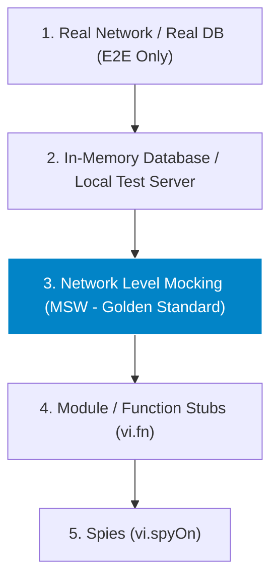
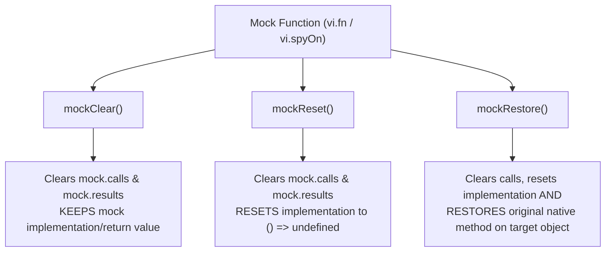

# Mocking Strategy & Mock Lifecycle Architecture

> **Scope:** Exploring Test Doubles (Dummies, Stubs, Spies, Mocks, Fakes, MSW), preventing Mock Drift, and mastering cleanup lifecycles (`mockClear`, `mockReset`, `mockRestore`).

---

## Table of Contents

- [Mocking Strategy \& Mock Lifecycle Architecture](#mocking-strategy--mock-lifecycle-architecture)
  - [Table of Contents](#table-of-contents)
  - [1. The Test Doubles Taxonomy](#1-the-test-doubles-taxonomy)
  - [2. The Mocking Hierarchy: Real $\\to$ In-Memory $\\to$ MSW $\\to$ Stubs](#2-the-mocking-hierarchy-real-to-in-memory-to-msw-to-stubs)
  - [3. Manual Module Mocks with Dunder (`__mocks__`)](#3-manual-module-mocks-with-dunder-__mocks__)
    - [Mocking NPM / Node Core Packages (Root `__mocks__`)](#mocking-npm--node-core-packages-root-__mocks__)
    - [Mocking Local User Modules (Co-Located `__mocks__`)](#mocking-local-user-modules-co-located-__mocks__)
  - [4. Mock Cleanup Lifecycle: `mockClear` vs. `mockReset` vs. `mockRestore`](#4-mock-cleanup-lifecycle-mockclear-vs-mockreset-vs-mockrestore)
    - [Comparison Matrix](#comparison-matrix)
    - [Teardown Best Practices](#teardown-best-practices)
  - [4. Over-Mocking \& Mock Drift Pitfalls](#4-over-mocking--mock-drift-pitfalls)
  - [5. When to Mock vs. When NOT to Mock](#5-when-to-mock-vs-when-not-to-mock)

---

## 1. The Test Doubles Taxonomy

```text
+------------------+----------------------------------------------------------------------------------+
| Test Double Type | Formal Definition & Use Case                                                     |
+------------------+----------------------------------------------------------------------------------+
| **Dummy**        | Objects passed around to satisfy function parameters; never actually used.       |
| **Stub**         | Returns fixed, hardcoded responses without any internal logic or verification.   |
| **Spy**          | Wraps a real function to record arguments, call counts, and returned values.     |
| **Mock**         | Pre-programmed with expected method calls; fails if expected calls do not occur. |
| **Fake**         | Working lightweight in-memory implementation (e.g. SQLite for PostgreSQL).       |
| **MSW**          | Network-layer interception via Service Worker / Node HTTP client. (Gold standard)|
+------------------+----------------------------------------------------------------------------------+
```

---

## 2. The Mocking Hierarchy: Real $\to$ In-Memory $\to$ MSW $\to$ Stubs



---

## 3. Manual Module Mocks with Dunder (`__mocks__`)

Jest and Vitest provide built-in auto-mocking resolution using the **`__mocks__`** directory.

### Mocking NPM / Node Core Packages (Root `__mocks__`)

To manually mock a third-party npm package (e.g. `axios`, `lodash`) or Node core module (e.g. `fs`):

1. Place a file with the exact package name inside a **root `__mocks__` directory** adjacent to `node_modules`.
2. When any test executes `jest.mock('axios')`, Jest automatically substitutes your manual mock file.

```text
my-project/
├── node_modules/
├── __mocks__/
│   ├── axios.ts                   # Manual mock for 'axios' package
│   └── fs.ts                      # Manual mock for Node 'fs'
└── src/
```

```typescript
// __mocks__/axios.ts
import { vi } from 'vitest';

const mockAxios = {
  get: vi.fn(() => Promise.resolve({ data: {} })),
  post: vi.fn(() => Promise.resolve({ data: {} })),
  create: vi.fn(function () {
    return mockAxios;
  }),
};

export default mockAxios;
```

---

### Mocking Local User Modules (Co-Located `__mocks__`)

To mock a local source file (e.g. `src/services/auth.ts`), create a `__mocks__` folder **in the exact same directory as the module**:

```text
src/
└── services/
    ├── auth.ts                    # Real implementation
    └── __mocks__/
        └── auth.ts                # Manual mock for './auth'
```

In your test:

```typescript
// src/services/__tests__/auth.test.ts
import { loginUser } from '../auth';

// Explicitly instruct Jest/Vitest to use the co-located dunder mock:
jest.mock('../auth'); // Automatically resolves to ../__mocks__/auth.ts
```

---

## 4. Mock Cleanup Lifecycle: `mockClear` vs. `mockReset` vs. `mockRestore`



### Comparison Matrix

| Feature                                    |   `mockClear()`    |         `mockReset()`          |            `mockRestore()`             |
| :----------------------------------------- | :----------------: | :----------------------------: | :------------------------------------: |
| **Clears Call History (`.mock.calls`)**    |       ✅ Yes       |             ✅ Yes             |                 ✅ Yes                 |
| **Clears Instances / Results**             |       ✅ Yes       |             ✅ Yes             |                 ✅ Yes                 |
| **Resets Custom Mock Implementation**      |       ❌ No        | ✅ Yes (Resets to `undefined`) |                 ✅ Yes                 |
| **Restores Original Native Object Method** |       ❌ No        |             ❌ No              | ✅ Yes (Re-attaches original function) |
| **Global Config Equivalent**               | `clearMocks: true` |       `resetMocks: true`       |          `restoreMocks: true`          |

---

### Teardown Best Practices

```typescript
describe('Telemetry Logger', () => {
  let warnSpy: any;

  beforeEach(() => {
    // Spy on native console.warn
    warnSpy = vi.spyOn(console, 'warn').mockImplementation(() => {});
  });

  afterEach(() => {
    // CRUCIAL: mockRestore reinstates original console.warn so other tests are not affected!
    warnSpy.mockRestore();
  });

  it('logs warning on unhandled event', () => {
    logTelemetry('UNKNOWN_EVENT');
    expect(warnSpy).toHaveBeenCalledWith('Unhandled telemetry event: UNKNOWN_EVENT');
  });
});
```

---

## 4. Over-Mocking & Mock Drift Pitfalls

1. **The Over-Mocking Trap:** If you mock 5 sub-components and 3 utility functions just to test a parent component, you are testing your mocks, not your application.
2. **Mock Drift:** When the backend changes an API field name (e.g. `user_id` $\to$ `userId`), static JSON mock files remain green while production crashes.
   - **Fix:** Use TypeScript shared API types and Consumer-Driven Contract Testing (Pact).

---

## 5. When to Mock vs. When NOT to Mock

| When to Mock                                                    | When NOT to Mock                                                 |
| :-------------------------------------------------------------- | :--------------------------------------------------------------- |
| ✅ External third-party payment gateways (Stripe, PayPal).      | ❌ Pure algorithmic utility functions (run them naturally!).     |
| ✅ Network HTTP boundaries (use MSW).                           | ❌ Child components inside a UI tree (render full subtree!).     |
| ✅ System timers, dates, and random UUID generators.            | ❌ State management stores (Redux/Zustand - use real store!).    |
| ✅ Browser capabilities not supported in JSDOM (Canvas, WebGL). | ❌ React hooks like `useState`, `useEffect` (never mock hooks!). |
