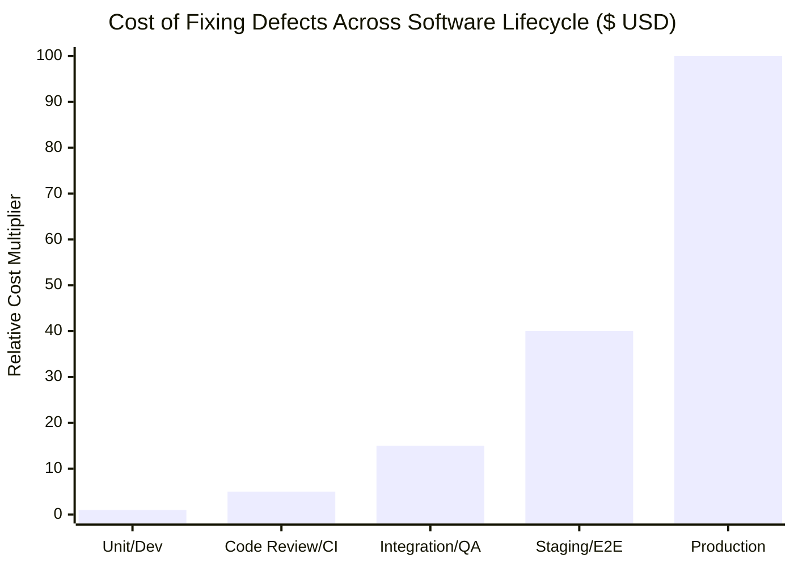
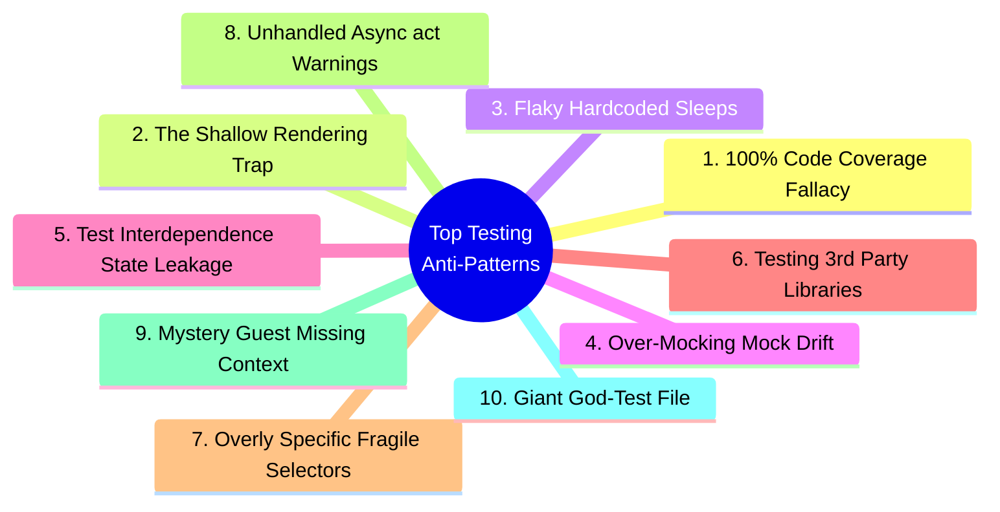
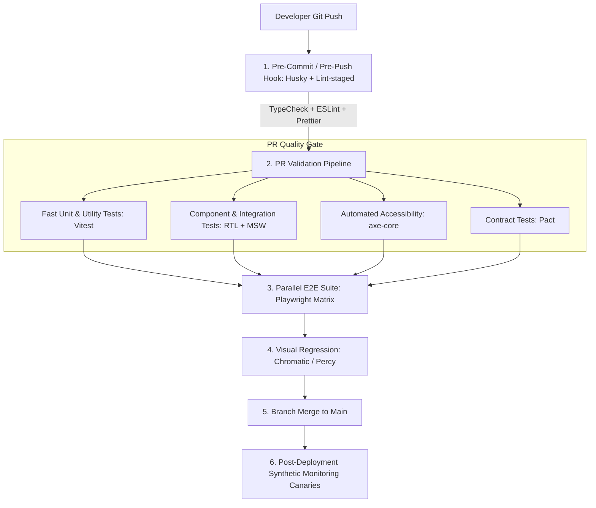

# Testing & Quality Engineering Architecture Master Index

A comprehensive, production-grade guide to modern Software Testing, Frontend & Full-Stack Quality Engineering, Testing Strategies, and Interview Mastery.

> **🌟 Senior/Staff Architectural Note:** Testing is not merely about achieving high code coverage metrics; it is an engineering discipline designed to maximize **Confidence**, **Velocity**, and **Maintainability** while minimizing the **Cost of Regressions** and **Flakiness**.

---

## 📚 Master Modular Documentation Hub

Every testing methodology, pattern, and practice has been split into dedicated, in-depth architectural guides:

|   #    | Dedicated Guide                                                                  | Scope & Key Technologies                                                                                                                                  |
| :----: | :------------------------------------------------------------------------------- | :-------------------------------------------------------------------------------------------------------------------------------------------------------- |
| **1**  | **[Unit Testing Architecture](./Unit_Testing.md)**                               | Pure functions, math, data transformers, custom hooks (`renderHook`), deterministic fake timers (`fakeTimers`), AAA pattern.                              |
| **2**  | **[Component & DOM Testing](./Component_Testing.md)**                            | React Testing Library philosophy, Strict Query Priority (`getByRole` $\to$ `getByTestId`), `act()` mechanics, `waitFor()` vs `findBy*`, errors & portals. |
| **3**  | **[Integration Testing & MSW](./Integration_Testing.md)**                        | Inter-component state flows, React Query/Redux integration, Mock Service Worker (MSW 2.0), fault injection (500 errors, latency).                         |
| **4**  | **[End-to-End (E2E) Automation](./E2E_Testing.md)**                              | Playwright vs Cypress vs Selenium, Page Object Model (POM), Auth State reuse (`storageState.json`), auto-waiting, parallel workers.                       |
| **5**  | **[TDD & BDD Methodologies](./TDD_BDD.md)**                                      | Test-Driven Development (Red-Green-Refactor), Chicago vs London schools, Step-by-Step Task Queue walkthrough, Given-When-Then BDD.                        |
| **6**  | **[A/B, Split & Bucket Testing](./AB_Testing.md)**                               | A/B vs Split URL vs Bucket testing vs MVT, Edge/Server bucketing, consistent hashing (`CRC32`), FOOC flicker mitigation, telemetry.                       |
| **7**  | **[Visual Regression & Snapshots](./Visual_Regression_Testing.md)**              | DOM text snapshots vs Pixel-diff raster snapshots, Playwright `toHaveScreenshot`, Dockerized font consistency, Percy, Chromatic.                          |
| **8**  | **[Performance & Load Testing](./Performance_Load_Testing.md)**                  | Core Web Vitals CI assertions (Lighthouse CI), API stress testing with k6 (VUs, p95/p99), automated heap snapshot memory leak audits.                     |
| **9**  | **[Accessibility (a11y) Testing](./Accessibility_Testing.md)**                   | Automated Axe (`jest-axe`, `@axe-core/playwright`), 35% automated detection limit, manual keyboard focus traps, screen reader heuristics.                 |
| **10** | **[Security & Vulnerability Testing](./Security_Testing.md)**                    | SAST vs DAST pipelines, `npm audit` / Snyk dependency SCA, OWASP ZAP dynamic scanning, CSP and security header validation.                                |
| **11** | **[Cross-Browser & Responsive](./Cross_Browser_Testing.md)**                     | Blink vs WebKit vs Gecko engines, Playwright multi-engine matrix, local emulation vs BrowserStack real-device cloud, container queries.                   |
| **12** | **[Localization (i18n) Testing](./Localization_Testing.md)**                     | Pseudo-localization text expansion ($+30\%-50\%$), Right-to-Left (RTL) mirroring, `Intl` multi-locale formatting, pluralization rules.                    |
| **13** | **[Contract & Mutation Testing](./Contract_Mutation_Testing.md)**                | Consumer-Driven Contracts (Pact) across micro-frontends, Mutation Testing with Stryker Mutator ("Killing Mutants", mutation scores).                      |
| **14** | **[Mocking Strategy & Lifecycle](./Mocking_Strategy.md)**                        | Test Doubles taxonomy (Dummies, Stubs, Spies, Mocks, Fakes, MSW), `mockClear` vs `mockReset` vs `mockRestore`, avoiding mock drift.                       |
| **15** | **[Assertions & Expect API Mastery](./Assertions_Expect_API.md)**                | Jest/Vitest expect engine, `toBe` vs `toEqual` vs `toStrictEqual`, asymmetric matchers, soft assertions (`expect.soft`), `expect.poll`, custom matchers.  |
| **16** | **[Scheduled Automation & SES Engine](./Scheduled_Automation_SES.md)**           | Synthetic 24/7 browser monitoring, step-by-step timer logging (`performance.now()`), failure screenshot capture, daily 08:00 AM Amazon SES HTML reports.  |
| **17** | **[Autonomous QA (Zero Org Repo Access)](./Autonomous_QA_Zero_Access_Guide.md)** | Black-box personal GitHub Actions engine, 2,000 free mins/mo, Daily 8am Cron + 1-Click Release Verification dropdowns, Linear Webhooks.                   |
| **18** | **[Enterprise QA & Integrated CI/CD](./Enterprise_QA_Integrated_CI_CD.md)**      | Monorepo/QA repo architecture, PR Quality Gate, 4x Playwright matrix sharding, PR preview ephemeral testing, Bitbucket Pipelines & Slack gates.           |
| **19** | **[Testing Master Interview Bank](./Testing_QA.md)**                             | 29+ Senior/Staff interview questions, live coding suites (`debounce`, `throttle`, TDD Task Queue, A/B Engine, Checkout E2E, grill defense).               |

---

## 1. Executive Summary & Testing Philosophy

### The Cost of Bugs Curve (Shift-Left Testing)

Finding and repairing defects in software grows exponentially more expensive the later in the lifecycle they are discovered:



- **Unit/Dev Stage ($1\times$):** Fixed in seconds inside IDE before committing.
- **CI / Static Analysis ($5\times$):** Blocked on Pull Request; minimal engineer context-switching.
- **Staging / QA ($40\times$):** Requires repro steps, filing tickets, re-testing, and redeployment.
- **Production ($100\times+$):** Incurs outages, rollbacks, customer churn, SLA penalties, emergency hotfixes, and brand damage.

**Shift-Left Principle:** Push verification as close to the developer workstation as possible through type safety, fast unit/integration suites, and static analysis without sacrificing end-to-end user confidence.

---

### Testing Pyramid vs. Testing Trophy vs. Testing Diamond

```text
       TRADITIONAL PYRAMID (Fowler)                  TESTING TROPHY (Kent C. Dodds)
                  /\                                              __
                 /E2E\  (Slow, Expensive)                        /  \    End-to-End
                /-----\                                         /----\
               / Integ \                                       / Integ\  Integration (Sweet Spot)
              /---------\                                     /--------\
             /   Unit    \ (Fast, Cheap)                     | Unit +   | Component
            /-------------\                                  | Static   | (TS/ESLint)
```

| Dimension        | Testing Pyramid (Backend/Microservices)                  | Testing Trophy (Modern Web & SPAs)                                       |
| :--------------- | :------------------------------------------------------- | :----------------------------------------------------------------------- |
| **Primary Base** | Unit tests isolating single classes/functions.           | Static typing (TypeScript) + ESLint + Integration tests.                 |
| **Philosophy**   | Prove micro-units in complete vacuum with stubs.         | "Write tests. Not too many. Mostly integration."                         |
| **Sweet Spot**   | Fast unit tests + Contract testing across microservices. | Integration tests rendering DOM subtrees with Mock Service Worker (MSW). |
| **E2E Role**     | Small top layer testing critical business flows.         | Focused high-value smoke journeys (Auth, Checkout).                      |

---

## 2. Master Testing Taxonomy Matrix (16 Dimensions)

|   #    | Testing Category         | Scope & Objective                                                                                 | Speed / Cost                       |    Flakiness Risk    | Primary Industry Tools                            | When to Use                                                                  | When NOT to Use                                            |
| :----: | :----------------------- | :------------------------------------------------------------------------------------------------ | :--------------------------------- | :------------------: | :------------------------------------------------ | :--------------------------------------------------------------------------- | :--------------------------------------------------------- |
| **1**  | **Unit Testing**         | Individual pure functions, algorithms, regexes, custom hooks in total isolation.                  | $\approx 1-5\text{ms}$ / Ultra Low |         Zero         | Vitest, Jest, Mocha                               | Pure business logic, math, state reducers, utility formatters.               | Complex multi-component UI trees, network-bound logic.     |
| **2**  | **Component Testing**    | Individual UI component rendering, props, user interactions, local state transitions.             | $\approx 10-50\text{ms}$ / Low     |         Low          | React Testing Library, Storybook Test-Runner      | UI design systems, dropdowns, forms, interactive widgets.                    | Full page journeys requiring multi-page router state.      |
| **3**  | **Integration Testing**  | Inter-component communication, data fetching orchestration, store hooks with mocked APIs.         | $\approx 50-200\text{ms}$ / Med    |       Low-Med        | RTL + MSW, Supertest, Vitest                      | Feature modules (e.g. Shopping Cart + API fetch + state updates).            | Simple leaf UI nodes with zero side effects.               |
| **4**  | **Functional Testing**   | Business capability verification against functional requirements (black-box).                     | $\approx 0.5-2\text{s}$ / Med      |        Medium        | Playwright, Cypress, Cucumber                     | Verifying user stories (e.g., "User applies coupon and total recalculates"). | Low-level error edge case checking.                        |
| **5**  | **End-to-End (E2E)**     | Full stack from real browser to real/staging DB and 3rd party APIs.                               | $\approx 3-30\text{s}$ / High      |         High         | Playwright, Cypress, Selenium                     | Mission-critical happy paths: Sign Up, Payment, Order Fulfillment.           | Testing 100 variations of form validation errors.          |
| **6**  | **Regression Testing**   | Validating that new commits do not break existing working functionality.                          | Varies / Med                       |         Med          | Automated CI test suites, Percy, Chromatic        | Every PR merge, release candidate branch validation.                         | Prototyping disposable POC features.                       |
| **7**  | **Visual Regression**    | Pixel-by-pixel or DOM layout snapshot comparison across viewports and OS.                         | $\approx 1-5\text{s}$ / Med        | Med (Font/GPU diffs) | Playwright `toHaveScreenshot`, Percy, Chromatic   | Design systems, design tokens, marketing landing pages.                      | Highly dynamic canvas charts or real-time streaming feeds. |
| **8**  | **Performance & Load**   | Response times, Core Web Vitals (LCP/INP/CLS), server RPS, concurrency limits.                    | Variable / Med-High                |         Low          | Lighthouse CI, WebPageTest, k6, Artillery         | SLA enforcement, high-traffic holiday preparation, memory leak audits.       | Early alpha phase with unstable data models.               |
| **9**  | **Accessibility (a11y)** | WCAG 2.1/2.2 AA compliance, keyboard navigation, screen reader accessibility tree.                | $\approx 20-100\text{ms}$ / Low    |         Low          | `axe-core`, `jest-axe`, Playwright a11y, Pa11y    | All customer-facing web/mobile applications.                                 | Pure headless background jobs or CLI scripts.              |
| **10** | **Cross-Browser**        | Compatibility across rendering engines (Blink, WebKit, Gecko) and device screens.                 | $\approx 5-30\text{s}$ / High      |        Medium        | Playwright Cross-Engine, BrowserStack, Sauce Labs | Broad consumer web apps supporting Safari, Firefox, Chrome, iOS/Android.     | Internal admin tooling with mandated corporate browser.    |
| **11** | **Security Testing**     | Vulnerability scanning, SAST, DAST, CSRF/XSS attack vectors, dependency audits.                   | Variable / Med                     |         Low          | Snyk, OWASP ZAP, Burp Suite, `npm audit`          | Auth flows, payment integrations, PII input handlers, every CI build.        | Trivial static brochure sites.                             |
| **12** | **Localization (i18n)**  | Multilingual rendering, text truncation, RTL (Right-to-Left) mirroring, date/currency formatting. | $\approx 10-100\text{ms}$ / Low    |         Low          | Pseudo-localization, FormatJS, RTL Jest suites    | Global international products supporting multi-language/locales.             | Single-region local internal utilities.                    |
| **13** | **A/B Testing**          | Variant allocation, metric telemetry, flicker mitigation, statistical confidence.                 | Continuous / Low                   |         Low          | Statsig, LaunchDarkly, Optimizely, Custom Engine  | Feature experiments, conversion funnel optimization.                         | Security patches or urgent infrastructure bug fixes.       |
| **14** | **Contract Testing**     | Decoupled verification of API schemas between Frontend (Consumer) & Backend (Provider).           | $\approx 50-300\text{ms}$ / Low    |       Very Low       | Pact, OpenAPI Validator                           | Micro-frontends, multi-team decoupled microservices architectures.           | Monolithic apps sharing single codebase types.             |
| **15** | **Mutation Testing**     | Injects faults into source code to verify if the test suite actually fails and catches bugs.      | Minutes / High                     |         Low          | Stryker Mutator                                   | Core banking calculations, flight control, crypto math, security libs.       | Rapid MVP development where tests change daily.            |
| **16** | **Chaos / Resiliency**   | Injecting network latency, HTTP 500s, offline drops, and race conditions.                         | Variable / Med                     |         Low          | MSW error injection, Chaos Mesh, Toxiproxy        | Resilient offline-first PWAs, retry backoff logic, distributed fallbacks.    | Simple read-only static blogs.                             |

---

## 3. Top 10 Testing Pitfalls & Anti-Patterns



1. **The 100% Code Coverage Fallacy:** Coverage measures lines hit, not edge cases or boundary assertions. Target $80-85\%$ branch coverage + high Mutation Score.
2. **The Shallow Rendering Trap:** Using shallow rendering hides broken props passed to child components. Always render full component trees.
3. **Flaky Hardcoded Sleeps:** Using `setTimeout(1000)` fails on slow CI and wastes time on fast machines. Use auto-retrying web assertions.
4. **Over-Mocking & Mock Drift:** Mocking every helper hides integration breakages. Keep business helpers real and mock only external network boundaries (MSW).
5. **State Leakage (Interdependent Tests):** Tests depending on state from previous tests fail when run in random order. Ensure total isolation in `beforeEach`/`afterEach`.

---

## 4. CI/CD Quality Gates & Automated Governance Pipeline


