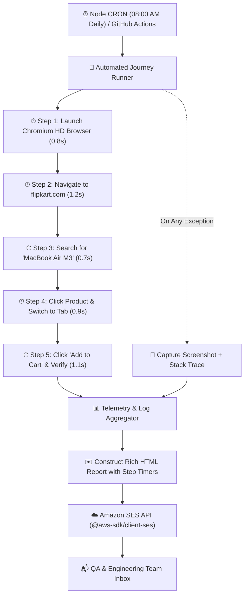

# Scheduled Browser Automation & Amazon SES Reporting Engine

> **Scope:** Building a 24/7 automated synthetic monitoring and health check pipeline with Puppeteer, high-resolution step-by-step timer logging, automatic failure screenshot capture, and daily 08:00 AM Amazon SES HTML email reporting.

---

## Table of Contents

- [Scheduled Browser Automation \& Amazon SES Reporting Engine](#scheduled-browser-automation--amazon-ses-reporting-engine)
  - [Table of Contents](#table-of-contents)
  - [1. Architecture \& Execution Pipeline](#1-architecture--execution-pipeline)
  - [2. High-Resolution Step-by-Step Timing Telemetry](#2-high-resolution-step-by-step-timing-telemetry)
  - [3. Step 1: Amazon SES Email Dispatcher Service (`emailService.ts`)](#3-step-1-amazon-ses-email-dispatcher-service-emailservicets)
  - [4. Step 2: Flipkart E-Commerce User Journey Runner (`userJourneyRunner.ts`)](#4-step-2-flipkart-e-commerce-user-journey-runner-userjourneyrunnerts)
  - [5. Step 3: Daily 08:00 AM CRON Scheduler (`cronScheduler.ts`)](#5-step-3-daily-0800-am-cron-scheduler-cronschedulerts)
  - [6. Step 4: Serverless GitHub Actions CRON Workflow (`daily-e2e-check.yml`)](#6-step-4-serverless-github-actions-cron-workflow-daily-e2e-checkyml)
  - [7. Error Handling, Failure Screenshots \& Self-Healing](#7-error-handling-failure-screenshots--self-healing)
  - [8. Production Deployment \& AWS IAM Policies](#8-production-deployment--aws-iam-policies)
  - [9. Related QA Guides \& Blueprints](#9-related-qa-guides--blueprints)

---

## 1. Architecture & Execution Pipeline

Synthetic monitoring executes real browser journeys on a fixed cron schedule against production or staging environments to detect outages, UI regressions, or third-party latency before real customers encounter them.



---

## 2. High-Resolution Step-by-Step Timing Telemetry

Instead of tracking only the total execution time, each discrete browser action is wrapped in a high-resolution timer (`performance.now()`). This identifies exactly which step is slowing down the user journey (e.g. DNS resolution vs. search API latency vs. checkout button render).

```typescript
interface StepLog {
  stepNumber: number;
  stepName: string;
  durationMs: number;
  status: 'PASSED' | 'FAILED';
  details?: string;
}
```

---

## 3. Step 1: Amazon SES Email Dispatcher Service (`emailService.ts`)

Amazon SES (Simple Email Service) provides high-deliverability email delivery with HTML styling and failure attachments.

```typescript
// services/emailService.ts
import { SESClient, SendEmailCommand } from '@aws-sdk/client-ses';

export interface StepLog {
  stepNumber: number;
  stepName: string;
  durationMs: number;
  status: 'PASSED' | 'FAILED';
  details?: string;
}

export interface TestReportSummary {
  suiteName: string;
  targetUrl: string;
  startTime: Date;
  endTime: Date;
  totalDurationMs: number;
  status: 'PASSED' | 'FAILED';
  steps: StepLog[];
  errorMessage?: string;
  errorStack?: string;
}

export class EmailService {
  private sesClient: SESClient;
  private fromEmail: string;

  constructor() {
    this.fromEmail = process.env.SES_FROM_EMAIL || 'qa-alerts@yourdomain.com';
    this.sesClient = new SESClient({
      region: process.env.AWS_REGION || 'us-east-1',
      credentials: {
        accessKeyId: process.env.AWS_ACCESS_KEY_ID || '',
        secretAccessKey: process.env.AWS_SECRET_ACCESS_KEY || '',
      },
    });
  }

  private generateHtmlTemplate(report: TestReportSummary): string {
    const isPassed = report.status === 'PASSED';
    const statusColor = isPassed ? '#10B981' : '#EF4444';
    const statusBg = isPassed ? '#ECFDF5' : '#FEF2F2';

    const stepRows = report.steps
      .map(
        (s) => `
        <tr style="border-bottom: 1px solid #E5E7EB;">
          <td style="padding: 10px; font-weight: bold; color: #4B5563;">Step ${s.stepNumber}</td>
          <td style="padding: 10px; color: #1F2937;">${s.stepName}</td>
          <td style="padding: 10px; font-family: monospace; color: #4B5563;">${(s.durationMs / 1000).toFixed(2)}s (${s.durationMs}ms)</td>
          <td style="padding: 10px;">
            <span style="display: inline-block; padding: 4px 8px; border-radius: 4px; font-weight: bold; font-size: 12px; color: ${
              s.status === 'PASSED' ? '#065F46' : '#991B1B'
            }; background-color: ${s.status === 'PASSED' ? '#D1FAE5' : '#FEE2E2'};">
              ${s.status}
            </span>
          </td>
        </tr>
      `,
      )
      .join('');

    const errorSection = report.errorMessage
      ? `
      <div style="margin-top: 20px; padding: 16px; background-color: #FEF2F2; border-left: 4px solid #EF4444; border-radius: 4px;">
        <h3 style="margin-top: 0; color: #991B1B;">🚨 Execution Error</h3>
        <p style="color: #B91C1C; font-weight: bold; font-family: monospace;">${report.errorMessage}</p>
        <pre style="background-color: #1F2937; color: #F9FAFB; padding: 12px; border-radius: 4px; overflow-x: auto; font-size: 12px;">${
          report.errorStack || 'No stack trace available'
        }</pre>
      </div>
    `
      : '';

    return `
      <!DOCTYPE html>
      <html>
      <head><meta charset="utf-8"/></head>
      <body style="font-family: -apple-system, BlinkMacSystemFont, 'Segoe UI', Roboto, sans-serif; background-color: #F3F4F6; margin: 0; padding: 24px;">
        <div style="max-width: 700px; margin: 0 auto; background: #ffffff; border-radius: 8px; box-shadow: 0 4px 6px rgba(0,0,0,0.05); overflow: hidden; border: 1px solid #E5E7EB;">

          <!-- Header Banner -->
          <div style="background-color: ${statusBg}; border-bottom: 2px solid ${statusColor}; padding: 20px 24px;">
            <div style="display: flex; justify-content: space-between; align-items: center;">
              <div>
                <h1 style="margin: 0; font-size: 20px; color: #111827;">${report.suiteName}</h1>
                <p style="margin: 4px 0 0 0; color: #6B7280; font-size: 14px;">Target: <a href="${report.targetUrl}" style="color: #2563EB;">${report.targetUrl}</a></p>
              </div>
              <span style="background-color: ${statusColor}; color: #ffffff; font-weight: bold; padding: 6px 14px; border-radius: 20px; font-size: 14px;">
                ${report.status}
              </span>
            </div>
          </div>

          <!-- Summary Metrics -->
          <div style="padding: 24px;">
            <div style="display: grid; grid-template-columns: repeat(3, 1fr); gap: 16px; margin-bottom: 24px;">
              <div style="background: #F9FAFB; padding: 12px; border-radius: 6px; border: 1px solid #E5E7EB;">
                <div style="font-size: 12px; color: #6B7280; text-transform: uppercase;">Total Time</div>
                <div style="font-size: 18px; font-weight: bold; color: #111827; margin-top: 4px;">${(report.totalDurationMs / 1000).toFixed(2)}s</div>
              </div>
              <div style="background: #F9FAFB; padding: 12px; border-radius: 6px; border: 1px solid #E5E7EB;">
                <div style="font-size: 12px; color: #6B7280; text-transform: uppercase;">Executed At</div>
                <div style="font-size: 14px; font-weight: bold; color: #111827; margin-top: 4px;">${report.startTime.toLocaleTimeString()}</div>
              </div>
              <div style="background: #F9FAFB; padding: 12px; border-radius: 6px; border: 1px solid #E5E7EB;">
                <div style="font-size: 12px; color: #6B7280; text-transform: uppercase;">Total Steps</div>
                <div style="font-size: 18px; font-weight: bold; color: #111827; margin-top: 4px;">${report.steps.length}</div>
              </div>
            </div>

            <!-- Step Timing Table -->
            <h3 style="color: #111827; margin-bottom: 12px; font-size: 16px;">⏱ Step-by-Step Execution Timings</h3>
            <table style="width: 100%; border-collapse: collapse; text-align: left; font-size: 14px;">
              <thead>
                <tr style="background-color: #F9FAFB; border-bottom: 2px solid #E5E7EB;">
                  <th style="padding: 10px; color: #4B5563;">Step #</th>
                  <th style="padding: 10px; color: #4B5563;">Action</th>
                  <th style="padding: 10px; color: #4B5563;">Duration</th>
                  <th style="padding: 10px; color: #4B5563;">Status</th>
                </tr>
              </thead>
              <tbody>
                ${stepRows}
              </tbody>
            </table>

            ${errorSection}
          </div>

          <!-- Footer -->
          <div style="background: #F9FAFB; padding: 12px 24px; border-top: 1px solid #E5E7EB; text-align: center; color: #9CA3AF; font-size: 12px;">
            Automated Daily E2E Health Check • Dispatched via Amazon SES
          </div>
        </div>
      </body>
      </html>
    `;
  }

  async sendReport(recipientEmail: string, report: TestReportSummary): Promise<void> {
    const htmlBody = this.generateHtmlTemplate(report);
    const subject = `[${report.status}] E2E Daily Health Check: ${report.suiteName} (${(report.totalDurationMs / 1000).toFixed(1)}s)`;

    const command = new SendEmailCommand({
      Source: this.fromEmail,
      Destination: {
        ToAddresses: [recipientEmail],
      },
      Message: {
        Subject: { Data: subject, Charset: 'UTF-8' },
        Body: {
          Html: { Data: htmlBody, Charset: 'UTF-8' },
        },
      },
    });

    try {
      const response = await this.sesClient.send(command);
      console.log(`✅ Email report successfully sent via SES! MessageId: ${response.MessageId}`);
    } catch (error) {
      console.error('❌ Failed to send SES email:', error);
      throw error;
    }
  }
}
```

---

## 4. Step 2: Flipkart E-Commerce User Journey Runner (`userJourneyRunner.ts`)

This runner executes the critical user journey on `https://www.flipkart.com/`, calculates each step's duration, handles multi-tab switching, captures failure screenshots, and passes the telemetry payload to the email service:

```typescript
// runner/userJourneyRunner.ts
import puppeteer, { Browser, Page } from 'puppeteer';
import path from 'path';
import fs from 'fs';
import { performance } from 'perf_hooks';
import { EmailService, StepLog, TestReportSummary } from '../services/emailService';

export class UserJourneyRunner {
  private emailService = new EmailService();

  private async executeStep<T>(
    stepNumber: number,
    stepName: string,
    stepsList: StepLog[],
    action: () => Promise<T>,
  ): Promise<T> {
    console.log(`⏳ Starting Step ${stepNumber}: ${stepName}...`);
    const start = performance.now();

    try {
      const result = await action();
      const durationMs = Math.round(performance.now() - start);
      stepsList.push({
        stepNumber,
        stepName,
        durationMs,
        status: 'PASSED',
      });
      console.log(`✅ Step ${stepNumber} finished in ${(durationMs / 1000).toFixed(2)}s`);
      return result;
    } catch (err: any) {
      const durationMs = Math.round(performance.now() - start);
      stepsList.push({
        stepNumber,
        stepName,
        durationMs,
        status: 'FAILED',
        details: err.message,
      });
      console.error(`❌ Step ${stepNumber} FAILED after ${durationMs}ms:`, err.message);
      throw err;
    }
  }

  async runDailyJourney(targetUrl = 'https://www.flipkart.com/'): Promise<TestReportSummary> {
    const suiteStartTime = new Date();
    const overallStart = performance.now();
    const steps: StepLog[] = [];

    let browser: Browser | null = null;
    let page: Page | null = null;
    let errorMessage: string | undefined;
    let errorStack: string | undefined;

    try {
      // Step 1: Launch Browser
      await this.executeStep(1, 'Launch Chromium Browser with HD Viewport', steps, async () => {
        browser = await puppeteer.launch({
          headless: 'new', // Run in background for scheduled cron
          args: ['--no-sandbox', '--disable-dev-shm-usage', '--window-size=1920,1080'],
          defaultViewport: { width: 1620, height: 1080 },
        });
        page = await browser.newPage();
        await page.setViewport({ width: 1620, height: 1080 });
      });

      // Step 2: Navigate to Homepage
      await this.executeStep(2, `Navigate to ${targetUrl}`, steps, async () => {
        if (!page) throw new Error('Page not initialized');
        await page.goto(targetUrl, { waitUntil: 'networkidle2', timeout: 30000 });
      });

      // Step 3: Search for Product
      await this.executeStep(3, 'Search for "MacBook Air M3" in Search Bar', steps, async () => {
        if (!page) throw new Error('Page not initialized');
        const searchInput = 'input[name="q"], input[title*="Search"]';
        await page.waitForSelector(searchInput, { visible: true, timeout: 10000 });
        await page.type(searchInput, 'MacBook Air M3', { delay: 50 });
        await page.keyboard.press('Enter');
        await page.waitForNavigation({ waitUntil: 'domcontentloaded', timeout: 15000 });
      });

      // Step 4: Click First Product and Switch to Tab
      let productPage: Page = page!;
      await this.executeStep(4, 'Click First Search Result & Handle New Tab', steps, async () => {
        if (!page) throw new Error('Page not initialized');
        const firstItem = 'div[data-id] a[href*="/p/"], a._1fQZEK, a.CG2cNx';
        await page.waitForSelector(firstItem, { visible: true, timeout: 10000 });

        // Listen for new tab if opened via target="_blank"
        const newTargetPromise = browser!
          .waitForTarget((target) => target.opener() === page!.target(), { timeout: 10000 })
          .catch(() => null);
        await page.click(firstItem);

        const newTarget = await newTargetPromise;
        if (newTarget) {
          productPage = (await newTarget.page())!;
          await productPage.bringToFront();
          await productPage.waitForNetworkIdle({ timeout: 10000 }).catch(() => {});
        }
      });

      // Step 5: Verify Product Details & "Add to Cart" Button
      await this.executeStep(5, 'Verify Product Details & Action Buttons', steps, async () => {
        await productPage.waitForSelector('button, a', { visible: true, timeout: 10000 });
        const hasAddToCart = await productPage.evaluate(() => {
          return (
            document.body.innerText.toLowerCase().includes('cart') ||
            document.body.innerText.toLowerCase().includes('buy now')
          );
        });
        if (!hasAddToCart) throw new Error('Add to Cart / Buy Now button not found on product page');
      });
    } catch (err: any) {
      errorMessage = err.message;
      errorStack = err.stack;

      // Capture failure screenshot for debugging
      if (page) {
        const screenshotDir = path.join(process.cwd(), 'screenshots');
        if (!fs.existsSync(screenshotDir)) fs.mkdirSync(screenshotDir, { recursive: true });
        const screenshotPath = path.join(screenshotDir, `failure_${Date.now()}.png`);
        await (page as Page).screenshot({ path: screenshotPath, fullPage: true });
        console.log(`📸 Saved failure screenshot to: ${screenshotPath}`);
      }
    } finally {
      if (browser) {
        await (browser as Browser).close();
      }
    }

    const suiteEndTime = new Date();
    const totalDurationMs = Math.round(performance.now() - overallStart);
    const overallStatus = errorMessage ? 'FAILED' : 'PASSED';

    const report: TestReportSummary = {
      suiteName: 'Daily Flipkart E-Commerce Critical Path Automation',
      targetUrl,
      startTime: suiteStartTime,
      endTime: suiteEndTime,
      totalDurationMs,
      status: overallStatus,
      steps,
      errorMessage,
      errorStack,
    };

    // Send email report via Amazon SES
    const recipient = process.env.REPORT_RECIPIENT || 'engineering-leads@yourdomain.com';
    await this.emailService.sendReport(recipient, report);

    return report;
  }
}
```

---

## 5. Step 3: Daily 08:00 AM CRON Scheduler (`cronScheduler.ts`)

Using `node-cron` to schedule the job daily at `0 8 * * *` (08:00 AM):

```typescript
// cron/cronScheduler.ts
import cron from 'node-cron';
import { UserJourneyRunner } from '../runner/userJourneyRunner';

console.log('⏰ Initializing Automated E2E Test Scheduler...');

// CRON Syntax: "minute hour day-of-month month day-of-week"
// "0 8 * * *" runs every day at precisely 08:00 AM
cron.schedule('0 8 * * *', async () => {
  console.log(`\n🔔 [${new Date().toISOString()}] Triggering Daily 08:00 AM E2E Test Suite...`);

  const runner = new UserJourneyRunner();
  try {
    const report = await runner.runDailyJourney('https://www.flipkart.com/');
    console.log(`📊 Suite finished with status: ${report.status} in ${(report.totalDurationMs / 1000).toFixed(2)}s`);
  } catch (err) {
    console.error('💥 Unhandled error in daily cron execution:', err);
  }
});

console.log('🚀 Scheduler is active and waiting for 08:00 AM trigger.');
```

---

## 6. Step 4: Serverless GitHub Actions CRON Workflow (`daily-e2e-check.yml`)

```yaml
# .github/workflows/daily-e2e-check.yml
name: Daily 08:00 AM E2E Health Check

on:
  schedule:
    # Runs at 02:30 UTC = 08:00 AM IST daily
    - cron: '30 2 * * *'
  workflow_dispatch: # Allows manual trigger from GitHub UI

jobs:
  run-e2e:
    runs-on: ubuntu-latest
    steps:
      - name: Checkout Repository
        uses: actions/checkout@v4

      - name: Setup Node.js
        uses: actions/setup-node@v4
        with:
          node-version: 20
          cache: 'npm'

      - name: Install Dependencies
        run: npm ci

      - name: Run E2E Automation & SES Email Dispatch
        env:
          AWS_REGION: ${{ secrets.AWS_REGION }}
          AWS_ACCESS_KEY_ID: ${{ secrets.AWS_ACCESS_KEY_ID }}
          AWS_SECRET_ACCESS_KEY: ${{ secrets.AWS_SECRET_ACCESS_KEY }}
          SES_FROM_EMAIL: ${{ secrets.SES_FROM_EMAIL }}
          REPORT_RECIPIENT: ${{ secrets.REPORT_RECIPIENT }}
        run: npx ts-node src/runner/userJourneyRunner.ts
```

---

## 7. Error Handling, Failure Screenshots & Self-Healing

1. **Failure Screenshots:** When any assertion fails, `page.screenshot({ fullPage: true })` captures the exact DOM state before browser termination.
2. **Exponential Retry:** Wrap critical clicks in a 3-attempt exponential retry loop for intermittent network lag.
3. **Graceful Browser Teardown:** Always place `browser.close()` in a `finally` block to prevent orphaned Chromium zombie processes from draining RAM.

---

## 8. Production Deployment & AWS IAM Policies

To allow the automation runner to dispatch emails through Amazon SES, attach this minimal IAM policy:

```json
{
  "Version": "2012-10-17",
  "Statement": [
    {
      "Effect": "Allow",
      "Action": ["ses:SendEmail", "ses:SendRawEmail"],
      "Resource": "*"
    }
  ]
}
```

---

## 9. Related QA Guides & Blueprints

- 🚀 **[Autonomous QA Blueprint (Zero Org Repo Access)](./Autonomous_QA_Zero_Access_Guide.md):** Step-by-step setup using your personal GitHub repository for zero-access environments with daily 8am CRON + 1-click release dropdowns and Linear webhooks.
- 🏢 **[Enterprise QA & Integrated CI/CD](./Enterprise_QA_Integrated_CI_CD.md):** Complete guide for teams with full org repo access (PR quality gates, 4x Playwright sharding, ephemeral PR previews, Bitbucket Pipelines).
- 🎭 **[End-to-End (E2E) Browser Automation Architecture](./E2E_Testing.md):** Core Playwright, Cypress, and Puppeteer patterns.
