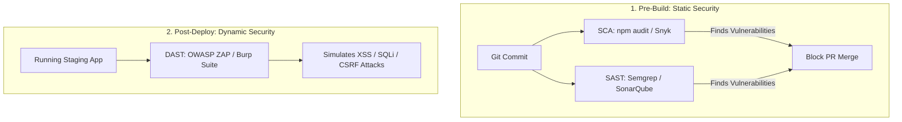

# Security & Vulnerability Testing Architecture

> **Scope:** Static code analysis (SAST), dynamic vulnerability scanning (DAST), software composition analysis (SCA), CSP validation, and security header verification.

---

## Table of Contents

- [Security \& Vulnerability Testing Architecture](#security--vulnerability-testing-architecture)
  - [Table of Contents](#table-of-contents)
  - [1. SAST vs. DAST vs. SCA Pipelines](#1-sast-vs-dast-vs-sca-pipelines)
  - [2. Automated Security Headers \& CSP Assertions](#2-automated-security-headers--csp-assertions)
  - [3. Automated Dependency Audits (SCA)](#3-automated-dependency-audits-sca)
  - [4. Dynamic API Scanning with OWASP ZAP](#4-dynamic-api-scanning-with-owasp-zap)
  - [5. When to Use vs. When NOT to Use](#5-when-to-use-vs-when-not-to-use)

---

## 1. SAST vs. DAST vs. SCA Pipelines



---

## 2. Automated Security Headers & CSP Assertions

```typescript
// e2e/security-headers.spec.ts
import { test, expect } from '@playwright/test';

test('production responses include strict security headers', async ({ request }) => {
  const response = await request.get('https://example.com');
  const headers = response.headers();

  expect(headers['strict-transport-security']).toContain('max-age=31536000; includeSubDomains; preload');
  expect(headers['x-frame-options']).toBe('DENY');
  expect(headers['x-content-type-options']).toBe('nosniff');
  expect(headers['content-security-policy']).toContain("default-src 'self'");
});
```

---

## 3. Automated Dependency Audits (SCA)

Integrate automated lockfile auditing into your CI pipeline to block known Common Vulnerabilities and Exposures (CVEs):

```bash
# Package manager security gate
npm audit --audit-level=high
```

---

## 4. Dynamic API Scanning with OWASP ZAP

Run containerized OWASP ZAP baseline scans against staging environments:

```bash
docker run -t ghcr.io/zaproxy/zaproxy:stable zap-baseline.py \
  -t https://staging.example.com -g gen.conf -r zap-report.html
```

---

## 5. When to Use vs. When NOT to Use

| When to Use Security Testing                                    | When NOT to Use Security Testing           |
| :-------------------------------------------------------------- | :----------------------------------------- |
| ✅ Every PR build (SAST + Dependency SCA).                      | ❌ Pure frontend CSS styling verification. |
| ✅ Pre-release staging cutoffs (DAST + Pen-testing).            | ❌ Mocked in-memory unit tests.            |
| ✅ User authentication, payment, and sensitive PII input flows. | ❌ Static documentation blogs.             |
