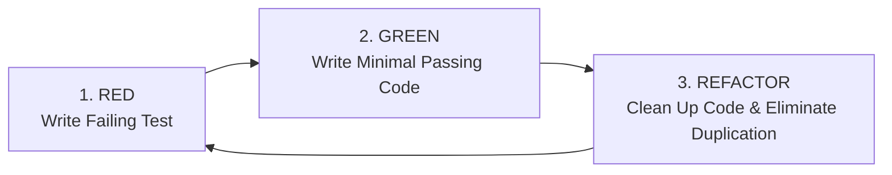

# Test-Driven Development (TDD) & Behavior-Driven Development (BDD)

> **Scope:** Exploring software development methodologies where automated specifications drive architecture, interface design, and implementation code.

---

## Table of Contents

- [Test-Driven Development (TDD) \& Behavior-Driven Development (BDD)](#test-driven-development-tdd--behavior-driven-development-bdd)
  - [Table of Contents](#table-of-contents)
  - [1. Test-Driven Development (TDD) Fundamentals](#1-test-driven-development-tdd-fundamentals)
    - [The Red-Green-Refactor Cycle](#the-red-green-refactor-cycle)
    - [Chicago (Classicist) vs. London (Mockist) Schools](#chicago-classicist-vs-london-mockist-schools)
  - [2. Complete TDD Walkthrough: Asynchronous Task Queue](#2-complete-tdd-walkthrough-asynchronous-task-queue)
    - [Step 1: RED (Concurrency Test)](#step-1-red-concurrency-test)
    - [Step 2: GREEN (Minimal Implementation)](#step-2-green-minimal-implementation)
    - [Step 3: REFACTOR \& Add Retries (Red $\\to$ Green)](#step-3-refactor--add-retries-red-to-green)
  - [3. Behavior-Driven Development (BDD) \& ATDD](#3-behavior-driven-development-bdd--atdd)
    - [Given-When-Then Specification Language](#given-when-then-specification-language)
    - [Programmatic BDD in Modern TypeScript](#programmatic-bdd-in-modern-typescript)
    - [Why BDD Specifications Use the `*.spec.ts` Suffix](#why-bdd-specifications-use-the-spects-suffix)
  - [4. When to Use TDD vs. When NOT to Use TDD](#4-when-to-use-tdd-vs-when-not-to-use-tdd)

---

## 1. Test-Driven Development (TDD) Fundamentals

### The Red-Green-Refactor Cycle



1. **RED:** Write an automated test for the smallest unit of required functionality. Run the test and verify that it **fails for the expected reason**.
2. **GREEN:** Write the **simplest, minimal code** to make the test pass (even hardcoding values if necessary).
3. **REFACTOR:** Improve code structure, remove duplication, optimize algorithms, and improve naming while keeping the test suite continuously green.

---

### Chicago (Classicist) vs. London (Mockist) Schools

```text
+-----------------------+----------------------------------+----------------------------------+
| Attribute             | Chicago School (Classicist/State)| London School (Mockist/Behavior) |
+-----------------------+----------------------------------+----------------------------------+
| Direction             | Inside-Out (Leaves -> Roots)     | Outside-In (Top -> Collaborators)|
| Isolation             | Real collaborators, test state   | Mock all collaborators/contracts |
| Primary Verification  | State / Output verification      | Interaction / Method call spies  |
| Refactoring Safety    | High (Refactoring doesn't break) | Low (Refactoring breaks spies)   |
| Design Feedback       | Algorithmic correctness          | Object interface & relationships |
+-----------------------+----------------------------------+----------------------------------+
```

---

## 2. Complete TDD Walkthrough: Asynchronous Task Queue

Let's build an asynchronous `TaskQueue` with a concurrency limit $K$ and automatic retry logic using strict TDD.

### Step 1: RED (Concurrency Test)

```typescript
// taskQueue.test.ts
import { describe, it, expect } from 'vitest';
import { TaskQueue } from './taskQueue';

describe('TaskQueue', () => {
  it('executes tasks up to concurrency limit simultaneously', async () => {
    const queue = new TaskQueue({ concurrency: 2 });
    let active = 0;
    let maxActive = 0;

    const task = (ms: number) => () =>
      new Promise<void>((resolve) => {
        active++;
        maxActive = Math.max(maxActive, active);
        setTimeout(() => {
          active--;
          resolve();
        }, ms);
      });

    await Promise.all([queue.add(task(40)), queue.add(task(40)), queue.add(task(40))]);

    // Fails initially because TaskQueue is not yet implemented!
    expect(maxActive).toBe(2);
  });
});
```

---

### Step 2: GREEN (Minimal Implementation)

```typescript
// taskQueue.ts
export class TaskQueue {
  private concurrency: number;
  private running = 0;
  private queue: (() => Promise<void>)[] = [];

  constructor({ concurrency = 2 }: { concurrency?: number } = {}) {
    this.concurrency = concurrency;
  }

  add<T>(task: () => Promise<T>): Promise<T> {
    return new Promise<T>((resolve, reject) => {
      const run = async () => {
        this.running++;
        try {
          resolve(await task());
        } catch (err) {
          reject(err);
        } finally {
          this.running--;
          this.next();
        }
      };

      if (this.running < this.concurrency) {
        run();
      } else {
        this.queue.push(run);
      }
    });
  }

  private next() {
    if (this.queue.length > 0 && this.running < this.concurrency) {
      const nextTask = this.queue.shift();
      nextTask?.();
    }
  }
}
```

---

### Step 3: REFACTOR & Add Retries (Red $\to$ Green)

```typescript
// taskQueue.test.ts (Adding second failing test)
it('retries failing tasks up to retry limit', async () => {
  const queue = new TaskQueue({ concurrency: 1, retries: 2 });
  let attempts = 0;

  const flakyTask = vi.fn().mockImplementation(() => {
    attempts++;
    if (attempts < 3) return Promise.reject(new Error('Flaky'));
    return Promise.resolve('SUCCESS');
  });

  const res = await queue.add(flakyTask);
  expect(res).toBe('SUCCESS');
  expect(flakyTask).toHaveBeenCalledTimes(3);
});
```

```typescript
// taskQueue.ts (Refactored with recursive retry logic)
export class TaskQueue {
  private concurrency: number;
  private retries: number;
  private running = 0;
  private queue: (() => Promise<void>)[] = [];

  constructor({ concurrency = 2, retries = 0 } = {}) {
    this.concurrency = concurrency;
    this.retries = retries;
  }

  add<T>(task: () => Promise<T>): Promise<T> {
    return new Promise<T>((resolve, reject) => {
      const runWithRetry = async (attempt = 0) => {
        try {
          resolve(await task());
        } catch (err) {
          if (attempt < this.retries) {
            await runWithRetry(attempt + 1);
          } else {
            reject(err);
          }
        }
      };

      const execute = async () => {
        this.running++;
        try {
          await runWithRetry();
        } finally {
          this.running--;
          this.next();
        }
      };

      if (this.running < this.concurrency) execute();
      else this.queue.push(execute);
    });
  }

  private next() {
    if (this.queue.length > 0 && this.running < this.concurrency) {
      this.queue.shift()?.();
    }
  }
}
```

---

## 3. Behavior-Driven Development (BDD) & ATDD

### Given-When-Then Specification Language

BDD describes user value in domain terms:

```gherkin
Feature: Coupon Discount Application

  Scenario: User applies valid $20 promotional voucher
    Given an active cart with a subtotal of $100.00
    When the user submits coupon code "SAVE20"
    Then the discount line displays "-$20.00"
    And the revised total is "$80.00"
```

---

### Programmatic BDD in Modern TypeScript

```typescript
describe('Feature: Coupon Discount Application', () => {
  it('Scenario: User applies valid $20 promotional voucher', async () => {
    const user = userEvent.setup();
    // Given
    renderWithProviders(<CheckoutCart subtotal={100.0} />);

    // When
    await user.type(screen.getByRole('textbox', { name: /coupon/i }), 'SAVE20');
    await user.click(screen.getByRole('button', { name: /apply/i }));

    // Then
    expect(await screen.findByText(/discount: -\$20\.00/i)).toBeInTheDocument();
    expect(screen.getByText(/total: \$80\.00/i)).toBeInTheDocument();
  });
});
```

---

### Why BDD Specifications Use the `*.spec.ts` Suffix

- In BDD and Acceptance Testing (ATDD), tests act as executable **Software Specifications**.
- By convention, files specifying external behaviors and user journeys are named `*.spec.ts` (e.g. `checkout.spec.ts`), whereas isolated unit tests testing internal methods are named `*.test.ts` (e.g. `currency.test.ts`).
- Both are automatically detected by Jest and Vitest via `testMatch: ['**/?(*.)+(spec|test).[jt]s?(x)']`.

---

## 4. When to Use TDD vs. When NOT to Use TDD

| When to Use TDD                                                        | When NOT to Use TDD                                    |
| :--------------------------------------------------------------------- | :----------------------------------------------------- |
| ✅ Complex algorithmic code (parsers, state machines, queues, caches). | ❌ Rapid UI visual design exploration and prototyping. |
| ✅ Clear input/output domain business rules (tax, pricing formulas).   | ❌ Proof-of-concept (POC) throwaway spikes.            |
| ✅ Bug fixes (Write failing reproduction test first $\to$ fix).        | ❌ Unstable 3rd-party vendor SDK integrations.         |
