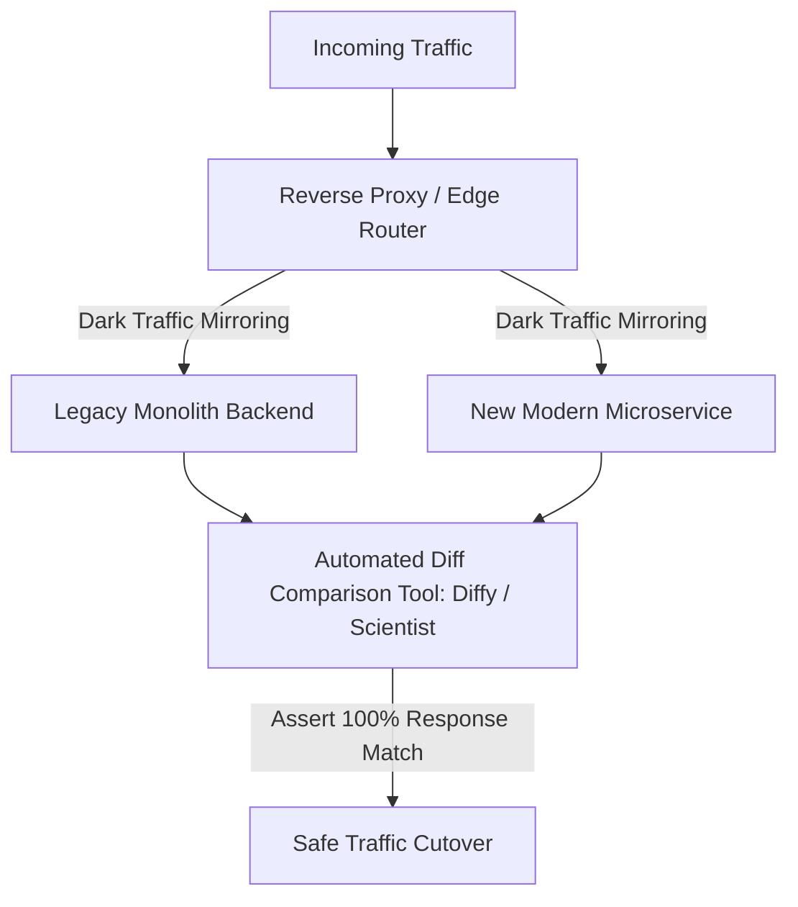
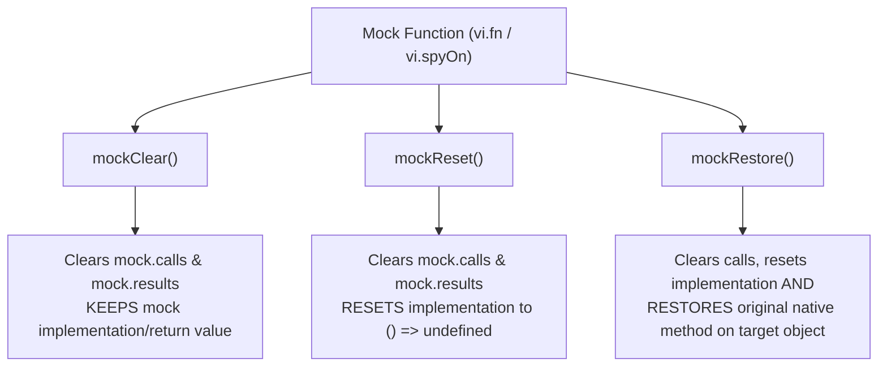

# Testing & Quality Engineering Interview Master Bank

A comprehensive bank of 25+ Senior and Staff-level System Design and Frontend Testing interview questions, live coding scenarios, TDD step-by-step walkthroughs, A/B testing implementations, and architectural trade-off grills.

---

## Table of Contents

- [Testing \& Quality Engineering Interview Master Bank](#testing--quality-engineering-interview-master-bank)
  - [Table of Contents](#table-of-contents)
  - [Section 1: Live Coding \& Hands-On Testing Scenarios](#section-1-live-coding--hands-on-testing-scenarios)
    - [Q1: Live TDD Walkthrough — Async Task Queue with Concurrency Limit](#q1-live-tdd-walkthrough--async-task-queue-with-concurrency-limit)
      - [Step 1: RED (Write First Failing Test for Concurrency)](#step-1-red-write-first-failing-test-for-concurrency)
      - [Step 2: GREEN (Write Minimal Code to Pass)](#step-2-green-write-minimal-code-to-pass)
      - [Step 3: RED $\\to$ GREEN for Retries with Exponential Backoff](#step-3-red-to-green-for-retries-with-exponential-backoff)
    - [Q2: How to Test a Given Utility — `debounce` and `throttle`](#q2-how-to-test-a-given-utility--debounce-and-throttle)
    - [Q3: How to Build \& Test an A/B Testing \& Feature Flag Engine](#q3-how-to-build--test-an-ab-testing--feature-flag-engine)
    - [Q4: Write Code for Given Test Cases — `useFetchWithRetry` Hook](#q4-write-code-for-given-test-cases--usefetchwithretry-hook)
    - [Q5: E2E Test Case Scenario — Multi-Step Checkout Flow (Playwright POM)](#q5-e2e-test-case-scenario--multi-step-checkout-flow-playwright-pom)
  - [Section 2: Senior \& Staff Architectural Grill Questions](#section-2-senior--staff-architectural-grill-questions)
    - [Q6: How do you diagnose, isolate, and eradicate flaky tests in a high-velocity CI pipeline?](#q6-how-do-you-diagnose-isolate-and-eradicate-flaky-tests-in-a-high-velocity-ci-pipeline)
      - [The Staff Answer](#the-staff-answer)
    - [Q7: Why is testing implementation details harmful, and what are the exact refactoring patterns?](#q7-why-is-testing-implementation-details-harmful-and-what-are-the-exact-refactoring-patterns)
      - [The Staff Answer](#the-staff-answer-1)
    - [Q8: How do you test real-time WebSockets and Server-Sent Events (SSE) in frontend applications?](#q8-how-do-you-test-real-time-websockets-and-server-sent-events-sse-in-frontend-applications)
      - [The Staff Answer](#the-staff-answer-2)
    - [Q9: How do you test React 19 Actions, optimistic updates, and Transitions?](#q9-how-do-you-test-react-19-actions-optimistic-updates-and-transitions)
      - [The Staff Answer](#the-staff-answer-3)
    - [Q10: Mocks vs. Stubs vs. Spies vs. Fakes vs. MSW: When should you use which?](#q10-mocks-vs-stubs-vs-spies-vs-fakes-vs-msw-when-should-you-use-which)
    - [Q11: How do you test an infinite scrolling virtualized list with windowing?](#q11-how-do-you-test-an-infinite-scrolling-virtualized-list-with-windowing)
      - [The Staff Answer](#the-staff-answer-4)
    - [Q12: How do you test micro-frontends (MFEs) independently and as an integrated shell?](#q12-how-do-you-test-micro-frontends-mfes-independently-and-as-an-integrated-shell)
      - [The Staff Answer](#the-staff-answer-5)
    - [Q13: How do you test local-first offline state synchronization with IndexedDB and Web Workers?](#q13-how-do-you-test-local-first-offline-state-synchronization-with-indexeddb-and-web-workers)
      - [The Staff Answer](#the-staff-answer-6)
    - [Q14: How do you test Canvas and WebGL graphics rendering?](#q14-how-do-you-test-canvas-and-webgl-graphics-rendering)
      - [The Staff Answer](#the-staff-answer-7)
    - [Q15: How do you test Drag-and-Drop (DND) interfaces?](#q15-how-do-you-test-drag-and-drop-dnd-interfaces)
      - [The Staff Answer](#the-staff-answer-8)
    - [Q16: How do you prevent and detect memory leaks in Single Page Applications through automated testing?](#q16-how-do-you-prevent-and-detect-memory-leaks-in-single-page-applications-through-automated-testing)
      - [The Staff Answer](#the-staff-answer-9)
    - [Q17: What is Mutation Testing, and why is high line coverage misleading without it?](#q17-what-is-mutation-testing-and-why-is-high-line-coverage-misleading-without-it)
      - [The Staff Answer](#the-staff-answer-10)
    - [Q18: How do you structure Consumer-Driven Contract Testing with Pact across frontend and backend teams?](#q18-how-do-you-structure-consumer-driven-contract-testing-with-pact-across-frontend-and-backend-teams)
      - [The Staff Answer](#the-staff-answer-11)
    - [Q19: How do you test accessibility (a11y) for complex interactive ARIA widgets like tree views and roving tabindex?](#q19-how-do-you-test-accessibility-a11y-for-complex-interactive-aria-widgets-like-tree-views-and-roving-tabindex)
      - [The Staff Answer](#the-staff-answer-12)
    - [Q20: How do you test A/B experiment telemetry to ensure exposure events are never over-counted?](#q20-how-do-you-test-ab-experiment-telemetry-to-ensure-exposure-events-are-never-over-counted)
      - [The Staff Answer](#the-staff-answer-13)
    - [Q21: How do you architect a Multi-Region Synthetic Canary test suite for zero-downtime deployments?](#q21-how-do-you-architect-a-multi-region-synthetic-canary-test-suite-for-zero-downtime-deployments)
      - [The Staff Answer](#the-staff-answer-14)
    - [Q22: How do you test Cross-Origin Resource Sharing (CORS) preflight requests and cookie policies?](#q22-how-do-you-test-cross-origin-resource-sharing-cors-preflight-requests-and-cookie-policies)
      - [The Staff Answer](#the-staff-answer-15)
    - [Q23: How do you test CSS container queries and responsive typography breakpoints without real devices?](#q23-how-do-you-test-css-container-queries-and-responsive-typography-breakpoints-without-real-devices)
      - [The Staff Answer](#the-staff-answer-16)
    - [Q24: How do you test Internationalization (i18n) pluralization and right-to-left (RTL) bidirectionality?](#q24-how-do-you-test-internationalization-i18n-pluralization-and-right-to-left-rtl-bidirectionality)
      - [The Staff Answer](#the-staff-answer-17)
    - [Q25: What is the Staff Engineer testing strategy for migrating a legacy monolith to a modern tech stack?](#q25-what-is-the-staff-engineer-testing-strategy-for-migrating-a-legacy-monolith-to-a-modern-tech-stack)
      - [The Staff Answer](#the-staff-answer-18)
    - [Q26: Why should `data-testid` be the absolute last resort, and how do you enforce accessible queries?](#q26-why-should-data-testid-be-the-absolute-last-resort-and-how-do-you-enforce-accessible-queries)
      - [The Staff Answer](#the-staff-answer-19)
    - [Q27: Demystifying `act()`, `waitFor()`, and `findBy*`: When to use, when to avoid, and deadly pitfalls](#q27-demystifying-act-waitfor-and-findby-when-to-use-when-to-avoid-and-deadly-pitfalls)
      - [The Staff Answer](#the-staff-answer-20)
      - [The 3 Deadly Mistakes in Asynchronous Testing:](#the-3-deadly-mistakes-in-asynchronous-testing)
    - [Q28: Mock Cleanup Lifecycle: `mockClear` vs. `mockReset` vs. `mockRestore` in Jest/Vitest](#q28-mock-cleanup-lifecycle-mockclear-vs-mockreset-vs-mockrestore-in-jestvitest)
      - [The Staff Answer](#the-staff-answer-21)
      - [Comparison Matrix:](#comparison-matrix)
      - [Architectural Guideline:](#architectural-guideline)
    - [Q29: How does Jest test discovery work with dunder (`__tests__`) folders, manual `__mocks__`, and `testMatch`?](#q29-how-does-jest-test-discovery-work-with-dunder-__tests__-folders-manual-__mocks__-and-testmatch)
      - [The Staff Answer](#the-staff-answer-22)
    - [Q30: What is the difference between Jest and JSDOM, and what are JSDOM's limitations compared to a real browser?](#q30-what-is-the-difference-between-jest-and-jsdom-and-what-are-jsdoms-limitations-compared-to-a-real-browser)
      - [The Staff Answer](#the-staff-answer-23)
      - [How They Work Together:](#how-they-work-together)
      - [JSDOM Limitations (Why E2E with Playwright is Still Required):](#jsdom-limitations-why-e2e-with-playwright-is-still-required)

---

## Section 1: Live Coding & Hands-On Testing Scenarios

### Q1: Live TDD Walkthrough — Async Task Queue with Concurrency Limit

**Interview Challenge:** Build an asynchronous `TaskQueue` that executes tasks with a maximum concurrency limit $K$ and retries failed tasks up to $N$ times, using strict **Test-Driven Development (Red $\to$ Green $\to$ Refactor)**.

#### Step 1: RED (Write First Failing Test for Concurrency)

```typescript
// taskQueue.test.ts
import { describe, it, expect, vi, beforeEach } from 'vitest';
import { TaskQueue } from './taskQueue';

describe('TaskQueue (TDD)', () => {
  it('executes tasks up to the concurrency limit simultaneously', async () => {
    const queue = new TaskQueue({ concurrency: 2 });
    let activeTasks = 0;
    let maxObservedActive = 0;

    const createTask = (durationMs: number) => () =>
      new Promise<void>((resolve) => {
        activeTasks++;
        maxObservedActive = Math.max(maxObservedActive, activeTasks);
        setTimeout(() => {
          activeTasks--;
          resolve();
        }, durationMs);
      });

    const p1 = queue.add(createTask(50));
    const p2 = queue.add(createTask(50));
    const p3 = queue.add(createTask(50));

    await Promise.all([p1, p2, p3]);

    // Concurrency must never exceed 2
    expect(maxObservedActive).toBe(2);
  });
});
```

#### Step 2: GREEN (Write Minimal Code to Pass)

```typescript
// taskQueue.ts
export interface TaskQueueOptions {
  concurrency: number;
}

export class TaskQueue {
  private concurrency: number;
  private running = 0;
  private queue: (() => Promise<void>)[] = [];

  constructor(options: TaskQueueOptions) {
    this.concurrency = options.concurrency;
  }

  add<T>(task: () => Promise<T>): Promise<T> {
    return new Promise<T>((resolve, reject) => {
      const execute = async () => {
        this.running++;
        try {
          const result = await task();
          resolve(result);
        } catch (err) {
          reject(err);
        } finally {
          this.running--;
          this.next();
        }
      };

      if (this.running < this.concurrency) {
        execute();
      } else {
        this.queue.push(execute);
      }
    });
  }

  private next() {
    if (this.queue.length > 0 && this.running < this.concurrency) {
      const task = this.queue.shift();
      task?.();
    }
  }
}
```

#### Step 3: RED $\to$ GREEN for Retries with Exponential Backoff

```typescript
// taskQueue.test.ts (Adding second test)
it('retries a failing task up to specified retry count', async () => {
  const queue = new TaskQueue({ concurrency: 1, retries: 2 });
  let attempts = 0;

  const failingTask = vi.fn().mockImplementation(() => {
    attempts++;
    if (attempts < 3) {
      return Promise.reject(new Error('Network drop'));
    }
    return Promise.resolve('SUCCESS');
  });

  const result = await queue.add(failingTask);
  expect(result).toBe('SUCCESS');
  expect(failingTask).toHaveBeenCalledTimes(3);
});
```

```typescript
// taskQueue.ts (Refactored to support retries cleanly)
export interface TaskQueueOptions {
  concurrency: number;
  retries?: number;
}

export class TaskQueue {
  private concurrency: number;
  private retries: number;
  private running = 0;
  private queue: (() => Promise<void>)[] = [];

  constructor(options: TaskQueueOptions) {
    this.concurrency = options.concurrency;
    this.retries = options.retries ?? 0;
  }

  add<T>(task: () => Promise<T>): Promise<T> {
    return new Promise<T>((resolve, reject) => {
      const runWithRetry = async (attempt = 0) => {
        try {
          const res = await task();
          resolve(res);
        } catch (error) {
          if (attempt < this.retries) {
            await runWithRetry(attempt + 1);
          } else {
            reject(error);
          }
        }
      };

      const execute = async () => {
        this.running++;
        try {
          await runWithRetry();
        } finally {
          this.running--;
          this.next();
        }
      };

      if (this.running < this.concurrency) {
        execute();
      } else {
        this.queue.push(execute);
      }
    });
  }

  private next() {
    if (this.queue.length > 0 && this.running < this.concurrency) {
      const task = this.queue.shift();
      task?.();
    }
  }
}
```

---

### Q2: How to Test a Given Utility — `debounce` and `throttle`

**Interview Scenario:** "Write an exhaustive unit test suite for a custom `throttle` utility, including leading/trailing edge options and timer fast-forwarding."

```typescript
// utils/throttle.ts
export function throttle<T extends (...args: any[]) => any>(
  fn: T,
  limitMs: number,
  options: { leading?: boolean; trailing?: boolean } = { leading: true, trailing: true },
): (...args: Parameters<T>) => void {
  let timerId: ReturnType<typeof setTimeout> | null = null;
  let lastArgs: Parameters<T> | null = null;
  let lastExecTime = 0;

  return function (...args: Parameters<T>) {
    const now = Date.now();
    const leading = options.leading ?? true;
    const trailing = options.trailing ?? true;

    if (!lastExecTime && !leading) {
      lastExecTime = now;
    }

    const remaining = limitMs - (now - lastExecTime);

    if (remaining <= 0 || remaining > limitMs) {
      if (timerId) {
        clearTimeout(timerId);
        timerId = null;
      }
      lastExecTime = now;
      fn(...args);
    } else if (trailing && !timerId) {
      lastArgs = args;
      timerId = setTimeout(() => {
        lastExecTime = leading ? Date.now() : 0;
        timerId = null;
        if (lastArgs) {
          fn(...lastArgs);
          lastArgs = null;
        }
      }, remaining);
    }
  };
}
```

```typescript
// utils/throttle.test.ts
import { describe, it, expect, vi, beforeEach, afterEach } from 'vitest';
import { throttle } from './throttle';

describe('throttle utility', () => {
  beforeEach(() => {
    vi.useFakeTimers();
  });

  afterEach(() => {
    vi.useRealTimers();
  });

  it('executes immediately on the leading edge', () => {
    const callback = vi.fn();
    const throttled = throttle(callback, 100);

    throttled('first');
    expect(callback).toHaveBeenCalledTimes(1);
    expect(callback).toHaveBeenCalledWith('first');
  });

  it('throttles rapid calls and executes the last call at trailing edge', () => {
    const callback = vi.fn();
    const throttled = throttle(callback, 100);

    throttled('call_1'); // 0ms - executes
    throttled('call_2'); // 20ms - throttled
    throttled('call_3'); // 50ms - throttled

    expect(callback).toHaveBeenCalledTimes(1);

    // Advance to 99ms (before window expires)
    vi.advanceTimersByTime(99);
    expect(callback).toHaveBeenCalledTimes(1);

    // Advance to 100ms
    vi.advanceTimersByTime(1);
    expect(callback).toHaveBeenCalledTimes(2);
    expect(callback).toHaveBeenLastCalledWith('call_3');
  });

  it('respects { leading: false } option', () => {
    const callback = vi.fn();
    const throttled = throttle(callback, 100, { leading: false, trailing: true });

    throttled('initial');
    expect(callback).not.toHaveBeenCalled();

    vi.advanceTimersByTime(100);
    expect(callback).toHaveBeenCalledTimes(1);
    expect(callback).toHaveBeenCalledWith('initial');
  });
});
```

---

### Q3: How to Build & Test an A/B Testing & Feature Flag Engine

**Interview Scenario:** "Implement a deterministic A/B testing client with sticky user hashing, URL query parameter overrides for QA, fallback safety, and write its complete unit test suite."

```typescript
// ab/experimentEngine.ts
export interface ExperimentConfig {
  id: string;
  salt: string;
  variants: { name: string; weight: number }[]; // weights sum to 100
}

export class ExperimentEngine {
  private urlParams: URLSearchParams;

  constructor(searchString = window?.location?.search ?? '') {
    this.urlParams = new URLSearchParams(searchString);
  }

  // DJB2 Hash algorithm for deterministic string hashing
  private hashString(str: string): number {
    let hash = 5381;
    for (let i = 0; i < str.length; i++) {
      hash = (hash * 33) ^ str.charCodeAt(i);
    }
    return Math.abs(hash >>> 0);
  }

  getVariant(userId: string, experiment: ExperimentConfig): string {
    if (!userId || !experiment?.variants?.length) {
      return experiment?.variants?.[0]?.name ?? 'control';
    }

    // 1. QA / Developer override via URL parameter: ?ab_checkout_v2=variant_b
    const overrideParam = `ab_${experiment.id}`;
    if (this.urlParams.has(overrideParam)) {
      const forcedVariant = this.urlParams.get(overrideParam)!;
      if (experiment.variants.some((v) => v.name === forcedVariant)) {
        return forcedVariant;
      }
    }

    // 2. Deterministic hashing: hash(userId + salt) % 100
    const hash = this.hashString(`${userId}:${experiment.salt}`);
    const bucket = hash % 100;

    let cumulative = 0;
    for (const v of experiment.variants) {
      cumulative += v.weight;
      if (bucket < cumulative) {
        return v.name;
      }
    }

    return experiment.variants[0].name;
  }
}
```

```typescript
// ab/experimentEngine.test.ts
import { describe, it, expect } from 'vitest';
import { ExperimentEngine, ExperimentConfig } from './experimentEngine';

describe('ExperimentEngine', () => {
  const sampleExp: ExperimentConfig = {
    id: 'hero_cta',
    salt: 'salt_v1',
    variants: [
      { name: 'control', weight: 50 },
      { name: 'green_button', weight: 50 },
    ],
  };

  it('assigns the exact same variant consistently to the same user (sticky)', () => {
    const engine = new ExperimentEngine();
    const variant1 = engine.getVariant('usr_101', sampleExp);
    const variant2 = engine.getVariant('usr_101', sampleExp);

    expect(variant1).toBe(variant2);
  });

  it('distributes users across variants according to configured weights', () => {
    const engine = new ExperimentEngine();
    const counts: Record<string, number> = { control: 0, green_button: 0 };

    for (let i = 0; i < 1000; i++) {
      const v = engine.getVariant(`user_${i}`, sampleExp);
      counts[v]++;
    }

    // Expect ~50% distribution (between 450 and 550 for 1000 users)
    expect(counts.control).toBeGreaterThan(450);
    expect(counts.control).toBeLessThan(550);
  });

  it('respects URL query parameter override for QA testing', () => {
    const engine = new ExperimentEngine('?ab_hero_cta=green_button');
    // Even if hashing would normally assign control, override forces green_button
    const variant = engine.getVariant('usr_101', sampleExp);
    expect(variant).toBe('green_button');
  });

  it('falls back safely to default control on missing user ID', () => {
    const engine = new ExperimentEngine();
    expect(engine.getVariant('', sampleExp)).toBe('control');
  });
});
```

---

### Q4: Write Code for Given Test Cases — `useFetchWithRetry` Hook

**Interview Scenario:** "Here is a test suite for a custom React data fetching hook with retry backoff and abort controller cancellation on unmount. Write the implementation code that satisfies all tests."

```typescript
// hooks/useFetchWithRetry.ts
import { useState, useEffect } from 'react';

export interface FetchState<T> {
  data: T | null;
  loading: boolean;
  error: Error | null;
}

export function useFetchWithRetry<T>(url: string, retries = 2): FetchState<T> {
  const [state, setState] = useState<FetchState<T>>({
    data: null,
    loading: true,
    error: null,
  });

  useEffect(() => {
    const controller = new AbortController();
    let isCancelled = false;

    const executeFetch = async (attempt = 0) => {
      try {
        setState((prev) => ({ ...prev, loading: true, error: null }));
        const res = await fetch(url, { signal: controller.signal });
        if (!res.ok) throw new Error(`HTTP Error ${res.status}`);
        const data = await res.json();
        if (!isCancelled) {
          setState({ data, loading: false, error: null });
        }
      } catch (err: any) {
        if (err.name === 'AbortError' || isCancelled) return;
        if (attempt < retries) {
          executeFetch(attempt + 1);
        } else {
          setState({ data: null, loading: false, error: err });
        }
      }
    };

    executeFetch();

    return () => {
      isCancelled = true;
      controller.abort();
    };
  }, [url, retries]);

  return state;
}
```

---

### Q5: E2E Test Case Scenario — Multi-Step Checkout Flow (Playwright POM)

```typescript
// e2e/pages/CheckoutPage.ts
import { type Page, type Locator, expect } from '@playwright/test';

export class CheckoutPage {
  readonly page: Page;
  readonly addressInput: Locator;
  readonly couponInput: Locator;
  readonly applyCouponBtn: Locator;
  readonly orderTotal: Locator;
  readonly placeOrderBtn: Locator;
  readonly confirmationModal: Locator;

  constructor(page: Page) {
    this.page = page;
    this.addressInput = page.getByRole('textbox', { name: /shipping address/i });
    this.couponInput = page.getByRole('textbox', { name: /coupon/i });
    this.applyCouponBtn = page.getByRole('button', { name: /apply/i });
    this.orderTotal = page.getByTestId('cart-order-total');
    this.placeOrderBtn = page.getByRole('button', { name: /place order/i });
    this.confirmationModal = page.getByRole('dialog', { name: /order confirmed/i });
  }

  async enterShippingAddress(address: string) {
    await this.addressInput.fill(address);
  }

  async applyDiscountCoupon(code: string) {
    await this.couponInput.fill(code);
    await this.applyCouponBtn.click();
    // Wait for network response and total recalculation
    await expect(this.page.getByText(/discount applied/i)).toBeVisible();
  }

  async completeOrder() {
    await this.placeOrderBtn.click();
    await expect(this.confirmationModal).toBeVisible();
  }
}
```

```typescript
// e2e/checkout.spec.ts
import { test, expect } from '@playwright/test';
import { CheckoutPage } from './pages/CheckoutPage';

test.describe('E-Commerce Checkout Flow', () => {
  test('user enters address, applies promo code, and completes purchase', async ({ page }) => {
    // Intercept payment gateway API call with realistic mock
    await page.route('**/api/v1/payments/charge', async (route) => {
      await route.fulfill({
        status: 200,
        contentType: 'application/json',
        body: JSON.stringify({ transactionId: 'txn_mock_9921', status: 'SUCCESS' }),
      });
    });

    await page.goto('/cart/checkout');
    const checkout = new CheckoutPage(page);

    await checkout.enterShippingAddress('742 Evergreen Terrace, Springfield');
    await checkout.applyDiscountCoupon('SAVE20');

    await expect(checkout.orderTotal).toHaveText('$80.00');
    await checkout.completeOrder();

    await expect(page).toHaveURL(/\/orders\/success/);
  });
});
```

---

## Section 2: Senior & Staff Architectural Grill Questions

### Q6: How do you diagnose, isolate, and eradicate flaky tests in a high-velocity CI pipeline?

#### The Staff Answer

1. **Categorize Root Causes:**
   - **Timing/Race Conditions (70%):** Hardcoded `sleep()`, relying on `setTimeout` instead of event-driven auto-retrying assertions.
   - **Shared State / Pollution (15%):** Non-isolated DB seeds, shared Redis caches, mutated singletons, uncleaned DOM cookies.
   - **Environment Variance (10%):** CI CPU throttling, network latency drops, cross-platform font rendering.
   - **Timezone/Locale Leaking (5%):** `new Date().getHours()` evaluated on UTC CI vs local PDT machines.
2. **Automated Detection Strategy:**
   - Run tests in a stress-loop (`--repeat-each=50 --workers=4`).
   - Enable Playwright **Trace Viewer** on first failure to capture DOM snapshot, network HAR, and console logs.
3. **Quarantine Policy:**
   - Automatically move flaky tests to a `quarantine` suite via CI bot to unblock main branch merges. An engineer is assigned a P1 bug to repair or delete the test within 48 hours.

---

### Q7: Why is testing implementation details harmful, and what are the exact refactoring patterns?

#### The Staff Answer

Testing implementation details couples tests to **how** code is written rather than **what** code delivers.

- **Consequences:**
  - Refactoring valid code causes false-positive test failures.
  - Introducing bugs that preserve method signatures causes false-negative test passes.
- **Refactoring Pattern:**
  - ❌ `wrapper.find('AccordionItem').props().isOpen`
  - ❌ `expect(spySetState).toHaveBeenCalledWith({ step: 2 })`
  - ✅ `expect(screen.getByRole('region', { name: /billing/i })).toBeVisible()`

---

### Q8: How do you test real-time WebSockets and Server-Sent Events (SSE) in frontend applications?

#### The Staff Answer

Use **Mock Service Worker (MSW 2.0)** or a lightweight local in-memory WebSocket server:

```typescript
import { ws } from 'msw';
import { setupServer } from 'msw/node';

const chat = ws.link('wss://chat.example.com/ws');

export const server = setupServer(
  chat.addEventListener('connection', ({ client }) => {
    client.send(JSON.stringify({ type: 'WELCOME', room: 'general' }));

    client.addEventListener('message', (event) => {
      const data = JSON.parse(event.data);
      if (data.type === 'PING') {
        client.send(JSON.stringify({ type: 'PONG' }));
      }
    });
  }),
);
```

---

### Q9: How do you test React 19 Actions, optimistic updates, and Transitions?

#### The Staff Answer

React 19 Actions execute asynchronously inside `startTransition` or `useOptimistic`:

1. Render component with MSW delayed response (`await delay(200)`).
2. Trigger the form submission using `userEvent.click()`.
3. Assert that the **optimistic UI** renders immediately before the network promise resolves.
4. Fast-forward or await the network completion and assert the final confirmed state.
5. In a second test, simulate network failure and verify the optimistic UI cleanly **rolls back** to the original state.

---

### Q10: Mocks vs. Stubs vs. Spies vs. Fakes vs. MSW: When should you use which?

| Test Double | Definition                                                             | Ideal Use Case                                                  |
| :---------- | :--------------------------------------------------------------------- | :-------------------------------------------------------------- |
| **Dummy**   | Passed around to satisfy parameter signatures; never used.             | Filling unused constructor arguments.                           |
| **Stub**    | Returns canned hardcoded responses without logic.                      | Mocking a read-only geolocation coordinate lookup.              |
| **Spy**     | Wraps a real function to record arguments, call counts, and returns.   | Verifying an analytics tracking beacon was sent.                |
| **Mock**    | Pre-programmed with expectations of specific calls; fails if violated. | Strict interaction protocol verification.                       |
| **Fake**    | Working in-memory implementation (e.g. SQLite for Postgres).           | Fast local database testing.                                    |
| **MSW**     | Network-level interception via Service Worker / Node interceptor.      | **The golden standard** for all frontend API integration tests. |

---

### Q11: How do you test an infinite scrolling virtualized list with windowing?

#### The Staff Answer

Virtualization libraries (`react-window`, `react-virtualized`) only render visible DOM nodes inside the viewport.

1. In unit tests (JSDOM), DOM elements have `0` width/height by default. You must mock `getBoundingClientRect()` and `IntersectionObserver`:
   ```typescript
   window.IntersectionObserver = vi.fn().mockImplementation((callback) => ({
     observe: vi.fn((target) => {
       // Trigger intersection callback on demand
       callback([{ isIntersecting: true, target }]);
     }),
     unobserve: vi.fn(),
     disconnect: vi.fn(),
   }));
   ```
2. In E2E tests (Playwright), scroll the viewport using `page.mouse.wheel(0, 1000)` and assert that previously rendered items are recycled/unmounted from the DOM to maintain low DOM node counts.

---

### Q12: How do you test micro-frontends (MFEs) independently and as an integrated shell?

#### The Staff Answer

1. **Isolated Contract Testing:** Each child MFE tests its exported Web Component / React component against a published TypeScript schema.
2. **Mock Shell:** Run child MFE tests wrapped in a lightweight mock Host Container simulating the global event bus (`CustomEvent` / window postMessage).
3. **Synthetic Shell E2E:** A nightly Playwright pipeline pulls the latest deployed versions of all child MFEs into the production container shell to verify cross-app navigation, shared auth cookies, and global CSS isolation.

---

### Q13: How do you test local-first offline state synchronization with IndexedDB and Web Workers?

#### The Staff Answer

1. Use `fake-indexeddb` in Vitest for fast, pure in-memory IndexedDB operations.
2. In Playwright E2E, toggle offline network conditions:

   ```typescript
   await page.context().setOffline(true);
   // Perform offline mutations (saved to local IndexedDB queue)
   await page.getByRole('button', { name: /save draft/i }).click();
   await expect(page.getByText(/saved offline/i)).toBeVisible();

   // Reconnect to network
   await page.context().setOffline(false);
   // Assert background sync drained queue to backend
   await expect(page.getByText(/synced with cloud/i)).toBeVisible();
   ```

---

### Q14: How do you test Canvas and WebGL graphics rendering?

#### The Staff Answer

1. **Do not compare raw HTML:** `<canvas>` elements are blank boxes in the DOM tree.
2. **Unit Level:** Use `jest-canvas-mock` to assert that 2D context methods (`fillRect`, `arc`, `lineTo`) were called with correct mathematical coordinates.
3. **E2E / Visual Level:** Capture canvas pixel buffers via `canvas.toDataURL('image/png')` and compare against reference baseline images using Playwright's `expect(page.locator('#webgl-canvas')).toHaveScreenshot()`.

---

### Q15: How do you test Drag-and-Drop (DND) interfaces?

#### The Staff Answer

Synthetic `fireEvent.drop()` often fails with HTML5 Drag & Drop or pointer-event libraries (`dnd-kit`, `@hello-pangea/dnd`).

- **In Playwright:**
  ```typescript
  await page.locator('#card-item-1').dragTo(page.locator('#column-done'));
  ```
- **In React Testing Library:** Dispatch consecutive pointer events:
  ```typescript
  const card = screen.getByRole('button', { name: /task 1/i });
  card.focus();
  await userEvent.keyboard('[Space]'); // Pick up in accessible DND
  await userEvent.keyboard('[ArrowRight]'); // Move to next column
  await userEvent.keyboard('[Space]'); // Drop
  ```

---

### Q16: How do you prevent and detect memory leaks in Single Page Applications through automated testing?

#### The Staff Answer

Use Playwright connected to the Chrome DevTools Protocol (`CDPSession`):

1. Navigate to target page $\to$ Trigger GC via `HeapProfiler.collectGarbage`.
2. Take baseline heap snapshot node count.
3. Perform user flow 20 times (e.g. open modal, close modal).
4. Trigger GC again $\to$ Read new node count.
5. If DOM node count or JS listener count grows monotonically with each iteration, fail the test and dump heap retainer paths.

---

### Q17: What is Mutation Testing, and why is high line coverage misleading without it?

#### The Staff Answer

- **The Problem:** A test can execute every line of a function without asserting anything (`expect(true).toBe(true)` gives 100% line coverage!).
- **Mutation Testing Solution (Stryker):** Automatically mutates source code (e.g. replaces `+` with `-`, flips `if (a > b)` to `if (a >= b)`, deletes function bodies).
- If your tests pass despite the mutant, the mutant **survived** $\to$ revealing missing assertions and false test confidence.

---

### Q18: How do you structure Consumer-Driven Contract Testing with Pact across frontend and backend teams?

#### The Staff Answer

1. **Frontend (Consumer):** Defines an expectation contract: "When I `GET /api/v1/user/10`, I expect `{ id: string, email: string }`".
2. Frontend unit tests run against local Pact Mock Server and generate a JSON pact file.
3. Pact file is published to central **Pact Broker**.
4. **Backend CI (Provider):** Downloads pact file, replays the exact HTTP requests against the real Spring/Node backend, and validates responses.
5. If backend changes a field name, backend CI build fails before breaking the frontend in production.

---

### Q19: How do you test accessibility (a11y) for complex interactive ARIA widgets like tree views and roving tabindex?

#### The Staff Answer

1. **Static / Automated:** `@axe-core/playwright` verifies `role="tree"`, `role="treeitem"`, `aria-expanded`, and `aria-selected` attributes.
2. **Keyboard Traversal Test:**
   ```typescript
   await page.keyboard.press('Tab'); // Focuses first tree item
   await expect(firstItem).toBeFocused();
   await page.keyboard.press('ArrowDown'); // Moves focus to next item
   await expect(secondItem).toBeFocused();
   await page.keyboard.press('ArrowRight'); // Expands folder
   await expect(secondItem).toHaveAttribute('aria-expanded', 'true');
   ```

---

### Q20: How do you test A/B experiment telemetry to ensure exposure events are never over-counted?

#### The Staff Answer

An exposure event must be tracked **only when the user actually sees or interacts with the variant**, not when the variant string is computed in memory.

- In tests, spy on `navigator.sendBeacon` or analytics client:

  ```typescript
  it('does not fire exposure beacon until element enters viewport', () => {
    const analyticsSpy = vi.spyOn(analytics, 'track');
    render(<ExperimentHero experimentId="exp_banner" />);

    expect(analyticsSpy).not.toHaveBeenCalled();

    // Trigger intersection
    mockIntersectionObserver.enterViewport();
    expect(analyticsSpy).toHaveBeenCalledTimes(1);
    expect(analyticsSpy).toHaveBeenCalledWith('EXPERIMENT_EXPOSURE', {
      experimentId: 'exp_banner',
      variant: 'variant_b',
    });
  });
  ```

---

### Q21: How do you architect a Multi-Region Synthetic Canary test suite for zero-downtime deployments?

#### The Staff Answer

1. Run Playwright headless runners in AWS Lambda / Cloudflare Workers across 5 global regions (US-East, US-West, EU-Central, AP-South, SA-East).
2. Execute critical user journeys (Login $\to$ Search $\to$ Add to Cart) every 60 seconds against production endpoints.
3. If $> 2$ regions fail consecutively, trigger automated Canary rollback in Kubernetes/Spinnaker before real users report outages.

---

### Q22: How do you test Cross-Origin Resource Sharing (CORS) preflight requests and cookie policies?

#### The Staff Answer

1. Use Playwright `APIRequestContext` or Supertest to send `OPTIONS` requests:
   ```typescript
   const res = await request.fetch('https://api.example.com/data', {
     method: 'OPTIONS',
     headers: {
       Origin: 'https://app.example.com',
       'Access-Control-Request-Method': 'POST',
       'Access-Control-Request-Headers': 'Content-Type, Authorization',
     },
   });
   expect(res.headers()['access-control-allow-origin']).toBe('https://app.example.com');
   expect(res.headers()['access-control-allow-credentials']).toBe('true');
   ```

---

### Q23: How do you test CSS container queries and responsive typography breakpoints without real devices?

#### The Staff Answer

Playwright allows dynamic viewport resizing and CSS container resizing during test execution:

```typescript
test('card transitions from vertical stacked to horizontal grid on container expansion', async ({ page }) => {
  await page.setViewportSize({ width: 375, height: 667 }); // Mobile
  const card = page.locator('.product-card');
  await expect(card).toHaveCSS('flex-direction', 'column');

  await page.setViewportSize({ width: 1200, height: 800 }); // Desktop
  await expect(card).toHaveCSS('flex-direction', 'row');
});
```

---

### Q24: How do you test Internationalization (i18n) pluralization and right-to-left (RTL) bidirectionality?

#### The Staff Answer

1. Test pluralization category rules across Slavic/Arabic languages with complex plural rules ($0$, $1$, $2$, $few$, $many$, $other$):
   ```typescript
   it('handles Slavic plural forms (1, 2-4, 5+)', () => {
     expect(t('items_count', { count: 1, lng: 'ru' })).toBe('1 товар');
     expect(t('items_count', { count: 3, lng: 'ru' })).toBe('3 товара');
     expect(t('items_count', { count: 5, lng: 'ru' })).toBe('5 товаров');
   });
   ```
2. Verify CSS Logical Properties (`margin-inline-start` vs `margin-left`) in RTL rendering.

---

### Q25: What is the Staff Engineer testing strategy for migrating a legacy monolith to a modern tech stack?

#### The Staff Answer

**The Strangler Fig Testing Pattern:**



1. **Characterization Tests:** Capture snapshots of current legacy system behavior (including quirks).
2. **Dark Traffic Mirroring:** Mirror 100% of live production traffic to the new service without sending its response to users. Compare responses side-by-side using Diffy.
3. **Feature Flagged Canary Cutover:** Incrementally route 1%, 10%, 50%, 100% of real users using consistent hashing.

---

### Q26: Why should `data-testid` be the absolute last resort, and how do you enforce accessible queries?

#### The Staff Answer

1. **The Root Philosophy:** Testing with `data-testid` tests an implementation artifact that zero real users or assistive technologies consume.
   - If a button has `data-testid="submit-btn"`, tests pass even if:
     - The button is visually hidden (`opacity: 0` or `display: none` in CSS).
     - The button has missing text content.
     - The button has `tabindex="-1"` and is unreachable by keyboard users.
     - The element is a `<div>` with an `onClick` that lacks keyboard event listeners.
2. **The Accessible Query Ladder:**
   - **Step 1:** `getByRole('button', { name: /save changes/i })` $\to$ Tests native semantics, keyboard focusability, and accessible name.
   - **Step 2:** `getByLabelText(/email address/i)` $\to$ Tests `<label for="...">` programmatic association with form controls.
   - **Step 3:** `getByText(/welcome back/i)` $\to$ Tests actual user-visible copy.
   - **Step 4 (Last Resort):** `getByTestId('...')` $\to$ Only for non-semantic layout canvases, WebGL surfaces, or invisible analytics tracking wrappers.
3. **Automated Enforcement:**
   - Add ESLint rule: `testing-library/prefer-screen-queries` and `testing-library/prefer-presence-queries`.
   - Add custom linting rule restricting `getByTestId` usage unless accompanied by a `// eslint-disable-next-line a11y-canvas-exception` code comment explaining why semantic queries are impossible.

---

### Q27: Demystifying `act()`, `waitFor()`, and `findBy*`: When to use, when to avoid, and deadly pitfalls

#### The Staff Answer

```text
+-----------------------+----------------------------------+----------------------------------+
| Primitive             | What it Does Under the Hood      | When to Use / When to Avoid      |
+-----------------------+----------------------------------+----------------------------------+
| act(fn)               | Flushes React Microtask queue,   | • Use: Hook state in renderHook, |
|                       | pending useEffects & DOM paints. | fakeTimers, window event streams.|
|                       |                                  | • Avoid: Wrapping userEvent (RTL |
|                       |                                  | already wraps userEvent in act). |
+-----------------------+----------------------------------+----------------------------------+
| waitFor(fn)           | Polls assertion every 50ms until | • Use: Awaiting custom DOM state |
|                       | it stops throwing or times out.  | or 3rd party library mutations.  |
|                       |                                  | • AVOID: Side-effects inside fn! |
|                       |                                  | • AVOID: Empty waitFor(() => {}).|
+-----------------------+----------------------------------+----------------------------------+
| findByRole / findBy*  | Syntactic sugar for:             | • Use: The golden standard for   |
|                       | waitFor(() => getByRole(...))    | all asynchronous DOM appearance. |
+-----------------------+----------------------------------+----------------------------------+
```

#### The 3 Deadly Mistakes in Asynchronous Testing:

1. **Placing Side-Effects Inside `waitFor`:**

   ```typescript
   // ❌ CATASTROPHIC BUG: userEvent.click runs multiple times as waitFor polls!
   await waitFor(() => {
     userEvent.click(screen.getByRole('button'));
     expect(screen.getByText('Saved')).toBeInTheDocument();
   });

   // ✅ FIX: Act once outside, await assertion inside
   await user.click(screen.getByRole('button'));
   expect(await screen.findByText('Saved')).toBeInTheDocument();
   ```

2. **Using Empty `waitFor` as an Arbitrary Sleep:**

   ```typescript
   // ❌ BRITTLE HACK
   await waitFor(() => {});

   // ✅ FIX: Explicitly await the actual outcome or token
   await screen.findByRole('status');
   ```

3. **Querying Absence with `getBy*` Inside `waitFor`:**

   ```typescript
   // ❌ ERROR: getBy throws immediately when element is absent, causing confusing errors
   await waitFor(() => expect(screen.getByText('Loading...')).not.toBeInTheDocument());

   // ✅ FIX: Use waitForElementToBeRemoved with queryBy
   await waitForElementToBeRemoved(() => screen.queryByText('Loading...'));
   ```

---

### Q28: Mock Cleanup Lifecycle: `mockClear` vs. `mockReset` vs. `mockRestore` in Jest/Vitest

#### The Staff Answer

Failing to clean up mocks properly causes **State Leakage**, where Test A alters a global spy or return value, causing Test B to pass or fail spuriously depending on file execution order.



#### Comparison Matrix:

| Feature                                    |   `mockClear()`    |         `mockReset()`          |            `mockRestore()`             |
| :----------------------------------------- | :----------------: | :----------------------------: | :------------------------------------: |
| **Clears Call History (`.mock.calls`)**    |       ✅ Yes       |             ✅ Yes             |                 ✅ Yes                 |
| **Clears Instances / Results**             |       ✅ Yes       |             ✅ Yes             |                 ✅ Yes                 |
| **Resets Custom Mock Implementation**      |       ❌ No        | ✅ Yes (Resets to `undefined`) |                 ✅ Yes                 |
| **Restores Original Native Object Method** |       ❌ No        |             ❌ No              | ✅ Yes (Re-attaches original function) |
| **Global Config Equivalent**               | `clearMocks: true` |       `resetMocks: true`       |          `restoreMocks: true`          |

#### Architectural Guideline:

- Use `mockClear()` when a mock is defined in `beforeAll` with a shared return value, and you only want to assert call counts per test.
- Use `mockReset()` when each test needs to inject its own custom `.mockReturnValueOnce()`.
- Use `mockRestore()` whenever you spy on native browser or Node APIs (e.g. `vi.spyOn(console, 'error')`, `vi.spyOn(window, 'fetch')`, `vi.spyOn(Date, 'now')`) in `afterEach()`, to guarantee other test suites receive un-monkey-patched global objects!

---

### Q29: How does Jest test discovery work with dunder (`__tests__`) folders, manual `__mocks__`, and `testMatch`?

#### The Staff Answer

1. **Test Discovery Engine (`testMatch` vs `testRegex`):**
   - By default, Jest scans files matching:
     ```javascript
     testMatch: [
       '**/__tests__/**/*.[jt]s?(x)', // 1. Matches ANY file inside __tests__
       '**/?(*.)+(spec|test).[jt]s?(x)', // 2. Matches *.spec.ts, *.test.js, *.spec.tsx, etc.
     ];
     ```
   - **`*.test.[jt]sx?` vs `*.spec.[jt]sx?`:**
     - `*.test.ts`: Conventional for isolated **TDD Unit & Component** tests testing code functions.
     - `*.spec.ts`: Conventional for **BDD & E2E Specifications** testing user stories and system behavior (Playwright, Cypress, Jasmine).
     - Both suffixes are treated identically by Jest, Vitest, and Playwright test runners.
   - **Crucial Rule:** Any file inside a `__tests__` directory (e.g. `src/utils/__tests__/helper.js`) is automatically executed as a test file by Jest, even if you omit `.test.` or `.spec.` from its filename!
2. **Manual Mocks (`__mocks__`) Resolution Algorithm:**
   - **For NPM / Node core packages (e.g., `axios`, `fs`):** Create a root-level `__mocks__/axios.ts` adjacent to `node_modules/`. Calling `jest.mock('axios')` automatically points Jest to this mock file.
   - **For local application modules (e.g., `src/utils/auth.ts`):** Create `src/utils/__mocks__/auth.ts` in the **same directory** as `auth.ts`. Calling `jest.mock('./auth')` inside `src/utils/__tests__/auth.test.ts` automatically resolves to the dunder mock.
3. **Preventing Test Runner Collisions:**
   - Always place static sample datasets, mock responses, and helper generators in `__fixtures__/` or `__data__/` so Jest doesn't try to execute them as empty test suites.

---

### Q30: What is the difference between Jest and JSDOM, and what are JSDOM's limitations compared to a real browser?

#### The Staff Answer

```text
+-----------------------+------------------------------------+------------------------------------+
| Dimension             | Jest / Vitest                      | JSDOM / HappyDOM                   |
+-----------------------+------------------------------------+------------------------------------+
| **What It Is**        | Test Runner & Assertion Engine     | In-Memory Browser Environment      |
|                       |                                    | Emulator (Pure JavaScript)         |
+-----------------------+------------------------------------+------------------------------------+
| **Primary Job**       | • Finds & executes test files      | • Emulates `window`, `document`,   |
|                       | • Manages parallel worker threads  |   `HTMLElement`, and DOM events.   |
|                       | • Provides `expect`, spies, mocks  | • Allows React components to mount |
|                       | • Generates code coverage reports  |   and attach listeners in Node.js. |
+-----------------------+------------------------------------+------------------------------------+
| **Execution Context** | Runs directly in Node.js runtime.  | Runs inside Node.js memory heap.   |
+-----------------------+------------------------------------+------------------------------------+
| **Can it test logic?**| ✅ Yes (pure math, utils, APIs)    | N/A (JSDOM is an environment, not  |
|                       | without any DOM needed.            | a test runner).                    |
+-----------------------+------------------------------------+------------------------------------+
```

#### How They Work Together:

1. **Node Environment (`testEnvironment: 'node'`):** Jest runs pure JavaScript logic (math calculations, backend Express endpoints, state reducers) at blazing speed without the memory overhead of a DOM.
2. **JSDOM Environment (`testEnvironment: 'jsdom'`):** Jest instantiates a fake global `window` and `document`. React Testing Library renders components into `document.body`, and Jest asserts on the resulting virtual DOM tree.

#### JSDOM Limitations (Why E2E with Playwright is Still Required):

1. **Zero Layout & Geometry Engine:** `getBoundingClientRect()` returns $0\times 0\text{px}$. JSDOM cannot calculate CSS grid reflows, z-index stacking context overlaps, or mobile scroll boundaries.
2. **No Real CSS Engine:** Does not compute `@media` queries, `:hover` pseudo-classes, or CSS animations.
3. **No Navigation or Real Networking:** Cannot perform real HTTP handshakes, navigate to foreign domains, or handle multi-tab/iframe isolation.
