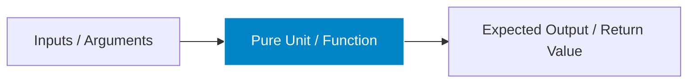

# Unit Testing Architecture & Best Practices

> **Scope:** Isolating and verifying individual pure functions, algorithms, regexes, transformers, and custom hooks in complete isolation without DOM, network, or database dependencies.

---

## Table of Contents

- [Unit Testing Architecture \& Best Practices](#unit-testing-architecture--best-practices)
  - [Table of Contents](#table-of-contents)
  - [1. Core Philosophy: Why Unit Test?](#1-core-philosophy-why-unit-test)
  - [2. File Organization \& Dunder Conventions (`__tests__`, `__mocks__`, `__fixtures__`)](#2-file-organization--dunder-conventions-__tests__-__mocks__-__fixtures__)
    - [How Jest Discovers Tests with `testMatch` \& `testRegex`](#how-jest-discovers-tests-with-testmatch--testregex)
    - [`.spec.` vs. `.test.` File Naming Conventions](#spec-vs-test-file-naming-conventions)
    - [Dunder Directory Roles in JavaScript/TypeScript](#dunder-directory-roles-in-javascripttypescript)
  - [3. The AAA Pattern (Arrange-Act-Assert) in Unit Tests](#3-the-aaa-pattern-arrange-act-assert-in-unit-tests)
  - [3. Testing Pure Functions, Math \& Data Transformers](#3-testing-pure-functions-math--data-transformers)
  - [4. Deterministic Timer Control (`fakeTimers`)](#4-deterministic-timer-control-faketimers)
    - [Testing `debounce`](#testing-debounce)
    - [Testing `throttle`](#testing-throttle)
  - [5. Testing Custom React Hooks (`renderHook`)](#5-testing-custom-react-hooks-renderhook)
  - [6. Testing State Reducers \& State Machines](#6-testing-state-reducers--state-machines)
  - [7. Common Pitfalls \& Anti-Patterns in Unit Testing](#7-common-pitfalls--anti-patterns-in-unit-testing)
  - [8. When to Use vs. When NOT to Use](#8-when-to-use-vs-when-not-to-use)

---

## 1. Core Philosophy: Why Unit Test?

Unit tests form the foundational base of reliable software. They run in milliseconds ($\approx 1-5\text{ms}$ per test), provide instant feedback in your IDE, have **zero flakiness**, and act as executable documentation for business algorithms.



---

## 2. File Organization & Dunder Conventions (`__tests__`, `__mocks__`, `__fixtures__`)

In JavaScript and TypeScript, the double-underscore prefix/suffix (known as **dunder**) is the official convention used by **Jest**, **Vitest**, and build tools to distinguish test suites, manual mocks, fixtures, and snapshots from production source code.

```text
src/
├── services/
│   ├── api.ts                     # Production source file
│   ├── __mocks__/                 # Co-located manual mock directory
│   │   └── api.ts                 # Resolved when jest.mock('./api') is called
│   ├── __tests__/                 # Dunder test directory (auto-discovered by Jest)
│   │   └── api.test.ts            # Unit test file
│   └── __fixtures__/              # Static test data & mock JSON payloads
│       └── mockUsers.json         # Ignored by test runners
└── __snapshots__/                 # Generated DOM/data snapshot files
```

### How Jest Discovers Tests with `testMatch` & `testRegex`

By default, Jest scans your codebase using its built-in `testMatch` glob pattern:

```javascript
// jest.config.js
module.exports = {
  // Default Jest discovery pattern:
  testMatch: [
    '**/__tests__/**/*.[jt]s?(x)', // 1. Any file inside a __tests__ folder!
    '**/?(*.)+(spec|test).[jt]s?(x)', // 2. Any file ending in .spec.ts, .test.js, etc.
  ],
  // Ignore node_modules, dist, and build outputs
  testPathIgnorePatterns: ['/node_modules/', '/dist/', '/build/'],
};
```

---

### `.spec.` vs. `.test.` File Naming Conventions

```text
+-----------------------+----------------------------------+----------------------------------+
| Convention            | Origin & Philosophy              | Best Practice Usage              |
+-----------------------+----------------------------------+----------------------------------+
| **`*.test.[jt]sx?`**  | TDD / Jest default               | Unit & Component tests asserting |
|                       | ("Verify function execution")    | return values and pure state.    |
+-----------------------+----------------------------------+----------------------------------+
| **`*.spec.[jt]sx?`**  | BDD / Jasmine / Cypress /        | E2E, Functional, and Behavior    |
|                       | Playwright ("Specification")     | specs asserting user journeys.   |
+-----------------------+----------------------------------+----------------------------------+
```

> [!TIP]
> **Key Jest Behavior:**
>
> - **1. Direct suffix matching:** Files named `auth.spec.ts` or `auth.test.ts` anywhere in `src/` are recognized automatically.
> - **2. Dunder matching:** Because of `**/__tests__/**/*.[jt]s?(x)`, any JavaScript or TypeScript file placed inside a `__tests__` folder (e.g. `src/utils/__tests__/math.js`) is automatically executed as a test suite by Jest, even if you omit `.test.` or `.spec.`!

---

### Dunder Directory Roles in JavaScript/TypeScript

| Dunder Directory    | Purpose                                                                       | Jest / Tooling Behavior                                             |
| :------------------ | :---------------------------------------------------------------------------- | :------------------------------------------------------------------ |
| **`__tests__`**     | Houses test files. Can be co-located per feature or placed at module roots.   | Auto-scanned by default `testMatch`.                                |
| **`__mocks__`**     | Houses manual module mocks for `jest.mock()`.                                 | Automatically substituted when mocking npm packages or local files. |
| **`__fixtures__`**  | Houses mock API responses, static JSON datasets, and test files.              | Excluded from test execution; safe for storing sample data.         |
| **`__snapshots__`** | Stores `.snap` serialization files generated by `expect().toMatchSnapshot()`. | Auto-created and maintained by Jest/Vitest.                         |

---

## 3. The AAA Pattern (Arrange-Act-Assert) in Unit Tests

Every unit test must strictly follow the **AAA structure**:

```typescript
// ✅ GOOD: Isolated AAA Pattern
it('calculates total price with percentage discount and tax', () => {
  // 1. ARRANGE: Set up inputs and parameters
  const items = [
    { name: 'Book', price: 20, quantity: 2 },
    { name: 'Pen', price: 5, quantity: 4 },
  ];
  const discountPercent = 10; // 10% off
  const taxRate = 0.08; // 8% tax

  // 2. ACT: Execute the pure calculation
  const total = calculateOrderTotal(items, discountPercent, taxRate);

  // 3. ASSERT: Verify the exact numerical outcome
  // Subtotal = 40 + 20 = $60; After 10% discount = $54; Total with 8% tax = $58.32
  expect(total).toBe(58.32);
});
```

---

## 3. Testing Pure Functions, Math & Data Transformers

```typescript
// utils/transformers.ts
export function normalizeUserData(raw: Record<string, any>) {
  if (!raw || typeof raw !== 'object') {
    throw new TypeError('Raw user payload must be an object');
  }
  return {
    id: String(raw.id ?? ''),
    fullName: `${raw.first_name ?? ''} ${raw.last_name ?? ''}`.trim() || 'Anonymous',
    email: String(raw.email ?? '')
      .toLowerCase()
      .trim(),
    isAdmin: Boolean(raw.roles?.includes('ADMIN')),
  };
}
```

```typescript
// utils/transformers.test.ts
import { describe, it, expect } from 'vitest';
import { normalizeUserData } from './transformers';

describe('normalizeUserData', () => {
  it('normalizes valid API response into typed user object', () => {
    const raw = {
      id: 101,
      first_name: 'Atul',
      last_name: 'Kumar',
      email: ' Atul@Example.COM ',
      roles: ['ADMIN', 'USER'],
    };
    expect(normalizeUserData(raw)).toEqual({
      id: '101',
      fullName: 'Atul Kumar',
      email: 'atul@example.com',
      isAdmin: true,
    });
  });

  it('handles missing and null fields gracefully', () => {
    expect(normalizeUserData({ id: 50 })).toEqual({
      id: '50',
      fullName: 'Anonymous',
      email: '',
      isAdmin: false,
    });
  });

  it('throws TypeError for invalid non-object inputs', () => {
    expect(() => normalizeUserData(null as any)).toThrow(TypeError);
    expect(() => normalizeUserData(undefined as any)).toThrow(TypeError);
  });
});
```

---

## 4. Deterministic Timer Control (`fakeTimers`)

### Testing `debounce`

```typescript
// utils/debounce.test.ts
import { describe, it, expect, vi, beforeEach, afterEach } from 'vitest';
import { debounce } from './debounce';

describe('debounce', () => {
  beforeEach(() => {
    vi.useFakeTimers();
  });

  afterEach(() => {
    vi.useRealTimers();
  });

  it('coalesces rapid invocations and executes only once after specified delay', () => {
    const callback = vi.fn();
    const debounced = debounce(callback, 300);

    debounced('first');
    debounced('second');
    debounced('final');

    expect(callback).not.toHaveBeenCalled();

    // Fast-forward time by 299ms
    vi.advanceTimersByTime(299);
    expect(callback).not.toHaveBeenCalled();

    // Fast-forward past the 300ms boundary
    vi.advanceTimersByTime(1);
    expect(callback).toHaveBeenCalledTimes(1);
    expect(callback).toHaveBeenCalledWith('final');
  });
});
```

### Testing `throttle`

```typescript
// utils/throttle.test.ts
import { describe, it, expect, vi, beforeEach, afterEach } from 'vitest';
import { throttle } from './throttle';

describe('throttle', () => {
  beforeEach(() => {
    vi.useFakeTimers();
  });

  afterEach(() => {
    vi.useRealTimers();
  });

  it('executes immediately on leading edge and limits subsequent executions', () => {
    const callback = vi.fn();
    const throttled = throttle(callback, 100);

    throttled('event_1'); // 0ms - runs immediately
    expect(callback).toHaveBeenCalledTimes(1);
    expect(callback).toHaveBeenCalledWith('event_1');

    throttled('event_2'); // 30ms - throttled
    throttled('event_3'); // 70ms - throttled
    expect(callback).toHaveBeenCalledTimes(1);

    vi.advanceTimersByTime(100);
    expect(callback).toHaveBeenCalledTimes(2);
    expect(callback).toHaveBeenLastCalledWith('event_3');
  });
});
```

---

## 5. Testing Custom React Hooks (`renderHook`)

Custom hooks encapsulating state transitions, subscriptions, or timers are tested with `renderHook`:

```typescript
// hooks/useCounter.ts
import { useState, useCallback } from 'react';

export function useCounter(initial = 0, { step = 1, min = 0, max = 100 } = {}) {
  const [count, setCount] = useState(initial);

  const increment = useCallback(() => {
    setCount((c) => Math.min(max, c + step));
  }, [max, step]);

  const decrement = useCallback(() => {
    setCount((c) => Math.max(min, c - step));
  }, [min, step]);

  const reset = useCallback(() => setCount(initial), [initial]);

  return { count, increment, decrement, reset };
}
```

```typescript
// hooks/useCounter.test.ts
import { renderHook, act } from '@testing-library/react';
import { describe, it, expect } from 'vitest';
import { useCounter } from './useCounter';

describe('useCounter', () => {
  it('increments and decrements within bounds', () => {
    const { result } = renderHook(() => useCounter(10, { step: 5, max: 15, min: 5 }));
    expect(result.current.count).toBe(10);

    act(() => {
      result.current.increment();
    });
    expect(result.current.count).toBe(15);

    // Clamps at max
    act(() => {
      result.current.increment();
    });
    expect(result.current.count).toBe(15);

    // Clamps at min
    act(() => {
      result.current.decrement();
      result.current.decrement();
      result.current.decrement();
    });
    expect(result.current.count).toBe(5);
  });
});
```

---

## 6. Testing State Reducers & State Machines

Pure state reducers (Redux, `useReducer`, XState) are ideal for unit testing because they take `(state, action) => newState` with zero side effects:

```typescript
// reducers/cartReducer.test.ts
import { describe, it, expect } from 'vitest';
import { cartReducer, CartState, CartAction } from './cartReducer';

describe('cartReducer', () => {
  it('adds new item and recalculates total items count', () => {
    const initialState: CartState = { items: [], totalCount: 0 };
    const action: CartAction = {
      type: 'ADD_ITEM',
      payload: { id: 'p1', name: 'Keyboard', price: 100, quantity: 2 },
    };

    const nextState = cartReducer(initialState, action);

    expect(nextState.items).toHaveLength(1);
    expect(nextState.totalCount).toBe(2);
    // Immutability check
    expect(nextState).not.toBe(initialState);
  });
});
```

---

## 7. Common Pitfalls & Anti-Patterns in Unit Testing

1. **Testing Implementation Details:** Asserting on internal private variables instead of function return values.
2. **Over-Mocking:** Mocking every helper function instead of running pure helpers naturally.
3. **Missing Boundary Testing:** Only testing the happy path and ignoring $0$, `null`, `undefined`, negative numbers, and `NaN`.
4. **Non-Deterministic Time:** Relying on `Date.now()` without freezing the clock.

---

## 8. When to Use vs. When NOT to Use

| When to Use Unit Testing                            | When NOT to Use Unit Testing                              |
| :-------------------------------------------------- | :-------------------------------------------------------- |
| ✅ Pure functions, calculations, string formatters. | ❌ Complex multi-component UI page layouts.               |
| ✅ Custom React hooks (`renderHook`).               | ❌ Multi-page navigation flows.                           |
| ✅ State machines and pure Redux/Zustand reducers.  | ❌ Real API integration and network protocol handshakes.  |
| ✅ Regex validation and data parsers.               | ❌ Visual CSS styling and responsive layout verification. |
