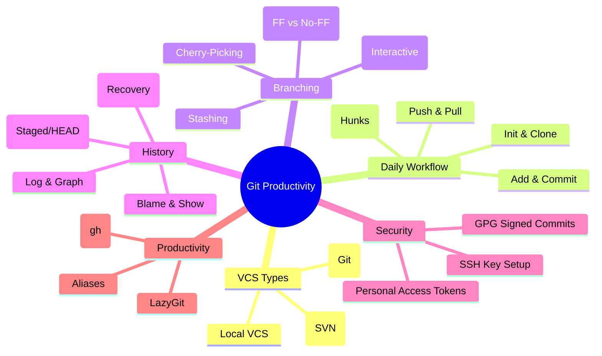

# Git Productivity Guide:

A comprehensive guide to Git for developers at all levels. VCS(version control system), streamline workflows, and boost productivity with best practices, shortcuts, and security setups.

**Quick Overview:**

- **Basics**: Setup, daily operations (add, commit, push).
- **Intermediate**: Branches, merges, conflicts.
- **Advanced**: Rebasing, tags, automation.
- **Productivity**: Aliases, workflows, tools.
- **Security**: SSH keys, GPG signing.

---

## 🗺️ Git Touchpoints



---

## 🔥 Senior/Staff Level "Grill" Questions

### Q1: What are the 3 core "Objects" in Git's internal architecture?

> **Answer:** Git is a content-addressable filesystem. Everything is an object in `.git/objects`:
>
> 1. **Blob:** Stores file content (no filename).
> 2. **Tree:** Acts like a directory; maps filenames to Blobs or other Trees.
> 3. **Commit:** Points to a specific Tree and includes metadata (author, message, parent commit).
>
> - **Insight:** This is why Git is so fast at branching—a branch is just a 40-character file pointing to a Commit hash.

### Q2: `git reset --hard` deleted my uncommitted work. How do I get it back?

> **Answer:** If it was **never committed**, it's likely gone forever unless your IDE (VS Code/WebStorm) has a local history. However, if it was **ever committed** (even if you later deleted the branch), you can find it using **`git reflog`**. It shows a history of where `HEAD` has been. Find the hash before the reset and run `git reset --hard <hash>`.

### Q3: Explain the difference between "Merge" and "Rebase" in terms of Project Governance.

> **Answer:**
>
> - **Merge:** Preserves the true chronological history and the context of when a feature was integrated. (Better for public/shared branches).
> - **Rebase:** Creates a "clean," linear history by re-writing commits. (Better for local feature branches before they are shared).
> - **Staff Take:** Never rebase a branch that others are working on, as it changes the hashes and causes "History Divergence" for everyone else.

### Q4: What are "Git Worktrees" and how do they solve the "I need to fix a bug on another branch" problem?

> **Answer:** Normally, you'd use `git stash`. But stashing is messy for large changes. **Worktrees** allow you to have multiple branches checked out in **different folders** simultaneously, sharing the same `.git` database.
>
> - **Usage:** `git worktree add ../bugfix-branch branch-name`. Now you can work on two branches without switching or stashing.

---

## What is VCS?

**VCS = Version Control System**
A system that tracks changes to code/files over time so you can collaborate, rollback, branch, and audit history.

### Types of VCS

1. **Local VCS**
   - Tracks versions only on your machine.
   - No collaboration.
   - Example: RCS (old, rare).

2. **Centralized VCS (CVCS)**
   - One central server; everyone commits to it.
   - Examples: SVN, Perforce.
   - Pros: Simple.
   - Cons: Single point of failure.

3. **Distributed VCS (DVCS)** ✅ (Modern Standard)
   - Every developer has a full copy of history.
   - Offline work + fast branching.
   - Examples: Git ⭐, Mercurial.

---

## 1. Basics: Getting Started & Daily Workflow

### Setup & Initialization

```bash
git init                    # Initialize a new repo in current dir
git clone <url>             # Clone remote repo (e.g., from GitHub)
git status                  # Check repo status (staged/unstaged changes)
git config --list           # View all config settings
```

### Adding & Committing Changes

```bash
git add file.txt            # Stage specific file
git add .                   # Stage all changes in current dir
git add -A                  # Stage all changes (including deletions)
git add -p                  # Interactive staging (select hunks)

git commit -m "message"     # Commit staged changes
git commit -am "message"    # Add & commit all modified files
git commit --amend          # Amend last commit (edit message)
git commit --amend --no-edit # Amend without changing message
```

### Pushing & Pulling

```bash
git push origin main        # Push local branch to remote
git push -u origin feature  # Push new branch & set upstream
git pull origin main        # Fetch & merge from remote
git fetch origin            # Fetch changes without merging
```

---

## 2. Intermediate: Branches, Merges & Conflicts

### Branching

```bash
git branch                  # List local branches
git branch -a               # List all branches (local + remote)
git checkout -b feature     # Create & switch to new branch
git checkout main           # Switch to branch
git branch -m old new       # Rename branch
git branch -d feature       # Delete merged branch
git branch -D feature       # Force delete unmerged branch
git push origin --delete feature # Delete remote branch
```

### Merging & Conflicts

```bash
git merge feature           # Merge branch into current
git merge --no-ff feature   # Merge with no-fast-forward (preserve history)
# If conflicts: Edit files, then:
git add conflicted-file     # Mark as resolved
git commit                 # Complete merge
git merge --abort          # Abort merge on conflicts
```

### Rebasing (Advanced Merging)

```bash
git rebase main             # Rebase current branch on main
git rebase -i HEAD~3        # Interactive rebase last 3 commits
git rebase --abort          # Abort rebase
```

---

## 3. Advanced: History, Tags & Collaboration

### History & Inspection

```bash
git log                     # Full commit history
git log --oneline           # Compact history
git log --oneline --graph   # Visual branch graph
git show <commit>           # Details of specific commit
git diff                    # Unstaged changes
git diff --staged           # Staged changes
git diff HEAD~1             # Compare with previous commit
git blame file.txt          # Who changed each line
```

### Tags (Versioning)

```bash
git tag v1.0                # Create lightweight tag
git tag -a v1.0 -m "msg"    # Annotated tag
git tag -l                  # List tags
git push origin v1.0        # Push tag to remote
git tag -d v1.0             # Delete local tag
```

### Cherry-Picking & Patches

Cherry-pick specific commits from one branch to another (e.g., apply a bug fix without merging the whole branch).

```bash
git cherry-pick <commit-hash> # Apply single commit
git cherry-pick A..B         # Apply range of commits (A to B)
git cherry-pick --no-commit <commit> # Apply without committing (for edits)
git cherry-pick --abort      # Abort if conflicts
git cherry-pick --continue   # After resolving conflicts

git format-patch -1 <commit> # Create patch file
git am patch.patch           # Apply patch (alternative to cherry-pick)
```

**When to Use**: Porting fixes, backporting features, avoiding full merges.

### Remotes

```bash
git remote add origin <url> # Add remote repo
git remote -v               # List remotes
git remote rename old new   # Rename remote
git remote remove origin    # Remove remote
```

### Undoing Changes

```bash
git reset --soft HEAD~1     # Undo commit, keep changes staged
git reset --mixed HEAD~1    # Undo commit, keep changes unstaged (default)
git reset --hard HEAD~1     # Undo commit & discard changes
git revert <commit>         # Create revert commit (safe for shared branches)
```

### Stashing

```bash
git stash                   # Stash uncommitted changes
git stash save "msg"        # Stash with message
git stash list              # List stashes
git stash apply             # Apply latest stash
git stash pop               # Apply & drop latest stash
git stash drop stash@{1}    # Drop specific stash
git stash clear             # Clear all stashes
```

---

## 4. Productivity Boosters: Aliases, Workflows & Tips

### Git Aliases (Speed Up Commands)

Add to `~/.gitconfig`:

```
[alias]
  co = checkout
  br = branch
  ci = commit
  st = status
  lg = log --oneline --graph --decorate
  unstage = reset HEAD --
  last = log -1 HEAD
  hist = log --pretty=format:\"%h %ad | %s%d [%an]\" --graph --date=short
```

Usage: `git co feature` instead of `git checkout feature`.

### Best Practices & Workflows

- **Commit Often**: Small, focused commits.
- **Branch Strategy**: Use feature branches (e.g., Gitflow: main, develop, features).
- **Pull Requests**: Always review before merging.
- **Avoid Force Push**: Use `--force-with-lease` if needed.
- **Clean History**: Use rebase for linear history.

### Troubleshooting

- **Untracked Files**: `git clean -fd` (remove untracked files/dirs).
- **Detached HEAD**: `git checkout main` to reattach.
- **Large Files**: Use Git LFS for big assets.
- **Performance**: `git gc` to clean repo.

### Tools for Productivity

- **GitHub CLI**: `gh pr create` for PRs.
- **LazyGit**: Terminal UI for Git.
- **GitKraken/Sourcetree**: GUI clients.

---

## 5. Security & Authentication: SSH & GPG Setup

### SSH Key Setup (For Secure Remote Access)

1. **Generate Key**:

   ```bash
   ssh-keygen -t ed25519 -C "your.email@example.com"
   # Or RSA: ssh-keygen -t rsa -b 4096 -C "your.email@example.com"
   ```

2. **Add to SSH Agent**:

   ```bash
   eval "$(ssh-agent -s)"
   ssh-add ~/.ssh/id_ed25519
   ```

3. **Add Public Key to GitHub/GitLab**:
   - Copy `cat ~/.ssh/id_ed25519.pub`
   - Paste in repo settings > SSH Keys.

4. **Test**:

   ```bash
   ssh -T git@github.com
   ```

5. **Clone with SSH**: Use `git@github.com:user/repo.git`

### GPG Key Setup (For Signed Commits)

1. **Install GPG**:
   - macOS: `brew install gnupg`
   - Linux: `sudo apt install gnupg`

2. **Generate Key**:

   ```bash
   gpg --full-generate-key  # Follow prompts (RSA, 4096 bits)
   gpg --list-secret-keys --keyid-format LONG
   ```

3. **Configure Git**:

   ```bash
   git config --global user.signingkey <KEY_ID>
   git config --global commit.gpgsign true
   ```

4. **Export Public Key**:

   ```bash
   gpg --armor --export <KEY_ID>
   # Add to GitHub: Settings > GPG Keys
   ```

5. **Sign Commits**:

   ```bash
   git commit -S -m "Signed commit"
   ```

6. **Verify**: `git log --show-signature`

This ensures commit authenticity and boosts trust in collaborative projects.

---

## 6. GitHub Limits & Best Practices

### Key Limits on GitHub

- **SSH Keys**: Up to 100 per user account (for authentication across devices).
- **GPG Keys**: Up to 100 per user account (for commit/tag signing).
- **Personal Access Tokens**: Up to 100 per user (use fine-grained for better control).
- **Repository Size**: 10 GB recommended (use Git LFS for large files).

**Tip**: Regularly audit and remove unused keys/tokens in Settings > SSH and GPG Keys.

### Final Productivity Tips

- Use `.gitignore` to exclude unnecessary files.
- Alias common commands (e.g., `git config --global alias.st status`).
- Integrate with tools like GitHub CLI (`gh`) for PRs/issues.
- Backup repos and learn from `git reflog` recoveries.
