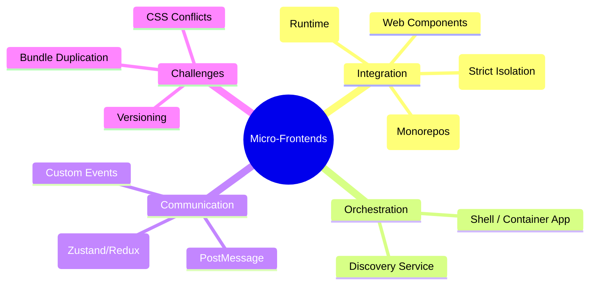

# Micro-Frontends (MFE): Architectural Guide

Micro-frontends extend the microservices philosophy to the frontend, allowing independent teams to own "slices" of the user experience and deploy them without coordinating with the whole organization.

---

## 🗺️ MFE Architecture Mindmap

---

## 🏛️ Integration Strategies: Choosing Your Style

| Strategy        | Performance | Isolation | DX (Dev Experience) | Best For...                              |
| :-------------- | :---------- | :-------- | :------------------ | :--------------------------------------- |
| **IFrames**     | 🔴 Low      | 🟢 High   | 🟡 Medium           | 3rd-party widgets, legacy apps.          |
| **Build-time**  | 🟢 High     | 🔴 Low    | 🟢 High             | Small teams in a Monorepo (Nx/Turbo).    |
| **Module Fed.** | 🟢 High     | 🟡 Medium | 🟢 High             | Modern enterprise apps (Webpack 5/Vite). |
| **Server-Side** | 🟡 Medium   | 🟢 High   | 🔴 Low              | SEO-critical legacy portals.             |

---

## 🔥 Senior/Staff Level "Grill" Questions

### Q1: What is the "Integration Gap" in Micro-frontends?

> **Answer:** It's the risk that an MFE works perfectly in isolation but crashes when loaded into the Shell (Container).
>
> - **The Cause:** Shared global objects (e.g., `window`), CSS collisions, or mismatched React versions.
> - **The Fix:** **Consumer-Driven Contract Testing.** The Shell team provides a "Test Suite" that the MFE must pass before it's allowed to deploy.

### Q2: How do you handle "Shared Dependencies" to avoid 5 versions of React?

> **Answer:** Using **Webpack Module Federation (Shared API)**.
>
> - **The Strategy:** Mark core libraries (React, Lodash) as `shared`.
> - **Nuance:** Use `singleton: true` to ensure only one version is ever loaded. If an MFE needs a newer version, it can opt-out and load its own, but at the cost of bundle size.

### Q3: Why is "State Management" the hardest part of MFE design?

> **Answer:** Because you must balance **Isolation** vs **Communication**.
>
> - **The Red Flag:** Sharing a single global Redux store across all MFEs. This creates tight coupling and makes it impossible for teams to move independently.
> - **The "Staff" Solution:** Use a **"Share-Nothing"** philosophy. MFEs communicate via a lightweight **Event Bus (CustomEvents)** or a minimal Shell-provided context. Each MFE should manage its own internal state.

### Q4: How do you solve the "Z-Index War" and "CSS Leakage" in MFEs?

> **Answer:**
>
> 1. **Shadow DOM:** The only true browser-level isolation for CSS.
> 2. **BEM/CSS Modules:** Scoping CSS to unique class names.
> 3. **Tailwind:** Highly effective because it uses a flat, utility-first structure that rarely conflicts with component logic.

---

## 📈 Decision Matrix: Should you even use MFEs?

Use Micro-frontends **ONLY** if:

1. You have 3+ teams working on the same frontend.
2. Teams need different deployment cycles (Team A ships 10x/day, Team B ships 1x/month).
3. You are integrating multiple legacy technologies (React + Angular + Vue).

**Do NOT use MFEs for small projects; the operational overhead will kill your velocity.**
