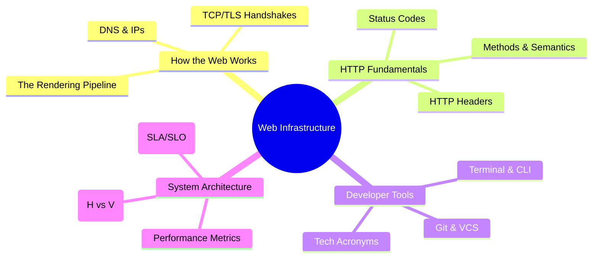

# Web Fundamentals & Infrastructure

A deep dive into the building blocks of the modern web, covering everything from browser internals to version control and scalability.

---

## 🗺️ Web Fundamentals Landscape

---

## 📂 Knowledge Modules

- **[How the Web Works](./web.md):** The end-to-end journey from a URL to pixels on the screen.
- **[Git & Version Control](./Git.md):** Mastering Git productivity, workflows, and security.
- **[HTTP Headers](./Headers.md):** A comprehensive guide to metadata that powers the web.
- **[Scalability & Performance](./Scalability.md):** Core patterns for building high-scale distributed systems.
- **[Terminal Mastery](./terminal.md):** Productivity tips for the command line.
- **[Tech Acronyms](./tech-acronyms.md):** A glossary of industry-standard terminology.
