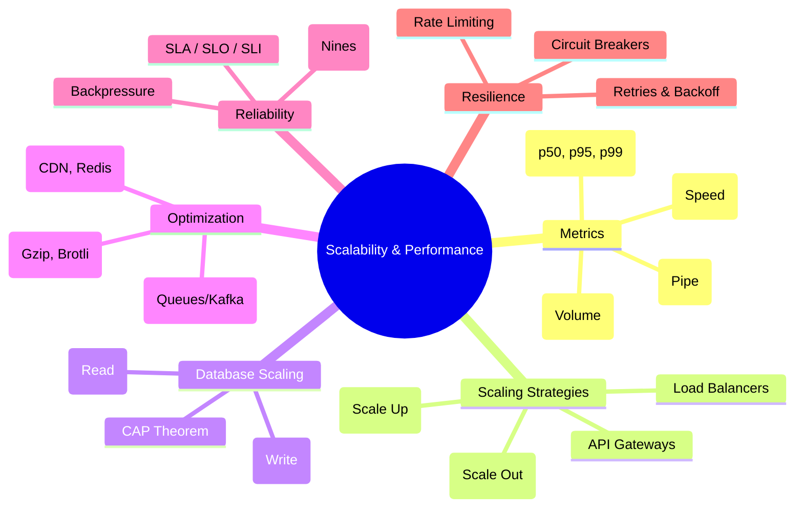

# 🚀 The Complete System Performance & Scalability Blueprint

## 1. Core Fundamentals

- **Load:** The demand placed on the system (Req/sec, Active Users, Data size).
- **Performance:** How efficiently the system handles the load.
- **Capacity:** The maximum load the system can handle before failing.

---

### 2. The Golden Signals (Throughput vs. Latency)

| Metric         | Definition                                             | Focus         | Analogy                     |
| :------------- | :----------------------------------------------------- | :------------ | :-------------------------- |
| **Throughput** | Data processed per unit of time (bits/sec or req/sec). | **Volume**    | Highway width (Lane count). |
| **Latency**    | Time to travel from Source → Destination.              | **Speed**     | Speed limit / Car speed.    |
| **Bandwidth**  | Maximum theoretical throughput of the network.         | **Potential** | Pipe diameter.              |

---

### 3. Scalability Strategies

**Definition:** The ability to handle growth without changing the core design.

#### A. Architecture

- **Vertical (Scale Up):** Bigger hardware (RAM/CPU). _Limit: Hardware ceiling._
- **Horizontal (Scale Out):** More machines. _Requires: Distributed logic._

#### B. The "How-To" of Horizontal Scaling

- **Load Balancer (LB):** Distributes traffic across servers (Round Robin, Least Connection).
- **API Gateway:** Entry point for clients; handles routing, auth, and rate limiting.
- **State Management:**
  - _Stateless:_ Any server can handle any request (Ideal for horizontal scaling).
  - _Stateful:_ Specific servers hold user data (Harder to scale; requires "Sticky Sessions").

---

### 4. Database Scaling (The Bottleneck)

The database is usually the first thing to crash.

- **Replication (Read Scaling):**
  - _Master-Slave:_ Write to Master, Read from Slaves.
  - _Metric:_ Replication Lag (time delay between Master and Slave).
- **Sharding (Write Scaling):**
  - Splitting data across multiple databases based on a key (e.g., UserID 0-1000 on DB1, 1001-2000 on DB2).
  - _Challenge:_ Complex joins across shards.
- **CAP Theorem:** You can only pick 2 of 3:
  - **C**onsistency (Everyone sees same data).
  - **A**vailability (System always responds).
  - **P**artition Tolerance (System works despite network cuts).

---

### 5. Performance Optimization Layers

How to lower latency and increase throughput.

1.  **Caching (The Silver Bullet):**
    - _Client Side:_ Browser cache.
    - _CDN:_ Caches static assets (images, CSS) closer to the user geographically.
    - _Server Side:_ Redis/Memcached (In-memory storage for expensive DB queries).
2.  **Asynchronous Processing:**
    - Use **Message Queues** (Kafka, RabbitMQ) for slow tasks (e.g., sending emails). Decouples the user from the wait time.
3.  **Compression:** Gzip/Brotli to reduce data transfer size.

---

### 6. Reliability & Contracts (SLA/SLO/SLI)

It's not just about speed; it's about promises.

- **SLI (Indicator):** _What_ we measure (e.g., Error Rate, Latency).
- **SLO (Objective):** _The Goal_ (e.g., "Latency < 200ms for 99% of reqs").
- **SLA (Agreement):** _The Contract_ (e.g., "If we miss the SLO, we pay you back").

#### The "Nines" of Availability

| Availability      | Downtime per Year | Status              |
| :---------------- | :---------------- | :------------------ |
| 99% (2 nines)     | 3.65 days         | Mediocre            |
| 99.9% (3 nines)   | 8.76 hours        | Standard            |
| 99.99% (4 nines)  | 52 minutes        | High Availability   |
| 99.999% (5 nines) | 5 minutes         | Telco/Banking Grade |

---

### 7. Resilience Patterns (Handling Failure)

- **Circuit Breaker:** If a service fails repeatedly, stop calling it instantly to prevent a cascade.
- **Rate Limiting:** Rejecting requests if a user sends too many (protects against DDOS).
- **Bulkhead:** Partitioning resources so a crash in one part doesn't sink the whole ship.
- **Retries with Exponential Backoff:** Wait 1s, then 2s, then 4s before trying again.

---

### 8. Testing & Standard Metrics

#### Testing Types

- **Baseline:** Normal usage.
- **Stress:** Breaking point.
- **Soak:** Long duration (finds memory leaks).
- **Spike:** Sudden burst (e.g., Ticket sales).

#### Key Metrics (The "RED" Method)

1.  **R**ate (Number of requests).
2.  **E**rrors (Number of failed requests).

- **Duration** (Latency/Response time).

---

## 🏛️ Architect's Decision Matrix: Scaling & Consistency

Scaling isn't just about adding servers; it's about choosing which distributed system guarantees you are willing to break.

| Trade-off         | Strategy A                                                          | Strategy B                                  | The "Staff" Insight                                                                                   |
| :---------------- | :------------------------------------------------------------------ | :------------------------------------------ | :---------------------------------------------------------------------------------------------------- |
| **Consistency**   | **Strong:** (Acid, 2PC). Everyone sees the latest data immediately. | **Eventual:** (BASE). Data syncs over time. | High-scale systems MUST use **Eventual Consistency** for performance.                                 |
| **Read Scaling**  | **Replication:** Multiple read-only slaves.                         | **Caching:** Redis/CDN in front of DB.      | Replication is for **Availability**; Caching is for **Latency**.                                      |
| **Write Scaling** | **Vertical Scaling:** Bigger DB instance.                           | **Sharding:** Partitioning data across DBs. | Sharding is the "Nuclear Option." Avoid it until you have no other choice due to **Join complexity**. |
| **Availability**  | **Multi-AZ:** Same region, different buildings.                     | **Multi-Region:** Global distribution.      | Multi-Region protects against **Cloud Provider outages**, not just local failure.                     |

---

## 🔥 Senior/Staff Level "Grill" Questions

### Q1: CAP Theorem is famous, but what is PACELC?

> **Answer:** CAP is too simple for real-world networking. **PACELC** extends it:
>
> - **If there is a Partition (P):** You choose between Availability (A) and Consistency (C).
> - **Else (E) (Normal operation):** You choose between Latency (L) and Consistency (C).
> - **The Insight:** Even when everything is working perfectly, you still have to choose: Do I wait for all nodes to sync (High Consistency, High Latency) or do I return data fast (Low Latency, Potential Stale Data)?

### Q2: How do you handle "Hot Shards" in a global system?

> **Answer:** A "Hot Shard" occurs when one shard gets 90% of the traffic (e.g., a shard containing data for a celebrity on Twitter).
>
> - **Mitigation:**
>   1. **Salting:** Add a random suffix to the sharding key to distribute the data more evenly.
>   2. **Dynamic Re-sharding:** Automatically move active data to less busy shards (extremely complex).
>   3. **Caching:** Aggressively cache the "Hot" data at the Edge/CDN to prevent requests from ever hitting the shard.

### Q3: Why is "Two-Phase Commit" (2PC) considered an anti-pattern for Microservices?

> **Answer:** 2PC provides strong consistency across services but is a "Blocker." If the coordinator fails, or one service is slow, the entire transaction (and all locked resources) hangs.
>
> - **The Alternative:** Use the **Saga Pattern**. Instead of one big transaction, use a sequence of local transactions. If one fails, you trigger **Compensating Transactions** to "undo" the previous successful steps (e.g., "Refund money" if "Inventory allocation" failed).

### Q4: What is the "Thundering Herd" problem in Caching?

> **Answer:** This occurs when a very popular cache key expires. Suddenly, 10,000 concurrent requests all "miss" the cache and hit the Database at the exact same millisecond, crashing it.
>
> - **The Solution:**
>   1. **Probabilistic Early Recomputation:** Re-calculate the cache value _before_ it expires.
>   2. **Mutex Locks:** Only allow the first request to hit the DB; make others wait/retry for the cache to be refilled.
>   3. **Soft TTL:** Return stale data for a few seconds while the background process updates the cache.

---

## 🗺️ Scalability & Performance Landscape

---

### Latency Thresholds

- **< 100ms:** ⚡ Instant
- **300-800ms:** 😐 Noticeable
- **> 2500ms:** 💸 Revenue Loss

---

### 9. Deep Dive: The Truth About Metrics (Percentiles)

_Why "Average" is a liar and "p99" is King._

#### The Problem with "Average"

If 9 users get a 10ms response and 1 user gets a 10s response, the **Average is 1 second.**

- The dashboard looks okay (1s is tolerable).
- Reality: 9 people are happy, 1 person quit. The average hides the failure.

#### The Percentiles (The Real Story)

| Metric           | Who is it?         | Use Case                                                                                                                          |
| :--------------- | :----------------- | :-------------------------------------------------------------------------------------------------------------------------------- |
| **p50** (Median) | **Joe Public**     | The typical user. Good for general health checks.                                                                                 |
| **p95**          | **The Heavy User** | Used for capacity planning (provisioning servers).                                                                                |
| **p99**          | **The Canary**     | The slowest 1%. These are often your "Whales" (users with the most data/orders). Ignoring p99 means ignoring your best customers. |

#### The "Tail Latency" Death Spiral

In Microservices, p99 is critical due to **Fan-out**.

- If one user request hits **100 internal microservices** to build a page...
- And each service has a **1% chance** (p99) of being slow...
- **Math:** $1 - (0.99)^{100} = 63\%$
- **Result:** **63% of your users** will experience a slow page load because of one slow dependency.

#### Common Causes of High p99 Latency

1.  **Garbage Collection (GC):** Java/Go pausing to clean memory ("Stop the world" events).
2.  **Noisy Neighbors:** In Cloud (AWS/Azure), another VM on the physical server stealing CPU.
3.  **Cold Starts:** Serverless functions (Lambda) waking up.
4.  **Resource Contention:** Waiting for a specific database lock or connection.
