# How the Web Works: From URL to Pixels

> A clear, end‑to‑end mental model of what happens from **typing a URL** to **pixels on the screen**. This guide is structured progressively: beginners can focus on early sections, while advanced readers will appreciate the deep technical details and diagrams.

## Table of Contents

- [How the Web Works: From URL to Pixels](#how-the-web-works-from-url-to-pixels)
  - [Table of Contents](#table-of-contents)
  - [0. Big Picture](#0-big-picture)
  - [0.1 Web Touchpoints](#01-web-touchpoints)
  - [1. Understanding Domains \& URLs](#1-understanding-domains--urls)
  - [1.0 URL Anatomy: The Detailed Breakdown](#10-url-anatomy-the-detailed-breakdown)
    - [Core Components](#core-components)
    - [Full URL Mapping Example](#full-url-mapping-example)
  - [1.1 Domain Hierarchy and DNS Structure](#11-domain-hierarchy-and-dns-structure)
  - [1.2 Domain to IP Mapping (DNS Resolution)](#12-domain-to-ip-mapping-dns-resolution)
  - [1.3 URL vs Domain vs IP: Comparison](#13-url-vs-domain-vs-ip-comparison)
  - [1.4 Visual Breakdown (Mermaid Graph)](#14-visual-breakdown-mermaid-graph)
  - [1.5 URL vs URI vs URN](#15-url-vs-uri-vs-urn)
    - [Formal Definitions](#formal-definitions)
    - [The "Person" Analogy](#the-person-analogy)
    - [Real-World URN Examples (Persistent Identity)](#real-world-urn-examples-persistent-identity)
  - [1.6 REST \& API Perspective](#16-rest--api-perspective)
  - [1.7 Key Takeaways](#17-key-takeaways)
  - [2. What Happens When You Hit Enter](#2-what-happens-when-you-hit-enter)
    - [2.0 Client-Side Pre-Flight: Keyboard, Omnibox, \& HSTS Preloads](#20-client-side-pre-flight-keyboard-omnibox--hsts-preloads)
    - [2.1 Browser Pre‑Checks (Before Network)](#21-browser-prechecks-before-network)
    - [2.2 Full Request Flow (High Level)](#22-full-request-flow-high-level)
  - [3. DNS Resolution (Name → IP)](#3-dns-resolution-name--ip)
    - [3.1 Domain → IP Mapping Authority](#31-domain--ip-mapping-authority)
    - [3.2 DNS lookup flow](#32-dns-lookup-flow)
    - [3.3 Peering (why Google is fast)](#33-peering-why-google-is-fast)
  - [4. Transport Layer (Connection Setup)](#4-transport-layer-connection-setup)
    - [4.0 Local Routing, ARP, \& NAT](#40-local-routing-arp--nat)
    - [4.1 TCP 3‑Way Handshake (Guaranteed Delivery)](#41-tcp-3way-handshake-guaranteed-delivery)
  - [5. Security Layer (TLS / SSL)](#5-security-layer-tls--ssl)
    - [5.1 Encryption / Decryption Flow (HTTPS)](#51-encryption--decryption-flow-https)
    - [5.2 TLS 1.3 and 0-RTT Optimization](#52-tls-13-and-0-rtt-optimization)
  - [6. HTTP Semantics: The Shared Contract of the Web](#6-http-semantics-the-shared-contract-of-the-web)
  - [6.1 HTTP Method Semantics](#61-http-method-semantics)
    - [The Method Matrix](#the-method-matrix)
    - [Key Semantic Rules](#key-semantic-rules)
  - [6.2 Status Code Semantics](#62-status-code-semantics)
    - [Success (2xx)](#success-2xx)
    - [Client Errors (4xx)](#client-errors-4xx)
    - [Server Errors (5xx)](#server-errors-5xx)
  - [6.3 Header Semantics (Metadata with Meaning)](#63-header-semantics-metadata-with-meaning)
  - [6.4 Content Negotiation](#64-content-negotiation)
  - [6.5 Caching Semantics](#65-caching-semantics)
    - [Cache-Control Directives](#cache-control-directives)
    - [Conditional Requests (The 304 Flow)](#conditional-requests-the-304-flow)
  - [6.6 Safety \& Idempotency (For Distributed Systems)](#66-safety--idempotency-for-distributed-systems)
  - [6.7 HTTP vs. REST Semantics](#67-http-vs-rest-semantics)
  - [6.8 Common Semantic Anti-Patterns](#68-common-semantic-anti-patterns)
  - [6.9 HTTP Semantic Flow](#69-http-semantic-flow)
  - [6.10 Mental Model](#610-mental-model)
  - [7. HTTP Request \& Response](#7-http-request--response)
    - [7.1 Client → Server Data Flow](#71-client--server-data-flow)
    - [7.2 Browser Pre‑Request Checks](#72-browser-prerequest-checks)
    - [7.3 HTTP request](#73-http-request)
    - [7.4 Response streaming (important correction)](#74-response-streaming-important-correction)
  - [8. Browser Resource Scheduling](#8-browser-resource-scheduling)
    - [8.1 Parallel Network Requests](#81-parallel-network-requests)
  - [9. HTML Parsing → DOM](#9-html-parsing--dom)
    - [9.1 Parsing HTML](#91-parsing-html)
  - [10. CSS Parsing → CSSOM](#10-css-parsing--cssom)
    - [10.1 CSSOM](#101-cssom)
    - [10.2 Blocking Rules](#102-blocking-rules)
  - [11. JavaScript Loading \& Execution](#11-javascript-loading--execution)
    - [11.1 Why JS blocks parsing](#111-why-js-blocks-parsing)
    - [11.2 Script attributes](#112-script-attributes)
  - [12. DOM + CSSOM → Render Tree](#12-dom--cssom--render-tree)
    - [12.1 Render Tree rules](#121-render-tree-rules)
  - [13. Layout (Reflow)](#13-layout-reflow)
    - [13.1 What layout does](#131-what-layout-does)
    - [13.2 What triggers reflow](#132-what-triggers-reflow)
  - [14. Paint](#14-paint)
  - [15. Compositing, Rasterization, \& VSync](#15-compositing-rasterization--vsync)
  - [16. Performance Milestones](#16-performance-milestones)
  - [17. HTTP Versions Comparison](#17-http-versions-comparison)
  - [18. Peering \& ICANN](#18-peering--icann)
    - [18.1 Peering](#181-peering)
    - [18.2 ICANN \& WHOIS](#182-icann--whois)
  - [19. Complete Timeline (URL to Pixels)](#19-complete-timeline-url-to-pixels)
    - [Detailed Browser Rendering \& Network Pipeline](#detailed-browser-rendering--network-pipeline)
      - [Short Interview Version (Quick Reference)](#short-interview-version-quick-reference)
      - [Important Notes](#important-notes)
  - [20. Key Mental Models](#20-key-mental-models)
  - [21. Tips](#21-tips)
  - [22. One‑Sentence Summary about hit to pixel on ui](#22-onesentence-summary-about-hit-to-pixel-on-ui)
  - [23. Big Picture Visualization](#23-big-picture-visualization)
  - [24. Browser Pre-Checks Visualization](#24-browser-pre-checks-visualization)
  - [25. Full Request Flow Visualization](#25-full-request-flow-visualization)
  - [26. DNS Resolution Visualization](#26-dns-resolution-visualization)
  - [27. TCP 3-Way Handshake Visualization](#27-tcp-3-way-handshake-visualization)
  - [28. TLS Handshake Visualization](#28-tls-handshake-visualization)
  - [29. 1-RTT vs Multi-RTT Visualization](#29-1-rtt-vs-multi-rtt-visualization)
  - [30. Critical Rendering Path Visualization](#30-critical-rendering-path-visualization)
  - [31. Web Protocol Comparison Diagram](#31-web-protocol-comparison-diagram)
    - [31.1 Detailed Breakdown of "How It Works"](#311-detailed-breakdown-of-how-it-works)
    - [31.2 Key Takeaways for Mental Model:](#312-key-takeaways-for-mental-model)
  - [31.3 The 7 OSI (Open Systems Interconnection) Layers (Brief Intro)](#313-the-7-osi-open-systems-interconnection-layers-brief-intro)
    - [31.4 Protocol to OSI Mapping](#314-protocol-to-osi-mapping)
    - [31.5 Why this matters for "How the Web Works":](#315-why-this-matters-for-how-the-web-works)
  - [Senior/Staff Level "Grill" Questions](#seniorstaff-level-grill-questions)
    - [Q1: How does "Resource Prioritization" work in HTTP/2 vs. HTTP/3?](#q1-how-does-resource-prioritization-work-in-http2-vs-http3)
    - [Q2: Explain the "Preload Scanner" and why it's the browser's most important performance optimization.](#q2-explain-the-preload-scanner-and-why-its-the-browsers-most-important-performance-optimization)
    - [Q3: What is "Layout Thrashing" and how do you detect it in a large-scale React app?](#q3-what-is-layout-thrashing-and-how-do-you-detect-it-in-a-large-scale-react-app)
    - [Q4: How does QUIC handle "IP Migration" and why is it a game-changer for mobile?](#q4-how-does-quic-handle-ip-migration-and-why-is-it-a-game-changer-for-mobile)
  - [32. Web Architecture Deep Dive](#32-web-architecture-deep-dive)
  - [References](#references)
  - [Glossary](#glossary)

---

**Reader Levels Guide:**

- **Beginner**: Focus on sections 0-7 for basic understanding of how the web works.
- **Intermediate**: Sections 8-15 for browser internals and rendering.
- **Advanced**: Sections 16+ for deep protocol details, optimizations, and visualizations.

---

## 0. Big Picture

**URL → DNS → TCP → TLS → HTTP → HTML/CSS/JS → DOM/CSSOM → Render Tree → Layout → Paint → Composite**

Keep this chain in your head.

---

## 0.1 Web Touchpoints

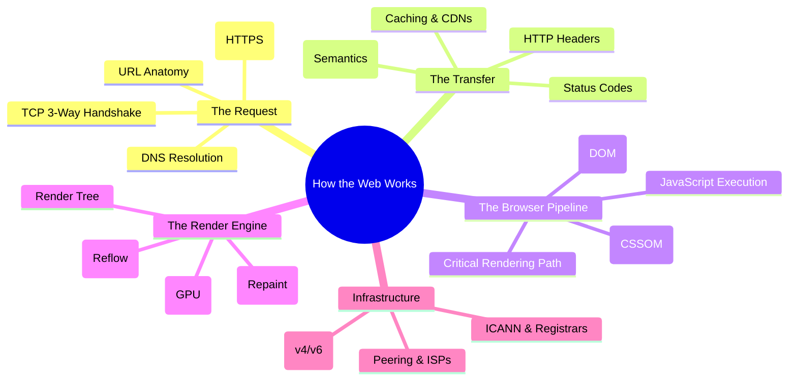

---

## 1. Understanding Domains & URLs

A **URL (Uniform Resource Locator)** is a structured address used to identify and access resources on the internet. It combines networking, naming, and application-layer concepts into a single string.

---

## 1.0 URL Anatomy: The Detailed Breakdown

A URL identifies **what** the resource is, **where** it is located, and **how** the browser should retrieve it.

### Core Components

| Component   | Name                  | Description                                                                                                   |
| :---------- | :-------------------- | :------------------------------------------------------------------------------------------------------------ |
| **https**   | **Scheme (Protocol)** | Defines the rules for data transfer. `https` is secure (TLS encrypted), while `http` is plaintext (insecure). |
| **www**     | **Subdomain**         | A subdivision of the main domain used for routing (e.g., `api`, `mail`, `blog`).                              |
| **google**  | **Domain (SLD)**      | The unique brand name registered to an organization (Second-Level Domain).                                    |
| **.com**    | **TLD**               | The Top-Level Domain suffix (e.g., `.org`, `.edu`, `.in`).                                                    |
| **/search** | **Path**              | The specific directory or resource location on the server.                                                    |
| **?q=web**  | **Query Parameters**  | Key-value pairs used for filtering or searching. `q` is the key, `web` is the value.                          |
| **#top**    | **Fragment**          | An internal page anchor (client-side only). The server ignores this.                                          |

### Full URL Mapping Example

`https://www.google.com/search?q=web#results`

- **Protocol:** `https`
- **Host:** `www.google.com` (Subdomain + Domain + TLD)
- **Path:** `/search`
- **Query String:** `?q=web`
- **Fragment:** `#results`

---

## 1.1 Domain Hierarchy and DNS Structure

Domains are organized in a tree-like hierarchy managed globally by **ICANN**.

```text
. (Root)
└── TLD (Top-Level Domain)      → .com, .org, .edu, .gov, .in, .au
    └── SLD (Second-Level Domain) → google.com, microsoft.com, example.org
        └── Subdomain           → www.google.com, api.google.com, docs.google.com
```

- **Root (.)**: Implicit and absolute; it sits at the very top but is never typed by users.
- **TLD**: Managed by registries. Can be generic (`.com`) or country-specific (`.in`).
- **SLD**: This is what companies purchase through registrars (e.g., GoDaddy, Namecheap).
- **Subdomain**: Fully controlled by the domain owner to isolate services (e.g., `staging.website.com`).

---

## 1.2 Domain to IP Mapping (DNS Resolution)

Machines do not communicate via "google.com"; they use **IP Addresses**. The **DNS (Domain Name System)** acts as the phonebook of the internet.

1.  **Browser Request:** User types `www.google.com`.
2.  **DNS Lookup:** The browser queries a DNS Resolver to find the IP.
3.  **Mapping:** `www.google.com` $\rightarrow$ `142.250.198.78` (IPv4), `IPv6: 2404:6800:4009:80b::200e`.
4.  **Connection:** The browser initiates a TCP/TLS handshake with that specific IP.

---

## 1.3 URL vs Domain vs IP: Comparison

| Term           | What it is                     | Human-Readable | Example                               |
| :------------- | :----------------------------- | :------------- | :------------------------------------ |
| **URL**        | Complete address of a resource | ✅             | `https://www.google.com/search?q=web` |
| **Domain**     | Website's brand/identity       | ✅             | `google.com`                          |
| **Subdomain**  | Division of a domain           | ✅             | `www.google.com`                      |
| **IP Address** | Server's network address       | ❌             | `142.250.198.78`                      |

---

## 1.4 Visual Breakdown (Mermaid Graph)

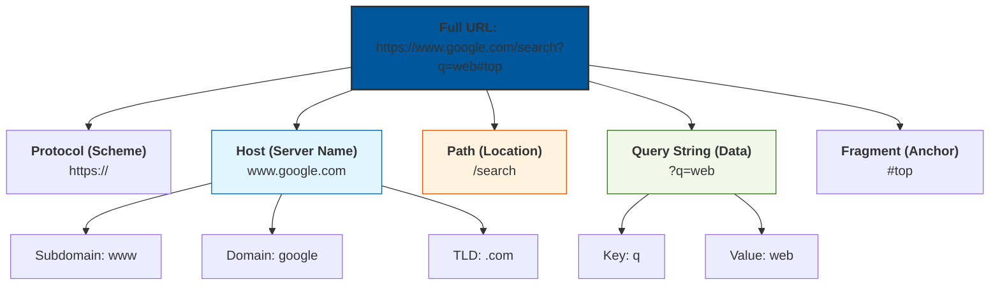

---

## 1.5 URL vs URI vs URN

These terms are technically different despite being used interchangeably in daily development.

### Formal Definitions

| Term    | Full Form                       | Meaning                                                      | Usage              |
| :------ | :------------------------------ | :----------------------------------------------------------- | :----------------- |
| **URI** | Uniform Resource **Identifier** | The superset. Any string that identifies a resource.         | **Identification** |
| **URL** | Uniform Resource **Locator**    | A URI that identifies **where** it is and **how** to get it. | **Location**       |
| **URN** | Uniform Resource **Name**       | A URI that identifies a resource by a **unique name**.       | **Identity**       |

> **The Gold Rule:** "All URLs are URIs, and all URNs are URIs, but not all URIs are URLs."

### The "Person" Analogy

- **URI (Identifier):** Your **Full Identity**. Anything that points to "You" (Name, Address, or SSN).
- **URL (Locator):** Your **Home Address**. It tells people exactly where to go to find you. If you move houses, your URL changes.
- **URN (Name):** Your **Social Security Number**. It is a unique ID that stays with you forever, regardless of where you live.

### Real-World URN Examples (Persistent Identity)

- **Books:** `urn:isbn:9780132350884` (Identifies the book even if the URL to buy it changes).
- **Software IDs:** `urn:uuid:6e8bc430-9c3a-11d9-9669-0800200c9a66`.
- **Standards:** `urn:ietf:rfc:2648`.

---

## 1.6 REST & API Perspective

For developers, URLs are the interface of the API.

- **Path Identifies:** Use nouns for resources (e.g., `/users/123`).
- **Query Modifies:** Use for filtering or sorting (e.g., `?sort=desc`).
- **HTTPS is Mandatory:** REST APIs must use TLS for security and data integrity.

---

## 1.7 Key Takeaways

1.  **URL $\neq$ Domain:** The domain is just one part of the URL.
2.  **Path identifies WHAT:** (The resource on the server).
3.  **Query modifies HOW:** (Filtering/sorting the representation).
4.  **Fragment is Client-Only:** Browsers use it to scroll; servers never receive it.
5.  **Memory Hook:**
    - **URI** $\rightarrow$ Who is it? (The Concept)
    - **URL** $\rightarrow$ Where is it? (The Address)
    - **URN** $\rightarrow$ What is its name? (The Unique ID)
6.  **Common Protocol(Schemes)**
    - http → plain text (❌ insecure)
    - https → encrypted via TLS (✅ mandatory)
    - ws / wss → WebSockets
    - ftp, mailto, file
    - HTTPS ≠ authentication, only encryption
    - TLS handshake happens before HTTP
    - REST APIs must use HTTPS only
7.  **API Mapping**
    - Scheme → security
    - Host → environment
    - Path → resource identity
    - Query → modifiers
    - Headers → auth, metadata
    - Body → state transfer
8.  Fragment(Anchor or **#**) **_never reaches server or send to server_**, it only used to store some extra information in url on client side to share or scroll to that particular section.
9.  REST = URL + HTTP semantics
    > HTTP semantics = shared contract between client, server, proxies, and caches.

> Mapping governed by **ICANN**, registrars, and DNS infrastructure.
> Governance

- ICANN → policy
- Registrars → domain sales
- DNS providers → resolution infrastructure

---

## 2. What Happens When You Hit Enter

### 2.0 Client-Side Pre-Flight: Keyboard, Omnibox, & HSTS Preloads

Before the browser even attempts to talk to the network card or lookup a DNS record, three critical events happen on the client machine:

1. **Hardware Keyboard Interrupts:**
   - When you press the keys of a URL and hit "Enter", the physical key triggers an electrical connection. The keyboard controller detects this and generates a **scan code** (an identifier for the key).
   - The controller fires an interrupt request (**IRQ 1**) to the CPU.
   - The OS kernel catches the interrupt, maps the scan code using the active keyboard layout, and places the characters into the message queue of the active window manager.
   - The OS notifies the browser process, which receives key events (like `keydown` and `keypress`) on its main UI thread.
2. **The "Omnibox" Parsing Logic:**
   - The browser's URL bar [Omnibox](https://www.chromium.org/user-experience/omnibox) parses the text.
   - It checks if the string starts with a valid protocol scheme (like `http://`, `https://`, `ftp://`) or matches a valid domain format (containing a registered TLD like `.com`, `.org`).
   - **URL:** If it matches a URL format, the browser keeps the target hostname.
   - **Search Query:** If the text does not match a URL (e.g., you typed "react fundamentals"), the browser appends it as query parameters to your default search engine's search template (e.g., `https://google.com/search?q=react+fundamentals`).
3. **The HSTS Preload List Check:**
   - Once a URL is confirmed, the browser checks its built-in, hardcoded **HSTS (HTTP Strict Transport Security) Preload List**.
   - If the domain is on the list (e.g., `gmail.com`, `stripe.com`, `github.com`), the browser immediately rewrites the URL scheme from `http://` to `https://` internally.
   - This prevents "bootstrap" man-in-the-middle attacks where a hacker intercepts the initial insecure HTTP request before the server can redirect the user to HTTPS.

---

### 2.1 Browser Pre‑Checks (Before Network)

The client checks **before hitting the router**:

1. Browser **Memory / Disk Cache**
2. **Service Worker cache**
3. **OS‑level DNS cache**

If found → **network request is skipped**

---

### 2.2 Full Request Flow (High Level)

```

Client
→ Router
→ ISP
→ DNS
→ Server
→ HTML / CSS / JS / Images
← streamed back to client

```

## 3. DNS Resolution (Name → IP)

**Intermediate Note:** DNS translates human-readable names to machine IPs. It's like looking up a phone number from a name.

### 3.1 Domain → IP Mapping Authority

- Domain ↔ IP guidelines governed by **ICANN**
- Registrars & ISPs must follow ICANN policies
- **WHOIS** exposes domain metadata
- **WHOIS Privacy Protection** hides owner identity

### 3.2 DNS lookup flow

```

Browser
→ Router
→ ISP resolver
→ Root DNS
→ TLD DNS (.com)
→ Authoritative DNS (google.com)

```

- Result is cached at multiple layers
- TTL controls cache lifetime

### 3.3 Peering (why Google is fast)

- **Peering** = fewer network hops
- Google, Cloudflare, Meta peer directly with ISPs
- Result: lower latency, faster TTFB

---

## 4. Transport Layer (Connection Setup)

### 4.0 Local Routing, ARP, & NAT

Before a TCP connection can establish, the client must package the raw data and route it out of the local network:

1. **ARP (Address Resolution Protocol) Request:**
   - The OS wraps the TCP/IP packet in an Ethernet frame. To send the frame, the OS needs the physical **MAC Address** of the local default gateway (the home or office router).
   - The OS checks its local ARP cache. If the gateway's IP is not mapped, the OS broadcasts an ARP Request frame (`Who has 192.168.1.1? Tell 192.168.1.50`).
   - The router responds with its MAC address (`192.168.1.1 is at 00:1A:2B:3C:4D:5E`), allowing the OS to address and transmit the frame to the router.
2. **NAT (Network Address Translation):**
   - Home and office networks use private IP addresses (e.g., `192.168.x.x`) which cannot be routed over the public internet.
   - As the packet passes through the router, the router performs **NAT**. It replaces the client's private source IP and source port with the router's single public IP address and a dynamically allocated unique port number.
   - The router logs this translation in its NAT mapping table so it knows where to route incoming response packets.
3. **BGP (Border Gateway Protocol) Routing:**
   - Once the packet reaches the Internet Service Provider (ISP), it travels across multiple Autonomous Systems (AS) via the internet backbone.
   - Core internet routers use **BGP** to dynamically share path availability and routing tables, ensuring the packet takes the most efficient route to the server's public IP address.

---

### 4.1 TCP 3‑Way Handshake (Guaranteed Delivery)

```

Client → SYN
Server → SYN + ACK
Client → ACK

```

Purpose:

- Confirms both sides are reachable
- Establishes sequence numbers
- Enables retransmission & ordering

> Used by **HTTP/1.1**, **HTTP/2**, **HTTPS**, **WebSocket**

---

## 5. Security Layer (TLS / SSL)

### 5.1 Encryption / Decryption Flow (HTTPS)

1. Client sends **ClientHello**
2. Server responds with **certificate + public key**
3. Client verifies certificate (CA chain)
4. Client generates **session key**
5. Session key encrypted using server public key
6. Server decrypts using private key

After this:

- All data uses **symmetric encryption** (fast)
- No one can read packets in transit

> TLS happens **after TCP**, before HTTP data

---

### 5.2 TLS 1.3 and 0-RTT Optimization

Modern sites use **TLS 1.3**, which significantly improves connection performance compared to TLS 1.2:

- **1-RTT Handshake:** In TLS 1.2, the cryptographic negotiation required two round-trips. TLS 1.3 combines key exchange negotiations into the very first packet (`ClientHello`), reducing the handshake latency to just **1 RTT**.
- **0-RTT Session Resumption:** When a returning client reconnects to a server it has previously visited, it uses a **Pre-Shared Key (PSK)**. The client can encrypt and send application-level HTTP data in the very first packet (`ClientHello` + GET request), achieving **0-RTT** connection setup time.

---

## 6. HTTP Semantics: The Shared Contract of the Web

HTTP semantics define the **meaning and expected behavior** of HTTP methods, status codes, headers, and caching rules. It is not just about how data is sent, but what the request is supposed to accomplish and how the server—and every proxy in between—should react.

> **The Golden Rule:** REST APIs work because they respect HTTP semantics. Violating these rules breaks tooling, prevents caching, and kills scalability.

---

## 6.1 HTTP Method Semantics

Methods are not just verbs; they define the "contract" of the request.

### The Method Matrix

| Method      | Semantic Meaning                    | Safe | Idempotent | Cacheable |
| :---------- | :---------------------------------- | :--: | :--------: | :-------: |
| **GET**     | Retrieve a representation           |  ✅  |     ✅     |    ✅     |
| **POST**    | Create a resource or trigger action |  ❌  |     ❌     |    ❌     |
| **PUT**     | Replace a resource (Upsert)         |  ❌  |     ✅     |    ❌     |
| **PATCH**   | Partial modification                |  ❌  |     ❌     |    ❌     |
| **DELETE**  | Remove a resource                   |  ❌  |     ✅     |    ❌     |
| **HEAD**    | GET but without the body            |  ✅  |     ✅     |    ✅     |
| **OPTIONS** | Discover server capabilities        |  ✅  |     ✅     |    ❌     |

### Key Semantic Rules

- **GET:** Must **not** change server state. It is a "read-only" operation.
- **POST:** The "catch-all" for non-idempotent actions. Repeating a POST may create duplicate resources.
- **PUT:** The client provides the _entire_ resource. If you call it 10 times with the same body, the result on the server is identical to calling it once (**Idempotency**).
- **DELETE:** Deleting a resource that is already gone should still result in a successful state (usually 204 or 404), but the server state remains "deleted."

---

## 6.2 Status Code Semantics

Status codes allow the client to understand the result of a request without parsing the body.

### Success (2xx)

- **200 OK:** Standard success. Example: GET /users returns user list.
- **201 Created:** Successful creation (usually returned with a `Location` header). Example: POST /users creates new user, returns 201 with Location: /users/456.
- **204 No Content:** Success, but there is no body to return (common for DELETE/PUT). Example: DELETE /users/123 returns 204.

### Client Errors (4xx)

- **400 Bad Request:** The server cannot process the request due to client error (e.g., malformed syntax). Example: Invalid JSON in POST body.
- **401 Unauthorized:** Authentication is required and has failed or not been provided. Example: Missing API key.
- **403 Forbidden:** The client is authenticated but does not have permission for this resource. Example: User trying to access admin endpoint.
- **404 Not Found:** The resource does not exist. Example: GET /users/999 when user doesn't exist.
- **409 Conflict:** State conflict (e.g., trying to create a user with an email that already exists). Example: Duplicate email registration.
- **422 Unprocessable Entity:** Validation error (syntax is correct, but logic is wrong). Example: Password too short.

### Server Errors (5xx)

- **500 Internal Server Error:** Generic "something went wrong" on the server. Example: Database connection failure.
- **502 Bad Gateway:** One server received an invalid response from another (proxy issue). Example: Upstream API down.
- **503 Service Unavailable:** Server is overloaded or down for maintenance. Example: Server under heavy load.

---

## 6.3 Header Semantics (Metadata with Meaning)

Headers provide the context required to process the request and response correctly.

| Type         | Header          | Semantic Purpose                                                    |
| :----------- | :-------------- | :------------------------------------------------------------------ |
| **Request**  | `Authorization` | Identity and credentials.                                           |
| **Request**  | `Accept`        | Tells the server: "I want the response in this format (JSON, XML)." |
| **Response** | `Content-Type`  | Tells the client: "This body is formatted as JSON."                 |
| **Response** | `Location`      | The URL of a newly created resource (used with 201).                |
| **Response** | `ETag`          | A unique version identifier for caching.                            |

---

## 6.4 Content Negotiation

Clients and servers use headers to agree on the format of the data. This is what allows an API to serve JSON to a web app and Protobuf to a mobile app using the same URL.

```http
GET /users/1
Accept: application/json
```

_The server sees `Accept` and responds with `Content-Type: application/json`._

---

## 6.5 Caching Semantics

Caching is the primary way the web scales. It is controlled by headers that tell intermediaries (CDNs, Browsers) how long to keep data.

### Cache-Control Directives

- **`public`**: Anyone can cache it (Browser, CDN, Proxy).
- **`private`**: Only the end-user's browser can cache it.
- **`no-store`**: Do not save this request/response anywhere. **(Security critical)**
- **`max-age`**: How long the resource is "fresh" in seconds.

### Conditional Requests (The 304 Flow)

1.  Client sends `If-None-Match: "etag123"`.
2.  If the data hasn't changed, the server sends **304 Not Modified**.
3.  **Result:** Zero bandwidth spent on the body.

---

## 6.6 Safety & Idempotency (For Distributed Systems)

These concepts are vital for handling network failures.

- **Safe Methods:** Methods that don't change state (GET, HEAD). You can pre-fetch these or retry them infinitely.
- **Idempotent Methods:** Methods where the side-effect of N requests is the same as 1 request (PUT, DELETE). If a network timeout occurs, a Load Balancer can safely retry a PUT request.
- **Non-Idempotent (POST):** Cannot be safely retried automatically. If you retry a "Charge Credit Card" POST, you might charge the customer twice.

---

## 6.7 HTTP vs. REST Semantics

| Feature     | HTTP                           | REST                                 |
| :---------- | :----------------------------- | :----------------------------------- |
| **Role**    | The Protocol (The "How")       | Architectural Style (The "Design")   |
| **Focus**   | Methods, Status Codes, Headers | Resources, Statelessness, HATEOAS    |
| **Context** | Transporting data packets      | Modeling business logic as resources |

---

## 6.8 Common Semantic Anti-Patterns

- ❌ **Using GET to delete data:** Browsers/crawlers may accidentally trigger deletes.
- ❌ **Returning 200 for everything:** Forcing the client to parse the JSON to see if an error occurred.
- ❌ **Returning 500 for validation:** 500 means the _code_ broke; 422/400 means the _user_ sent bad data.
- ❌ **Actions in URLs:** `POST /deleteUser` violates REST; it should be `DELETE /users/id`.

---

## 6.9 HTTP Semantic Flow

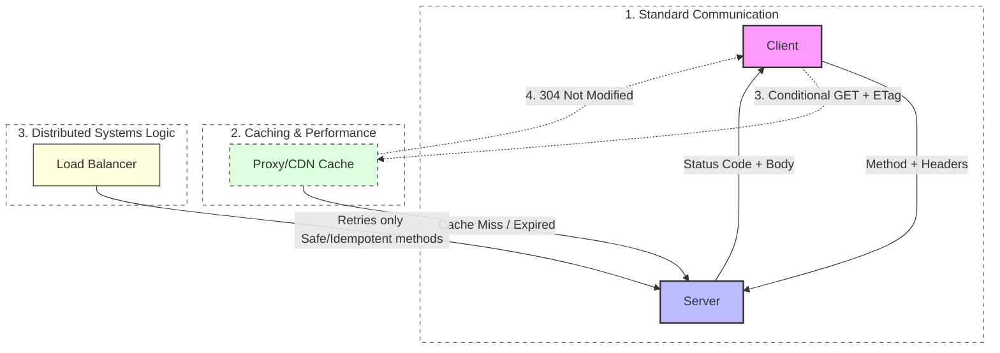

---

## 6.10 Mental Model

**HTTP semantics = A shared contract.**

When you follow the contract, the entire internet (Browsers, CDNs, Load Balancers, API Gateways) knows how to help your application run faster and more reliably. When you break the contract, you are on your own.

**Summary:** HTTP methods define actions (GET for read, POST for create), status codes indicate results (200 OK, 404 Not Found), headers add metadata, and caching optimizes performance. Always follow these semantics for scalable, secure APIs. For real-time communication, see [WebSockets](https://developer.mozilla.org/en-US/docs/Web/API/WebSockets_API).

## 7. HTTP Request & Response

### 7.1 Client → Server Data Flow

```

Client
→ Router
→ ISP
→ DNS
→ Server
→ HTML / CSS / JS / Images
← streamed back to client

```

### 7.2 Browser Pre‑Request Checks

Before hitting the network:

- Browser **Memory Cache / Disk Cache**
- **Service Worker cache** (if present)
- **OS‑level DNS cache**

If found → **network call skipped**

### 7.3 HTTP request

```

GET /index.html HTTP/1.1
Host: example.com

```

### 7.4 Response streaming (important correction)

- Data is **not fixed to 14kb / 28kb / 56kb**
- Chunking depends on:
  - TCP Congestion Window (cwnd)
  - RTT (Round-Trip Time)
  - OS TCP stack tuning
  - Browser networking implementation
  - Lower RTT = faster page loads

Correct mental model:

> **Data streams progressively, size is adaptive.**

---

## 8. Browser Resource Scheduling

### 8.1 Parallel Network Requests

- Browsers allow **~6–8 parallel connections per origin**
- Extra requests are **queued**

You can inspect this at:

```

DevTools → Network → Timing → Queueing

```

This delay appears as **Resource Scheduling Queueing**

---

## 9. HTML Parsing → DOM

### 9.1 Parsing HTML

- HTML is parsed **top‑down**
- Tokens → Nodes → **DOM Tree**

```

html
├── head
│ ├── link
│ └── script
└── body
└── div
└── p

```

---

## 10. CSS Parsing → CSSOM

### 10.1 CSSOM

- CSS is parsed into **CSSOM**
- Represents computed styles

### 10.2 Blocking Rules

- **CSS is Render‑Blocking**
  - Browser cannot paint pixels without final styles
  - Render tree waits for CSSOM

- **JavaScript is Parser‑Blocking**
  - JS can modify DOM/CSSOM
  - HTML parsing pauses until JS executes
  - Exceptions:
    - `defer` → runs after DOM is parsed
    - `async` → runs as soon as downloaded (race)

- Browser **cannot paint without styles**

- Hence: **CSS = render‑blocking**

---

## 11. JavaScript Loading & Execution

### 11.1 Why JS blocks parsing

- JS can mutate DOM
- Browser must pause parsing to execute

### 11.2 Script attributes

| Type   | Parser       | Execution        |
| ------ | ------------ | ---------------- |
| normal | blocks       | immediate        |
| defer  | non‑blocking | after DOM parsed |
| async  | non‑blocking | ASAP (race)      |

Golden rule:

> **Use `defer` for almost all scripts.**

---

## 12. DOM + CSSOM → Render Tree

### 12.1 Render Tree rules

Included:

- Visible DOM nodes
- Computed styles

Excluded:

- `display: none`
- `<head>` elements

> DOM ≠ Render Tree

---

## 13. Layout (Reflow)

### 13.1 What layout does

- Calculates:
  - width / height
  - position
  - box model

### 13.2 What triggers reflow

- Changing:
  - width / height
  - position / float
  - font size

Reflow is **expensive**.

---

## 14. Paint

- Converts boxes → pixels
- Text, colors, borders, shadows

Changing these triggers **repaint only**:

- color
- background
- visibility

---

## 15. Compositing, Rasterization, & VSync

Once the painting phase is complete, the browser has compiled drawing instructions (a sequence of commands detailing _what_ should be drawn where), but it has not actually drawn the pixels. The final phase turns these instructions into physical screen pixels:

1. **Layer Tree Creation (Main Thread):**
   - The browser engine creates a separate rendering layer for elements that move independently or display dynamic content (e.g., elements containing `transform`, `opacity`, `<video>`, `<canvas>`, or CSS `will-change`).
   - This isolates elements so that updating one layer does not force the browser to repaint the entire page.
2. **Tiling (Compositor Thread):**
   - The main thread commits the Layer Tree and paint instructions to the **Compositor Thread**.
   - To prevent memory bloat, the compositor does not rasterize the entire page at once. Instead, it divides each layer into standard-sized **Tiles** (typically 256x256 or 512x512 pixels), prioritizing tiles currently visible within the user's viewport.
3. **Rasterization (Raster Helper Threads):**
   - The compositor thread sends the tiles to **Raster Helper Threads**.
   - Rasterization translates vector paint commands into actual bitmap grids (arrays of color values).
   - **GPU Acceleration:** Modern browsers offload rasterization to the GPU (via WebGL/Vulkan/Metal APIs) for hardware-accelerated drawing, which is extremely fast.
4. **Draw Quads & The GPU Process:**
   - Once tiles are rasterized, the compositor thread generates **Draw Quads** (metadata commands specifying where on the screen each tile should be drawn, taking into account any scale, rotation, or opacity settings).
   - The compositor packages the Draw Quads into a **Compositor Frame** and submits it to the browser's central **GPU Process**.
5. **VSync (Vertical Synchronization):**
   - The GPU Process takes the Compositor Frame and renders the tiles onto the display's **Back-Buffer**.
   - The monitor updates its screen pixels periodically (e.g., 60 times a second for a 60Hz display). When the monitor is ready for the next frame, it fires a **VSync (Vertical Synchronization)** signal.
   - Upon receiving the VSync signal, the GPU performs a buffer swap, moving the back-buffer to the active display output (the front-buffer). This prevents screen tearing and ensures fluid animations.

## 16. Performance Milestones

| Metric | Meaning               |
| ------ | --------------------- |
| FCP    | First content painted |
| DCL    | DOM ready             |
| LCP    | Largest content       |
| TTI    | Page usable           |

**Note:**

1. These are key points in loading a webpage. FCP is when you first see something on screen.
2. Use Chrome DevTools or Web Vitals to measure these. Aim for LCP under 2.5s for good UX. See [Debugging Tools](#35-debugging-tools) for more on using DevTools.

---

## 17. HTTP Versions Comparison

| Feature               | HTTP/1.1 | HTTP/2               | HTTP/3     |
| --------------------- | -------- | -------------------- | ---------- |
| Transport             | TCP      | TCP                  | UDP (QUIC) |
| Head‑of‑Line Blocking | Yes      | Fixed (multiplexing) | No         |
| Multiplexing          | ❌       | ✅                   | ✅         |
| TLS Required          | ❌       | ❌                   | ✅         |
| Mobile Friendly       | ❌       | ⚠️                   | ✅         |

**Note:**

1. HTTP/3 uses QUIC over UDP for faster, more reliable connections, especially on unstable networks like mobile.
2. TCP: TCP (Transmission Control Protocol) is **reliable**, **connection-oriented**, guaranteeing ordered data delivery with error checking, ideal for Web (HTTP/HTTPS), Email (SMTP), File Transfer (FTP). .
3. UDP: UDP (User Datagram Protocol) is **fast**, **connectionless**, offering lower overhead but no delivery guarantees, best for streaming/gaming where speed > perfection. Streaming (Video/Audio), Online Gaming, DNS, VoIP.
4. TCP ensures all data arrives in order; UDP doesn't.
5. TCP resends lost data; UDP doesn't.
6. Netflix uses TCP.
7. OpenVPN's default is to use UDP simply because it is faster.

---

## 18. Peering & ICANN

### 18.1 Peering

- Direct ISP ↔ provider connections
- Fewer hops = lower latency
- Google, Cloudflare excel at peering

### 18.2 ICANN & WHOIS

- **ICANN** governs domain ↔ IP mapping rules
- WHOIS privacy hides owner details
- ISPs & registrars follow ICANN policies

---

## 19. Complete Timeline (URL to Pixels)

### Detailed Browser Rendering & Network Pipeline

1. **User enters URL**
2. **Browser checks cache / Service Worker** (if applicable)
3. **DNS Lookup** (Domain name to IP address)
4. **TCP Connection** (3-Way Handshake)
5. **TLS Handshake** (HTTPS security negotiation)
6. **HTTP Request sent**
7. **Server Processing**
8. **HTTP Response starts**
9. **TTFB (Time To First Byte)**
10. **Response download**
11. **HTML Parsing → DOM** (Document Object Model)
12. **CSS Download + Parse → CSSOM** (CSS Object Model)
13. **JavaScript Download → Parse → Execute**
    - May block parsing (unless marked with `defer` or `async`)
    - May modify the DOM or CSSOM
14. **DOM + CSSOM → Render Tree**
15. **Layout (Reflow)** (Calculating geometry and positions)
16. **Paint** (Converting elements into pixels/drawing layers)
17. **Compositing** (GPU combining painted layers into the final frame)
18. **Pixels displayed on screen (UI visible)**

#### Short Interview Version (Quick Reference)

```text
URL
↓
DNS Lookup
↓
TCP Connection
↓
TLS Handshake
↓
HTTP Request
↓
Server Processing
↓
TTFB
↓
Response Download
↓
DOM
↓
CSSOM
↓
JavaScript Execution
↓
Render Tree
↓
Layout (Reflow)
↓
Paint
↓
Composite
↓
Screen/UI
```

#### Important Notes

> [!NOTE]
> **TTFB (Time To First Byte):** The duration from the user initiating the request until the first byte of the response arrives. It encapsulates DNS resolution, TCP handshake, TLS negotiation, request transmission, and server processing.

> [!IMPORTANT]
> **JavaScript Execution & Parsing:** JS execution can happen while HTML is still being parsed and will block the parser by default, unless the script tag uses `defer` or `async`.

> [!TIP]
> **Compositing:** The final step where the GPU combines the individual painted layers of the page into the final frame displayed to the user on the screen.

---

## 20. Key Mental Models

- **HTML builds DOM**
- **CSS builds CSSOM**
- **DOM + CSSOM = Render Tree**
- **JS blocks parser (unless defer/async)**
- **CSS blocks rendering**
- **Layout is expensive, paint is cheaper**
- **Transform/opacity are GPU‑friendly**
- **Critical Rendering Path (CRP)** = Render Tree → Layout → Paint → Composite

---

## 21. Tips

- Inline critical CSS
- Defer non‑critical JS
- Reduce DOM size
- Avoid layout thrashing
- Use HTTP/2 or HTTP/3
- Prefer CDN + peering
- Optimize images for mobile with responsive attributes (srcset, sizes) to reduce bandwidth
- Implement lazy loading for images and iframes to defer off-screen content
- Minimize render-blocking resources; use async/defer for scripts where possible
- Test mobile performance using Chrome DevTools device emulation and network throttling (see [Debugging Tools](#35-debugging-tools))
- Use code splitting and tree shaking to reduce JavaScript bundle sizes
- Implement service workers for caching and offline functionality in PWAs

---

## 22. One‑Sentence Summary about hit to pixel on ui

> The web is a carefully staged pipeline where **networking latency, parsing order, and rendering cost** decide how fast users see pixels.

**Note:** This summary captures the essence – optimize each step for better performance!

---

## 23. Big Picture Visualization

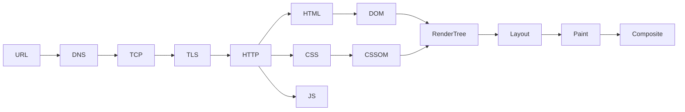

**Beginner Friendly:** This diagram shows how browsers try to avoid slow network requests by checking local caches first.

---

## 24. Browser Pre-Checks Visualization

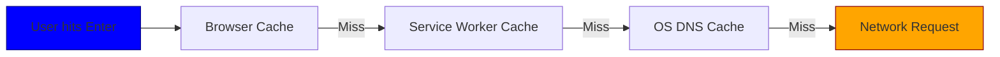

**Takeaway:** network is last resort.

---

## 25. Full Request Flow Visualization

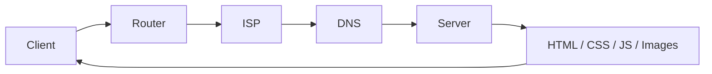

**Intermediate:** This sequence shows the hierarchical DNS query process, from local to authoritative servers.

---

## 26. DNS Resolution Visualization

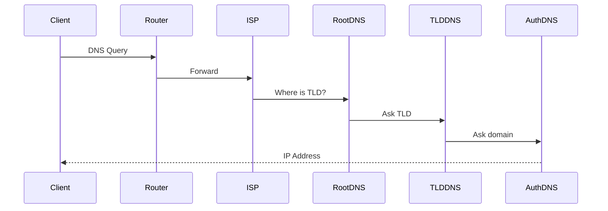

---

## 27. TCP 3-Way Handshake Visualization

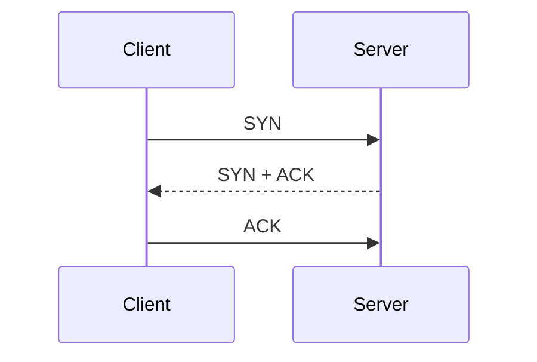

**RTT cost:** 1 RTT
**Note:** The handshake establishes encrypted communication securely.

---

## 28. TLS Handshake Visualization

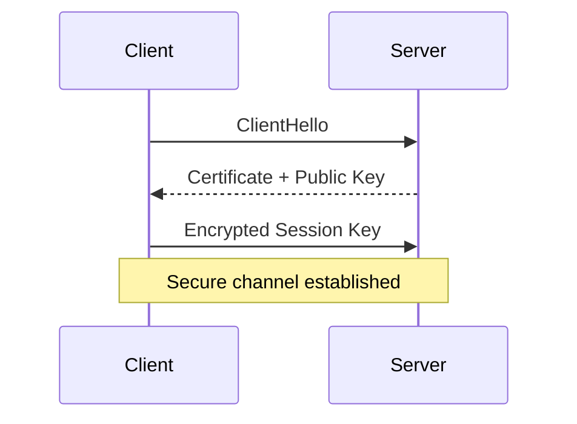

---

## 29. 1-RTT vs Multi-RTT Visualization

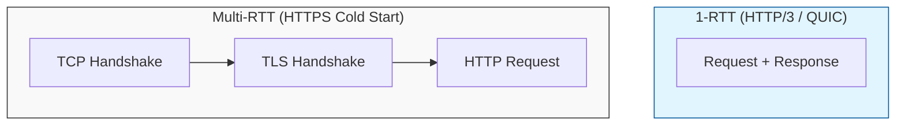

---

## 30. Critical Rendering Path Visualization

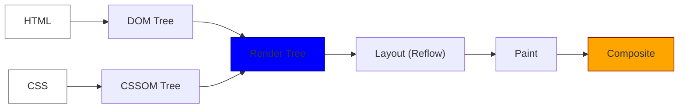

**Note:** This class diagram compares web protocols and their OSI layer mappings.

---

## 31. Web Protocol Comparison Diagram

```mermaid
classDiagram
    class Protocol {
        <<Interface>>
        +String Layer
        +String Transport
        +String Port
        +HowItWorks()
        +UseCases()
    }

    class HTTP {
        +Layer: 7 (Application)
        +Transport: TCP
        +Port: 80
        +Mechanism: Stateless Request/Response
        +UseCases: Web Browsing, REST APIs
    }

    class HTTPS {
        +Layer: 7 (Application)
        +Transport: TCP + TLS/SSL
        +Port: 443
        +Mechanism: TCP Handshake -> TLS Handshake (Public Key -> Session Key)
        +UseCases: Secure Banking, E-commerce
    }

    class HTTP3_QUIC {
        +Layer: 7 / 4 Hybrid
        +Transport: UDP
        +Port: 443
        +Mechanism: 0-RTT Handshake, Multiplexing (No Head-of-Line Blocking)
        +UseCases: VR/AR, IoT, High-speed Web
    }

    class WebSocket {
        +Layer: 7 (Application)
        +Transport: TCP
        +Port: 80/443
        +Mechanism: HTTP Upgrade -> Persistent Full-Duplex
        +UseCases: Live Chat, Real-time Trading, Gaming
    }

    class TCP {
        +Layer: 4 (Transport)
        +Mechanism: 3-Way Handshake (SYN -> SYN+ACK -> ACK)
        +Features: Reliable, Ordered delivery, Retransmission
        +UseCases: Email, Web, File Transfer
    }

    class UDP {
        +Layer: 4 (Transport)
        +Mechanism: Fire-and-Forget (No Handshake)
        +Features: Low Latency, Unreliable, Fast
        +UseCases: Video Calls, Streaming, Gaming
    }

    class SMTP {
        +Layer: 7 (Application)
        +Transport: TCP
        +Port: 25, 587
        +Mechanism: Push Protocol (Sender -> SMTP Server -> Receiver)
        +UseCases: Sending Emails
    }

    class FTP {
        +Layer: 7 (Application)
        +Transport: TCP
        +Port: 21 (Control), 20 (Data)
        +Mechanism: Dual-Channel (Control vs Data)
        +UseCases: Uploading/Downloading large files
    }

    HTTP --|> Protocol
    HTTPS --|> Protocol
    HTTP3_QUIC --|> Protocol
    WebSocket --|> Protocol
    TCP --|> Protocol
    UDP --|> Protocol
    SMTP --|> Protocol
    FTP --|> Protocol

```

---

### 31.1 Detailed Breakdown of "How It Works"

| Protocol      | How It Works (Step-by-Step)                     | Technical Detail                                                                    |
| :------------ | :---------------------------------------------- | :---------------------------------------------------------------------------------- |
| **HTTP**      | `TCP Connection` ➔ `Request` ➔ `Response`       | **Stateless:** Each request is independent; uses Cookies/Sessions for state.        |
| **HTTP/3**    | `UDP Connection` ➔ `QUIC Handshake` ➔ `Streams` | **Zero-RTT:** Reconnecting to a known server requires 0 round trips.                |
| **HTTPS**     | `TCP` ➔ `Certificate Verify` ➔ `Key Exchange`   | **PFS:** Uses _Perfect Forward Secrecy_ so old leaked keys can't decrypt past data. |
| **WebSocket** | `HTTP GET + Upgrade Header` ➔ `101 Switching`   | **Persistent:** Stays open indefinitely until one side closes it.                   |
| **TCP**       | `SYN` ➔ `SYN + ACK` ➔ `ACK`                     | **Congestion Control:** Automatically slows down if the network is busy.            |
| **UDP**       | `Source IP/Port` ➔ `Target IP/Port`             | **Check-sum only:** No delivery guarantee; packets can arrive out of order.         |
| **SMTP**      | `HELO/EHLO` ➔ `MAIL FROM` ➔ `RCPT TO`           | **Relay:** Designed to jump between servers until it reaches the destination.       |
| **FTP**       | `Auth on Port 21` ➔ `Transfer on Port 20`       | **Active vs Passive:** Can be blocked by firewalls depending on the mode.           |

### 31.2 Key Takeaways for Mental Model:

1.  **Transport is the Foundation:** All "Application" protocols (HTTP, SMTP, FTP) must choose between **TCP** (Reliable/Slow) or **UDP** (Fast/Unreliable).
2.  **The "Nonce" connection:** In HTTPS (and Web security like CSP), **Nonces** are random numbers used to ensure that a cryptographic session or a script tag is unique and cannot be replayed by a hacker.
3.  **HTTP/3 is the Future:** By moving to UDP (QUIC), it fixes the "Head-of-Line Blocking" problem where one slow packet used to freeze the entire website load.

## 31.3 The 7 OSI (Open Systems Interconnection) Layers (Brief Intro)

- **Layer 7: Application** – The "Interface" (What you see: HTTP, WebSocket, SMTP).
- **Layer 6: Presentation** – The "Translator" (Encryption/SSL, Compression).
- **Layer 5: Session** – The "Manager" (Starts/Stops conversations).
- **Layer 4: Transport** – The "Courier" (Reliable TCP vs. Fast UDP).
- **Layer 3: Network** – The "Navigator" (IP addresses and Routing).
- **Layer 2: Data Link** – The "Bridge" (Local hardware, MAC addresses).
- **Layer 1: Physical** – The "Wire" (Electrical signals, cables, bits).

---

### 31.4 Protocol to OSI Mapping

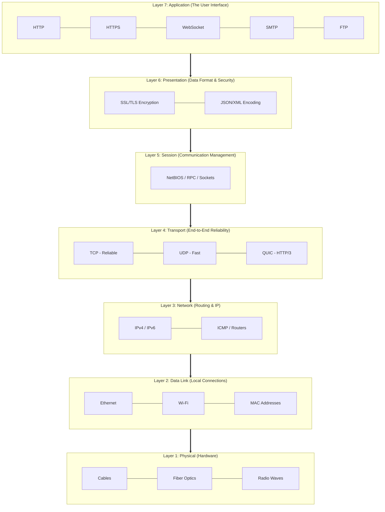

### 31.5 Why this matters for "How the Web Works":

1.  **Top-Down Execution:** When you type a URL, the data starts at **L7 (HTTP)**, gets encrypted at **L6 (TLS)**, and is broken into segments at **L4 (TCP)** before traveling down the physical wire.
2.  **Troubleshooting:** If your "Internet is down," it's usually **L1 or L2** (cable unplugged). If the "Website is slow," it's usually **L4 (TCP Congestion)** or **L7 (Heavy JS code)**.
3.  **Encapsulation:** Every layer adds its own "header" (metadata) to the data packet as it moves down. When it reaches the server, the server peels these headers off one by one (Decapsulation) to see the original request.

---

---

## Senior/Staff Level "Grill" Questions

### Q1: How does "Resource Prioritization" work in HTTP/2 vs. HTTP/3?

> **Answer:**
>
> - **HTTP/2:** Uses **Dependency Trees** and **Weights**. The browser builds a complex graph of resources (e.g., CSS depends on HTML). The server tries to follow this graph, but it's complex and often implemented poorly by servers.
> - **HTTP/3 (QUIC):** Moves to **Extensible Priorities**. It uses a simpler scheme where the client sends a `priority` header with each stream. It focuses on **Sequential vs. Concurrent** loading, which is much easier for servers to implement correctly and prevents "Bufferbloat."

### Q2: Explain the "Preload Scanner" and why it's the browser's most important performance optimization.

> **Answer:** The primary HTML parser can be blocked by synchronous scripts. If the browser waited for each script to finish, it wouldn't "see" the images and CSS further down the page until minutes later.
>
> - **The Solution:** The **Preload Scanner** is a secondary, lightweight parser that runs ahead of the main parser. It "scans" the HTML for `src` and `href` attributes and starts downloading them in the background while the main thread is blocked.
> - **Architect's Nuance:** This is why "Hidden" resources (e.g., images loaded via JS or `background-image` in CSS) are slow—the Preload Scanner can't see them!

### Q3: What is "Layout Thrashing" and how do you detect it in a large-scale React app?

> **Answer:** Layout Thrashing (also called Forced Synchronous Layout) occurs when you write to the DOM and then immediately read a geometric property (like `offsetHeight`) in a loop.
>
> - **The Problem:** React's virtual DOM usually batches updates to the end of the frame. But if you "read" geometry, the browser is forced to perform a **Layout** _right now_ to give you the correct value.
> - **Detection:** Use the **Chrome DevTools Performance Tab**. Look for "Recalculate Style" or "Layout" events that are triggered multiple times within a single frame (marked with a red triangle).

### Q4: How does QUIC handle "IP Migration" and why is it a game-changer for mobile?

> **Answer:** TCP connections are tied to a 4-tuple (Source IP, Source Port, Dest IP, Dest Port). If you move from WiFi to 4G, your IP changes, the TCP connection breaks, and you must perform a full Handshake again.
>
> - **The QUIC Solution:** QUIC uses a **Connection ID (CID)** that is independent of the IP address. If your IP changes, the client sends a "Probe" with the same CID. The server recognizes the CID and continues the session without a new handshake.

---

## 32. Web Architecture Deep Dive

**Note:** This section bridges the technical pipeline with high-level web architectures, catering to architects and engineers designing scalable systems.

Web architecture has evolved from simple client-server models to complex, scalable systems. Traditional client-server setups involve browsers requesting HTML/CSS/JS from servers, evolving into dynamic apps via REST or GraphQL APIs. Rendering strategies include Single Page Applications (SPAs), which load a shell and update the DOM via JavaScript for fast interactions but face SEO and load time challenges—mitigated by Server-Side Rendering (SSR) for per-request rendering or Static Site Generation (SSG) for build-time pre-rendering, both improving SEO and perceived speed.

Progressive Web Apps (PWAs) enhance experiences with offline support, installability, and push notifications through Service Workers. For backend scalability, microservices decouple services via APIs, enabling faster deployments despite added networking complexity like API gateways. Content Delivery Networks (CDNs) distribute content globally, reducing latency by caching assets and using edge computing.

Scalability considerations include horizontal scaling with load balancers, multi-tier caching (browser to database), and monitoring via Web Vitals. Architects must align choices with the web pipeline: prioritize CDNs and HTTP/3 for global reach, optimize Critical Rendering Path and JavaScript bundles for interactivity.

**Key Takeaway for Architects:** The web's pipeline (DNS → TCP → HTTP → Render) must align with architecture choices. For global apps, prioritize CDNs and HTTP/3; for interactive apps, optimize CRP and JS bundles.

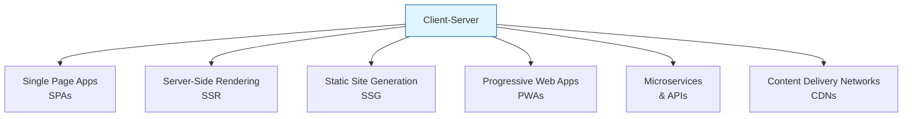

---

## References

- **General Web Fundamentals**
  - MDN Web Docs: [How the Web Works](https://developer.mozilla.org/en-US/docs/Learn/Getting_started_with_the_web/How_the_Web_works)
  - Web.dev: [Critical Rendering Path](https://web.dev/critical-rendering-path/)
  - "Eloquent JavaScript" by Marijn Haverbeke (for JS basics)
- **Networking & Protocols**
  - HTTP/3 Spec: [QUIC Protocol](https://quicwg.org/)
  - RFC 9114: [HTTP/3](https://tools.ietf.org/html/rfc9114)
  - "Computer Networking: A Top-Down Approach" by Kurose & Ross
- **Browser Internals & Performance**
  - "High Performance Browser Networking" by Ilya Grigorik
  - Google Developers: [Rendering Performance](https://developers.google.com/web/fundamentals/performance/rendering)
  - Web.dev: [Web Vitals](https://atulkawasthi.medium.com/react-performance-hacks-make-your-front-end-fly-dca5ab722158)
- **Security**
  - OWASP: [Transport Layer Security](https://cheatsheetseries.owasp.org/cheatsheets/Transport_Layer_Security_Cheat_Sheet.html)
  - "Bulletproof SSL and TLS" by Ivan Ristić
- **Architecture & Best Practices**
  - Martin Fowler: [Microservices](https://martinfowler.com/microservices/)
  - "Designing Data-Intensive Applications" by Martin Kleppmann
  - Web.dev: [Progressive Web Apps](https://web.dev/progressive-web-apps/)

---

## Glossary

- **API (Application Programming Interface):** A set of rules for interacting with software.
- **Cache:** Temporary storage for quick data access.
- **CDN (Content Delivery Network):** Network of servers distributing content globally.
- **CORS (Cross-Origin Resource Sharing):** Mechanism for handling cross-origin requests.
- **CSP (Content Security Policy):** Security standard to prevent XSS attacks.
- **DNS (Domain Name System):** Translates domain names to IP addresses.
- **DOM (Document Object Model):** Tree representation of HTML.
- **Fetch API:** Modern web API for HTTP requests.
- **HTTP (Hypertext Transfer Protocol):** Protocol for web data transfer.
- **HTTPS:** Secure version of HTTP using TLS.
- **ICANN:** Organization managing domain names.
- **IP Address:** Unique identifier for devices on a network.
- **OSI Model:** Framework for network communication layers.
- **PWA (Progressive Web App):** Web app with app-like features.
- **Render Tree:** Combination of DOM and CSSOM for rendering.
- **REST:** Architectural style for APIs.
- **SPDY:** Predecessor to HTTP/2.
- **SSL/TLS:** Protocols for secure communication.
- **TCP (Transmission Control Protocol):** Reliable transport protocol.
- **UDP (User Datagram Protocol):** Fast, unreliable transport protocol.
- **URL (Uniform Resource Locator):** Address for web resources.
- **WebAssembly:** Binary format for high-performance web apps.
- **WebSocket:** Protocol for real-time communication.
