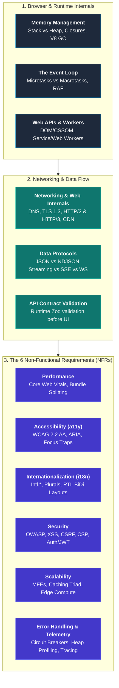
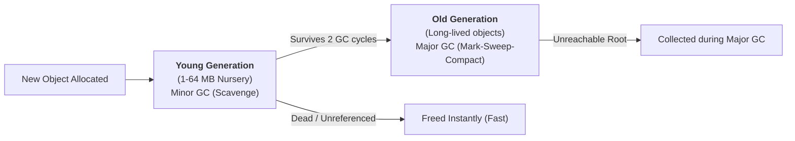
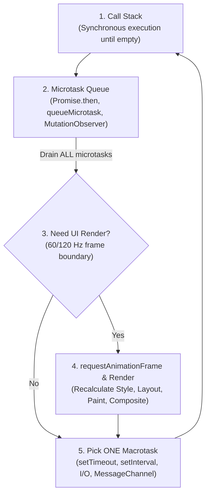
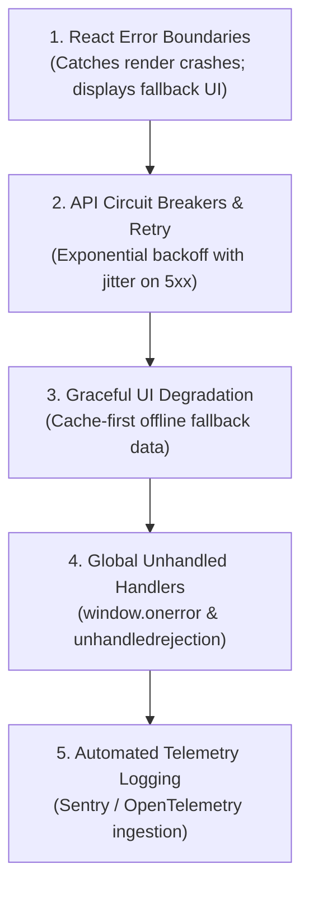
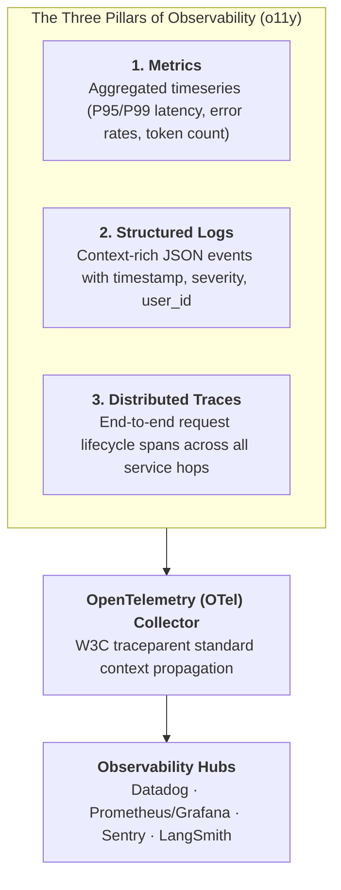

# Core Engineering Pillars & Senior Developer Competency Guide

> A comprehensive architectural and execution reference covering the **12 Fundamental Engineering Pillars** every senior/staff software engineer must master beyond basic syntax: **Performance**, **Networking & HTTP/Web Internals**, **Accessibility (a11y)**, **Internationalization (i18n & l10n)**, **Security Architecture**, **Scalability**, **Memory Mechanics (Heap vs Stack, Closures, V8 GC)**, **The Event Loop**, **Data Serialization (JSON, NDJSON, SSE)**, **Runtime API Contract Validation (Zod)**, **Resilient Error Handling**, and **Production Debugging & Telemetry**.

---

## 🧭 Executive Architecture Map: The 12 Engineering Pillars



---

## Table of Contents

- [Core Engineering Pillars \& Senior Developer Competency Guide](#core-engineering-pillars--senior-developer-competency-guide)
  - [🧭 Executive Architecture Map: The 12 Engineering Pillars](#-executive-architecture-map-the-12-engineering-pillars)
  - [Table of Contents](#table-of-contents)
  - [1. Memory Architecture: Stack, Heap, Closures \& V8 Garbage Collection](#1-memory-architecture-stack-heap-closures--v8-garbage-collection)
    - [Stack vs Heap Allocation](#stack-vs-heap-allocation)
    - [Execution Contexts \& Closures (The Double-Edged Sword)](#execution-contexts--closures-the-double-edged-sword)
    - [V8 Garbage Collection: Generational Scavenger vs Mark-Sweep-Compact](#v8-garbage-collection-generational-scavenger-vs-mark-sweep-compact)
    - [The 4 Classic JavaScript Memory Leaks](#the-4-classic-javascript-memory-leaks)
  - [2. The Event Loop \& Browser Concurrency Model](#2-the-event-loop--browser-concurrency-model)
    - [Call Stack $\\to$ Microtasks $\\to$ Macrotasks $\\to$ Render Step](#call-stack-to-microtasks-to-macrotasks-to-render-step)
  - [3. Networking, HTTP/3 \& How the Web Works](#3-networking-http3--how-the-web-works)
    - [The Anatomy of a URL Request: From Keystroke to Pixels](#the-anatomy-of-a-url-request-from-keystroke-to-pixels)
    - [HTTP Protocol Evolution: HTTP/1.1 vs HTTP/2 vs HTTP/3 (QUIC)](#http-protocol-evolution-http11-vs-http2-vs-http3-quic)
    - [Real-Time Communication: Polling vs SSE vs WebSockets](#real-time-communication-polling-vs-sse-vs-websockets)
    - [Critical HTTP Headers for Production](#critical-http-headers-for-production)
  - [4. Data Serialization: JSON, NDJSON Streaming, SSE \& Protobuf](#4-data-serialization-json-ndjson-streaming-sse--protobuf)
    - [Standard JSON vs NDJSON (Newline Delimited JSON for AI/LLM Streams)](#standard-json-vs-ndjson-newline-delimited-json-for-aillm-streams)
  - [5. API Validation \& Contracts Before Frontend Integration](#5-api-validation--contracts-before-frontend-integration)
    - [Why TypeScript Types Are NOT Enough (Compile-Time vs Runtime)](#why-typescript-types-are-not-enough-compile-time-vs-runtime)
    - [Defensive API Ingestion with Zod Schemas](#defensive-api-ingestion-with-zod-schemas)
  - [6. Performance Engineering \& Core Web Vitals (CWV)](#6-performance-engineering--core-web-vitals-cwv)
    - [The Core Web Vitals Triad (Modern Standards)](#the-core-web-vitals-triad-modern-standards)
    - [Critical Rendering Path (CRP) Optimization](#critical-rendering-path-crp-optimization)
  - [7. Web Accessibility (a11y) Architectural Foundation](#7-web-accessibility-a11y-architectural-foundation)
  - [8. Internationalization (i18n) \& Localization (l10n)](#8-internationalization-i18n--localization-l10n)
  - [9. Security Architecture \& Defensive Engineering](#9-security-architecture--defensive-engineering)
    - [OWASP Frontend Top Security Threats \& Defenses](#owasp-frontend-top-security-threats--defenses)
  - [10. Scalability \& Distributed Frontend Architecture](#10-scalability--distributed-frontend-architecture)
  - [11. Resilient Error Handling \& Fault Tolerance](#11-resilient-error-handling--fault-tolerance)
    - [The 5-Layer Defense Hierarchy](#the-5-layer-defense-hierarchy)
  - [12. Full-Stack \& AI Observability (o11y), Telemetry \& Evaluation Harnesses](#12-full-stack--ai-observability-o11y-telemetry--evaluation-harnesses)
    - [The Three Pillars of Observability Matrix](#the-three-pillars-of-observability-matrix)
    - [Distributed Tracing \& W3C `traceparent` Propagation](#distributed-tracing--w3c-traceparent-propagation)
    - [🧪 What is a "Harness"? (Software, Evaluation \& Agent Harnesses)](#-what-is-a-harness-software-evaluation--agent-harnesses)
      - [Why Evaluation Harnesses are Critical:](#why-evaluation-harnesses-are-critical)
    - [RUM (Real User Monitoring) vs Synthetic Monitoring](#rum-real-user-monitoring-vs-synthetic-monitoring)
  - [🔗 Cross-Referenced Specialized Guides](#-cross-referenced-specialized-guides)

---

## 1. Memory Architecture: Stack, Heap, Closures & V8 Garbage Collection

### Stack vs Heap Allocation

```
┌─────────────────────────────────────────────────────────────────────────────┐
│                             V8 Memory Structure                             │
├──────────────────────────────────────┬──────────────────────────────────────┤
│ 📚 CALL STACK (Fast, Fixed Size)     │ 🏔️ MEMORY HEAP (Dynamic, Managed)    │
├──────────────────────────────────────┼──────────────────────────────────────┤
│ • Primitives (`number`, `boolean`,   │ • Reference objects (`Object`,       │
│   `string`, `null`, `undefined`)     │   `Array`, `Function`, `DOM Nodes`)  │
│ • Function execution frames          │ • Closures & retained context data   │
│ • Pointers referencing Heap addresses│ • Allocated dynamically at runtime   │
│ • Automatically popped when function │ • Cleaned up asynchronously by the   │
│   returns (zero GC overhead)         │   Garbage Collector                  │
└──────────────────────────────────────┴──────────────────────────────────────┘
```

---

### Execution Contexts & Closures (The Double-Edged Sword)

A **Closure** is created when an inner function retains access to its outer enclosing lexical scope even after the outer function has completed execution and left the call stack.

```typescript
function createMetricTracker(metricName: string) {
  // `metricName` and `eventLog` are allocated in Heap and retained
  const eventLog: number[] = [];

  return {
    record(val: number) {
      eventLog.push(val); // Closure retains reference to `eventLog`
      console.log(`[${metricName}] Count: ${eventLog.length}`);
    },
    clear() {
      eventLog.length = 0; // Explicit cleanup avoids unbounded memory growth
    },
  };
}
```

---

### V8 Garbage Collection: Generational Scavenger vs Mark-Sweep-Compact

V8 divides the heap into two generations based on the **Generational Hypothesis** (_"Most objects die young"_):



1. **Minor GC (Scavenge):** Extremely fast (1–3ms). Divides Young Generation into `From-Space` and `To-Space`. Copies alive objects and flips spaces.
2. **Major GC (Mark-Sweep-Compact):** Full stop-the-world or incremental cycle.
   - **Marking:** Traverses root references (Global `window`, DOM tree, active stack frames) to find reachable objects.
   - **Sweeping:** De-allocates dead memory pointers.
   - **Compacting:** De-fragments memory to prevent allocation holes.

---

### The 4 Classic JavaScript Memory Leaks

```
┌─────────────────────────────────────────────────────────────────────────────┐
│                           Common Memory Leak Traps                          │
├───────────────────────┬─────────────────────────────┬───────────────────────┤
│ Cause                 │ Mechanism                   │ Solution              │
├───────────────────────┼─────────────────────────────┼───────────────────────┤
│ **Detached DOM**      │ JS variable references a    │ Set JS reference to   │
│                       │ removed DOM element.        │ `null` on unmount.    │
├───────────────────────┼─────────────────────────────┼───────────────────────┤
│ **Dangling Listeners**│ `addEventListener` attached  │ `removeEventListener` │
│                       │ to `window`/`document`.     │ in `useEffect` return.│
├───────────────────────┼─────────────────────────────┼───────────────────────┤
│ **Uncleared Timers**  │ `setInterval` holding state │ `clearInterval(id)`   │
│                       │ closures continuously.      │ on cleanup.           │
├───────────────────────┼─────────────────────────────┼───────────────────────┤
│ **Global Singletons** │ Unbounded Array/Map caching │ Use `WeakMap`/`WeakSet│
│                       │ without eviction policy.    │ or LRU cache eviction.│
└───────────────────────┴─────────────────────────────┴───────────────────────┘
```

---

## 2. The Event Loop & Browser Concurrency Model

### Call Stack $\to$ Microtasks $\to$ Macrotasks $\to$ Render Step

JavaScript is single-threaded, but the browser runtime provides non-blocking concurrency via the **Event Loop**:



> **The Microtask Law:**
> The Event Loop will **completely exhaust the entire Microtask queue** (including any newly queued microtasks) before moving to rendering or the next macrotask. An infinite `Promise.resolve().then(...)` loop will completely freeze the browser UI!

---

## 3. Networking, HTTP/3 & How the Web Works

### The Anatomy of a URL Request: From Keystroke to Pixels

```
1. DNS Resolution:
   Browser Cache ──▶ OS Cache ──▶ Local DNS Resolver ──▶ Root/TLD Nameserver ──▶ IP Address (e.g. 104.16.12.3)

2. Connection Setup:
   • TCP 3-Way Handshake: SYN ──▶ SYN-ACK ──▶ ACK (1 RTT)
   • TLS 1.3 Handshake: Client Hello ──▶ Server Hello + Certificate + Key Share (1 RTT)
   • (Zero-RTT supported in TLS 1.3 with session resumption / 0-RTT PSK)

3. HTTP Request & Response:
   Client sends HTTP GET headers ──▶ Server processes ──▶ TTFB (Time to First Byte) ──▶ Stream response chunks.

4. Browser Rendering Pipeline:
   HTML Parser ──▶ DOM Tree ───────┐
                                    ├──▶ Render Tree ──▶ Layout (Reflow) ──▶ Paint ──▶ Composite (GPU)
   CSS Parser  ──▶ CSSOM Tree ─────┘
```

---

### HTTP Protocol Evolution: HTTP/1.1 vs HTTP/2 vs HTTP/3 (QUIC)

```
┌─────────────────────────────────────────────────────────────────────────────────────────────┐
│                              HTTP Protocol Evolution Matrix                                 │
├───────────────────┬─────────────────────────────────┬───────────────────────────────────────┤
│ Protocol          │ Transport Layer                 │ Key Architectural Superpower          │
├───────────────────┼─────────────────────────────────┼───────────────────────────────────────┤
│ **HTTP/1.1**      │ TCP                             │ Persistent connections (`Keep-Alive`),│
│                   │                                 │ Head-of-Line (HoL) blocking on socket.│
├───────────────────┼─────────────────────────────────┼───────────────────────────────────────┤
│ **HTTP/2**        │ TCP                             │ Multiplexed binary streams over single│
│                   │                                 │ TCP connection, header compression.   │
├───────────────────┼─────────────────────────────────┼───────────────────────────────────────┤
│ **HTTP/3**        │ **UDP (QUIC)**                  │ Zero HoL blocking on packet loss,     │
│                   │                                 │ instant connection migration (WiFi/5G)│
└───────────────────┴─────────────────────────────────┴───────────────────────────────────────┘
```

---

### Real-Time Communication: Polling vs SSE vs WebSockets

```
┌─────────────────────────────────────────────────────────────────────────────┐
│                      Real-Time Protocols Comparison                         │
├───────────────────┬──────────────────────┬───────────────┬──────────────────┤
│ Mechanism         │ Directionality       │ Protocol      │ Best Use Case    │
├───────────────────┼──────────────────────┼───────────────┼──────────────────┤
│ **Short Polling** │ Client $\to$ Server  │ HTTP/1.1 or 2 │ Infrequent status│
├───────────────────┼──────────────────────┼───────────────┼──────────────────┤
│ **SSE**           │ Server $\to$ Client  │ HTTP/2 or 3   │ AI/LLM streaming,│
│ (Server-Sent Event│ (Unidirectional)     │ `text/event-s`│ stock tickers.   │
├───────────────────┼──────────────────────┼───────────────┼──────────────────┤
│ **WebSockets**    │ Full Duplex (Bi-Dir) │ `ws://` TCP   │ Multiplayer games│
│                   │                      │ handshake     │ collaborative doc│
└───────────────────┴──────────────────────┴───────────────┴──────────────────┘
```

---

### Critical HTTP Headers for Production

```http
# 1. Caching
Cache-Control: public, max-age=31536000, immutable  # For content-hashed assets (.js, .css)
Cache-Control: no-cache, must-revalidate             # For index.html (always check server ETag)
ETag: "33a64df551425fcc55e4d42a148795d9f25f89d4"

# 2. Security
Content-Security-Policy: default-src 'self'; script-src 'self' https://trusted-cdn.com; object-src 'none';
Strict-Transport-Security: max-age=63072000; includeSubDomains; preload
X-Content-Type-Options: nosniff
X-Frame-Options: DENY
```

---

## 4. Data Serialization: JSON, NDJSON Streaming, SSE & Protobuf

### Standard JSON vs NDJSON (Newline Delimited JSON for AI/LLM Streams)

When an AI model generates responses token by token or an analytics engine streams logs, standard JSON cannot be parsed until the closing `}` is delivered. **NDJSON** emits individual, complete JSON objects per line:

```
┌─────────────────────────────────────────────────────────────────────────────┐
│                          Standard JSON vs NDJSON                            │
├──────────────────────────────────────┬──────────────────────────────────────┤
│ ❌ Standard JSON (Buffer All)        │ ✅ NDJSON Stream (Chunk-by-Chunk)    │
├──────────────────────────────────────┼──────────────────────────────────────┤
│ [                                    │ {"token": "Hello", "done": false}\n  │
│   {"token": "Hello"},                │ {"token": " world", "done": false}\n │
│   {"token": " world"}                │ {"token": "!", "done": true}\n       │
│ ]                                    │                                      │
│ (Cannot parse until final `]` arrives│ (Client parses every line instantly  │
│  causing multi-second latency spike) │  via `ReadableStream` & `readline`)  │
└──────────────────────────────────────┴──────────────────────────────────────┘
```

```typescript
// Client-Side Streaming NDJSON Ingestion Engine
async function streamNDJSON(url: string, onChunk: (data: any) => void) {
  const response = await fetch(url);
  const reader = response.body?.getReader();
  const decoder = new TextDecoder();
  let buffer = '';

  if (!reader) return;

  while (true) {
    const { done, value } = await reader.read();
    if (done) break;

    buffer += decoder.decode(value, { stream: true });
    const lines = buffer.split('\n');
    buffer = lines.pop() || ''; // Keep incomplete trailing fragment

    for (const line of lines) {
      if (line.trim()) {
        onChunk(JSON.parse(line));
      }
    }
  }
}
```

---

## 5. API Validation & Contracts Before Frontend Integration

### Why TypeScript Types Are NOT Enough (Compile-Time vs Runtime)

TypeScript interfaces are completely erased during compilation. If the backend changes a field type (e.g. returns `null` instead of an array), the frontend crashes at runtime with `TypeError: Cannot read properties of undefined (reading 'map')`.

---

### Defensive API Ingestion with Zod Schemas

Always parse external untrusted API payloads with runtime schema validators (`Zod`, `Valibot`):

```typescript
import { z } from 'zod';

// 1. Declare Schema as the Single Source of Truth
export const UserProfileSchema = z.object({
  id: z.string().uuid(),
  email: z.string().email(),
  displayName: z.string().min(1),
  role: z.enum(['admin', 'member', 'guest']),
  preferences: z.object({
    theme: z.enum(['light', 'dark', 'system']).default('system'),
    locale: z.string().default('en-US'),
  }),
  createdAt: z.string().datetime(),
});

// 2. Derive Static TypeScript Type automatically
export type UserProfile = z.infer<typeof UserProfileSchema>;

// 3. Resilient Type-Safe Fetcher
export async function fetchUserProfile(userId: string): Promise<UserProfile> {
  const res = await fetch(`/api/users/${userId}`);
  if (!res.ok) throw new Error(`HTTP Error: ${res.status}`);

  const rawJson = await res.json();

  // Safe Parse: Validates payload at runtime
  const parseResult = UserProfileSchema.safeParse(rawJson);
  if (!parseResult.success) {
    console.error('API Contract Violation:', parseResult.error.format());
    throw new Error('Server returned corrupted payload format');
  }

  return parseResult.data; // 100% Guaranteed valid
}
```

---

## 6. Performance Engineering & Core Web Vitals (CWV)

### The Core Web Vitals Triad (Modern Standards)

```
┌─────────────────────────────────────────────────────────────────────────────┐
│                          Core Web Vitals Thresholds                         │
├───────────────┬───────────────────────────────────┬─────────────┬───────────┤
│ Metric        │ What It Measures                  │ Good        │ Needs Work│
├───────────────┼───────────────────────────────────┼─────────────┼───────────┤
│ **LCP**       │ **Largest Contentful Paint**      │ $\le 2.5\text{s}$ │ $> 4.0\text{s}$ │
│               │ (Main visual content loaded).     │             │           │
├───────────────┼───────────────────────────────────┼─────────────┼───────────┤
│ **INP**       │ **Interaction to Next Paint**     │ $\le 200\text{ms}$│ $> 500\text{ms}$│
│               │ (UI responsiveness to clicks/keys)│             │           │
├───────────────┼───────────────────────────────────┼─────────────┼───────────┤
│ **CLS**       │ **Cumulative Layout Shift**       │ $\le 0.1$   │ $> 0.25$  │
│               │ (Visual layout stability).        │             │           │
└───────────────┴───────────────────────────────────┴─────────────┴───────────┘
```

---

### Critical Rendering Path (CRP) Optimization

1. **Defer Non-Critical JS:** `<script src="bundle.js" defer>` or dynamic `import()`.
2. **Inline Critical CSS:** Extract above-the-fold CSS; load remaining stylesheets asynchronously with `rel="preload"`.
3. **Prevent Layout Thrashing (FastDOM):** Never interleave DOM style reads (`offsetHeight`, `getBoundingClientRect`) with DOM writes (`style.height`). Group all reads first, then writes in `requestAnimationFrame`.

---

## 7. Web Accessibility (a11y) Architectural Foundation

- **The 4 POUR Principles:** Perceivable, Operable, Understandable, Robust ([ISO/IEC 40500](file:///Users/atulkumarawasthi/projects/SystemDesign/Accessibility/WCAG_Accessibility.md)).
- **Dialog Focus Rule:** _"Open, trap, return. Three lines of intent, every dialog."_
- **The AccTree Synchronization:** Sync `<html lang="..." dir="...">` with screen reader voice switching.
- 📖 _For complete deep-dive, see [Web Accessibility (a11y) & WCAG Guide](file:///Users/atulkumarawasthi/projects/SystemDesign/Accessibility/WCAG_Accessibility.md)._

---

## 8. Internationalization (i18n) & Localization (l10n)

- **The Architectural Law:** _"i18n is the plumbing. l10n is what flows through it. a11y ensures everyone can use it."_
- **Native `Intl.*` Engine:** Use native `Intl.NumberFormat`, `Intl.DateTimeFormat`, and `Intl.PluralRules` to eliminate Moment.js bundle bloat.
- **The Tokyo Rule:** Route-level namespace code-splitting (`common.ja.json` + `checkout.ja.json`) with graceful English fallbacks.
- 📖 _For complete deep-dive, see [i18n, l10n & RTL Architecture Guide](file:///Users/atulkumarawasthi/projects/SystemDesign/Accessibility/Internationalization_i18n_l10n_a11y.md)._

---

## 9. Security Architecture & Defensive Engineering

### OWASP Frontend Top Security Threats & Defenses

```
┌─────────────────────────────────────────────────────────────────────────────┐
│                          Frontend Security Playbook                         │
├─────────────────────┬─────────────────────────────────┬─────────────────────┤
│ Threat              │ Vulnerability Mechanism         │ Architectural Fix   │
├─────────────────────┼─────────────────────────────────┼─────────────────────┤
│ **XSS**             │ Injecting malicious scripts     │ `DOMPurify.sanitize`│
│ (Cross-Site Script) │ into un-escaped HTML templates. │ Strict CSP headers. │
├─────────────────────┼─────────────────────────────────┼─────────────────────┤
│ **CSRF**            │ Unauthorized commands from an   │ `SameSite=Strict`   │
│ (Cross-Site Forgery)│ authenticated browser session.  │ Anti-CSRF tokens.   │
├─────────────────────┼─────────────────────────────────┼─────────────────────┤
│ **Token Theft**     │ Storing JWTs in `localStorage`  │ Store Auth tokens in│
│                     │ accessible to XSS injections.   │ `httpOnly` cookies. │
├─────────────────────┼─────────────────────────────────┼─────────────────────┤
│ **Clickjacking**    │ Framing site in an invisible    │ `X-Frame-Options:   │
│                     │ iframe to steal clicks.         │ DENY` or `frame-src`│
└─────────────────────┴─────────────────────────────────┴─────────────────────┘
```

- 📖 _For complete deep-dive, see [Security Architecture Interview Grill](file:///Users/atulkumarawasthi/projects/SystemDesign/cheatsheets/Security_Architect.md)._

---

## 10. Scalability & Distributed Frontend Architecture

- **Micro-Frontend Orchestration:** Module Federation vs Web Components vs Iframe sandboxing.
- **The Caching Hierarchy:** Browser Memory $\to$ Service Worker Cache $\to$ HTTP Disk Cache $\to$ Edge CDN $\to$ Origin Redis.
- **State Management Topologies:** Server State (`TanStack Query`) vs Client State (`Zustand`/`Redux`) vs Form State (`React Hook Form`).
- 📖 _For complete deep-dive, see [Scalability & System Architecture](file:///Users/atulkumarawasthi/projects/SystemDesign/cheatsheets/Scalability.md)._

---

## 11. Resilient Error Handling & Fault Tolerance

### The 5-Layer Defense Hierarchy



---

## 12. Full-Stack & AI Observability (o11y), Telemetry & Evaluation Harnesses

> **"Performance is how fast it runs. Observability is understanding WHY it broke."**

**Observability (`o11y`)** is the ability to infer the internal states of a complex, distributed system based strictly on its external telemetry outputs. It transcends traditional passive error tracking by linking frontend user actions directly to backend microservices, database queries, and AI model executions.



---

### The Three Pillars of Observability Matrix

```
┌─────────────────────────────────────────────────────────────────────────────────────────────┐
│                           The Observability Triad (MELT)                                    │
├───────────────┬───────────────────────────────────┬─────────────────────────────────────────┤
│ Telemetry Type│ What It Answers                   │ Concrete Implementation Example         │
├───────────────┼───────────────────────────────────┼─────────────────────────────────────────┤
│ **Metrics**   │ *"Is there a system-wide problem?"*│ Prometheus counter: `http_requests_total`│
│               │ (Aggregated numerical timeseries).│ Grafana dashboard showing P99 $\ge 2.5s$.│
├───────────────┼───────────────────────────────────┼─────────────────────────────────────────┤
│ **Logs**      │ *"What discrete event occurred?"* │ Pino/Winston JSON:                      │
│               │ (Structured context payloads).    │ `{"level":"error","err":"TokenExpired"}`│
├───────────────┼───────────────────────────────────┼─────────────────────────────────────────┤
│ **Traces**    │ *"WHERE along the request path did│ OpenTelemetry `Span`: Client fetch (40ms│
│               │  the bottleneck or crash happen?"*│ ➔ Gateway (5ms) ➔ Vector DB (380ms).    │
└───────────────┴───────────────────────────────────┴─────────────────────────────────────────┘
```

---

### Distributed Tracing & W3C `traceparent` Propagation

When a user clicks a button, modern observability propagates a standardized `traceparent` HTTP header through every microservice, queue, and database query:

```http
traceparent: 00-4bf92f3577b34da6a3ce929d0e0e4736-00f067aa0ba902b7-01
              └┬┘ └──────────────┬───────────────┘ └───────┬────────┘ └┬┘
            Version           Trace ID                  Span ID      Flags
```

```
[ Frontend Client Click ] ──(trace_id: 4bf92...)──▶ [ API Gateway ]
                                                         │
                        ┌────────────────────────────────┴────────────────────────┐
                        ▼                                                         ▼
              [ PostgreSQL Query ]                                      [ LangChain LLM Call ]
              (span_id: 11a...)                                         (span_id: 22b...)
```

---

### 🧪 What is a "Harness"? (Software, Evaluation & Agent Harnesses)

In modern engineering and AI architectures, a **Harness** is an automated scaffolding environment designed to run, isolate, stress-test, and evaluate systems under repeatable, controlled conditions:

```
┌─────────────────────────────────────────────────────────────────────────────────────────────┐
│                               The 3 Types of Engineering Harnesses                          │
├─────────────────────┬─────────────────────────────────┬─────────────────────────────────────┤
│ Harness Type        │ Purpose & Role                  │ Key Real-World Examples             │
├─────────────────────┼─────────────────────────────────┼─────────────────────────────────────┤
│ **1. Software Test**│ Automated test runner that      │ • Jest / Vitest test runner         │
│ **Harness**         │ feeds test fixtures, mocks APIs,│ • Playwright / Cypress harness      │
│                     │ and executes assertions.        │ • Mock Service Worker (MSW)         │
├─────────────────────┼─────────────────────────────────┼─────────────────────────────────────┤
│ **2. LLM Evaluation**│ Benchmarking suite that passes  │ • `lm-evaluation-harness`           │
│ **Harness**         │ prompt datasets through models, │ • **Promptfoo** / RAGAS test harness │
│                     │ mocks external tools, & scores  │ • HumanEval / SWE-bench benchmarks  │
│                     │ accuracy via LLM-as-a-judge.    │ • Regression suites for prompt drift│
├─────────────────────┼─────────────────────────────────┼─────────────────────────────────────┤
│ **3. Agent Runtime**│ Secure, sandboxed execution     │ • Antigravity / Claude Code sandbox │
│ **Harness**         │ container (gVisor/Docker) with  │ • Deterministic mock tool execution │
│                     │ token budgets, execution quotas,│ • Safe filesystem virtualization    │
│                     │ and step limits for AI agents.  │ • Human-in-the-loop permission gates│
└─────────────────────┴─────────────────────────────────┴─────────────────────────────────────┘
```

#### Why Evaluation Harnesses are Critical:

- **Preventing Prompt Regression:** Modifying a system prompt to fix Bug A often breaks previously working Edge Case B. An evaluation harness runs 500 gold-standard test prompts in CI to measure accuracy drift before deploying.
- **Model Upgrades:** Swapping `gpt-4o` for `claude-3-7-sonnet` can be benchmarked with mathematical confidence across cost, latency, and reasoning metrics.

---

### RUM (Real User Monitoring) vs Synthetic Monitoring

```
┌─────────────────────────────────────────────────────────────────────────────┐
│                           RUM vs Synthetic Monitoring                       │
├──────────────────────────────────────┬──────────────────────────────────────┤
│ 👤 REAL USER MONITORING (RUM)        │ 🤖 SYNTHETIC MONITORING              │
├──────────────────────────────────────┼──────────────────────────────────────┤
│ • Ingests telemetry from actual human│ • Automated headless browser bots    │
│   browsers in production.            │   running scripted flows on a cron.  │
│ • Measures real Core Web Vitals (INP,│ • Runs under pristine, consistent    │
│   LCP) across diverse devices/CPUs.  │   datacenter network conditions.     │
│ • Detects obscure browser-specific JS│ • Early warning system for complete  │
│   crashes (e.g. Safari iOS 16 bugs). │   outages before users report them.  │
└──────────────────────────────────────┴──────────────────────────────────────┘
```

---

## 🔗 Cross-Referenced Specialized Guides

- 🤖 [**AI Engineering & Agentic Systems Cheatsheet**](file:///Users/atulkumarawasthi/projects/SystemDesign/cheatsheets/AI_Engineering_Cheatsheet.md)
- 🌐 [**i18n, l10n, RTL & AI a11y Architecture Guide**](file:///Users/atulkumarawasthi/projects/SystemDesign/Accessibility/Internationalization_i18n_l10n_a11y.md)
- ♿ [**Web Accessibility (a11y) & WCAG Guide**](file:///Users/atulkumarawasthi/projects/SystemDesign/Accessibility/WCAG_Accessibility.md)
- ⚡ [**Performance Optimization Master Guide**](file:///Users/atulkumarawasthi/projects/SystemDesign/cheatsheets/Performance_Optimization.md)
- 🛡️ [**Security Architecture Interview Grill**](file:///Users/atulkumarawasthi/projects/SystemDesign/cheatsheets/Security_Architect.md)
- ⚙️ [**ESLint Master Configuration & Automation**](file:///Users/atulkumarawasthi/projects/SystemDesign/cheatsheets/eslint.md)
- 📐 [**tech-acronyms.md**](file:///Users/atulkumarawasthi/projects/SystemDesign/cheatsheets/tech-acronyms.md)
