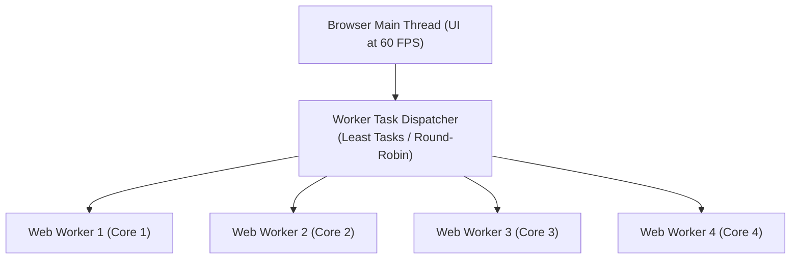
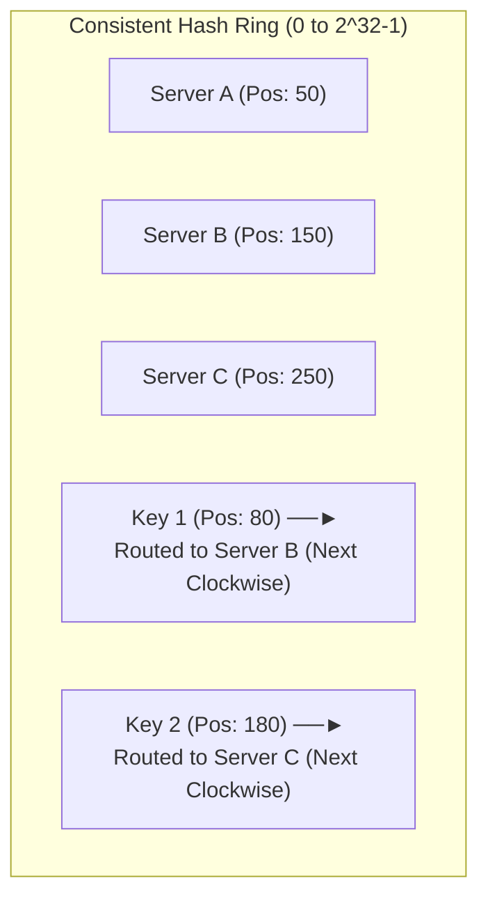
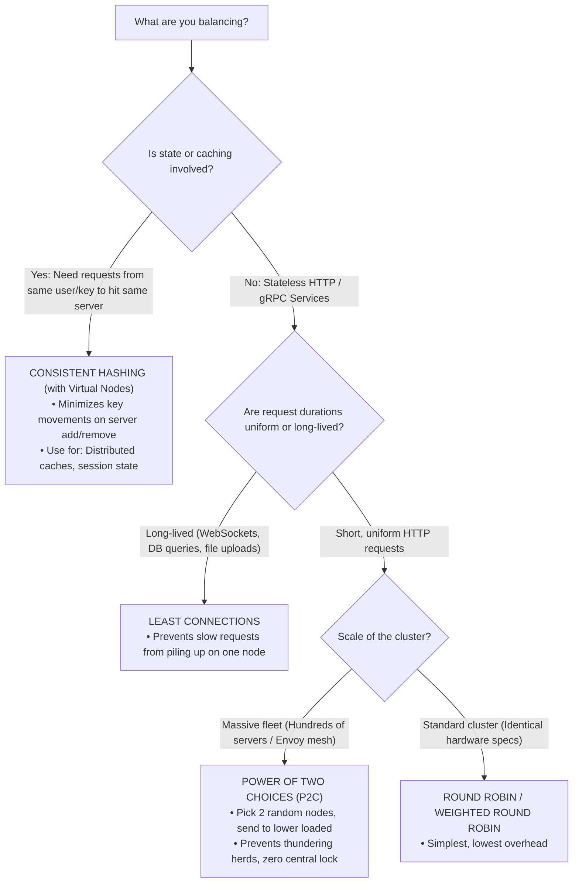

# ⚖️ Load Balancing Algorithms & Architectures Master Cheat Sheet

A comprehensive reference covering both **Frontend-Focused** (Client-side, Browser Workers, DNS, Anycast, CDN) and **Backend-Focused** (L4 vs L7, Core Algorithms, Consistent Hashing, Envoy/Nginx, gRPC) load balancing.

---

## 📑 Table of Contents

- [⚖️ Load Balancing Algorithms \& Architectures Master Cheat Sheet](#️-load-balancing-algorithms--architectures-master-cheat-sheet)
  - [📑 Table of Contents](#-table-of-contents)
- [1. Full-Stack Load Balancing Spectrum](#1-full-stack-load-balancing-spectrum)
- [2. Frontend \& Edge-Focused Load Balancing](#2-frontend--edge-focused-load-balancing)
  - [2.1 Client-Side Load Balancing (Browser / Mobile / WebRTC)](#21-client-side-load-balancing-browser--mobile--webrtc)
    - [What it is:](#what-it-is)
    - [Common Real-World Use Cases:](#common-real-world-use-cases)
    - [TypeScript Client-Side Round-Robin with Health Fallback:](#typescript-client-side-round-robin-with-health-fallback)
  - [2.2 Browser Concurrency: Web Worker Task Load Balancing](#22-browser-concurrency-web-worker-task-load-balancing)
    - [Dispatching Strategies:](#dispatching-strategies)
  - [2.3 Global Server Load Balancing (GSLB) \& GeoDNS](#23-global-server-load-balancing-gslb--geodns)
    - [The Mechanism:](#the-mechanism)
    - [Pros \& Limitations:](#pros--limitations)
  - [2.4 BGP Anycast Routing](#24-bgp-anycast-routing)
    - [The Mechanism:](#the-mechanism-1)
    - [Failover Speed:](#failover-speed)
  - [2.5 CDN Edge POPs \& Origin Shielding](#25-cdn-edge-pops--origin-shielding)
- [3. Backend Infrastructure: L4 vs. L7 Load Balancing](#3-backend-infrastructure-l4-vs-l7-load-balancing)
  - [3.1 Layer 4 (Transport / Packet) vs. Layer 7 (Application)](#31-layer-4-transport--packet-vs-layer-7-application)
  - [3.2 The HTTP/2 \& gRPC Single-Connection Trap](#32-the-http2--grpc-single-connection-trap)
    - [Why it breaks:](#why-it-breaks)
    - [The Fix:](#the-fix)
- [4. Core Load Balancing Algorithms: Deep Dive \& Math](#4-core-load-balancing-algorithms-deep-dive--math)
  - [4.1 Round Robin \& Weighted Round Robin](#41-round-robin--weighted-round-robin)
    - [Round Robin (RR):](#round-robin-rr)
    - [Weighted Round Robin (WRR):](#weighted-round-robin-wrr)
  - [4.2 Least Connections \& Weighted Least Connections](#42-least-connections--weighted-least-connections)
    - [When to use:](#when-to-use)
  - [4.3 Least Response Time (Latency-Based)](#43-least-response-time-latency-based)
  - [4.4 IP Hash \& Sticky Sessions](#44-ip-hash--sticky-sessions)
    - [Mechanism:](#mechanism)
  - [4.5 Consistent Hashing with Virtual Nodes (The Ring)](#45-consistent-hashing-with-virtual-nodes-the-ring)
    - [The Solution: Consistent Hash Ring ($2^{32} - 1$)](#the-solution-consistent-hash-ring-232---1)
    - [Virtual Nodes (V-Nodes):](#virtual-nodes-v-nodes)
  - [4.6 Power of Two Random Choices (P2C)](#46-power-of-two-random-choices-p2c)
    - [Why it beats global Least Connections:](#why-it-beats-global-least-connections)
  - [4.7 Maglev Hashing (Google Architecture)](#47-maglev-hashing-google-architecture)
- [5. Comparison Matrix \& Decision Flowchart](#5-comparison-matrix--decision-flowchart)
  - [Load Balancing Algorithm Decision Flowchart](#load-balancing-algorithm-decision-flowchart)
- [6. High Availability, Health Checks \& Outlier Detection](#6-high-availability-health-checks--outlier-detection)
  - [1. Active Health Checks:](#1-active-health-checks)
    - [2. Passive Health Checks (Outlier Detection / Circuit Breaking):](#2-passive-health-checks-outlier-detection--circuit-breaking)
    - [3. Graceful Connection Draining:](#3-graceful-connection-draining)

---

# 1. Full-Stack Load Balancing Spectrum

Load balancing does not happen at just one machine. Modern distributed architectures distribute traffic across a 6-tier pipeline:

```
[ Client Browser / Mobile App ] ──► Tier 0: Client-Side Balancing & Web Worker Pools
              │
              ▼
    [ GeoDNS / BGP Anycast ]    ──► Tier 1: Global Edge Routing (Directs to closest Data Center)
              │
              ▼
   [ CDN POP / Cloudflare ]     ──► Tier 2: Edge Caching & Origin Shielding
              │
              ▼
  [ Layer 4 LB: NLB / Maglev ]  ──► Tier 3: TCP/UDP Packet Forwarding (Direct Server Return)
              │
              ▼
  [ Layer 7 LB: ALB / Envoy ]   ──► Tier 4: Path Routing, TLS Termination & Cookie Affinity
              │
              ▼
  [ Service Mesh / Sidecars ]   ──► Tier 5: East-West Microservice & gRPC Client Balancing
              │
              ▼
    [ Backend Pods / VMs ]
```

---

# 2. Frontend & Edge-Focused Load Balancing

## 2.1 Client-Side Load Balancing (Browser / Mobile / WebRTC)

### What it is:

Instead of sending every request to a single backend reverse proxy, the **frontend client** maintains a list of server endpoints, detects health or latency, and chooses which endpoint to call directly.

### Common Real-World Use Cases:

1. **Multi-CDN Video Streaming (HLS / DASH):** Video players (YouTube, Netflix) ping multiple CDN hostnames and switch dynamically to the CDN with lowest buffering/latency.
2. **WebRTC Mesh / Peer Connections:** Browser selects the best TURN/STUN relay server based on round-trip time.
3. **Resilient Public API Fallback:** If `api.us-east.myapp.com` throws network errors, the client immediately retries with `api.us-west.myapp.com`.

### TypeScript Client-Side Round-Robin with Health Fallback:

```typescript
interface BackendEndpoint {
  url: string;
  isHealthy: boolean;
  activeRequests: number;
}

class ClientLoadBalancer {
  private backends: BackendEndpoint[];
  private currentIndex = 0;

  constructor(endpoints: string[]) {
    this.backends = endpoints.map((url) => ({
      url,
      isHealthy: true,
      activeRequests: 0,
    }));
  }

  // Round Robin with automatic unhealthy failover
  private getNextEndpoint(): BackendEndpoint {
    const healthyBackends = this.backends.filter((b) => b.isHealthy);
    if (healthyBackends.length === 0) {
      throw new Error('All backend endpoints are currently unreachable');
    }

    this.currentIndex = (this.currentIndex + 1) % healthyBackends.length;
    return healthyBackends[this.currentIndex];
  }

  async fetchWithBalancing(path: string, options: RequestInit = {}): Promise<Response> {
    const endpoint = this.getNextEndpoint();
    endpoint.activeRequests++;

    try {
      const response = await fetch(`${endpoint.url}${path}`, options);
      if (response.status >= 500) {
        endpoint.isHealthy = false;
        // Trigger background health probe
        this.scheduleHealthCheck(endpoint);
        // Retry transparently on next healthy endpoint
        return this.fetchWithBalancing(path, options);
      }
      return response;
    } catch (err) {
      endpoint.isHealthy = false;
      this.scheduleHealthCheck(endpoint);
      return this.fetchWithBalancing(path, options);
    } finally {
      endpoint.activeRequests--;
    }
  }

  private scheduleHealthCheck(endpoint: BackendEndpoint): void {
    setTimeout(async () => {
      try {
        const res = await fetch(`${endpoint.url}/health`, { method: 'HEAD' });
        endpoint.isHealthy = res.ok;
      } catch {
        this.scheduleHealthCheck(endpoint);
      }
    }, 5000);
  }
}
```

---

## 2.2 Browser Concurrency: Web Worker Task Load Balancing

Browsers execute UI JavaScript on a single thread. CPU-intensive operations (image filtering, crypto, heavy JSON parsing) freeze the frame rate. A **Web Worker Pool** load balances tasks across multiple OS background threads:



### Dispatching Strategies:

1. **Round Robin:** Next task goes to `(workerIndex + 1) % totalWorkers`.
2. **Least Loaded (Worker Queue Depth):** Dispatch to the worker currently executing the fewest pending jobs.
3. **Work Stealing:** Idle workers pull unstarted jobs from the queue of overloaded workers.

---

## 2.3 Global Server Load Balancing (GSLB) & GeoDNS

### The Mechanism:

- When a user types `myapp.com`, their local DNS resolver queries the authoritative DNS server.
- **GeoDNS** inspects the client's IP address (using EDNS Client Subnet) and resolves the domain name to the IP of the **geographically closest data center**:
  - European users get `35.180.x.x` (AWS Frankfurt).
  - US East users get `54.210.x.x` (AWS Virginia).

### Pros & Limitations:

- ✅ **Pros:** Cheap, standard, distributes global traffic without any hardware intermediary.
- ❌ **Cons:** DNS caching (TTL). If a data center dies, clients cache the IP for minutes/hours, continuing to send requests to a dead cluster.

---

## 2.4 BGP Anycast Routing

### The Mechanism:

Unlike DNS, **Anycast** assigns the **exact same IP address** to hundreds of server locations worldwide.

- Internet routers announce the IP via BGP (Border Gateway Protocol).
- The internet's routing fabric automatically directs each user's packets along the shortest network path (AS hops) to the closest Point of Presence (POP).
- Used universally by Cloudflare, Google DNS (`8.8.8.8`), and AWS CloudFront.

### Failover Speed:

- If a POP fails, BGP withdraws the route, and routers automatically steer incoming packets to the next nearest POP in **sub-second time** (no DNS TTL delay!).

---

## 2.5 CDN Edge POPs & Origin Shielding

When thousands of users simultaneously request dynamic or cached assets:

1. **Edge POP (Point of Presence):** Caches responses close to the user.
2. **Origin Shielding:** Places a centralized intermediate cache layer between edge POPs and backend origins. Multiple edge POPs query the Shield instead of directly hammering the backend databases, eliminating the **Thundering Herd** problem.

---

# 3. Backend Infrastructure: L4 vs. L7 Load Balancing

## 3.1 Layer 4 (Transport / Packet) vs. Layer 7 (Application)

```
Layer 4: [ Client TCP Packet ] ──► [ NLB / IPVS ] ──► [ Backend Server ]
         (Inspects only IP + Port. No TLS decryption. Ultra-fast: millions of req/s)

Layer 7: [ Client HTTP/HTTPS ] ──► [ ALB / Envoy ] ──► [ Backend Server ]
         (Terminates TLS. Inspects Headers, Cookies, URL paths, JSON body)
```

| Dimension                | Layer 4 (Transport / TCP/UDP)                                | Layer 7 (Application / HTTP/gRPC)                             |
| :----------------------- | :----------------------------------------------------------- | :------------------------------------------------------------ |
| **Data Inspected**       | Source/Dest IP, TCP/UDP Ports.                               | Headers, Cookies, URL Paths, HTTP verbs, payload.             |
| **TLS / SSL**            | Passthrough (servers decrypt).                               | Terminated at the LB; decrypted before routing.               |
| **Throughput & Latency** | Extreme throughput ($10\times$ faster), microsecond latency. | Higher CPU overhead (TLS handshake + HTTP parsing).           |
| **Routing Capability**   | IP & Port based only.                                        | Path-based (`/api/v1` vs `/images`), Host header, Auth token. |
| **Connection Pooling**   | 1 client TCP conn = 1 backend TCP conn.                      | Multiplexes many client requests over pooled backend conns.   |
| **Technology Examples**  | AWS NLB, Linux IPVS, Google Maglev, HAProxy (mode tcp).      | AWS ALB, Envoy, Nginx, Traefik, HAProxy (mode http).          |

---

## 3.2 The HTTP/2 & gRPC Single-Connection Trap

A subtle and dangerous backend failure occurs when migrating from HTTP/1.1 to **HTTP/2 or gRPC** behind an L4 Load Balancer:

```
[ 500 Clients ] ───(HTTP/2 Single TCP Connection)───► [ L4 Load Balancer ]
                                                               │
                                                               ▼ (All 500 streams sent here!)
                                                      [ Backend Pod 1: 100% CPU ]
                                                      [ Backend Pod 2:   0% CPU ]
                                                      [ Backend Pod 3:   0% CPU ]
```

### Why it breaks:

- HTTP/1.1 opens multiple short TCP connections, so an L4 balancer distributes them across servers.
- **HTTP/2 & gRPC multiplex all requests over a single long-lived TCP connection.**
- The L4 balancer sees only **one TCP connection** and sends it entirely to Pod 1! Pod 1 melts down while Pods 2 and 3 sit idle.

### The Fix:

1. **Use an L7 Load Balancer (Envoy, ALB):** It breaks the connection, parses individual HTTP/2 streams/frames, and balances each RPC independently across pods.
2. **Client-Side gRPC Load Balancing:** Use a service mesh (Istio/Envoy) or client-side resolver (e.g. gRPC Lookaside LB) so the client opens connections to all pods.

---

# 4. Core Load Balancing Algorithms: Deep Dive & Math

## 4.1 Round Robin & Weighted Round Robin

### Round Robin (RR):

Sequentially routes request $i$ to server index $i \pmod N$.

- **When to use:** Identical server hardware running stateless services with short, uniform request processing times.
- **Failure mode:** Fails if requests have uneven execution times (e.g., query 1 takes 5ms, query 2 takes 2,000ms).

### Weighted Round Robin (WRR):

Assigns integer weights based on machine capacity (e.g., Server A: 3, Server B: 1).

- Out of 4 requests, Server A handles 3, Server B handles 1.
- Smooth Weighted Round Robin (Nginx algorithm) interleaves requests (`A, B, A, A`) instead of bursting (`A, A, A, B`) to avoid micro-hotspots.

---

## 4.2 Least Connections & Weighted Least Connections

Routes new requests to the backend with the **lowest number of active in-flight connections**:

$$\text{Target Server} = \arg\min_{i} \left( \frac{\text{ActiveConnections}_i}{\text{Weight}_i} \right)$$

### When to use:

- **Long-lived persistent connections:** WebSockets, database connection proxies, streaming sessions, file uploads.
- When request durations vary drastically (e.g., mixing complex search queries with simple health checks).

---

## 4.3 Least Response Time (Latency-Based)

Calculates the moving average Time-To-First-Byte (TTFB) or latency of each server:

$$\text{Score}_i = \text{ActiveConnections}_i \times \text{AvgResponseTime}_i$$

- **When to use:** Heterogeneous networks or multi-zone clusters where network jitter or disk I/O varies between instances.
- **Trap:** A server that is crashing and throwing instant `500 Internal Server Error` in 1ms looks "fastest" to the balancer! It will attract 100% of the traffic unless paired with error outlier detection.

---

## 4.4 IP Hash & Sticky Sessions

### Mechanism:

$$\text{Server Index} = \text{Hash}(\text{Client IP}) \pmod N$$

- **When to use:** Stateful applications where in-memory sessions cannot be externalized to Redis (e.g., legacy apps, local caching).
- **The Hotspot Trap:** If 5,000 corporate employees browse from behind a single NAT proxy, they share the identical public IP $\to$ all 5,000 hit a single server!

---

## 4.5 Consistent Hashing with Virtual Nodes (The Ring)

Standard modulo hashing ($\text{Hash}(key) \pmod N$) suffers from a catastrophic flaw: **if 1 server dies or scales up, $N$ changes, and almost 100% of cached keys rehash to different servers**, triggering a cache stampede.

### The Solution: Consistent Hash Ring ($2^{32} - 1$)

Both servers and keys are hashed onto the same circular ring:



### Virtual Nodes (V-Nodes):

- Physical servers are mapped to 100–250 virtual points on the ring (`serverA#1`, `serverA#2`, etc.).
- **Benefits:**
  - Prevents non-uniform distribution (hotspots).
  - When Server B dies, only $\frac{1}{N}$ of keys need to move, and the load is evenly split across all surviving servers.

---

## 4.6 Power of Two Random Choices (P2C)

A remarkably simple and elegant algorithm used by **Nginx, Envoy, and Twitter Finagle**:

```
1. Pick 2 random backend servers from the pool.
2. Compare their current active in-flight requests.
3. Route the incoming request to the server with lower load!
```

### Why it beats global Least Connections:

In large clusters (10,000 RPS across 100 servers), tracking the global least-connected server requires synchronized central counters. Multiple concurrent load balancers picking the "single least-loaded" server causes a **stampede (herd effect)** where that server is instantly overwhelmed.

P2C gives $O(\log \log N)$ maximum queue depth with $O(1)$ constant time lookup, eliminating stampedes without centralized coordination!

---

## 4.7 Maglev Hashing (Google Architecture)

Developed by Google for its network load balancers:

- Builds a deterministic lookup table of size $M$ (where $M$ is a prime number, e.g., 65537).
- Each backend server generates a permutation of table entries.
- Guarantees **zero packet loss** and minimal connection reshuffling when backends scale or roll out updates.

---

# 5. Comparison Matrix & Decision Flowchart

| Algorithm                | CPU Cost             | Memory Cost      | Burst Handling    | Best Suited For                                    |
| :----------------------- | :------------------- | :--------------- | :---------------- | :------------------------------------------------- |
| **Round Robin**          | Lowest ($O(1)$)      | None             | Medium            | Uniform, stateless, short HTTP calls.              |
| **Weighted Round Robin** | Low                  | None             | Medium            | Mixed-spec server clusters.                        |
| **Least Connections**    | Low                  | Low (conn count) | Excellent         | WebSockets, database pools, long queries.          |
| **Least Response Time**  | Medium (EMA math)    | Low              | Good              | Services with variable query complexities.         |
| **Consistent Hashing**   | Medium (Ring lookup) | Medium (V-Nodes) | Good              | Distributed Caches (Memcached), Stateful sessions. |
| **Power of Two (P2C)**   | Very Low             | None             | **Best in class** | Large-scale microservices, Envoy / Service Mesh.   |

---

## Load Balancing Algorithm Decision Flowchart



---

# 6. High Availability, Health Checks & Outlier Detection

A load balancer is only as good as its failure detection.

## 1. Active Health Checks:

- The balancer periodically sends synthetic probes (`GET /healthz` every 5 seconds).
- If a server fails 3 consecutive checks, it is removed from the rotation.

### 2. Passive Health Checks (Outlier Detection / Circuit Breaking):

- The balancer monitors real user traffic.
- If a backend returns consecutive $5xx$ errors (e.g. 5 errors in 10s) or latency spikes, the balancer **temporarily ejects the node** for 30 seconds without waiting for active polling.

### 3. Graceful Connection Draining:

- When a server is deregistered (e.g., during deployment):
  1. Balancer stops sending new requests to the server.
  2. Balancer keeps existing in-flight connections open for a grace period (e.g., 30s) to allow requests to complete.
  3. Instance is terminated cleanly with 0 dropped connections.
