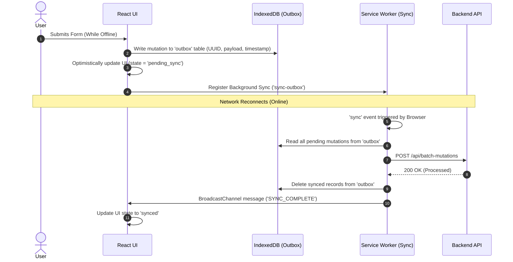

# Progressive Web Applications (PWA): Architecture & Engineering Guide

A comprehensive, production-grade guide covering **PWA Architecture**, **Web App Manifests**, **Installability Lifecycles**, **Offline-First Storage Architectures**, **Project Fugu APIs**, and staff-level trade-offs.

---

## 1. PWA Architectural Blueprint

A **Progressive Web App (PWA)** combines the reach of the web with the capabilities of native applications.

```
                                  PWA ARCHITECTURE
                                         │
         ┌───────────────────────────────┼───────────────────────────────┐
         ▼                               ▼                               ▼
  Web App Manifest               Service Worker Core               Capabilities
 (Identity & Install)           (Offline & Cache Layer)         (Hardware & OS APIs)
  ├── Name, Icons, Display       ├── App Shell Pre-caching       ├── Web Push / Badging
  ├── Theme, Start URL           ├── SWR / Network-First         ├── File System Access
  └── Share/File Handlers        └── Background Sync Outbox      └── Web Share / Wake Lock
```

### Core Pillars of a Modern PWA

1. **Capable**: Leverages modern Fugu APIs (File handling, Badging, Push, Hardware).
2. **Reliable**: Loads instantly and functions predictably regardless of network state (Offline-First).
3. **Installable**: Runs in a standalone window, integrates into OS launcher/dock, handles system file associations.

---

## 2. Web App Manifest (`manifest.webmanifest`)

The Web App Manifest is a JSON file that tells the browser how your application should appear when installed on the user's OS.

### Production Enterprise Manifest Specification

```json
{
  "$schema": "https://json.schemastore.org/web-manifest-combined.json",
  "name": "Enterprise Cloud Studio",
  "short_name": "CloudStudio",
  "description": "Real-time collaborative architectural design and engineering suite.",
  "start_url": "/?source=pwa",
  "scope": "/",
  "id": "/?source=pwa",
  "display": "standalone",
  "display_override": ["window-controls-overlay", "standalone", "minimal-ui"],
  "orientation": "any",
  "background_color": "#0F172A",
  "theme_color": "#3B82F6",
  "categories": ["productivity", "utilities", "design"],
  "icons": [
    {
      "src": "/icons/icon-192x192.png",
      "sizes": "192x192",
      "type": "image/png",
      "purpose": "any"
    },
    {
      "src": "/icons/icon-512x512.png",
      "sizes": "512x512",
      "type": "image/png",
      "purpose": "any"
    },
    {
      "src": "/icons/maskable-512x512.png",
      "sizes": "512x512",
      "type": "image/png",
      "purpose": "maskable"
    }
  ],
  "screenshots": [
    {
      "src": "/screenshots/desktop-dashboard.webp",
      "sizes": "1920x1080",
      "type": "image/webp",
      "form_factor": "wide",
      "label": "Project Dashboard view"
    },
    {
      "src": "/screenshots/mobile-feed.webp",
      "sizes": "750x1334",
      "type": "image/webp",
      "form_factor": "narrow",
      "label": "Mobile Notification feed"
    }
  ],
  "shortcuts": [
    {
      "name": "New Project",
      "short_name": "New",
      "description": "Create a new architecture canvas",
      "url": "/projects/new",
      "icons": [{ "src": "/icons/shortcut-new.png", "sizes": "96x96" }]
    }
  ],
  "share_target": {
    "action": "/share-receiver",
    "method": "POST",
    "enctype": "multipart/form-data",
    "params": {
      "title": "title",
      "text": "text",
      "url": "url",
      "files": [
        {
          "name": "diagrams",
          "accept": ["image/*", "application/pdf"]
        }
      ]
    }
  }
}
```

### Display Modes Breakdown

| Display Mode              | UI Appearance                                                         | System Integration                         | Use Case                               |
| :------------------------ | :-------------------------------------------------------------------- | :----------------------------------------- | :------------------------------------- |
| `fullscreen`              | Entire screen, zero browser UI, zero OS status bar                    | Games, immersive media players             | Kiosk apps, VR/Games                   |
| `standalone`              | Looks like native app; own window, hides URL bar, keeps OS status bar | Full dock/launcher presence, task switcher | Standard apps (Slack, Notion, Twitter) |
| `minimal-ui`              | Dedicated window with minimal navigation buttons (Back/Reload)        | Custom navigation bar                      | Content readers, documentation         |
| `browser`                 | Standard browser tab experience                                       | Default web page                           | Non-installable fallback               |
| `window-controls-overlay` | Custom title bar area; app content extends into window header         | Native-grade customized titlebar           | Advanced Desktop PWAs (VS Code Web)    |

---

### Maskable Icons & Safe Zone Geometry

Maskable icons allow the host OS (especially Android) to crop the app icon into any shape (circle, squircle, rounded rectangle, teardrop) without ugly white borders:

```
┌─────────────────────────────────────────┐
│ 512 x 512 Icon Canvas                   │
│      ┌───────────────────────────┐      │
│      │ SAFE ZONE (Radius = 40%)  │      │
│      │ Diameter = 80% (410px)    │      │
│      │                           │      │
│      │    [ CORE LOGO HERE ]     │      │
│      │                           │      │
│      └───────────────────────────┘      │
│ Outer 10% Margin may be cropped by OS   │
└─────────────────────────────────────────┘
```

- **Rule:** Keep all critical artwork, glyphs, and typography strictly inside the central **80% circle (Safe Zone)**.

---

## 3. PWA Installation Flow & Promotion UX

### 3.1 Browser Eligibility Criteria for Installation

To trigger the native installation prompt, the web application must meet:

1. Valid **HTTPS** connection (or `localhost`).
2. Web App Manifest with: `name`/`short_name`, `start_url`, `display: standalone|fullscreen|minimal-ui`, and icons (≥192px and ≥512px).
3. Registered Service Worker with an active `fetch` handler.
4. User engagement heuristic (e.g. visited site, interacted for >30s).

---

### 3.2 Custom Install Prompt Orchestration (React / TypeScript)

```typescript
// usePWAInstall.ts
import { useState, useEffect } from 'react';

interface BeforeInstallPromptEvent extends Event {
  prompt: () => Promise<void>;
  userChoice: Promise<{ outcome: 'accepted' | 'dismissed'; platform: string }>;
}

export function usePWAInstall() {
  const [deferredPrompt, setDeferredPrompt] = useState<BeforeInstallPromptEvent | null>(null);
  const [isInstallable, setIsInstallable] = useState(false);
  const [isInstalled, setIsInstalled] = useState(false);

  useEffect(() => {
    // 1. Detect if already running in standalone/installed mode
    const isStandalone =
      window.matchMedia('(display-mode: standalone)').matches || (window.navigator as any).standalone === true;
    if (isStandalone) {
      setIsInstalled(true);
      return;
    }

    // 2. Capture the browser's default prompt
    const handleBeforeInstallPrompt = (e: Event) => {
      e.preventDefault(); // Prevent automatic mini-infobar
      setDeferredPrompt(e as BeforeInstallPromptEvent);
      setIsInstallable(true);
    };

    // 3. Track successful installation
    const handleAppInstalled = () => {
      setIsInstalled(true);
      setIsInstallable(false);
      setDeferredPrompt(null);
      console.log('PWA successfully installed!');
    };

    window.addEventListener('beforeinstallprompt', handleBeforeInstallPrompt);
    window.addEventListener('appinstalled', handleAppInstalled);

    return () => {
      window.removeEventListener('beforeinstallprompt', handleBeforeInstallPrompt);
      window.removeEventListener('appinstalled', handleAppInstalled);
    };
  }, []);

  const triggerInstall = async () => {
    if (!deferredPrompt) return;
    await deferredPrompt.prompt();
    const choice = await deferredPrompt.userChoice;
    if (choice.outcome === 'accepted') {
      setIsInstalled(true);
    }
    setDeferredPrompt(null);
    setIsInstallable(false);
  };

  return { isInstallable, isInstalled, triggerInstall };
}
```

---

## 4. Application Shell (App Shell) Architecture & PRPL Pattern

The **App Shell Architecture** separates the core application infrastructure (HTML header, navbar, sidebar, router bundle) from dynamic runtime data.

```
┌─────────────────────────────────────────────────────────────┐
│ APPLICATION SHELL (Pre-cached via SW Cache API)             │
│ ┌─────────────────────────────────────────────────────────┐ │
│ │ Header & Navigation Bar                                 │ │
│ ├──────────────┬──────────────────────────────────────────┤ │
│ │ Sidebar      │ DYNAMIC VIEW CONTENT                     │ │
│ │ (Pre-cached) │ (Fetched from IndexedDB / API)           │ │
│ │              │                                          │ │
│ │              │ ┌──────────────────────────────────────┐ │ │
│ │              │ │ Loaded dynamically via SWR / Query   │ │ │
│ │              │ └──────────────────────────────────────┘ │ │
│ └──────────────┴──────────────────────────────────────────┘ │
└─────────────────────────────────────────────────────────────┘
```

### The PRPL Performance Pattern

- **P**ush / Preload: Send critical resources early (`<link rel="preload">`).
- **R**ender: Render the minimal initial route instantly via pre-cached App Shell.
- **P**re-cache: Cache remaining route assets in background via Service Worker.
- **L**azy-load: Asynchronously import non-critical bundles and routes on demand.

---

## 5. Offline-First Storage & Data Synchronization

```
                                OFFLINE-FIRST DATA LAYER
                                           │
         ┌─────────────────────────────────┴─────────────────────────────────┐
         ▼                                                                   ▼
    Cache Storage                                                        IndexedDB
(Request / Response Pairs)                                         (Structured Data / Entities)
 ├── HTML / JS / CSS Bundles                                        ├── Application State / Documents
 ├── Web Fonts                                                      ├── Outbox Queue (Offline mutations)
 └── Static Images / Icons                                          └── User Profiles / Cached JSON
```

### The Outbox Queue Pattern (Offline Mutation Sync)



---

## 6. Advanced PWA Capabilities (Project Fugu & Hardware APIs)

Modern PWAs can interact with device hardware and native OS features:

### 1. App Badging API

```javascript
// Set unread count on app icon badge
if ('setAppBadge' in navigator) {
  navigator.setAppBadge(unreadCount).catch(console.error);
}

// Clear badge
navigator.clearAppBadge();
```

### 2. Screen Wake Lock API (Keep screen on for recipes, presentations)

```javascript
let wakeLock = null;

async function requestWakeLock() {
  try {
    wakeLock = await navigator.wakeLock.request('screen');
    wakeLock.addEventListener('release', () => {
      console.log('Wake lock was released');
    });
  } catch (err) {
    console.error(`${err.name}, ${err.message}`);
  }
}
```

### 3. Web Share API & Web Share Target

```javascript
// Trigger native OS share sheet
if (navigator.share) {
  await navigator.share({
    title: 'Architecture Blueprint',
    text: 'Check out this system design layout',
    url: 'https://mysystem.design/canvas/123',
  });
}
```

### 4. File System Access API (Native Desktop File Reading & Writing)

```javascript
async function openAndSaveFile() {
  const [fileHandle] = await window.showOpenFilePicker({
    types: [{ description: 'JSON Files', accept: { 'application/json': ['.json'] } }],
  });
  const file = await fileHandle.getFile();
  const text = await file.text();

  // Modify and save back
  const writable = await fileHandle.createWritable();
  await writable.write(JSON.stringify({ ...JSON.parse(text), modifiedAt: Date.now() }));
  await writable.close();
}
```

---

## 7. Storage Management & Eviction Resilience

Browsers automatically evict storage (Cache Storage, IndexedDB) under device disk pressure unless marked **Persistent**.

### Requesting Persistent Storage

```javascript
async function enablePersistentStorage() {
  if (navigator.storage && navigator.storage.persist) {
    const isPersisted = await navigator.storage.persisted();
    if (!isPersisted) {
      const granted = await navigator.storage.persist();
      console.log(`Persistent storage granted: ${granted}`);
    }
  }
}

// Check current storage quota & usage
async function checkStorageQuota() {
  if (navigator.storage && navigator.storage.estimate) {
    const { quota, usage } = await navigator.storage.estimate();
    const percentUsed = ((usage / quota) * 100).toFixed(2);
    console.log(
      `Using ${(usage / 1024 / 1024).toFixed(2)} MB of ${(quota / 1024 / 1024).toFixed(2)} MB (${percentUsed}%)`,
    );
  }
}
```

---

## 8. PWA vs. Native vs. Cross-Platform Frameworks

| Dimension                | Progressive Web App (PWA)                                        | Native (Swift / Kotlin)                                  | Cross-Platform (React Native / Flutter)     |
| :----------------------- | :--------------------------------------------------------------- | :------------------------------------------------------- | :------------------------------------------ |
| **Distribution**         | Instant via URL (Bypasses App Store 30% fees & review delays)    | Apple App Store / Google Play Store                      | Apple App Store / Google Play Store         |
| **Storage & App Size**   | Ultra-lightweight (<5MB), streamed on demand                     | Heavy (50MB–200MB download)                              | Moderate (30MB–100MB download)              |
| **Updates**              | Instant (deploy to web server, zero user store updates)          | Requires App Store review + user app update download     | OTA (JS only via CodePush) or Store Review  |
| **Hardware Access**      | High (Camera, Geolocation, Bluetooth, USB, Files, Sensors)       | 100% Full Hardware Access (NFC background, ARKit, Metal) | 95% Hardware Access via Native Modules      |
| **iOS / Safari Caveats** | No Web Push prior to iOS 16.4, 7-day storage cap on unused sites | Full OS background execution                             | Full OS background execution                |
| **Development Cost**     | **Lowest** (Single codebase for Web, Desktop, Mobile)            | Highest (Two separate native codebases)                  | Moderate (Single codebase + native bridges) |

---

## 9. Production PWA Checklist

```
[ ] Manifest has valid name, short_name, start_url, theme_color, background_color
[ ] Manifest defines both 'any' and 'maskable' purpose icons (192px and 512px)
[ ] Service Worker serves sw.js with Cache-Control: no-cache, no-store
[ ] Service Worker precaches offline fallback page (/offline.html)
[ ] App shell uses Stale-While-Revalidate or Cache-First for static assets
[ ] Sensitive API routes use Network-Only or Network-First
[ ] Custom in-app installation banner wired to beforeinstallprompt
[ ] navigator.storage.persist() called for offline-critical data
[ ] Lighthouse PWA score passes 100% on performance and installability checks
```
