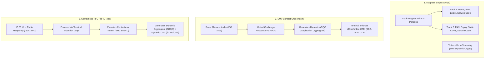
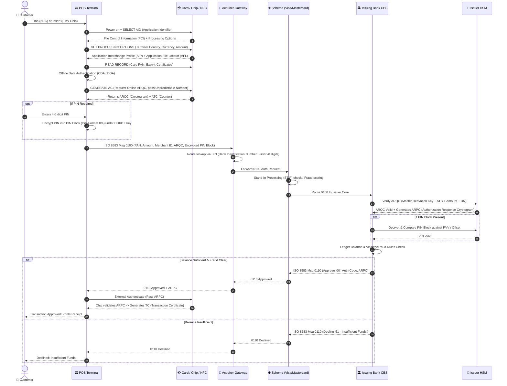
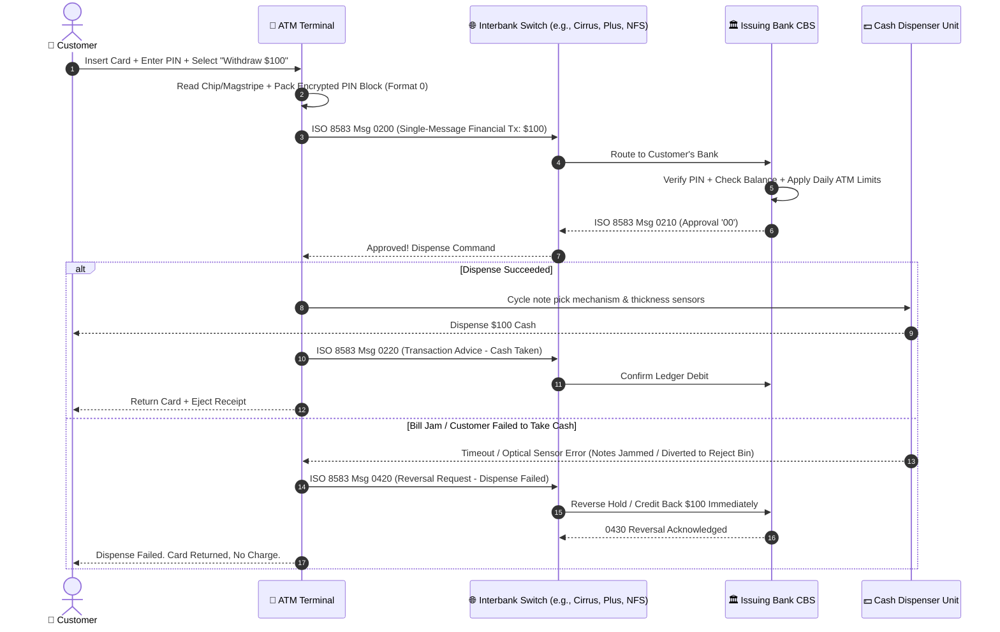
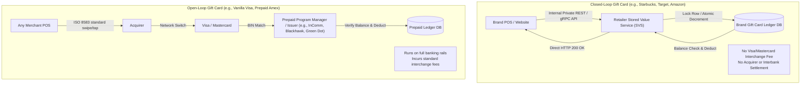

# Payment Cards, ATM & Hardware Architecture (Part 1)

> **Navigation**: **[Part 1: Physical, Terminal & Network Switching](Payment_Card_ATM_Voucher_Part1_Hardware_and_Switching.md)** | **[Part 2: Data, Software Engineering, Subscriptions & Operations](Payment_Card_ATM_Voucher_Part2_Software_and_Operations.md)**

A comprehensive, production-grade guide detailing how physical and digital cards work in the real world — covering physical interfaces (Magstripe, EMV Chip, NFC Tap), transaction switching protocols (ISO 8583 / ISO 20022), payment networks, dual-message vs single-message settlement, ATM withdrawals, closed/open-loop gift cards, and hardware cryptography.

---

## Table of Contents (Part 1)

- [Payment Cards, ATM \& Hardware Architecture (Part 1)](#payment-cards-atm--hardware-architecture-part-1)
  - [Table of Contents (Part 1)](#table-of-contents-part-1)
  - [1. High-Level Ecosystem \& Key Actors](#1-high-level-ecosystem--key-actors)
  - [2. Card Physical Technologies \& Data Interfaces](#2-card-physical-technologies--data-interfaces)
    - [Deep Dive: Track 2 vs EMV vs NFC Tokenization](#deep-dive-track-2-vs-emv-vs-nfc-tokenization)
      - [Magstripe (Swipe - ISO 7813 Track 2)](#magstripe-swipe---iso-7813-track-2)
      - [EMV Contact Chip (Insert - ISO 7816)](#emv-contact-chip-insert---iso-7816)
      - [Contactless NFC (Tap - ISO/IEC 14443 Type A/B)](#contactless-nfc-tap---isoiec-14443-type-ab)
  - [3. End-to-End Online Authorization Flow (Tap / Insert / Swipe)](#3-end-to-end-online-authorization-flow-tap--insert--swipe)
  - [4. The Two-Phase Financial Lifecycle: Dual-Message vs Single-Message](#4-the-two-phase-financial-lifecycle-dual-message-vs-single-message)
    - [Dual-Message System (DMS) vs Single-Message System (SMS)](#dual-message-system-dms-vs-single-message-system-sms)
  - [5. ATM Cash Withdrawal Flow](#5-atm-cash-withdrawal-flow)
  - [6. Closed-Loop vs Open-Loop Vouchers \& Gift Cards](#6-closed-loop-vs-open-loop-vouchers--gift-cards)
    - [Architectural Comparison](#architectural-comparison)
  - [7. Security, Cryptography \& Fraud Control Matrix](#7-security-cryptography--fraud-control-matrix)
    - [Key Security Building Blocks](#key-security-building-blocks)

👉 _Looking for Card Anatomy (BIN, CVV types), Frontend/Backend code patterns, 3DS2, Chargebacks, or Auto-Debit Subscriptions? See **[Part 2: Software, Data & Operations](Payment_Card_ATM_Voucher_Part2_Software_and_Operations.md)**._

---

## 1. High-Level Ecosystem & Key Actors

When any card or voucher transaction occurs, up to six primary entities coordinate in real time:

```mermaid
flowchart LR
    Cardholder["👤 Cardholder"]
    POS["🏪 Merchant / POS / ATM<br/>(Terminal)"]
    Acquirer["🏦 Acquirer / Processor<br/>(Merchant's Bank)"]
    Scheme["🌐 Card Scheme / Switch<br/>(Visa / Mastercard / Amex / NPCI)"]
    Issuer["🏛️ Issuer Bank / Closed-Loop Server<br/>(Cardholder's Bank / Brand)"]
    HSM["🔐 Hardware Security Module (HSM)<br/>(PIN / Cryptogram Verification)"]

    Cardholder -->|Swipe / Insert / Tap| POS
    POS -->|Encrypted ISO Payload| Acquirer
    Acquirer -->|Network Switch Routing| Scheme
    Scheme -->|Auth Request + Cryptogram| Issuer
    Issuer <-->|Decrypt PIN / ARQC Validation| HSM
    Issuer -->|Auth Approval / Decline| Scheme
    Scheme -->|Response| Acquirer
    Acquirer -->|Approve / Decline| POS
    POS -->|Receipt / Dispense| Cardholder
```



| Entity                             | Role & Responsibility                                                                                  | Key Protocol / Standard            |
| ---------------------------------- | ------------------------------------------------------------------------------------------------------ | ---------------------------------- |
| **Cardholder / Device**            | Presents credentials (Plastic card, Apple/Google Pay, NFC ring, QR, Voucher code).                     | ISO 7810, ISO 7816, ISO 14443      |
| **Merchant / POS / ATM**           | Captures card data, runs terminal risk checks, prompts PIN/biometric, formats request.                 | EMVCo Level 1 & 2, PCI-PTS         |
| **Acquirer / Payment Gateway**     | Merchant's financial institution; packages transaction into payment scheme messages.                   | ISO 8583 / ISO 20022, PCI-DSS      |
| **Card Scheme / Network**          | Global routing clearinghouse (Visa, Mastercard, Amex, RuPay, JCB). Resolves BIN ranges.                | Visa Base I/II, Mastercard Banknet |
| **Issuer (Issuing Bank)**          | Holds account balance/credit limit. Evaluates fraud engines, validates cryptograms, approves/declines. | Core Banking System (CBS), HSM     |
| **HSM (Hardware Security Module)** | FIPS 140-2 Level 3 tamper-resistant hardware verifying dynamic ARQC cryptograms and PIN blocks.        | ANSI X9.8, ISO 9564 (PIN blocks)   |

---

## 2. Card Physical Technologies & Data Interfaces

How physical terminals extract data from a card differs drastically across technologies:



### Deep Dive: Track 2 vs EMV vs NFC Tokenization

#### Magstripe (Swipe - ISO 7813 Track 2)

- Data stored in plaintext: `[Start Sentinel ';'][PAN][Separator '='][Expiry YYMM][Service Code][Discretionary Data (CVV1)][End Sentinel '?'][LRC Checksum]`.
- **Flaw**: Easily cloned with a $15 reader because the data never changes.

#### EMV Contact Chip (Insert - ISO 7816)

- The chip runs JavaCard/Multos OS containing issuer-signed public key certificates.
- For every transaction, it accepts terminal random numbers (Unpredictable Number - UN), combines them with the transaction counter (ATC) and secret cryptographic master keys, and outputs an **ARQC** (Authorization Request Cryptogram) using 3DES/AES. Cloned static data cannot generate this.

#### Contactless NFC (Tap - ISO/IEC 14443 Type A/B)

- Operates within 4 cm at 13.56 MHz.
- Power is wirelessly inducted into the card's internal coil antenna.
- For Apple Pay / Google Pay, the actual PAN is never stored; instead, a **DPAN** (Device PAN / Token) issued by Visa Token Service (VTS) or Mastercard Digital Enablement Service (MDES) is used, validated by an onboard Secure Element (eSE) or Cloud HCE (Host Card Emulation).

---

## 3. End-to-End Online Authorization Flow (Tap / Insert / Swipe)

This sequence diagram illustrates the complete sub-second (~300ms–800ms) synchronous lifecycle of a card payment:



---

## 4. The Two-Phase Financial Lifecycle: Dual-Message vs Single-Message

Card transactions separate **real-time authorization** from **actual money movement**:

```mermaid
flowchart TD
    subgraph Phase1["Phase 1: Real-Time Authorization (Dual-Message System)"]
        D1["0100 Auth Request"] --> D2["Issuer puts HOLD / RESERVATION on Ledger"]
        D2 --> D3["Available Balance Decreases<br/>Actual Account Balance Unchanged"]
        D3 --> D4["0110 Auth Response (Approval Code returned)"]
    end

    subgraph Phase2["Phase 2: Clearing & Settlement (End of Day / T+1 / T+2)"]
        S1["POS End-of-Day Batch Close"] --> S2["Acquirer compiles 0200 / First Presentment Files"]
        S2 --> S3["Card Scheme Net Settlement Engine (Visa Base II / IPM)"]
        S3 --> S4["Multilateral Netting: Scheme calculates interbank debtor/creditor balances"]
        S4 --> S5["Central Bank Fedwire/RTGS transfers funds: Issuer -> Acquirer"]
        S5 --> S6["Acquirer credits Merchant account minus Merchant Discount Rate (MDR)"]
    end

    Phase1 -->|Batch File Settlement (Cutoff Window)| Phase2
```

### Dual-Message System (DMS) vs Single-Message System (SMS)

- **Dual-Message (DMS - Common for Credit & Retail Tap/Insert)**:
  - Step 1: Real-time ISO 8583 `0100` / `0110` Authorization (hold funds).
  - Step 2: Batch clearing ISO 8583 `1240` / `0200` Capture hours later (e.g., restaurant tip added after initial authorization).
- **Single-Message (SMS - Common for ATMs & PIN-Debit/Interac/EFTPOS)**:
  - Authorization and Clearing happen simultaneously in one message (`0200` Financial Request / `0210` Financial Response).
  - Money is deducted immediately from the ledger with no separate capture phase.

---

## 5. ATM Cash Withdrawal Flow

An ATM combines card authentication, cryptographic hardware PIN verification, and physical mechanical dispenser controls:



---

## 6. Closed-Loop vs Open-Loop Vouchers & Gift Cards

Gift cards and vouchers use distinct architectures depending on whether they traverse public banking rails:



### Architectural Comparison

| Dimension             | Closed-Loop Card (Retailer Voucher)                                                          | Open-Loop Card (Prepaid Visa/Mastercard)                         |
| --------------------- | -------------------------------------------------------------------------------------------- | ---------------------------------------------------------------- |
| **Acceptance**        | Single merchant or merchant group only                                                       | Any merchant accepting Visa / Mastercard                         |
| **Routing Protocol**  | Proprietary REST/JSON, ISO 8583 via private aggregator (SVS, First Data, Blackhawk)          | Standard Visa Base I/II, Banknet (ISO 8583 / ISO 20022)          |
| **Regulatory Burden** | Lower (Closed-loop gift certificate exemptions, escheatment laws apply)                      | High (FinCEN, AML/KYC thresholds, BSA, Banking charter required) |
| **Interchange Fees**  | 0% (Merchant owns the ledger)                                                                | Standard 1.5% - 3.0% Interchange + Processing fees               |
| **Activation Cycle**  | Inactive at rack; activated at register via barcode scan (`POSA - Point of Sale Activation`) | Inactive at rack; activated via POSA packet to Program Manager   |

---

## 7. Security, Cryptography & Fraud Control Matrix

```mermaid
graph LR
    subgraph At_Terminal["1. Point of Interaction (POI)"]
        T1["PCI-PTS Certified Terminal"]
        T2["P2PE (Point-to-Point Encryption)"]
        T3["DUKPT (Unique Key Per Transaction)"]
    end

    subgraph In_Transit["2. In-Transit Network"]
        N1["TLS 1.3 Tunnel"]
        N2["Private MPLS / Leased Lines (VisaNet)"]
        N3["ISO 8583 Field 52: Encrypted PIN Block"]
    end

    subgraph At_Issuer["3. Issuing Core & HSM"]
        I1["FIPS 140-2 Level 3 HSM"]
        I2["3DES / AES Zone Master Keys (ZMK)"]
        I3["Machine Learning Fraud Scoring (0.00 - 1.00)"]
    end

    At_Terminal --> In_Transit --> At_Issuer
```



### Key Security Building Blocks

1. **DUKPT (Derived Unique Key Per Transaction)**:
   - Ensures that every PIN entry is encrypted using a completely fresh cryptographic key derived from a Base Derivation Key (BDK). Even if an attacker compromises the key for transaction $N$, they cannot decrypt transaction $N-1$ or $N+1$.
2. **P2PE (Point-to-Point Encryption)**:
   - Card data is encrypted inside the tamper-proof secure read head of the POS terminal before it hits POS memory or operating system. The merchant’s internal network never touches plaintext PANs (drastically lowering PCI-DSS scope).
3. **ARQC / ARPC Verification**:
   - The chip calculates $ARQC = \text{AES/3DES}_{MDK}(\text{Amount} \parallel \text{Country} \parallel \text{UN} \parallel \text{ATC})$.
   - The Issuer HSM recomputes the exact hash. If a single bit differs, the card is counterfeit and declined with response code `05 (Do Not Honor)`.
4. **Tokenization & Dynamic Cryptograms (Apple/Google Pay)**:
   - The physical PAN is substituted with a 16-digit surrogate DPAN token.
   - For every tap, an elliptic curve or dynamic cryptogram is generated by the phone's Secure Enclave, accompanied by biometric authentication (Face ID/Fingerprint). Plaintext card data is never transmitted.
