# Payment Cards, Software Engineering & Operations (Part 2)

> **Navigation**: **[Part 1: Physical, Terminal & Network Switching](Payment_Card_ATM_Voucher_Part1_Hardware_and_Switching.md)** | **[Part 2: Data, Software Engineering, Subscriptions & Operations](Payment_Card_ATM_Voucher_Part2_Software_and_Operations.md)**

A comprehensive guide focusing on card data structures (PAN, BIN, CVV types), Frontend (FE) secure checkout UX, Backend (BE) idempotency and webhooks, 3DS2 authentication, disputes/chargebacks, ISO 8583 wire fields, offline Store-and-Forward modes, and Auto-Debit Subscriptions (CIT vs. MIT).

---

## Table of Contents (Part 2)

- [Payment Cards, Software Engineering \& Operations (Part 2)](#payment-cards-software-engineering--operations-part-2)
  - [Table of Contents (Part 2)](#table-of-contents-part-2)
  - [1. Anatomy of a Card (PAN, BIN, Expiry, CVV Variants)](#1-anatomy-of-a-card-pan-bin-expiry-cvv-variants)
    - [PAN Anatomy (Primary Account Number)](#pan-anatomy-primary-account-number)
    - [The 4 Distinct Flavors of CVV / CVC (Card Verification Value)](#the-4-distinct-flavors-of-cvv--cvc-card-verification-value)
  - [2. Frontend (FE) Perspective: Web, Mobile \& Checkout UX](#2-frontend-fe-perspective-web-mobile--checkout-ux)
    - [What Happens on the Frontend:](#what-happens-on-the-frontend)
  - [3. Backend (BE) Perspective: APIs, Webhooks, Idempotency \& Routing](#3-backend-be-perspective-apis-webhooks-idempotency--routing)
    - [Backend Engineering Rules:](#backend-engineering-rules)
  - [4. Complete Data \& Protocol Translation Matrix](#4-complete-data--protocol-translation-matrix)
  - [5. 3D Secure 2.0 (3DS2) \& SCA: Frictionless vs Challenge Flow](#5-3d-secure-20-3ds2--sca-frictionless-vs-challenge-flow)
    - [Key 3DS Concepts:](#key-3ds-concepts)
  - [6. Chargeback \& Dispute Lifecycle](#6-chargeback--dispute-lifecycle)
  - [7. Fallbacks \& High Availability: STIP (Stand-In Processing)](#7-fallbacks--high-availability-stip-stand-in-processing)
  - [8. The Essential ISO 8583 Fields Cheat Sheet](#8-the-essential-iso-8583-fields-cheat-sheet)
  - [9. Edge Cases, Offline Modes \& The Economics of a Swipe](#9-edge-cases-offline-modes--the-economics-of-a-swipe)
    - [1. Offline Floor Limits \& Delayed Auth (Airplanes, Subways, Cruise Ships)](#1-offline-floor-limits--delayed-auth-airplanes-subways-cruise-ships)
    - [2. The Economics: Who Takes What? (Interchange, Scheme, Assessment)](#2-the-economics-who-takes-what-interchange-scheme-assessment)
    - [3. Vouchers \& Gift Cards: Real-World Edge Cases](#3-vouchers--gift-cards-real-world-edge-cases)
  - [10. Auto-Debit, Recurring Subscriptions \& Mandates (CIT vs. MIT)](#10-auto-debit-recurring-subscriptions--mandates-cit-vs-mit)
    - [1. CIT (Customer-Initiated) vs. MIT (Merchant-Initiated)](#1-cit-customer-initiated-vs-mit-merchant-initiated)
    - [2. End-to-End Recurring Auto-Debit Lifecycle](#2-end-to-end-recurring-auto-debit-lifecycle)
    - [3. What Happens When Auto-Debit Fails? (Dunning \& Smart Retries)](#3-what-happens-when-auto-debit-fails-dunning--smart-retries)
    - [4. Key Building Blocks of Auto-Debit Systems:](#4-key-building-blocks-of-auto-debit-systems)

---

## 1. Anatomy of a Card (PAN, BIN, Expiry, CVV Variants)

Understanding every field on a card, who inspects it, and where it travels:

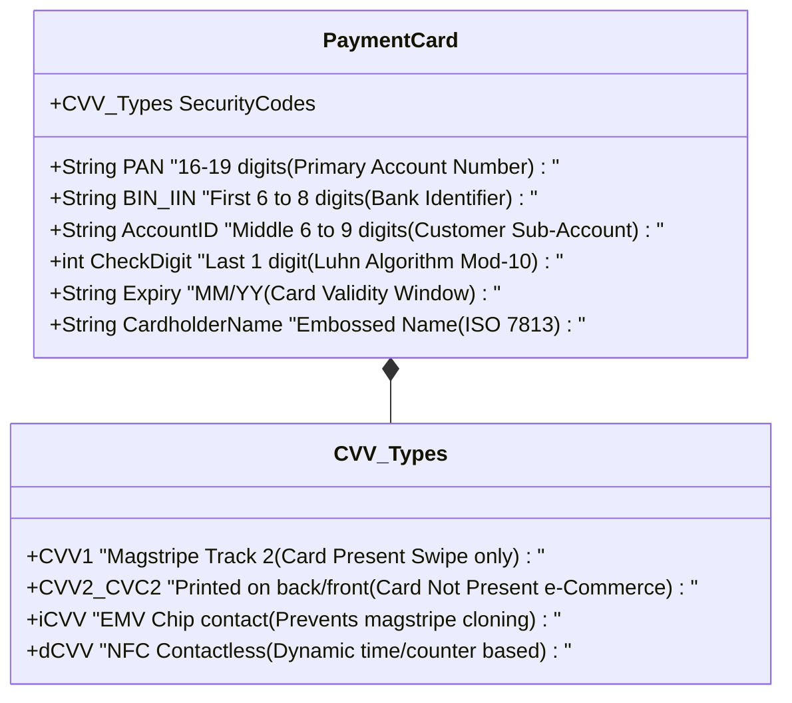

### PAN Anatomy (Primary Account Number)

A card number (typically 16 digits, but up to 19 digits under ISO/IEC 7812) is broken down into:

- **MII (Major Industry Identifier)**: The very first digit:
  - `1` or `2`: Airlines
  - `3`: Travel and Entertainment (e.g., `34`, `37` = American Express; `35` = JCB; `30`, `36`, `38` = Diners Club)
  - `4`: Banking and Financial — **Visa**
  - `5`: Banking and Financial — **Mastercard** (`51`–`55` or `2221`–`2720`)
  - `6`: Merchandising and Banking — **Discover / RuPay / China UnionPay** (`60`, `65`)
- **BIN / IIN (Bank Identification Number / Issuer Identification Number)**:
  - **Length**: Historically the first **6 digits**; upgraded across the industry to **8 digits** (effective April 2022 by ISO/IEC 7812-1).
  - **What it tells the system**:
    - **Issuing Bank**: e.g., JPMorgan Chase, Barclays, HDFC.
    - **Card Scheme**: Visa, Mastercard, RuPay.
    - **Card Sub-type**: Credit, Debit, Prepaid, Commercial / Corporate.
    - **Card Tier**: Platinum, Infinite, World Elite, Standard.
    - **Country of Origin**: Used for cross-border currency conversions and localized regulatory checks (e.g., PSD2 Strong Customer Authentication in Europe, RBI mandatory OTP in India).
- **Individual Account Identifier**: The middle 6 to 9 digits assigned by the bank's core ledger to the customer.
- **Luhn Check Digit (Last 1 digit)**: Calculated using the **Mod-10 (Luhn) formula** to instantly trap typos or transposition errors on the client without an API call.

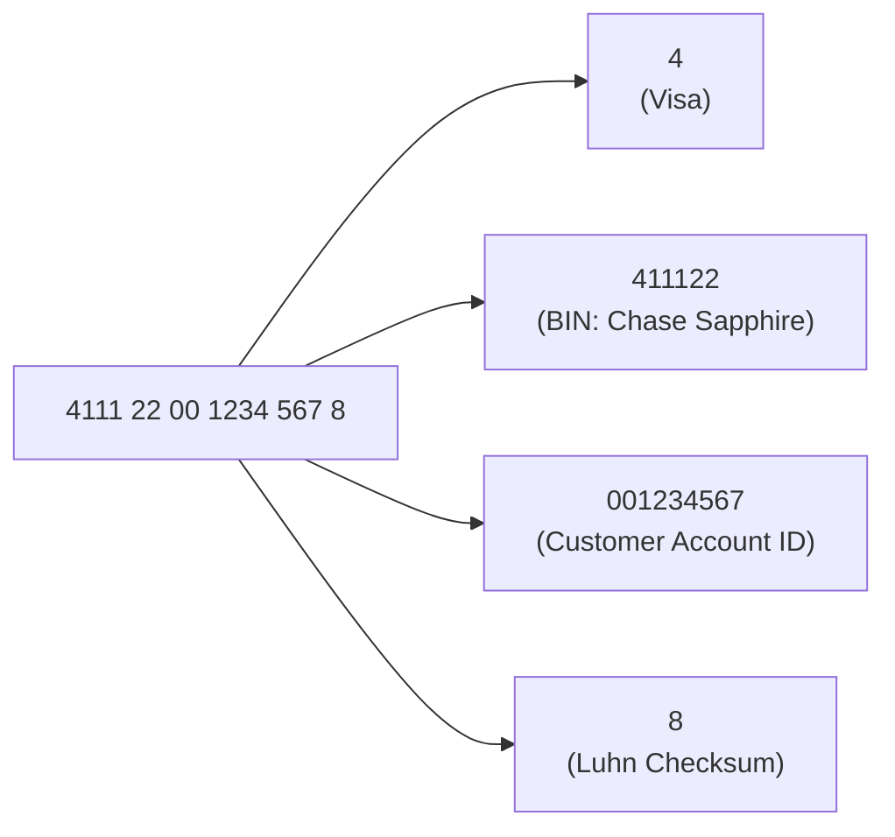

### The 4 Distinct Flavors of CVV / CVC (Card Verification Value)

People frequently say "CVV", but the industry uses **4 distinct cryptographic verification values**:

| CVV Variant           | Where is it stored?                                             | Where is it used?                                  | How is it calculated?                                                                          | Purpose                                                                                                                                                                              |
| --------------------- | --------------------------------------------------------------- | -------------------------------------------------- | ---------------------------------------------------------------------------------------------- | ------------------------------------------------------------------------------------------------------------------------------------------------------------------------------------ |
| **CVV1 / CVC1**       | Encoded invisibly on **Magstripe Track 2**                      | Card-Present Swipes                                | DES/3DES hash of PAN + Expiry + Service Code using Issuer CVK A/B keys                         | Ensures magnetic stripe has not been altered.                                                                                                                                        |
| **CVV2 / CVC2 / CID** | **Printed ink** on back (3 digits) or front for Amex (4 digits) | Card-Not-Present (e-Commerce, web/mobile checkout) | 3DES hash using a different cryptographic key (`CVK2`) than CVV1                               | Proves customer holds physical card during checkout. **Never allowed to be stored after authorization** (PCI-DSS §3.2).                                                              |
| **iCVV**              | Embedded inside **EMV Chip memory**                             | Card-Present chip insertion                        | Calculated with an alternate Service Code `999`                                                | **Stops Chip-to-Magstripe Cloning**: If a fraudster copies chip data onto a magstripe, terminal reads iCVV as CVV1; bank's HSM flags service code mismatch and immediately declines. |
| **dCVV / CVC3**       | Generated dynamically in real time for **NFC Tap / Apple Pay**  | Contactless tap transactions                       | Dynamically generated per transaction using transaction counter (`ATC`) + terminal session key | One-time dynamic CVV. If intercepted via wireless sniffing, it cannot be reused for online shopping.                                                                                 |

---

## 2. Frontend (FE) Perspective: Web, Mobile & Checkout UX

From a frontend engineer's viewpoint, the card form is the highest-converting, highest-risk interface on an e-commerce platform.

```mermaid
flowchart TD
    subgraph Frontend["Frontend Client (React / iOS / Android)"]
        UI["1. Card Number Input"] -->|First 1-2 digits| Icon["Render Card Brand Icon (Visa/MC/Amex)"]
        UI -->|First 6-8 digits (Debounced)| BIN_Lookup["Client BIN Engine / Fast Edge API"]
        BIN_Lookup --> CardMeta["Identify Debit vs Credit, Currency, Surcharge"]
        UI -->|Full Number Entered| Luhn["Run Offline Luhn Check (Mod-10)"]
        Luhn --> ExpiryCVV["Validate Expiry (Future date) & CVV (3 or 4 digits)"]
        ExpiryCVV --> Tokenize["Send raw fields directly to Payment Gateway SDK (Stripe Elements / Adyen Drop-in)"]
    end

    subgraph Gateway["Payment Gateway (PCI Scope Zone)"]
        Tokenize -->|Encrypted via Gateway Public Key| Vault["Vault & Exchange for Token (`tok_1N4...` / `pm_...`)"]
        Vault -->|Return safe token| Frontend
    end

    subgraph Backend_App["Merchant Application Backend"]
        Frontend -->|Submit Order + Token (Zero PAN Exposure!)| AppServer["Merchant Order API"]
    end
```

### What Happens on the Frontend:

1. **Zero Raw Card Data Handling (SAQ-A PCI-DSS Compliance)**:
   - Modern frontends **never** bind raw PANs, Expiry, or CVV to plain HTML inputs (`<input name="card_number">`) that hit their own backend.
   - Instead, frontends use **Hosted Fields / Iframes** (e.g., Stripe Elements, Adyen Web Drop-in, Braintree Hosted Fields) or Native SDK Secure Text Fields. The input lives inside an isolated iframe hosted on the gateway's PCI-DSS Level 1 certified domain.
2. **Instant Brand Detection & Dynamic Masking**:
   - `4...` $\to$ Visa (Format: `4xxx xxxx xxxx xxxx`, CVV: 3 digits).
   - `51-55` or `2221-2720` $\to$ Mastercard (Format: `5xxx xxxx xxxx xxxx`, CVV: 3 digits).
   - `34` or `37` $\to$ American Express (Format: `3xxx xxxxxx xxxxx` [4-6-5 format], CVV: 4 digits on front).
3. **Local Luhn Formula Validation (Mod-10)**:
   - Before firing any network request, validate the card number locally:
     ```javascript
     function isValidLuhn(pan) {
       let sum = 0;
       let alternate = false;
       for (let i = pan.length - 1; i >= 0; i--) {
         let n = parseInt(pan.charAt(i), 10);
         if (alternate) {
           n *= 2;
           if (n > 9) n -= 9;
         }
         sum += n;
         alternate = !alternate;
       }
       return sum % 10 === 0;
     }
     ```
4. **Client-Side BIN Detection**:
   - As soon as the user enters 6 to 8 digits, the client queries a local BIN table or cached CDN endpoint.
   - **Why?**
     - Adjust UI: If an Amex card is typed, show a 4-digit CVV label on the front of the card graphic.
     - Display surcharge or fee notices (e.g., credit card surcharge rules in the EU/UK or Australia).
     - Trigger installment plans (EMI) or brand-specific discounts (e.g., "10% off with Chase cards").
5. **3D Secure (3DS / 3DS2) Challenge Modal**:
   - If the issuer requires Strong Customer Authentication (SCA), the gateway SDK opens an iframe / webview showing the customer's bank OTP / push notification challenge without leaving checkout.

---

## 3. Backend (BE) Perspective: APIs, Webhooks, Idempotency & Routing

From a backend engineer's perspective, the backend orchestrates payment states, manages tokens, enforces idempotency, and reconciles ledgers.

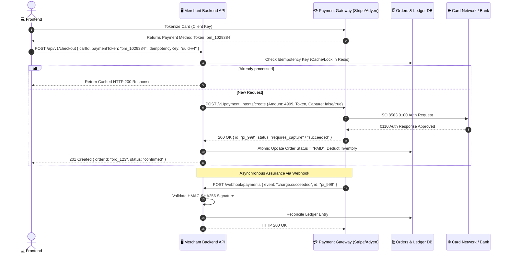

### Backend Engineering Rules:

1. **Strict Idempotency Keys**:
   - Network timeouts between backend and gateway can cause double charges.
   - Always supply an `Idempotency-Key: <unique-uuid>` in HTTP headers. If a retry occurs due to network drops, the payment gateway guarantees the card is charged exactly once.
2. **Never Store Forbidden Data (PCI-DSS Strict Rules)**:
   - **BANNED from any merchant database/log**: Plaintext PAN, CVV/CVC, Magstripe dumps, PIN blocks.
   - **ALLOWED to store**: Truncated PAN (first 6 and last 4: `411122******1234`), Expiration Date, Gateway Token ID (`pm_xyz`), Card Brand (`VISA`), Cardholder Name.
3. **Webhook Verification (HMAC Signature)**:
   - Never trust frontend redirects alone (a user can close the browser or tamper with query params).
   - The backend only fulfills digital goods when receiving an authentic, signed webhook (`X-Signature: HMAC-SHA256(payload, secret)`).
4. **Smart BIN Routing**:
   - Large global backends inspect the card BIN to route transactions through local acquirers (e.g., routing an EU card through Adyen Europe, and a US card through Chase Paymentech) to save 1–2% on cross-border interchange fees and maximize authorization rates.

---

## 4. Complete Data & Protocol Translation Matrix

How a single piece of user data translates from the physical card to the UI, down to low-level banking wires:

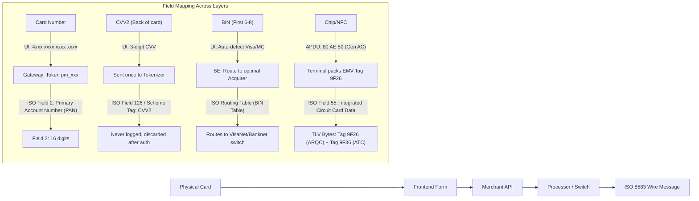

| Card Concept               | Frontend (UI/UX)                                                      | Backend (API/DB)                                                   | Low-Level Bank Wire (ISO 8583)                                                                         |
| -------------------------- | --------------------------------------------------------------------- | ------------------------------------------------------------------ | ------------------------------------------------------------------------------------------------------ |
| **PAN (Card Number)**      | Masked input field; Luhn validated locally.                           | Stored as token (`pm_abc`) + Masked (`**** 1234`).                 | **Field 2**: Raw 16-19 digit account number.                                                           |
| **BIN (First 6-8 digits)** | Renders card logo; adjusts field lengths and displays promos.         | Directs multi-currency routing & anti-fraud velocity checks.       | Evaluated by scheme switches to route to Issuing Bank CBS.                                             |
| **CVV2 (Printed code)**    | Form input; never persisted in browser memory.                        | Never touches merchant server (bound inside gateway iframe).       | Forwarded in transient payload to Issuer HSM for match check.                                          |
| **iCVV / Chip ARQC**       | N/A (Handled in POS hardware).                                        | N/A (Encrypted by terminal P2PE hardware).                         | **Field 55**: EMV Tag `9F26` (Application Cryptogram).                                                 |
| **PIN Block**              | Encrypted in tamper-proof terminal PIN pad.                           | Never visible in application memory.                               | **Field 52**: Encrypted PIN Block (ISO 9564-1 Format 0/4).                                             |
| **Processing Code**        | Purchase vs Refund vs Cash Withdrawal.                                | HTTP Route (`/charges`, `/refunds`, `/withdrawals`).               | **Field 3**: 6-digit code (e.g., `000000` = Purchase, `010000` = Cash).                                |
| **Auth Response Code**     | Displays user-friendly error ("Card declined", "Insufficient funds"). | Decodes gateway error codes (`insufficient_funds`, `stolen_card`). | **Field 39**: 2-digit response code (`00` = Approved, `51` = Insufficient funds, `05` = Do Not Honor). |

---

## 5. 3D Secure 2.0 (3DS2) & SCA: Frictionless vs Challenge Flow

3D Secure (EMV 3-D Secure 2.x) shifts fraud liability from the merchant to the issuer:

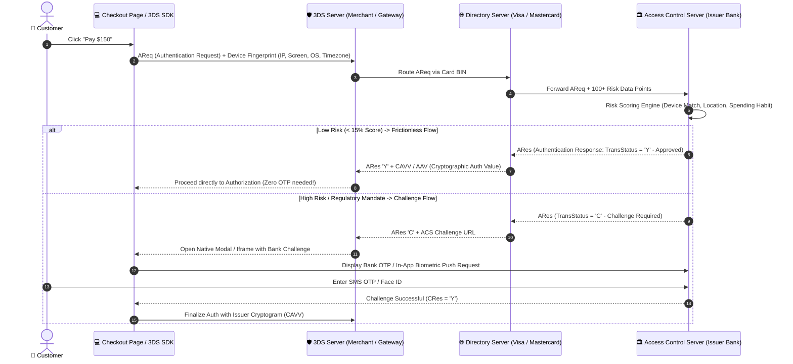

### Key 3DS Concepts:

- **CAVV / AAV (Cardholder Authentication Verification Value)**: A cryptographic signature returned by the bank's ACS proving the user authenticated. Passed in ISO 8583 Field 126.
- **Liability Shift**: When 3DS2 succeeds (`TransStatus = 'Y'`), if the purchase later turns out to be fraudulent, the **issuing bank bears the loss**, not the merchant.

---

## 6. Chargeback & Dispute Lifecycle

When a cardholder calls their bank disputing a charge ("I never bought this" or "Item not received"):

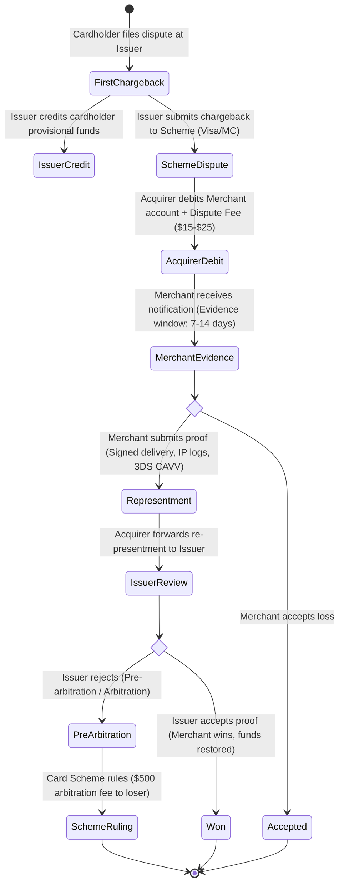

---

## 7. Fallbacks & High Availability: STIP (Stand-In Processing)

What happens if the customer's bank servers crash during Black Friday?

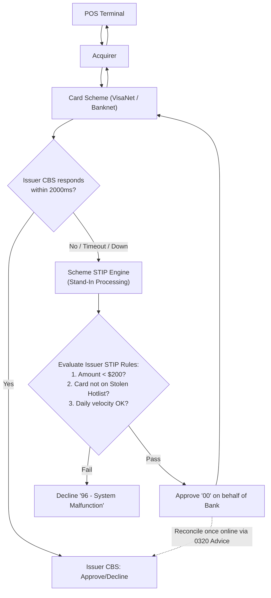

- **STIP (Stand-In Processing)**: Visa and Mastercard provide STIP where their central switch approves transactions within pre-agreed limits set by the issuer if the issuer's core banking host is unreachable.

---

## 8. The Essential ISO 8583 Fields Cheat Sheet

The universal lingua franca of banking switches:

```
+-----------+---------------------------------+------------------------------------------+
| Field     | Name                            | Real-World Example / Format              |
+-----------+---------------------------------+------------------------------------------+
| MTI       | Message Type Identifier         | 0100 (Auth Req), 0110 (Auth Resp),       |
|           |                                 | 0200 (Financial Req), 0420 (Reversal)    |
| Field 2   | Primary Account Number (PAN)    | 411122******1234 (16-19 digits)          |
| Field 3   | Processing Code                 | 000000 (Purchase), 010000 (Cash W/D)     |
| Field 4   | Amount, Transaction             | 000000010000 ($100.00 in cents)          |
| Field 11  | Systems Trace Audit Number(STAN)| 123456 (Terminal sequence counter)       |
| Field 14  | Expiration Date                 | 2812 (YYMM: Dec 2028)                    |
| Field 22  | POS Entry Mode                  | 051 (Chip), 071 (NFC Contactless),       |
|           |                                 | 021 (Magstripe), 012 (Manual E-comm)     |
| Field 38  | Authorization Identification    | 'OK5821' (Approval Code from Issuer)     |
| Field 39  | Response Code                   | '00' (Approve), '51' (No funds),         |
|           |                                 | '05' (Do Not Honor), '54' (Expired Card) |
| Field 41  | Card Acceptor Terminal ID       | 'TERM0001' (Physical POS identifier)     |
| Field 42  | Card Acceptor Identification    | 'MERC123456789' (Merchant Account ID)    |
| Field 49  | Currency Code                   | 840 (USD), 978 (EUR), 356 (INR)          |
| Field 52  | Personal Identification Number  | Encrypted 8-byte 3DES PIN Block          |
| Field 55  | EMV Chip Data (ICC TLV Tags)    | Tag 9F26 (ARQC), 9F36 (ATC), 9F37 (UN)   |
+-----------+---------------------------------+------------------------------------------+
```

---

## 9. Edge Cases, Offline Modes & The Economics of a Swipe

### 1. Offline Floor Limits & Delayed Auth (Airplanes, Subways, Cruise Ships)

How can you tap your card on an airplane at 35,000 feet or at an underground subway turnstile with zero internet connection?

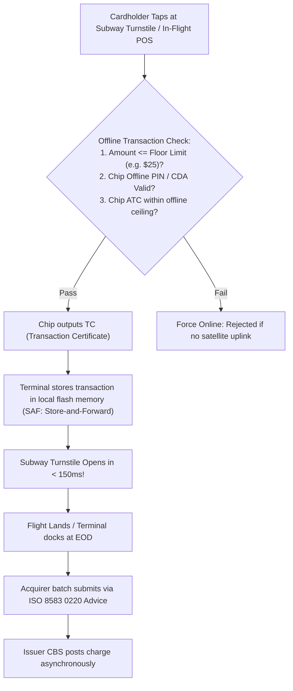

- **Offline Data Authentication (ODA)**: The terminal uses the card's on-chip public key certificate to verify its digital signature (CDA / DDA) offline without asking the bank.
- **Store and Forward (SAF)**: Terminal accepts the transaction risk locally and uploads it hours later.

### 2. The Economics: Who Takes What? (Interchange, Scheme, Assessment)

On a **$100.00** purchase, the merchant receives approximately **$97.20**. Where did the **$2.80 (2.8% Merchant Discount Rate - MDR)** go?

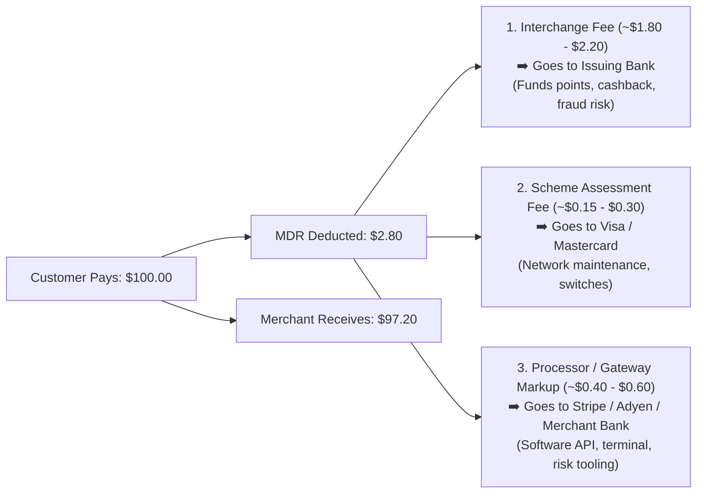

### 3. Vouchers & Gift Cards: Real-World Edge Cases

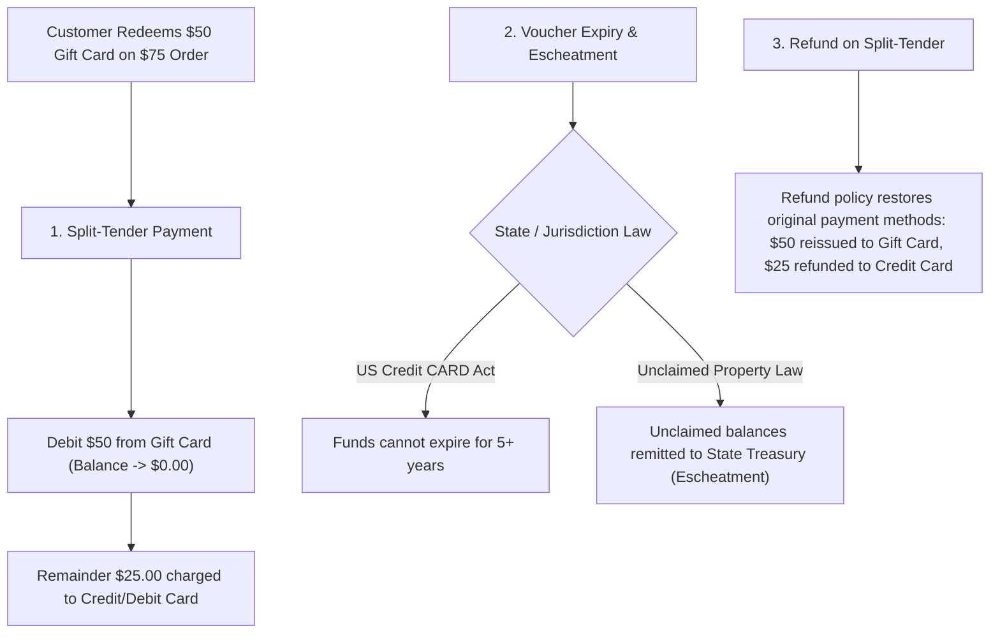

---

## 10. Auto-Debit, Recurring Subscriptions & Mandates (CIT vs. MIT)

**Is Auto-Payment / Auto-Debit the same mechanism?**
Yes and no: It travels on the **exact same interbank card rails (ISO 8583)**, but it uses a completely different authorization class called **MIT (Merchant-Initiated Transaction)** instead of **CIT (Customer-Initiated Transaction)**, powered by **Card-on-File (CoF) Network Tokenization** and **Standing Mandates**.

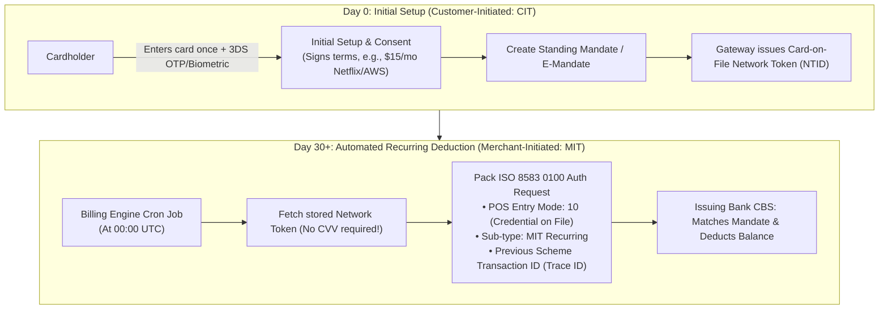

### 1. CIT (Customer-Initiated) vs. MIT (Merchant-Initiated)

| Dimension           | One-Time / Initial Payment (CIT)                   | Auto-Debit / Recurring Payment (MIT)                                                      |
| ------------------- | -------------------------------------------------- | ----------------------------------------------------------------------------------------- |
| **Who is present?** | Customer is actively on the screen / terminal      | Customer is asleep / offline; triggered by a server cron job                              |
| **CVV Required?**   | **Yes** (CVV2 entered on web)                      | **No!** CVV2 cannot be stored. The bank relies on the stored mandate agreement            |
| **2FA / 3DS OTP?**  | **Yes** (Customer completes SMS OTP / push notice) | **Exempt / Pre-authorized** (SCA recurring exemption under EU PSD2 & India RBI e-Mandate) |
| **Traceability**    | Normal transaction ID                              | Must carry `Original Scheme Transaction ID` linking back to the initial CIT setup!        |
| **ISO 8583 Flag**   | POS Entry Mode: `012` (E-comm with CVV)            | POS Entry Mode: `10` (Credential on File) + Sub-type: `Recurring / Installment`           |

---

### 2. End-to-End Recurring Auto-Debit Lifecycle

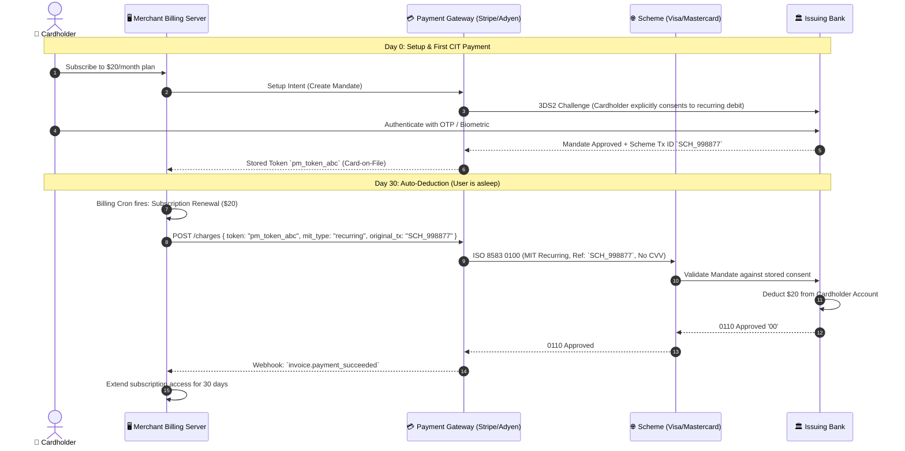

---

### 3. What Happens When Auto-Debit Fails? (Dunning & Smart Retries)

Unlike a manual checkout where the user can immediately try another card, automated billing failures require a **Dunning & Smart Retry Engine**:

```mermaid
flowchart TD
    Fail["Auto-Debit Fails: Response '51' (Insufficient Funds) or '54' (Expired Card)"] --> Decider{"Analyze Bank Decline Code"}

    Decider -->|Soft Decline: '51' Insufficient Funds| Retry["Smart Retry Algorithm (Dunning Engine)"]
    Retry --> RetryTiming["Calculate Optimal Retry Time:<br/>• Wait for Payday (1st or 15th of month)<br/>• Exponential backoff (Day 1, Day 3, Day 7)"]
    RetryTiming --> ReAuth["Re-attempt MIT Auth"]
    ReAuth -->|Success| Recovered["Subscription Restored!"]

    Decider -->|Hard Decline: '54' Card Expired or Replaced| ABU["Account Updater Service (Visa VAU / Mastercard ABU)"]
    ABU --> SchemeQuery["Gateway queries Card Scheme Account Updater"]
    SchemeQuery --> NewCard["Scheme provides updated PAN & Expiry without disturbing user!"]
    NewCard --> ReAuth

    Decider -->|Exhausted All Retries (Day 14)| Cancel["Send Dunning Email -> Grace Period Expired -> Suspend Subscription"]
```

### 4. Key Building Blocks of Auto-Debit Systems:

1. **Account Updater (Visa VAU / Mastercard ABU)**:
   - When a user loses their card or it expires, the bank issues a new card. The Visa Account Updater (VAU) automatically updates the stored token with the new card number behind the scenes. Netflix or Spotify does **not** even have to ask you for your new card!
2. **Network Tokenization**:
   - Rather than saving the real PAN, the gateway requests a **Network Token** directly from Visa/Mastercard. This token is locked to that specific merchant and automatically stays up to date when the underlying plastic card is replaced.
3. **Regulatory E-Mandate Notifications**:
   - In jurisdictions like India (RBI guidelines) or Europe (PSD2), merchants must send a **pre-debit SMS/email notification** 24 to 48 hours _before_ firing the MIT auto-debit, giving the user a chance to pause or cancel.
