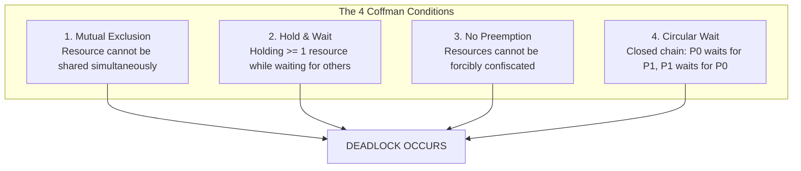
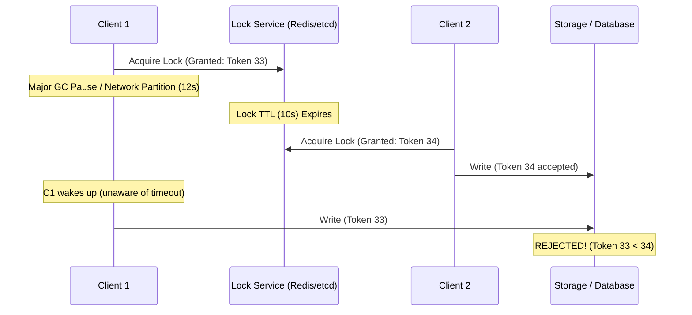
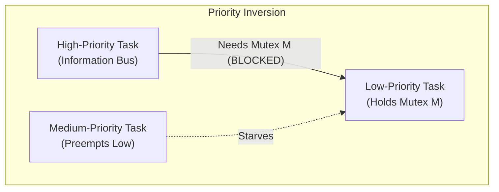
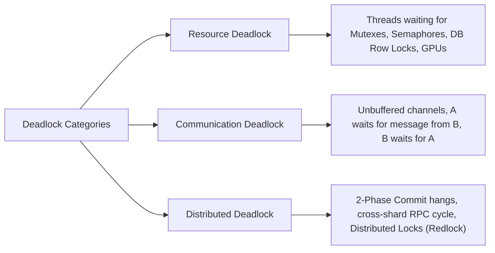
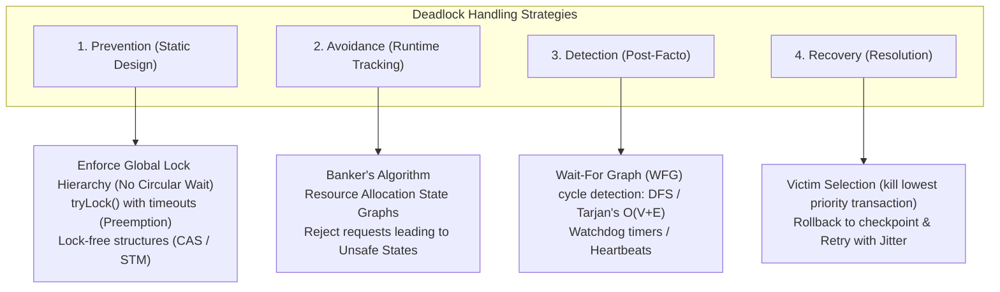
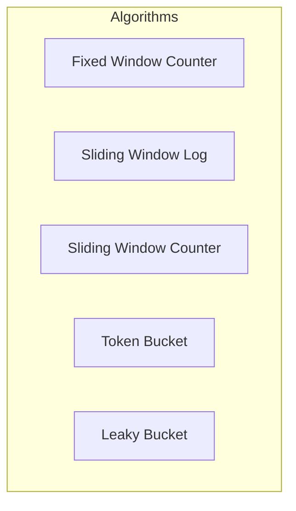
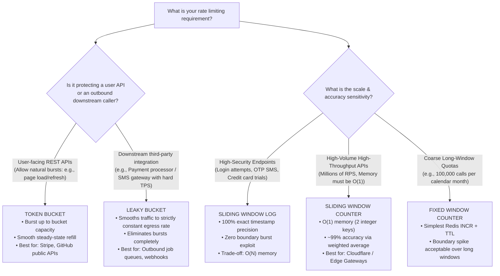
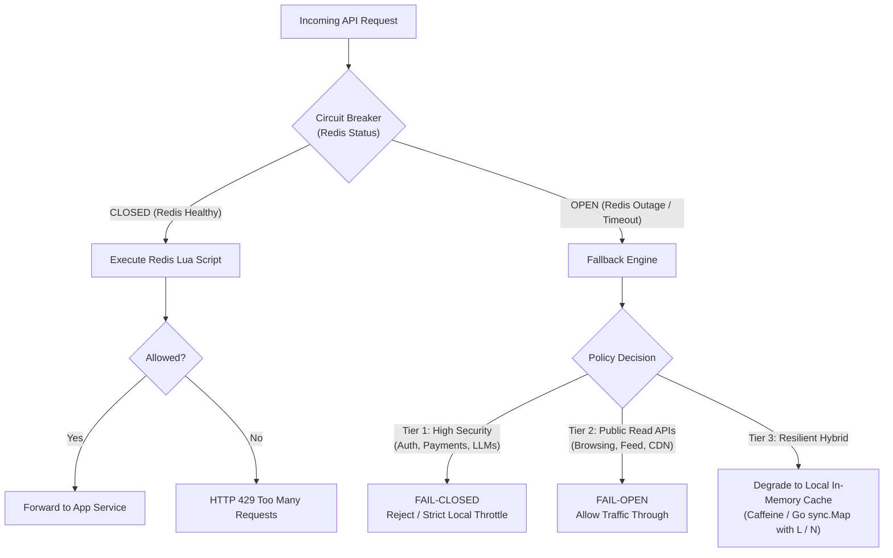
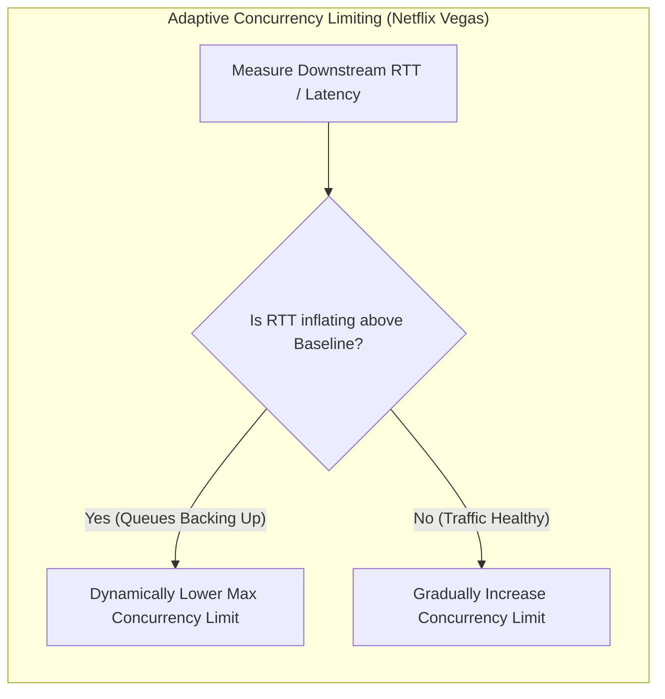

# 🛡️ Distributed Rate Limiting & Deadlocks Engineering Master Cheat Sheet

An architectural and interview-ready reference guide covering **Concurrency Deadlocks** and **Distributed Rate Limiting**.

---

## Table of Contents

- [🛡️ Distributed Rate Limiting \& Deadlocks Engineering Master Cheat Sheet](#️-distributed-rate-limiting--deadlocks-engineering-master-cheat-sheet)
  - [Table of Contents](#table-of-contents)
- [PART 1: Deadlocks in Concurrent \& Distributed Systems](#part-1-deadlocks-in-concurrent--distributed-systems)
  - [1.1 Core Definition \& The 4 Coffman Conditions](#11-core-definition--the-4-coffman-conditions)
    - [💡 Mental Model \& Analogy: The Single-Lane Mountain Tunnel](#-mental-model--analogy-the-single-lane-mountain-tunnel)
  - [1.2 Deadlock vs. Livelock vs. Starvation](#12-deadlock-vs-livelock-vs-starvation)
  - [1.3 Real-World Case Study 1: The ABBA Mutex Deadlock (Code Snippet \& Fix)](#13-real-world-case-study-1-the-abba-mutex-deadlock-code-snippet--fix)
    - [The Crash Scenario: Bank Account Transfer](#the-crash-scenario-bank-account-transfer)
    - [The Buggy Code (Go)](#the-buggy-code-go)
    - [The Fix: Global Lock Ordering (Eliminates Circular Wait)](#the-fix-global-lock-ordering-eliminates-circular-wait)
    - [The Buggy Code \& Fix (TypeScript / Node.js)](#the-buggy-code--fix-typescript--nodejs)
  - [1.4 Real-World Case Study 2: Database Row-Level Lock Inversion (`FOR UPDATE`)](#14-real-world-case-study-2-database-row-level-lock-inversion-for-update)
    - [Database Fixes:](#database-fixes)
  - [1.5 Real-World Case Study 3: MySQL InnoDB Gap Lock Deadlock (`REPEATABLE READ`)](#15-real-world-case-study-3-mysql-innodb-gap-lock-deadlock-repeatable-read)
    - [The Trap:](#the-trap)
    - [Gap Lock Remedies:](#gap-lock-remedies)
  - [1.6 Real-World Case Study 4: Thread \& Connection Pool Exhaustion Deadlock](#16-real-world-case-study-4-thread--connection-pool-exhaustion-deadlock)
    - [The Scenario:](#the-scenario)
    - [The Fix:](#the-fix)
  - [1.7 Real-World Case Study 5: Distributed Lock Lease Expiry \& Fencing Tokens](#17-real-world-case-study-5-distributed-lock-lease-expiry--fencing-tokens)
    - [The Fix: Monotonic Fencing Tokens](#the-fix-monotonic-fencing-tokens)
  - [1.8 Real-World Case Study 6: Shared-to-Exclusive Lock Upgrade Deadlock (`S` $\\to$ `X`)](#18-real-world-case-study-6-shared-to-exclusive-lock-upgrade-deadlock-s-to-x)
    - [The Fix:](#the-fix-1)
  - [1.9 Real-World Case Study 7: Unbuffered Channel \& Goroutine Deadlock (Go)](#19-real-world-case-study-7-unbuffered-channel--goroutine-deadlock-go)
    - [The TypeScript / JavaScript Equivalent: Circular Promise Deadlock](#the-typescript--javascript-equivalent-circular-promise-deadlock)
  - [1.10 Real-World Case Study 8: Priority Inversion \& The Mars Pathfinder Incident](#110-real-world-case-study-8-priority-inversion--the-mars-pathfinder-incident)
    - [The Remedy: Priority Inheritance Protocol (PIP)](#the-remedy-priority-inheritance-protocol-pip)
  - [1.11 Deadlock Types: Resource, Communication \& Distributed](#111-deadlock-types-resource-communication--distributed)
  - [1.12 Distributed Deadlock Prevention: Wait-Die vs. Wound-Wait](#112-distributed-deadlock-prevention-wait-die-vs-wound-wait)
  - [1.13 Prevention, Avoidance, Detection \& Recovery Techniques](#113-prevention-avoidance-detection--recovery-techniques)
    - [Prevention (Breaking Coffman Conditions)](#prevention-breaking-coffman-conditions)
    - [Avoidance (Banker's Algorithm)](#avoidance-bankers-algorithm)
    - [Detection \& Recovery](#detection--recovery)
    - [🧭 When to Use Which Deadlock Strategy: Decision Matrix](#-when-to-use-which-deadlock-strategy-decision-matrix)
- [PART 2: Rate Limiting Architectures \& Algorithms](#part-2-rate-limiting-architectures--algorithms)
  - [2.1 Horizontal vs. Vertical Scaling Considerations](#21-horizontal-vs-vertical-scaling-considerations)
    - [💡 Mental Model \& Analogy: Vertical vs. Horizontal Rate Limiting](#-mental-model--analogy-vertical-vs-horizontal-rate-limiting)
    - [Deep Dive: Vertical Scaling (In-Memory Single Node)](#deep-dive-vertical-scaling-in-memory-single-node)
    - [Deep Dive: Horizontal Scaling (Multi-Node Fleet)](#deep-dive-horizontal-scaling-multi-node-fleet)
  - [2.2 Distributed Rate Limiting with Key-Value Store (Redis)](#22-distributed-rate-limiting-with-key-value-store-redis)
  - [2.3 Redis Concurrency \& Atomic Execution (The Lua Script Solution)](#23-redis-concurrency--atomic-execution-the-lua-script-solution)
    - [The Naive Trap: Race Condition (TOCTOU)](#the-naive-trap-race-condition-toctou)
    - [The Solution: Atomic Redis Lua Script (Sliding Window Log)](#the-solution-atomic-redis-lua-script-sliding-window-log)
    - [The $O(1)$ Memory Solution: Sliding Window Counter Lua Script (Cloudflare / Stripe Style)](#the-o1-memory-solution-sliding-window-counter-lua-script-cloudflare--stripe-style)
  - [2.4 Algorithm Matrix: Comparison](#24-algorithm-matrix-comparison)
    - [💡 Intuitive Real-World Analogies for the 5 Algorithms](#-intuitive-real-world-analogies-for-the-5-algorithms)
  - [2.5 Deep Dive: Fixed Window vs. Sliding Window (When to Use Which?)](#25-deep-dive-fixed-window-vs-sliding-window-when-to-use-which)
    - [The Fixed Window Boundary Problem (The 2x Spike)](#the-fixed-window-boundary-problem-the-2x-spike)
    - [The Sliding Window Counter Fix (Weighted Average)](#the-sliding-window-counter-fix-weighted-average)
      - [Example Calculation:](#example-calculation)
    - [Decision Guide:](#decision-guide)
    - [🧭 When to Use Which Rate Limiting Algorithm: Decision Flowchart](#-when-to-use-which-rate-limiting-algorithm-decision-flowchart)
  - [2.6 High Availability \& Resilience: Redis Outage Fallback Strategies](#26-high-availability--resilience-redis-outage-fallback-strategies)
    - [Strategy 1: Fail-Open vs. Fail-Closed Matrix](#strategy-1-fail-open-vs-fail-closed-matrix)
    - [Strategy 2: Multi-Tiered Local In-Memory Fallback](#strategy-2-multi-tiered-local-in-memory-fallback)
    - [Strategy 3: Circuit Breakers (Resilience4j / Envoy)](#strategy-3-circuit-breakers-resilience4j--envoy)
    - [Strategy 4: Redis Architectural Redundancy](#strategy-4-redis-architectural-redundancy)
    - [Strategy 5: The CAP \& PACELC Theorem Trade-Off in Rate Limiting](#strategy-5-the-cap--pacelc-theorem-trade-off-in-rate-limiting)
      - [The PACELC Theorem View:](#the-pacelc-theorem-view)
  - [2.7 Critical Edge Cases \& Real-World Pitfalls](#27-critical-edge-cases--real-world-pitfalls)
    - [1. Clock Skew across Distributed Nodes](#1-clock-skew-across-distributed-nodes)
    - [2. The IP Spoofing Trap (`X-Forwarded-For`)](#2-the-ip-spoofing-trap-x-forwarded-for)
    - [3. Key Cardinality \& Memory Explosion](#3-key-cardinality--memory-explosion)
    - [4. Multi-Tier Defense-in-Depth](#4-multi-tier-defense-in-depth)
    - [5. Redis Cluster `CROSSSLOT` Error \& Hash Tags `{...}`](#5-redis-cluster-crossslot-error--hash-tags-)
    - [6. Hot Key Contention \& Sub-Key Sharding (Salting)](#6-hot-key-contention--sub-key-sharding-salting)
    - [7. Cost-Based \& Multi-Dimensional Rate Limiting](#7-cost-based--multi-dimensional-rate-limiting)
    - [8. Client-Side Resilience: Exponential Backoff with Full Jitter](#8-client-side-resilience-exponential-backoff-with-full-jitter)
  - [2.8 Multi-Region Rate Limiting: Quota Leases \& Local Batching (Google Doorman Pattern)](#28-multi-region-rate-limiting-quota-leases--local-batching-google-doorman-pattern)
    - [The Architectural Solution:](#the-architectural-solution)
  - [2.9 Adaptive Concurrency Limits vs. Static RPS Rate Limits (Netflix Vegas \& Little's Law)](#29-adaptive-concurrency-limits-vs-static-rps-rate-limits-netflix-vegas--littles-law)
    - [The Solution: Netflix Vegas (TCP Vegas Algorithm applied to APIs)](#the-solution-netflix-vegas-tcp-vegas-algorithm-applied-to-apis)
  - [2.10 Standard HTTP Headers \& Client Contract](#210-standard-http-headers--client-contract)
  - [💡 Quick Interview Recap Cheatsheet](#-quick-interview-recap-cheatsheet)

---

# PART 1: Deadlocks in Concurrent & Distributed Systems

## 1.1 Core Definition & The 4 Coffman Conditions

A **Deadlock** is a state where a set of threads, processes, or distributed transactions are permanently blocked because each holds a resource that another needs, and none can proceed without acquiring the other's resource.

A system can enter a deadlock **if and only if all four Coffman conditions** hold simultaneously:



> [!IMPORTANT]
> **The Golden Law of Deadlock Prevention:**
> Breaking **any single one** of the four Coffman conditions mathematically guarantees that deadlock cannot occur!

### 💡 Mental Model & Analogy: The Single-Lane Mountain Tunnel

Imagine a narrow mountain tunnel that only fits one car at a time:

1. **Mutual Exclusion:** Two cars cannot physically occupy the same tunnel segment simultaneously.
2. **Hold & Wait:** Car A enters from the East and occupies the first half while demanding the second half; Car B enters from the West and occupies the second half while demanding the first half.
3. **No Preemption:** Neither driver has a helicopter or crane to forcibly hoist the other car away.
4. **Circular Wait:** Driver A insists Driver B must back up first; Driver B insists Driver A must back up first. Both engines shut off forever.

**The Core Mental Model:** _Deadlock is a Directed Cycle in a Resource Allocation Graph._ If a global total order is enforced on all resources ($R_1 < R_2 < R_3$), a cycle is mathematically impossible because all graph edges point in one direction!

---

## 1.2 Deadlock vs. Livelock vs. Starvation

| Attribute              | Deadlock                                                                       | Livelock                                                                       | Starvation                                                               |
| :--------------------- | :----------------------------------------------------------------------------- | :----------------------------------------------------------------------------- | :----------------------------------------------------------------------- |
| **Thread State**       | Blocked / Sleeping / Waiting                                                   | Active / Running / Busy looping                                                | Ready / Runnable                                                         |
| **CPU Usage**          | **0% CPU** (threads suspended indefinitely)                                    | **100% CPU** (threads burning cycles)                                          | Normal CPU consumption by other threads                                  |
| **State Change**       | No state changes occur                                                         | States change rapidly without forward progress                                 | Progress made by high-priority threads                                   |
| **Real-World Analogy** | Two people face each other in a narrow corridor; both stop and freeze forever. | Two people try to pass; both step left, then right in sync, endlessly dodging. | A polite diner waiting in line while aggressive VIPs keep cutting ahead. |
| **Primary Remedy**     | Lock ordering, timeouts, preemption                                            | Randomized backoff (jitter)                                                    | Fair queuing, aging, round-robin scheduling                              |

---

## 1.3 Real-World Case Study 1: The ABBA Mutex Deadlock (Code Snippet & Fix)

### The Crash Scenario: Bank Account Transfer

Thread 1 transfers \$100 from Account A to Account B.
Thread 2 transfers \$50 from Account B to Account A simultaneously.

```
Thread 1 (A -> B): Acquires Lock(A) ──────────> Tries to acquire Lock(B) [BLOCKED]
Thread 2 (B -> A): Acquires Lock(B) ──────────> Tries to acquire Lock(A) [BLOCKED]
                       ▲                                      │
                       └────────────── DEADLOCK ──────────────┘
```

### The Buggy Code (Go)

```go
package main

import (
	"sync"
	"time"
)

type Account struct {
	ID      int
	Balance float64
	mu      sync.Mutex
}

// BUGGY: Transfers money between two accounts
func BuggyTransfer(from, to *Account, amount float64) {
	// Thread 1 locks 'from' (Account A)
	from.mu.Lock()
	defer from.mu.Unlock()

	// Simulate work/context switch
	time.Sleep(10 * time.Millisecond)

	// Thread 1 attempts to lock 'to' (Account B), but Thread 2 has it!
	to.mu.Lock()
	defer to.mu.Unlock()

	from.Balance -= amount
	to.Balance += amount
}
```

### The Fix: Global Lock Ordering (Eliminates Circular Wait)

Enforce that locks are **always acquired in a deterministic order** (e.g., ascending Account ID), regardless of who is sending or receiving:

```go
// FIXED: Eliminates Circular Wait by enforcing global ID ordering
func SafeTransfer(from, to *Account, amount float64) {
	if from.ID == to.ID {
		return // Guard against self-transfer deadlock
	}

	firstLock := from
	secondLock := to

	// Deterministic total ordering based on immutable ID
	if from.ID > to.ID {
		firstLock = to
		secondLock = from
	}

	firstLock.mu.Lock()
	defer firstLock.mu.Unlock()

	secondLock.mu.Lock()
	defer secondLock.mu.Unlock()

	from.Balance -= amount
	to.Balance += amount
}
```

### The Buggy Code & Fix (TypeScript / Node.js)

In Node.js, JavaScript is single-threaded, but **asynchronous concurrency (`async`/`await`) with in-memory mutexes (or distributed locks)** suffers from the exact same ABBA deadlock. Two concurrent promises waiting on each other will hang forever, leaking memory and exhausting connection pools:

```typescript
// Minimal async mutex primitive
class AsyncMutex {
  private queue: (() => void)[] = [];
  private locked = false;

  async acquire(): Promise<() => void> {
    return new Promise((resolve) => {
      const release = () => {
        if (this.queue.length > 0) {
          const next = this.queue.shift()!;
          next();
        } else {
          this.locked = false;
        }
      };

      if (!this.locked) {
        this.locked = true;
        resolve(release);
      } else {
        this.queue.push(() => resolve(release));
      }
    });
  }
}

interface Account {
  id: number;
  balance: number;
  mutex: AsyncMutex;
}

// ❌ BUGGY (TypeScript): Promise deadlock under concurrent reverse transfers
async function buggyTransfer(from: Account, to: Account, amount: number): Promise<void> {
  const releaseFrom = await from.mutex.acquire();
  try {
    // Simulate async I/O / context switch
    await new Promise((r) => setTimeout(r, 10));

    // If a reverse transfer (B -> A) runs concurrently, this promise NEVER resolves!
    const releaseTo = await to.mutex.acquire();
    try {
      from.balance -= amount;
      to.balance += amount;
    } finally {
      releaseTo();
    }
  } finally {
    releaseFrom();
  }
}

// ✅ FIXED (TypeScript): Global ID ordering guarantees no circular wait
async function safeTransfer(from: Account, to: Account, amount: number): Promise<void> {
  if (from.id === to.id) return;

  // Deterministic total ordering based on immutable account ID
  const [first, second] = from.id < to.id ? [from, to] : [to, from];

  const releaseFirst = await first.mutex.acquire();
  try {
    const releaseSecond = await second.mutex.acquire();
    try {
      from.balance -= amount;
      to.balance += amount;
    } finally {
      releaseSecond();
    }
  } finally {
    releaseFirst();
  }
}
```

---

## 1.4 Real-World Case Study 2: Database Row-Level Lock Inversion (`FOR UPDATE`)

In relational databases (PostgreSQL, MySQL InnoDB), two concurrent transactions locking the same rows in reverse order will trigger a database deadlock:

```sql
-- Transaction T1 (Transfer from User 10 to User 20)
BEGIN TRANSACTION;
SELECT * FROM accounts WHERE id = 10 FOR UPDATE; -- Acquires Exclusive Row Lock on 10
-- (T2 runs step 1 below)
SELECT * FROM accounts WHERE id = 20 FOR UPDATE; -- BLOCKED waiting for T2!

-- Transaction T2 (Transfer from User 20 to User 10)
BEGIN TRANSACTION;
SELECT * FROM accounts WHERE id = 20 FOR UPDATE; -- Acquires Exclusive Row Lock on 20
SELECT * FROM accounts WHERE id = 10 FOR UPDATE; -- BLOCKED waiting for T1!
-- DB Engine detects cycle in Wait-For Graph:
-- ERROR: deadlock detected (Transaction T2 killed by DB engine victim selection)
```

### Database Fixes:

1. **Sort Query IDs Before Locking:**
   ```sql
   -- Always select and lock multiple rows in ascending order:
   SELECT * FROM accounts WHERE id IN (10, 20) ORDER BY id ASC FOR UPDATE;
   ```
2. **Use Lock Timeouts or `NOWAIT` / `SKIP LOCKED`:**
   ```sql
   SELECT * FROM accounts WHERE id = 20 FOR UPDATE NOWAIT; -- Fails immediately instead of hanging
   ```

---

## 1.5 Real-World Case Study 3: MySQL InnoDB Gap Lock Deadlock (`REPEATABLE READ`)

One of the most insidious real-world deadlocks occurs without locking existing rows at all, due to **Gap Locks** in MySQL's default `REPEATABLE READ` isolation level.

### The Trap:

Gap locks prevent phantom reads by locking the _space_ between index records. Crucially: **Gap locks do not conflict with other gap locks, but they conflict with `INSERT` operations trying to write into that gap.**

```
Suppose table `users` has records with IDs 1 and 10. The gap is (1, 10).

Session 1: SELECT * FROM users WHERE id = 5 FOR UPDATE;
           --> ID 5 does not exist! MySQL grants a Gap Lock on (1, 10) to Session 1.

Session 2: SELECT * FROM users WHERE id = 7 FOR UPDATE;
           --> ID 7 does not exist! MySQL grants a Gap Lock on (1, 10) to Session 2.
           (Both sessions are allowed to hold gap locks on the same range simultaneously!)

Session 1: INSERT INTO users (id) VALUES (5);
           --> Blocked! Waiting for Session 2's Gap Lock on (1, 10) to release.

Session 2: INSERT INTO users (id) VALUES (7);
           --> Blocked! Waiting for Session 1's Gap Lock on (1, 10) to release.
           --> 💥 INSTANT DEADLOCK! MySQL kills Session 2 with:
           -- ERROR 1213 (40001): Deadlock found when trying to get lock; try restarting transaction
```

### Gap Lock Remedies:

1. **Switch Isolation Level to `READ COMMITTED`:** This disables gap locks for standard queries (gap locks only remain for foreign key and duplicate key checks).
2. **Use `INSERT ... ON DUPLICATE KEY UPDATE` carefully:** Better yet, insert first and handle unique constraint collisions in application code.

---

## 1.6 Real-World Case Study 4: Thread & Connection Pool Exhaustion Deadlock

### The Scenario:

An application has a Fixed Thread Pool of size `N=4`.

- A parent task occupies Thread 1.
- The parent task submits a child task to the **same pool** and blocks waiting for the result (`future.get()`).
- Under load, 4 parent tasks run simultaneously, occupying all 4 threads.
- All 4 child tasks sit in the queue waiting for a free thread.
- **Deadlock:** The parent tasks will never finish until child tasks execute, but child tasks cannot execute until parent tasks release a thread.

### The Fix:

- **Never submit interdependent tasks to the same thread pool.** Split into dedicated pools (e.g., `ParentWorkerPool` and `ChildTaskPool`).
- Use non-blocking reactive / async primitives (`CompletableFuture.thenCompose()`, async/await, goroutines).

---

## 1.7 Real-World Case Study 5: Distributed Lock Lease Expiry & Fencing Tokens

When using distributed locks (e.g., Redis via Redlock, ZooKeeper, or etcd), locks rely on a TTL lease.

```
Client 1 acquires Lock (TTL = 10s)
Client 1 pauses (Stop-the-world JVM GC pause / long DB query for 12s)
TTL expires! Lock is freed.
Client 2 acquires Lock (TTL = 10s)
Client 1 wakes up from GC pause (still thinks it holds the lock!)
Both Client 1 & Client 2 write to shared storage simultaneously! -> Split-Brain Data Corruption!
```



### The Fix: Monotonic Fencing Tokens

Every time a distributed lock is granted, return an incrementing number (`fencing_token`). Storage engines enforce:

```sql
UPDATE storage SET data = 'new_val', last_token = 34 WHERE last_token < 34;
```

If an expired client tries to write with token 33, the database rejects the write!

---

## 1.8 Real-World Case Study 6: Shared-to-Exclusive Lock Upgrade Deadlock (`S` $\to$ `X`)

A classic relational database deadlock occurring when multiple transactions read data first and attempt to modify it later.

```sql
-- Transaction T1
BEGIN;
SELECT * FROM inventory WHERE product_id = 99 LOCK IN SHARE MODE; -- Acquires Shared Lock (S)
-- (T2 runs step below)
UPDATE inventory SET stock = stock - 1 WHERE product_id = 99; -- Needs Exclusive Lock (X)!
-- BLOCKED: Cannot grant X lock while T2 holds an S lock!

-- Transaction T2
BEGIN;
SELECT * FROM inventory WHERE product_id = 99 LOCK IN SHARE MODE; -- Acquires Shared Lock (S)
-- (Both T1 and T2 now hold compatible S locks on product_id 99)
UPDATE inventory SET stock = stock - 1 WHERE product_id = 99; -- Needs Exclusive Lock (X)!
-- BLOCKED: Cannot grant X lock while T1 holds an S lock!
-- 💥 DEADLOCK: T1 waits for T2 to drop S lock; T2 waits for T1 to drop S lock!
```

### The Fix:

**Never read with a shared lock if you intend to update.** Acquire an exclusive lock immediately upon reading:

```sql
SELECT * FROM inventory WHERE product_id = 99 FOR UPDATE;
```

This forces T2 to wait right at the `SELECT`, serializing access and eliminating the upgrade race condition.

---

## 1.9 Real-World Case Study 7: Unbuffered Channel & Goroutine Deadlock (Go)

In CSP/Actor models (Go channels, Erlang, Kotlin coroutines), communication deadlocks occur when senders and receivers block synchronously without an asynchronous buffer:

```go
package main

// ❌ CRASH: "fatal error: all goroutines are asleep - deadlock!"
func BuggyChannel() {
    ch := make(chan int) // Unbuffered channel (handshake required)

    // Sending blocks until another goroutine reads from ch!
    ch <- 42

    // This line is never reached because the sender is blocked above
    val := <-ch
    println(val)
}

// ✅ FIXED: Launch consumer in background OR use buffered channel
func SafeChannel() {
    ch := make(chan int, 1) // Buffer size 1: Send does not block immediately
    ch <- 42
    val := <-ch
    println(val)
}
```

### The TypeScript / JavaScript Equivalent: Circular Promise Deadlock

In Node.js, when two asynchronous tasks depend on deferred promises that wait on each other before resolving, the event loop remains alive but tasks freeze indefinitely:

```typescript
// ❌ BUGGY (TypeScript): Circular Promise Deadlock
function buggyPromiseDeadlock(): Promise<void> {
  let resolveA: (val: string) => void;
  let resolveB: (val: string) => void;

  const promiseA = new Promise<string>((res) => {
    resolveA = res;
  });
  const promiseB = new Promise<string>((res) => {
    resolveB = res;
  });

  // Task 1: Waits for A before resolving B
  promiseA.then((val) => resolveB(`From A: ${val}`));

  // Task 2: Waits for B before resolving A
  promiseB.then((val) => resolveA(`From B: ${val}`));

  // Neither promiseA nor promiseB is ever resolved!
  // Node.js process hangs / HTTP request times out.
  return Promise.all([promiseA, promiseB]).then(() => {});
}

// ✅ FIXED (TypeScript): Introduce uncoupling, default resolution, or Promise.race timeout
async function safePromiseResolution(): Promise<void> {
  const timeoutMs = 2000;
  const timeout = new Promise<never>((_, reject) =>
    setTimeout(() => reject(new Error('Operation timed out: Deadlock prevention')), timeoutMs),
  );

  const task = (async () => {
    // Decoupled execution: task A resolves independently
    const resultA = await Promise.resolve('Data A');
    const resultB = await Promise.resolve(`Data B depends on ${resultA}`);
    return { resultA, resultB };
  })();

  // Guard all interdependent promises with Promise.race
  await Promise.race([task, timeout]);
}
```

---

## 1.10 Real-World Case Study 8: Priority Inversion & The Mars Pathfinder Incident

A famous real-world concurrency failure occurred on the **Mars Pathfinder spacecraft (1997)**.

```
Priority Hierarchy: High (Information Bus) > Medium (Communications Task) > Low (Meteorological Task)

1. Low-Priority Task acquires Mutex M (shared data bus).
2. High-Priority Task wakes up and requests Mutex M -> Blocked, waiting for Low-Priority task.
3. Medium-Priority Task wakes up. It doesn't need Mutex M! It preempts Low-Priority task.
4. RESULT: Low-Priority task never finishes; never releases Mutex M!
   High-Priority task is indirectly starved by Medium-Priority task.
   Watchdog timer fires -> System reboots repeatedly on Mars!
```



### The Remedy: Priority Inheritance Protocol (PIP)

When a High-priority task blocks on a mutex held by a Low-priority task, the Low-priority task **temporarily inherits the High priority** until it unlocks the mutex. This prevents Medium-priority tasks from preempting it, allowing it to release the lock immediately.

---

## 1.11 Deadlock Types: Resource, Communication & Distributed



1. **Resource Deadlock:**
   - Processes block waiting for exclusive access to shared system resources (memory, mutexes, I/O devices, connection pools).
2. **Communication Deadlock:**
   - Processes are blocked waiting for messages/events that will never arrive (e.g., Go unbuffered channel cyclic wait, circular RPC dependency).
3. **Distributed Deadlock:**
   - Spread across distinct microservices or database shards over a network.

---

## 1.12 Distributed Deadlock Prevention: Wait-Die vs. Wound-Wait

In distributed databases (like Google Spanner), transactions are assigned monotonically increasing timestamps $TS(T)$ when they start. Older transactions have smaller timestamps ($TS(T_{old}) < TS(T_{young})$).

| Scheme         | Rule when $T_{old}$ requests lock held by $T_{young}$           | Rule when $T_{young}$ requests lock held by $T_{old}$           | Preemption Style                                                 |
| :------------- | :-------------------------------------------------------------- | :-------------------------------------------------------------- | :--------------------------------------------------------------- |
| **Wait-Die**   | $T_{old}$ **Waits** for $T_{young}$ to finish.                  | $T_{young}$ **Dies** (aborts and restarts with same timestamp). | **Non-preemptive** (resources are never forcibly stolen).        |
| **Wound-Wait** | $T_{old}$ **Wounds** $T_{young}$ (preempts/aborts $T_{young}$). | $T_{young}$ **Waits** for $T_{old}$ to finish.                  | **Preemptive** (older transactions steal resources immediately). |

> [!TIP]
> **Why Wound-Wait is generally preferred:**
> In Wound-Wait, older transactions never abort; they bulldoze their way through younger ones. In Wait-Die, young transactions can die and restart multiple times while waiting for an older one to complete.

---

## 1.13 Prevention, Avoidance, Detection & Recovery Techniques



### Prevention (Breaking Coffman Conditions)

| Coffman Condition    | Technique to Break It                                                                                                             | Trade-off / Cost                                                                              |
| :------------------- | :-------------------------------------------------------------------------------------------------------------------------------- | :-------------------------------------------------------------------------------------------- |
| **Mutual Exclusion** | Use Lock-Free / Wait-Free Data Structures (Atomic CAS, Read-Copy-Update / RCU).                                                   | Complex implementation; memory overhead.                                                      |
| **Hold & Wait**      | Request all resources simultaneously upfront (Two-Phase Locking conservative variant).                                            | Low resource utilization; starving processes that need many resources.                        |
| **No Preemption**    | Use timed lock attempts: `tryLock(500ms)`. If lock not acquired, release all currently held locks and back off.                   | Must handle rollback logic for partially acquired resources.                                  |
| **Circular Wait**    | **Global Lock Ordering:** Impose strict hierarchical ordering on all lockable resources. Lock $R_i$ only before $R_j$ if $i < j$. | **Industry Standard Solution.** Requires developer discipline or static analysis enforcement. |

### Avoidance (Banker's Algorithm)

- Maintains current allocation, max claim, and available vectors.
- Checks if granting a resource keeps the system in a **Safe State** (a sequence exists where all processes can terminate).
- Rarely used in distributed microservices due to the requirement of knowing maximum resource claims in advance.

### Detection & Recovery

- Databases run a background **Deadlock Detector thread** every $N$ milliseconds (e.g., PostgreSQL `deadlock_timeout` default 1s).
- Constructs a directed **Wait-For Graph (WFG)**: vertices = transactions, edges = $T_1 \to T_2$ ($T_1$ waiting on $T_2$).
- Cycles indicate deadlock.
- **Recovery:** Picks a "Victim" (based on transaction age, cost to rollback, or locks held), aborts it, returns an error (`40001 serialization_failure`), and allows the survivor to complete.

### 🧭 When to Use Which Deadlock Strategy: Decision Matrix

| Layer / Scenario                                   | Recommended Strategy                   | Why This Choice?                                                                     | Key Trade-off                                                  |
| :------------------------------------------------- | :------------------------------------- | :----------------------------------------------------------------------------------- | :------------------------------------------------------------- |
| **In-Memory Threads / Mutexes**                    | **Global Lock Ordering**               | Mathematically guarantees no circular wait; 0 runtime latency penalty.               | Requires developers to strictly sort IDs/names before locking. |
| **Microservice Schedulers / Jobs**                 | **Timed Locks (`tryLock` + Leases)**   | Avoids infinite hangs if a worker node crashes mid-execution.                        | Must implement safe rollback and retry logic on timeout.       |
| **High-Throughput Counters & Metrics**             | **Lock-Free Atomics (CAS / RCU)**      | Impossible to deadlock (no locks acquired).                                          | Only supports simple primitive state manipulations.            |
| **Relational Databases (PostgreSQL/MySQL)**        | **ID-Sorted SQL + Deadlock Detection** | Run queries in deterministic ID order; DB engine handles edge-case victim recovery.  | Rollbacks introduce transient client retries.                  |
| **Distributed Transactions (Spanner/CockroachDB)** | **Wound-Wait Timestamping**            | Older transactions preempt younger ones; eliminates starvation and long wait queues. | Younger transactions occasionally abort and retry.             |

---

# PART 2: Rate Limiting Architectures & Algorithms

## 2.1 Horizontal vs. Vertical Scaling Considerations

```
              ┌─────────────────────────────────────────────────────────┐
              │             VERTICAL RATE LIMITING (Single Node)        │
              │                                                         │
              │  Client ───> [ Server A: In-Memory Token Bucket ]       │
              │              (Guava / Go time/rate / local RAM)        │
              │              • Latency: ~0ms (microseconds)             │
              │              • Concurrency: Local Mutex / Atomics       │
              └─────────────────────────────────────────────────────────┘

              ┌─────────────────────────────────────────────────────────┐
              │           HORIZONTAL RATE LIMITING (Multi-Node Fleet)   │
              │                                                         │
              │               ┌───> [ Server A ] ───┐                   │
              │  Client ──> LB├───> [ Server B ] ───┼───> [ Shared KV: ]│
              │               └───> [ Server C ] ───┘     [   Redis    ]│
              │  • Problem: Local counters allow 3x user quota          │
              │  • Solution: Centralized State / Sharded Redis Cluster  │
              └─────────────────────────────────────────────────────────┘
```

### 💡 Mental Model & Analogy: Vertical vs. Horizontal Rate Limiting

- **Vertical Analogy (The Solo Club Bouncer):** A single bouncer with a mechanical hand-clicker standing at the only door of a nightclub. He counts in microseconds with zero confusion. But if the club expands and opens 5 more doors, or the bouncer takes a break, crowd control completely breaks down.
- **Horizontal Analogy (Airport Security Gates):** 20 security checkpoints at an international airport, all scanning boarding passes against a centralized passenger flight database. A passenger cannot scan their pass at Gate 1, run over, and scan it again at Gate 5, because the centralized database tracks their single entry globally.
- **The Core Mental Model:** _"Local Microsecond Speed vs. Coordinated Global Accuracy"_.

| Dimension                 | Vertical (Single Node / Local Memory)                                                                                  | Horizontal (Distributed Fleet)                               |
| :------------------------ | :--------------------------------------------------------------------------------------------------------------------- | :----------------------------------------------------------- |
| **Storage Mechanism**     | Local heap / in-memory (`sync.Map`, Caffeine, Guava)                                                                   | Shared in-memory store (Redis, Aerospike, Memcached)         |
| **Latency**               | **< 1 microsecond** (in-process memory lookup)                                                                         | **1 - 5 milliseconds** (network hop to Redis)                |
| **Consistency**           | Perfect for that single instance                                                                                       | Requires atomic distributed commands or Lua scripts          |
| **Scaling Limit**         | Bound to single machine RAM/CPU ceiling                                                                                | Scales horizontally across Redis clusters / partitions       |
| **The "Leakage" Problem** | When scaling from 1 to $N$ nodes, local limit $L$ becomes an effective total limit of $N \times L$ unless coordinated. | Enforces strict global limits regardless of instance count.  |
| **Failure Mode**          | Server reboot resets user limits                                                                                       | Redis outage risks blocking or unthrottling the entire fleet |

### Deep Dive: Vertical Scaling (In-Memory Single Node)

- **How It Works:** Rate limiting state is stored directly in the application runtime's memory using thread-safe primitives (Java `AtomicLong` / Guava `RateLimiter`, Go `sync.Mutex` / `golang.org/x/time/rate`, Node.js in-memory LRU map).
- **Pros:**
  - **Sub-microsecond execution:** Zero network I/O; no JSON serialization or socket latency.
  - **Zero infrastructure dependency:** No external cache clusters to maintain or monitor.
- **Cons & Bottlenecks:**
  - **Hardware Ceiling:** A single machine can only scale so far in CPU cores and RAM before becoming cost-prohibitive.
  - **Single Point of Failure (SPOF):** If the instance restarts or crashes during a deployment, all customer quota states are instantly lost.
  - **Auto-Scaling Incompatibility:** Cannot coordinate limits when traffic spikes require spinning up more instances.

### Deep Dive: Horizontal Scaling (Multi-Node Fleet)

When traffic exceeds a single machine, applications scale horizontally across $N$ instances behind a Load Balancer. There are **5 architectural strategies** to handle rate limiting horizontally:

1. **Naive Local Counters (The $N \times L$ Leakage Problem):**
   - Each of the $N$ app servers enforces limit $L$ independently in local memory.
   - **The Trap:** With Round-Robin load balancing, a client can distribute requests across all nodes, making up to $N \times L$ requests!
   - Worse, if an **Auto-Scaling Group (ASG)** scales from 10 to 50 nodes during peak hours, the client's allowable quota unintentionally multiplies by $5\times$.
2. **Sticky Sessions (Client IP / User Affinity at Load Balancer):**
   - The Load Balancer hashes the client IP / User ID and always routes requests from that client to the same server.
   - **The Trap:** Hotspots! A single heavy client or corporate NAT gateway IP overloads one node while others sit idle. If that node crashes or the cluster rebalances, session state breaks.
3. **Centralized Key-Value Store (Redis / Aerospike) — Industry Standard:**
   - Stateless app servers delegate counter storage and atomic increments to a shared Redis cluster.
   - Guarantees strict global limits regardless of how many app instances spin up or down.
   - Trade-off: Introduces 1–3ms network latency and an external dependency that requires HA failover.
4. **Decentralized Peer-to-Peer Gossip Sync (Hazelcast / Cassandra):**
   - Nodes maintain local in-memory counters and periodically broadcast delta syncs via gossip protocol.
   - Trade-off: Eventual consistency means transient bursts can leak through before nodes synchronize.
5. **Hybrid Two-Tier Quota Leases (Batch Reservation / Google Doorman):**
   - The central store allocates a "lease" of tokens to each node (e.g. 500 tokens for 10 seconds).
   - Nodes decrement locally with microsecond latency, requesting new batches asynchronously when remaining tokens drop below a threshold. Combines vertical speed with horizontal coordination.

---

## 2.2 Distributed Rate Limiting with Key-Value Store (Redis)

Why Redis is the standard choice:

1. **In-Memory Speed:** Sub-millisecond read/write operations.
2. **Native TTL:** Automatic key expiration (`EXPIRE`) prevents storage leaks.
3. **Atomic Operations:** Single-threaded event loop executes scripts atomically without distributed locks.
4. **Data Structures:** Strings (`INCR`), Hashes (`HINCRBY`), and Sorted Sets (`ZADD`, `ZREMRANGEBYSCORE`) map directly to rate limiting algorithms.

---

## 2.3 Redis Concurrency & Atomic Execution (The Lua Script Solution)

### The Naive Trap: Race Condition (TOCTOU)

```
Thread 1 (App A) ──> GET user:123:count  (Returns 99)
Thread 2 (App B) ──> GET user:123:count  (Returns 99)
Both see 99 < 100 limit!
Thread 1 ─────────> INCR user:123:count  (Becomes 100) -> ALLOWED
Thread 2 ─────────> INCR user:123:count  (Becomes 101) -> ALLOWED (Quota breached!)
```

### The Solution: Atomic Redis Lua Script (Sliding Window Log)

The script executes inside Redis's single-threaded engine atomically; no other command can interleave.

```lua
-- KEYS[1]: Rate limit key (e.g., "ratelimit:user_123")
-- ARGV[1]: Current UNIX timestamp in milliseconds
-- ARGV[2]: Window size in milliseconds (e.g., 60000 for 1 minute)
-- ARGV[3]: Max requests allowed in window (e.g., 100)

local key = KEYS[1]
local now = tonumber(ARGV[1])
local window = tonumber(ARGV[2])
local limit = tonumber(ARGV[3])
local clearBefore = now - window

-- 1. Remove all timestamps older than current sliding window
redis.call('ZREMRANGEBYSCORE', key, '-inf', clearBefore)

-- 2. Count current requests inside the active window
local currentRequests = redis.call('ZCARD', key)

-- 3. Check if limit exceeded
if currentRequests < limit then
    -- Add current request timestamp (using now as both score and member with micro-entropy)
    redis.call('ZADD', key, now, now .. '-' .. redis.call('INCR', key .. ':seq'))
    -- Set TTL to ensure unused keys are garbage collected
    redis.call('PEXPIRE', key, window)
    redis.call('PEXPIRE', key .. ':seq', window)
    return {1, limit - currentRequests - 1} -- {Allowed: true, Remaining}
else
    return {0, 0} -- {Allowed: false, Remaining: 0}
end
```

### The $O(1)$ Memory Solution: Sliding Window Counter Lua Script (Cloudflare / Stripe Style)

For massive throughput, the $O(N)$ memory of sorted sets is too heavy. This script uses two integer counters in a Redis Hash with **Redis Cluster Hash Tags `{...}`**:

```lua
-- KEYS[1]: "{ratelimit:user_123}" (Note hash tag {} for Redis Cluster compatibility)
-- ARGV[1]: Current UNIX timestamp in seconds
-- ARGV[2]: Window size in seconds (e.g., 60)
-- ARGV[3]: Max requests allowed in window (e.g., 100)
-- ARGV[4]: Cost of current request (default 1)

local key = KEYS[1]
local now = tonumber(ARGV[1])
local window = tonumber(ARGV[2])
local limit = tonumber(ARGV[3])
local cost = tonumber(ARGV[4] or "1")

local currentWindowBucket = math.floor(now / window) * window
local previousWindowBucket = currentWindowBucket - window

local currentKey = tostring(currentWindowBucket)
local previousKey = tostring(previousWindowBucket)

-- Fetch counts from current and previous windows
local currentCount = tonumber(redis.call('HGET', key, currentKey) or "0")
local previousCount = tonumber(redis.call('HGET', key, previousKey) or "0")

-- Calculate weighted average
local timeIntoCurrentWindow = now - currentWindowBucket
local weight = (window - timeIntoCurrentWindow) / window
local estimatedCount = math.floor(previousCount * weight + currentCount)

if (estimatedCount + cost) <= limit then
    -- Increment current window counter and set TTL to 2x window for automatic cleanup
    redis.call('HINCRBY', key, currentKey, cost)
    redis.call('EXPIRE', key, window * 2)
    return {1, limit - (estimatedCount + cost)} -- {Allowed: true, Remaining}
else
    return {0, math.max(0, limit - estimatedCount)} -- {Allowed: false, Remaining}
end
```

---

## 2.4 Algorithm Matrix: Comparison



| Algorithm                  | Memory Complexity                 | CPU Overhead                   | Burst Handling                                   | Precision        | Primary Use Case                                             |
| :------------------------- | :-------------------------------- | :----------------------------- | :----------------------------------------------- | :--------------- | :----------------------------------------------------------- |
| **Fixed Window**           | **$O(1)$** (1 integer)            | Lowest (`INCR`)                | ❌ Flawed (2x burst at boundary)                 | Low              | Coarse quotas (e.g. 10,000 req/day).                         |
| **Sliding Window Log**     | **$O(N)$** ($N$ = reqs in window) | High (sorted set manipulation) | ✅ Accurate (no boundary burst)                  | **100% Exact**   | High-security limits (e.g. 5 OTP attempts/10 min).           |
| **Sliding Window Counter** | **$O(1)$** (2 integers)           | Low (weighted average formula) | ✅ Smooths boundary bursts                       | ~99% (heuristic) | **High-volume public APIs** (Cloudflare/Stripe).             |
| **Token Bucket**           | **$O(1)$** (Tokens + Timestamp)   | Low (lazy refill math)         | ✅ Allows controlled burst up to bucket capacity | High             | **User-facing REST APIs** (allows natural page bursts).      |
| **Leaky Bucket**           | **$O(1)$** or $O(QueueSize)$      | Medium                         | ❌ Smooths to strictly constant egress rate      | High             | **Background worker queues**, calling strict 3rd-party APIs. |

### 💡 Intuitive Real-World Analogies for the 5 Algorithms

1. **Fixed Window (The Scheduled City Bus):** A bus departs every 15 minutes with 50 seats, resetting its count on the dot. If 50 passengers board at 11:59 and 50 board at 12:01, 100 people flood the station in 2 minutes, crushing the platform.
2. **Token Bucket (The Water Cooler / Prepaid Debit Card):** A cooler has a drip spout refilling it at 5 drops/sec, holding up to 100 drops (bucket capacity). A thirsty user can fill a 20-drop bottle immediately (burst) as long as drops exist. Once empty, they must wait for the steady refill drip.
3. **Leaky Bucket (The Funnel with Fixed Hole):** A funnel with a tiny hole at the bottom. Even if you dump an entire bucket of water in at once, the water drips out at a strictly uniform, constant trickle. If you dump more than the funnel holds, water spills over the rim and is discarded (dropped).
4. **Sliding Window Log (The Timestamp Audit Ledger):** A bouncer writes down the exact millisecond of every attendee's entry on paper. Whenever anyone arrives, he counts every line written in the last 60 seconds. 100% exact, but consumes endless filing cabinets of memory.
5. **Sliding Window Counter (The Moving Spotlight):** A spotlight smoothly sliding along a timeline. It estimates current load by combining the current window count with a weighted fractional slice of the previous window's count. Low $O(1)$ memory, smooths out edge bursts, with ~99% accuracy.

---

## 2.5 Deep Dive: Fixed Window vs. Sliding Window (When to Use Which?)

### The Fixed Window Boundary Problem (The 2x Spike)

Suppose a limit is **100 requests per minute**:

- Window 1: 12:00:00 to 12:00:59
- Window 2: 12:01:00 to 12:01:59

```
Window 1                                Window 2
[ 0 reqs ... 100 reqs at 12:00:59 ] | [ 100 reqs at 12:01:01 ... 0 reqs ]
                     ▲                              ▲
                     └────── 200 Requests in 2s ────┘
                     (Downstream server overwhelmed!)
```

In a 2-second interval, the client pushed **200 requests**—double the allowed rate—because both requests belonged to different calendar windows.

### The Sliding Window Counter Fix (Weighted Average)

Instead of tracking individual request timestamps (which consumes $O(N)$ RAM), estimate the current count based on overlap:

$$\text{Estimated Count} = \text{Count}_{\text{current}} + \left(\text{Count}_{\text{prev}} \times \left(1 - \frac{\text{time elapsed in current window}}{\text{window duration}}\right)\right)$$

#### Example Calculation:

- Limit: 100 req/min
- Previous minute: 80 requests
- Current minute: 30 requests
- Current time: 18 seconds into current minute ($18/60 = 30\%$ into the minute)
- Overlap factor with previous minute: $1 - 0.30 = 0.70$
- Estimated Requests: $30 + (80 \times 0.70) = 30 + 56 = 86$ requests.
- Since $86 < 100$, the request is **allowed**!

### Decision Guide:

- **Use Fixed Window when:**
  - Memory footprint is the absolute bottleneck.
  - Quotas are large and coarse (e.g., "5,000 requests per 24 hours").
  - Sudden traffic spikes at the edge of the window will not crash backend databases.
- **Use Sliding Window when:**
  - Protecting sensitive downstream services from burst shock.
  - Quota intervals are small (e.g., per-second or per-minute rate limits).
  - Accurate billing or strict fair-share throttling is required.

### 🧭 When to Use Which Rate Limiting Algorithm: Decision Flowchart



---

## 2.6 High Availability & Resilience: Redis Outage Fallback Strategies

When Redis goes down, fails health checks, or experiences network partition, rate limiting must not become a single point of failure that brings down your entire platform.



### Strategy 1: Fail-Open vs. Fail-Closed Matrix

- **Fail-Open (Default for user experience):**
  - If Redis fails, log an alert and let the request pass (`return allow = true`).
  - _Best for:_ E-commerce browsing, media streaming, public read endpoints where uptime is more valuable than strict rate enforcement.
- **Fail-Closed (Default for security & expensive compute):**
  - If Redis fails, return HTTP `429 Too Many Requests` or `503 Service Unavailable`.
  - _Best for:_ Login endpoints (brute-force defense), password resets, SMS verification gateways, expensive GPU/LLM generation endpoints.

### Strategy 2: Multi-Tiered Local In-Memory Fallback

Every app instance maintains an in-memory cache (e.g., Caffeine in Java, LRU in Go).

- If Redis is unreachable, fallback to local rate limiting.
- **Mathematical Partitioning:** If global limit is $L = 1000$ req/min and there are $N = 10$ app instances, configure the local fallback limit to:
  $$L_{\text{local}} = \frac{L_{\text{global}}}{N} \times \text{safety\_factor} \quad (\text{e.g., } \frac{1000}{10} \times 0.8 = 80 \text{ req/min})$$

### Strategy 3: Circuit Breakers (Resilience4j / Envoy)

- Wrap Redis calls in a Circuit Breaker with a strict timeout (e.g., **15ms timeout**).
- If Redis latency spikes, open the circuit immediately to prevent application thread pools from getting exhausted waiting for Redis sockets.

### Strategy 4: Redis Architectural Redundancy

- **Redis Sentinel:** Automatic failover from Master to Replica.
- **Redis Cluster:** Hash-slot sharding across multiple masters; loss of one shard only impacts a fraction of keys.
- **Client-Side Read Replicas:** Read quota from read replicas; write asynchronously if slight inconsistency is acceptable.

### Strategy 5: The CAP & PACELC Theorem Trade-Off in Rate Limiting

Interviewers frequently ask: _"Is your distributed rate limiter a CP or AP system?"_

In distributed systems, network partitions ($P$) are inevitable. The rate limiter **must** make an explicit CAP/PACELC trade-off:

```
                          NETWORK PARTITION (P) OCCURS
                                       │
            ┌──────────────────────────┴──────────────────────────┐
            ▼                                                     ▼
     [ AP: AVAILABILITY ]                                 [ CP: CONSISTENCY ]
   (Fail-Open / Local Quota)                            (Fail-Closed / Block)
• Requests are allowed through                     • Requests are rejected (429/503)
• System uptime preserved                          • Guarantees 0 quota overruns
• Trade-off: Quota leakage                         • Trade-off: Outage for paying users
• Used by: Netflix, Stripe reads, CDN              • Used by: LLM GPU APIs, SMS, Banking
```

#### The PACELC Theorem View:

PACELC states: _If Partition ($P$), choose Availability ($A$) or Consistency ($C$); Else ($E$), choose Latency ($L$) or Consistency ($C$)._

- **Normal Operations (Else):**
  - **Latency Priority ($L$):** App servers check local in-memory token leases ($< 1\ \mu\text{s}$). Trade-off: Stale consistency ($C$).
  - **Consistency Priority ($C$):** App servers query remote Redis synchronously ($1 - 5\text{ ms}$). Trade-off: Latency overhead ($L$).
- **Partition Scenarios ($P$):**
  - **Fail-Open = AP:** Choose Availability over Consistency.
  - **Fail-Closed = CP:** Choose Consistency over Availability.

---

## 2.7 Critical Edge Cases & Real-World Pitfalls

### 1. Clock Skew across Distributed Nodes

- **The Bug:** If App Server A's clock is 2 seconds ahead of App Server B, sliding window calculations will be distorted.
- **The Fix:** Never use the application server's local clock (`System.currentTimeMillis()`) inside the rate limiter. Use the **Redis server time** (`redis.call('TIME')`) or sync all servers with NTP (Chrony).

### 2. The IP Spoofing Trap (`X-Forwarded-For`)

- **The Bug:** Rate limiting by `req.headers['x-forwarded-for']` allows malicious users to bypass limits by sending fake header values:
  ```http
  X-Forwarded-For: 1.1.1.1, 8.8.8.8, 104.28.1.1
  ```
- **The Fix:** Only trust the leftmost IP appended by your **trusted reverse proxy/Load Balancer** (AWS ALB, Cloudflare). Configure your gateway to strip client-supplied `X-Forwarded-For` headers.

### 3. Key Cardinality & Memory Explosion

- **The Bug:** Storing rate limit keys per unauthenticated IP (`ratelimit:ip:<ip>`) under a distributed DDoS attack creates millions of ephemeral keys, causing Redis OOM (Out Of Memory).
- **The Fix:**
  - Always enforce short TTLs.
  - Set `maxmemory-policy volatile-lru` or `allkeys-lru` in Redis config.
  - Combine IP + User-Agent hash for anonymous traffic.

### 4. Multi-Tier Defense-in-Depth

Rate limiting should never live solely in application code:

1. **Tier 1 (Edge / CDN):** Cloudflare / AWS WAF blocks high-volume volumetric DDoS attacks before they hit infrastructure.
2. **Tier 2 (API Gateway):** Envoy / Kong enforces global API key rate limits.
3. **Tier 3 (Application Service):** Fine-grained business logic rate limits (e.g. max 3 bank withdrawals per hour).
4. **Tier 4 (Database):** Connection pool limits protecting DB from thread starvation.

### 5. Redis Cluster `CROSSSLOT` Error & Hash Tags `{...}`

- **The Bug:** In a sharded Redis Cluster, executing a Lua script or transaction touching multiple keys (e.g., `user:123:window` and `user:123:seq`) fails with:
  `CROSSSLOT Keys in request don't hash to the same slot`
- **The Fix:** Use **Redis Hash Tags** `{...}` around the common identifier:
  ```text
  {ratelimit:user_123}:current_window
  {ratelimit:user_123}:previous_window
  ```
  Redis guarantees that any keys containing `{...}` hash strictly by the string between braces, collocating them on the exact same shard.

### 6. Hot Key Contention & Sub-Key Sharding (Salting)

- **The Bug:** If a mega-client or viral tenant generates 50,000 requests/sec, all requests hit a single Redis instance hosting that specific key, pegging that Redis CPU core at 100%.
- **The Fix:** Salt / shard the rate limiting key across $M$ sub-buckets:

```go
// Go: Partition global quota of 50,000 across 10 sub-keys (5,000 each)
shardIndex := rand.Intn(10)
key := fmt.Sprintf("ratelimit:%s:shard:%d", userID, shardIndex)
```

```typescript
// TypeScript / Node.js: Distribute key across 10 sub-keys
const shardIndex = Math.floor(Math.random() * 10);
const key = `ratelimit:${userId}:shard:${shardIndex}`;
```

This distributes the 50,000 req/sec across different Redis Cluster nodes.

### 7. Cost-Based & Multi-Dimensional Rate Limiting

- **The Bug:** Treating all API endpoints equally. A lightweight `GET /health` costs 1 CPU cycle, while `POST /ai/generate` or `POST /export-csv` consumes 20,000 ms of CPU/GPU time. Fixed 1-request decrements cause server meltdown.
- **The Fix:** Weighted Token Deduction:
  - Assign each route a token cost: `GET /items` = 1 token, `POST /checkout` = 5 tokens, `POST /ai/generate` = 50 tokens.
  - Pass the dynamic `cost` into the Redis Lua script (`ARGV[4]`) so expensive operations drain the bucket faster.

### 8. Client-Side Resilience: Exponential Backoff with Full Jitter

When receiving an `HTTP 429 Too Many Requests`, clients must avoid synchronized retry storms (the "thundering herd" problem).

- **AWS Recommended Full Jitter Formula:**
  $$\text{sleep} = \text{random}(0, \min(\text{max\_backoff}, \text{base} \times 2^{\text{attempt}}))$$

```go
// Go: Client retry logic with Full Jitter
func CalculateBackoff(attempt int, base, max time.Duration) time.Duration {
    temp := float64(base) * math.Pow(2, float64(attempt))
    ceiling := math.Min(float64(max), temp)
    return time.Duration(rand.Float64() * ceiling)
}
```

```typescript
// TypeScript: HTTP 429 Retry Engine with Full Jitter
async function fetchWithRetry<T>(
  url: string,
  options: RequestInit,
  maxAttempts = 5,
  baseMs = 100,
  maxMs = 10000,
): Promise<Response> {
  for (let attempt = 0; attempt < maxAttempts; attempt++) {
    const response = await fetch(url, options);

    if (response.status !== 429) {
      return response; // Return on success or non-rate-limited error
    }

    // Check for standard server-specified Retry-After header
    const retryAfterHeader = response.headers.get('Retry-After');
    let backoffMs: number;

    if (retryAfterHeader) {
      backoffMs = parseInt(retryAfterHeader, 10) * 1000;
    } else {
      // Full Jitter: Math.random() * min(maxMs, baseMs * 2^attempt)
      const calculatedMax = Math.min(maxMs, baseMs * Math.pow(2, attempt));
      backoffMs = Math.floor(Math.random() * calculatedMax);
    }

    await new Promise((resolve) => setTimeout(resolve, backoffMs));
  }

  throw new Error(`Max retry attempts (${maxAttempts}) exceeded for ${url}`);
}
```

---

## 2.8 Multi-Region Rate Limiting: Quota Leases & Local Batching (Google Doorman Pattern)

In a globally distributed deployment (e.g., `us-east-1`, `eu-central-1`, `ap-southeast-1`), making synchronous network roundtrips to a single central Redis cluster across the globe adds **100–250ms of network latency** to every API call.

```
       Global Central Quota Server (Master)
           ▲                     ▲
     Lease │ Tokens        Lease │ Tokens
     Batch │ (Async)       Batch │ (Async)
           ▼                     ▼
 [ Region US-East ]        [ Region EU-West ]
   Local Cache               Local Cache
   (Local Check: 0ms)        (Local Check: 0ms)
```

### The Architectural Solution:

1. **Quota Leases (Local Reservation):**
   - Each region runs a local Redis / in-memory cache.
   - The regional cluster requests a batch lease from the central coordinator (e.g., "Grant me 5,000 requests for the next 10 seconds").
   - Local requests are checked and decremented in microseconds locally against this pre-allocated lease.
2. **Background Heartbeat Replenishment:**
   - When a region's local lease drops below a threshold (e.g., 20%), an asynchronous worker issues a non-blocking background request to top up the lease from the global coordinator.
3. **Worst-Case Trade-off:**
   - Under catastrophic inter-region network split, regions only "leak" requests up to their unexpired lease duration (10 seconds), preventing global outages while keeping request latency under 1ms.

---

## 2.9 Adaptive Concurrency Limits vs. Static RPS Rate Limits (Netflix Vegas & Little's Law)

Static rate limiting (e.g., `1,000 requests/sec`) has a fundamental architectural flaw: **it is blind to downstream health**.

- When downstream databases/microservices are healthy (10ms response time), 1,000 RPS is safe.
- If the database degrades (500ms response time), 1,000 RPS will trigger catastrophic thread exhaustion and cascade failure.

```
                  Little's Law:
              L = λ × W
   (Concurrent In-Flight Requests = Arrival Rate × Latency)
```



### The Solution: Netflix Vegas (TCP Vegas Algorithm applied to APIs)

Instead of static RPS limits, modern edge proxies (Envoy, Netflix Zuul) enforce **Dynamic Concurrency Limits**:

- Continuously track the baseline round-trip time ($RTT_{\text{no-load}}$) and current moving average round-trip time ($RTT_{\text{actual}}$).
- If $RTT_{\text{actual}} > RTT_{\text{no-load}} \times \text{threshold}$, the system detects queue buildup and **automatically ratchets down the allowable in-flight concurrency**.
- Requests exceeding the dynamic concurrency ceiling are rejected with `HTTP 429` before downstream queues can overflow.

---

## 2.10 Standard HTTP Headers & Client Contract

When rate limiting, always communicate quota state clearly via RFC 6585 & IETF draft standard headers:

```http
HTTP/1.1 429 Too Many Requests
Content-Type: application/json
Retry-After: 30
RateLimit-Limit: 100
RateLimit-Remaining: 0
RateLimit-Reset: 1717200030

{
  "error": "TOO_MANY_REQUESTS",
  "message": "Rate limit exceeded. Try again in 30 seconds.",
  "retry_after_seconds": 30
}
```

| Header                | Meaning                                                                    |
| :-------------------- | :------------------------------------------------------------------------- |
| `HTTP 429`            | Status code: "Too Many Requests".                                          |
| `RateLimit-Limit`     | Maximum number of allowed requests in the current period.                  |
| `RateLimit-Remaining` | Number of remaining requests allowed in the current window.                |
| `RateLimit-Reset`     | Epoch timestamp (or seconds) remaining until the quota resets.             |
| `Retry-After`         | Number of seconds (or HTTP date) the client **must** wait before retrying. |

---

## 💡 Quick Interview Recap Cheatsheet

| Question                          | 30-Second Perfect Answer                                                                                                                                                                                                  |
| :-------------------------------- | :------------------------------------------------------------------------------------------------------------------------------------------------------------------------------------------------------------------------ |
| **How to prevent deadlocks?**     | Eliminate Circular Wait by enforcing a **strict global lock ordering** (e.g., sort entity IDs before locking), use timed locks (`tryLock`), or adopt lock-free atomic primitives.                                         |
| **Token Bucket vs Leaky Bucket?** | Token Bucket allows bursts up to capacity while refilling at a steady rate (great for user APIs); Leaky Bucket processes requests at an absolute fixed rate regardless of bursts (great for protecting fragile backends). |
| **Why Lua scripts in Redis?**     | To eliminate Time-of-Check to Time-of-Use (TOCTOU) race conditions by executing `GET`, math, and `SET`/`ZADD` atomically within Redis's single-threaded event loop.                                                       |
| **What happens if Redis fails?**  | Employ a Circuit Breaker: Fail-Open for user-facing reads, Fail-Closed for sensitive auth/payment endpoints, and degrade to local in-memory rate limiting with fractional quotas ($L/N$).                                 |
