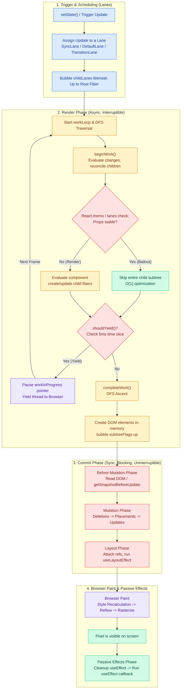
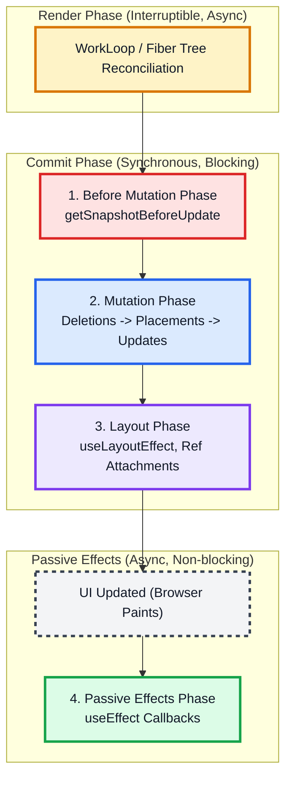

# React Internals - Index

> **All React knowledge lives here. No redundancy. Navigate to any sub-doc for depth.**

---

## Series Navigation

| Doc                                                               | Scope                                                                | Key Topics                                                        |
| ----------------------------------------------------------------- | -------------------------------------------------------------------- | ----------------------------------------------------------------- |
| **[index.md](./index.md)** <- _you are here_                      | Master hub + commit phase + rendering behaviors + React API + Router | DOM pipeline, commit phases, effects, API quick-ref, routing      |
| **[Part 1 - Core Engine](./React_Deep_Dive_Internals.md)**        | Fiber architecture internals                                         | Stack->Fiber, reconciliation, VDOM diffing, scheduler             |
| **[Part 2 - Concurrency & Hooks](./React_Deep_Dive_Advanced.md)** | Hook mechanics, lanes model, React 19                                | Hook internals, transitions, hydration, useOptimistic, `use` hook |
| **[Part 3 - Grill Q&A](./React_Deep_Dive_Cheat_Sheet.md)**        | Interview questions + timing cheat sheet                             | Staff-level Q&A, event loop orchestration, timing APIs            |

---

## Quick-Jump: What to Read for What

| I want to understand...                            | Go to                                                                                                                            |
| -------------------------------------------------- | -------------------------------------------------------------------------------------------------------------------------------- |
| Full render pipeline (setState -> pixels)          | [Rendering Pipeline](#the-complete-react-rendering-pipeline)                                                                     |
| Commit phase sub-phases                            | [Commit Phase](#the-commit-phase-pipeline)                                                                                       |
| useEffect vs useLayoutEffect vs useInsertionEffect | [Effect Execution Order](#effect-execution-order--comparison)                                                                    |
| Fiber node structure                               | [Part 1 -> Fiber Architecture](./React_Deep_Dive_Internals.md#3-react-fiber-architecture--the-rendering-pipeline)                |
| Lane priority & starvation                         | [Lanes & Priority](#lanes--priority-scheduling)                                                                                  |
| Suspense internals                                 | [Suspense Flow](#suspense-execution-flow)                                                                                        |
| SSR / Hydration lifecycle                          | [SSR Lifecycle](#ssr--streaming-rsc-lifecycle)                                                                                   |
| Double buffering                                   | [Double Buffering](#double-buffering)                                                                                            |
| Event delegation & synthetic events                | [Event System](#synthetic-event-system--event-delegation)                                                                        |
| Automatic batching                                 | [Batching](#automatic-batching-react-18)                                                                                         |
| React.memo / bailout                               | [Part 1 -> beginWork](./React_Deep_Dive_Internals.md#1-beginwork)                                                                |
| Hook internals (useState queue, useEffect repr)    | [Part 2 -> Hook Mechanics](./React_Deep_Dive_Advanced.md#13-staffarchitect-level-deep-dive-core-hook-mechanics--fiber-internals) |
| useTransition / useDeferredValue under the hood    | [Part 2 -> Concurrent Transitions](./React_Deep_Dive_Advanced.md#14-concurrent-transitions--the-fiber-lanes-model)               |
| React 19 Actions & useOptimistic                   | [Part 2 -> React 19](./React_Deep_Dive_Advanced.md#15-react-19-compiler-actions--the-useoptimistic-rollback-engine)              |
| Staff-level interview Q&A                          | [Part 3 -> Grill Questions](./React_Deep_Dive_Cheat_Sheet.md#19-consolidated-senior--staff-level-grill-questions)                |
| Timing APIs (rAF, MessageChannel, idle)            | [Part 3 -> Timing](./React_Deep_Dive_Cheat_Sheet.md#21-practical-guide-deferring-work--browser-event-loop-orchestration)         |
| React Router internals & hooks                     | [React Router](#react-router)                                                                                                    |
| React API quick-ref (hooks, suspense, forms)       | [React API Reference](#react-api-quick-reference)                                                                                |
| Browser rendering pipeline (DOM/CSSOM)             | [Browser Rendering](#browser-rendering-pipeline)                                                                                 |
| Core Web Vitals mapping                            | [6-Layer Architecture](#6-layer-architecture--web-vitals)                                                                        |

---

## The Complete React Rendering Pipeline

From `setState()` to pixels - end to end:



**4 Key Structural Separations:**

```
React Element --> Fiber Node --> DOM Node --> Pixels
 (Description)   (Work/State)  (Host Tree)  (Screen Paint)
```

---

## The Commit Phase Pipeline

The Commit Phase is **synchronous & uninterruptible** - 4 sub-phases:



### Sub-Phase Reference

| #   | Phase               | Timing                            | Key Work                                                                 |
| --- | ------------------- | --------------------------------- | ------------------------------------------------------------------------ |
| 1   | **Before Mutation** | Sync, before any DOM write        | `getSnapshotBeforeUpdate` - read scroll/layout before it changes         |
| 2   | **Mutation**        | Sync, writes to real DOM          | Deletions -> Placements -> Updates (strict order prevents key conflicts) |
| 3   | **Layout**          | Sync, after DOM, **before** paint | Attach refs -> `useLayoutEffect` cleanups -> `useLayoutEffect` callbacks |
| 4   | **Passive Effects** | Async, **after** paint            | `useEffect` cleanups -> `useEffect` callbacks                            |

**Mutation order matters:**

1. **Deletions first** - clears namespace, runs unmount cleanups, prevents memory leaks
2. **Placements** - inserts new nodes into clean DOM
3. **Updates** - modifies attributes/text on stable structure

Traversal: depth-first post-order (children mutated before parents).

---

## Effect Execution Order & Comparison

### Chronological Order (per render)

```
1. useInsertionEffect cleanups   <- before DOM mutations (CSS-in-JS style injection)
2. DOM Mutations applied
3. useLayoutEffect cleanups      <- after DOM, before paint
4. useLayoutEffect callbacks     <- after DOM, before paint (child-first, parent-last)
5. Refs attached (ref.current becomes valid)
---- BROWSER PAINTS ----
6. useEffect cleanups            <- async, passive lane
7. useEffect callbacks           <- async, passive lane
```

### Comparison Table

| Hook                 | Fires                       | Blocking? | Primary Use                                           |
| -------------------- | --------------------------- | --------- | ----------------------------------------------------- |
| `useInsertionEffect` | Before DOM mutations        | Yes       | CSS-in-JS: inject `<style>` tags                      |
| `useLayoutEffect`    | After DOM, **before** paint | **Yes**   | Measure layout, prevent flicker (tooltip pos, scroll) |
| `useEffect`          | After DOM, **after** paint  | No        | Data fetch, subscriptions, analytics                  |

> **Simple rule:** `useLayoutEffect` = before paint, blocking. `useEffect` = after paint, non-blocking.

### useEffect Lifecycle Flows

```
Mount:   Render -> Commit -> Paint -> useEffect()
Update:  Render -> Commit -> Paint -> Cleanup -> useEffect()
Unmount: Cleanup
```

---

## Commit Phase Deep Dive

### Phase 1 - Before Mutation (DOM Pre-read)

Last chance to read DOM before mutations. Chat UI scroll restoration:

```js
getSnapshotBeforeUpdate(prevProps, prevState) {
  if (prevProps.list.length < this.props.list.length) {
    const list = this.listRef.current;
    return list.scrollHeight - list.scrollTop; // capture scroll gap
  }
  return null;
}
componentDidUpdate(prevProps, prevState, snapshot) {
  if (snapshot !== null) {
    const list = this.listRef.current;
    list.scrollTop = list.scrollHeight - snapshot; // restore position
  }
}
```

### Phase 3 - Layout (Refs + useLayoutEffect)

- **Refs attach here** -> `ref.current` is reliable only after this phase
- `useLayoutEffect` runs **child-first, parent-last**
- Heavy work here delays paint -> visible jank

### Phase 4 - Passive Effects (useEffect)

- Async, non-blocking - scheduled via React's Scheduler in a separate macro-task after paint

---

## Lanes & Priority Scheduling

### Lane Priority Hierarchy

```
High Priority
+-- SyncLane              -> Urgent synchronous (controlled input, flushSync)
+-- InputContinuousLane   -> High-freq interactive (mousemove, typing)
+-- DefaultLane           -> Normal updates (network responses, timers)
+-- TransitionLanes       -> Interruptible, low-priority (startTransition, useDeferredValue)
                         v
Low Priority
```

### Bitmask Representation

```
00000001 (0x01) -> SyncLane
00000100 (0x04) -> DefaultLane
00100000 (0x20) -> TransitionLane

pendingLanes = SyncLane | DefaultLane | TransitionLane = 00100101
```

### FiberRoot Tracking Bitmasks

| Field            | Meaning                                                         |
| ---------------- | --------------------------------------------------------------- |
| `pendingLanes`   | All scheduled work waiting to process                           |
| `suspendedLanes` | Lanes blocked by async resources (Suspense)                     |
| `pingedLanes`    | Suspended lanes whose async deps resolved (ready to retry)      |
| `expiredLanes`   | Lanes past expiration -> elevated to sync to prevent starvation |
| `entangledLanes` | Lanes that must render together (same transition/context)       |

### Lane Starvation & Anti-Starvation

```
Transition update triggered
  -> TransitionLane marked pending
  -> User keeps typing -> InputContinuousLane keeps arriving
  -> TransitionLane keeps getting postponed  <- STARVATION

Anti-starvation: React assigns expiration timestamps.
When a lane's expiration is exceeded -> moves to expiredLanes
-> scheduler treats it as synchronous -> forces it through immediately.
```

> Deep dive on Lanes model vs. legacy Expiration Times -> [Part 2](./React_Deep_Dive_Advanced.md#q1-what-is-the-lanes-model-and-how-did-it-replace-expiration-times)

---

## Double Buffering

React keeps **two Fiber trees** to guarantee zero visual flicker:

```
FiberRootNode
      |
 current pointer
      |
      v
Current Fiber Tree  <== alternate pointer ==>  Work-In-Progress (WIP) Tree
 (Visible on Screen)                            (Draft being rendered)
      |                                                  |
 Host DOM Nodes                               Completed & Ready
                                                         |
                                               SWAP POINTER (Commit)
                                             root.current = WIP Tree
```

- All render work happens on WIP - DOM never partially updated
- Commit: `root.current = wip` - instantaneous pointer swap
- Zero visual flicker because swap is atomic before browser paint

---

## SSR / Streaming / RSC Lifecycle

```
USER REQUEST
  -> DNS -> TCP/TLS -> HTTP
  -> SERVER: Routing & Auth -> Data Fetch -> RSC/Flight -> SSR HTML Stream
  -> TTFB
  -> BROWSER: Parse HTML -> DOM -> CSS (CSSOM) -> Fetch JS
  -> First Paint / FCP
  -> JS Execution -> React Runtime -> hydrateRoot()
  -> Build Fiber Tree -> HYDRATION (beginWork + completeWork)
  -> Commit Phase -> Bind Event Handlers
  -> Interactive UI (TTI / INP ready)
```

### Selective Hydration (React 18+)

- Streams HTML chunks over HTTP (not all-or-nothing)
- Hydrates subtrees incrementally as scripts load
- **Interaction-driven priority**: if user clicks an unhydrated `<Suspense>` component -> React elevates that subtree's hydration lane to process it **on demand** first

> Deep dive -> [Part 2 -> Selective Hydration](./React_Deep_Dive_Advanced.md#17-selective-hydration-internals)

---

## Suspense Execution Flow

```
Component renders -> needs async resource (use() / Suspense resource)
  +- Data ready?    -> Render component UI
  +- Data NOT ready -> SUSPEND (throws Promise)
        -> React catches -> unwinds Fiber tree
        -> Marks lane in suspendedLanes bitmask
        -> Finds nearest <Suspense> boundary
        -> Renders fallback subtree (<Loading />)
        -> Commits fallback to DOM (show spinner)
        -> Data resolves -> Promise fulfills
        -> Pings scheduler -> marks lane in pingedLanes
        -> Retry suspended work
        -> Render component successfully
        -> Commit component UI (replace fallback)
```

---

## Synthetic Event System & Event Delegation

React attaches **one listener to `#root`** (React 17+), not individual nodes:

```
User Click on <button>
  -> Browser native event bubbles to #root
  -> React root synthetic event listener intercepts
  -> Map native event -> SyntheticEvent wrapper
  -> Lookup Fiber tree for event handlers (Capture & Bubble)
  -> Map Event Priority -> Lane Allocation:
      Discrete (click, keydown)      -> SyncLane (0x01)
      Continuous (mousemove, scroll) -> InputContinuousLane (0x04)
      Passive (custom events)        -> DefaultLane (0x10)
```

- **Two-phase dispatch**: React manually traverses Fiber tree upward - capture handlers going down, bubble handlers going up
- Prevents memory overhead of thousands of direct DOM listeners

---

## Automatic Batching (React 18+)

```js
// React 18+: Automatically batched into 1 render pass regardless of context
fetchData().then(() => {
  setCount((c) => c + 1); // Queued in Lane
  setFlag(true); // Queued in same Lane
  // React flushes both in 1 single render pass at end of microtask
});
```

- State setters queue updates on `fiber.updateQueue` and mark lane bitmask
- React schedules a microtask to merge all updates into a single render
- **Bypass**: `flushSync(() => setState())` forces sync flush (use sparingly)

---

## Reference Equality & Immutability

```js
{} === {}  // false -- compared by memory address, not content
[] === []  // false

// Wrong: Mutation trap -- same reference, React skips re-render
user.name = 'Cena';
setUser(user);

// Right: New reference -- React detects change, re-renders
setUser(prev => ({ ...prev, name: 'Cena' }));
```

Enables fast checks in `React.memo`, `useMemo`, `useCallback`, `shouldComponentUpdate`.

---

## The Triple API Call Mystery (StrictMode)

React 18 StrictMode double-mounts in dev -> effects run twice.

**Why 3 calls (not 4)?** Most common: CORS preflight + StrictMode:

```
1. INITIAL MOUNT: fetch('/api/data') -> OPTIONS (preflight) + GET #1
2. STRICTMODE UNMOUNT: cleanup runs
3. REMOUNT: fetch('/api/data') -> GET #2 (OPTIONS cached by browser)
Total: 3 requests in Network tab
```

**Fix - always write idempotent cleanup:**

```js
useEffect(() => {
  const controller = new AbortController();
  fetch('/api/data', { signal: controller.signal })
    .then((res) => res.json())
    .then((data) => setData(data))
    .catch((err) => {
      if (err.name !== 'AbortError') console.error(err);
    });
  return () => controller.abort();
}, [id]);
```

Other causes: Non-empty deps array + post-mount state update (3rd run); multiple component instances.

---

## 6-Layer Architecture & Web Vitals

```
+----------------------------------------------------------+
| 1. NETWORK                                               |
| DNS -> TCP/TLS -> HTTP -> TTFB                           |
+----------------------------------------------------------+
| 2. SERVER                                                |
| RSC -> Data Fetching -> React Server Render -> HTML Stream|
+----------------------------------------------------------+
| 3. BROWSER HOST                                          |
| HTML Parsing -> DOM -> CSSOM -> Resource Fetch           |
+----------------------------------------------------------+
| 4. REACT CORE RENDERER                                   |
| Element -> Fiber -> Lanes -> Scheduler -> beginWork      |
| -> Reconciliation -> Bailout -> completeWork -> Commit   |
+----------------------------------------------------------+
| 5. ASYNC REACT & CONCURRENCY                             |
| Suspense -> Transitions -> Interruption -> Hydration     |
+----------------------------------------------------------+
| 6. BROWSER RENDERING ENGINE                              |
| Recalc Style -> Layout -> Paint -> Composite -> Pixels   |
+----------------------------------------------------------+
```

### Core Web Vitals -> Layer Mapping

| Metric   | Layer                      | Root Cause                                       |
| -------- | -------------------------- | ------------------------------------------------ |
| **TTFB** | 1. Network + 2. Server     | Slow DB queries, un-streamed SSR                 |
| **FCP**  | 3. Browser Host            | Large CSS, render-blocking scripts               |
| **LCP**  | 2. Server + 3. Browser     | Slow image loads, late resource discovery        |
| **INP**  | 4. React Core + 6. Browser | Long JS tasks, heavy reconciliation, sync commit |
| **CLS**  | 6. Browser Rendering       | Dynamic insertions without sizing, late fonts    |

### Performance Diagnostics

```
Slow Render Phase             -> Heavy beginWork / reconciliation loops
Too Much Scheduled Work       -> Missing Lane priorities / un-transitioned updates
Unnecessary Child Renders     -> Failed bailouts / missing memo/useMemo
Expensive Commit Phase        -> Heavy useLayoutEffect / excessive sync DOM mutations
Slow Browser Pipeline         -> Complex CSS, forced reflows during commit
Slow Initial Response         -> Blocking server-side data fetch before TTFB
Slow Hydration                -> Server HTML <-> Client Fiber tree mismatch
```

---

## Browser Rendering Pipeline

```
Bytes -> Characters -> Tokens -> Nodes -> DOM Tree

Main Parser:     HTML ---- [BLOCKED by <script>] ---- Resume ----
Preload Scanner: HTML ---- continues scanning ---- found img, css ---- starts fetching

CSS Bytes -> Characters -> Tokens -> CSSOM Nodes -> CSSOM Tree
DOM + CSSOM -> Render Tree -> Layout -> Paint -> Composite
```

### Quick Reference

| Topic                                 | Key Fact                                                                                            |
| ------------------------------------- | --------------------------------------------------------------------------------------------------- |
| DOM                                   | In-memory tree of HTML nodes. Live API, NOT the HTML source.                                        |
| CSSOM                                 | Tree of all CSS rules with cascade/specificity resolved. **Render-blocking**                        |
| Render Tree                           | DOM + CSSOM. Only visible elements. `display:none` excluded; `visibility:hidden` included.          |
| Reflow vs Repaint                     | Reflow = geometry recalc (expensive). Repaint = pixel update. `transform`/`opacity` skip both.      |
| Layout thrashing                      | Interleaving DOM reads/writes forces sync layout on every read. Fix: batch reads, then writes.      |
| Compositor-only props                 | `transform`, `opacity`, `filter` - GPU-accelerated, skip layout and paint. Use for animations.      |
| Preload scanner                       | Secondary parser scanning ahead during script blocking to discover & fetch resources early.         |
| `display:none` vs `visibility:hidden` | `display:none`: removed from Render Tree, no space. `visibility:hidden`: in Render Tree, invisible. |

### Layout Thrashing

```
JavaScript DOM Mutation (Commit Mutation Phase)
  -> JS reads Layout geometry (element.offsetHeight in useLayoutEffect)
  -> FORCED SYNCHRONOUS REFLOW  <- Layout Thrashing!
```

Fix: Perform all reads _before_ writes, or isolate measurement in `useLayoutEffect` without recursive state mutation.

---

## JS Engine & Time-Slicing Scheduler

React processes work in **~5ms chunks** (time slicing), yielding to browser between chunks:

```
JS Event Loop Main Thread
+----------------------------------------+
| Macrotask (React Render Chunk ~5ms)   |
+----------------------------------------+
  |
  v
Yield -> Browser (User Input / Style / Paint)
  |
  v
+----------------------------------------------+
| Next Macrotask (MessageChannel -> Resume React)|
+----------------------------------------------+
```

**Why `MessageChannel` not `setTimeout(fn, 0)`?**

- `setTimeout` nested >5 levels: browser clamps to 4ms minimum delay
- `requestAnimationFrame`: fires before paint (wrong for background scheduling)
- `MessageChannel`: lightweight macrotask, no clamping, executes immediately after current task

---

## React API Quick Reference

### State & Data

| Hook/API                      | One-liner                                                      |
| ----------------------------- | -------------------------------------------------------------- |
| `useState`                    | Local component state - schedules a render on update           |
| `useReducer`                  | Centralize complex state transitions with action dispatch      |
| `useContext` / `use(Context)` | Read nearest Context provider value                            |
| `useSyncExternalStore`        | Subscribe to mutable external stores safely in concurrent mode |
| `use(Promise)`                | Integrates with Suspense - can be called conditionally         |

**Controlled vs. Uncontrolled:**

```tsx
// Controlled: React owns value
const [name, setName] = useState('');
<input value={name} onChange={(e) => setName(e.target.value)} />;

// Uncontrolled: DOM owns value
const ref = useRef<HTMLInputElement>(null);
<input defaultValue="Deval" ref={ref} />;
```

### DOM / Effects

| Hook                  | Timing                        | Use For                                           |
| --------------------- | ----------------------------- | ------------------------------------------------- |
| `useRef`              | Stable across renders         | DOM refs, mutable values, avoiding stale closures |
| `useEffect`           | After paint, async            | Fetch, subscriptions, analytics                   |
| `useLayoutEffect`     | After DOM, before paint, sync | Measure layout, adjust positions, prevent flicker |
| `useInsertionEffect`  | Before DOM mutations          | CSS-in-JS style injection                         |
| `useId`               | Stable across renders         | Accessibility IDs, hydration-safe                 |
| `useImperativeHandle` | After layout                  | Expose custom imperative API via ref              |

### Loading / Concurrency

| API                                 | One-liner                                         |
| ----------------------------------- | ------------------------------------------------- |
| `<Suspense fallback>`               | Loading boundary for suspended components         |
| `lazy(() => import())`              | Code-split on demand                              |
| `useTransition` / `startTransition` | Mark updates as non-urgent (TransitionLane)       |
| `useDeferredValue`                  | Lag expensive downstream UI behind urgent value   |
| `<Activity>`                        | Keep subtree alive while hidden; suppress effects |
| `hydrateRoot`                       | Attach React to server-rendered HTML              |

### Forms / Actions (React 19)

| Hook               | One-liner                                             |
| ------------------ | ----------------------------------------------------- |
| `useActionState`   | Track result + pending state of form actions          |
| `useFormStatus`    | Read submission status from nearest parent form       |
| `useOptimistic`    | Show expected result immediately, rollback on failure |
| `requestFormReset` | Reset uncontrolled form from action/transition        |

### Component State Pattern - Discriminated Union

Avoid impossible states (`isLoading && isError`). Use:

```tsx
type ComponentState<T> =
  | { status: 'loading' }
  | { status: 'success'; data: T }
  | { status: 'error'; error: Error | string }
  | { status: 'empty' };
```

### Optimization APIs

| API                     | When to Use                                            |
| ----------------------- | ------------------------------------------------------ |
| `memo(Component)`       | Skip re-render when props reference-equal              |
| `useMemo(fn, deps)`     | Cache expensive computed value                         |
| `useCallback(fn, deps)` | Cache function identity (use with memo'd children)     |
| `createPortal`          | Render into different DOM container (modals, tooltips) |
| `flushSync`             | Force sync flush - bypass batching (use sparingly)     |

### Resource & Root APIs

```tsx
createRoot(el).render(<App />); // Client SPA
hydrateRoot(el, <App />); // SSR hydration
preconnect('https://api.example.com');
prefetchDNS('https://cdn.example.com');
preload('/font.woff2', { as: 'font' });
preinit('/app.css', { as: 'style' });
```

### Rendering Mental Model

```
Trigger
  -> Render phase (calculate next tree - pure, no side effects)
  -> Reconciliation (diff new vs. current Fiber)
  -> Commit DOM mutations
  -> useLayoutEffect (sync, before paint)
  -> Browser layout/paint
  -> useEffect (async, after paint)
```

**Key distinctions:**

- Render != DOM update - React can render and commit nothing
- State is a **snapshot** for that render; updating queues the next render
- Component identity = type + position + key; changing `key` resets all state
- Derived values: calculate during render, don't sync in `useEffect`

---

## React Router

### Mental Model

```
URL
 -> route matching
 -> params / search params extraction
 -> data loading / mutation actions
 -> route boundary rendering (error/loading/layout)
 -> page component render
```

### Setup

```tsx
import { createBrowserRouter, RouterProvider, Outlet } from 'react-router-dom';

const router = createBrowserRouter([
  {
    path: '/',
    element: <RootLayout />,
    errorElement: <RouteError />,
    children: [
      { index: true, element: <Home /> },
      {
        path: 'users/:userId',
        loader: userLoader, // Fetches data BEFORE rendering
        element: <User />,
      },
    ],
  },
]);

export function App() {
  return <RouterProvider router={router} />;
}
```

### Core Components

| Component        | Purpose                                        |
| ---------------- | ---------------------------------------------- |
| `Link`           | Client-side nav, prevents page reload          |
| `NavLink`        | Link aware of active/pending state for styling |
| `Outlet`         | Render boundary for matched child routes       |
| `Navigate`       | Declarative redirect element                   |
| `Form`           | Router-aware form triggering action handlers   |
| `RouterProvider` | Context wrapper providing router + data APIs   |

### Hooks Reference

| Hook                 | Read/Write | Purpose                                                  |
| -------------------- | ---------- | -------------------------------------------------------- |
| `useNavigate`        | Write      | Imperative navigation, history manipulation              |
| `useParams`          | Read       | Path parameters from matched route                       |
| `useSearchParams`    | Read/Write | URL query params - filters, pagination, tabs             |
| `useLocation`        | Read       | Full location object (pathname, search, hash, state)     |
| `useMatch`           | Read       | Pattern matching - returns PathMatch or null             |
| `useLoaderData`      | Read       | Data returned by current route's `loader`                |
| `useRouteLoaderData` | Read       | Loader data from another matched route by ID             |
| `useActionData`      | Read       | Latest value from current route's `action`               |
| `useNavigation`      | Read       | Global router transition state (idle/loading/submitting) |
| `useFetcher`         | Read/Write | Trigger loaders/actions without page navigation          |
| `useRouteError`      | Read       | Thrown error inside `errorElement` boundary              |
| `useOutletContext`   | Read       | Typed context from layout route to child outlets         |

### Hook Disambiguation

| Hook              | Purpose            | Example Use                             |
| ----------------- | ------------------ | --------------------------------------- |
| `useMatch`        | Pattern matching   | Highlight nav if URL matches `/admin/*` |
| `useNavigate`     | Navigation trigger | Redirect after login success            |
| `useLocation`     | Location info      | Read `location.state` payload           |
| `useSearchParams` | Query string       | Sync filters/search with URL            |

> `useMatch` cannot read query params or `location.state` - use `useSearchParams` or `useLocation` for those.

### Anti-Pattern: navigate() inside useEffect

```
Problems:
1. Flash of Protected Content - useEffect fires AFTER paint -> protected UI visible 16-50ms
2. Possible infinite redirect loop if deps include navigation variables
3. Wasteful CPU: React renders, commits to DOM, then immediately discards all work
```

**Best Practices:**

```tsx
// 1. Redirect in route loader (BEST - fires before any component mounts)
{
  path: '/dashboard',
  loader: async () => {
    const user = await checkAuth();
    if (!user) return redirect('/login');
    return user;
  },
  element: <Dashboard />
}

// 2. Declarative <Navigate> during render (no paint leak)
if (!user) return <Navigate to="/login" replace />;
return <DashboardView />;

// 3. Event-driven navigate (OK for post-submit)
const navigate = useNavigate();
<button onClick={() => navigate('/success')}>Submit</button>
```

### Other Router APIs

| API                  | Use                                                                           |
| -------------------- | ----------------------------------------------------------------------------- |
| `redirect`           | Return/throw redirects from loader or action                                  |
| `defer`              | Deferred loading for streaming data paths                                     |
| `matchPath`          | Imperative path matching outside components                                   |
| `generatePath`       | Build path from pattern + params (`generatePath('/users/:id', { id: '42' })`) |
| `createSearchParams` | Construct search param strings                                                |
| `useBlocker`         | Block navigation on unsaved work                                              |

### State Location Decision

```
Local UI visual state     -> Component state (useState/useReducer)
Shareable filters/sorts   -> URL Search Params
Entity Identity / ID      -> Route parameters (:id)
Page / Route data         -> Loader/Query layer
Mutation operations       -> Action/Fetcher/Query mutation
Auth & route permissions  -> Layout/Route boundary + Server validation
```

> **Principle:** Do not copy URL state into client stores. The URL is the single source of truth for the router.

### Why Switch was replaced (v5 to v6)

1. **Parallel Data Loading**: v5 routes matched inside React tree -> data fetch started only _after_ render. v6 data router matches statically -> loader fetches fire **before** any component renders.
2. **Nested Layouts**: v5 flat matching mounted one component. v6 nested paths render persistent layout shells with Outlet without re-mounting.

---

## Advanced Internals Quick-Reference

### FiberNode Structure

```typescript
type FiberNode = {
  tag: WorkTag; // Component type (Function, Class, HostRoot, HostComponent)
  key: null | string; // Reconciliation key
  type: any; // Component function / DOM tag ('div')
  stateNode: any; // Real DOM node or Class instance
  return: Fiber | null; // Parent Fiber
  child: Fiber | null; // First Child Fiber
  sibling: Fiber | null; // Next Sibling Fiber
  memoizedState: any; // Linked list of hooks state
  updateQueue: any; // Pending state updates & side effects
  memoizedProps: any; // Props from previous render
  pendingProps: any; // Incoming new props
  lanes: Lanes; // Pending work bitmask on this Fiber
  childLanes: Lanes; // Pending work bitmask across sub-tree
  alternate: Fiber | null; // current <-> WIP pair pointer
};
```

- Hooks form a **singly-linked list** on `fiber.memoizedState`
- V8 Hidden Classes: consistent shape -> Fast Properties + Inline Caches (sub-ms attribute access)

### Top 10 React Internal Mechanics

| #   | Mechanic               | Key Fact                                                                                           |
| --- | ---------------------- | -------------------------------------------------------------------------------------------------- |
| 1   | Error Boundaries       | Errors unwind Fiber stack upward -> finds `getDerivedStateFromError` -> renders fallback           |
| 2   | Suspense / Retry       | Catches Promise -> `suspendedLanes` -> renders fallback -> on resolve `pingedLanes` -> retry       |
| 3   | Context Propagation    | `oldValue !== newValue` -> traverses subtree -> marks dependent consumer fibers' lanes pending     |
| 4   | Ref Internals          | Object refs updated in Layout phase. Callback refs called with `null` on unmount, then new node    |
| 5   | Effect Order           | `useInsertionEffect` -> DOM mutations -> `useLayoutEffect` -> paint -> `useEffect`                 |
| 6   | Portals                | Fiber hierarchy maintains logical parent (context/events), DOM parent detached to target container |
| 7   | `flushSync`            | Bypasses batching + lane priority -> synchronous DOM flush                                         |
| 8   | `useSyncExternalStore` | Prevents tearing in concurrent rendering of external stores (Redux/Zustand)                        |
| 9   | Selective Hydration    | On user click of unhydrated `<Suspense>` -> elevates hydration lane priority -> hydrates on demand |
| 10  | `<Activity>` API       | Preserves Fiber + state for hidden subtrees; unmounts DOM, cleans effects, defers renders          |

### Advanced React Concepts

| Feature                 | Summary                                                                                          |
| ----------------------- | ------------------------------------------------------------------------------------------------ |
| RSC / Flight Protocol   | Server-only components -> serialized JSON-like binary stream -> client (no component JS shipped) |
| Server Actions          | Server-side functions callable from client forms/events with progressive enhancement             |
| `useDeferredValue`      | Wraps fast-changing value -> deferred copy on `TransitionLane` -> keeps inputs responsive        |
| React Compiler (Forget) | Auto-memoization via static analysis -> auto-inserts `useMemo`/`useCallback` at build time       |

---

## Navigation

|                                           | Link                                                               |
| ----------------------------------------- | ------------------------------------------------------------------ |
| **Part 1 - Core Engine & Architecture**   | [React_Deep_Dive_Internals.md](./React_Deep_Dive_Internals.md)     |
| **Part 2 - Advanced Concurrency & Hooks** | [React_Deep_Dive_Advanced.md](./React_Deep_Dive_Advanced.md)       |
| **Part 3 - Grill Q&A & Timing**           | [React_Deep_Dive_Cheat_Sheet.md](./React_Deep_Dive_Cheat_Sheet.md) |
| **LLD Roadmap**                           | [../../../LLD/LLD.md](../../../LLD/LLD.md)                         |
