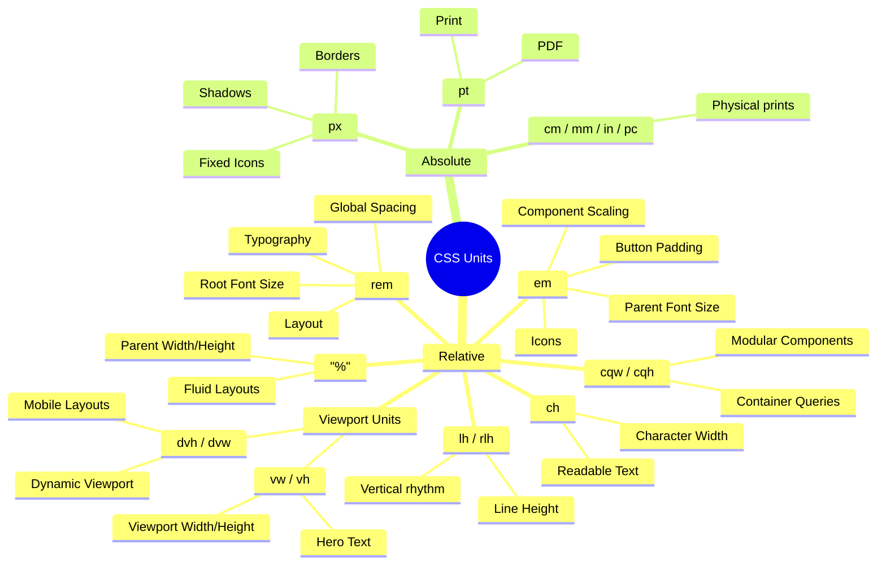

# CSS Units Explained: `px`, `rem`, `em`, `%`, `vw`, `vh`, `dvh`/`svh`/`lvh`, `cqw`/`cqh`, `lh`, `pt` and More

> **One-line rule**
>
> - **`rem`** → Global scale (Design system, Typography, Layout)
> - **`em`** → Component scale (Padding, Icons, Badges)
> - **`px`** → Precise pixels (Borders, Shadows, Hairlines)
> - **`%`** → Relative to parent (Fluid layouts)
> - **`vw` / `vh`** → Relative to viewport (Hero sections)
> - **`dvh` / `svh` / `lvh`** → Relative to dynamic / small / large viewport (Mobile layouts)
> - **`cqw` / `cqh`** → Relative to container query size (Modular component layouts)
> - **`lh`** → Relative to element line height (Vertical rhythm / alignment)
> - **`pt`** → Print only

---

# Quick Decision Tree

```
Need responsive typography?
        │
        └── rem

Need component scale with its own font?
        │
        └── em

Need exact pixel precision?
        │
        └── px

Need width relative to parent?
        │
        └── %

Need size relative to screen?
        │
        └── vw / vh

Need dynamic layout for mobile viewport?
        │
        └── dvh / svh / lvh

Need size relative to a query container?
        │
        └── cqw / cqh

Need to match line height?
        │
        └── lh

Creating printable documents?
        │
        └── pt
```

---

# Visual Overview

```
                    CSS Units

               Relative Units
                     │
     ┌───────────────┼────────────────┐
     │               │                │
    rem             em                %
     │               │                │
 Root Font      Parent Font      Parent Size

                Viewport Units
                     │
         ┌───────────┴───────────┐
         │                       │
        vw                      vh

                Absolute Units
                     │
         ┌───────────┴───────────┐
         │                       │
        px                      pt
```

---

# 1. px (Pixels)

## Definition

An absolute CSS pixel.

```
1px = 1 CSS pixel
```

Not affected by parent font-size.

---

## Example

```css
.card {
  width: 320px;
}

.button {
  border: 1px solid;
}

.icon {
  width: 24px;
}
```

---

## Best Use Cases

✅ Borders

```css
border: 1px solid;
```

✅ Shadows

```css
box-shadow: 0 2px 8px;
```

✅ Icons with fixed size

```css
width: 24px;
height: 24px;
```

✅ Hairlines

```css
border-bottom: 1px;
```

---

## Avoid For

❌ Typography

```css
font-size: 16px;
```

because users changing browser font-size won't scale consistently.

---

## Pros

- Predictable
- Precise
- No calculations

---

## Cons

- Doesn't scale with accessibility settings
- Less flexible

---

# 2. rem (Root EM)

## Definition

Relative to the root (`html`) font-size.

```
html
↓

16px

↓

1rem = 16px
```

---

## Formula

```
value × html font-size
```

Example

```
html =16px

2rem

↓

32px
```

---

## Example

```css
html {
  font-size: 16px;
}

h1 {
  font-size: 2rem;
}
```

```
2 ×16

=

32px
```

---

## If root changes

```css
html {
  font-size: 18px;
}
```

Now

```
2rem

↓

36px
```

Entire application grows.

---

## Best Use Cases

Typography

```css
font-size: 1rem;
```

Margins

```css
margin: 2rem;
```

Layout spacing

```css
padding: 2rem;
```

Grid gaps

```css
gap: 1rem;
```

Containers

```css
max-width: 80rem;
```

Design systems

```
Spacing tokens

4rem

2rem

1rem

0.5rem
```

---

## Pros

✅ Accessible

✅ Predictable

✅ Entire application scales

✅ Easy maintenance

---

## Cons

Everything depends on root font-size.

Usually not a problem.

---

# 3. em

## Definition

Relative to the current element's font-size.

```
Parent

20px

↓

Child

1em

↓

20px
```

---

## Formula

```
value × parent font-size
```

---

## Example

```css
.parent {
  font-size: 20px;
}

.child {
  font-size: 1.5em;
}
```

```
20

×

1.5

=

30px
```

---

## Nested Example

```css
.parent {
  font-size: 20px;
}

.child {
  font-size: 1.5em;
}

.grandchild {
  font-size: 1.5em;
}
```

Result

```
Parent

20px

↓

Child

30px

↓

Grandchild

45px
```

Notice

```
20

↓

30

↓

45
```

It compounds.

---

# Why em is Amazing

Suppose

```css
.button {
  font-size: 16px;
  padding: 0.75em 1em;
}
```

Padding

```
Top

12px

Left

16px
```

Now

```css
.button.large {
  font-size: 24px;
}
```

Padding automatically becomes

```
Top

18px

Left

24px
```

No extra CSS.

---

## Perfect For

Component padding

```css
padding: 0.75em 1em;
```

Icons

```css
width: 1em;
height: 1em;
```

Badges

Buttons

Labels

Small reusable UI components

---

## Avoid

Large nested typography.

```
20px

↓

30px

↓

45px

↓

67.5px
```

Hard to debug.

---

# 4. %

## Definition

Relative to parent size.

---

Example

```css
.parent {
  width: 800px;
}

.child {
  width: 50%;
}
```

```
400px
```

---

Perfect for

Responsive layouts

```css
width: 100%;
```

Images

```css
img {
  width: 100%;
}
```

Flex items

Containers

---

Avoid

Typography.

---

# 5. vw

Viewport Width

```
1vw

=

1%

of browser width
```

Example

Browser

```
1000px
```

```
10vw

↓

100px
```

---

Use

Hero text

Landing pages

Responsive headings

---

Example

```css
font-size: 6vw;
```

---

Avoid

Normal body text.

---

# 6. vh

Viewport Height

```
1vh

=

1%

of browser height
```

---

Example

```css
height: 100vh;
```

Perfect for

Hero sections

Splash pages

Fullscreen layouts

---

# 7. vmin / vmax

```
vmin

↓

smaller side

vmax

↓

larger side
```

Useful

Responsive circles

Responsive artwork

---

# 8. ch

Width of "0" character.

Useful

Readable paragraphs.

```css
max-width: 65ch;
```

Very popular for articles.

---

# 9. ex

Height of lowercase x.

Rarely used.

Mostly typography research.

---

# 10. pt

Points

```
72pt

=

1 inch
```

Used for

PDF

Printing

Documents

Never for websites.

---

# 11. Modern Viewport Units (svh / lvh / dvh, svw / lvw / dvw)

## Definition

To solve layout issues with dynamic browser interface elements (like Safari's or Chrome's dynamic address bars on mobile screens), CSS provides Small (`sv*`), Large (`lv*`), and Dynamic (`dv*`) viewport units.

- **`svh` / `svw`** (Small Viewport): Calculated assuming dynamic browser toolbars are fully **expanded** (visible). This is the safest, smallest area.
- **`lvh` / `lvw`** (Large Viewport): Calculated assuming dynamic browser toolbars are fully **collapsed** (hidden). This is the largest area.
- **`dvh` / `dvw`** (Dynamic Viewport): Automatically and dynamically adjusts in real-time as dynamic toolbars expand or collapse.

---

## Example

```css
/* Avoid height: 100vh on mobile, as it causes content overflow */
.hero-section {
  height: 100dvh; /* Adapts dynamically to browser bars */
}

.modal {
  max-height: 90svh; /* Guaranteed to fit within visible viewport */
}
```

---

## Best Use Cases

✅ Fullscreen dynamic layouts on mobile device browsers.
✅ Mobile app layouts inside a web page.
✅ Dropdowns or sticky buttons that must always remain visible on screens with virtual keyboards or dynamic toolbars.

---

# 12. Container Query Units (cqw, cqh, cqi, cqb, cqmin, cqmax)

## Definition

Relative to the size of a designated **query container** (defined using `container-type: size` or `inline-size`) instead of the global viewport.

- **`cqw` / `cqh`**: 1% of the query container's width / height.
- **`cqi`**: 1% of the query container's inline size (width in horizontal writing modes).
- **`cqb`**: 1% of the query container's block size (height in horizontal writing modes).
- **`cqmin` / `cqmax`**: The smaller / larger of `cqi` and `cqb`.

---

## Example

```css
/* Define container */
.card-container {
  container-type: inline-size;
}

/* Size elements relative to container width */
.card-title {
  font-size: clamp(1rem, 5cqw, 2rem);
}
```

---

## Best Use Cases

✅ Truly modular components (like cards or widgets) that need responsive typography or spacing depending on their parent container's width rather than screen viewport width.

---

# 13. Line Height Units (lh, rlh)

## Definition

Relative to the element's line-height.

- **`lh`**: Relative to the current element's computed `line-height`.
- **`rlh`**: Relative to the root (`html`) element's computed `line-height`.

---

## Example

```css
/* Align an icon perfectly with the vertical bounds of the text line */
.icon {
  width: 1lh;
  height: 1lh;
}
```

---

## Best Use Cases

✅ Inline elements (like badges, tags, or icons) that must scale proportionally with text height.
✅ Vertical rhythm/grids.

---

# 14. Other Absolute Units (cm, mm, in, pc)

## Definition

Physical absolute measurements.

- **`in`**: Inches (1in = 96px = 2.54cm)
- **`cm`**: Centimeters (1cm = 37.8px)
- **`mm`**: Millimeters (1mm = 0.1cm)
- **`pc`**: Picas (1pc = 12pt = 1/6th of an inch)

---

## Best Use Cases

Use only for style rules targeted at physical media (e.g., printing stylesheet via `@media print`). Avoid using physical absolute units for digital displays, since physical measurements scale unpredictably on screens with different DPI (density).

---

## Design System Architecture: em vs. rem Dependency Models

While both `em` and `rem` are relative units in CSS and are often treated as interchangeable, they create fundamentally different dependency models in a UI system. Sizing elements based on where context is derived determines how a component behaves in a larger layout.

The issue is not invalid CSS; the issue is **implicit context**.

### 1. The Core Distinction: Application Scale vs. Component Scale

- **`rem` (Application Scale)**: Relative to the root font-size. This makes it suitable for values that should follow the global product scale: typography, spacing tokens, layout rhythm, containers, and design-system consistency.
- **`em` (Component Scale)**: Relative to the current element's font-size. This makes it useful for values that should scale with a component's local typography: button padding, inline icons, badges, and text-adjacent spacing.

### 2. The Problem of Implicit Context (Accidental Compounding)

The main risk with `em` is accidental compounding. In a nested component tree, an `em` value can be affected by parent font-size changes. While the component remains valid CSS, its visual output becomes dependent on its placement.

In practice, this can make a reusable component look correct in isolation but slightly inconsistent or broken inside other layouts (e.g., dashboards, tables, form sections, or widgets). This kind of inconsistency is difficult to detect from the CSS declaration alone because the value looks reasonable. The problem is not the number; the problem is where the number gets its context from.

### 3. Practical Rule: Explicit Boundaries

To ensure predictable styling, we must make these dependencies explicit rather than standardizing on a single unit everywhere:

- **Use `rem`** when the value belongs to the **application scale**.
- **Use `em`** when the value intentionally belongs to the **component scale**.

For example, a button should use `rem` for `font-size` and `em` for `padding`. This ensures the text remains aligned with the global type scale, while the internal spacing stays proportional to the button itself:

```css
.button {
  font-size: 1rem; /* Aligned to application/global scale */
  padding: 0.75em 1.2em; /* Local component scale, proportional to button font-size */
}
```

In large UI systems, predictable styling often depends on establishing these clear, explicit boundaries.

---

# Comparison & Recommendation Guide

## 1. CSS Unit Comparison Table

| Unit    | Relative To      | Responsive | Best For           | Avoid             |
| ------- | ---------------- | ---------- | ------------------ | ----------------- |
| px      | Nothing          | ❌         | Borders, Shadows   | Typography        |
| rem     | Root font        | ✅         | Typography, Layout | Component scaling |
| em      | Parent font      | ✅         | Padding, Icons     | Nested fonts      |
| %       | Parent size      | ✅         | Width, Height      | Fonts             |
| vw      | Viewport width   | ✅         | Hero text          | Body text         |
| vh      | Viewport height  | ✅         | Fullscreen         | Small elements    |
| dvh/dvw | Dynamic viewport | ✅         | Mobile fullscreen  | Desktop-only UI   |
| cqw/cqh | Container size   | ✅         | Component scaling  | Global layout     |
| lh      | Line height      | ✅         | Icon/Vertical sync | General spacing   |
| ch      | Character width  | ✅         | Paragraph width    | General layout    |
| pt      | Print            | ❌         | PDF                | Web UI            |

---

## 2. Property-to-Unit Recommendation Table

| Property / Area              | Recommended Unit   | Architectural Rationale                                                             |
| :--------------------------- | :----------------- | :---------------------------------------------------------------------------------- |
| **Typography & Font Sizes**  | `rem`              | Ensures global typography scales consistently with user accessibility settings.     |
| **Global Layout & Spacing**  | `rem`              | Keeps margins, grid gaps, and layout paddings aligned with the design system scale. |
| **Component Padding**        | `em`               | Spacing scales proportionally if component font-size changes (e.g., `.btn-large`).  |
| **Component Icons & Badges** | `em`               | Synchronizes size with the text it accompanies.                                     |
| **Borders & Shadows**        | `px`               | Precision border sizing and crisp visual borders regardless of browser zoom.        |
| **Fluid Element Width**      | `%`                | Scales horizontally relative to parent grid columns or flex wrappers.               |
| **Fullscreen Layouts**       | `vh` / `dvh`       | Sized relative to screen. Use `dvh` on mobile to prevent Safari address bar cuts.   |
| **Hero Heading Text**        | `clamp() + rem/vw` | Responsive fluid typography that caps scale on large and small screen viewports.    |
| **Text Paragraph Width**     | `ch`               | Best readability standard (capping lines at 60-70 characters wide).                 |
| **Print Stylesheets**        | `pt`               | Physical document formatting on printing layouts (`@media print`).                  |

---

# Real Design System Example

```css
html {
  font-size: 16px;
}

body {
  font-size: 1rem;
}

h1 {
  font-size: 2.5rem;
}

.container {
  max-width: 80rem;
  padding: 2rem;
}

.card {
  padding: 1.5rem;
  border-radius: 0.75rem;
}

.button {
  font-size: 1rem;
  padding: 0.75em 1em;
}

.icon {
  width: 1em;
  height: 1em;
}

.avatar {
  width: 48px;
  height: 48px;
}

.divider {
  height: 1px;
}

.hero {
  min-height: 100vh;
}

.article {
  max-width: 65ch;
}
```

---

# Common Mistakes

## ❌ Everything in px

```css
font-size: 16px;
margin: 32px;
padding: 24px;
```

Harder to scale and violates web accessibility standards for text scaling.

---

## ❌ Everything in em

Compounding makes nested fonts grow or shrink unpredictably:

```
20px (Parent)
 ↓
30px (Child @ 1.5em)
 ↓
45px (Grandchild @ 1.5em)
 ↓
67.5px
 ↓
101px
```

Impossible to maintain and debug.

---

## ❌ Using vw for body text

```css
font-size: 2vw;
```

Tiny on phone viewports and huge on ultrawide monitors.

---

## ❌ Using pt on websites

```css
font-size: 12pt;
```

Designed for paper/printing scale, not responsive digital screens.

---

# Golden Rules

## Rule 1: Use `rem` for the Application Scale

Use for elements that must scale globally across the entire product layout.

- **Examples:**
  - Typography & Headings
  - Layout Spacing & rhythm
  - Container widths
  - Global margins & paddings
  - Grid gaps
  - Design system spacing tokens

## Rule 2: Use `em` for the Component Scale

Use when an element should scale proportionally with its own component typography.

- **Examples:**
  - Button padding
  - Inline icons
  - Badges & chips
  - Input adornments
  - Component-level relative padding/margins

## Rule 3: Use `px` for Precision

Use only where exact, non-scaling pixel precision is required.

- **Examples:**
  - Borders & outlines
  - Box shadows
  - Hairlines & separators
  - Fixed-size avatars
  - Canvas / SVG alignment

## Rule 4: Use `%` for Fluidity

Use for fluid, relative sizing constraints within responsive layouts.

- **Examples:**
  - Grid column widths
  - Fluid image widths (`max-width: 100%`)
  - Flex box basis alignments

## Rule 5: Use `vw`, `vh`, and `dvh` for Viewports

Use for layout boundaries sized relative to the screen dimensions.

- **Examples:**
  - Hero section heights
  - Fullscreen overlay heights (menus, modals)
  - Fullscreen splash pages

## Rule 6: Never use `pt` on Web UIs

Restrict point sizing strictly to print stylesheets (`@media print`) and PDF generation layouts.

---

# 1. CSS Units Overview



2. Decision Tree

   ```mermaid
   flowchart TD
     A[Need CSS Unit] --> B{What are you sizing?}
     B -->|Typography| C[rem]
     B -->|Layout / Margin / Gap| D[rem]
     B -->|Component Padding| E[em]
     B -->|Icons inside Component| F[em]
     B -->|Borders / Shadows| G[px]
     B -->|Fluid Width| H[pct["%"]]
     B -->|Viewport Section| I[vh]
     B -->|Mobile Viewport Section| L[dvh/svh]
     B -->|Component Inner Layout| M[cqw/cqi]
     B -->|Icon to Line Height| N[lh]
     B -->|Hero Font| J[clamp + rem + vw]
     B -->|Print| K[pt]
   ```

3. rem vs em

   ```mermaid
   flowchart LR
     subgraph REM
       A[html font-size = 16px]
       A --> B[Card]
       A --> C[Button]
       A --> D[Modal]
       A --> E[Table]

       B -->|1rem| F[16px]
       C -->|1rem| G[16px]
       D -->|1rem| H[16px]
       E -->|1rem| I[16px]
     end

     subgraph EM
       P[Parent 20px]
       P --> Q[Child 1.5em]
       Q --> R[30px]
       R --> S[Grandchild 1.5em]
       S --> T[45px]
     end
   ```

4. em Compounding

   ```mermaid
   graph TD
     A[Parent 20px] --> B[Child 1.5em]
     B --> C[30px]
     C --> D[Grandchild 1.5em]
     D --> E[45px]
     E --> F[Next Child 1.5em]
     F --> G[67.5px]
     style G fill:#ffdddd
   ```

5. Browser Calculation

   ```mermaid
   flowchart TD
     A[Browser] --> B[html font-size = 16px]
     B --> C[1rem]
     C --> D[16px]
     B --> E[Parent font-size = 20px]
     E --> F[1em]
     F --> G[20px]
     G --> H[Child font-size = 30px]
     H --> I[1em]
     I --> J[30px]
   ```

6. Which Unit Depends on What

   ```mermaid
   graph LR
     HTML[html font-size] --> rem
     HTML --> rlh
     Parent[Parent Element] --> em
     Parent --> lh
     Container[Parent Width] --> pct["%"]
     Viewport[Browser Window] --> vw
     Viewport --> vh
     DynamicViewport[Mobile Viewport] --> dvh/dvw
     QueryContainer[Query Container] --> cqw/cqh
     Nothing[Absolute] --> px
     Nothing --> pt
   ```

7. Recommended Usage

   ```mermaid
   flowchart LR
     Typography --> rem
     Layout --> rem
     Spacing --> rem
     Grid --> rem

     Button --> em
     Badge --> em
     Icon --> em
     Component Scale --> em

     Border --> px
     Shadow --> px

     Image --> pct["%"]
     Container --> pct
     Need Responsive Width --> pct

     Hero --> vh
     HeroMobile --> dvh
     Landing --> vw
     ComponentLayout --> cqw
     VerticalAlignment --> lh

     Print --> pt
   ```

8. Relative vs Absolute

   ```mermaid
   graph TD
     CSS[CSS Units] --> Relative
     CSS --> Absolute

     Relative --> rem
     Relative --> em
     Relative --> pct["%"]
     Relative --> vw
     Relative --> vh
     Relative --> dvh/dvw
     Relative --> cqw/cqh
     Relative --> lh
     Relative --> ch

     Absolute --> px
     Absolute --> pt
     Absolute --> cm/mm/in
   ```

```
CSS Units
├── Relative
│   ├── rem
│   ├── em
│   ├── %
│   ├── vw
│   ├── vh
│   ├── dvh / dvw
│   ├── cqw / cqh
│   ├── lh
│   └── ch
└── Absolute
    ├── px
    ├── pt
    └── cm / mm / in
```

9. Industry Rule (Best Practice)

   ```mermaid
   flowchart TD
     DesignSystem --> Typography
     DesignSystem --> Layout
     DesignSystem --> Components

     Typography --> rem
     Layout --> rem

     Components --> Button
     Components --> Card
     Components --> Badge
     Components --> Icon

     Button -->|Font| rem
     Button -->|Padding| em
     Card -->|Padding| rem
     Badge --> em
     Icon --> em
     Border --> px
     Shadow --> px
   ```

10. Complete Cheat Sheet (Most Useful)

    ```mermaid
    flowchart TD
      Start[Choose a CSS Unit] --> A{Need Global Scaling?}
      A -->|Yes| rem
      A -->|No| B{Need Component Scaling?}
      B -->|Yes| em
      B -->|No| C{Need Exact Pixels?}
      C -->|Yes| px
      C -->|No| H{Relative to Container?}
      H -->|Yes| cqw/cqh
      H -->|No| D{Relative to Parent?}
      D -->|Yes| pct["%"]
      D -->|No| E{Relative to Viewport?}
      E -->|Dynamic Height/Width| dvh/dvw
      E -->|Fixed Width| vw
      E -->|Fixed Height| vh
      E -->|No| I{Relative to Line Height?}
      I -->|Yes| lh
      I -->|No| F{Readable Text Width?}
      F -->|Yes| ch
      F -->|No| G{Printing?}
      G -->|Yes| pt
    ```

11. CSS Unit Dependency Graph
    html

↓

rem

↓

Application

---

Parent

↓

em

↓

Component

---

Viewport

↓

vw/vh

↓

Screen

---

Parent Width

↓

%

↓

Layout

12. Formula Section
    rem

value × html font-size

---

em

value × parent font-size

---

%

value × parent size

---

vw

viewport × %

---

vh

viewport height × %

---

dvh / dvw

dynamic viewport height/width × %

---

cqw / cqh

query container width/height × %

---

lh

value × element line-height

13. Quick Reference Table
    | Unit | Relative To | Best Use | Pitfall |
    | ---- | --------------- | ------------------ | --------------------------------------------------- |
    | px | Nothing | Borders, Shadows | Doesn't scale |
    | rem | html | Typography, Layout | Depends on root font-size |
    | em | Parent font | Padding, Icons | Compounding |
    | % | Parent size | Width, Height | Depends on parent dimensions |
    | vw | Viewport width | Hero text | Can become too small/large |
    | vh | Viewport height | Fullscreen | Mobile browser UI quirks (`100dvh` preferred) |
    | dvh/dvw | Dynamic Viewport | Mobile layouts | Performance overhead on resize |
    | cqw/cqh | Query Container | Modular components | Needs container-type defined |
    | lh | line-height | Sizing icons to text | line-height must be defined/predicted |
    | ch | Character width | Readable text | Not for general layouts |
    | pt | Physical point | Printing | Not for web |

# CSS Units - Frequently Asked Interview Questions

---

# Why does `rem` improve accessibility?

## Short Answer

Because `rem` is based on the browser's **root font size**, it automatically respects user accessibility settings.

---

## How it works

By default:

```css
html {
  font-size: 16px;
}
```

```
1rem = 16px
```

Now imagine a user has poor eyesight and increases the browser's default font size to **20px**.

```
html
font-size:20px
```

Now:

```
1rem = 20px
```

Every component using `rem` scales automatically.

```
Heading
2rem

↓

40px

Paragraph
1rem

↓

20px

Button
1rem

↓

20px
```

No CSS changes are required.

---

## Why `px` doesn't behave the same

```css
font-size: 16px;
```

Always stays

```
16px
```

regardless of the user's preferred font size.

---

## Accessibility Benefit

✅ Respects browser accessibility preferences

✅ Improves readability

✅ Supports low-vision users

✅ Entire application scales consistently

---

## Interview Answer

> `rem` improves accessibility because it's based on the root font size. When users increase their browser's default font size, every element using `rem` scales automatically, making the UI more readable without requiring application changes.

---

# Why shouldn't typography usually use `em`?

## Short Answer

Because `em` depends on the parent's font size, typography can unintentionally grow or shrink when components are nested.

---

## Example

```css
.parent {
  font-size: 20px;
}

.child {
  font-size: 1.2em;
}

.grandchild {
  font-size: 1.2em;
}
```

Result

```
Parent

20px

↓

Child

24px

↓

Grandchild

28.8px
```

The typography keeps growing.

---

## Why this is a problem

Imagine a reusable Card component.

```
Dashboard

↓

Card

↓

Table

↓

Button

↓

Label
```

If every level uses `em`, the text size becomes dependent on where the component is placed.

The component behaves differently in different layouts.

---

## Better Approach

Typography

```css
font-size: 1rem;
```

Component padding

```css
padding: 0.75em 1em;
```

Now typography stays globally consistent while the component's internal spacing scales naturally.

---

## Interview Answer

> Typography usually uses `rem` because text should follow the application's global type scale. Using `em` can create unintended font-size compounding in nested components, making reusable UI less predictable.

---

# Why is button padding often `em`?

## Short Answer

Because the padding should grow with the button's own text size.

---

## Example

```css
.button {
  font-size: 16px;
  padding: 0.75em 1em;
}
```

Result

```
Font

16px

Padding

12px 16px
```

Now create a larger button.

```css
.button.large {
  font-size: 24px;
}
```

Padding automatically becomes

```
18px 24px
```

No extra CSS.

---

## Without `em`

You would need

```css
.button.large {
  padding: 18px 24px;
}
```

for every size variation.

---

## Why this is useful

The button keeps its proportions.

```
Small Button

████████

Large Button

████████████
```

The spacing always feels balanced.

---

## Interview Answer

> Button padding often uses `em` because it should scale proportionally with the button's own font size. As the text grows, the padding grows automatically, preserving the component's visual proportions.

---

# Difference between `100vh` and `100%`

They are **not the same thing**.

---

## `100%`

Means

```
100%

of

parent height
```

Example

```css
.parent {
  height: 600px;
}

.child {
  height: 100%;
}
```

Result

```
600px
```

If the parent has **no defined height**, `100%` usually won't behave as expected.

---

## `100vh`

Means

```
100%

of

viewport height
```

Example

Browser

```
900px tall
```

Then

```css
height: 100vh;
```

becomes

```
900px
```

regardless of parent elements.

---

## Comparison

| `100%`                 | `100vh`                      |
| ---------------------- | ---------------------------- |
| Relative to parent     | Relative to viewport         |
| Requires parent height | No parent dependency         |
| Used inside layouts    | Used for fullscreen sections |

---

## Modern Mobile Note

On mobile browsers, `100vh` may include the browser's address bar, causing layout jumps.

Modern CSS provides:

```css
height: 100dvh;
```

which tracks the **dynamic viewport height** more accurately.

---

## Interview Answer

> `100%` depends on the parent's computed height, while `100vh` depends on the browser viewport. `100vh` is commonly used for fullscreen sections, whereas `100%` is used inside parent-controlled layouts.

---

# Why do design systems prefer `rem`?

## Short Answer

Because every component shares the same global scale.

---

## Example

```
Application

↓

Typography

↓

Spacing

↓

Cards

↓

Tables

↓

Forms

↓

Buttons
```

Everything uses

```
rem
```

Now the designer says

> Increase the application scale by 10%.

Only one value changes.

```css
html {
  font-size: 18px;
}
```

Immediately

```
Typography

↓

Spacing

↓

Layouts

↓

Components
```

all scale together.

---

## Benefits

✅ Predictable

✅ Accessible

✅ Easy theming

✅ Consistent spacing

✅ Easier maintenance

---

## Interview Answer

> Design systems prefer `rem` because it creates a single global scale. Typography, spacing, and layouts all respond consistently to changes in the root font size, making them easier to maintain, theme, and adapt for accessibility.

---

# Explain `em` Compounding

## What is it?

Compounding occurs when nested elements repeatedly multiply their font sizes using `em`.

---

## Example

```css
.parent {
  font-size: 20px;
}

.child {
  font-size: 1.5em;
}

.grandchild {
  font-size: 1.5em;
}
```

Calculation

```
20px

↓

30px

↓

45px
```

because

```
20 × 1.5

=

30

30 × 1.5

=

45
```

---

## Visual

```
Parent
20px

↓

Child
1.5em

↓

30px

↓

Grandchild
1.5em

↓

45px
```

Each level depends on the previous level.

---

## Why is this dangerous?

A reusable component may render correctly by itself but become larger or smaller when placed inside another component with a different font size.

The CSS isn't wrong—the dependency is hidden.

---

## How to avoid it

Use

```css
font-size: 1rem;
```

for typography.

Use

```css
padding: 0.75em;
```

for component internals.

This keeps:

- Global text consistent
- Component spacing proportional

---

## Interview Answer

> `em` compounding happens because each nested element calculates its size from its parent's computed font size. Multiple nested `em` values multiply together, which can make reusable components behave differently depending on where they're rendered. Using `rem` for typography and `em` for component internals avoids this issue.

---

# What are dynamic viewport units (`dvh`/`dvw`, `svh`/`svw`, `lvh`/`lvw`) and what problem do they solve?

## Short Answer

They solve the "mobile viewport height bug" where dynamic browser toolbars (like Chrome/Safari address bars) expand or collapse, causing standard `100vh` layouts to either overflow or jump visually.

---

## The Problem with `vh` on Mobile

On iOS Safari or Android Chrome, the address bar is dynamic:

- When the page loads, the bar is large.
- As the user scrolls down, the bar shrinks or hides.

Standard `100vh` is calculated based on the maximum screen height _excluding_ dynamic bars, or it doesn't adjust. This causes `height: 100vh` elements to overflow beyond the visible screen, hiding action buttons or text at the bottom.

---

## How Modern Viewport Units Solve This

1. **`100svh` (Small Viewport Height)**:
   - Assumes the browser bars are fully expanded.
   - Safe space that guarantees no content is covered by toolbars.
2. **`100lvh` (Large Viewport Height)**:
   - Assumes browser bars are fully collapsed.
   - Max height.
3. **`100dvh` (Dynamic Viewport Height)**:
   - Resizes dynamically as the browser bars expand or collapse.

---

## Interview Answer

> Standard `vh` units don't account for the dynamic address bars on mobile browsers, often causing `100vh` containers to overflow the visible screen. Modern viewport units solve this: `svh` represents the smallest viewport height (address bar visible), `lvh` represents the largest (address bar hidden), and `dvh` dynamically adjusts between the two. `dvh` is preferred for mobile-friendly fullscreen layouts.

---

# What are Container Query Units (`cqw`, `cqi`, etc.) and when should you use them over viewport units?

## Short Answer

Container Query Units size elements relative to a parent query container rather than the browser window, enabling component-driven responsive design.

---

## Why viewport units (`vw`/`vh`) fail for components

Imagine a responsive `.card` component:

- In a 3-column layout, the card is narrow.
- In a 1-column layout, the card is wide.

If you size the text or elements inside the card using viewport width (`5vw`), the card's inner content will look exactly the same size on both layouts because the screen width is the same. This makes components break depending on where they are placed.

---

## Sizing with Container Queries

By defining a parent container:

```css
.card-container {
  container-type: inline-size;
}
```

Now, the child can size itself relative to that parent using `cqw` or `cqi`:

```css
.card-title {
  font-size: 4cqw; /* 4% of the parent container's width */
}
```

---

## Interview Answer

> Viewport units scale relative to the screen size, which breaks component modularity. Container query units (`cqw`, `cqi`, etc.) size elements relative to their nearest parent query container. You should use them for reusable components that need to adapt their layout or typography based on the space they occupy, regardless of the screen size.

---

# What is the difference between a CSS pixel (`px`) and a physical pixel on a high-DPI (Retina) screen?

## Short Answer

A CSS pixel (`px`) is an abstract, logical unit of measurement, whereas a physical pixel is the actual light-emitting hardware dot on the physical display.

---

## How they relate

To keep web layouts looking consistent across different screen densities, browsers translate CSS pixels to physical pixels using the **Device Pixel Ratio (DPR)**:

```
Physical Pixels = CSS Pixels × Device Pixel Ratio (DPR)
```

- **Standard Screen (DPR = 1)**: 1 CSS pixel maps to exactly 1 physical pixel.
- **Retina/High-DPI Screen (DPR = 2)**: 1 CSS pixel maps to 2 physical pixels wide and 2 physical pixels high (a grid of 4 physical pixels).
- **Ultra-high Density (DPR = 3)**: 1 CSS pixel maps to 9 physical pixels (3x3 grid).

---

## Why this matters

For sharp borders or icons, 1 CSS pixel on a high-DPI screen is actually rendered using multiple physical pixels. This is why standard images (`1x`) look blurry on Retina displays, requiring developers to provide higher-resolution assets (`2x`, `3x`) or use vector formats like SVGs.

---

## Interview Answer

> A physical pixel is a hardware dot on the screen, while a CSS pixel is a logical unit used in layout calculations. On high-DPI or Retina screens, the Device Pixel Ratio (DPR) is greater than 1, meaning the browser maps a single CSS pixel to a grid of multiple physical pixels (e.g., 4 or 9 physical pixels) to ensure text and layout sizes look identical across devices while rendering much sharper.
