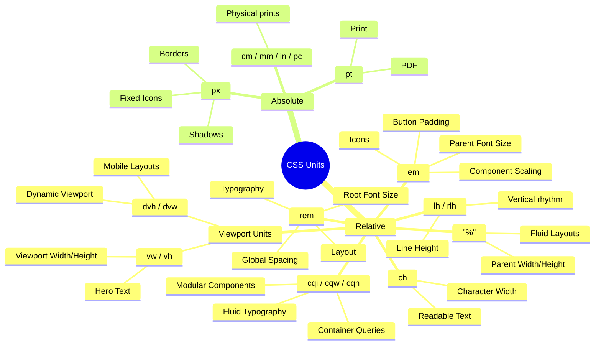

# CSS Units Explained: `px`, `rem`, `em`, `%`, `vw`, `vh`, `dvh`/`svh`/`lvh`, `cqi`/`cqw`/`cqh`, `lh`, `pt` and More

> **One-line rule**
>
> - **`rem`** → Global scale (Design system, Typography, Layout)
> - **`em`** → Component scale (Padding, Icons, Badges)
> - **`px`** → Precise pixels (Borders, Shadows, Hairlines)
> - **`%`** → Relative to parent (Fluid layouts)
> - **`vw` / `vh`** → Relative to viewport (Hero sections)
> - **`dvh` / `svh` / `lvh`** → Relative to dynamic / small / large viewport (Mobile layouts)
> - **`cqi` / `cqw` / `cqh`** → Relative to container query size/inline axis (Modular component layouts)
> - **`lh`** → Relative to element line height (Vertical rhythm / alignment)
> - **`pt`** → Print only

---

## Table of Contents

- [Quick Decision Tree](#quick-decision-tree)
- [Visual Overview](#visual-overview)
- [CSS Units Deep Dives](#css-units-deep-dives)
  - [1. `px` (Pixels)](#1-px-pixels)
  - [2. `rem` (Root EM)](#2-rem-root-em)
  - [3. `em` (Element EM)](#3-em)
  - [4. `%` (Percentage)](#4-)
  - [5. `vw` (Viewport Width)](#5-vw)
  - [6. `vh` (Viewport Height)](#6-vh)
  - [7. `vmin` / `vmax`](#7-vmin--vmax)
  - [8. `ch` (Character Width)](#8-ch)
  - [9. `ex` (x-Height)](#9-ex)
  - [10. `pt` (Points)](#10-pt)
  - [11. Modern Viewport Units (`svh`/`lvh`/`dvh`, `svw`/`lvw`/`dvw`)](#11-modern-viewport-units-svh--lvh--dvh-svw--lvw--dvw)
  - [12. Container Query Units (`cqi`, `cqw`, `cqb`, `cqh`, `cqmin`, `cqmax`)](#12-container-query-units-cqi-cqw-cqb-cqh-cqmin-cqmax)
  - [13. Line Height Units (`lh`, `rlh`)](#13-line-height-units-lh-rlh)
  - [14. Other Absolute Units (`cm`, `mm`, `in`, `pc`)](#14-other-absolute-units-cm-mm-in-pc)
- [Design System Architecture: `em` vs `rem` Dependency Models](#design-system-architecture-em-vs-rem-dependency-models)
- [Comparison & Recommendation Guide](#comparison--recommendation-guide)
  - [1. CSS Unit Comparison Table](#1-css-unit-comparison-table)
  - [2. Property-to-Unit Recommendation Table](#2-property-to-unit-recommendation-table)
- [Real Design System Example](#real-design-system-example)
- [Common Mistakes](#common-mistakes)
- [Golden Rules](#golden-rules)
- [Visual Diagrams & Mindmaps](#1-css-units-overview)
- [CSS Units & Layout Mechanics: In-Depth Architectural Guide](#css-units--layout-mechanics-in-depth-architectural-guide)

---

# Quick Decision Tree

```
Need responsive typography?
        │
        └── rem

Need component scale with its own font?
        │
        └── em

Need exact pixel precision?
        │
        └── px

Need width relative to parent?
        │
        └── %

Need size relative to screen?
        │
        └── vw / vh

Need dynamic layout for mobile viewport?
        │
        └── dvh / svh / lvh

Need size relative to a query container?
        │
        └── cqi / cqw / cqh

Need to match line height?
        │
        └── lh

Creating printable documents?
        │
        └── pt
```

---

# Visual Overview

```
                    CSS Units

               Relative Units
                     │
     ┌───────────────┼────────────────┐
     │               │                │
    rem             em                %
     │               │                │
 Root Font      Parent Font      Parent Size

                Viewport Units
                     │
         ┌───────────┴───────────┐
         │                       │
        vw                      vh

                Absolute Units
                     │
         ┌───────────┴───────────┐
         │                       │
        px                      pt
```

---

# 1. px (Pixels)

## Definition

An absolute CSS pixel.

```
1px = 1 CSS pixel
```

Not affected by parent font-size.

---

## Example

```css
.card {
  width: 320px;
}

.button {
  border: 1px solid;
}

.icon {
  width: 24px;
}
```

---

## Best Use Cases

✅ Borders

```css
border: 1px solid;
```

✅ Shadows

```css
box-shadow: 0 2px 8px;
```

✅ Icons with fixed size

```css
width: 24px;
height: 24px;
```

✅ Hairlines

```css
border-bottom: 1px;
```

---

## Avoid For

❌ Typography

```css
font-size: 16px;
```

because users changing browser font-size won't scale consistently.

---

## Pros

- Predictable
- Precise
- No calculations

---

## Cons

- Doesn't scale with accessibility settings
- Less flexible

---

# 2. rem (Root EM)

## Definition

Relative to the root (`html`) font-size.

```
html
↓

16px

↓

1rem = 16px
```

---

## Formula

```
value × html font-size
```

Example

```
html =16px

2rem

↓

32px
```

---

## Example

```css
html {
  font-size: 16px;
}

h1 {
  font-size: 2rem;
}
```

```
2 ×16

=

32px
```

---

## If root changes

```css
html {
  font-size: 18px;
}
```

Now

```
2rem

↓

36px
```

Entire application grows.

---

## Best Use Cases

Typography

```css
font-size: 1rem;
```

Margins

```css
margin: 2rem;
```

Layout spacing

```css
padding: 2rem;
```

Grid gaps

```css
gap: 1rem;
```

Containers

```css
max-width: 80rem;
```

Design systems

```
Spacing tokens

4rem

2rem

1rem

0.5rem
```

---

## Pros

✅ Accessible

✅ Predictable

✅ Entire application scales

✅ Easy maintenance

---

## Cons

Everything depends on root font-size.

Usually not a problem.

---

# 3. em

## Definition

Relative to the current element's font-size.

```
Parent

20px

↓

Child

1em

↓

20px
```

---

## Formula

```
value × parent font-size
```

---

## Example

```css
.parent {
  font-size: 20px;
}

.child {
  font-size: 1.5em;
}
```

```
20

×

1.5

=

30px
```

---

## Nested Example

```css
.parent {
  font-size: 20px;
}

.child {
  font-size: 1.5em;
}

.grandchild {
  font-size: 1.5em;
}
```

Result

```
Parent

20px

↓

Child

30px

↓

Grandchild

45px
```

Notice

```
20

↓

30

↓

45
```

It compounds.

---

# Why em is Amazing

Suppose

```css
.button {
  font-size: 16px;
  padding: 0.75em 1em;
}
```

Padding

```
Top

12px

Left

16px
```

Now

```css
.button.large {
  font-size: 24px;
}
```

Padding automatically becomes

```
Top

18px

Left

24px
```

No extra CSS.

---

## Perfect For

Component padding

```css
padding: 0.75em 1em;
```

Icons

```css
width: 1em;
height: 1em;
```

Badges

Buttons

Labels

Small reusable UI components

---

## Avoid

Large nested typography.

```
20px

↓

30px

↓

45px

↓

67.5px
```

Hard to debug.

---

# 4. %

## Definition

Relative to parent size.

---

Example

```css
.parent {
  width: 800px;
}

.child {
  width: 50%;
}
```

```
400px
```

---

Perfect for

Responsive layouts

```css
width: 100%;
```

Images

```css
img {
  width: 100%;
}
```

Flex items

Containers

---

Avoid

Typography.

---

# 5. vw

Viewport Width

```
1vw

=

1%

of browser width
```

Example

Browser

```
1000px
```

```
10vw

↓

100px
```

---

Use

Hero text

Landing pages

Responsive headings

---

Example

```css
font-size: 6vw;
```

---

Avoid

Normal body text.

---

# 6. vh

Viewport Height

```
1vh

=

1%

of browser height
```

---

Example

```css
height: 100vh;
```

Perfect for

Hero sections

Splash pages

Fullscreen layouts

---

# 7. vmin / vmax

```
vmin

↓

smaller side

vmax

↓

larger side
```

Useful

Responsive circles

Responsive artwork

---

# 8. ch

Width of "0" character.

Useful

Readable paragraphs.

```css
max-width: 65ch;
```

Very popular for articles.

---

# 9. ex

Height of lowercase x.

Rarely used.

Mostly typography research.

---

# 10. pt

Points

```
72pt

=

1 inch
```

Used for

PDF

Printing

Documents

Never for websites.

---

# 11. Modern Viewport Units (svh / lvh / dvh, svw / lvw / dvw)

## Definition

To solve layout issues with dynamic browser interface elements (like Safari's or Chrome's dynamic address bars on mobile screens), CSS provides Small (`sv*`), Large (`lv*`), and Dynamic (`dv*`) viewport units.

- **`svh` / `svw`** (Small Viewport): Calculated assuming dynamic browser toolbars are fully **expanded** (visible). This is the safest, smallest area.
- **`lvh` / `lvw`** (Large Viewport): Calculated assuming dynamic browser toolbars are fully **collapsed** (hidden). This is the largest area.
- **`dvh` / `dvw`** (Dynamic Viewport): Automatically and dynamically adjusts in real-time as dynamic toolbars expand or collapse.

---

## Example

```css
/* Avoid height: 100vh on mobile, as it causes content overflow */
.hero-section {
  height: 100dvh; /* Adapts dynamically to browser bars */
}

.modal {
  max-height: 90svh; /* Guaranteed to fit within visible viewport */
}
```

---

## Best Use Cases

✅ Fullscreen dynamic layouts on mobile device browsers.
✅ Mobile app layouts inside a web page.
✅ Dropdowns or sticky buttons that must always remain visible on screens with virtual keyboards or dynamic toolbars.

---

# 12. Container Query Units (`cqi`, `cqw`, `cqb`, `cqh`, `cqmin`, `cqmax`)

## Definition

Container Query Units size elements relative to the dimensions of a designated **query container** ancestor (defined via `container-type: inline-size` or `size`) rather than the global browser viewport (`vw` / `vh`).

Among these units, **`cqi` (Container Query Inline)** is the modern standard and most widely used container unit in modular web architecture.

---

## The Container Query Unit Family

| Unit        | Full Name                  | Calculation (% of Container)      | Axis Type   | Writing-Mode Dependent?                           |
| :---------- | :------------------------- | :-------------------------------- | :---------- | :------------------------------------------------ |
| **`cqi`**   | **Container Query Inline** | **1% of container's inline size** | **Logical** | **Yes** (Width in horizontal, Height in vertical) |
| **`cqb`**   | Container Query Block      | 1% of container's block size      | Logical     | Yes (Height in horizontal, Width in vertical)     |
| **`cqw`**   | Container Query Width      | 1% of container's physical width  | Physical    | No (Always horizontal width)                      |
| **`cqh`**   | Container Query Height     | 1% of container's physical height | Physical    | No (Always vertical height)                       |
| **`cqmin`** | Container Query Minimum    | Smaller of `cqi` and `cqb`        | Logical     | Yes                                               |
| **`cqmax`** | Container Query Maximum    | Larger of `cqi` and `cqb`         | Logical     | Yes                                               |

---

## Deep Dive: What is `cqi` (Container Query Inline)?

In CSS, **`cqi` stands for Container Query Inline**.

- **`1cqi` = 1% of the query container's inline size**.
- If a query container has an inline size (width in standard horizontal text) of `600px`:
  ```
  1cqi  = 6px
  4cqi  = 24px
  10cqi = 60px
  50cqi = 300px
  ```

### Formula

$$\text{Computed Size} = \text{Container Inline Size} \times \left(\frac{\text{cqi value}}{100}\right)$$

---

## Logical vs. Physical: Why `cqi` is Preferred Over `cqw`

Traditional CSS units like `cqw` and `cqh` are **physical units** tied to horizontal X and vertical Y screen axes.

In contrast, **`cqi` is a CSS Logical Unit** that adapts dynamically to the document or component's `writing-mode`:

| Writing Mode                                                                             | Layout Direction                                      | Inline Axis (`cqi`)                   | Block Axis (`cqb`)                    |
| :--------------------------------------------------------------------------------------- | :---------------------------------------------------- | :------------------------------------ | :------------------------------------ |
| **`horizontal-tb`** (Default: English, Hindi, Arabic, Spanish, etc.)                     | Top-to-bottom, lines flow horizontally                | **Horizontal Width** (`1cqi == 1cqw`) | **Vertical Height** (`1cqb == 1cqh`)  |
| **`vertical-rl` / `vertical-lr`** (East Asian: Traditional Japanese, Chinese, Mongolian) | Right-to-left or left-to-right, lines flow vertically | **Vertical Height** (`1cqi == 1cqh`)  | **Horizontal Width** (`1cqb == 1cqw`) |

### Key Benefits of Using `cqi`:

1. **Internationalization (i18n) Ready**: When a component is localized into vertical languages (e.g., Japanese vertical layouts), typography and spacing sized in `cqi` automatically track the line flow without rewriting CSS.
2. **Logical Property Consistency**: Modern CSS utilizes logical properties (`padding-inline`, `margin-inline`, `inline-size`, `inset-inline`). Using `cqi` maintains structural harmony across your codebase.
3. **Architectural Pairing**: Pairs seamlessly with `container-type: inline-size`.

---

## Establishing the Container Context

Before an element can consume `cqi` units, an ancestor element must establish a **containment context**.

```css
/* Step 1: Establish container context on parent */
.card-wrapper {
  container-type: inline-size; /* Enables inline dimension queries */
  container-name: card; /* Optional: names the container */
}

/* Shorthand syntax */
.card-wrapper {
  container: card / inline-size;
}

/* Step 2: Use cqi units inside child elements */
.card-title {
  font-size: clamp(1.1rem, 4cqi, 2.25rem);
}
```

### Why `container-type: inline-size` is Recommended (Preventing Infinite Layout Loops)

CSS layout engines prevent **circular dependency loops** (where an element's size changes the container size, which in turn re-evaluates the query, triggering another layout change indefinitely).

- If you set `container-type: size`, the browser contains layout on **both** width and height. For this to work, the container must have a predetermined height, which is rarely desirable for content-driven components.
- Setting `container-type: inline-size` isolates containment **strictly to the inline axis (width)**. This allows the component's height to naturally expand and grow with text wrapping without causing infinite recalculation loops.

---

## Practical Architectural Patterns with `cqi`

### 1. Fluid Component Typography with `clamp()` and `cqi`

Instead of relying on viewport width (`vw`), which makes text in sidebar cards too large on wide monitors, use `cqi` to scale text relative to the component's actual rendered width:

```css
.card-container {
  container-type: inline-size;
}

.card-title {
  /* Min: 1.1rem, Preferred: 3.5cqi + 0.5rem, Max: 2rem */
  font-size: clamp(1.1rem, 3.5cqi + 0.5rem, 2rem);
  line-height: 1.25;
}

.card-body {
  /* Subtle fluid scaling for body copy */
  font-size: clamp(0.875rem, 1.5cqi + 0.5rem, 1.125rem);
}
```

### 2. Proportional Component Spacing (Padding, Gap, Radius)

Unlike `%` (which behaves differently depending on the property it is applied to), `cqi` provides a consistent measure of the container's inline width for any property:

```css
.card {
  /* Padding expands smoothly as the card gets wider */
  padding: clamp(0.75rem, 4cqi, 2.5rem);

  /* Flex/Grid gap scales proportionally */
  gap: clamp(0.5rem, 2.5cqi, 1.5rem);

  /* Dynamic corner radius */
  border-radius: clamp(4px, 1.5cqi, 16px);
}
```

### 3. Truly Modular Multi-Context Component

A single card component can live in a **narrow sidebar (300px)**, a **3-column grid (400px)**, or a **full-width hero section (1200px)**. With `cqi` and `@container`, it automatically adapts without needing breakpoint classes:

```css
.card-host {
  container-type: inline-size;
  container-name: product-card;
}

.product-card {
  display: flex;
  flex-direction: column;
  padding: 3cqi;
  gap: 2cqi;
}

.product-card .thumbnail {
  width: 100%;
  aspect-ratio: 16 / 9;
}

.product-card .title {
  font-size: clamp(1rem, 4cqi, 2rem);
}

/* When the card itself is wider than 500px inline size */
@container product-card (inline-size >= 500px) {
  .product-card {
    flex-direction: row;
    align-items: center;
  }

  .product-card .thumbnail {
    width: 35cqi; /* 35% of the card's width */
  }
}
```

---

## `cqi` vs `%` vs `vw` / `vi`

| Feature                     | `cqi` (Container Query Inline)                     | `%` (Percentage)                         | `vw` / `vi` (Viewport Inline) |
| :-------------------------- | :------------------------------------------------- | :--------------------------------------- | :---------------------------- |
| **Reference Context**       | Nearest Query Container's inline size              | Direct parent property value             | Total browser window viewport |
| **Behavior on `font-size`** | % of container's inline size (Enables fluid type!) | % of parent's `font-size` (Compounding!) | % of screen viewport width    |
| **Behavior on `padding`**   | % of container's inline size                       | % of parent's width                      | % of screen viewport width    |
| **Writing-Mode Aware**      | ✅ Yes (Logical inline axis)                       | ⚠️ Partial (Property dependent)          | `vi` (Yes), `vw` (No)         |
| **Component Modularity**    | ⭐ High (Component-scoped)                         | Moderate                                 | ❌ Low (Screen-dependent)     |

---

---

## Fallback Behavior: What Happens Without `container-type`?

A common point of confusion is what happens when an element uses `cqi` (or any container query unit), but **no ancestor has declared `container-type`**:

> **Spec Rule (CSS Containment Level 3)**:
> If an element uses container query units (`cqi`, `cqw`, `cqb`, `cqh`, `cqmin`, `cqmax`) and has no qualifying ancestor query container, the browser **falls back to the Small Viewport (`sv*`) dimensions**.

| Scenario                                | `@container` Rule Behavior                                                   | `cqi` / `cqw` Unit Behavior                                                         |
| :-------------------------------------- | :--------------------------------------------------------------------------- | :---------------------------------------------------------------------------------- |
| **No query container ancestor defined** | **Evaluates to `false`** (Rule block is ignored, styles inside do NOT apply) | **Falls back to Small Viewport** (`1cqi` = `1svi` / `1svw`, ~1% of screen viewport) |
| **Valid query container defined**       | Evaluates condition against container size                                   | Evaluates as 1% of container's inline size                                          |

### Why this distinction matters:

- **`@container` rules fail gracefully**: If you wrap styles in `@container (min-width: 400px)`, nothing happens unless a container exists.
- **Container units `cqi` execute regardless**: If you set `font-size: 5cqi` without a container, the browser silently converts it to `5svi` (5% of the user's browser viewport!). On a 1920px screen, that becomes `96px` text even if your component was intended to be rendered inside a tiny 300px sidebar.

---

## When to Use Which Unit (Comprehensive Guide)

| Unit              | When to Use (Best Scenario)                                                               | How to Use (Best Practice Pattern)                                                 | Why Choose This Over Others?                                                                                                               |
| :---------------- | :---------------------------------------------------------------------------------------- | :--------------------------------------------------------------------------------- | :----------------------------------------------------------------------------------------------------------------------------------------- |
| **`cqi`**         | **Modular UI components** (cards, widgets, modals, list items)                            | Inside `container-type: inline-size;` paired with `clamp(min, preferred cqi, max)` | Scales proportionally to the component's immediate width, allowing the same component to work in a sidebar, 3-column grid, or hero banner. |
| **`rem`**         | **Global Typography & Layout tokens**                                                     | `font-size: 1.5rem;` `padding: 2rem;`                                              | Respects user root browser font accessibility settings and creates a unified application-wide scale.                                       |
| **`em`**          | **Component-local typographic scale** (button padding, inline badges, icons next to text) | `padding: 0.75em 1.25em;` `width: 1em; height: 1em;`                               | Spacing automatically grows or shrinks whenever that specific component's `font-size` changes (e.g. `.btn-sm` vs `.btn-lg`).               |
| **`%`**           | **Parent-relative fluid layout constraints**                                              | `width: 100%;` `flex-basis: 50%;` `max-width: 100%;`                               | Fits elements seamlessly inside parent flex or grid columns. (Avoid for `font-size`).                                                      |
| **`vw` / `vi`**   | **Macro page-level layouts**                                                              | Fullscreen hero titles, horizontal splash banners                                  | Sized relative to the full browser window width.                                                                                           |
| **`dvh` / `svh`** | **Mobile fullscreen heights**                                                             | `height: 100dvh;` `min-height: 100svh;`                                            | Safely handles collapsing/expanding mobile browser address bars without overflow bugs.                                                     |
| **`px`**          | **Exact pixel precision**                                                                 | `border: 1px solid;` `box-shadow: 0 4px 12px;`                                     | Borders and hairline separators that should never scale or blur with font zoom.                                                            |

---

## Pitfalls & Gotchas with `cqi` and Container Queries

### 1. ❌ Pitfall: The Silent Viewport Fallback Trap

- **Problem**: Forgetting to add `container-type: inline-size` on the parent container.
- **Symptom**: The child element using `cqi` will silently fall back to `1%` of viewport inline size (`svi`/`svw`). In narrow sidebars on wide screens, typography or spacing will blow up unexpectedly.
- **Fix**: Always verify that the immediate wrapper or ancestor has `container-type: inline-size`.

### 2. ❌ Pitfall: Using `container-type: size` for Content-Driven Layouts

- **Problem**: Setting `container-type: size` on a container whose height depends on its child text.
- **Symptom**: Layout collapse or infinite circular reflow loops (child text wraps -> container height changes -> query re-triggers -> layout breaks).
- **Fix**: Use `container-type: inline-size` for almost all UI components. Only use `size` if the container has an explicit, fixed `height` (e.g. fixed-height dashboard widget).

### 3. ❌ Pitfall: Using Raw `cqi` Without `clamp()` for Typography

- **Problem**: Declaring `font-size: 4cqi;` directly.
- **Symptom**: In a narrow 150px container, `4cqi = 6px` (unreadable). In a 1200px container, `4cqi = 48px` (massive).
- **Fix**: Always wrap fluid container units in `clamp()`:
  ```css
  font-size: clamp(0.9rem, 3.5cqi + 0.5rem, 1.75rem);
  ```

### 4. ❌ Pitfall: Applying `container-type` on `display: inline` Elements

- **Problem**: Adding `container-type: inline-size` to a `<span>` or other inline element.
- **Symptom**: The container query does not function because inline elements do not generate block formatting or containment contexts.
- **Fix**: Ensure the container has `display: block`, `inline-block`, `grid`, or `flex`.

### 5. ❌ Pitfall: Nested Containers Without `container-name` (Shadowing)

- **Problem**: Nesting multiple query containers without naming them.
- **Symptom**: Inner child elements automatically match the **nearest** ancestor container, which might be an inner card wrapper instead of the outer section panel.
- **Fix**: Give distinctive names to multi-tier containers:

  ```css
  .dashboard-widget { container: widget / inline-size; }
  .user-badge { container: badge / inline-size; }

  @container widget (inline-size > 400px) { ... }
  ```

### 6. ❌ Pitfall: Sizing the Container Itself with Container Units

- **Problem**: Writing `.card-container { width: 50cqi; }` where `.card-container` is itself the query container.
- **Symptom**: Sizing a container based on its own query units creates a circular reference error.
- **Fix**: Query units (`cqi`) should only be applied to **descendants/children** inside the container, not the container itself.

---

## Best Use Cases for `cqi`

✅ Fluid typography inside reusable UI components (cards, dialogs, widgets, banners).
✅ Responsive component internal spacing (`padding`, `gap`, `margin-inline`).
✅ Sizing inline icons, avatar badges, and decorative accents proportionally to the component width.
✅ Building multi-column design system components that seamlessly adapt anywhere on a page.

---

# 13. Line Height Units (lh, rlh)

## Definition

Relative to the element's line-height.

- **`lh`**: Relative to the current element's computed `line-height`.
- **`rlh`**: Relative to the root (`html`) element's computed `line-height`.

---

## Example

```css
/* Align an icon perfectly with the vertical bounds of the text line */
.icon {
  width: 1lh;
  height: 1lh;
}
```

---

## Best Use Cases

✅ Inline elements (like badges, tags, or icons) that must scale proportionally with text height.
✅ Vertical rhythm/grids.

---

# 14. Other Absolute Units (cm, mm, in, pc)

## Definition

Physical absolute measurements.

- **`in`**: Inches (1in = 96px = 2.54cm)
- **`cm`**: Centimeters (1cm = 37.8px)
- **`mm`**: Millimeters (1mm = 0.1cm)
- **`pc`**: Picas (1pc = 12pt = 1/6th of an inch)

---

## Best Use Cases

Use only for style rules targeted at physical media (e.g., printing stylesheet via `@media print`). Avoid using physical absolute units for digital displays, since physical measurements scale unpredictably on screens with different DPI (density).

---

## Design System Architecture: em vs. rem Dependency Models

While both `em` and `rem` are relative units in CSS and are often treated as interchangeable, they create fundamentally different dependency models in a UI system. Sizing elements based on where context is derived determines how a component behaves in a larger layout.

The issue is not invalid CSS; the issue is **implicit context**.

### 1. The Core Distinction: Application Scale vs. Component Scale

- **`rem` (Application Scale)**: Relative to the root font-size. This makes it suitable for values that should follow the global product scale: typography, spacing tokens, layout rhythm, containers, and design-system consistency.
- **`em` (Component Scale)**: Relative to the current element's font-size. This makes it useful for values that should scale with a component's local typography: button padding, inline icons, badges, and text-adjacent spacing.

### 2. The Problem of Implicit Context (Accidental Compounding)

The main risk with `em` is accidental compounding. In a nested component tree, an `em` value can be affected by parent font-size changes. While the component remains valid CSS, its visual output becomes dependent on its placement.

In practice, this can make a reusable component look correct in isolation but slightly inconsistent or broken inside other layouts (e.g., dashboards, tables, form sections, or widgets). This kind of inconsistency is difficult to detect from the CSS declaration alone because the value looks reasonable. The problem is not the number; the problem is where the number gets its context from.

### 3. Practical Rule: Explicit Boundaries

To ensure predictable styling, we must make these dependencies explicit rather than standardizing on a single unit everywhere:

- **Use `rem`** when the value belongs to the **application scale**.
- **Use `em`** when the value intentionally belongs to the **component scale**.

For example, a button should use `rem` for `font-size` and `em` for `padding`. This ensures the text remains aligned with the global type scale, while the internal spacing stays proportional to the button itself:

```css
.button {
  font-size: 1rem; /* Aligned to application/global scale */
  padding: 0.75em 1.2em; /* Local component scale, proportional to button font-size */
}
```

In large UI systems, predictable styling often depends on establishing these clear, explicit boundaries.

---

# Comparison & Recommendation Guide

## 1. CSS Unit Comparison Table

| Unit        | Relative To                 | Responsive | Best For                              | Avoid             |
| ----------- | --------------------------- | ---------- | ------------------------------------- | ----------------- |
| px          | Nothing                     | ❌         | Borders, Shadows                      | Typography        |
| rem         | Root font                   | ✅         | Typography, Layout                    | Component scaling |
| em          | Parent font                 | ✅         | Padding, Icons                        | Nested fonts      |
| %           | Parent size                 | ✅         | Width, Height                         | Fonts             |
| vw          | Viewport width              | ✅         | Hero text                             | Body text         |
| vh          | Viewport height             | ✅         | Fullscreen                            | Small elements    |
| dvh/dvw     | Dynamic viewport            | ✅         | Mobile fullscreen                     | Desktop-only UI   |
| cqi/cqw/cqh | Query container inline/size | ✅         | Component scaling, fluid component UI | Global layout     |
| lh          | Line height                 | ✅         | Icon/Vertical sync                    | General spacing   |
| ch          | Character width             | ✅         | Paragraph width                       | General layout    |
| pt          | Print                       | ❌         | PDF                                   | Web UI            |

---

## 2. Property-to-Unit Recommendation Table

| Property / Area                | Recommended Unit   | Architectural Rationale                                                                     |
| :----------------------------- | :----------------- | :------------------------------------------------------------------------------------------ |
| **Typography & Font Sizes**    | `rem`              | Ensures global typography scales consistently with user accessibility settings.             |
| **Global Layout & Spacing**    | `rem`              | Keeps margins, grid gaps, and layout paddings aligned with the design system scale.         |
| **Component Fluid Typography** | `clamp() + cqi`    | Scales text proportionally to the modular component width across multiple layout contexts.  |
| **Component Padding & Gaps**   | `em` / `cqi`       | Spacing scales with component font-size (`em`) or container inline width (`cqi`).           |
| **Component Icons & Badges**   | `em`               | Synchronizes size with the text it accompanies.                                             |
| **Borders & Shadows**          | `px`               | Precision border sizing and crisp visual borders regardless of browser zoom.                |
| **Fluid Element Width**        | `%` / `cqi`        | Scales horizontally relative to parent grid columns (`%`) or container inline size (`cqi`). |
| **Fullscreen Layouts**         | `vh` / `dvh`       | Sized relative to screen. Use `dvh` on mobile to prevent Safari address bar cuts.           |
| **Hero Heading Text**          | `clamp() + rem/vw` | Responsive fluid typography that caps scale on large and small screen viewports.            |
| **Text Paragraph Width**       | `ch`               | Best readability standard (capping lines at 60-70 characters wide).                         |
| **Print Stylesheets**          | `pt`               | Physical document formatting on printing layouts (`@media print`).                          |

---

# Real Design System Example

```css
html {
  font-size: 16px;
}

body {
  font-size: 1rem;
}

h1 {
  font-size: 2.5rem;
}

.container {
  max-width: 80rem;
  padding: 2rem;
}

.card-wrapper {
  container-type: inline-size;
}

.card {
  padding: clamp(1rem, 3cqi, 2rem);
  border-radius: 0.75rem;
}

.card-title {
  font-size: clamp(1.1rem, 4cqi, 2rem);
}

.button {
  font-size: 1rem;
  padding: 0.75em 1em;
}

.icon {
  width: 1em;
  height: 1em;
}

.avatar {
  width: 48px;
  height: 48px;
}

.divider {
  height: 1px;
}

.hero {
  min-height: 100vh;
}

.article {
  max-width: 65ch;
}
```

---

# Common Mistakes

## ❌ Everything in px

```css
font-size: 16px;
margin: 32px;
padding: 24px;
```

Harder to scale and violates web accessibility standards for text scaling.

---

## ❌ Everything in em

Compounding makes nested fonts grow or shrink unpredictably:

```
20px (Parent)
 ↓
30px (Child @ 1.5em)
 ↓
45px (Grandchild @ 1.5em)
 ↓
67.5px
 ↓
101px
```

Impossible to maintain and debug.

---

## ❌ Using vw for body text

```css
font-size: 2vw;
```

Tiny on phone viewports and huge on ultrawide monitors.

---

## ❌ Using pt on websites

```css
font-size: 12pt;
```

Designed for paper/printing scale, not responsive digital screens.

---

# Golden Rules

## Rule 1: Use `rem` for the Application Scale

Use for elements that must scale globally across the entire product layout.

- **Examples:**
  - Typography & Headings
  - Layout Spacing & rhythm
  - Container widths
  - Global margins & paddings
  - Grid gaps
  - Design system spacing tokens

## Rule 2: Use `em` for the Component Scale

Use when an element should scale proportionally with its own component typography.

- **Examples:**
  - Button padding
  - Inline icons
  - Badges & chips
  - Input adornments
  - Component-level relative padding/margins

## Rule 3: Use `cqi` for Modular Container Responsiveness

Use for fluid typography, gaps, and internal layouts within reusable UI components that adapt to container width rather than screen viewport.

- **Examples:**
  - Fluid component headings (`clamp(1.2rem, 4cqi, 2.5rem)`)
  - Fluid component padding & card gutters
  - Modular multi-context widgets (sidebar vs main grid)

## Rule 4: Use `px` for Precision

Use only where exact, non-scaling pixel precision is required.

- **Examples:**
  - Borders & outlines
  - Box shadows
  - Hairlines & separators
  - Fixed-size avatars
  - Canvas / SVG alignment

## Rule 5: Use `%` for Fluidity

Use for fluid, relative sizing constraints within responsive layouts.

- **Examples:**
  - Grid column widths
  - Fluid image widths (`max-width: 100%`)
  - Flex box basis alignments

## Rule 6: Use `vw`, `vh`, and `dvh` for Viewports

Use for layout boundaries sized relative to the screen dimensions.

- **Examples:**
  - Hero section heights
  - Fullscreen overlay heights (menus, modals)
  - Fullscreen splash pages

## Rule 7: Never use `pt` on Web UIs

Restrict point sizing strictly to print stylesheets (`@media print`) and PDF generation layouts.

---

# 1. CSS Units Overview



2. Decision Tree

   ```mermaid
   flowchart TD
     A[Need CSS Unit] --> B{What are you sizing?}
     B -->|Typography| C[rem]
     B -->|Layout / Margin / Gap| D[rem]
     B -->|Component Padding| E[em]
     B -->|Icons inside Component| F[em]
     B -->|Borders / Shadows| G[px]
     B -->|Fluid Width| H[pct["%"]]
     B -->|Viewport Section| I[vh]
     B -->|Mobile Viewport Section| L[dvh/svh]
     B -->|Component Inner Layout / Fluid Type| M[cqi/cqw]
     B -->|Icon to Line Height| N[lh]
     B -->|Hero Font| J[clamp + rem + vw]
     B -->|Print| K[pt]
   ```

3. rem vs em

   ```mermaid
   flowchart LR
     subgraph REM
       A[html font-size = 16px]
       A --> B[Card]
       A --> C[Button]
       A --> D[Modal]
       A --> E[Table]

       B -->|1rem| F[16px]
       C -->|1rem| G[16px]
       D -->|1rem| H[16px]
       E -->|1rem| I[16px]
     end

     subgraph EM
       P[Parent 20px]
       P --> Q[Child 1.5em]
       Q --> R[30px]
       R --> S[Grandchild 1.5em]
       S --> T[45px]
     end
   ```

4. em Compounding

   ```mermaid
   graph TD
     A[Parent 20px] --> B[Child 1.5em]
     B --> C[30px]
     C --> D[Grandchild 1.5em]
     D --> E[45px]
     E --> F[Next Child 1.5em]
     F --> G[67.5px]
     style G fill:#ffdddd
   ```

5. Browser Calculation

   ```mermaid
   flowchart TD
     A[Browser] --> B[html font-size = 16px]
     B --> C[1rem]
     C --> D[16px]
     B --> E[Parent font-size = 20px]
     E --> F[1em]
     F --> G[20px]
     G --> H[Child font-size = 30px]
     H --> I[1em]
     I --> J[30px]
   ```

6. Which Unit Depends on What

   ```mermaid
   graph LR
     HTML[html font-size] --> rem
     HTML --> rlh
     Parent[Parent Element] --> em
     Parent --> lh
     Container[Parent Width] --> pct["%"]
     Viewport[Browser Window] --> vw
     Viewport --> vh
     DynamicViewport[Mobile Viewport] --> dvh/dvw
     QueryContainer[Query Container] --> cqi/cqw/cqh
     Nothing[Absolute] --> px
     Nothing --> pt
   ```

7. Recommended Usage

   ```mermaid
   flowchart LR
     Typography --> rem
     Layout --> rem
     Spacing --> rem
     Grid --> rem

     Button --> em
     Badge --> em
     Icon --> em
     Component Scale --> em

     Border --> px
     Shadow --> px

     Image --> pct["%"]
     Container --> pct
     Need Responsive Width --> pct

     Hero --> vh
     HeroMobile --> dvh
     Landing --> vw
     ComponentLayout --> cqi
     VerticalAlignment --> lh

     Print --> pt
   ```

8. Relative vs Absolute

   ```mermaid
   graph TD
     CSS[CSS Units] --> Relative
     CSS --> Absolute

     Relative --> rem
     Relative --> em
     Relative --> pct["%"]
     Relative --> vw
     Relative --> vh
     Relative --> dvh/dvw
     Relative --> cqi/cqw/cqh
     Relative --> lh
     Relative --> ch

     Absolute --> px
     Absolute --> pt
     Absolute --> cm/mm/in
   ```

```
CSS Units
├── Relative
│   ├── rem
│   ├── em
│   ├── %
│   ├── vw
│   ├── vh
│   ├── dvh / dvw
│   ├── cqi / cqw / cqh
│   ├── lh
│   └── ch
└── Absolute
    ├── px
    ├── pt
    └── cm / mm / in
```

9. Industry Rule (Best Practice)

   ```mermaid
   flowchart TD
     DesignSystem --> Typography
     DesignSystem --> Layout
     DesignSystem --> Components

     Typography --> rem
     Layout --> rem

     Components --> Button
     Components --> Card
     Components --> Badge
     Components --> Icon

     Button -->|Font| rem
     Button -->|Padding| em
     Card -->|Fluid Font/Padding| cqi
     Badge --> em
     Icon --> em
     Border --> px
     Shadow --> px
   ```

10. Complete Cheat Sheet (Most Useful)

    ```mermaid
    flowchart TD
      Start[Choose a CSS Unit] --> A{Need Global Scaling?}
      A -->|Yes| rem
      A -->|No| B{Need Component Scaling?}
      B -->|Yes| em
      B -->|No| C{Need Exact Pixels?}
      C -->|Yes| px
      C -->|No| H{Relative to Container?}
      H -->|Yes| cqi/cqw/cqh
      H -->|No| D{Relative to Parent?}
      D -->|Yes| pct["%"]
      D -->|No| E{Relative to Viewport?}
      E -->|Dynamic Height/Width| dvh/dvw
      E -->|Fixed Width| vw
      E -->|Fixed Height| vh
      E -->|No| I{Relative to Line Height?}
      I -->|Yes| lh
      I -->|No| F{Readable Text Width?}
      F -->|Yes| ch
      F -->|No| G{Printing?}
      G -->|Yes| pt
    ```

11. CSS Unit Dependency Graph
    html

↓

rem

↓

Application

---

Parent

↓

em

↓

Component

---

Viewport

↓

vw/vh

↓

Screen

---

Query Container

↓

cqi / cqw

↓

Modular Component

---

Parent Width

↓

%

↓

Layout

12. Formula Section
    rem

value × html font-size

---

em

value × parent font-size

---

%

value × parent size

---

vw

viewport × %

---

vh

viewport height × %

---

dvh / dvw

dynamic viewport height/width × %

---

cqi

container inline-size × %

---

cqw / cqh

query container width/height × %

---

lh

value × element line-height

13. Quick Reference Table
    | Unit | Relative To | Best Use | Pitfall |
    | ---- | --------------- | ------------------ | --------------------------------------------------- |
    | px | Nothing | Borders, Shadows | Doesn't scale |
    | rem | html | Typography, Layout | Depends on root font-size |
    | em | Parent font | Padding, Icons | Compounding |
    | % | Parent size | Width, Height | Depends on parent dimensions |
    | vw | Viewport width | Hero text | Can become too small/large |
    | vh | Viewport height | Fullscreen | Mobile browser UI quirks (`100dvh` preferred) |
    | dvh/dvw | Dynamic Viewport | Mobile layouts | Performance overhead on resize |
    | cqi/cqw | Query Container | Modular components, fluid type | Needs container-type defined |
    | lh | line-height | Sizing icons to text | line-height must be defined/predicted |
    | ch | Character width | Readable text | Not for general layouts |
    | pt | Physical point | Printing | Not for web |

# CSS Units & Layout Mechanics: In-Depth Architectural Guide

---

# Why does `rem` improve accessibility?

## Short Answer

Because `rem` is based on the browser's **root font size**, it automatically respects user accessibility settings.

---

## How it works

By default:

```css
html {
  font-size: 16px;
}
```

```
1rem = 16px
```

Now imagine a user has poor eyesight and increases the browser's default font size to **20px**.

```
html
font-size:20px
```

Now:

```
1rem = 20px
```

Every component using `rem` scales automatically.

```
Heading
2rem

↓

40px

Paragraph
1rem

↓

20px

Button
1rem

↓

20px
```

No CSS changes are required.

---

## Why `px` doesn't behave the same

```css
font-size: 16px;
```

Always stays

```
16px
```

regardless of the user's preferred font size.

---

## Accessibility Benefit

✅ Respects browser accessibility preferences

✅ Improves readability

✅ Supports low-vision users

✅ Entire application scales consistently

---

## Key Engineering Takeaway

> `rem` improves accessibility because it's based on the root font size. When users increase their browser's default font size, every element using `rem` scales automatically, making the UI more readable without requiring application changes.

---

# Why shouldn't typography usually use `em`?

## Short Answer

Because `em` depends on the parent's font size, typography can unintentionally grow or shrink when components are nested.

---

## Example

```css
.parent {
  font-size: 20px;
}

.child {
  font-size: 1.2em;
}

.grandchild {
  font-size: 1.2em;
}
```

Result

```
Parent

20px

↓

Child

24px

↓

Grandchild

28.8px
```

The typography keeps growing.

---

## Why this is a problem

Imagine a reusable Card component.

```
Dashboard

↓

Card

↓

Table

↓

Button

↓

Label
```

If every level uses `em`, the text size becomes dependent on where the component is placed.

The component behaves differently in different layouts.

---

## Better Approach

Typography

```css
font-size: 1rem;
```

Component padding

```css
padding: 0.75em 1em;
```

Now typography stays globally consistent while the component's internal spacing scales naturally.

---

## Key Engineering Takeaway

> Typography usually uses `rem` because text should follow the application's global type scale. Using `em` can create unintended font-size compounding in nested components, making reusable UI less predictable.

---

# Why is button padding often `em`?

## Short Answer

Because the padding should grow with the button's own text size.

---

## Example

```css
.button {
  font-size: 16px;
  padding: 0.75em 1em;
}
```

Result

```
Font

16px

Padding

12px 16px
```

Now create a larger button.

```css
.button.large {
  font-size: 24px;
}
```

Padding automatically becomes

```
18px 24px
```

No extra CSS.

---

## Without `em`

You would need

```css
.button.large {
  padding: 18px 24px;
}
```

for every size variation.

---

## Why this is useful

The button keeps its proportions.

```
Small Button

████████

Large Button

████████████
```

The spacing always feels balanced.

---

## Key Engineering Takeaway

> Button padding often uses `em` because it should scale proportionally with the button's own font size. As the text grows, the padding grows automatically, preserving the component's visual proportions.

---

# Difference between `100vh` and `100%`

They are **not the same thing**.

---

## `100%`

Means

```
100%

of

parent height
```

Example

```css
.parent {
  height: 600px;
}

.child {
  height: 100%;
}
```

Result

```
600px
```

If the parent has **no defined height**, `100%` usually won't behave as expected.

---

## `100vh`

Means

```
100%

of

viewport height
```

Example

Browser

```
900px tall
```

Then

```css
height: 100vh;
```

becomes

```
900px
```

regardless of parent elements.

---

## Comparison

| `100%`                 | `100vh`                      |
| ---------------------- | ---------------------------- |
| Relative to parent     | Relative to viewport         |
| Requires parent height | No parent dependency         |
| Used inside layouts    | Used for fullscreen sections |

---

## Modern Mobile Note

On mobile browsers, `100vh` may include the browser's address bar, causing layout jumps.

Modern CSS provides:

```css
height: 100dvh;
```

which tracks the **dynamic viewport height** more accurately.

---

## Key Engineering Takeaway

> `100%` depends on the parent's computed height, while `100vh` depends on the browser viewport. `100vh` is commonly used for fullscreen sections, whereas `100%` is used inside parent-controlled layouts.

---

# Why do design systems prefer `rem`?

## Short Answer

Because every component shares the same global scale.

---

## Example

```
Application

↓

Typography

↓

Spacing

↓

Cards

↓

Tables

↓

Forms

↓

Buttons
```

Everything uses

```
rem
```

Now the designer says

> Increase the application scale by 10%.

Only one value changes.

```css
html {
  font-size: 18px;
}
```

Immediately

```
Typography

↓

Spacing

↓

Layouts

↓

Components
```

all scale together.

---

## Benefits

✅ Predictable

✅ Accessible

✅ Easy theming

✅ Consistent spacing

✅ Easier maintenance

---

## Key Engineering Takeaway

> Design systems prefer `rem` because it creates a single global scale. Typography, spacing, and layouts all respond consistently to changes in the root font size, making them easier to maintain, theme, and adapt for accessibility.

---

# Explain `em` Compounding

## What is it?

Compounding occurs when nested elements repeatedly multiply their font sizes using `em`.

---

## Example

```css
.parent {
  font-size: 20px;
}

.child {
  font-size: 1.5em;
}

.grandchild {
  font-size: 1.5em;
}
```

Calculation

```
20px

↓

30px

↓

45px
```

because

```
20 × 1.5

=

30

30 × 1.5

=

45
```

---

## Visual

```
Parent
20px

↓

Child
1.5em

↓

30px

↓

Grandchild
1.5em

↓

45px
```

Each level depends on the previous level.

---

## Why is this dangerous?

A reusable component may render correctly by itself but become larger or smaller when placed inside another component with a different font size.

The CSS isn't wrong—the dependency is hidden.

---

## How to avoid it

Use

```css
font-size: 1rem;
```

for typography.

Use

```css
padding: 0.75em;
```

for component internals.

This keeps:

- Global text consistent
- Component spacing proportional

---

## Key Engineering Takeaway

> `em` compounding happens because each nested element calculates its size from its parent's computed font size. Multiple nested `em` values multiply together, which can make reusable components behave differently depending on where they're rendered. Using `rem` for typography and `em` for component internals avoids this issue.

---

# What are dynamic viewport units (`dvh`/`dvw`, `svh`/`svw`, `lvh`/`lvw`) and what problem do they solve?

## Short Answer

They solve the "mobile viewport height bug" where dynamic browser toolbars (like Chrome/Safari address bars) expand or collapse, causing standard `100vh` layouts to either overflow or jump visually.

---

## The Problem with `vh` on Mobile

On iOS Safari or Android Chrome, the address bar is dynamic:

- When the page loads, the bar is large.
- As the user scrolls down, the bar shrinks or hides.

Standard `100vh` is calculated based on the maximum screen height _excluding_ dynamic bars, or it doesn't adjust. This causes `height: 100vh` elements to overflow beyond the visible screen, hiding action buttons or text at the bottom.

---

## How Modern Viewport Units Solve This

1. **`100svh` (Small Viewport Height)**:
   - Assumes the browser bars are fully expanded.
   - Safe space that guarantees no content is covered by toolbars.
2. **`100lvh` (Large Viewport Height)**:
   - Assumes browser bars are fully collapsed.
   - Max height.
3. **`100dvh` (Dynamic Viewport Height)**:
   - Resizes dynamically as the browser bars expand or collapse.

---

## Key Engineering Takeaway

> Standard `vh` units don't account for the dynamic address bars on mobile browsers, often causing `100vh` containers to overflow the visible screen. Modern viewport units solve this: `svh` represents the smallest viewport height (address bar visible), `lvh` represents the largest (address bar hidden), and `dvh` dynamically adjusts between the two. `dvh` is preferred for mobile-friendly fullscreen layouts.

---

# What are Container Query Units (`cqi`, `cqw`, etc.) and when should you use them over viewport units?

## Short Answer

Container Query Units size elements relative to a parent **query container** rather than the global browser window, enabling truly modular, component-driven responsive design.

---

## Why viewport units (`vw`/`vh`) fail for components

Imagine a responsive `.card` component:

- In a 3-column layout on desktop, the card is narrow (~350px).
- In a 1-column layout on desktop (hero banner), the card is wide (~1100px).

If you size heading text or padding inside the card using viewport width (`4vw`), the card's inner content renders at the **exact same large font size in both layouts** simply because the monitor viewport is unchanged. The text overflows and breaks the narrow 3-column card.

---

## Sizing with Container Queries & `cqi`

By establishing a parent container:

```css
.card-container {
  container-type: inline-size;
}
```

The child can size its typography and spacing fluidly relative to the container's inline width using `cqi`:

```css
.card-title {
  font-size: clamp(1rem, 4cqi + 0.5rem, 2.25rem); /* Proportional to card width! */
}
```

---

## Key Engineering Takeaway

> Viewport units scale relative to the entire screen width, which breaks modular UI design when components are placed in sidebars, modals, or multi-column grids. Container query units (`cqi`, `cqw`) size elements relative to their nearest query container. Use `cqi` for reusable components so their typography, padding, and layout automatically adapt to the specific space they occupy on the screen.

---

# In CSS, what is `cqi` (Container Query Inline) and why is it preferred over `cqw`?

## Short Answer

In CSS, **`cqi` stands for Container Query Inline**. It represents **1% of the query container's inline size**. It is preferred over `cqw` because `cqi` is a **logical unit** that respects internationalization and document `writing-mode`.

---

## 1. Physical vs. Logical Dimensions

- **`cqw` (Container Query Width)**: A **physical unit** that always measures the horizontal width (X-axis) of the container.
- **`cqi` (Container Query Inline)**: A **logical unit** that measures the size along the reading flow (inline axis).
  - In horizontal text (`writing-mode: horizontal-tb` — English, Arabic, Hindi, etc.), the inline axis is horizontal, so `1cqi == 1cqw`.
  - In vertical text (`writing-mode: vertical-rl` / `vertical-lr` — traditional East Asian typography), the inline axis is vertical, so `1cqi == 1cqh` (1% of container height).

Using `cqi` ensures your components automatically adapt when translated or rendered in vertical writing systems without manual CSS overrides.

---

## 2. Why `cqi` pairs with `container-type: inline-size`

To prevent **infinite layout loops** (where child element height changes container height, which triggers a style change that modifies child height again), modern CSS best practice uses:

```css
.container {
  container-type: inline-size; /* Contains inline axis only */
}
```

Because `container-type: inline-size` explicitly measures the inline dimension without locking down block height, **`cqi` is the exact, natural matching unit** to size child elements.

---

## 3. `cqi` vs `%` for Typography

| Sizing Unit          | `font-size: 5%`                                                                          | `font-size: 5cqi`                                                                       |
| :------------------- | :--------------------------------------------------------------------------------------- | :-------------------------------------------------------------------------------------- |
| **How it evaluates** | Evaluates to 5% of the **parent element's font size** (unusable for typography scaling). | Evaluates to 5% of the **container's inline width** (enables smooth fluid typography!). |
| **Use Case**         | Scaling relative to ancestor font size.                                                  | Fluid component typography clamped with `clamp()`.                                      |

---

## Key Engineering Takeaway

> In CSS, `cqi` stands for Container Query Inline, representing 1% of the container's inline size. Unlike physical units like `cqw` (which always tracks horizontal width), `cqi` is a logical unit that adapts to different writing modes (such as vertical Japanese or horizontal English). It naturally pairs with `container-type: inline-size` to build fluid, modular typography and spacing that scale with component width without causing circular height recalculation loops.

---

# If you don't have `container-type` declared anywhere on your page, but an element uses `cqi` units, what does it measure?

## Short Answer

It measures the **Small Viewport Inline Size (`svi` / `svw`)**.

Unlike `@container` queries (which fail to match if no container is defined), **container query units fallback directly to the viewport**.

---

## Technical Mechanics & Fallback Resolution

> **Question**: If no container is declared, does `font-size: 5cqi` evaluate to:
>
> 1. _Nothing / 0px_ (because container queries require a defined container)?
> 2. _The Viewport_?

**Correct Answer**: **The Viewport!**

### Why this happens (CSS Specification):

According to the **W3C CSS Containment Level 3** specification, when an element references a container query unit (`cqi`, `cqw`, `cqb`, `cqh`, `cqmin`, `cqmax`) but **no query container exists** on any ancestor in the DOM tree, the unit defaults to the corresponding **small viewport unit**:

- `1cqi` falls back to `1svi` (1% of small viewport inline size, i.e., `1svw` in horizontal text).
- `1cqw` falls back to `1svw`.
- `1cqh` falls back to `1svh`.
- `1cqb` falls back to `1svb`.

---

## The Critical Gotcha: `@container` vs `cqi` Units

There is a vital asymmetry in CSS between `@container` at-rules and container units:

| CSS Feature                                 | Behavior When NO `container-type` is Declared                                              |
| :------------------------------------------ | :----------------------------------------------------------------------------------------- |
| **`@container (min-width: 400px) { ... }`** | **Fails / Evaluates to `false`**. The rule block is ignored and inner styles do not apply. |
| **`width: 50cqi;` or `font-size: 4cqi;`**   | **Executes anyway!** Falls back to 50% / 4% of the browser's viewport.                     |

### Practical Risk:

If a developer forgets to declare `container-type: inline-size` on a wrapper, a component placed in a narrow 250px sidebar will calculate `cqi` based on the 1920px screen viewport width, causing text and padding to blow up and overflow the sidebar.

---

## Key Engineering Takeaway

> If no `container-type` is declared, container query units (`cqi`, `cqw`, etc.) do not evaluate to zero or fail; instead, the CSS specification dictates that they fall back to the Small Viewport (`svi`/`svw`). This creates an important asymmetry: while `@container` condition blocks fail to apply without an established container, `cqi` units will still execute by measuring the entire browser window instead.

---

# What are the major pitfalls of Container Query Units and how do you avoid them?

## Short Answer

The biggest pitfalls are **silent viewport fallback**, **infinite circular layout loops** with `container-type: size`, **unclamped typography scaling**, and **styling inline elements**.

---

## Key Pitfalls & Best Practice Solutions

### 1. Silent Viewport Fallback

- **Pitfall**: Omitting `container-type: inline-size` causes `cqi` to silently measure the full viewport window.
- **Fix**: Always establish the container context on the immediate component host.

### 2. Infinite Circular Layout Loops

- **Pitfall**: Using `container-type: size` on components whose height depends on child text wrapping.
- **Fix**: Use `container-type: inline-size`. Only use `size` when the container has a strictly fixed `height`.

### 3. Microscopic or Massive Typography

- **Pitfall**: Using raw `cqi` values (e.g. `font-size: 4cqi`) without min/max boundaries.
- **Fix**: Always constrain fluid typography with `clamp()`:
  ```css
  font-size: clamp(0.9rem, 3cqi + 0.5rem, 1.75rem);
  ```

### 4. Nesting Collisions

- **Pitfall**: Multiple nested query containers without names cause inner elements to match the wrong container.
- **Fix**: Use explicit container names (`container: card / inline-size;` and `@container card (...)`).

---

## Key Engineering Takeaway

> The primary pitfalls when working with container queries are: (1) forgetting `container-type: inline-size`, which causes `cqi` to silently fall back to measuring the viewport; (2) using `container-type: size` instead of `inline-size`, which risks circular dependency infinite loops; (3) declaring raw `cqi` on text without `clamp()`, making typography unreadable in extreme container sizes; and (4) nesting containers without explicit `container-name` identifiers.

---

# What is the difference between a CSS pixel (`px`) and a physical pixel on a high-DPI (Retina) screen?

## Short Answer

A CSS pixel (`px`) is an abstract, logical unit of measurement, whereas a physical pixel is the actual light-emitting hardware dot on the physical display.

---

## How they relate

To keep web layouts looking consistent across different screen densities, browsers translate CSS pixels to physical pixels using the **Device Pixel Ratio (DPR)**:

```
Physical Pixels = CSS Pixels × Device Pixel Ratio (DPR)
```

- **Standard Screen (DPR = 1)**: 1 CSS pixel maps to exactly 1 physical pixel.
- **Retina/High-DPI Screen (DPR = 2)**: 1 CSS pixel maps to 2 physical pixels wide and 2 physical pixels high (a grid of 4 physical pixels).
- **Ultra-high Density (DPR = 3)**: 1 CSS pixel maps to 9 physical pixels (3x3 grid).

---

## Why this matters

For sharp borders or icons, 1 CSS pixel on a high-DPI screen is actually rendered using multiple physical pixels. This is why standard images (`1x`) look blurry on Retina displays, requiring developers to provide higher-resolution assets (`2x`, `3x`) or use vector formats like SVGs.

---

## Key Engineering Takeaway

> A physical pixel is a hardware dot on the screen, while a CSS pixel is a logical unit used in layout calculations. On high-DPI or Retina screens, the Device Pixel Ratio (DPR) is greater than 1, meaning the browser maps a single CSS pixel to a grid of multiple physical pixels (e.g., 4 or 9 physical pixels) to ensure text and layout sizes look identical across devices while rendering much sharper.

---

# Why does an element with `width: 100%`, `padding`, and `margin` still overflow its parent even with `box-sizing: border-box`?

## The Problem

A block element has `width: 100%`, `padding: 1rem`, and `margin: 1rem`. It overflows its parent container horizontally. You add `box-sizing: border-box`, but it **still overflows**. Why?

---

## 1. WHAT: The Box Model Hierarchy

The CSS Box Model consists of 4 concentric layers:

```
┌───────────────────────────────────────────────┐
│ MARGIN BOX (Outside border-box)              │
│  ┌─────────────────────────────────────────┐  │
│  │ BORDER BOX                              │  │
│  │  ┌───────────────────────────────────┐  │  │
│  │  │ PADDING BOX                       │  │  │
│  │  │  ┌─────────────────────────────┐  │  │  │
│  │  │  │ CONTENT BOX                 │  │  │  │
│  │  │  │                             │  │  │  │
│  │  │  └─────────────────────────────┘  │  │  │
│  │  └───────────────────────────────────┘  │  │
│  └─────────────────────────────────────────┘  │
└───────────────────────────────────────────────┘
```

- `box-sizing: content-box` (default) → `width` = Content only.
- `box-sizing: border-box` → `width` = Content + Padding + Border.
- **Margin is NEVER part of the border box**. It is always placed outside the border.

---

## 2. WHY: The Mathematical Formula

When you write `width: 100%`, the element's border box takes up **100% of the parent's content width**.

The total rendered horizontal footprint is:

$$\text{Total Width} = \text{margin-left} + \text{border-box width} + \text{margin-right}$$
$$\text{Total Width} = 1\text{rem} + 100\% + 1\text{rem} = 100\% + 2\text{rem}$$

Because $100\% + 2\text{rem} > 100\%$, the element overflows the parent's right boundary by exactly `2rem`.

---

## 3. HOW: Solutions & Best Practices

### Solution A: Use `width: auto;` (The Idiomatic CSS Solution)

In normal block flow, elements default to `width: auto`. Under `width: auto`, the browser automatically computes the width as:
$$\text{Content Width} = \text{Parent Width} - (\text{margins} + \text{borders} + \text{paddings})$$

```css
.card-child {
  /* Do NOT declare width: 100% */
  width: auto;
  margin: 1rem;
  padding: 1rem;
  box-sizing: border-box; /* Fits perfectly inside parent without overflowing */
}
```

### Solution B: Use `calc()` if `width: 100%` is Required

```css
.card-child {
  width: calc(100% - 2rem);
  margin: 1rem;
  box-sizing: border-box;
}
```

---

## Key Engineering Takeaway

> `box-sizing: border-box` includes padding and borders inside the declared width, but margins are always placed outside the border box. Therefore, declaring `width: 100%` with a `1rem` margin causes the element to occupy `100% + 2rem` of horizontal space, overflowing its parent. The correct fix is removing `width: 100%` and using default `width: auto`, which automatically subtracts margins to fit the parent.

---

# How do you position an element along the outer perimeter border edge of a container?

## The Problem

You have a decorative pin/badge element inside a `.card` (`position: relative`). You want it to sit precisely on the card's outer border line so it can move anywhere around the 4 edges of the perimeter. Which CSS property achieves this?

---

## 1. WHAT: CSS Motion Path & Geometry Boxes

The property is **`offset-path: border-box;`**.

In modern CSS, the **Motion Path module** allows `<geometry-box>` values (`border-box`, `padding-box`, `content-box`, `margin-box`) as values for `offset-path`.

---

## 2. WHY: How `offset-path: border-box` Works

- When an absolutely positioned child specifies `offset-path: border-box;`, the browser generates a path matching the **exact perimeter rectangle of the containing block's border box**.
- `offset-distance: <percentage>` moves the element along the perimeter ($0\%$ to $100\%$).
- `offset-anchor: 50% 50%;` centers the child badge directly on top of the border line.

### Why other properties fail:

- `position-area: border-box;` ❌ — `position-area` (CSS Anchor Positioning) uses 9-cell grid areas (`top`, `bottom right`, `center`, etc.), not geometry boxes.
- `offset-shape: border-box;` ❌ — Non-existent CSS property.
- `shape-outside: border-box;` ❌ — Wraps inline text flow around floated boxes; does not position elements.

---

## 3. HOW: Code Implementation

```css
.card {
  position: relative;
  width: 320px;
  height: 200px;
  border: 2px solid #6366f1;
  border-radius: 12px;
}

.perimeter-badge {
  position: absolute;
  width: 24px;
  height: 24px;
  background: #ef4444;
  border-radius: 50%;

  /* Trace the card's outer border box perimeter */
  offset-path: border-box;
  offset-anchor: 50% 50%; /* Center the pin over the border */
  offset-distance: 25%; /* 0% = top-left, 25% = top-right, 50% = bottom-right */

  transition: offset-distance 0.4s ease;
}

/* Move badge to bottom-right on hover */
.card:hover .perimeter-badge {
  offset-distance: 50%;
}
```

---

## Key Engineering Takeaway

> To position and move an element along a container's perimeter border, use `offset-path: border-box;` combined with `offset-distance` and `offset-anchor: 50% 50%`. The CSS Motion Path specification uses the container's `border-box` geometry to trace an exact perimeter path around which child elements can be placed or animated.

---

# Why do vertical percentage margins and paddings (`margin-top: 50%`) calculate relative to WIDTH, not Height?

## The Problem

If you write `padding-top: 50%` or `margin-top: 20%` on a child element, why does the browser compute the pixel value from the parent's **width** instead of its **height**?

---

## 1. WHAT: The Inline-Axis Percentage Resolution

In standard CSS layout specifications (CSS Box Model Level 3 & CSS2):

> Percentage values for `margin-top`, `margin-bottom`, `padding-top`, and `padding-bottom` are resolved relative to the **inline size (width)** of the containing block.

---

## 2. WHY: Preventing Infinite Layout Reflow Loops

If vertical margins/paddings were resolved against the parent's **height**:

```
1. Child declares padding-top: 50% (of parent height)
2. Adding top padding increases the child's height
3. Child height increases parent's auto height
4. Taller parent causes padding-top to increase again
5. RECURSIVE INFINITE LOOP → Browser hangs / crashes!
```

To guarantee that CSS layout calculation remains a single-pass, non-recursive algorithm, all four sides of `padding` and `margin` resolve against the **containing block's width** (which is already known before vertical content layout begins).

---

## 3. HOW: Modern Aspect Ratios vs The Legacy Padding Hack

### Legacy Method (The Intrinsic Aspect Ratio Hack)

Before CSS `aspect-ratio`, developers used this exact quirk to enforce video/card ratios:

```css
/* Old 16:9 responsive box hack (9 / 16 = 56.25%) */
.aspect-ratio-box {
  width: 100%;
  height: 0;
  padding-bottom: 56.25%; /* 56.25% of parent width = perfect 16:9 height! */
  position: relative;
}
```

### Modern Standard (CSS `aspect-ratio`)

```css
/* Modern Clean Standard */
.video-container {
  width: 100%;
  aspect-ratio: 16 / 9; /* No padding hacks required */
}
```

---

## Key Engineering Takeaway

> In CSS, vertical padding and margins resolve against the parent's width (inline size) to prevent infinite circular layout loops. If vertical padding depended on parent height, expanding the child's padding would increase the parent's height, which in turn would re-trigger larger padding infinitely. Modern CSS provides `aspect-ratio` to create proportional boxes cleanly without relying on vertical padding hacks.

---

# How does CSS `subgrid` solve track alignment across modular card components?

## The Problem

You have a 3-column CSS Grid displaying product cards. Each card contains a title, a variable-length description, and a footer button. Because descriptions have different lengths, the buttons in adjacent cards do not align vertically across the row.

---

## 1. WHAT: The CSS `subgrid` Feature

`grid-template-rows: subgrid;` allows a grid child to adopt the rows and tracks defined by its parent grid, rather than establishing an isolated independent grid.

---

## 2. WHY: Isolated Grid Contexts vs Subgrid Alignment

- **Without Subgrid**: Every card is an independent block context. Card A's description cannot communicate its height to Card B's description.
- **With Subgrid**: All cards span multiple rows of the parent grid. The parent's row height dynamically expands to match the tallest content in each row, automatically keeping titles, descriptions, and footer buttons aligned across all columns.

---

## 3. HOW: Code Implementation

```css
/* 1. Parent Grid */
.card-grid {
  display: grid;
  grid-template-columns: repeat(auto-fit, minmax(300px, 1fr));
  grid-auto-rows: auto;
  gap: 1.5rem;
}

/* 2. Child Card spans 3 rows of parent and adopts subgrid */
.card {
  display: grid;
  grid-row: span 3; /* Spans 3 rows in parent */
  grid-template-rows: subgrid; /* Adopts parent track sizing */
  padding: 1.5rem;
  border: 1px solid #e5e7eb;
}

.card-title {
  /* Row 1 */
}

.card-description {
  /* Row 2: Variable length, but all cards in the row will match the tallest text */
}

.card-footer {
  /* Row 3: Buttons are guaranteed to align on the exact same baseline across columns */
}
```

---

## Key Engineering Takeaway

> Standard CSS Grid creates isolated formatting contexts inside child items, preventing elements like card buttons from aligning across variable-height siblings. CSS `subgrid` solves this by allowing nested components to span and participate directly in the parent grid's rows or columns (`grid-template-rows: subgrid`), ensuring baseline alignment across modular components without hardcoded heights or JavaScript.
