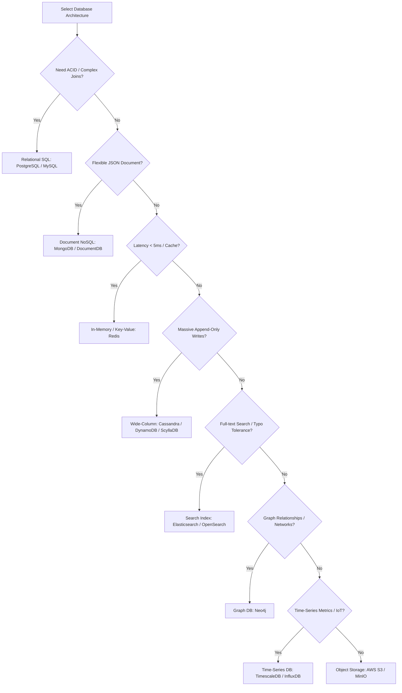

# Database Decision Cheat Sheet

A structured architectural framework for choosing the correct database technology based on workloads, access patterns, and scale constraints.

---

## 1. Requirements Engineering: Functional (FR) vs. Non-Functional (NFR)

Before designing any system or selecting database engines, you must cleanly separate what the system **does** from how it **performs**.

```text
               System Design Prompt
                        │
                        ▼
             The "What vs. How" Filter
             ┌──────────┴──────────┐
             ▼                     ▼
    Functional (FR)     Non-Functional (NFR)
     "What it does"       "How it performs"
    (User features)      (Scale & Quality)
             │                     │
             ▼                     ▼
     API Definitions        Access Patterns
             │                     │
             └──────────┬──────────┘
                        ▼
                 Database Choice
```

### 💡 Functional Requirements (FR)

- **Definition**: The features, actions, and business use-cases that users or external systems can execute.
- **Examples**:
  - "Users must be able to upload a video."
  - "Users must be able to view their feed."
  - "Drivers must receive nearby ride alerts."
- **Mental Action**: Translate these directly into API endpoints (e.g., `POST /videos`, `GET /feed`).

### 💡 Non-Functional Requirements (NFR)

- **Definition**: The quality attributes, operational limits, scale boundaries, and constraints the system must satisfy to execute the FRs.
- **Examples**:
  - "Uploads must complete within 60 seconds (Latency)."
  - "System must sustain 50,000 active read requests/sec (Throughput)."
  - "Feed data must have 99.99% availability (Reliability)."
- **Mental Action**: Use these to calculate bandwidth, storage volumes, replication needs, and database engine structures.

### 🔄 Mental Model Flow: E-Commerce Example

Imagine the prompt: _"Design an E-Commerce checkout service."_

```text
Step 1: Extract Functional (FR)
   ├── "User adds item to cart" ──► POST /cart
   └── "User checks out"        ──► POST /checkout

Step 2: Derive Non-Functional (NFR)
   ├── Scale: 10M active checkouts/day ──► ~115 requests/sec average (p99 peak = 1,000 rps)
   ├── Latency: Checkout API response must be < 200ms
   └── Consistency: Inventory deductions must have ACID guarantees (no double-selling)

Step 3: Map to Database Choices
   ├── Shopping Cart (FR) + High Write / low relation (NFR) ──► Redis (In-memory KV)
   └── Order Ledger (FR) + ACID consistency NFR             ──► PostgreSQL (Relational SQL)
```

---

## 2. The 8-Question Decision Framework

Before selecting a database by name, you must answer these 8 architectural questions:

```text
Requirements ──► Access Patterns ──► Database Choice ──► Trade-offs
```

### 1. Data Model (What does the data look like?)

- **Relational (Structured tables, schemas)**: Users, Orders, Payments, Invoices.
  - _Choice:_ **PostgreSQL / MySQL**
- **Document (Unstructured / Semi-structured JSON)**: Blogs, Comments, Profiles, user settings.
  - _Choice:_ **MongoDB / DocumentDB**
- **Key-Value (Simple lookups)**: Sessions, HTML Caches, Feature Flags, Shopping Carts.
  - _Choice:_ **Redis / Memcached**
- **Graph (High-depth relationships, traversal)**: Friends, Followers, Recommendation engines.
  - _Choice:_ **Neo4j**
- **Time-Series (Appends, timestamps)**: System CPU/Memory metrics, IoT telemetry.
  - _Choice:_ **TimescaleDB / InfluxDB**

### 2. Workload Type (Read-heavy or Write-heavy?)

- **Read-Heavy (Feed generation, streaming metadata)**: Netflix, YouTube, Instagram Feeds.
  - _Requirements:_ Read replicas, in-memory caching, CDN caching.
  - _Standard Stack:_ **PostgreSQL (Primary) + Redis (Cache)**
- **Write-Heavy (IoT, chat tracking, telemetry logging)**: Gaming leaderboards, logging pipelines, messaging services.
  - _Requirements:_ Append-only structures, partition keys, write buffers.
  - _Standard Stack:_ **Cassandra / ScyllaDB / DynamoDB**

### 3. Relationships & Joins (Are the tables related?)

- **Highly Relational (Frequent JOINs, transaction safety)**: Orders, Payments, Users, Coupons.
  - _Choice:_ **PostgreSQL / MySQL**
- **Low / No Relationships (Self-contained documents)**: User preferences, isolated item descriptors.
  - _Choice:_ **MongoDB / DynamoDB**

### 4. Consistency Model (Strong vs. Eventual?)

- **Strong Consistency (Strict ACID transactions)**: Financial ledgers, double-entry banking, stock inventory.
  - _Choice:_ **PostgreSQL / MySQL** (with multi-zone synchronous replication)
- **Eventual Consistency (High availability, partition tolerance)**: Social media likes, view counters, news feeds.
  - _Choice:_ **DynamoDB / Cassandra**

### 5. Query Complexity (How will we query the data?)

- **Complex Queries (Aggregations, GROUP BY, window functions)**: Business Intelligence, analytics.
  - _Choice:_ **SQL / Columnar DBs** (ClickHouse / Snowflake)
- **Simple Queries (Point lookups, key-based fetches)**: Fetching profile by ID, storing JSON payloads.
  - _Choice:_ **MongoDB / DynamoDB / Redis**

### 6. Scale Constraints (What is the volume of data?)

- **Small to Moderate (Up to a few million rows)**:
  - _Choice:_ A single **PostgreSQL** instance is highly sufficient.
- **Massive Scale (Billions of rows, high request volume)**:
  - _Choice:_ **DynamoDB / Cassandra / Bigtable** (using horizontal sharding and partition keys)

### 7. Search Requirements (Is full-text search needed?)

- **Advanced Search (Typo-tolerance, fuzzy matching, ranking)**: Search bars, catalog searches.
  - _Rule:_ Do not query relational databases with `%LIKE%` for text search.
  - _Choice:_ **Elasticsearch / OpenSearch**

### 8. Latency Requirements (How fast do queries need to be?)

- **Sub-millisecond / Microsecond**: Caches, session lookups, real-time leaderboard fetches.
  - _Choice:_ In-memory stores like **Redis** or **Aerospike**.

---

## 3. Database Selection Matrix

| Workload / Requirement               | Database Choice      | Why?                                                             |
| :----------------------------------- | :------------------- | :--------------------------------------------------------------- |
| **ACID / Financial Transactions**    | PostgreSQL           | Robust transaction logging, ACID compliance, strict constraints. |
| **High-Performance Caching**         | Redis                | In-memory key-value data structures with microsecond latency.    |
| **Flexible JSON Document Storage**   | MongoDB              | Document index, flexible schemas, auto-sharding.                 |
| **Time-Series / Telemetry**          | TimescaleDB          | Relational SQL wrapper optimized for time-partitioned appends.   |
| **Massive Write Throughput**         | Cassandra / ScyllaDB | LSM-Tree storage engine optimized for rapid append-only writes.  |
| **Serverless Scalability**           | DynamoDB             | Managed NoSQL with predictable single-digit millisecond scale.   |
| **Full-Text / Typo-Tolerant Search** | Elasticsearch        | Inverted-index search engine supporting relevance scoring.       |
| **Analytical OLAP Queries**          | ClickHouse           | Columnar data store designed for massive aggregations.           |
| **Highly-Connected Data / Networks** | Neo4j                | Native index-free adjacency graph traversals.                    |

---

## 4. Decision Flowchart



---

## 5. Case Studies: Multi-Database Architectures

Most production systems use multiple specialized data stores depending on their access patterns:

### Case Study 1: Uber

- **Users, Trips, Payments (ACID Truth)**: **PostgreSQL** (requires transactional consistency).
- **Real-time Driver Locations (High Latency Geospatial)**: **Redis** (in-memory geospatial indices for nearby queries).

### Case Study 2: Instagram

- **Profiles, Posts, Relationships (Source of Truth)**: **PostgreSQL**.
- **User Timeline Feeds (Highly Cached Reads)**: **Redis**.
- **Images & Videos (Binary Assets)**: **Object Storage (S3 / CDN)**.
- **Explore Tab / Search**: **Elasticsearch**.

### Case Study 3: WhatsApp

- **Message Logs (Massive Append Writes)**: **Cassandra** or **DynamoDB** (NoSQL scaling for write traffic).
- **User Presence State (Active, Last Seen)**: **Redis** (fast in-memory tracking).
- **Profile Images / Media**: **Object Storage (S3)**.

### Case Study 4: YouTube

- **Video Metadata & Comments**: **PostgreSQL** (structured relationships).
- **Video Files**: **Object Storage / CDN**.
- **Search Queries**: **Elasticsearch**.
- **Recommendation Engine**: **Vector Database** (e.g. Pinecone / Milvus).
- **Global Views Caching**: **Redis**.

---

## 6. The "Access Pattern" Mindset Shift

In system design interviews, do not select database names blindly. Match the **access pattern** to the **database technology**.

```text
❌ Bad Interviewer Answer: "We will use NoSQL because it is scalable."
✅ Senior Interviewer Answer: "The service performs millions of simple key-based lookups with very few complex queries. DynamoDB offers predictable low-latency reads and scales horizontally without sharding overhead."
```

### Access Pattern Directory

- **Lookup by unique ID**: Redis, DynamoDB (O(1) lookups).
- **Complex multi-table Joins**: PostgreSQL, MySQL.
- **Flexible Schema JSON storage**: MongoDB.
- **Full-text typo-tolerant search**: Elasticsearch.
- **Continuous timestamped appends**: TimescaleDB, InfluxDB.
- **High-depth graph relationships traversal**: Neo4j.
- **OLAP analytical reporting (aggregations)**: ClickHouse.
