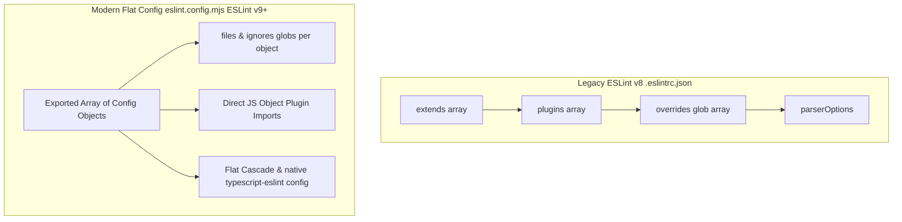
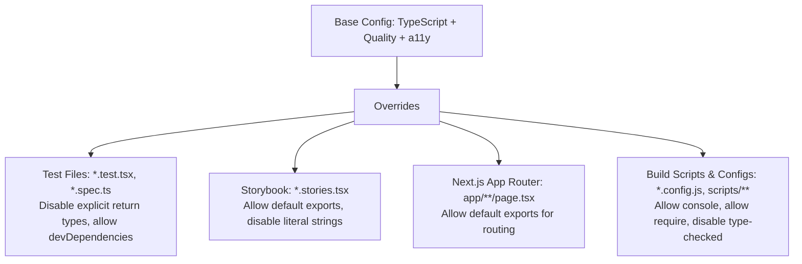

# ESLint Master Configuration & Architecture Cheatsheet

> A battle-tested, enterprise-grade ESLint cheatsheet covering Core Code Quality, TypeScript Type-Checking, Web Accessibility (a11y), React & Hooks, Storybook, i18n, Security, Testing, and Granular Overrides for small-to-large production codebases.

---

## Table of Contents

1. [Architectural Overview & Config Systems](#1-architectural-overview--config-systems)
   - [Modern Flat Config (`eslint.config.mjs`) vs Legacy (`.eslintrc.json`)](#modern-flat-config-eslintconfigmjs-vs-legacy-eslintrcjson)
   - [The 7 Functional Plugin Pillars](#the-7-functional-plugin-pillars)
2. [Accessibility & a11y (`jsx-a11y`) Strict Tier](#2-accessibility--a11y-jsx-a11y-strict-tier)
   - [Rule Matrix & Enforcement Strategy](#rule-matrix--enforcement-strategy)
   - [Critical Pitfalls Standard AI & Boilerplates Miss](#critical-pitfalls-standard-ai--boilerplates-miss)
3. [TypeScript & Strict Type-Checked Rules](#3-typescript--strict-type-checked-rules)
   - [Type-Aware Linting Configuration](#type-aware-linting-configuration)
   - [Zero-Unsafe Rules (`any`, promises, null checks)](#zero-unsafe-rules-any-promises-null-checks)
4. [React, Next.js & React Compiler](#4-react-nextjs--react-compiler)
   - [React 19 & React Compiler Rules](#react-19--react-compiler-rules)
   - [Hooks & Dependency Integrity](#hooks--dependency-integrity)
5. [Storybook Suite (`eslint-plugin-storybook`)](#5-storybook-suite-eslint-plugin-storybook)
   - [CSF3 & Story Structure Guardrails](#csf3--story-structure-guardrails)
6. [Internationalization & i18n (`@formatjs` / `i18next`)](#6-internationalization--i18n-formatjs--i18next)
   - [Literal String Detection & Message Quality](#literal-string-detection--message-quality)
7. [Code Quality, Imports & Performance](#7-code-quality-imports--performance)
   - [Import Boundaries & Circular Dependency Prevention](#import-boundaries--circular-dependency-prevention)
   - [Barrel File Prevention & Tree-Shaking](#barrel-file-prevention--tree-shaking)
8. [Testing & Security Guardrails](#8-testing--security-guardrails)
   - [Jest & React Testing Library Rules](#jest--react-testing-library-rules)
   - [Playwright E2E Rules](#playwright-e2e-rules)
   - [Security & Injection Vulnerabilities](#security--injection-vulnerabilities)
9. [Granular Overrides Strategy (Small to Enterprise)](#9-granular-overrides-strategy-small-to-enterprise)
10. [Production-Ready Config Files (Copy-Paste)](#10-production-ready-config-files-copy-paste)
    - [A. Modern Flat Config (`eslint.config.mjs` - ESLint v9+)](#a-modern-flat-config-eslintconfigmjs---eslint-v9)
    - [B. Legacy Config (`.eslintrc.json` - Next.js / ESLint v8)](#b-legacy-config-eslintrcjson---nextjs--eslint-v8)
11. [CI/CD & Git Pre-Commit Automation (`husky` + `lint-staged`)](#11-cicd--git-pre-commit-automation-husky--lint-staged)

---

## 1. Architectural Overview & Config Systems

### Modern Flat Config (`eslint.config.mjs`) vs Legacy (`.eslintrc.json`)



### The 7 Functional Plugin Pillars

```
┌─────────────────────────────────────────────────────────────────────────────┐
│                           The 7 ESLint Plugin Pillars                       │
├──────────────────────────┬───────────────────────────────┬──────────────────┤
│ Domain                   │ Primary Plugin Packages       │ Core Objective   │
├──────────────────────────┼───────────────────────────────┼──────────────────┤
│ 1. Accessibility (a11y)  │ eslint-plugin-jsx-a11y        │ WCAG 2.1/2.2 AA  │
├──────────────────────────┼───────────────────────────────┼──────────────────┤
│ 2. Type Safety           │ @typescript-eslint/eslint-plugin, @typescript-eslint/parser │ Zero any/unhandled │
├──────────────────────────┼───────────────────────────────┼──────────────────┤
│ 3. UI & Framework        │ eslint-plugin-react, react-hooks, @next/eslint-plugin-next │ Hooks & Rendering│
├──────────────────────────┼───────────────────────────────┼──────────────────┤
│ 4. Design System/Stories │ eslint-plugin-storybook       │ CSF3 Validation  │
├──────────────────────────┼───────────────────────────────┼──────────────────┤
│ 5. Internationalization  │ @formatjs/eslint-plugin       │ Hardcoded strings│
├──────────────────────────┼───────────────────────────────┼──────────────────┤
│ 6. Architecture & Quality│ eslint-plugin-import, sonarjs, unicorn, barrel-files │ Imports & Tree-shake│
├──────────────────────────┼───────────────────────────────┼──────────────────┤
│ 7. Testing & Security    │ testing-library, jest, playwright, security │ Testing queries  │
└──────────────────────────┴───────────────────────────────┴──────────────────┘
```

---

## 2. Accessibility & a11y (`jsx-a11y`) Strict Tier

### Rule Matrix & Enforcement Strategy

Do not leave critical accessibility rules at `"warn"`. Warnings are routinely ignored during crunch time. Make non-negotiable WCAG criteria `"error"`.

| Rule Name | Severity | WCAG Success Criterion | Architectural Rationale |
| :--- | :---: | :--- | :--- |
| `jsx-a11y/alt-text` | `error` | SC 1.1.1 (Non-text Content) | Enforces `alt` on ``, `<area>`, `<input type="image">`, and `<object>`. |
| `jsx-a11y/anchor-is-valid` | `error` | SC 2.1.1 (Keyboard) | Bans `<a href="#">` and `<a>` tags without valid navigation targets. |
| `jsx-a11y/aria-props` | `error` | SC 4.1.2 (Name, Role, Value) | Prevents misspelled ARIA attributes (e.g. `aria-labeledby` vs `aria-labelledby`). |
| `jsx-a11y/aria-proptypes` | `error` | SC 4.1.2 (Name, Role, Value) | Enforces correct data types (boolean vs string vs ID reference list). |
| `jsx-a11y/aria-role` | `error` | SC 4.1.2 (Name, Role, Value) | Ensures role values are valid WAI-ARIA specs (bans typos like `role="buttton"`). |
| `jsx-a11y/click-events-have-key-events` | `error` | SC 2.1.1 (Keyboard) | Guarantees that any onClick handler is paired with onKeyDown, onKeyUp, or onKeyPress. |
| `jsx-a11y/heading-has-content` | `error` | SC 1.3.1 (Info and Relationships) | Prevents empty `<h1>`–`<h6>` tags that confuse screen reader rotor outlines. |
| `jsx-a11y/interactive-supports-focus` | `error` | SC 2.1.1 (Keyboard) | Ensures any element with an interactive role (`button`, `tab`) is focusable (`tabindex="0"`). |
| `jsx-a11y/label-has-associated-control`| `error` | SC 3.3.2 (Labels or Instructions) | Guarantees form inputs have an explicit `<label htmlFor="...">` or wrapping `<label>`. |
| `jsx-a11y/no-autofocus` | `error` | SC 2.4.3 (Focus Order) | Bans `autoFocus` props which disorient screen reader users and cause sudden viewport jumps. |
| `jsx-a11y/no-noninteractive-element-interactions` | `error` | SC 4.1.2 (Name, Role, Value) | Prevents adding click handlers directly to `<main>`, `<div>`, `<p>`, `<ul>`, or `<article>`. |
| `jsx-a11y/no-noninteractive-tabindex` | `error` | SC 2.4.3 (Focus Order) | Disallows `tabIndex="0"` on non-interactive semantic elements (`<article>`, `<section>`). |
| `jsx-a11y/no-static-element-interactions` | `error` | SC 4.1.2 (Name, Role, Value) | Flags `<div>` or `<span>` elements with click events without an explicit role. |
| `jsx-a11y/role-has-required-aria-props` | `error` | SC 4.1.2 (Name, Role, Value) | Ensures composite widgets have required state attributes (e.g. `role="checkbox"` requires `aria-checked`). |
| `jsx-a11y/no-redundant-roles` | `warn` | Clean DOM | Warns against redundant native mappings like `<button role="button">` or `<nav role="navigation">`. |
| `jsx-a11y/media-has-caption` | `warn` | SC 1.2.2 (Captions) | Flags `<video>` and `<audio>` tags missing `<track kind="captions">`. |

### Critical Pitfalls Standard AI & Boilerplates Miss
1. **`no-autofocus` Ignored:** Most AI generators inject `autoFocus` on modal inputs by default. This violates accessibility unless paired with intentional dialog lifecycle focus trapping.
2. **Missing `htmlFor` vs Nested Controls:** Boilerplates often use `<label>Username <input /></label>`. Strict mode requires verifying both label association and screen reader recognition across mobile WebKit.
3. **`autocomplete-valid` Missing:** Not adding `jsx-a11y/autocomplete-valid` leads to broken browser autofill for motor-impaired and cognitive-disability users.

---

## 3. TypeScript & Strict Type-Checked Rules

### Type-Aware Linting Configuration
Type-checked linting analyzes variable types from `tsconfig.json`, catching asynchronous floating bugs and unsafe type coercions that standard linting cannot see.

```json
{
  "parser": "@typescript-eslint/parser",
  "parserOptions": {
    "projectService": true,
    "tsconfigRootDir": "__dirname"
  }
}
```

### Zero-Unsafe Rules

| Rule Name | Severity | Problem It Solves |
| :--- | :---: | :--- |
| `@typescript-eslint/no-floating-promises` | `error` | Prevents unhandled asynchronous Promise rejections (forgotten `await`). |
| `@typescript-eslint/no-misused-promises` | `error` | Prevents passing async functions into synchronous callback slots (e.g., `array.forEach(async ...)`). |
| `@typescript-eslint/no-explicit-any` | `error` | Enforces type safety; mandates `unknown` with type narrowing instead of `any`. |
| `@typescript-eslint/no-unsafe-assignment` | `error` | Blocks assigning untyped `any` data to strongly typed state/variables. |
| `@typescript-eslint/no-unsafe-member-access` | `error` | Prevents runtime `TypeError: cannot read properties of undefined` on untyped objects. |
| `@typescript-eslint/no-unsafe-call` | `error` | Blocks invoking values typed as `any` as functions. |
| `@typescript-eslint/no-unsafe-return` | `error` | Prevents accidentally returning `any` from functions that declare concrete return types. |
| `@typescript-eslint/strict-boolean-expressions` | `warn` | Prevents falsy number bugs (e.g. `items.length && <List />` rendering `0` on screen). |
| `@typescript-eslint/consistent-type-imports` | `error` | Enforces `import type { Foo } from './foo'` to optimize bundler tree-shaking and avoid circular runtime cycles. |

---

## 4. React, Next.js & React Compiler

### React 19 & React Compiler Rules

With React 18/19 and the React Compiler, explicit memoization (`useMemo`, `useCallback`) is automated, but strict rules of hooks must be enforced.

```json
{
  "plugins": ["react", "react-hooks", "@next/next", "react-compiler"],
  "rules": {
    "react-hooks/rules-of-hooks": "error",
    "react-hooks/exhaustive-deps": "error",
    "react/jsx-key": ["error", { "checkFragmentShorthand": true, "checkKeyMustBeforeSpread": true, "warnOnDuplicates": true }],
    "react/no-array-index-key": "error",
    "react/jsx-no-useless-fragment": "error",
    "react/self-closing-comp": "error",
    "react/no-unstable-nested-components": ["error", { "allowAsProps": true }],
    "@next/next/no-html-link-for-pages": "error",
    "@next/next/no-img-element": "error",
    "@next/next/no-sync-scripts": "error"
  }
}
```

#### Why `react/no-array-index-key` is an Accessibility & Performance Bug:
When list items are re-ordered or filtered, using index as `key` causes React to reconcile the wrong DOM elements. Form inputs, focus positions, and screen reader announcements map to the incorrect data row.

---

## 5. Storybook Suite (`eslint-plugin-storybook`)

Enforces CSF3 (Component Story Format 3) best practices and story organization:

```json
{
  "plugins": ["storybook"],
  "rules": {
    "storybook/await-interactions": "error",
    "storybook/context-in-play-function": "error",
    "storybook/default-exports": "error",
    "storybook/hierarchy-separator": "warn",
    "storybook/no-redundant-story-name": "warn",
    "storybook/prefer-pascal-case": "error",
    "storybook/use-storybook-expect": "error",
    "storybook/use-storybook-testing-library": "error"
  }
}
```

* **`await-interactions`:** Guarantees that interactive `play` functions (e.g., `await userEvent.click(...)`) are awaited, avoiding race conditions in Chromatic and automated visual regression testing.

---

## 6. Internationalization & i18n (`@formatjs` / `i18next`)

Eliminates hardcoded strings in JSX, ensuring the entire application is localizable and screen-reader ready across multiple languages:

```json
{
  "plugins": ["formatjs"],
  "rules": {
    "formatjs/no-literal-string-in-jsx": ["warn", {
      "exclude": ["&nbsp;", "&copy;", "&middot;", "-", "|", "/", ":"]
    }],
    "formatjs/enforce-default-message": ["error", "literal"],
    "formatjs/enforce-placeholders": "error",
    "formatjs/enforce-id": [
      "error",
      {
        "idInterpolationPattern": "[sha512:contenthash:base64:6]"
      }
    ],
    "formatjs/no-multiple-whitespaces": "error",
    "formatjs/no-camel-case": "warn"
  }
}
```

---

## 7. Code Quality, Imports & Performance

```json
{
  "plugins": ["import", "unicorn", "barrel-files"],
  "rules": {
    "import/order": [
      "error",
      {
        "groups": [
          "builtin",
          "external",
          "internal",
          ["parent", "sibling"],
          "index",
          "object",
          "type"
        ],
        "newlines-between": "always",
        "alphabetize": { "order": "asc", "caseInsensitive": true }
      }
    ],
    "import/no-duplicates": "error",
    "import/no-cycle": ["error", { "maxDepth": 5 }],
    "import/no-self-import": "error",
    "barrel-files/avoid-barrel-files": "warn",
    "unicorn/prefer-node-protocol": "error",
    "unicorn/no-useless-spread": "error",
    "no-console": ["warn", { "allow": ["warn", "error"] }]
  }
}
```

* **`import/no-cycle`:** Detects circular dependency graphs that cause runtime `undefined` component evaluations.
* **`barrel-files/avoid-barrel-files`:** Prevents massive `index.ts` re-export files that degrade Next.js / Vite development server cold start times and break modular tree-shaking.

---

## 8. Testing & Security Guardrails

### Testing Library & Jest
```json
{
  "plugins": ["testing-library", "jest"],
  "rules": {
    "testing-library/await-async-queries": "error",
    "testing-library/no-await-sync-queries": "error",
    "testing-library/no-debugging-utils": "warn",
    "testing-library/no-dom-import": ["error", "react"],
    "testing-library/prefer-screen-queries": "error",
    "testing-library/prefer-user-event": "error",
    "jest/no-disabled-tests": "warn",
    "jest/no-focused-tests": "error",
    "jest/no-identical-title": "error",
    "jest/valid-expect": "error"
  }
}
```

### Security
```json
{
  "plugins": ["security"],
  "rules": {
    "security/detect-eval-with-expr": "error",
    "security/detect-non-literal-regexp": "warn",
    "security/detect-unsafe-regex": "error",
    "security/detect-buffer-noassert": "error"
  }
}
```

---

## 9. Granular Overrides Strategy (Small to Enterprise)



---

## 10. Production-Ready Config Files (Copy-Paste)

### A. Modern Flat Config (`eslint.config.mjs` - ESLint v9+)

```javascript
import js from '@eslint/js';
import tseslint from 'typescript-eslint';
import reactPlugin from 'eslint-plugin-react';
import reactHooksPlugin from 'eslint-plugin-react-hooks';
import jsxA11yPlugin from 'eslint-plugin-jsx-a11y';
import importPlugin from 'eslint-plugin-import';
import storybookPlugin from 'eslint-plugin-storybook';

export default tseslint.config(
  // 1. Global Ignores
  {
    ignores: [
      '**/node_modules/**',
      '**/.next/**',
      '**/dist/**',
      '**/build/**',
      '**/coverage/**',
      '**/storybook-static/**',
      '**/*.d.ts',
    ],
  },

  // 2. Base JS & Quality
  js.configs.recommended,

  // 3. TypeScript Strict Type-Checking
  ...tseslint.configs.strictTypeChecked,
  ...tseslint.configs.stylisticTypeChecked,
  {
    languageOptions: {
      parserOptions: {
        projectService: true,
        tsconfigRootDir: import.meta.dirname,
      },
    },
  },

  // 4. React & React Hooks
  {
    files: ['**/*.{jsx,tsx}'],
    plugins: {
      react: reactPlugin,
      'react-hooks': reactHooksPlugin,
      'jsx-a11y': jsxA11yPlugin,
      import: importPlugin,
    },
    settings: {
      react: { version: 'detect' },
    },
    rules: {
      ...reactPlugin.configs.recommended.rules,
      ...reactPlugin.configs['jsx-runtime'].rules,
      ...reactHooksPlugin.configs.recommended.rules,
      ...jsxA11yPlugin.configs.strict.rules,

      // Core a11y overrides to blocking errors
      'jsx-a11y/click-events-have-key-events': 'error',
      'jsx-a11y/interactive-supports-focus': 'error',
      'jsx-a11y/no-static-element-interactions': 'error',
      'jsx-a11y/no-noninteractive-tabindex': 'error',
      'jsx-a11y/no-autofocus': 'error',
      'jsx-a11y/anchor-is-valid': 'error',

      // React Best Practices
      'react/no-array-index-key': 'error',
      'react/jsx-no-useless-fragment': 'error',
      'react/self-closing-comp': 'error',

      // TypeScript strict overrides
      '@typescript-eslint/no-explicit-any': 'error',
      '@typescript-eslint/no-floating-promises': 'error',
      '@typescript-eslint/consistent-type-imports': [
        'error',
        { prefer: 'type-imports', fixStyle: 'inline-type-imports' },
      ],
    },
  },

  // 5. Storybook Files Override
  {
    files: ['**/*.stories.@(ts|tsx|js|jsx|mjs|cjs)'],
    plugins: {
      storybook: storybookPlugin,
    },
    rules: {
      ...storybookPlugin.configs.recommended.rules,
      'import/no-anonymous-default-export': 'off',
    },
  },

  // 6. Test Files Override
  {
    files: ['**/*.{test,spec}.{ts,tsx}'],
    rules: {
      '@typescript-eslint/no-unsafe-assignment': 'off',
      '@typescript-eslint/no-unsafe-member-access': 'off',
      '@typescript-eslint/no-explicit-any': 'off',
    },
  }
);
```

---

### B. Legacy Config (`.eslintrc.json` - Next.js / ESLint v8)

```json
{
  "root": true,
  "parser": "@typescript-eslint/parser",
  "parserOptions": {
    "project": "./tsconfig.json",
    "ecmaVersion": "latest",
    "sourceType": "module",
    "ecmaFeatures": {
      "jsx": true
    }
  },
  "env": {
    "browser": true,
    "node": true,
    "es2022": true
  },
  "settings": {
    "react": { "version": "detect" },
    "import/resolver": {
      "typescript": { "alwaysTryTypes": true }
    }
  },
  "extends": [
    "eslint:recommended",
    "plugin:@typescript-eslint/recommended-type-checked",
    "plugin:@typescript-eslint/stylistic-type-checked",
    "plugin:react/recommended",
    "plugin:react/jsx-runtime",
    "plugin:react-hooks/recommended",
    "plugin:jsx-a11y/strict",
    "plugin:import/recommended",
    "plugin:import/typescript",
    "next/core-web-vitals",
    "prettier"
  ],
  "plugins": [
    "@typescript-eslint",
    "react",
    "react-hooks",
    "jsx-a11y",
    "import",
    "formatjs"
  ],
  "rules": {
    /* 1. Accessibility (a11y) Strict Guardrails */
    "jsx-a11y/click-events-have-key-events": "error",
    "jsx-a11y/interactive-supports-focus": "error",
    "jsx-a11y/no-static-element-interactions": "error",
    "jsx-a11y/no-noninteractive-tabindex": "error",
    "jsx-a11y/no-autofocus": "error",
    "jsx-a11y/aria-role": "error",
    "jsx-a11y/role-has-required-aria-props": "error",
    "jsx-a11y/anchor-is-valid": "error",
    "jsx-a11y/alt-text": "error",
    "jsx-a11y/heading-has-content": "error",
    "jsx-a11y/no-redundant-roles": "warn",
    "jsx-a11y/media-has-caption": "warn",

    /* 2. TypeScript Strict Guardrails */
    "@typescript-eslint/no-explicit-any": "error",
    "@typescript-eslint/no-floating-promises": "error",
    "@typescript-eslint/no-misused-promises": "error",
    "@typescript-eslint/consistent-type-imports": [
      "error",
      { "prefer": "type-imports", "fixStyle": "inline-type-imports" }
    ],
    "@typescript-eslint/no-unused-vars": [
      "error",
      { "argsIgnorePattern": "^_", "varsIgnorePattern": "^_" }
    ],

    /* 3. React Best Practices */
    "react/no-array-index-key": "error",
    "react/jsx-no-useless-fragment": "error",
    "react/self-closing-comp": "error",
    "react-hooks/rules-of-hooks": "error",
    "react-hooks/exhaustive-deps": "error",

    /* 4. Import & Quality */
    "import/no-duplicates": "error",
    "import/no-cycle": ["error", { "maxDepth": 5 }],
    "import/order": [
      "error",
      {
        "groups": ["builtin", "external", "internal", ["parent", "sibling"], "index", "type"],
        "newlines-between": "always",
        "alphabetize": { "order": "asc", "caseInsensitive": true }
      }
    ],

    /* 5. i18n Validation */
    "formatjs/no-literal-string-in-jsx": ["warn", { "exclude": ["&nbsp;", "-", "|", "/"] }],
    "formatjs/enforce-default-message": ["error", "literal"],
    "formatjs/enforce-placeholders": "error"
  },
  "overrides": [
    {
      "files": ["**/*.stories.@(ts|tsx|js|jsx)"],
      "extends": ["plugin:storybook/recommended"],
      "rules": {
        "import/no-anonymous-default-export": "off",
        "formatjs/no-literal-string-in-jsx": "off"
      }
    },
    {
      "files": ["**/*.{test,spec}.{ts,tsx}"],
      "extends": ["plugin:testing-library/react", "plugin:jest/recommended"],
      "rules": {
        "@typescript-eslint/no-explicit-any": "off",
        "@typescript-eslint/no-unsafe-assignment": "off",
        "formatjs/no-literal-string-in-jsx": "off"
      }
    },
    {
      "files": ["app/**/{page,layout,loading,error,not-found}.tsx"],
      "rules": {
        "import/no-default-export": "off"
      }
    }
  ]
}
```

---

## 11. CI/CD & Git Pre-Commit Automation (`husky` + `lint-staged`)

### 1. `package.json` Scripts & Dependencies
```json
{
  "scripts": {
    "lint": "eslint . --ext .ts,.tsx,.js,.jsx --max-warnings 0",
    "lint:fix": "eslint . --ext .ts,.tsx,.js,.jsx --fix",
    "prepare": "husky install"
  },
  "lint-staged": {
    "*.{ts,tsx,js,jsx}": [
      "eslint --fix --max-warnings 0",
      "prettier --write"
    ],
    "*.{json,md,css,scss}": [
      "prettier --write"
    ]
  }
}
```

### 2. GitHub Actions CI Pipeline Step
```yaml
name: CI Quality Gate

on: [push, pull_request]

jobs:
  lint-and-typecheck:
    runs-on: ubuntu-latest
    steps:
      - uses: actions/checkout@v4
      - uses: actions/setup-node@v4
        with:
          node-version: 20
          cache: 'npm'
      - run: npm ci
      - name: Run ESLint Quality & a11y Gate
        run: npm run lint
      - name: Run TypeScript Compiler Check
        run: npx tsc --noEmit
```
