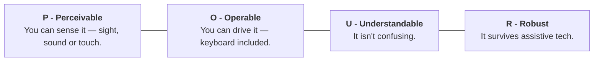
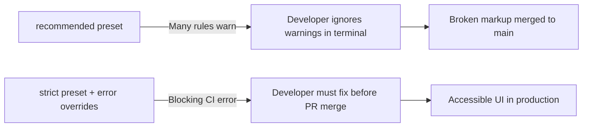

# 01. Accessibility (a11y) Strict Linting & Architecture Guide

> How to configure `eslint-plugin-jsx-a11y` in strict mode to block accessibility regressions before code leaves the developer's machine.
>
> **"Building your product so people with disabilities can actually use it. Not a separate version. The same product."**

---

## Executive Overview: The Foundations of a11y

### 1. The Numeronym: `a 11 y`

```
  a ─── [ 11 letters: ccessibilit ] ─── y  ==>  a11y (Accessibility)
```

> **The Core Philosophy:**
> Never build a "stripped-down accessible version" or a "text-only secondary site". Build **one single accessible product** that works for everyone.

---

### 2. Accessibility Isn't One Need — It's Five Different Ones

```
┌─────────────────────────────────────────────────────────────────────────────────────────────┐
│                           Five Different People. One Product to Build.                      │
├─────────────┬─────────────┬─────────────┬─────────────┬─────────────────────────────────────┤
│ 👁️ Blind    │ 👓 Low Vision│ ⌨️ Motor    │ 👂 Deaf     │ 🧠 Cognitive                        │
├─────────────┼─────────────┼─────────────┼─────────────┼─────────────────────────────────────┤
│ Navigates   │ Needs real  │ Keyboard    │ Needs       │ Clear plain language, calm declutter│
│ entirely by │ color       │ only — no   │ captions    │ layout (e.g. 6 dense lines ->       │
│ screen reader│ contrast    │ mouse at all│ on every    │ 3 clear lines).                     │
│ (AccTree).  │ (≥ 4.5:1).  │ (Tab/Enter).│ video.      │                                     │
├─────────────┼─────────────┼─────────────┼─────────────┼─────────────────────────────────────┤
│ • Headings  │ • High      │ • Tab stops │ • Captions  │ • Simple hierarchy                  │
│ • Alt text  │   contrast  │ • No traps  │ • Audio     │ • Reduced motion                    │
│ • AccName   │ • 400% zoom │ • Roving idx│   transcripts│ • Error prevention                 │
└─────────────┴─────────────┴─────────────┴─────────────┴─────────────────────────────────────┘
```

---

### 3. The Global Standard is WCAG — and it Spells POUR

> **"Four principles. Everything else is detail."**
> _(WCAG 2.2 · Current Version · Official ISO Standard ISO/IEC 40500)_



---

### 4. Disability Isn't Only Permanent

Disability exists across a dynamic spectrum. Building for permanent limitations automatically benefits temporary injuries and situational environments:

```
┌─────────────────────────────────────────────────────────────────────────────┐
│                        The Inclusive Spectrum Model                         │
├─────────────────────┬─────────────────────┬─────────────────────────────────┤
│ PERMANENT           │ TEMPORARY           │ SITUATIONAL                     │
├─────────────────────┼─────────────────────┼─────────────────────────────────┤
│ **One arm**         │ **A broken arm**    │ **Holding a baby**              │
│ A lifelong condition│ Six weeks in a cast │ Checking out one-handed         │
├─────────────────────┴─────────────────────┴─────────────────────────────────┤
│          👉 All three need the EXACT SAME one-handed design. 👈              │
│   "Build for the permanent case — you help almost everyone, some of the time."│
└─────────────────────────────────────────────────────────────────────────────┘
```

---

## 1. Why `plugin:jsx-a11y/strict` Over `recommended`

The `recommended` config leaves several critical rules at `"warn"` or disabled entirely. Warnings do not fail CI builds, allowing teams to accumulate severe accessibility debt.



---

## 2. Complete Rule Matrix & WCAG Success Criteria Mapping

| Rule Name                                         |  Level  | Target Need & Modality | WCAG Criterion                   | Why It Matters                                                            |
| :------------------------------------------------ | :-----: | :--------------------- | :------------------------------- | :------------------------------------------------------------------------ |
| `jsx-a11y/alt-text`                               | `error` | 👁️ Blind               | SC 1.1.1 (Non-text Content)      | Enforces `alt` on ``, `<area>`, `<input type="image">`.              |
| `jsx-a11y/anchor-is-valid`                        | `error` | ⌨️ Motor, 👁️ Blind     | SC 2.1.1 (Keyboard)              | Bans `<a href="#">` and `<a>` without valid `href`.                       |
| `jsx-a11y/aria-props`                             | `error` | 👁️ Blind               | SC 4.1.2 (Name, Role, Value)     | Prevents misspelled ARIA attributes (e.g., `aria-labeledby`).             |
| `jsx-a11y/aria-proptypes`                         | `error` | 👁️ Blind               | SC 4.1.2 (Name, Role, Value)     | Enforces correct data types for ARIA values (boolean vs token).           |
| `jsx-a11y/aria-role`                              | `error` | 👁️ Blind               | SC 4.1.2 (Name, Role, Value)     | Validates role names against W3C WAI-ARIA specification.                  |
| `jsx-a11y/click-events-have-key-events`           | `error` | ⌨️ Motor               | SC 2.1.1 (Keyboard)              | Mandates `onKeyDown` / `onKeyUp` whenever `onClick` is present.           |
| `jsx-a11y/heading-has-content`                    | `error` | 👁️ Blind, 🧠 Cognitive | SC 1.3.1 (Info & Relationships)  | Prevents empty `<h1>`–`<h6>` headings from cluttering screen readers.     |
| `jsx-a11y/interactive-supports-focus`             | `error` | ⌨️ Motor               | SC 2.1.1 (Keyboard)              | Interactive roles must have `tabIndex="0"` or native focusability.        |
| `jsx-a11y/label-has-associated-control`           | `error` | 👁️ Blind, 🧠 Cognitive | SC 3.3.2 (Labels / Instructions) | Guarantees form inputs have an associated `<label>` via `htmlFor`.        |
| `jsx-a11y/no-autofocus`                           | `error` | ⌨️ Motor, 👁️ Blind     | SC 2.4.3 (Focus Order)           | Bans `autoFocus` prop, which causes sudden viewport jumps for users.      |
| `jsx-a11y/no-noninteractive-element-interactions` | `error` | ⌨️ Motor, 👁️ Blind     | SC 4.1.2 (Name, Role, Value)     | Bans click handlers directly on `<main>`, `<div>`, `<article>`, `<ul>`.   |
| `jsx-a11y/no-noninteractive-tabindex`             | `error` | ⌨️ Motor               | SC 2.4.3 (Focus Order)           | Disallows `tabIndex="0"` on non-interactive structural tags.              |
| `jsx-a11y/no-static-element-interactions`         | `error` | ⌨️ Motor               | SC 4.1.2 (Name, Role, Value)     | Blocks `<div>` or `<span>` with click handlers unless given a valid role. |
| `jsx-a11y/role-has-required-aria-props`           | `error` | 👁️ Blind               | SC 4.1.2 (Name, Role, Value)     | e.g., `role="checkbox"` requires `aria-checked="true/false"`.             |
| `jsx-a11y/media-has-caption`                      | `error` | 👂 Deaf                | SC 1.2.2 (Captions)              | Enforces `<track kind="captions">` inside `<video>` elements.             |
| `jsx-a11y/no-redundant-roles`                     | `warn`  | Clean DOM              | Clean AccTree                    | Warns against `<button role="button">` or `<nav role="navigation">`.      |

---

## 3. Critical a11y Pitfalls Standard AI & Boilerplates Miss

### Pitfall 1: `autoFocus` in Modals & Forms

```tsx
// ❌ BAD: Disorients screen reader and keyboard users on render
<input type="text" autoFocus placeholder="Search..." />;

// ✅ GOOD: Shift focus programmatically in useEffect during dialog lifecycle
const searchInputRef = useRef<HTMLInputElement>(null);
useEffect(() => {
  if (isOpen) {
    searchInputRef.current?.focus();
  }
}, [isOpen]);

<input ref={searchInputRef} type="text" placeholder="Search..." />;
```

### Pitfall 2: Custom Buttons without Keyboard Listeners

```tsx
// ❌ BAD: Mouse only, inaccessible to keyboard and screen readers
<div className="btn" onClick={handleClick}>Save Changes</div>

// ✅ GOOD: Use native semantic element
<button type="button" className="btn" onClick={handleClick}>Save Changes</button>
```

### Pitfall 3: Broken Form Label Association

```tsx
// ❌ BAD: Screen reader reads "Edit text" without reading the field label
<span>Email Address</span>
<input type="email" id="email" />

// ✅ GOOD: Explicit htmlFor linkage
<label htmlFor="user-email">Email Address</label>
<input type="email" id="user-email" name="email" />
```

### Pitfall 4: Video Without Synchronized Captions

```tsx
// ❌ BAD: Completely inaccessible to deaf users
<video src="/onboarding.mp4" controls />

// ✅ GOOD: Provide closed captions track
<video controls preload="metadata">
  <source src="/onboarding.mp4" type="video/mp4" />
  <track kind="captions" src="/captions.en.vtt" srcLang="en" label="English Captions" default />
</video>
```

---

## 4. Configuration Snippet (Strict JSON)

```json
{
  "plugins": ["jsx-a11y"],
  "extends": ["plugin:jsx-a11y/strict"],
  "rules": {
    "jsx-a11y/click-events-have-key-events": "error",
    "jsx-a11y/interactive-supports-focus": "error",
    "jsx-a11y/no-static-element-interactions": "error",
    "jsx-a11y/no-noninteractive-tabindex": "error",
    "jsx-a11y/no-autofocus": "error",
    "jsx-a11y/anchor-is-valid": "error",
    "jsx-a11y/alt-text": "error",
    "jsx-a11y/heading-has-content": "error",
    "jsx-a11y/media-has-caption": "error",
    "jsx-a11y/label-has-associated-control": [
      "error",
      {
        "assert": "either",
        "depth": 3
      }
    ]
  }
}
```
