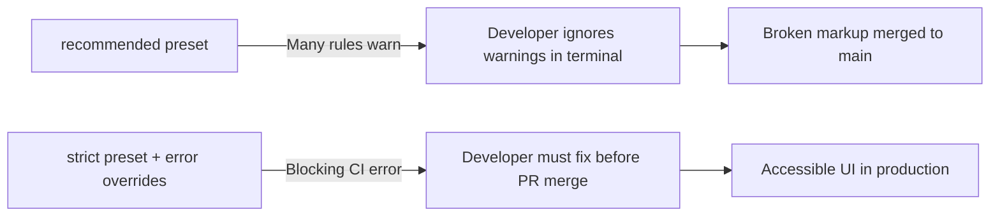

# 01. Accessibility (a11y) Strict Linting Guide

> How to configure `eslint-plugin-jsx-a11y` in strict mode to block accessibility regressions before code leaves the developer's machine.

---

## 1. Why `plugin:jsx-a11y/strict` Over `recommended`

The `recommended` config leaves several critical rules at `"warn"` or disabled entirely. Warnings do not fail CI builds, allowing teams to accumulate severe accessibility debt.



---

## 2. Complete Rule Matrix & WCAG Success Criteria Mapping

| Rule Name                                         |  Level  | WCAG Criterion                    | Why It Matters                                                            |
| :------------------------------------------------ | :-----: | :-------------------------------- | :------------------------------------------------------------------------ |
| `jsx-a11y/alt-text`                               | `error` | SC 1.1.1 (Non-text Content)       | Enforces `alt` on ``, `<area>`, `<input type="image">`.              |
| `jsx-a11y/anchor-is-valid`                        | `error` | SC 2.1.1 (Keyboard)               | Bans `<a href="#">` and `<a>` without valid `href`.                       |
| `jsx-a11y/aria-props`                             | `error` | SC 4.1.2 (Name, Role, Value)      | Prevents misspelled ARIA attributes (e.g., `aria-labeledby`).             |
| `jsx-a11y/aria-proptypes`                         | `error` | SC 4.1.2 (Name, Role, Value)      | Enforces correct data types for ARIA values (boolean vs token).           |
| `jsx-a11y/aria-role`                              | `error` | SC 4.1.2 (Name, Role, Value)      | Validates role names against W3C WAI-ARIA specification.                  |
| `jsx-a11y/click-events-have-key-events`           | `error` | SC 2.1.1 (Keyboard)               | Mandates `onKeyDown` / `onKeyUp` whenever `onClick` is present.           |
| `jsx-a11y/heading-has-content`                    | `error` | SC 1.3.1 (Info and Relationships) | Prevents empty `<h1>`–`<h6>` headings from cluttering screen readers.     |
| `jsx-a11y/interactive-supports-focus`             | `error` | SC 2.1.1 (Keyboard)               | Interactive roles must have `tabIndex="0"` or native focusability.        |
| `jsx-a11y/label-has-associated-control`           | `error` | SC 3.3.2 (Labels or Instructions) | Guarantees form inputs have an associated `<label>` via `htmlFor`.        |
| `jsx-a11y/no-autofocus`                           | `error` | SC 2.4.3 (Focus Order)            | Bans `autoFocus` prop, which causes sudden viewport jumps for users.      |
| `jsx-a11y/no-noninteractive-element-interactions` | `error` | SC 4.1.2 (Name, Role, Value)      | Bans click handlers directly on `<main>`, `<div>`, `<article>`, `<ul>`.   |
| `jsx-a11y/no-noninteractive-tabindex`             | `error` | SC 2.4.3 (Focus Order)            | Disallows `tabIndex="0"` on non-interactive structural tags.              |
| `jsx-a11y/no-static-element-interactions`         | `error` | SC 4.1.2 (Name, Role, Value)      | Blocks `<div>` or `<span>` with click handlers unless given a valid role. |
| `jsx-a11y/role-has-required-aria-props`           | `error` | SC 4.1.2 (Name, Role, Value)      | e.g., `role="checkbox"` requires `aria-checked="true/false"`.             |
| `jsx-a11y/no-redundant-roles`                     | `warn`  | Clean DOM                         | Warns against `<button role="button">` or `<nav role="navigation">`.      |
| `jsx-a11y/media-has-caption`                      | `warn`  | SC 1.2.2 (Captions)               | Enforces `<track kind="captions">` inside `<video>` elements.             |

---

## 3. Critical a11y Pitfalls Standard AI & Boilerplates Miss

### Pitfall 1: `autoFocus` in Modals & Forms

```tsx
// ❌ BAD: Disorients screen reader and keyboard users on render
<input type="text" autoFocus placeholder="Search..." />;

// ✅ GOOD: Shift focus programmatically in useEffect during dialog lifecycle
const searchInputRef = useRef<HTMLInputElement>(null);
useEffect(() => {
  if (isOpen) {
    searchInputRef.current?.focus();
  }
}, [isOpen]);

<input ref={searchInputRef} type="text" placeholder="Search..." />;
```

### Pitfall 2: Custom Buttons without Keyboard Listeners

```tsx
// ❌ BAD: Mouse only, inaccessible to keyboard and screen readers
<div className="btn" onClick={handleClick}>Save Changes</div>

// ✅ GOOD: Use native semantic element
<button type="button" className="btn" onClick={handleClick}>Save Changes</button>
```

### Pitfall 3: Broken Form Label Association

```tsx
// ❌ BAD: Screen reader reads "Edit text" without reading the field label
<span>Email Address</span>
<input type="email" id="email" />

// ✅ GOOD: Explicit htmlFor linkage
<label htmlFor="user-email">Email Address</label>
<input type="email" id="user-email" name="email" />
```

---

## 4. Configuration Snippet (Strict JSON)

```json
{
  "plugins": ["jsx-a11y"],
  "extends": ["plugin:jsx-a11y/strict"],
  "rules": {
    "jsx-a11y/click-events-have-key-events": "error",
    "jsx-a11y/interactive-supports-focus": "error",
    "jsx-a11y/no-static-element-interactions": "error",
    "jsx-a11y/no-noninteractive-tabindex": "error",
    "jsx-a11y/no-autofocus": "error",
    "jsx-a11y/anchor-is-valid": "error",
    "jsx-a11y/alt-text": "error",
    "jsx-a11y/heading-has-content": "error",
    "jsx-a11y/label-has-associated-control": [
      "error",
      {
        "assert": "either",
        "depth": 3
      }
    ]
  }
}
```
