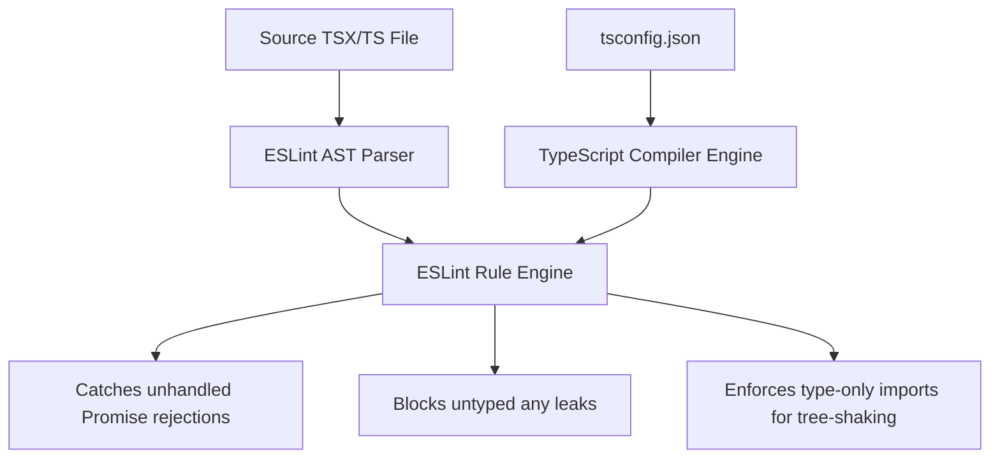

# 02. TypeScript Strict Type-Checked Linting Guide

> How to configure `@typescript-eslint` for type-aware linting to catch unhandled Promise rejections, unsafe `any` leaks, and falsy boolean bugs at compile time.

---

## 1. Type-Aware Linting Architecture

Standard ESLint only looks at the AST structure. **Type-aware linting** queries TypeScript's type checker engine, enabling rules to know the actual inferred types of variables, promises, and functions.



---

## 2. Core Type-Checked Rules Matrix

| Rule Name                                       | Severity | Problem It Solves                                                                            |
| :---------------------------------------------- | :------: | :------------------------------------------------------------------------------------------- |
| `@typescript-eslint/no-floating-promises`       | `error`  | Catches forgotten `await` on async functions that cause silent runtime failures.             |
| `@typescript-eslint/no-misused-promises`        | `error`  | Prevents passing async functions to synchronous handlers (e.g., `array.forEach(async ...)`). |
| `@typescript-eslint/no-explicit-any`            | `error`  | Disallows `any`; enforces `unknown` with explicit type narrowing.                            |
| `@typescript-eslint/no-unsafe-assignment`       | `error`  | Blocks assigning untyped API data to typed state.                                            |
| `@typescript-eslint/no-unsafe-member-access`    | `error`  | Prevents `Cannot read properties of undefined` on untyped objects.                           |
| `@typescript-eslint/no-unsafe-call`             | `error`  | Prevents calling untyped values as functions.                                                |
| `@typescript-eslint/no-unsafe-return`           | `error`  | Prevents returning `any` from functions declaring a concrete return type.                    |
| `@typescript-eslint/strict-boolean-expressions` |  `warn`  | Prevents rendering `0` in JSX via `items.length && <List />`.                                |
| `@typescript-eslint/consistent-type-imports`    | `error`  | Enforces `import type` to optimize bundler tree-shaking and avoid cyclic imports.            |

---

## 3. Real-World Code Examples

### Example 1: Catching Floating Promises

```typescript
// ❌ BAD: Floating promise - if saveUserData fails, the error is swallowed silently!
function handleUpdate() {
  saveUserData({ name: 'Alice' });
}

// ✅ GOOD: Handled with await or explicit .catch()
async function handleUpdate() {
  try {
    await saveUserData({ name: 'Alice' });
  } catch (error) {
    logger.error(error);
  }
}

// ✅ ALSO GOOD: Explicit void operator for intentional fire-and-forget
function handleBackgroundSync() {
  void triggerAnalyticsEvent();
}
```

### Example 2: Type-Only Imports for Clean Bundles

```typescript
// ❌ BAD: May import runtime module overhead even if only types are used
import { User, calculateScore } from './userModule';

// ✅ GOOD: Explicit type separation
import { calculateScore } from './userModule';
import type { User } from './userModule';
```

---

## 4. Configuration Snippet

### Modern Flat Config (`eslint.config.mjs`)

```javascript
import tseslint from 'typescript-eslint';

export default tseslint.config(...tseslint.configs.strictTypeChecked, ...tseslint.configs.stylisticTypeChecked, {
  languageOptions: {
    parserOptions: {
      projectService: true, // ESLint 9+ high-performance type checking
      tsconfigRootDir: import.meta.dirname,
    },
  },
  rules: {
    '@typescript-eslint/no-explicit-any': 'error',
    '@typescript-eslint/no-floating-promises': 'error',
    '@typescript-eslint/consistent-type-imports': [
      'error',
      { prefer: 'type-imports', fixStyle: 'inline-type-imports' },
    ],
    '@typescript-eslint/no-unused-vars': ['error', { argsIgnorePattern: '^_', varsIgnorePattern: '^_' }],
  },
});
```

### Legacy Config (`.eslintrc.json`)

```json
{
  "parser": "@typescript-eslint/parser",
  "parserOptions": {
    "project": "./tsconfig.json",
    "tsconfigRootDir": "__dirname"
  },
  "plugins": ["@typescript-eslint"],
  "extends": ["plugin:@typescript-eslint/recommended-type-checked", "plugin:@typescript-eslint/stylistic-type-checked"],
  "rules": {
    "@typescript-eslint/no-explicit-any": "error",
    "@typescript-eslint/no-floating-promises": "error",
    "@typescript-eslint/consistent-type-imports": [
      "error",
      { "prefer": "type-imports", "fixStyle": "inline-type-imports" }
    ]
  }
}
```
