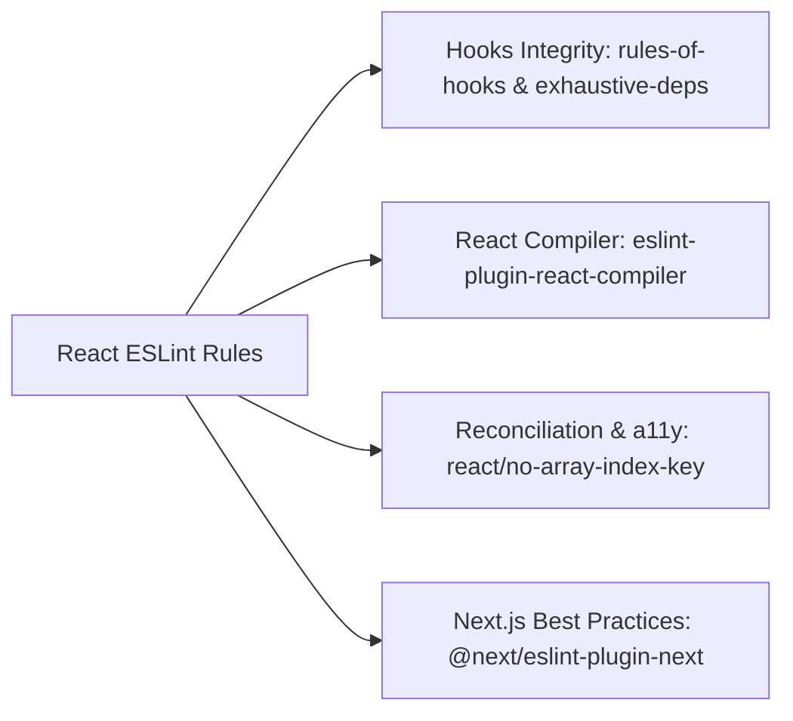

# 03. React, Hooks & React Compiler Linting Guide

> Rules for React 18/19, React Compiler integration, hooks dependency verification, and avoiding JSX accessibility and reconciliation bugs.

---

## 1. Key Rules Overview



---

## 2. Why `react/no-array-index-key` is an a11y & State Bug

Using array indices as keys in React lists causes severe UI, focus, and screen reader glitches when items are added, deleted, or reordered:

```tsx
// ❌ BAD: Reordering items causes inputs and focus rings to stay on the WRONG item
{
  items.map((item, index) => <TodoItem key={index} data={item} />);
}

// ✅ GOOD: Use unique, stable business identifiers
{
  items.map((item) => <TodoItem key={item.id} data={item} />);
}
```

---

## 3. React Compiler (`eslint-plugin-react-compiler`)

With the React Compiler, manual `useMemo` and `useCallback` calls are automated. The compiler requires strict adherence to React's pure component rules:

```json
{
  "plugins": ["react-compiler"],
  "rules": {
    "react-compiler/react-compiler": "error"
  }
}
```

---

## 4. Configuration Snippet

```json
{
  "plugins": ["react", "react-hooks", "@next/next"],
  "rules": {
    "react-hooks/rules-of-hooks": "error",
    "react-hooks/exhaustive-deps": "error",
    "react/jsx-key": [
      "error",
      {
        "checkFragmentShorthand": true,
        "checkKeyMustBeforeSpread": true,
        "warnOnDuplicates": true
      }
    ],
    "react/no-array-index-key": "error",
    "react/jsx-no-useless-fragment": "error",
    "react/self-closing-comp": "error",
    "react/no-unstable-nested-components": ["error", { "allowAsProps": true }],
    "@next/next/no-html-link-for-pages": "error",
    "@next/next/no-img-element": "error",
    "@next/next/no-sync-scripts": "error"
  }
}
```
