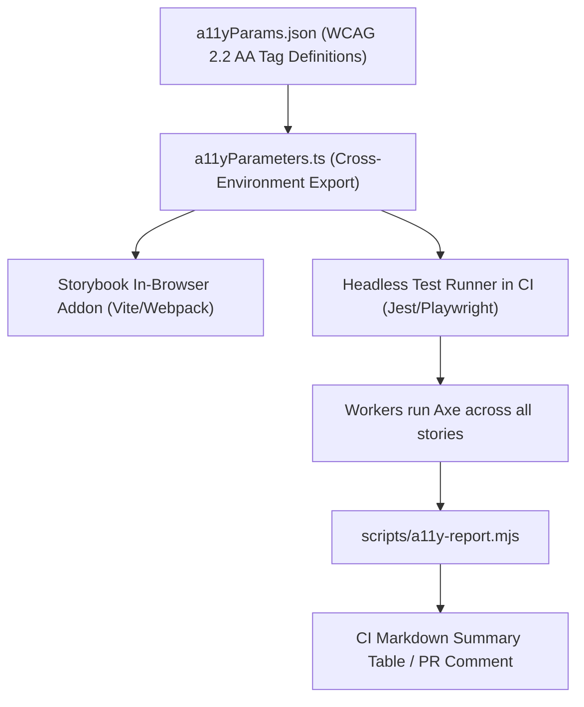

# 04. Storybook & Automated a11y Test-Runner Pipeline

> How to combine `eslint-plugin-storybook` with `@storybook/test-runner` and `@axe-core` to automate 100% WCAG 2.2 AA audits across every UI component variant.

---

## 1. The Single Source of Truth Architecture



---

## 2. File 1: `.storybook/a11yParams.json`

Defines the exact WCAG tag definitions and scopes Axe to the component root (preventing Storybook UI toolbars from triggering false positives):

```json
{
  "context": "#storybook-root",
  "options": {
    "runOnly": {
      "type": "tag",
      "values": ["wcag2a", "wcag2aa", "wcag21a", "wcag21aa", "wcag22aa"]
    }
  },
  "test": "todo"
}
```

---

## 3. File 2: `.storybook/a11yParameters.ts`

Exports the configuration so both the browser preview panel and the headless test runner consume identical rules:

```typescript
import a11yParameters from './a11yParams.json';

/**
 * The single definition of "accessible" in the repository.
 * Both the addon-a11y panel and the test runner read this.
 */
export const A11Y_PARAMETERS = a11yParameters;

/** Exposed separately for route-level Cypress/Playwright auditing */
export const WCAG_22_AA_TAGS: readonly string[] = a11yParameters.options.runOnly.values;
```

---

## 4. File 3: `scripts/a11y-report.mjs` (CI Aggregator Script)

Aggregates individual story violation files into a concise report:

```javascript
#!/usr/bin/env node
import { readFileSync, readdirSync, writeFileSync } from 'node:fs';
import { join, resolve } from 'node:path';
import { parseArgs } from 'node:util';

const USAGE = 'Usage: a11y-report.mjs [--dir .a11y-report] [--markdown] [--out FILE]';

let values;
try {
  ({ values } = parseArgs({
    options: {
      dir: { type: 'string', default: '.a11y-report' },
      markdown: { type: 'boolean', default: false },
      out: { type: 'string' },
    },
  }));
} catch (error) {
  console.error(`${error.message}\n${USAGE}`);
  process.exit(1);
}

const directory = resolve(values.dir);
const outPath = values.out ? resolve(values.out) : null;
const markdown = values.markdown || outPath !== null;

let files;
try {
  files = readdirSync(directory).filter((file) => file.endsWith('.json'));
} catch {
  console.log('No accessibility reports found.');
  process.exit(0);
}

const violationsByRule = new Map();
const violationsByStory = new Map();
let totalViolations = 0;

for (const file of files) {
  const content = JSON.parse(readFileSync(join(directory, file), 'utf8'));
  const storyName = file.replace('.json', '');

  if (content.violations && content.violations.length > 0) {
    violationsByStory.set(storyName, content.violations);

    for (const v of content.violations) {
      totalViolations++;
      const current = violationsByRule.get(v.id) || { count: 0, help: v.help, helpUrl: v.helpUrl };
      current.count += v.nodes.length;
      violationsByRule.set(v.id, current);
    }
  }
}

if (totalViolations === 0) {
  console.log('✅ 100% WCAG 2.2 AA Compliance across all stories!');
  process.exit(0);
}

console.error(`🚨 Found ${totalViolations} accessibility violations across ${violationsByStory.size} stories.`);
// Format and write output...
```

---

## 5. Storybook ESLint Rules (`eslint-plugin-storybook`)

```json
{
  "plugins": ["storybook"],
  "rules": {
    "storybook/await-interactions": "error",
    "storybook/context-in-play-function": "error",
    "storybook/default-exports": "error",
    "storybook/hierarchy-separator": "warn",
    "storybook/prefer-pascal-case": "error",
    "storybook/use-storybook-expect": "error",
    "storybook/use-storybook-testing-library": "error"
  }
}
```
