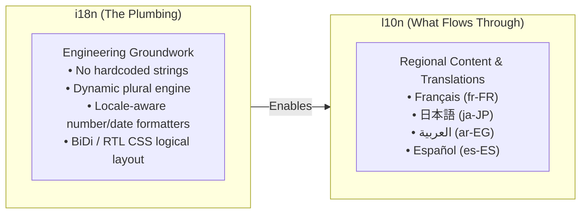
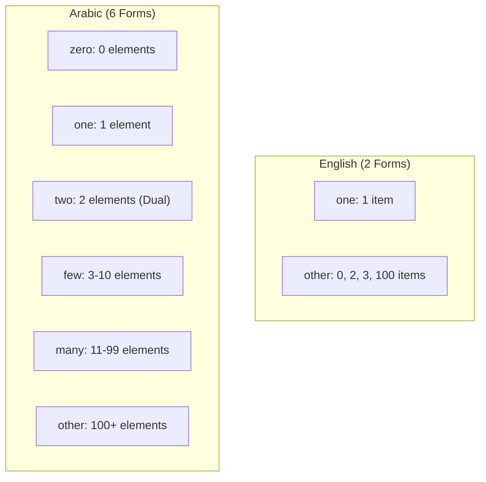

# 05. Internationalization (i18n) & Localization (l10n) Enterprise Linting & Architecture Guide

> Enforcing message quality, eliminating hardcoded strings, validating plural forms across world languages, and integrating native browser `Intl.*` APIs into enterprise CI/CD pipelines.

---

## Executive Overview: The Numeronyms & Core Mental Model

### Why Does Everyone Write "i18n", "a11y", and "l10n"?

Engineers are lazy typists — numeronyms replace long words with their first letter, the count of omitted letters, and the last letter:

```
  i ─── [ 18 letters: nternationalizatio ] ─── n  ==>  i18n (Internationalization)
  a ─── [ 11 letters: ccessibilit        ] ─── y  ==>  a11y (Accessibility)
  l ─── [ 10 letters: ocalizatio         ] ─── n  ==>  l10n (Localization)
  m ─── [ 17 letters: ultilingualizatio  ] ─── n  ==>  m17n (Multilingualization)
  g ─── [ 11 letters: lobalizatio        ] ─── n  ==>  g11n (Globalization)
```



> **The Architectural Law:**
> **"i18n is the plumbing. l10n is what flows through it."**
> Build the system so it can speak any language, format any currency, and render in any direction — **without a single code rewrite**.

---

## 1. The Native Browser `Intl.*` API: "One Value. Four Equally Correct Answers."

**Never hand-roll date, number, currency, or time formatting with custom regex or string manipulation.** The browser already knows every cultural and linguistic rule natively via `Intl.*`.

### The Multi-Locale Formatting Matrix

| Input Value                                | `en-US` (United States)     | `de-DE` (Germany)          | `ja-JP` (Japan)            | `ar-EG` (Egypt)         | Browser API                                                           |
| :----------------------------------------- | :-------------------------- | :------------------------- | :------------------------- | :---------------------- | :-------------------------------------------------------------------- |
| **Currency** (`19.99`, EUR)                | `$19.99` _(or €19.99)_      | `19,99 €`                  | `19.99 €` _(￥20 for JPY)_ | `١٩٫٩٩ ج.م.`            | `new Intl.NumberFormat(locale, { style: 'currency', currency })`      |
| **Date** (`2025-12-25`)                    | `December 25, 2025`         | `25. Dezember 2025`        | `2025年12月25日`           | `٢٥ ديسمبر، ٢٠٢٥`       | `new Intl.DateTimeFormat(locale, { dateStyle: 'long' })`              |
| **Number** (`1234567.89`)                  | `1,234,567.89`              | `1.234.567,89`             | `1,234,567.89`             | `١٬٢٣٤٬٥٦٧٫٨٩`          | `new Intl.NumberFormat(locale)`                                       |
| **Time** (`14:30:00`)                      | `2:30 PM`                   | `14:30`                    | `14:30`                    | `٢:٣٠ م`                | `new Intl.DateTimeFormat(locale, { timeStyle: 'short' })`             |
| **Relative Time** (`-2`, days)             | `2 days ago`                | `vor 2 Tagen`              | `2日前`                    | `قبل يومين`             | `new Intl.RelativeTimeFormat(locale, { numeric: 'auto' })`            |
| **List** (`['Apple', 'Banana', 'Orange']`) | `Apple, Banana, and Orange` | `Apple, Banana und Orange` | `Apple、Banana、Orange`    | `Apple وBanana وOrange` | `new Intl.ListFormat(locale, { style: 'long', type: 'conjunction' })` |

```ts
// ✅ Native Browser Formatting (Zero bundle bloat, zero dependencies)
export const formatters = {
  currency: (amount: number, locale: string, currency = 'USD') =>
    new Intl.NumberFormat(locale, { style: 'currency', currency }).format(amount),

  date: (date: Date, locale: string) => new Intl.DateTimeFormat(locale, { dateStyle: 'long' }).format(date),

  number: (num: number, locale: string) => new Intl.NumberFormat(locale).format(num),

  time: (date: Date, locale: string) => new Intl.DateTimeFormat(locale, { timeStyle: 'short' }).format(date),

  relativeTime: (value: number, unit: Intl.RelativeTimeFormatUnit, locale: string) =>
    new Intl.RelativeTimeFormat(locale, { numeric: 'auto' }).format(value, unit),

  list: (items: string[], locale: string) =>
    new Intl.ListFormat(locale, { style: 'long', type: 'conjunction' }).format(items),
};
```

---

## 2. The Pluralization Trap: `"1 item / 2 items" is an English Assumption`

A common junior anti-pattern is hardcoding binary plurals with ternary operators:

```ts
// 🚨 DANGEROUS JUNIOR CODE: Fails in 80% of world languages!
const text = `${count} ${count === 1 ? 'item' : 'items'}`;
```

### Why Binary Ternaries Break in Production

English has only **2 plural forms** (`one`, `other`). However:

- **Arabic (`ar`)** has **6 plural categories**: `zero`, `one`, `two`, `few` (3-10), `many` (11-99), `other` (100+).
- **Russian (`ru`) / Polish (`pl`)** have **3-4 plural categories**: `one` (1, 21, 31...), `few` (2-4, 22-24...), `many` (5-20, 25-30...), `other` (fractions).
- **Japanese (`ja`) / Chinese (`zh`) / Korean (`ko`)** have **1 form**: `other` (no grammatical plural inflexion).



> **The Plural Rule:**
> **"Let the library or `Intl.PluralRules` pick the form. Never an `if (n === 1)`."**

### Native `Intl.PluralRules` & ICU MessageFormat Example

```ts
// ✅ Native Intl.PluralRules Resolution
function getPluralCategory(count: number, locale: string): Intl.LDMLPluralRule {
  const pr = new Intl.PluralRules(locale);
  return pr.select(count); // returns: 'zero' | 'one' | 'two' | 'few' | 'many' | 'other'
}

console.log(getPluralCategory(2, 'en-US')); // 'other'
console.log(getPluralCategory(2, 'ar-EG')); // 'two'
console.log(getPluralCategory(5, 'ru-RU')); // 'many'
```

---

## 3. Why Strict Linting is Essential for i18n & Enterprise Scaling

1. **Catches Un-translated Strings Before Merging:** Engineers instinctively type `<button>Submit</button>`. Without strict linting, untranslated English leaks to global users.
2. **Prevents String Concatenation Bugs:** Grammatical word order differs across languages (Subject-Verb-Object vs Subject-Object-Verb). Writing `<span>Welcome ` + `<b>{user}</b></span>` breaks German, Japanese, and Arabic grammar.
3. **Protects Translation Memory & Cost:** Inconsistent whitespace (`"Hello "` vs `"Hello"`) or un-escaped HTML creates duplicate strings in TMS (Translation Management Systems like Crowdin, Phrase, Lokalise), multiplying translation costs.
4. **Validates ICU Message Placeholders & Plurals:** Ensures developers don't pass `{userName}` when the translation string expects `{name}`.

---

## 4. Master ESLint Rule Matrix (`@formatjs` & `i18next`)

| Rule Name                           | Recommended Severity | Purpose & Architectural Impact                                                                                 |
| :---------------------------------- | :------------------: | :------------------------------------------------------------------------------------------------------------- |
| `formatjs/no-literal-string-in-jsx` |   `error` / `warn`   | Flags raw strings in JSX that are not wrapped in `<FormattedMessage>` or `intl.formatMessage()`.               |
| `formatjs/enforce-default-message`  |       `error`        | Mandates that a fallback English default message is always provided alongside the message descriptor.          |
| `formatjs/enforce-placeholders`     |       `error`        | Verifies that all message placeholders (e.g. `{userName}`) match the arguments passed to formatting functions. |
| `formatjs/enforce-plural-rules`     |       `error`        | Validates ICU plural rules syntax (e.g., `{count, plural, one {# item} other {# items}}`).                     |
| `formatjs/enforce-id`               |       `error`        | Enforces consistent translation IDs or automated SHA-512 content-based ID generation.                          |
| `formatjs/no-multiple-whitespaces`  |       `error`        | Prevents unnecessary spaces/newlines that corrupt translation memory engines.                                  |
| `formatjs/no-camel-case`            |        `warn`        | Discourages camelCase in message values (e.g., prevents raw variable names leaking into UI).                   |
| `formatjs/no-complex-declarations`  |       `error`        | Disallows deeply nested ternary/logical operators inside message descriptors.                                  |
| `i18next/no-literal-string`         |       `error`        | Alternative rule for `react-i18next` projects flagging unlocalized JSX and attribute strings.                  |

---

## 5. Enterprise ESLint Configuration Snippets

### A. Modern Flat Config (`eslint.config.js`) — FormatJS / React-Intl

```js
import formatjsPlugin from 'eslint-plugin-formatjs';

export default [
  {
    files: ['src/**/*.{js,jsx,ts,tsx}'],
    plugins: {
      formatjs: formatjsPlugin,
    },
    rules: {
      'formatjs/no-literal-string-in-jsx': [
        'error',
        {
          exclude: ['&nbsp;', '&copy;', '&middot;', '&mdash;', '-', '|', '/', ':', '•', '→', '←'],
          includeJSXAttributes: ['placeholder', 'aria-label', 'aria-description', 'title', 'alt'],
        },
      ],
      'formatjs/enforce-default-message': ['error', 'literal'],
      'formatjs/enforce-placeholders': 'error',
      'formatjs/enforce-plural-rules': [
        'error',
        {
          other: true,
          zero: false,
          one: true,
        },
      ],
      'formatjs/enforce-id': [
        'error',
        {
          idInterpolationPattern: '[sha512:contenthash:base64:6]',
        },
      ],
      'formatjs/no-multiple-whitespaces': 'error',
      'formatjs/no-camel-case': 'warn',
      'formatjs/no-complex-declarations': 'error',
    },
  },
  {
    // Exclude test and story files from hardcoded string rules
    files: ['**/*.{test,spec}.{ts,tsx}', '**/*.stories.{ts,tsx}'],
    rules: {
      'formatjs/no-literal-string-in-jsx': 'off',
    },
  },
];
```

### B. Legacy Config (`.eslintrc.json`) — Complete Setup

```json
{
  "plugins": ["formatjs"],
  "rules": {
    "formatjs/no-literal-string-in-jsx": [
      "error",
      {
        "exclude": ["&nbsp;", "&copy;", "&middot;", "-", "|", "/", ":", "•"],
        "includeJSXAttributes": ["placeholder", "aria-label", "aria-description", "title", "alt"]
      }
    ],
    "formatjs/enforce-default-message": ["error", "literal"],
    "formatjs/enforce-placeholders": "error",
    "formatjs/enforce-plural-rules": ["error", { "other": true, "one": true }],
    "formatjs/enforce-id": [
      "error",
      {
        "idInterpolationPattern": "[sha512:contenthash:base64:6]"
      }
    ],
    "formatjs/no-multiple-whitespaces": "error",
    "formatjs/no-camel-case": "warn"
  },
  "overrides": [
    {
      "files": ["**/*.stories.@(ts|tsx|js|jsx)", "**/*.{test,spec}.@(ts|tsx)"],
      "rules": {
        "formatjs/no-literal-string-in-jsx": "off"
      }
    }
  ]
}
```

---

## 6. Real-World Production Code Patterns & Anti-Patterns

### Anti-Pattern 1: Hardcoded String Concatenation

```tsx
// ❌ BAD: Word order is fixed to English; breaks in German/Japanese/Arabic
<span>Hello {user.name}, you have {unreadCount} messages.</span>

// ✅ GOOD: ICU Message with parameter interpolation & pluralization
<FormattedMessage
  defaultMessage="Hello {userName}, you have {count, plural, =0 {no messages} one {# message} other {# messages}}."
  values={{
    userName: user.name,
    count: unreadCount
  }}
/>
```

### Anti-Pattern 2: Unlocalized Accessibility Attributes

```tsx
// ❌ BAD: Screen reader speaks English label even when page is in Japanese
<button type="button" aria-label="Close dialog">
  <CloseIcon />
</button>;

// ✅ GOOD: Accessible label is fully internationalized
const intl = useIntl();
<button
  type="button"
  aria-label={intl.formatMessage({
    id: 'common.actions.closeDialog',
    defaultMessage: 'Close dialog',
  })}
>
  <CloseIcon />
</button>;
```

### Anti-Pattern 3: Hardcoded Physical Direction in CSS/JSX

```tsx
// ❌ BAD: Breaks in Right-to-Left (RTL) locales like Arabic and Hebrew
<div style={{ marginLeft: '16px', textAlign: 'left' }}>
  <span>{title}</span>
</div>

// ✅ GOOD: Use CSS Logical Properties
// margin-inline-start: 1rem; text-align: start;
<div className="start-aligned-container">
  <span>{title}</span>
</div>
```

---

## 7. Enterprise Tooling & CI/CD Pipeline Integration


### 1. Automated String Extraction (`package.json`)

```json
{
  "scripts": {
    "i18n:lint": "eslint src/ --rule 'formatjs/no-literal-string-in-jsx: error'",
    "i18n:extract": "formatjs extract 'src/**/*.{ts,tsx}' --out-file lang/en.json --id-interpolation-pattern '[sha512:contenthash:base64:6]' --format simple",
    "i18n:compile": "formatjs compile 'lang/*.json' --out-dir dist/locales --ast"
  }
}
```

### 2. Pseudo-Localization: The Secret Weapon of Enterprise QA

Pseudo-localization automatically expands strings and replaces characters with accented glyphs to catch hardcoded text and CSS layout clipping before shipping:

```
Original:  "Edit Project Settings"
Pseudo:    "[!!! Ēđıţ Ƥřōĵēćţ Śēţţıńğş ——— !!!]"
```

- **If text remains plain English:** The string was hardcoded and missed the i18n extraction.
- **If text clips/overflows the container:** The CSS layout cannot accommodate 30% longer German or Finnish translations.

---

## 8. Stack Selection & Dynamic Locale Splitting (The Tokyo Rule)

> **"A user in Tokyo should not download your Arabic strings."**
> **"Translations are payload. Treat them like code splitting."**

### 1. Choosing the Right Library for Your Stack

```
┌─────────────────────────────────────────────────────────────────────────────┐
│                       Choosing the Right i18n Library                       │
├───────────────────────┬───────────────────────┬─────────────────────────────┤
│ ⚛️ react-i18next       │ 🔺 next-intl          │ 🌐 react-intl (FormatJS)    │
├───────────────────────┼───────────────────────┼─────────────────────────────┤
│ **The Universal**     │ **Next.js App Router**│ **Enterprise & Big Orgs**   │
│ Any React setup:      │ Built around React    │ Strict, standards-based ICU │
│ Vite, CRA, Remix.     │ Server Components     │ formatting for professional │
│ Most widely used with │ (RSC). Zero client JS │ localization teams & TMS    │
│ huge plugin ecosystem.│ for static strings.   │ pipelines.                  │
└───────────────────────┴───────────────────────┴─────────────────────────────┘
```

### 2. Dual-Axis Splitting: Lazy-Load per Locale AND Namespace

When a user in Tokyo opens your app:

- **`common.ja.json` (12 KB):** Downloaded on initial load.
- **`checkout.ja.json` (8 KB):** Downloaded only when the user visits `/checkout`.
- **`common.ar.json`, `common.fr.json`, `common.de.json`:** **Not sent (0 KB payload wasted).**

```tsx
// One hook, one t() — zero raw strings in JSX
import { useTranslation } from 'react-i18next';

export function Header() {
  const { t } = useTranslation('home'); // loads only 'home' namespace
  return <h1>{t('welcome.message')}</h1>;
}
```

### 3. Bidirectional Layout: Set `dir` Once, Let CSS Do the Mirroring

Never write a whole second RTL stylesheet. Set `<html lang="ar" dir="rtl">` once, and use **CSS Logical Properties**:

```css
/* ❌ BAD: Stuck on left in Arabic RTL */
.btn-submit {
  margin-left: 54px;
}

/* ✅ GOOD: Automatically flips to the right in Arabic RTL */
.btn-submit {
  margin-inline-start: 54px;
}
```

---

## 9. Summary Checklist for Senior & Staff Architects

- [x] **No Hardcoded Strings:** ESLint `formatjs/no-literal-string-in-jsx` or `i18next/no-literal-string` enforced in CI.
- [x] **Zero Binary Plurals:** Pluralization handled strictly through ICU format or `Intl.PluralRules` (never `count === 1 ? 'a' : 'b'`).
- [x] **Lazy-Load Locale Chunks:** Translations split by locale and namespace (`common.ja.json`), never bundled into one monolithic payload.
- [x] **Native Formatters First:** Use `Intl.NumberFormat`, `Intl.DateTimeFormat`, `Intl.RelativeTimeFormat`, `Intl.ListFormat`.
- [x] **CSS Logical Properties:** Replace `margin-left`/`right` with `margin-inline-start`/`end` (`dir="rtl"`).
- [x] **AccTree Language Switching:** Ensure `<html lang="...">` and inline `<span lang="...">` dynamically reflect the active language for screen readers.
