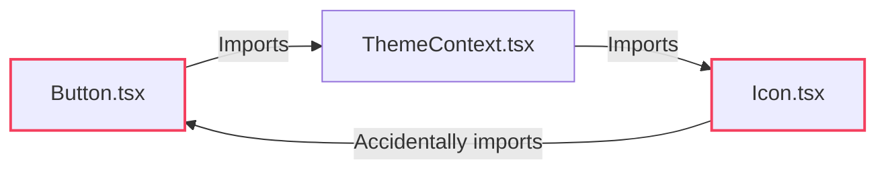

# 06. Code Quality, Imports & Performance Linting

> Eliminating circular dependencies, enforcing clean import boundaries, and preventing massive barrel files from hurting build times.

---

## 1. Preventing Circular Dependencies (`import/no-cycle`)

Circular dependencies occur when Module A imports Module B, which imports Module A. This leads to elusive runtime errors where modules evaluate to `undefined` on page load.



- **The Rule:** `"import/no-cycle": ["error", { "maxDepth": 5 }]`

---

## 2. Preventing Barrel Files (`barrel-files/avoid-barrel-files`)

Re-exporting hundreds of components from a single `index.ts` creates severe bundle bloat and slows down Next.js / Vite development cold-starts by forcing the bundler to parse all modules.

```typescript
// ❌ BAD: Barrel import loads all 150 components in the design system
import { Button } from '@/components';

// ✅ GOOD: Direct modular import
import { Button } from '@/components/Button';
```

---

## 3. Enforcing the Single Source of Truth Import Path (`no-restricted-imports`)

> **"Put the toolkit behind your own components — one import path, always correct as source of truth."**
> **"You remove the inaccessible option before anyone can reach for it."**

In large engineering organizations, leaving library choices open leads to developers reaching for quick, inaccessible shortcuts (`<div onClick>`).

The architectural solution is to wrap headless primitives (**Radix UI**, **Ariakit**, **React Aria**) inside your Design System (`@/components/ui`), and enforce via ESLint that feature teams only import from the design system barrel:

```
┌─────────────────────────────────────────────────────────────────────────────┐
│                 Single Source of Truth Import Guardrail                     │
├─────────────────────────────────────────────────────────────────────────────┤
│ ❌ DISALLOWED DIRECT IMPORTS:                                               │
│   import * as Dialog from '@radix-ui/react-dialog';  // Blocked in CI!      │
│   import { Popover } from 'ariakit/popover';         // Blocked in CI!      │
├─────────────────────────────────────────────────────────────────────────────┤
│ ✅ ENFORCED DESIGN SYSTEM IMPORT:                                           │
│   import { Modal, Popover, Button } from '@/components/ui';                 │
│   (Accessible by default, WAI-ARIA wired, focus-trapped, and token-styled)  │
└─────────────────────────────────────────────────────────────────────────────┘
```

---

## 4. Configuration Snippet

```json
{
  "plugins": ["import", "unicorn", "barrel-files"],
  "rules": {
    "import/order": [
      "error",
      {
        "groups": ["builtin", "external", "internal", ["parent", "sibling"], "index", "object", "type"],
        "newlines-between": "always",
        "alphabetize": { "order": "asc", "caseInsensitive": true }
      }
    ],
    "import/no-duplicates": "error",
    "import/no-cycle": ["error", { "maxDepth": 5 }],
    "import/no-self-import": "error",
    "barrel-files/avoid-barrel-files": "warn",
    "unicorn/prefer-node-protocol": "error",
    "unicorn/no-useless-spread": "error",
    "no-console": ["warn", { "allow": ["warn", "error"] }],

    "no-restricted-imports": [
      "error",
      {
        "paths": [
          {
            "name": "@radix-ui/react-dialog",
            "message": "Import <Modal /> from '@/components/ui' to enforce design system accessibility rules."
          },
          {
            "name": "@radix-ui/react-dropdown-menu",
            "message": "Import <DropdownMenu /> from '@/components/ui'."
          }
        ]
      }
    ]
  }
}
```
