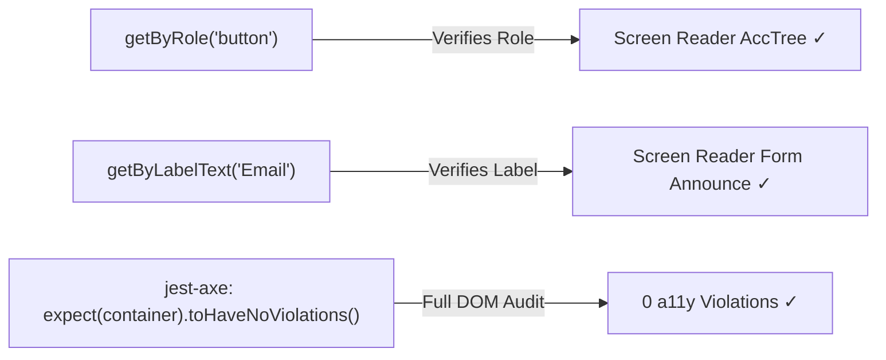

# 07. Testing & Security Linting Architecture Guide

> Enforcing accessible queries, automated `jest-axe` assertions, and eliminating security vulnerabilities in React, Jest, and Playwright suites.
>
> **"If the test can't find it by role, neither can a screen reader."**

---

## Executive Overview: Testing Library Nudges Accessible Code

Testing Library was deliberately architected to interact with the DOM strictly via the **Accessibility Tree (AccTree)**. If you cannot query an element by its accessible role or label, that is an immediate proof that assistive technology cannot use it either.

```
┌─────────────────────────────────────────────────────────────────────────────┐
│                 Why Accessible Queries Matter in CI/CD                      │
├──────────────────────────────────────┬──────────────────────────────────────┤
│ ✅ ACCESSIBLE CODE (Tests Pass):     │ ❌ INACCESSIBLE CODE (Tests Fail):   │
├──────────────────────────────────────┼──────────────────────────────────────┤
│ `getByRole('button', { name: /submit/i })` │ `getByRole('button', ...)` throws:   │
│ `getByLabelText(/email address/i)`   │ `Unable to find role="button"`       │
│                                      │ (Because it was written as           │
│ 👉 Screen readers announce role!     │  `<div onClick={submit}>`!)          │
└──────────────────────────────────────┴──────────────────────────────────────┘
```



---

## 1. The Testing Query Hierarchy

Always query the DOM in order of user accessibility:

| Priority Tier                   | Query Method                                                                            | Why It Matters                                                                                                                         |
| :------------------------------ | :-------------------------------------------------------------------------------------- | :------------------------------------------------------------------------------------------------------------------------------------- |
| **1. Accessible** _(Preferred)_ | `screen.getByRole('button', { name: /save/i })`<br>`screen.getByLabelText(/username/i)` | Simulates actual screen reader traversal and verifies accessibility roles and names.                                                   |
| **2. Semantic**                 | `screen.getByAltText(/company logo/i)`<br>`screen.getByPlaceholderText(/search/i)`      | Verifies presence of non-text content alternatives.                                                                                    |
| **3. Text Content**             | `screen.getByText(/terms and conditions/i)`                                             | Queries visible text (usable for static text nodes).                                                                                   |
| **4. Last Resort** _(Avoid)_    | `screen.getByTestId('save-button')`                                                     | ⚠️ **False confidence!** An element with `data-testid` can be completely broken for keyboard and screen reader users while tests pass. |

---

## 2. Automated Axe-Core Assertions (`jest-axe` / `@axe-core/react`)

```tsx
import React from 'react';
import { render, screen } from '@testing-library/react';
import userEvent from '@testing-library/user-event';
import { axe, toHaveNoViolations } from 'jest-axe';
import { CheckoutForm } from './CheckoutForm';

expect.extend(toHaveNoViolations);

describe('CheckoutForm Accessibility & Functionality', () => {
  it('renders with zero accessibility violations and supports full keyboard flow', async () => {
    const { container } = render(<CheckoutForm />);

    // 1. Automated WCAG 2.1/2.2 audit on rendered DOM
    const results = await axe(container);
    expect(results).toHaveNoViolations(); // $ jest-axe: 0 accessibility violations

    // 2. Query strictly by accessible roles
    const submitBtn = screen.getByRole('button', { name: /submit order/i });
    const emailInput = screen.getByLabelText(/email address/i);

    // 3. Simulate authentic user events
    await userEvent.type(emailInput, 'alex@example.com');
    await userEvent.click(submitBtn);

    expect(screen.getByRole('status')).toHaveTextContent(/order processed/i);
  });
});
```

---

## 3. Strict ESLint Rules Matrix (`testing-library`, `jest`, `security`)

| Rule Name                                 | Severity | Purpose & Impact                                                                                         |
| :---------------------------------------- | :------: | :------------------------------------------------------------------------------------------------------- |
| `testing-library/prefer-screen-queries`   | `error`  | Mandates using `screen.getByRole` instead of destructuring `getByRole` from `render()`.                  |
| `testing-library/prefer-user-event`       | `error`  | Enforces `@testing-library/user-event` over legacy `fireEvent` to dispatch full browser event sequences. |
| `testing-library/no-container`            | `error`  | Disallows `container.querySelector('div.btn')` which bypasses accessibility tree testing.                |
| `testing-library/no-node-access`          | `error`  | Bans traversing `element.children` or `element.parentElement`.                                           |
| `testing-library/no-debugging-utils`      |  `warn`  | Prevents leftover `screen.debug()` calls from cluttering CI test logs.                                   |
| `jest/no-focused-tests`                   | `error`  | Prevents accidentally committed `fit()` or `describe.only()` from skipping entire test suites.           |
| `security/detect-unsafe-regex`            | `error`  | Detects exponential backtracking Regular Expressions (ReDoS vulnerabilities).                            |
| `security/detect-eval-with-expr`          | `error`  | Blocks `eval()` execution with dynamic string expressions.                                               |
| `security/detect-non-literal-fs-filename` |  `warn`  | Flags file system operations with unvalidated user input (path traversal risks).                         |

---

## 4. Production ESLint Configuration Snippet

```json
{
  "plugins": ["testing-library", "jest", "security"],
  "rules": {
    "testing-library/prefer-screen-queries": "error",
    "testing-library/prefer-user-event": "error",
    "testing-library/no-container": "error",
    "testing-library/no-node-access": "error",
    "testing-library/no-await-sync-queries": "error",
    "testing-library/no-debugging-utils": "warn",
    "jest/no-focused-tests": "error",
    "jest/no-disabled-tests": "warn",
    "jest/valid-expect": "error",
    "security/detect-eval-with-expr": "error",
    "security/detect-unsafe-regex": "error",
    "security/detect-buffer-noassert": "error"
  }
}
```
