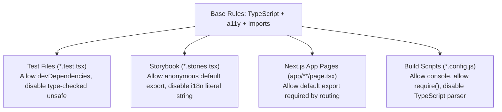

# 08. Granular Overrides Strategy

> How to configure scoped override blocks for tests, Storybook stories, scripts, and Next.js App Router route files so developers aren't blocked by irrelevant rules.

---

## 1. The Overrides Architecture



---

## 2. Configuration Snippet (Overrides Array)

```json
{
  "overrides": [
    {
      "files": ["**/*.stories.@(ts|tsx|js|jsx)"],
      "extends": ["plugin:storybook/recommended"],
      "rules": {
        "import/no-anonymous-default-export": "off",
        "formatjs/no-literal-string-in-jsx": "off"
      }
    },
    {
      "files": ["**/*.{test,spec}.{ts,tsx}"],
      "extends": ["plugin:testing-library/react", "plugin:jest/recommended"],
      "rules": {
        "@typescript-eslint/no-explicit-any": "off",
        "@typescript-eslint/no-unsafe-assignment": "off",
        "@typescript-eslint/no-unsafe-member-access": "off",
        "formatjs/no-literal-string-in-jsx": "off"
      }
    },
    {
      "files": ["app/**/{page,layout,loading,error,not-found}.tsx"],
      "rules": {
        "import/no-default-export": "off"
      }
    },
    {
      "files": ["scripts/**/*.js", "*.config.js", "*.config.mjs"],
      "rules": {
        "no-console": "off",
        "@typescript-eslint/no-var-requires": "off"
      }
    }
  ]
}
```
