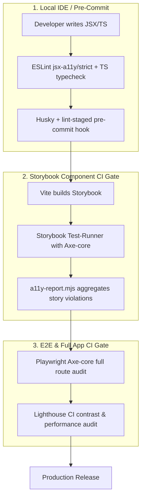

# ESLint & Automated Quality Architecture Suite

> A modular, section-by-section master reference for enterprise-grade linting, type-checked safety, accessibility automation, React Compiler rules, Storybook test-runner pipelines, i18n, and CI/CD quality gates.

---

## 📑 Modular Architecture Guide

Navigate to the specific module below for deep-dive rules, architectural rationales, and copy-paste configurations:

| Module                                                                         | Focus Area                               | Key Highlights                                                                                                            |
| :----------------------------------------------------------------------------- | :--------------------------------------- | :------------------------------------------------------------------------------------------------------------------------ |
| 📖 [**01. Accessibility (a11y) Strict Mode**](01-a11y-strict.md)               | `eslint-plugin-jsx-a11y`                 | WCAG 2.1/2.2 AA mapping, blocking error matrix, common AI code mistakes (`no-autofocus`, `label-has-associated-control`). |
| 📘 [**02. TypeScript Strict Type-Checked**](02-typescript-typechecked.md)      | `@typescript-eslint`                     | `projectService: true`, zero-`any` policy, floating promise catches, strict boolean checks, type-only imports.            |
| ⚛️ [**03. React, Hooks & React Compiler**](03-react-hooks-compiler.md)         | `react`, `react-hooks`, `react-compiler` | React 19 compiler integration, exhaustive deps verification, `react/no-array-index-key` a11y bug prevention.              |
| 🎨 [**04. Storybook & a11y Test Automation**](04-storybook-a11y-automation.md) | `storybook`, `axe-core`, Test-Runner     | Storybook CSF3 rules, plus the complete `a11yParams.json`, `a11yParameters.ts`, and `a11y-report.mjs` CI pipeline.        |
| 🌐 [**05. Internationalization & i18n**](05-i18n-formatjs.md)                  | `@formatjs/eslint-plugin`                | Hardcoded string detection in JSX, translation ID hash automation, placeholder validation.                                |
| 🧹 [**06. Code Quality, Imports & Performance**](06-code-quality-imports.md)   | `import`, `unicorn`, `barrel-files`      | Circular dependency detection (`import/no-cycle`), import sorting, barrel file prevention for tree-shaking.               |
| 🛡️ [**07. Testing & Security Guardrails**](07-testing-security.md)             | `testing-library`, `jest`, `security`    | Accessible query priorities (`getByRole`), Playwright rules, prototype pollution & unsafe regex prevention.               |
| 🔀 [**08. Granular Overrides Strategy**](08-overrides-monorepo.md)             | Multi-tier configuration                 | Scoped overrides for `*.test.tsx`, `*.stories.tsx`, Next.js `app/**/page.tsx`, and build scripts.                         |
| 🚀 [**09. Production Copy-Paste Configs**](09-production-configs.md)           | Flat & Legacy Configs                    | Ready-to-use `eslint.config.mjs` (ESLint 9+), `.eslintrc.json` (ESLint 8 / Next.js), Husky, and GitHub Actions CI.        |

---

## 🏛️ End-to-End Linting & Automated Auditing Pipeline

